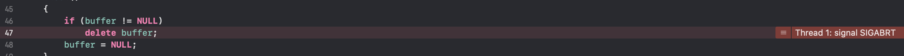
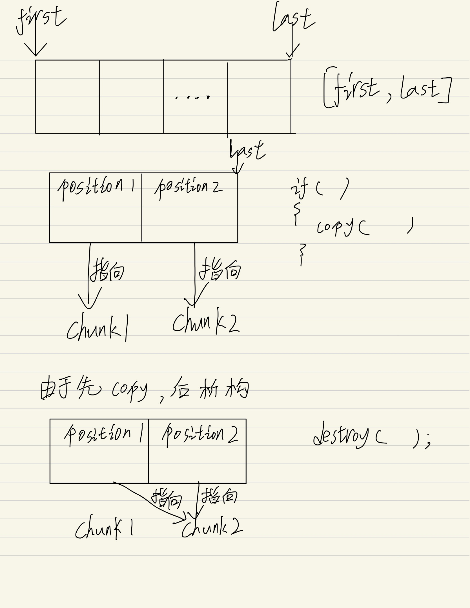

# 傻哭啦 university 学习记录

## 这是什么? 

记录一下咸鱼的日常翻滚。

## 学习进度

<details>
<summary>Week1～2: 学习编写简单的sgi stl</summary>

> 传送门: [GraVity0-stl](https://github.com/yytgravity/Daily-learning-record/tree/master/第1～2周/GraVity0_stl)

### Question 1 ： vector编写过程中的安全问题思考：
- [x] 1、 浅拷贝引起的double free：
    首先我们先看一段代码
    
```c++
#include <iostream>
#include <vector>

using std::cout; using std::endl;

class test
{
public:
    test() {cout << "调用构造函数" << endl;}
    test(const test&) {cout << "调用拷贝构造函数" << endl;}
    ~test(){cout << "调用析构函数" << endl;}
};

int main(int argc, char **argv)
{
    cout << "定义局部变量：" << endl;
    test x;
    cout << endl;

    std::vector<test> demo;
    cout << "存放在容器：" << endl;
    demo.push_back(x);
    cout << endl;

    cout << "程序结束！！！" << endl;
    return 0;
}
```


push_back代码：
```c++
        void push_back(const _Tp &__value) {
            if (_M_finish != _M_end_of_storage) {
                construct(_M_finish, __value);
                ++_M_finish;
            } else {
                _M_insert_aux(end(), __value);
            }
        }
```
没有备用空间将会调用 _M_insert_aux，该函数中包含了新空间的处理，这里因为我们是第一次push_back，并不会出现无备用空间的情况，所以暂时不做考虑。

vector的push_back在执行时，调用了一次拷贝构造函数，程序结束时调用两次析构函数，分别对应变量x和vector中的一个元素。

我们知道在没做拷贝构造函数的声明时，程序会默认调用一个浅拷贝，根据上面的例子，如果我们让他来对一个指针进行浅拷贝，在第二次析构的时候就会触发double free。

我们来看下面的一个double free 的示例：

```c++
#include <vector>
#include <unistd.h>
#include <stdio.h>
#include <string.h>
 
using namespace std;
class test
{
public:
    test() :buffer(NULL)
    {
        buffer = new char[100];
        strcpy(buffer, "12344556788");
    }
    
    /*test(const test& src)
    {
        printf("copy assign function\r\n");
    }*/
    /*
    test(const test& src)
    {
        buffer = src.buffer;
        printf("copy assign function\r\n");
    }
    */
    /*
    test(const test& src)
    {
        buffer = new char[200];
        memcpy(buffer,src.buffer,strlen(src.buffer));
        printf("copy assign function\r\n");
    }
    */
    
    ~test()
    {
        if (buffer != NULL)
            delete buffer;
        buffer = NULL;
    }
public:
    char *buffer;
};
 
void fun()
{
    test a;
    vector<test>  demo;
    demo.push_back(a);
}
 
int main(int argc, char* argv[])
{
    fun();
    printf("finish\r\n");
    getchar();
    return 0;
}

```


可以看到xcode给出了我们double free的报错。

我们可以模拟一下默认给出的拷贝构造函数：

```c++
    test(const test& src)
    {
        buffer = src.buffer;
        printf("copy assign function\r\n");
    }
```
如果去掉其中的浅拷贝，也就是像下面这样则不会触发double free。
```c++
    test(const test& src)
    {
        printf("copy assign function\r\n");
    }
```
我们将拷贝构造函数换为深拷贝：

```c++
    test(const test& src)
    {
        buffer = new char[200];
        memcpy(buffer,src.buffer,strlen(src.buffer));
        printf("copy assign function\r\n");
    }
```
也可以避免double free。

- [x] 2、de1ctf stl题目的思考：
> 传送门: [题目和exp](https://github.com/yytgravity/Daily-learning-record/tree/master/第1～2周/de1ctf-stl_container)
题目的漏洞位置： 在erase的操作过程中出现了double free

```c++
            else
            {
                auto b =  mVector->begin();
                for (int i=0;index >i;i++)
                    b++;
                mVector->erase(b);
                puts("done!");
            }
        }
```
我们先来看一下erase的底层实现：

当我们申请了两个chunk时，position1中储存了一个指向chunk1的指针，position2中存储了一个指向chunk2的指针。
在进行判断时显然position1+1并没有指向end，所以他就会调用copy将指向chunk2的指针拷贝到position1，而且copy的实现本质上是一个浅拷贝，所以我们接下来的destory就会第一次free掉chunk2。
之后第二次执行erase时，position1已经是最后一个元素，对其直接进行析构，此时chunk2就会再次被free。



- [x] 3、 erase存在的缺陷


还是上面的那段代码，这个问题说起来有点抽象，我们继续上图：

根据图我们可以很轻易的看出，我们想要删除的是 1 但是执行的却是 5 的 析构函数，我们在构造2这个对象时会通过new给他分配一个内存，但是此时再删除2时并没有调用他的析构函数（delete将内存释放），只是把它在内存空间给覆盖了
可以用一段代码来测试一下：

```c++
#include <iostream>
#include <vector>
#include <unistd.h>
#include <stdio.h>
#include <string.h>

using namespace std;

class test
{
    public:
        int i;
    public:
        test(int a)
        {
            i = a;
            cout << "construct i = " << i << endl;
        }
        test(const test &a)
        {
            i = a.i;
            cout << "copy construct i = " << i << endl;
        }
        ~test()
        {
            cout << "=== destruct i = " << i << endl;
        }
};

void show(vector<test>& num)
{
    vector<test>::iterator index;
    index = num.begin();
    while(num.end() != index)
    {
        cout << (*index).i << "  ";
        index++;
    }
    cout << endl;
}
 
int main()
{
    vector<test> num;
    for(int i = 0; i < 6; i++)
    {
        num.push_back(test(i));
    }
    
    cout << "==look here== " << endl;
 
    show(num);
    num.erase(num.begin()+1);
    show(num);
    num.erase(num.begin()+1);
    show(num);
    num.erase(num.begin()+1);
    show(num);
 
    cout << "finish" << endl;
    getchar();
    return 0;
}
```


可以看到输出中调用的析构函数和要删除的对象并不匹配。

### Question 2 ：为什么实现了uninitialized_xxx和copy/fill这样两组不同的函数：
copy/fill 是调用重载的运算符=，这就需要复制的目的地已经初始化。
uninitialized_copy/fill 是依次调用拷贝构造函数。目标区间是未初始化的，应该用uninitialized_copy/fill。

- 误用危害？：

  - 1、如果已经构造的区域，被uninitialized_xxx再次构造，在uninitialized_xxx构造之前，并不会调用之前类的析构函数，可能存在潜在的泄漏（比如复制构造函数的主体抛出，会出现内存泄漏？）
 - 2、fill错误使用：这个就可能性很多了（未定义）。
 
### Question 3 ：绘制每个容器在内存里的对象存储图


### Question 4 ：测试题目
传送门: [小测试](https://github.com/yytgravity/Daily-learning-record/tree/master/第1～2周/小测验)

### Question 5 ：学习一下师傅们的漏洞思路：
1.sad师傅：

```
	1.vector容器在增加元素个数的时候，会根据剩余空间考虑是不是要重新分配一块内存来存储。
	而误用的流程就是：在fooA函数中获取容器的一个元素，之后调用fooB函数，在fooB函数中又调用了pushback等增加元素的操作触发了vector的resize,这时候返回fooA函数再使用之前获取的元素就是已经被析构的了。
	这个误用不仅仅会出现在vector中，所有增删操作会让容器重新分配的内存的都会出现。
	经测试asan会显示uaf
	https://paste.ubuntu.com/p/SCtjVMCxxk/
	2.vector的assign操作如果assign的newsize比原有size小，则会将后面多余的元素全部析构。而在遍历容器元素又错误调用了assign之后再使用已经被释放的元素就会造成uaf
	经测试asan会显示uaf
	poc中遍历原大小为10的vector在遍历第五个元素时调用assign将size变为3，此时再使用当前遍历到的第五个元素就会uaf
	https://paste.ubuntu.com/p/hnP9QVk7JK/
	3.为容器erase添加一层新封装的时候如果没有判断删除pos的值会导致删除不存在的元素。
	如下poc，为erase添加新封装remove后没有判断pos的值不能为负数，则用户可以调用remove删除不存在的元素。
	#include <vector>
	using namespace std;
	void remove(int pos, vector<int> vec) {
 	   	vec.erase(vec.begin() + pos);
	}
	int main() {
  	  	vector<int> lll;
  	  	lll.push_back(1);
   	 	remove(-1, lll);
   		return 0;
	}
```
2.pkfxxx师傅:

```
    发现在vector容器的insert和emplace这个两个函数中，在pos位置就地构造元素时，都是直接使用赋值=，如果类型T使用的是默认的赋值构造函数且含有指针类型，
则在参数元素被析构之后，vector容器中还会保留一份副本，会导致UAF。
poc： https://paste.ubuntu.com/p/SHBDQm8G7B/
在linux用asan测试可得到UAF的log
解决办法就是给容器里的类型重载赋值运算符，除此之外，对于有指针类型的类，一定要定义其拷贝构造函数以及对赋值运算符重载，不然很容易出类似的问题。
```
3.f00l师傅：

- vector 

​	pop_back后end迭代器会前向移动一个单位，但是这里它并没有检查移动后的end是否超前于begin，这样如果多次对vector pop，那么end就会超出本vector的范围，那么就会发生越界读写。asan编译后抛出 heap overflow的警告

- list

​	是erase的锅，如果在你疯狂对list进行erase，在它为空的时候，里面会有一个head node，由于list是双向循环链表，这时head node就会指向它自己，此刻在进行erase，就会对head node进行析构，然后释放对应内存，但是list里的erase函数会返回一个指向erase的结点的后继结点的迭代器，这样我们会拿到一个指向已释放内存的指针，会造成uaf。asan编译后会抛use after free的警告。

poc //我把两个写在一起了
```c++
#include <iostream>
#include "stl_alloc.h"
#include "stl_iterator.h"
#include "stl_vector.h"
#include "stl_list.h"
#include "stl_pair.h"
#include "stl_hashtable.h"
#include <vector>
#include<list>
int main() {
    f00l_stl::vector<int>v1(2,10);
    f00l_stl::vector<int>v2(1,10);
    f00l_stl::vector<int>v3(3,10);
    v2.pop_back();
    v2.pop_back();
    v2.pop_back();
    v2.pop_back();
    v2.push_back(0xdeadbeef); //在这里可以把deadbeef写到v1里,越界读写
    //int a1 = v1.at((size_t)&v2/4+1);
    f00l_stl::list<int>l;  
    auto iterator  = l.begin();
    bool a = v1.empty();
    auto m = l.erase(iterator); //在这里会返回一个已经释放的迭代器
    if(a)
        std::cout<<"good"<<std::endl;
    else
        std::cout<<v1[1]<<std::endl;
    //std::cout << "Hello, World!" << std::endl;
    return 0;
}
```

</details>

<details>
<summary>Week2.5～3:（番外）学习hongfuzz</summary>

传送门: [Full-speed Fuzzing在honggfuzz上的应用笔记](https://github.com/yytgravity/Daily-learning-record/tree/master/第2.5周--honggfuzz番外)

刚开始入门学习honggfuzz，先记录一下fuzz的流程，我们先从honggfuzz.c的main函数看起：
首先在最开始的解析命令行参数的cmdlineParse函数中，会将hfuzz.feedback.dynFileMethod默认设置为_HF_DYNFILE_SOFT，即基于软件的反馈驱动fuzz。如果命令行中有-x选项，表示采用static/dry mode，即不采用反馈驱动。

```
bool cmdlineParse(int argc, char* argv[], honggfuzz_t* hfuzz) {
    *hfuzz = (honggfuzz_t){
        
        ..........
        
        .feedback =
            {
                .feedbackMap = NULL,
                .feedback_mutex = PTHREAD_MUTEX_INITIALIZER,
                .bbFd = -1,
                .blacklistFile = NULL,
                .blacklist = NULL,
                .blacklistCnt = 0,
                .skipFeedbackOnTimeout = false,
                .dynFileMethod = _HF_DYNFILE_SOFT,
                .state = _HF_STATE_UNSET,
            },
        
        ........
            
    };

```

跳过上面的初始化流程，我们来到：
```
    setupRLimits();
    setupSignalsPreThreads();
    fuzz_threadsStart(&hfuzz);
```
fuzz_threadsStart的参数是一个结构体，下面是他的定义：
```
typedef struct {
    struct {
        size_t threadsMax;
        size_t threadsFinished;
        uint32_t threadsActiveCnt;
        pthread_t mainThread;
        pid_t mainPid;
        pthread_t threads[_HF_THREAD_MAX];
    } threads;
    struct {
        const char* inputDir;
        const char* outputDir;
        DIR* inputDirPtr;
        size_t fileCnt;
        const char* fileExtn;
        bool fileCntDone;
        size_t newUnitsAdded;
        char workDir[PATH_MAX];
        const char* crashDir;
        const char* covDirNew;
        bool saveUnique;
        size_t dynfileqCnt;
        pthread_rwlock_t dynfileq_mutex;
        struct dynfile_t* dynfileqCurrent;
        TAILQ_HEAD(dyns_t, dynfile_t) dynfileq;
        bool exportFeedback;
    } io;
    struct {
        int argc;
        const char* const* cmdline;
        bool nullifyStdio;
        bool fuzzStdin;
        const char* externalCommand;
        const char* postExternalCommand;
        const char* feedbackMutateCommand;
        bool netDriver;
        bool persistent;
        uint64_t asLimit;
        uint64_t rssLimit;
        uint64_t dataLimit;
        uint64_t coreLimit;
        bool clearEnv;
        char* env_ptrs[128];
        char env_vals[128][4096];
        sigset_t waitSigSet;
    } exe;
    struct {
        time_t timeStart;
        time_t runEndTime;
        time_t tmOut;
        time_t lastCovUpdate;
        int64_t timeOfLongestUnitInMilliseconds;
        bool tmoutVTALRM;
    } timing;
    struct {
        const char* dictionaryFile;
        TAILQ_HEAD(strq_t, strings_t) dictq;
        size_t dictionaryCnt;
        size_t mutationsMax;
        unsigned mutationsPerRun;
        size_t maxFileSz;
    } mutate;
    struct {
        bool useScreen;
        char cmdline_txt[65];
        int64_t lastDisplayMillis;
    } display;
    struct {
        bool useVerifier;
        bool exitUponCrash;
        const char* reportFile;
        pthread_mutex_t report_mutex;
        size_t dynFileIterExpire;
        bool only_printable;
        bool minimize;
        bool switchingToFDM;
    } cfg;
    struct {
        bool enable;
        bool del_report;
    } sanitizer;
    struct {
        fuzzState_t state;
        feedback_t* feedbackMap;
        int bbFd;
        pthread_mutex_t feedback_mutex;
        const char* blacklistFile;
        uint64_t* blacklist;
        size_t blacklistCnt;
        bool skipFeedbackOnTimeout;
        dynFileMethod_t dynFileMethod;
    } feedback;
    struct {
        size_t mutationsCnt;
        size_t crashesCnt;
        size_t uniqueCrashesCnt;
        size_t verifiedCrashesCnt;
        size_t blCrashesCnt;
        size_t timeoutedCnt;
    } cnts;
    struct {
        bool enabled;
        int serverSocket;
        int clientSocket;
    } socketFuzzer;
    /* For the Linux code */
    struct {
        int exeFd;
        hwcnt_t hwCnts;
        uint64_t dynamicCutOffAddr;
        bool disableRandomization;
        void* ignoreAddr;
        const char* symsBlFile;
        char** symsBl;
        size_t symsBlCnt;
        const char* symsWlFile;
        char** symsWl;
        size_t symsWlCnt;
        uintptr_t cloneFlags;
        bool kernelOnly;
        bool useClone;
    } linux;
    /* For the NetBSD code */
    struct {
        void* ignoreAddr;
        const char* symsBlFile;
        char** symsBl;
        size_t symsBlCnt;
        const char* symsWlFile;
        char** symsWl;
        size_t symsWlCnt;
    } netbsd;
} honggfuzz_t;
```

接下来进入fuzz_threadsStart：

```
void fuzz_threadsStart(honggfuzz_t* hfuzz) {
    if (!arch_archInit(hfuzz)) {
        LOG_F("Couldn't prepare arch for fuzzing");
    }
    if (!sanitizers_Init(hfuzz)) {
        LOG_F("Couldn't prepare sanitizer options");
    }

    if (hfuzz->socketFuzzer.enabled) {
        /* Don't do dry run with socketFuzzer */
        LOG_I("Entering phase - Feedback Driven Mode (SocketFuzzer)");
        hfuzz->feedback.state = _HF_STATE_DYNAMIC_MAIN;
    } else if (hfuzz->feedback.dynFileMethod != _HF_DYNFILE_NONE) {
        LOG_I("Entering phase 1/3: Dry Run");
        hfuzz->feedback.state = _HF_STATE_DYNAMIC_DRY_RUN;
    } else {
        LOG_I("Entering phase: Static");
        hfuzz->feedback.state = _HF_STATE_STATIC;
    }

    for (size_t i = 0; i < hfuzz->threads.threadsMax; i++) {
        if (!subproc_runThread(
                hfuzz, &hfuzz->threads.threads[i], fuzz_threadNew, /* joinable= */ true)) {
            PLOG_F("Couldn't run a thread #%zu", i);
        }
    }
}
```
fuzz_threadsStart函数中不是static/dry mode设置当前state为_HF_STATE_DYNAMIC_DRY_RUN，进入第一阶段Dry Run。

接下来调用subproc_runThread
```
bool subproc_runThread(
    honggfuzz_t* hfuzz, pthread_t* thread, void* (*thread_func)(void*), bool joinable) {
    pthread_attr_t attr;

    pthread_attr_init(&attr);
    pthread_attr_setdetachstate(
        &attr, joinable ? PTHREAD_CREATE_JOINABLE : PTHREAD_CREATE_DETACHED);
    pthread_attr_setstacksize(&attr, _HF_PTHREAD_STACKSIZE);
    pthread_attr_setguardsize(&attr, (size_t)sysconf(_SC_PAGESIZE));

    if (pthread_create(thread, &attr, thread_func, (void*)hfuzz) < 0) {
        PLOG_W("Couldn't create a new thread");
        return false;
    }

    pthread_attr_destroy(&attr);

    return true;
}
```
在该函数中通过pthread_create函数来调用fuzz_threadNew函数。
fuzz_threadNew调用了fuzz_fuzzLoop函数：
```
    ......
    
        if (hfuzz->socketFuzzer.enabled) {
            fuzz_fuzzLoopSocket(&run);
        } else {
            fuzz_fuzzLoop(&run);
        }
    
    ......
    
```
cfuzz_fuzzLoop函数主要需要注意fuzz_fetchInput和subproc_Run这两个函数。
```
static voidcfuzz_fuzzLoop(run_t* run) {
    
    ...........
    
    if (!fuzz_fetchInput(run)) {
        if (run->global->cfg.minimize && fuzz_getState(run->global) == _HF_STATE_DYNAMIC_MINIMIZE) {
            fuzz_setTerminating();
            LOG_I("Corpus minimization done!");
            return;
        }
        LOG_F("Cound't prepare input for fuzzing");
    }
    if (!subproc_Run(run)) {
        LOG_F("Couldn't run fuzzed command");
    }

    if (run->global->feedback.dynFileMethod != _HF_DYNFILE_NONE) {
        fuzz_perfFeedback(run);
    }
    if (run->global->cfg.useVerifier && !fuzz_runVerifier(run)) {
        return;
    }
    report_saveReport(run);
}
```

fuzz_fetchInput:
```
static bool fuzz_fetchInput(run_t* run) {
    {
        fuzzState_t st = fuzz_getState(run->global);
        if (st == _HF_STATE_DYNAMIC_DRY_RUN) {
            run->mutationsPerRun = 0U;
            if (input_prepareStaticFile(run, /* rewind= */ false, true)) {
                return true;
            }
            fuzz_setDynamicMainState(run);
            run->mutationsPerRun = run->global->mutate.mutationsPerRun;
        }
    }
```
因为当前的state是_HF_STATE_DYNAMIC_DRY_RUN，所以接着调用了input_prepareStaticFile函数取得一个文件并返回。

subproc_Run:

```
bool subproc_Run(run_t* run) {
    run->timeStartedMillis = util_timeNowMillis();
    
    if (!subproc_New(run)) {
        LOG_E("subproc_New()");
        return false;
    }

    arch_prepareParent(run);
    arch_reapChild(run);

    int64_t diffMillis = util_timeNowMillis() - run->timeStartedMillis;
    if (diffMillis >= run->global->timing.timeOfLongestUnitInMilliseconds) {
        run->global->timing.timeOfLongestUnitInMilliseconds = diffMillis;
    }

    return true;
}
```
subproc_Run函数首先调用了subproc_New函数，在subproc_New函数中clone出一个子进程调用arch_launchChild函数，在arch_launchChild函数中运行了被fuzz的程序。
```
static bool subproc_New(run_t* run) {
    if (run->pid) {
        return true;
    }
    
    int sv[2];
    if (run->global->exe.persistent) {
        if (run->persistentSock != -1) {
            close(run->persistentSock);
        }

        int sock_type = SOCK_STREAM;
#if defined(SOCK_CLOEXEC)
        sock_type |= SOCK_CLOEXEC;
#endif
        if (socketpair(AF_UNIX, sock_type, 0, sv) == -1) {
            PLOG_W("socketpair(AF_UNIX, SOCK_STREAM, 0, sv)");
            return false;
        }
        run->persistentSock = sv[0];
    }

    LOG_D("Forking new process for thread: %" PRId32, run->fuzzNo);

    run->pid = arch_fork(run);
    if (run->pid == -1) {
        PLOG_E("Couldn't fork");
        run->pid = 0;
        return false;
    }
    /* The child process */
    if (!run->pid) {
        logMutexReset();
        alarm(1);
        signal(SIGALRM, SIG_DFL);

        if (run->global->exe.persistent) {
            if (TEMP_FAILURE_RETRY(dup2(sv[1], _HF_PERSISTENT_FD)) == -1) {
                PLOG_F("dup2('%d', '%d')", sv[1], _HF_PERSISTENT_FD);
            }
            close(sv[0]);
            close(sv[1]);
        }

        if (!subproc_PrepareExecv(run)) {
            LOG_E("subproc_PrepareExecv() failed");
            exit(EXIT_FAILURE);
        }
        if (!arch_launchChild(run)) {
            LOG_E("Error launching child process");
            kill(run->global->threads.mainPid, SIGTERM);
            _exit(1);
        }
        abort();
    }

    /* Parent */
    LOG_D("Launched new process, pid=%d, thread: %" PRId32 " (concurrency: %zd)", (int)run->pid,
        run->fuzzNo, run->global->threads.threadsMax);

    arch_prepareParentAfterFork(run);

    if (run->global->exe.persistent) {
        close(sv[1]);
        run->runState = _HF_RS_WAITING_FOR_INITIAL_READY;
        LOG_I("Persistent mode: Launched new persistent pid=%d", (int)run->pid);
    }

    return true;
}
```

subproc_New函数返回后调用arch_reapChild函数，arch_reapChild函数中调用了arch_checkWait函数。
```
static bool arch_checkWait(run_t* run) {
    /* All queued wait events must be tested when SIGCHLD was delivered */
    for (;;) {
        int status;
        /* Wait for the whole process group of run->pid */
        pid_t pid = TEMP_FAILURE_RETRY(wait6(P_SID, run->pid, &status,
            WALLSIG | WALTSIG | WTRAPPED | WEXITED | WUNTRACED | WCONTINUED | WSTOPPED | WNOHANG,
            NULL, NULL));
        if (pid == 0) {
            return false;
        }
        if (pid == -1 && errno == ECHILD) {
            LOG_D("No more processes to track");
            return true;
        }
        if (pid == -1) {
            PLOG_F("wait6(pid/session=%d) failed", (int)run->pid);
        }

        arch_traceAnalyze(run, status, pid);

        char statusStr[4096];
        LOG_D("pid=%d returned with status: %s", pid,
            subproc_StatusToStr(status, statusStr, sizeof(statusStr)));

        if (pid == run->pid && (WIFEXITED(status) || WIFSIGNALED(status))) {
            if (run->global->exe.persistent) {
                if (!fuzz_isTerminating()) {
                    LOG_W("Persistent mode: PID %d exited with status: %s", pid,
                        subproc_StatusToStr(status, statusStr, sizeof(statusStr)));
                }
            }
            return true;
        }
    }
}

-----------------------------------------------------------

void arch_traceAnalyze(run_t* run, int status, pid_t pid) {
    
    ........
    
    if (WIFSTOPPED(status)) {
        /*
         * If it's an interesting signal, save the testcase
         */
        if (arch_sigs[WSTOPSIG(status)].important) {
            /*
             * If fuzzer worker is from core fuzzing process run full
             * analysis. Otherwise just unwind and get stack hash signature.
             */
            if (run->mainWorker) {
                arch_traceSaveData(run, pid);
            } else {
                arch_traceAnalyzeData(run, pid);
            }
        }
       
       .......
       
}
```
arch_checkWait函数等待子进程返回并调用arch_traceAnalyze函数。如果子进程返回状态为暂停，并且是我们感兴趣的信号时，如果是fuzz进程则调用arch_traceSaveData函数(fuzz_fuzzLoop函数调用subproc_Run函数的情况，下文同)；如果是其它进程则调用arch_traceAnalyzeData函数(fuzz_fuzzLoop函数调用fuzz_runVerifier函数的情况，下文同)。前者进行的是完整的分析，后者仅仅栈回溯然后计算stack hash。
```
这部分代码，源码的注释已经很详细了，就不重点分析了
```
接下来返回到fuzz_fuzzLoop函数，最后调用fuzz_perfFeedback函数更新代码覆盖率相关信息，fuzz_runVerifier函数指示是否应该使用当前验证的crash更新report。在fuzz_perfFeedback函数中如果当前的文件增加了代码覆盖率调用input_addDynamicInput函数将它加到语料库中。
```
static void fuzz_perfFeedback(run_t* run) {

    ...................

        /* Any increase in coverage (edge, pc, cmp, hw) counters forces adding input to the corpus */
    if (run->linux.hwCnts.newBBCnt > 0 || softCntPc > 0 || softCntEdge > 0 || softCntCmp > 0 ||
        diff0 < 0 || diff1 < 0) {
        if (diff0 < 0) {
            run->global->linux.hwCnts.cpuInstrCnt = run->linux.hwCnts.cpuInstrCnt;
        }
        if (diff1 < 0) {
            run->global->linux.hwCnts.cpuBranchCnt = run->linux.hwCnts.cpuBranchCnt;
        }
        run->global->linux.hwCnts.bbCnt += run->linux.hwCnts.newBBCnt;
        run->global->linux.hwCnts.softCntPc += softCntPc;
        run->global->linux.hwCnts.softCntEdge += softCntEdge;
        run->global->linux.hwCnts.softCntCmp += softCntCmp;

        if (run->global->cfg.minimize) {
            LOG_I("Keeping '%s' in '%s'", run->origFileName,
                run->global->io.outputDir ? run->global->io.outputDir : run->global->io.inputDir);
            if (run->global->io.outputDir && !input_writeCovFile(run->global->io.outputDir,
                                                 run->dynamicFile, run->dynamicFileSz)) {
                LOG_E("Couldn't save the coverage data to '%s'", run->global->io.outputDir);
            }
        } else {
            LOG_I("Size:%zu (i,b,hw,ed,ip,cmp): %" PRIu64 "/%" PRIu64 "/%" PRIu64 "/%" PRIu64
                  "/%" PRIu64 "/%" PRIu64 ", Tot:%" PRIu64 "/%" PRIu64 "/%" PRIu64 "/%" PRIu64
                  "/%" PRIu64 "/%" PRIu64,
                run->dynamicFileSz, run->linux.hwCnts.cpuInstrCnt, run->linux.hwCnts.cpuBranchCnt,
                run->linux.hwCnts.newBBCnt, softCntEdge, softCntPc, softCntCmp,
                run->global->linux.hwCnts.cpuInstrCnt, run->global->linux.hwCnts.cpuBranchCnt,
                run->global->linux.hwCnts.bbCnt, run->global->linux.hwCnts.softCntEdge,
                run->global->linux.hwCnts.softCntPc, run->global->linux.hwCnts.softCntCmp);

            input_addDynamicInput(run->global, run->dynamicFile, run->dynamicFileSz,
                (uint64_t[4]){0, 0, 0, 0}, "[DYNAMIC]");
        }

        if (run->global->socketFuzzer.enabled) {
            LOG_D("SocketFuzzer: fuzz: new BB (perf)");
            fuzz_notifySocketFuzzerNewCov(run->global);
        }
    } else if (fuzz_getState(run->global) == _HF_STATE_DYNAMIC_MINIMIZE) {
        if (run->global->io.outputDir == NULL) {
            LOG_I("Removing '%s' from '%s'", run->origFileName, run->global->io.inputDir);
            input_removeStaticFile(run->global->io.inputDir, run->origFileName);
        }
    }
}

```
当fuzz_fetchInput调用的input_prepareStaticFile函数无法获取新的文件时，返回false并执行fuzz_setDynamicMainState函数。
```
static bool fuzz_fetchInput(run_t* run) {
    {
        fuzzState_t st = fuzz_getState(run->global);
        if (st == _HF_STATE_DYNAMIC_DRY_RUN) {
            run->mutationsPerRun = 0U;
            if (input_prepareStaticFile(run, /* rewind= */ false, true)) {
                return true;
            }
            fuzz_setDynamicMainState(run);
            run->mutationsPerRun = run->global->mutate.mutationsPerRun;
        }
    }
    
    ...........
    
}
```
在fuzz_setDynamicMainState函数中，设置witchingToFDM为True，进入第二阶段Switching to the Feedback Driven Mode。
```
 LOG_I("Entering phase 2/3: Switching to the Feedback Driven Mode");
 ATOMIC_SET(run->global->cfg.switchingToFDM, true);

    for (;;) {
        /* Check if all threads have already reported in for changing state */
        if (ATOMIC_GET(cnt) == run->global->threads.threadsMax) {
            break;
        }
        if (fuzz_isTerminating()) {
            return;
        }
        util_sleepForMSec(10); /* Check every 10ms */
    }

```
当所有的线程都进入第二阶段以后设置cfg.switchingToFDM为false，之后进行if判断：如果设置了minimize，则进入Corpus Minimization阶段。
```

    if (run->global->cfg.minimize) {
        LOG_I("Entering phase 3/3: Corpus Minimization");
        ATOMIC_SET(run->global->feedback.state, _HF_STATE_DYNAMIC_MINIMIZE);
        return;
    }
```

如果初始模糊没有产生有用的覆盖，只需向动态语料库添加一个空文件，这样动态阶段就不会因为缺少有用的输入而失败
```
    /*
     * If the initial fuzzing yielded no useful coverage, just add a single empty file to the
     * dynamic corpus, so the dynamic phase doesn't fail because of lack of useful inputs
     */
    if (run->global->io.dynfileqCnt == 0) {
        input_addDynamicInput(run->global, (const uint8_t*)"", /* size= */ 0U,
            /* cov */ (uint64_t[4]){0, 0, 0, 0}, /* path= */ "[DYNAMIC]");
    }
    
```
如果没有上述的设置，则会进入Dynamic Main (Feedback Driven Mode)模式。
```    

    snprintf(run->origFileName, sizeof(run->origFileName), "[DYNAMIC]");
    LOG_I("Entering phase 3/3: Dynamic Main (Feedback Driven Mode)");
    ATOMIC_SET(run->global->feedback.state, _HF_STATE_DYNAMIC_MAIN);
}

```
执行返回到fuzz_fetchInput函数，调用input_prepareFileDynamically函数进行变异。
```
        if (!input_prepareDynamicInput(run, false)) {
            LOG_E("input_prepareFileDynamically() failed");
            return false;
        }
```
input_prepareDynamicInput函数进行变异，将之前input_addDynamicInput函数放入语料库的文件进行变异。可以对照下面图片


</details>


<details>
<summary>Week3～6: 学习编写简单的内核</summary>

> 第一章笔记+代码: [第一章](https://github.com/yytgravity/Daily-learning-record/tree/master/第3～4周/第1章)

> 第二章笔记+代码: [第二章](https://github.com/yytgravity/Daily-learning-record/tree/master/第3～4周/第2章)

> 第三章笔记+代码: [第三章](https://github.com/yytgravity/Daily-learning-record/tree/master/第3～4周/第3章)

> 第四章笔记+代码: [第四章](https://github.com/yytgravity/Daily-learning-record/tree/master/第3～4周/第4章) 

> 第五章笔记+代码: [第五章](https://github.com/yytgravity/Daily-learning-record/tree/master/第3～4周/第5章)

> 第六章笔记+代码: [第六章](https://github.com/yytgravity/Daily-learning-record/tree/master/第3～4周/第6章)

> 第七章笔记+代码: [第七章](https://github.com/yytgravity/Daily-learning-record/tree/master/第3～4周/第7章) 

参考的书籍 《操作系统真象还原》


</details>