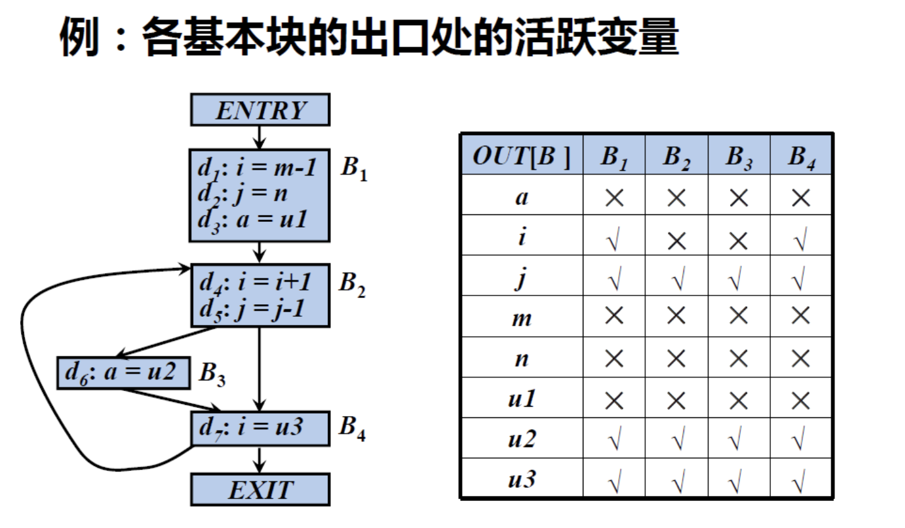

## 数据流分析

##### a. 活跃变量分析
对于变量x和程序点p，如果在流图中沿着从p开始的某条路径会引用变量x在p点的值，则称变量x在点p是 活跃(live)的，否则称变量x在点p 不活跃(dead)

- B1出口处：
    - a：没有使用任何路径使用了出口处的a的值，所以是叉。
    - i：有路径在B2中用到了i在B1出口处的值。
    - j：有路径在B2中用到了j在B1出口处的值。
    - m、n、u1：没有路径使用B1出口处的值
- B2出口处：
    - a、i：这里需要注意，我们看的是他出口处的值是否被使用，和他被赋值无关，所以还是叉。
    - m、n、u1：没有路径使用B2出口处的值。
    - j、u2、u3：存在路径使用了B2出口处他们的值。

剩余的同理就不接着写了。