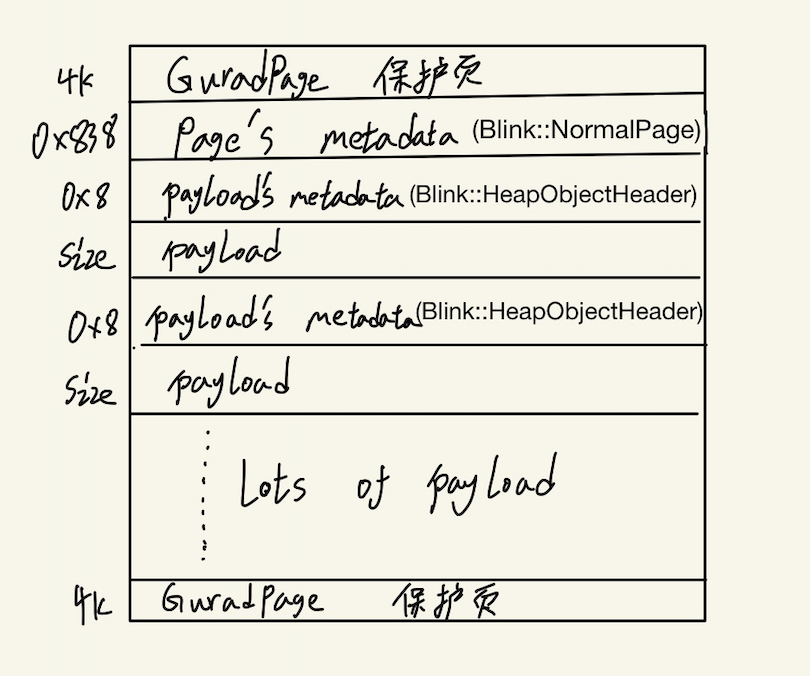
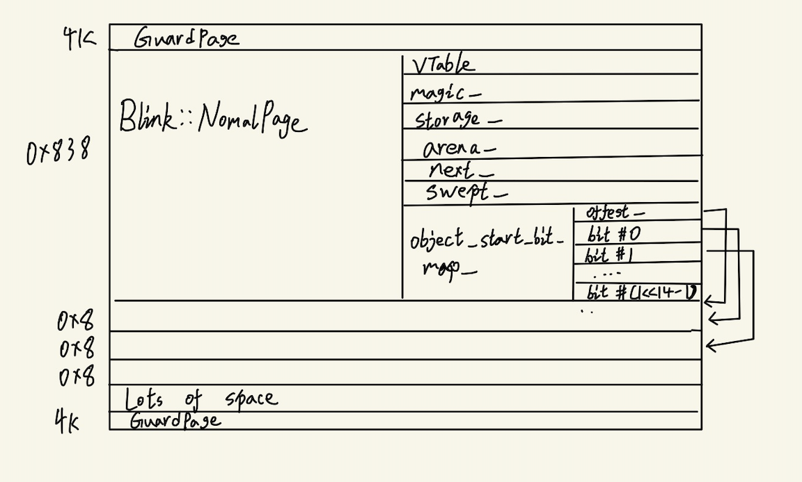
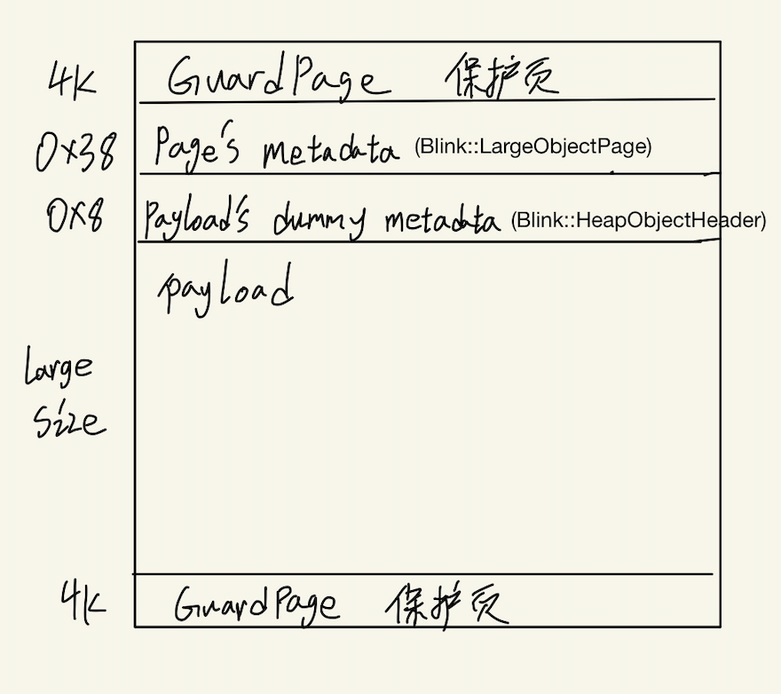
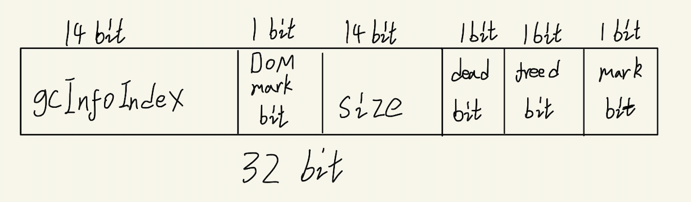

## Olipan -- blink gc

### 基础介绍

在Oilpan项目以前，Blink和Chromium都采用引用计数技术（referencecounting）来管理内存，每一个对象内部都一个引用计数，代表当前对象被引用了多少次，当引用技术归零时，对象就会被自动释放掉，这种方式一直以来都存在一个缺陷就是循环引用问题，就A引用了，B又引用了A，最后致使A和B都没有机会释放。
此外，C++中启用引用计数还存在其余几个方面的问题：
- 引用计数器的增减开销问题；
- C++中能够经过Raw指针轻易地绕开RefPtr的管理，一旦使用不当，将致使use-after-free内存错误，存在安全问题；

Oilpan实现了一种跟踪式的垃圾回收机制，具备以下特色：

- Blink中全部的对象都将分配在一个受托管的堆中，每一个对象都提供了一个trace的方法，用来创建与堆中其余对象的可达关系，所以，从根节点（通常DOMWindow）出发，Blink的对象在托管堆中造成了一个对象图，那些由根节点不可达的对象将会被GC掉，这样就避免了循环引用问题。

- Oilpan的GC并不会随时都发生，它会被推迟到消息循环中执行，由于当消息循环执行完任务队列中最后一个任务时，此时Blink的栈为空，没有在栈中分配的对象了。
- 一旦须要执行GC时，Blink首先要确保全部运行的线程到达了一个“安全点”，不会再分配新的对象，而后从根节点出发，计算堆中全部对象的传递可达性，并标记(mark)全部可达的对象，最后每一个线程开始清理（sweep）属于本身的那部分堆空间，回收全部未被标记的对象，将其插入到空间列表中。
- 与V8引擎的GC相比，Oilpan的GC会牵扯到Blink全部的线程，Database线程，File线程等等，全部的线程都共享一个Oilpan的堆空间。
- Oilpan提供了两个超类GarbageCollected和GarbageCollectedFinalized，来保证它们的子类都分配在由Oilpan管理的堆中。

### 实例分析（part 1）

由于实例分析会插入很多补充知识，所以这里分开了几个part。

使用Oilpan的对象包括DOM Tree节点，CSS（保持值）对象和哈希表，我们接下来主要以node(A Node is a base class for all objects in the DOM tree.)为例分析gc的整个流程：

首先我们从为node分配olipan空间看起，它和olipan的联系要从重载的new 运算符说起（在这里node的delete是不会重载的，他的释放基本上是olipan自动完成的）：
https://source.chromium.org/chromium/chromium/src/+/master:third_party/blink/renderer/core/dom/node.h;l=169?q=node.h%20&ss=chromium%2Fchromium%2Fsrc

``` c++
void* operator new(size_t size)
{
    return allocateObject(size, false);
}

template <typename T>
static void* AllocateObject(size_t size) {
ThreadState* state =
    ThreadStateFor<ThreadingTrait<Node>::kAffinity>::GetState();
const char* type_name = "blink::Node";
return state->Heap().AllocateOnArenaIndex(
        state, size, BlinkGC::kNodeArenaIndex,
        GCInfoTrait<GCInfoFoldedType<T>>::Index(), type_name);
  }
```

##### olipan的管理单元

###### ThreadState

每个olipan中的数据都是以ThreadState该结构体开头的，他记录了该线程的所处的状态以及线程中的一些重要结构：

详见： https://source.chromium.org/chromium/chromium/src/+/master:third_party/blink/renderer/platform/heap/impl/thread_state.h;l=131


###### ThreadHeap

在ThreadState中存在一个heap_成员，他是一个ThreadHeap结构：
``` c++
ThreadHeap& Heap() const { return *heap_; }
```

该结构详见： https://source.chromium.org/chromium/chromium/src/+/master:third_party/blink/renderer/platform/heap/impl/heap.h;drc=fbc3828fca7bc93acf37181c6f7b333a5e391510;l=215

olipan不同于partitionalloc，后者分配的过程中，主要根据分配的大小自动的选择了对应的bucket，而olipan可以根据对象的类型选择对应的arena，所以在olipan的分配中是需要指定arena数组的索引的。

这里有一个需要注意的内容：无论对象的类型是什么，只要他大于特定的大小（也就是kLargeObjectSizeThreshold），就会将其存入LargeObjectArena的特殊Arena中进行管理。LargeObjectArena位于Arena数组的末尾，它类似于PartitionAlloc中的直接映射。

kLargeObjectSizeThreshold： https://source.chromium.org/chromium/chromium/src/+/master:third_party/blink/renderer/platform/heap/impl/heap_page.h;l=97?q=kLargeObjectSizeThreshold&ss=chromium%2Fchromium%2Fsrc


在ThreadHeap结构中，有一个arenas_成员，他是一个BaseArena数组
```
BaseArena* arenas_[BlinkGC::kNumberOfArenas];
```

数组的大小由下面的枚举类来定义：

``` c++
  enum ArenaIndices {
    FOR_EACH_ARENA(DeclareArenaIndex)
    // Values used for iteration of heap segments.
    kNumberOfArenas,
  };
```

### 实例分析（part 2）

说了这么多，我们现在回到上面的node的分配上来，AllocateObject函数中的size是通过ThreadHeap的成员函数AllocationSizeFromSize来获得的

``` c++
  static inline size_t AllocationSizeFromSize(size_t size) {
    // Add space for header.
    size_t allocation_size = size + sizeof(HeapObjectHeader);
    // The allocation size calculation can overflow for large sizes.
    CHECK_GT(allocation_size, size);
    // Align size with allocation granularity.
    allocation_size = (allocation_size + kAllocationMask) & ~kAllocationMask;
    return allocation_size;
  }
```

- 首先为size增加HeapObjectHeader（很重要，下面会详细说他）的大小
- 检查size是否超过合法大小
- 最后为增加大小的size做对齐处理

接着会调用AllocateOnArenaIndex函数，它的参数BlinkGC::kNodeArenaIndex就是我们上面说的arena数组的索引。

``` c++
inline Address ThreadHeap::AllocateOnArenaIndex(ThreadState* state,
                                                size_t size,
                                                int arena_index,
                                                uint32_t gc_info_index,
                                                const char* type_name) {
  DCHECK(state->IsAllocationAllowed());
  DCHECK_NE(arena_index, BlinkGC::kLargeObjectArenaIndex);
  NormalPageArena* arena = static_cast<NormalPageArena*>(Arena(arena_index));
  Address address =
      arena->AllocateObject(AllocationSizeFromSize(size), gc_info_index);
  HeapAllocHooks::AllocationHookIfEnabled(address, size, type_name);
  return address;
}
```

该函数中内存分配主要是通过调用AllocateObject实现的，首先根据我们传入的arena数组的索引找到对应的arena，之后在该arena上分配内存，AllocateObject函数会决定采用slow或者是fast path，在看AllocateObject函数之前我们还需要补充一些其他知识。

###### Region & BlinkPage & Arena & HeapObjectHeadr

Arena以BlinkPages为单位管理内存资源，BlinkPages的大小为2 ^ 17 = 128KB。但是chrome会预申请1280KB大小的Region，也就是10个BlinkPages大小的区域，将其切成10个BlinkPages供使用。它具有类似于PartitionAlloc的superpage的结构，并且是一种抑制内存碎片并提高TLB效率的设备。

blinkpage有两种不同的元信息：NormakArena -- blink::NormalPage；LargeObjectArena -- blink::LargeObjectPage。

我们直接上图：
先来看NormalPage：

在这128kb中，开头和结尾各有一个4k内存页作为保护页，保护页之后是BlinkPage的元信息。

从元信息之后到最后一个GuardPage的区域是用作Oilpan堆内存的部分，他被分割为了不同大小的arena。

这里需要注意一点：保护页之后的matadata是blinkpage本身的元信息，但是olipan不同于partitionalloc，在partitionalloc中由于bucket各不同区域的大小是固定的，而olipan不同，它每个arena中的区域大小都是不同的，所以每个切割出来的区域都需要元信息，而且它的结构和blinkpage的元信息是不同的，是Blink::HeapObjectHeadr。

加上了object_start_bit_map_结构（下面还会用到它）的版本：

object_start_bit_map_管理的位图中，第x位是有效负载开头的第x个8字节（= Oilpan管理的区域的最小粒度--可以和下面HeapObjectHeadr的位数为14位放在一起理解）。它可以用来指示边界地址处是否存在Blink::HeapObjectHeadr，也就是arena元信息。


接下来我们来查看一下LargeObjectPage：



它不同于NormalPage，里面只有一个LargeObjectArena。


上面提到了这么多次Blink::HeapObjectHeadr，下面是他的结构


- gcInfoIndex只需要14位，因为在blink中，type的数量少于2^14
- 下一bit用于标记v8的DOM树
- size需要分情况做一个说明：
    - For non-large objects：因为blinkpage的大小为2^17 ，而每个分割的arena都是2^3 对齐的，所以这里的size只需要14字节即可。
    - For large objects：它的size是0，他实际的大小存储在LargeObjectPage::m_payloadSize中
- 剩下的就是三个标记位（说明放到了后面遇到的位置）。

### 实例分析（part 3）

我们再回到AllocateObject函数：

https://source.chromium.org/chromium/chromium/src/+/master:third_party/blink/renderer/platform/heap/impl/heap_page.h;l=1311?q=NormalPageArena::allocateObject&ss=chromium%2Fchromium%2Fsrc

``` c++
inline Address NormalPageArena::AllocateObject(size_t allocation_size,
                                               size_t gc_info_index) {
  if (LIKELY(allocation_size <= remaining_allocation_size_)) {
    Address header_address = current_allocation_point_;
    current_allocation_point_ += allocation_size;
    remaining_allocation_size_ -= allocation_size;
    DCHECK_GT(gc_info_index, 0u);
    new (NotNull, header_address)
        HeapObjectHeader(allocation_size, gc_info_index);
    DCHECK(!PageFromObject(header_address)->IsLargeObjectPage());
    static_cast<NormalPage*>(PageFromObject(header_address))
        ->object_start_bit_map()
        ->SetBit<HeapObjectHeader::AccessMode::kAtomic>(header_address);
    Address result = header_address + sizeof(HeapObjectHeader);
    DCHECK(!(reinterpret_cast<uintptr_t>(result) & kAllocationMask));

    SET_MEMORY_ACCESSIBLE(result, allocation_size - sizeof(HeapObjectHeader));
#if DCHECK_IS_ON()
    DCHECK(FindPageFromAddress(header_address + allocation_size - 1));
#endif
    return result;
  }
  return OutOfLineAllocate(allocation_size, gc_info_index);
}
```
该函数决定了我们使用fast or slow path。

###### fast path：
- 快速路经首先判断请求的大小（allocation_size）是否小于等于arena中的空闲大小（remaining_allocation_size_）。

- 之后将当前分配点的地址（current_allocation_point_）分配给header_address，之后更新分配点和剩余大小。这里注意由于olipan并不是总能知道它保存的blinkpage中是否有可用的空间能提供给这次分配，所以它有了一个current_allocation_point_指针，它指向active pages中的某个地址，保证该地址存在remaining_allocation_size_大小的剩余空间。
- 接着通过new运算符在该地址处构造HeapObjectHeader类实例。
- 之后设置object_start_bit_map中的对应bit
- result = header_address + sizeof(HeapObjectHeader);之后return result，也就是之后的指针指向arena区域而不是头部

###### slow path

也就是不满足开头的if判断，直接去调用OutOfLineAllocate函数。

``` c++
Address NormalPageArena::OutOfLineAllocate(size_t allocation_size,
                                           size_t gc_info_index) {
  Address result = OutOfLineAllocateImpl(allocation_size, gc_info_index);
  GetThreadState()->Heap().stats_collector()->AllocatedObjectSizeSafepoint();
  return result;
}

Address NormalPageArena::OutOfLineAllocateImpl(size_t allocation_size,
                                               size_t gc_info_index) {
  DCHECK_GT(allocation_size, RemainingAllocationSize());
  DCHECK_GE(allocation_size, kAllocationGranularity);

  // 1. If this allocation is big enough, allocate a large object.
  if (allocation_size >= kLargeObjectSizeThreshold)
    return AllocateLargeObject(allocation_size, gc_info_index);

  // 2. Try to allocate from a free list.
  Address result = AllocateFromFreeList(allocation_size, gc_info_index);
  if (result)
    return result;

  // 3. Reset the allocation point.
  SetAllocationPoint(nullptr, 0);

  // 4. Lazily sweep pages of this heap until we find a freed area for
  // this allocation or we finish sweeping all pages of this heap.
  result = LazySweep(allocation_size, gc_info_index);
  if (result)
    return result;

  // 5. Complete sweeping.
  GetThreadState()->CompleteSweep();

  // 6. Check if we should trigger a GC.
  GetThreadState()->ScheduleGCIfNeeded();

  // 7. Add a new page to this heap.
  AllocatePage();

  // 8. Try to allocate from a free list. This allocation must succeed.
  result = AllocateFromFreeList(allocation_size, gc_info_index);
  CHECK(result);
  return result;
}
```
这里注释已经写的很清楚了，我就简单描述一下它的大致流程：
- 分配器要么返回“大对象”（如果大小足够大，也就是第一个if判断），要么尝试从现有的空闲列表进行分配。如果后者失败，则Blink将尝试遍历所有页面以找到合适的空闲列表。如果这些工作失败，那么将触发一个GC循环，分配一个新的页面，最后尝试调用allocateFromFreeList。

接下来我们就去看看allocateFromFreeList函数：

```
Address NormalPageArena::AllocateFromFreeList(size_t allocation_size,
                                              size_t gc_info_index) {
  FreeListEntry* entry = free_list_.Allocate(allocation_size);
  if (!entry)
    return nullptr;

  SetAllocationPoint(entry->GetAddress(), entry->size());
  DCHECK(HasCurrentAllocationArea());
  DCHECK_GE(RemainingAllocationSize(), allocation_size);
  return AllocateObject(allocation_size, gc_info_index);
}


FreeListEntry* FreeList::Allocate(size_t allocation_size) {
  // Try reusing a block from the largest bin. The underlying reasoning
  // being that we want to amortize this slow allocation call by carving
  // off as a large a free block as possible in one go; a block that will
  // service this block and let following allocations be serviced quickly
  // by bump allocation.
  size_t bucket_size = static_cast<size_t>(1) << biggest_free_list_index_;
  int index = biggest_free_list_index_;
  for (; index > 0; --index, bucket_size >>= 1) {
    DCHECK(IsConsistent(index));
    FreeListEntry* entry = free_list_heads_[index];
    if (allocation_size > bucket_size) {
      // Final bucket candidate; check initial entry if it is able
      // to service this allocation. Do not perform a linear scan,
      // as it is considered too costly.
      if (!entry || entry->size() < allocation_size)
        break;
    }
    if (entry) {
      if (!entry->Next()) {
        DCHECK_EQ(entry, free_list_tails_[index]);
        free_list_tails_[index] = nullptr;
      }
      entry->Unlink(&free_list_heads_[index]);
      biggest_free_list_index_ = index;
      return entry;
    }
  }
  biggest_free_list_index_ = index;
  return nullptr;
}

```

我们主要看一下FreeList::Allocate这个函数，首先是一个大的for循环，它试图从每个bucket中的第一个FreeListEntry进行分配，需要满足：该bucket中的分配大于allocationSize。如果找到一个，则对其调用unlink函数，之后返回找到的entry，然后调用setAllocationPoint -- 该函数用来设置先前unlinked的地址，然后调用allocateObject以确保返回chunk。

简单看下FreeListEntry结构：

- 他继承自HeapObjectHeader，是一个单链表结构

``` c++
class FreeListEntry final : public HeapObjectHeader {
 public:
  NO_SANITIZE_ADDRESS
  explicit FreeListEntry(size_t size)
      : HeapObjectHeader(size, kGcInfoIndexForFreeListHeader), next_(nullptr) {}

  Address GetAddress() { return reinterpret_cast<Address>(this); }

  NO_SANITIZE_ADDRESS
  void Unlink(FreeListEntry** previous_next) {
    *previous_next = next_;
    next_ = nullptr;
  }

  NO_SANITIZE_ADDRESS
  void Link(FreeListEntry** previous_next) {
    next_ = *previous_next;
    *previous_next = this;
  }

  NO_SANITIZE_ADDRESS
  FreeListEntry* Next() const { return next_; }

  NO_SANITIZE_ADDRESS
  void Append(FreeListEntry* next) {
    DCHECK(!next_);
    next_ = next;
  }

 private:
  FreeListEntry* next_;

  friend class FreeList;
};
```

### 内存释放

这部分主要参考了：
https://chromium.googlesource.com/chromium/src/+/67.0.3396.62/third_party/blink/renderer/platform/heap/BlinkGCDesign.md

由于Oilpan是垃圾回收器，因此内存用户不需要任何调用释放过程来将区域返回到free_list。Oilpan本身会在适当的时候执行标记和清除处理，并将未使用的区域返回到free_list。

Mark和Sweep操作，主要搬运一下文档中的内容：

##### Marking phase

```
The marking phase (the step 3 in the above description) consists of the following steps. The marking phase is executed in a stop-the-world manner.

Step 3-1. The GCing thread marks all objects reachable from the root set by calling trace() methods defined on each object.

Step 3-2. The GCing thread clears out all trivial WeakMembers.
```

标记主要有下面几个重要内容：

###### 精确GC和保守GC

当事件循环结束时所有线程都在安全点停止时，将触发精确的GC。此时，可以确保没有指向Oilpan堆的堆栈指针。因此，Oilpan运行精确的GC。精确GC的根集是持久句柄。

否则，将触发保守的GC。在这种情况下，GC扫描线程的本机堆栈（在事件循环结束时不会在安全点停止线程），并将通过本机堆栈发现的指针推入根集中。（这就是为什么您可以在本机堆栈上使用原始指针的原因。）保守GC的根集是持久句柄和线程的本机堆栈。

###### 标记目标

标记过程使用的是为一组对象定义的trace（）函数,该对象来自olipan管理的一组路线集，它位于下面三个位置：
- blink::ThreadState::persistent_region_
- blink::ProcessHeap::GetCrossThreadPersistentRegion中的静态变量
- blink::ProcessHeap::GetCrossThreadWeakPersistentRegion中的静态变量

我们的标记目标主要是线程内部和外部作为PersistentRegion管理的路线集（精确gc），和标记过程开始时的堆栈位置和线程的堆栈底部之间的对象（保守gc）（他们是DFS通过为每个对象定义的Trace（）函数获得的对象。）


###### 标记过程

标记位是上面提到过的Blink::HeapObjectHeadr中的最后一字节（mark bit）

我们先来看精确gc，他对PersistentRegion管理的路线集的跟踪是通过ThreadState::VisitPersistents函数实现的。

调用链：
```
   ThreadState::VisitPersistents
-> ThreadState::VisitPersistents
-> trace_ (blink::Visitor::Trace)
-> MarkingVisitorBase::Visit
-> MarkingVisitorBase::MarkHeader
-> MarkingVisitorBase::MarkHeaderNoTracing
-> HeapObjectHeader::TryMark
```

这里补充一下trace_的内容：

```
  void TracePersistentNode(Visitor* visitor) const {
    DCHECK(!IsUnused());
    DCHECK(trace_);
    trace_(visitor, self_);
  }
  
  
  class PersistentNode final {

 public:
  
  ........
  
  bool IsUnused() const { return !trace_; }

  void* Self() const { return self_; }

 private:
  // If this PersistentNode is in use:
  //   - m_self points to the corresponding Persistent handle.
  //   - m_trace points to the trace method.
  // If this PersistentNode is freed:
  //   - m_self points to the next freed PersistentNode.
  //   - m_trace is nullptr.
  void* self_ = nullptr;
  TraceCallback trace_ = nullptr;
};
```
trace_是PersistentNode结构中的成员函数：当PersistentNode被使用时，它指向trace方法；当PersistentNode被释放后，它的内容为空。


标记操作：

```
template <HeapObjectHeader::AccessMode mode>
NO_SANITIZE_ADDRESS inline bool HeapObjectHeader::TryMark() {
  if (mode == AccessMode::kNonAtomic) {
    if (encoded_low_ & kHeaderMarkBitMask)
      return false;
    encoded_low_ |= kHeaderMarkBitMask;
    return true;
  }
  auto* atomic_encoded = internal::AsUnsanitizedAtomic(&encoded_low_);
  uint16_t old_value = atomic_encoded->load(std::memory_order_relaxed);
  if (old_value & kHeaderMarkBitMask)
    return false;
  const uint16_t new_value = old_value | kHeaderMarkBitMask;
  return atomic_encoded->compare_exchange_strong(old_value, new_value,
                                                 std::memory_order_relaxed);
}
```

###### 扫描堆栈空间

下面是对堆栈区域中对象的跟踪和标记调用链：

```
   ThreadState::VisitPersistents 
-> ThreadHeap::CheckAndMarkPointer 
-> MarkingVisitor::ConservativelyMarkAddress 
-> MarkingVisitorBase::MarkHeader 
-> MarkingVisitorBase::MarkHeaderNoTracing 
-> HeapObjectHeader::TryMark
```

整个扫描流程：在跟踪开始时，将SafePointScope类的实例作为本地变量放置在堆栈上，循环到该线程的堆栈基地址，如果找到了由Oilpan管理的页面地址，则将其标记出来。

要确定堆栈上的内容是否是由Oilpan管理的页面，需要使用RegionTree（RegionTree* const region_tree_;），它是一个指向RegionTree结构的指针。

RegionTree是一个简单的二进制搜索树，代表到目前为止Oilpan已分配的Regions（就是上文提到的那个10个BlinkPages的区域）。如果堆栈中的某个值在现有区域的范围内，则可以推断出它是Oilpan保留的地址。

这里要注意：地址范围中可能仅包含数字数据，但是在该情况下，Oilpan也会在该地址处标记对象。这里可以理解为olipan宁可错杀一千，不可放过一个，将未使用的对象标记为正在使用具有浪费内存的缺点，但是不会导致UAF。相反，如果假设不使用所使用的对象，则会发生UAF，因此应绝对避免这种情况。这也是为什么它被称为保守gc的一个原因。

如果在堆栈中存在一个Region包含的值，则很容易看到该值属于Region中的哪个BlinkPage。我们需要做的事是找到Blink::HeapObjectHeadr（也就是该blinkpage中分配给该对象的arena的头部，我们需要修改其mark bit标记位），但是不能简单的从堆栈中的值中减去-8去寻找它。这是因为堆栈上的值可能指示对象中间的地址而不是对象的起始地址。

要从BlinkPage上的地址中找到地址所属的对象的HeapObjectHeadr，需要在BlinkPage的元信息中使用blink::ObjectStartBitmap，也就是之前介绍过的blink::NormalPage::object_start_bit_map_。我们在上文介绍过，它管理了所有有效负载标头在BlinkPage中的位置。

如果根据RegionTree中的信息发现堆栈上的值X在BlinkPage的范围内，请参考该BlinkPage的位图，并在上游查看时寻址最接近X的Headr。找出来之后，将HeapObjectHeadr的标记位（mark bit）设置以完成标记。

实现位图搜索的函数是：
```
template <HeapObjectHeader::AccessMode mode>
Address ObjectStartBitmap::FindHeader(
    ConstAddress address_maybe_pointing_to_the_middle_of_object) const {
  size_t object_offset =
      address_maybe_pointing_to_the_middle_of_object - offset_;
  size_t object_start_number = object_offset / kAllocationGranularity;
  size_t cell_index = object_start_number / kCellSize;
#if DCHECK_IS_ON()
  const size_t bitmap_size = kReservedForBitmap;
  DCHECK_LT(cell_index, bitmap_size);
#endif
  size_t bit = object_start_number & kCellMask;
  uint8_t byte = load<mode>(cell_index) & ((1 << (bit + 1)) - 1);
  while (!byte) {
    DCHECK_LT(0u, cell_index);
    byte = load<mode>(--cell_index);
  }
  int leading_zeroes = base::bits::CountLeadingZeroBits(byte);
  object_start_number =
      (cell_index * kCellSize) + (kCellSize - 1) - leading_zeroes;
  object_offset = object_start_number * kAllocationGranularity;
  return object_offset + offset_;
}
```

##### Sweeping phase

标记过后的清扫阶段就相对简单了很多，它主要调用了NormalPage::Sweep函数

```
#define SET_MEMORY_INACCESSIBLE(address, size) memset((address), 0, (size))


bool NormalPage::Sweep(FinalizeType finalize_type) {
  PlatformAwareObjectStartBitmap* bitmap;
#if BUILDFLAG(BLINK_HEAP_YOUNG_GENERATION)
  cached_object_start_bit_map_ =
      std::make_unique<PlatformAwareObjectStartBitmap>(Payload());
  bitmap = cached_object_start_bit_map_.get();
#else
  object_start_bit_map()->Clear();
  bitmap = object_start_bit_map();
#endif
  cached_freelist_.Clear();
  unfinalized_freelist_.clear();
  Address start_of_gap = Payload();
  bool found_finalizer = false;
  for (Address header_address = start_of_gap; header_address < PayloadEnd();) {
    HeapObjectHeader* header =
        reinterpret_cast<HeapObjectHeader*>(header_address);
    const size_t size = header->size();
    DCHECK_GT(size, 0u);
    DCHECK_LT(size, BlinkPagePayloadSize());

    if (header->IsFree<HeapObjectHeader::AccessMode::kAtomic>()) {
      // Zero the memory in the free list header to maintain the
      // invariant that memory on the free list is zero filled.
      // The rest of the memory is already on the free list and is
      // therefore already zero filled.
      SET_MEMORY_INACCESSIBLE(header_address,
                              std::min(size, sizeof(FreeListEntry)));
      CHECK_MEMORY_INACCESSIBLE(header_address, size);
      header_address += size;
      continue;
    }
    if (!header->IsMarked<HeapObjectHeader::AccessMode::kAtomic>()) {
      // The following accesses to the header are safe non-atomically, because
      // we just established the invariant that the object is not marked.
      ToBeFinalizedObject object{header};
      if (finalize_type == FinalizeType::kInlined ||
          !header->HasNonTrivialFinalizer()) {
        // In case the header doesn't have a finalizer, we eagerly call a
        // freehook.
        // TODO(bikineev): It may be unsafe to do this concurrently.
        object.Finalize();
      } else {
        to_be_finalized_objects_.push_back(std::move(object));
        found_finalizer = true;
      }
      header_address += size;
      continue;
    }
    if (start_of_gap != header_address) {
      AddToFreeList(start_of_gap, header_address - start_of_gap, finalize_type,
                    found_finalizer);
      found_finalizer = false;
    }
    bitmap->SetBit(header_address);
#if !BUILDFLAG(BLINK_HEAP_YOUNG_GENERATION)
    header->Unmark<HeapObjectHeader::AccessMode::kAtomic>();
#endif
    header_address += size;
    start_of_gap = header_address;
  }
  // Only add the memory to the free list if the page is not completely empty
  // and we are not at the end of the page. Empty pages are not added to the
  // free list as the pages are removed immediately.
  if (start_of_gap != Payload() && start_of_gap != PayloadEnd()) {
    AddToFreeList(start_of_gap, PayloadEnd() - start_of_gap, finalize_type,
                  found_finalizer);
  }
  return start_of_gap == Payload();
}
```

sweep函数的结构很简单，主要是一个for大循环来遍历blinkpage中的对象，并检查其标记位

```
#define SET_MEMORY_INACCESSIBLE(address, size) memset((address), 0, (size))

    if (header->IsFree<HeapObjectHeader::AccessMode::kAtomic>()) {
      // Zero the memory in the free list header to maintain the
      // invariant that memory on the free list is zero filled.
      // The rest of the memory is already on the free list and is
      // therefore already zero filled.
      SET_MEMORY_INACCESSIBLE(header_address,
                              std::min(size, sizeof(FreeListEntry)));
      CHECK_MEMORY_INACCESSIBLE(header_address, size);
      header_address += size;
      continue;
    }
```
如果对象已经被释放，就用0将其填充。

```
if (!header->IsMarked<HeapObjectHeader::AccessMode::kAtomic>()) {
      // The following accesses to the header are safe non-atomically, because
      // we just established the invariant that the object is not marked.
      ToBeFinalizedObject object{header};
      if (finalize_type == FinalizeType::kInlined ||
          !header->HasNonTrivialFinalizer()) {
        // In case the header doesn't have a finalizer, we eagerly call a
        // freehook.
        // TODO(bikineev): It may be unsafe to do this concurrently.
        object.Finalize();
      } else {
        to_be_finalized_objects_.push_back(std::move(object));
        found_finalizer = true;
      }
      header_address += size;
      continue;
    }
    if (start_of_gap != header_address) {
      AddToFreeList(start_of_gap, header_address - start_of_gap, finalize_type,
                    found_finalizer);
      found_finalizer = false;
    }
    bitmap->SetBit(header_address);
#if !BUILDFLAG(BLINK_HEAP_YOUNG_GENERATION)
    header->Unmark<HeapObjectHeader::AccessMode::kAtomic>();
#endif
    header_address += size;
    start_of_gap = header_address;
  }
```
它主要就是检查对象是否被标记，如果他被标记就将它清除（这里的清除就是将其添加到free list中）

```
  if (start_of_gap != Payload() && start_of_gap != PayloadEnd()) {
    AddToFreeList(start_of_gap, PayloadEnd() - start_of_gap, finalize_type,
                  found_finalizer);
  }
  return start_of_gap == Payload();
```
最后只有当当前页面不完全为空，并且我们不在页的尾部才会将剩余内存添加到freelist中，空页面会直接被释放。


