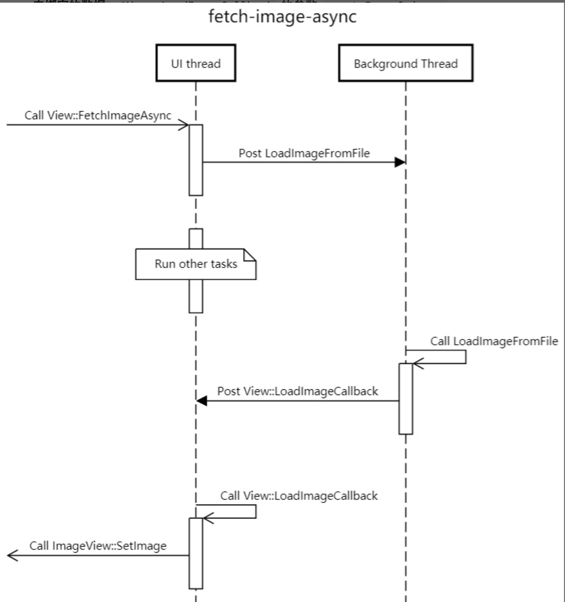
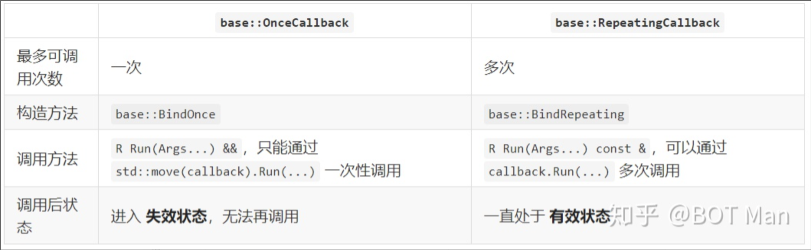

## 同步和异步回调

#### 同步回调

```
int compare (const void * a, const void * b) {
    return (*(int*) a - *(int*) b);
}

...

int values[] = { 20, 10, 50, 30, 60, 40 };
qsort (values, sizeof (values) / sizeof (int), sizeof(int), compare);
```

由于调用compare 的时刻均是在调用qsort结束之前（qsort 未返回），所以这样的回调被称为同步回调。

#### 异步回调

举例：用户界面为了不阻塞 UI 线程 响应用户输入，在 后台线程 异步加载背景图片，加载完成后再从 UI 线程 显示到界面上：
```
// callback code
void View::LoadImageCallback(const Image& image) {
  // WARNING: |this| may be invalid now!
  if (background_image_view_)
    background_image_view_->SetImage(image);
}

// client code
FetchImageAsync(
    filename,
    base::Bind(&View::LoadImageCallback, this));
               // use raw |this| pointer ^
```

这里绑定了view对象的this指针（弱引用），是无法编译成功的，这里只是举例 -- 下面会对回调时的生命周期做一个分析




#### 同步异步的区别

- 同步方式：
通过参数（例如 qsort 的最后一个参数）传递回调函数。
调用者立即调用回调函数（调用时刻 在函数返回前）。
此处的 qsort 和 compare 调用栈相同。

- 异步方式：
通过注册（例如 FetchImageAsync 函数）设置回调函数。
调用者先存储回调函数，在未来的某个调用时刻，取出并调用回调函数。
此处的 FetchImageAsync 和 view::LoadImageCallback 调用栈不同。


## 回调时弱引用的生命周期

由于闭包没有弱引用上下文的所有权，所以上下文可能失效：

对于同步回调，上下文的生命周期往往比闭包长，一般不失效。

而在异步回调调用时，上下文可能已经失效了。

例如异步加载图片的场景：在等待加载时，用户可能已经退出了界面。所以，在执行 View::LoadImageCallback时：

- 如果界面还在显示，View对象仍然有效，则执行 ImageView::SetImage 显示背景图片
- 如果界面已经退出，background_image_view_变成野指针 (wild pointer)，调用ImageView::SetImage导致UAF

如果弱引用上下文失效，回调应该 及时取消。例如 异步加载图片 的代码，可以给 base::Bind 传递 View 对象的 弱引用指针，即 base::WeakPtr<View>：

```
FetchImageAsync(
    filename,
    base::Bind(&View::LoadImageCallback, AsWeakPtr()));
 // use |WeakPtr| rather than raw |this| ^
}
```
在执行 View::LoadImageCallback 时：

如果界面还在显示，View 对象仍然有效，则执行 ImageView::SetImage 显示背景图片。

## 回调时强引用的生命周期

对于面向对象的回调，强引用上下文的 所有权属于闭包。例如，改写异步/非阻塞发送数据 的代码：
```
假设 using Event::Callback = base::OnceCallback<void()>;
// callback code
void DoSendOnce(std::unique_ptr<Buffer> buffer) {
  // ...
}  // free |buffer| via |~unique_ptr()|

// client code
std::unique_ptr<Buffer> buffer = ...;
event->SetCallback(base::BindOnce(&DoSendOnce,
                                  std::move(buffer)));                               
```
构造闭包时：buffer移动到base::OnceCallback内
回调执行时：buffer 从 base::OnceCallback 的上下文 移动到DoSendOnce 的参数里，并在回调结束时销毁（所有权转移，DoSendOnce销毁 强引用参数）
闭包销毁时：如果回调没有执行，buffer 未被销毁，则此时销毁（保证销毁且只销毁一次）

```
假设 using Event::Callback = base::RepeatingCallback<void()>;
// callback code
void DoSendRepeating(const Buffer* buffer) {
  // ...
}  // DON'T free reusable |buffer|

// client code
Buffer* buffer = ...;
event->SetCallback(base::BindRepeating(&DoSendRepeating,
                                       base::Owned(buffer)));
```

构造闭包时：buffer移动到base::RepeatingCallback 内
回调执行时：每次传递 buffer 指针，DoSendRepeating只使用buffer 的数据（DoSendRepeating不销毁 弱引用参数）

根据 可拷贝性，强引用上下文又分为两类：

- 不可拷贝的 互斥所有权(exclusive ownership)，例如 std::unique_ptr
- 可拷贝的 共享所有权(shared ownership)，例如 std::shared_ptr

## 回调次数分类



为什么要区分一次和多次回调:

举个反例 —— 基于C语言函数指针的回调：

由于没有闭包，需要函数管理上下文生命周期，即 申请/释放上下文
由于资源所有权不明确，难以判断指针 T* 表示 强引用还是弱引用
例如，使用libevent监听socket可写事件，实现异步/非阻塞发送数据：
```
// callback code
void do_send(evutil_socket_t fd, short events, void* context) {
  char* buffer = (char*)context;
  // ... send |buffer| via |fd|
  free(buffer);  // free |buffer| here!
}

// client code
char* buffer = malloc(buffer_size);  // alloc |buffer| here!
// ... fill |buffer|
event_new(event_base, fd, EV_WRITE, do_send, buffer);
```
- 正确情况：do_send只执行一次
client代码申请发送缓冲区 buffer 资源，并作为 context 传入 event_new 函数
callback代码从context中取出 buffer，发送数据后释放buffer 资源

- 错误情况：do_send没有被执行
client 代码申请的 buffer 不会被释放，从而导致 泄漏

- 错误情况：do_sent被执行多次
callback 代码使用的 buffer 可能已经被释放，从而导致 崩溃


