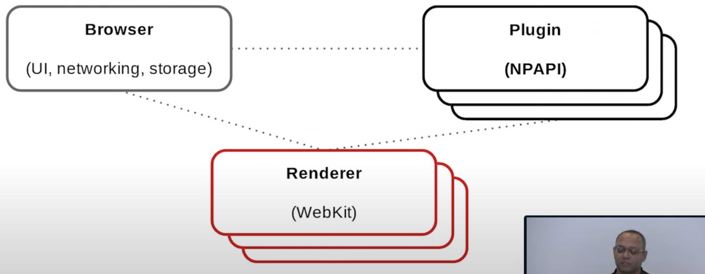
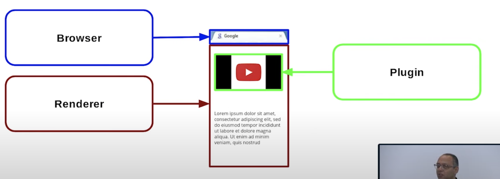
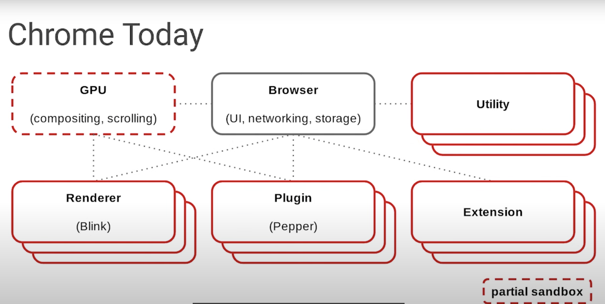

### BC（Before Chrome）

一切都在同一进程中进行，例如：rendering engine(渲染引擎)、UI、networking、storage、image decoding（图片解析）、plugins等都运行在Browser进程上。

如果一个标签页停止工作或崩溃，他将删除所有其他标签和浏览器本身。

### Chrome at Launch (chrome 1.0)

每个进程以一个框来表示，红色的框代表sandbox，虚线代表IPC（各进程通过IPC来进行通信）。

另一种表示方法：

顶部的标签栏是浏览器进程绘制的（main process）、html是由Renderer渲染的、其中也使用了插件来绘制视频例如flash。

##### why Multi-Process ？

- can‘t write perfect code

- Security: untrusted web content shouldn't use exploits to access file system(不可信的web内容不应该使用漏洞访问文件系统)
- Speed: misbehaving tabs shouldn't impact other tabs or the browser(不正常的标签不应该影响其他标签或浏览器)
- Stability: crashes should only affect the tab and not other tabs or the browser(崩溃应该只影响标签，而不是其他标签或浏览器)

##### Renderer Process

- 作用：
parsing （解析）
layout（布局）
executing javascript （执行js）
decoding （解码）

- 它是一个完全沙箱，以防止漏洞获得访问用户数据和/或安装恶意软件

##### Plugin Process

必须打开沙箱,因为插件是假设完全访问的.

##### Browser Process

- central coordinator (中央协调器)

- owns browser state such as profile data ,settings (拥有浏览器状态，如配置文件数据，设置)
- draws UI (吸引用户界面)
- handles networking (处理网络)
- can’t trust render (不能信任呈现)

##### Threads

- in child processes ,for the most part a main thread and an IPC thread(在子进程中，通常是一个主线程和一个IPC线程)

- many threads in the browser process
- main browser threads:
    - UI:where most of the browser logic lives(逻辑所在)
    - IO:non-blocking IO e.g.: networking and also IPC
    - files

### Chrome Today

##### GPU Process

http://ladjzero.github.io/blog/2018/09/12/chrome-gpu-process/

- machines with powerful GPUs were becoming widespread

- web platform features like WebGL meant that we’d have to make expensive GPU readback to render a page

- large project to offload compositing and scrolling to GPU

- separate process for stability and security

##### Utility Process

https://gclxry.com/chromium-utility-process/

- as the browser gained more features, new class of untrusted data that wasn’t specific to a tab（随着浏览器功能的增加，不受信任的数据出现了新的类别）
    - eg: installing an extension, processing JSON

- runs code on behalf of browser in an sandbox (在沙箱中代表浏览器运行代码)

- short-lived

##### Extension Process

 
