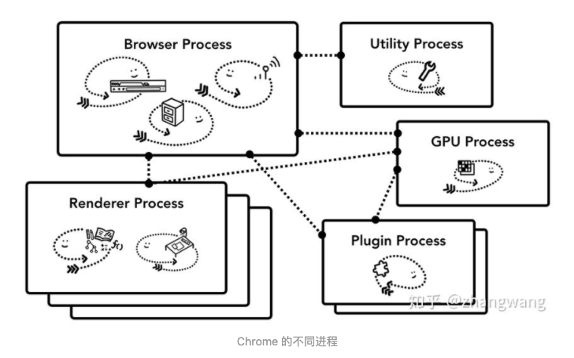

参考链接：

https://source.chromium.org/chromium/chromium/src/+/master:content/browser/browser_main.cc;bpv=0;bpt=1

https://zhuanlan.zhihu.com/p/47407398


## before start

在开始之前先补充一下chrome的多进程架构，其顶层存在一个Browser process用以协调浏览器的其他进程：



chrome进程的主要作用：

- browser process:
    - 负责包括地址栏、书签栏、前进后退栏等部分的工作。
    - 负责处理浏览器的一些不可见底层操作：网络请求和文件访问等。

- render process：
    - 负责一个tab内关于网页呈现的所有事情。

- plugin process：
    - 负责控制一个网页用到的所有插件：如flash

- GPU process
    - 负责处理GPU相关的任务

## start

由上面的内容我们也可以看出，浏览器最先启动的进程是browser进程，所以我们就从他入手：

``` c++
at content/browser/browser_main.cc

// Main routine for running as the Browser process.
int BrowserMain(const MainFunctionParams& parameters) {
  ScopedBrowserMainEvent scoped_browser_main_event;

  base::trace_event::TraceLog::GetInstance()->set_process_name("Browser");
  base::trace_event::TraceLog::GetInstance()->SetProcessSortIndex(
      kTraceEventBrowserProcessSortIndex);

  std::unique_ptr<BrowserMainRunnerImpl> main_runner(
      BrowserMainRunnerImpl::Create());

  int exit_code = main_runner->Initialize(parameters);
  if (exit_code >= 0)
    return exit_code;

  exit_code = main_runner->Run();

  main_runner->Shutdown();

  return exit_code;
}
```

该函数的主要内容是：

``` c++
  std::unique_ptr<BrowserMainRunnerImpl> main_runner(
      BrowserMainRunnerImpl::Create());

  int exit_code = main_runner->Initialize(parameters);
  if (exit_code >= 0)
    return exit_code;

  exit_code = main_runner->Run();
```

他看起来很简单，就是创建了一个BrowserMainRunnerImpl对象，并且Run()起来就完成了所有的工作。但是我们都知道浏览器有很多的启动方式，例如shell模式的browser就是以ContentMain来启动的。所以BrowserMainRunnerImpl就值得我们去探究一下了。

我们跟随到content/browser/browser_main_runner_impl.cc

``` c++
std::unique_ptr<BrowserMainRunnerImpl> BrowserMainRunnerImpl::Create() {
  return std::make_unique<BrowserMainRunnerImpl>();
}


int BrowserMainRunnerImpl::Initialize(const MainFunctionParams& parameters) {
  
 .........
 

#endif 

    gfx::InitializeFonts();

    main_loop_.reset(
        new BrowserMainLoop(parameters, std::move(scoped_execution_fence_)));

    main_loop_->Init();

    if (parameters.created_main_parts_closure) {
      std::move(*parameters.created_main_parts_closure)
          .Run(main_loop_->parts());
      delete parameters.created_main_parts_closure;
    }

    const int early_init_error_code = main_loop_->EarlyInitialization();
    if (early_init_error_code > 0)
      return early_init_error_code;

    // Must happen before we try to use a message loop or display any UI.
    if (!main_loop_->InitializeToolkit())
      return 1;

    main_loop_->PreMainMessageLoopStart();
    main_loop_->MainMessageLoopStart();
    main_loop_->PostMainMessageLoopStart();

    // WARNING: If we get a WM_ENDSESSION, objects created on the stack here
    // are NOT deleted. If you need something to run during WM_ENDSESSION add it
    // to browser_shutdown::Shutdown or BrowserProcess::EndSession.

    ui::InitializeInputMethod();
    UMA_HISTOGRAM_TIMES("Startup.BrowserMainRunnerImplInitializeStep1Time",
                        base::TimeTicks::Now() - start_time_step1);
  }
  const base::TimeTicks start_time_step2 = base::TimeTicks::Now();
  main_loop_->CreateStartupTasks();
  int result_code = main_loop_->GetResultCode();
  if (result_code > 0)
    return result_code;

  UMA_HISTOGRAM_TIMES("Startup.BrowserMainRunnerImplInitializeStep2Time",
                      base::TimeTicks::Now() - start_time_step2);

  // Return -1 to indicate no early termination.
  return -1;
}
 
 .......


int BrowserMainRunnerImpl::Run() {
  DCHECK(initialization_started_);
  DCHECK(!is_shutdown_);
  main_loop_->RunMainMessageLoopParts();
  return main_loop_->GetResultCode();
}
```
可以看到Initialize中基本是main_loop_接管了所有的工作，我们去查看一下他的声明：

```
at content/browser/browser_main_loop.h

std::unique_ptr<BrowserMainLoop> main_loop_;


在BrowserMainLoop类中给出了它的初始化顺序，如下面注释所示：
  // Quick reference for initialization order:
  // Constructor
  // Init()
  // EarlyInitialization()
  // InitializeToolkit()
  // PreMainMessageLoopStart()
  // MainMessageLoopStart()
  //   InitializeMainThread()
  // PostMainMessageLoopStart()
  // CreateStartupTasks()
  //   PreCreateThreads()
  //   CreateThreads()
  //   PostCreateThreads()
  //   BrowserThreadsStarted()
  //     InitializeMojo()
  //   PreMainMessageLoopRun()

```

BrowserMainLoop::Init():
``` c++
parts_ = GetContentClient()->browser()->CreateBrowserMainParts(parameters_);
```
 BrowserMainLoop对象的成员函数Init的主要任务是创建一个BrowserMainParts对象，并且保存在成员变量parts_中。
 
我们直接看比较重要的内容：MainMessageLoopStart()
 
 