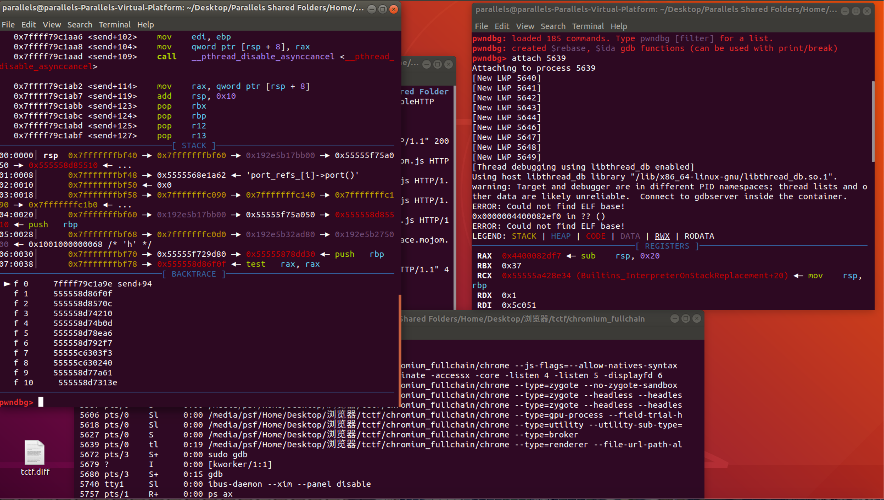

### v8入门

```
fetch v8 && cd v8
git checkout f7a1932ef928c190de32dd78246f75bd4ca8778b
gclient sync

#打入patch
git apply 'path/to/tctf.diff'

#配置
tools/dev/v8gen.py x64.debug

#编译
ninja -C out.gn/x64.debug
```

编辑out.gn/x64.release/args.gn，加入以下内容，以支持job等命令打印对象。
```
v8_enable_backtrace = true
v8_enable_disassembler = true
v8_enable_object_print = true
v8_enable_verify_heap = true
```

### gdb
起服务：
```
python -m SimpleHTTPServer 8000
```

gdb_test.sh:
```
file ./chrome

set args --headless --disable-gpu --user-data-dir=./userdata --remote-debugging-port=1338 --enable-blink-features=MojoJS http://127.0.0.1:8000/exp.html

set follow-fork-mode parent
```

gdb -x gdb_test.sh

### 下断点

gdb断点：
有符号的时候可以直接在函数下断点：b content::xxx::xxx

exp断点：
```
function debug(){
    for(let i = 0; i < 0x100000; i++){
        for(let j = 0; j < 0x100000; j++){
            var x = x + i + j;
        }
    }
}
```

### chrome中调d8

sh中增加--js-flags="--allow-natives-syntax"

可以在exp中添加%DebugPrint();来提供调试信息，下断点的方式就是用上面提到的debug()函数，在循环的时候ctrl+c，在 ps ax，新开一个gdb attach到 d8进程。




### chrome打log
```
#include "base/logging.h"
#include "content/public/browser/browser_thread.h"

LOG(ERROR) << "11111 " << std::endl
```


