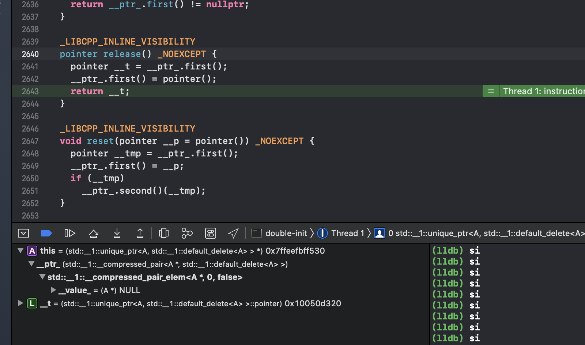

### double-init 分析

test代码：

```
#include<iostream>
#include<memory>

class A{
public:
    A()
    {
        printf("A构造\n");
    }
    ~A()
    {
        printf("A析构\n");
    }
    
};

class B{
public:
    std::unique_ptr<A> a_;
    void init()
    {
        a_ = std::make_unique<A>();
    }
};

int main()
{
    B b;
    b.init();
    b.init();
    getchar();
    return 0;
}
```

运行结果：

```
A构造
A构造
A析构
```

我们从源代码的角度来分别看一下这两次init：

```
 
unique_ptr& operator=(unique_ptr&& __u) 
_NOEXCEPT 
{ 
reset(__u.release());
__ptr_.second() = _VSTD::forward<deleter_type>(__u.get_deleter()); return *this;
}
....


pointer release() 
_NOEXCEPT 
{
pointer __t = __ptr_.first(); 
__ptr_.first() = pointer(); 
return __t;
}
...


void reset(pointer __p = pointer()) 
_NOEXCEPT 
{
pointer __tmp = __ptr_.first(); 
__ptr_.first() = __p;
if (__tmp)
    __ptr_.second()(__tmp); 
}
...


...
~unique_ptr() { reset(); }
```
下面是调试记录：

第一次init


第二次init



文字描述（建议结合图片食用）：
第一次：

- 在移动赋值operator=中，由std::make_unique\<A\>构造出的\_\_u被release,release的过程可以参考图一，release会返回原始指针并将this保存的__ptr置为NULL。

- 接着调用reset函数，将a自身保存的原始指针通过__ptr_.frist获取并放入__tmp临时保存（由于是第一次std::make_unique\<A\>();），所以此时__tmp为NULL。之后将a保存的原始指针替换为release的返回值。最后会根据__tmp是否为空来判断是否需要析构掉保存的对象。

第二次：

- 大致流程和第一次无异，我们着重观察reset函数。

- 可以看到在reset中，__tmp中保存了我们第一次init时获取的指针，之后会将自身保存的原始指针替换为新的指针，最后由于__tmp不为空，析构掉了他保存的对象。