turbofan学习记录

主要参考：https://doar-e.github.io/blog/2019/01/28/introduction-to-turbofan/#the-duplicateadditionreducer-challenge

https://docs.google.com/presentation/d/1sOEF4MlF7LeO7uq-uThJSulJlTh--wgLeaVibsbb3tc/edit#slide=id.g5499b9c42_01087

https://darksi.de/d.sea-of-nodes/


## 基础部分

- 使用Turbolizer

```
cd tools/npm
npm i
npm run-script build
python -m SimpleHTTPServer
```

- 跟踪优化

```
参数： --trace-opt

let f = (o) => {
  var obj = [1,2,3];
  var x = Math.ceil(Math.random());
  return obj[o+x];
}

for (let i = 0; i < 0x10000; ++i) {
 f(i); 
}


$ d8 pipeline.js  --trace-opt
[marking 0x192ee849db41 <JSFunction (sfi = 0x192ee849d991)> for optimized recompilation, reason: small function, ICs with typeinfo: 4/4 (100%), generic ICs: 0/4 (0%)]
[marking 0x28645d1801b1 <JSFunction f (sfi = 0x192ee849d9c9)> for optimized recompilation, reason: small function, ICs with typeinfo: 7/7 (100%), generic ICs: 2/7 (28%)]
[compiling method 0x28645d1801b1 <JSFunction f (sfi = 0x192ee849d9c9)> using TurboFan]
[optimizing 0x28645d1801b1 <JSFunction f (sfi = 0x192ee849d9c9)> - took 23.583, 25.899, 0.444 ms]
[completed optimizing 0x28645d1801b1 <JSFunction f (sfi = 0x192ee849d9c9)>]
[compiling method 0x192ee849db41 <JSFunction (sfi = 0x192ee849d991)> using TurboFan OSR]
[optimizing 0x192ee849db41 <JSFunction (sfi = 0x192ee849d991)> - took 18.238, 87.603, 0.874 ms]


参数： --trace-turbo
生成IR图
```

### TurboFan JIT Design

- Nodes：表达计算
    - 一般为常量，参数，算法，加载，存储，调用
    - 在源程序被SSA重命名时，也用节点替换局部变量

- Edges：表达依赖关系（约束顺序）
    - dataflow edges使用计算的输出值表示。
    - effect edges操作读写状态。

- Next：带有start、branches、loops、merge和end的控件

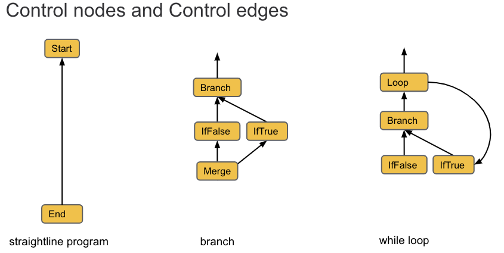


Effect edges:
code :
```
obj[x] = obj[x] + 1
```
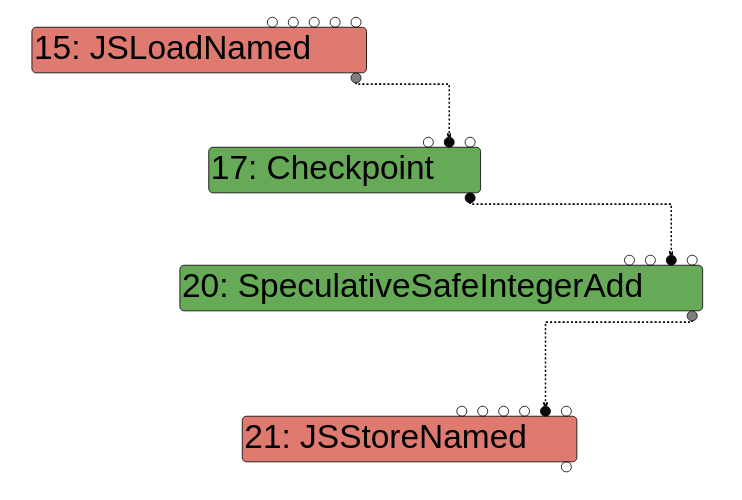


### Language Levels
R的node是随着JIT phase逐层下降接近至Machine的
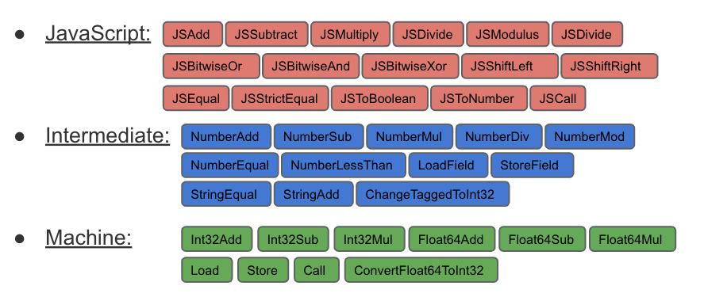

### Type and Range Analysis
这个后面会细说，这里就先跳过了

### Optimization
本文重点，依旧放在下面

### Reduction


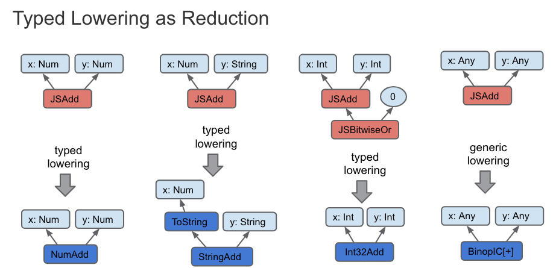
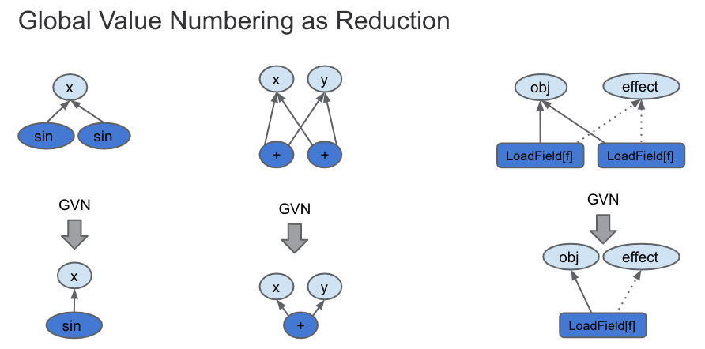


## 重点来了 optimization phases

首先放一个代码目录
```
src/builtin
Where all the builtins functions such as Array#concat are implemented

src/runtime
Where all the runtime functions such as %DebugPrint are implemented

src/interpreter/interpreter-generator.cc
Where all the bytecode handlers are implemented

src/compiler
Main repository for TurboFan!

src/compiler/pipeline.cc
The glue that builds the graph, runs every phase and optimizations passes etc

src/compiler/opcodes.h
Macros that defines all the opcodes used by TurboFan

src/compiler/typer.cc
Implements typing via the Typer reducer

src/compiler/operation-typer.cc
Implements some more typing, used by the Typer reducer

src/compiler/simplified-lowering.cc
Implements simplified lowering, where some CheckBounds elimination will be done
```

### turbolizer

在正式开始前，先补充一点关于turbolizer的知识：
turbolizer有很多不同颜色的节点：
- 黄色:这些节点代表控制节点，改变或描述脚本流程，例如起点或终点，返回，“ if”语句等。

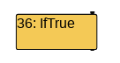
- 浅蓝色:表示某个节点可能具有或返回的值的节点。比如一个函数总是返回“ 42”，根据优化阶段，我们将其视为图形上的常数或范围（42、42）。

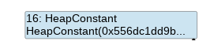
- 深蓝色:中级语言动作的表示（字节码指令），有助于了解从何处将反馈送到Turbofan中。

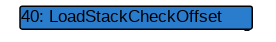
- 红色:这是在JavaScript级别执行的基本JavaScript代码或动作。例如JSEqual，JSToBoolean等。

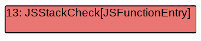
- 绿色:机器级别的语言。在此处可以找到V8 Turbolizer上机器级别语言的操作和标识符示例。

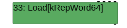

小技巧：
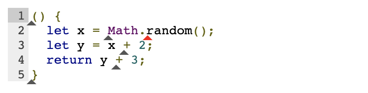
可以看到在代码下面有小三角，点击小三角可以在图中高亮显示对应对应的node。

### NumberAdd

code:
```
function opt_me() {
  let x = Math.random();
  let y = x + 2;
  return y + 3;
}
```

##### bytecode graph builder
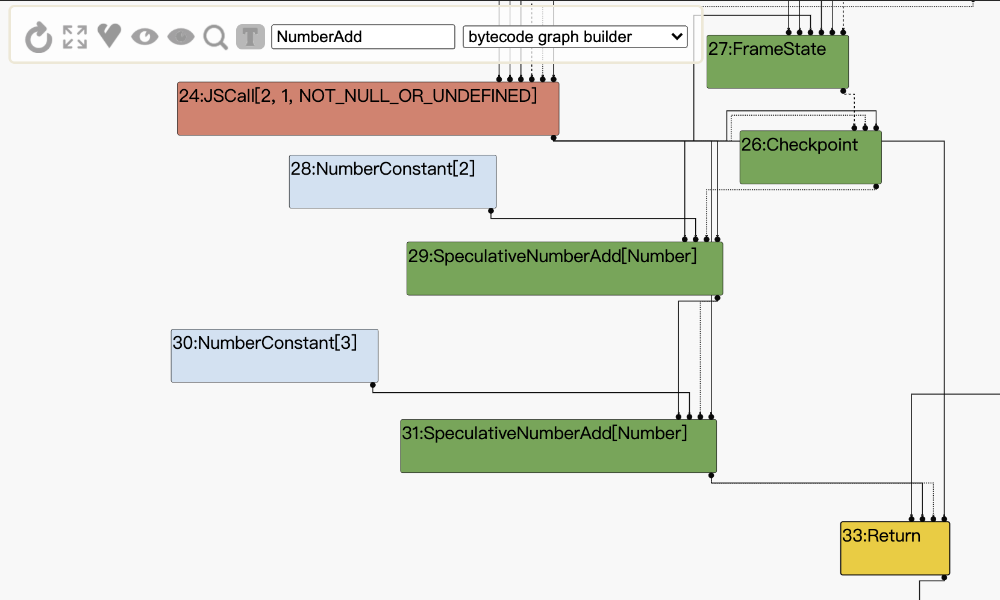
我们首先来带bytecode graph builder阶段，该阶段就是简单的将js代码编译为字节码。

- 图中的JSCall对应代码中的Math.random()函数的调用，之后可以看到有两个NumberConstant和两个SpeculativeNumberAdd，很轻易就可以看出他们是由于x + 2和y + 3生成的。

##### Typer phase

在该阶段会尽可能的推测各节点的类型，它由OptimizeGraph运行。
```
// pipeline.cc
bool PipelineImpl::OptimizeGraph(Linkage* linkage) {
  PipelineData* data = this->data_;
  // Type the graph and keep the Typer running such that new nodes get
  // automatically typed when they are created.
  Run<TyperPhase>(data->CreateTyper());


// pipeline.cc
struct TyperPhase {
  void Run(PipelineData* data, Zone* temp_zone, Typer* typer) {
    // [...]
    typer->Run(roots, &induction_vars);
  }
};
```
Typer运行时，它访问图形的每一个节点，并试图减少他们。
```
// typer.cc
void Typer::Run(const NodeVector& roots,
                LoopVariableOptimizer* induction_vars) {
  // [...]
  Visitor visitor(this, induction_vars);
  GraphReducer graph_reducer(zone(), graph());
  graph_reducer.AddReducer(&visitor);
  for (Node* const root : roots) 
    graph_reducer.ReduceNode(root);
  graph_reducer.ReduceGraph();
  // [...]
}

class Typer::Visitor : public Reducer {
// ...
  Reduction Reduce(Node* node) override {
// calls visitors such as JSCallTyper
}
```

我们先来看JSCall，它会在它访问的每个JSCall节点上调用JSCallTyper，从下面的代码可以看到，如果调用的函数是一个内置函数时，他就会将一个类型与它关联起来，本例中，调用了MathRandom内置函数，所以返回了Type::PlainNumber类型。
```
// typer.cc
Type Typer::Visitor::JSCallTyper(Type fun, Typer* t) {
  if (!fun.IsHeapConstant() || !fun.AsHeapConstant()->Ref().IsJSFunction()) {
    return Type::NonInternal();
  }
  JSFunctionRef function = fun.AsHeapConstant()->Ref().AsJSFunction();
  if (!function.shared().HasBuiltinFunctionId()) {
    return Type::NonInternal();
  }
  switch (function.shared().builtin_function_id()) {
    case BuiltinFunctionId::kMathRandom:
      return Type::PlainNumber();

```

接下来是NumberConstant节点，由下面的代码可以得到，这里我们的返回类型是range

```
Type Typer::Visitor::TypeNumberConstant(Node* node) {
  double number = OpParameter<double>(node->op());
  return Type::NewConstant(number, zone());
}
Type Type::NewConstant(double value, Zone* zone) {
  if (RangeType::IsInteger(value)) {
    return Range(value, value, zone);
  } else if (IsMinusZero(value)) {
    return Type::MinusZero();
  } else if (std::isnan(value)) {
    return Type::NaN();
  }

  DCHECK(OtherNumberConstantType::IsOtherNumberConstant(value));
  return OtherNumberConstant(value, zone);
}
```

下一个是SpeculativeNumberAdd，我们需要先去查看OperationTyper

```
#define SPECULATIVE_NUMBER_BINOP(Name)                         \
  Type OperationTyper::Speculative##Name(Type lhs, Type rhs) { \
    lhs = SpeculativeToNumber(lhs);                            \
    rhs = SpeculativeToNumber(rhs);                            \
    return Name(lhs, rhs);                                     \
  }
SPECULATIVE_NUMBER_BINOP(NumberAdd)
#undef SPECULATIVE_NUMBER_BINOP

Type OperationTyper::SpeculativeToNumber(Type type) {
  return ToNumber(Type::Intersect(type, Type::NumberOrOddball(), zone()));
}
```
在OperationTyper::Speculative##Name中，通过SpeculativeToNumber来获得操作的左右值，为了保持简单，任何类型的Type::Number将保持相同的类型(一个PlainNumber就是一个数字，它将保持为一个PlainNumber)。Range(n,n)类型也将成为一个数字，因此我们最终调用NumberAdd对两个数字进行操作。

OperationTyper::Speculative##Name最终将SpeculativeNumberAdd处理为了NumberAdd(lhs, rhs)。

NumberAdd主要检查一些极端情况，比如这两种类型中的一种是MinusZero在大多数情况下，函数将简单地返回PlainNumber type。

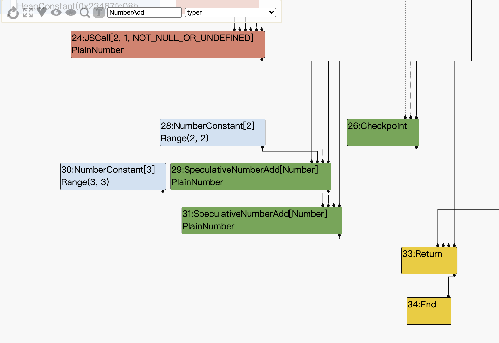

### Type lowering

Typed Lowering阶段会使用更加合适的函数来进行运算:

在函数OptimizeGraph中（接着上面），typing结束后立即进行Type lowering：
```
// pipeline.cc
bool PipelineImpl::OptimizeGraph(Linkage* linkage) {
  PipelineData* data = this->data_;

  data->BeginPhaseKind("lowering");

  if (FLAG_concurrent_typed_lowering) {
    // Type the graph and keep the Typer running such that new nodes get
    // automatically typed when they are created.
    Run<TyperPhase>(data->CreateTyper());
    RunPrintAndVerify(TyperPhase::phase_name());
    Run<TypedLoweringPhase>();
    RunPrintAndVerify(TypedLoweringPhase::phase_name());
    data->DeleteTyper();
  }
}
```
这个阶段会经历更多的reducer
```
// pipeline.cc
struct TypedLoweringPhase {
  static const char* phase_name() { return "typed lowering"; }

  void Run(PipelineData* data, Zone* temp_zone) {
    GraphReducer graph_reducer(temp_zone, data->graph(),
                               data->jsgraph()->Dead());
    DeadCodeElimination dead_code_elimination(&graph_reducer, data->graph(),
                                              data->common(), temp_zone);
    JSCreateLowering create_lowering(&graph_reducer, data->dependencies(),
                                     data->jsgraph(), data->js_heap_broker(),
                                     temp_zone);
    JSTypedLowering typed_lowering(&graph_reducer, data->jsgraph(),
                                   data->js_heap_broker(), temp_zone);
    ConstantFoldingReducer constant_folding_reducer(
        &graph_reducer, data->jsgraph(), data->js_heap_broker());
    TypedOptimization typed_optimization(&graph_reducer, data->dependencies(),
                                         data->jsgraph(),
                                         data->js_heap_broker());
    SimplifiedOperatorReducer simple_reducer(&graph_reducer, data->jsgraph(),
                                             data->js_heap_broker());
    CheckpointElimination checkpoint_elimination(&graph_reducer);
    CommonOperatorReducer common_reducer(&graph_reducer, data->graph(),
                                         data->js_heap_broker(), data->common(),
                                         data->machine(), temp_zone);
    AddReducer(data, &graph_reducer, &dead_code_elimination);
    AddReducer(data, &graph_reducer, &create_lowering);
    AddReducer(data, &graph_reducer, &constant_folding_reducer);
    AddReducer(data, &graph_reducer, &typed_optimization);
    AddReducer(data, &graph_reducer, &typed_lowering);
    AddReducer(data, &graph_reducer, &simple_reducer);
    AddReducer(data, &graph_reducer, &checkpoint_elimination);
    AddReducer(data, &graph_reducer, &common_reducer);
    graph_reducer.ReduceGraph();
  }
};
```

下面来看TypedOptimization和TypedOptimization::Reduce：

```
Reduction JSTypedLowering::Reduce(Node* node) {
  DisallowHeapAccess no_heap_access;

  switch (node->opcode()) {
  //[...]
  case IrOpcode::kSpeculativeNumberAdd:
      return ReduceSpeculativeNumberAdd(node);
  //[...]
    default:
      break;
  }
  return NoChange();
}
```

当一个node被访问，并且它的opcode是IrOpcode::kSpeculativeNumberAdd,他就会调用ReduceSpeculativeNumberAdd。
```
Reduction TypedOptimization::ReduceSpeculativeNumberAdd(Node* node) {
  Node* const lhs = NodeProperties::GetValueInput(node, 0);
  Node* const rhs = NodeProperties::GetValueInput(node, 1);
  Type const lhs_type = NodeProperties::GetType(lhs);
  Type const rhs_type = NodeProperties::GetType(rhs);
  NumberOperationHint hint = NumberOperationHintOf(node->op());
  if ((hint == NumberOperationHint::kNumber ||
       hint == NumberOperationHint::kNumberOrOddball) &&
      BothAre(lhs_type, rhs_type, Type::PlainPrimitive()) &&
      NeitherCanBe(lhs_type, rhs_type, Type::StringOrReceiver())) {
    // SpeculativeNumberAdd(x:-string, y:-string) =>
    //     NumberAdd(ToNumber(x), ToNumber(y))
    Node* const toNum_lhs = ConvertPlainPrimitiveToNumber(lhs);
    Node* const toNum_rhs = ConvertPlainPrimitiveToNumber(rhs);
    Node* const value =
        graph()->NewNode(simplified()->NumberAdd(), toNum_lhs, toNum_rhs);
    ReplaceWithValue(node, value);
    return Replace(node);
  }
  return NoChange();
}
```
在我们的两个节点中，都有一个NumberOperationHint::kNumber的hint，因为它们的类型是PlainNumber。

右手边和左手边类型都是plainprimitive(来自NumberConstant的Range的PlainNumber和来自JSCall的PlainNumber)。因此，将创建一个新的NumberAdd节点并替换SpeculativeNumberAdd。

同样当JSTypedLowering reducer访问到JSCall node时，将会调用JSTypedLowering::ReduceJSCall，Because the call target is a Code Stub Assembler implementation of a builtin function, TurboFan simply creates a LoadField node and change the opcode of the JSCall node to a Call opcode.

```
Reduction JSTypedLowering::ReduceJSCall(Node* node) {
// [...]
// Check if {target} is a known JSFunction.
// [...]
    // Load the context from the {target}.
    Node* context = effect = graph()->NewNode(
        simplified()->LoadField(AccessBuilder::ForJSFunctionContext()), target,
        effect, control);
    NodeProperties::ReplaceContextInput(node, context);

    // Update the effect dependency for the {node}.
    NodeProperties::ReplaceEffectInput(node, effect);
// [...]
// kMathRandom is a CSA builtin, not a CPP one
// builtins-math-gen.cc:TF_BUILTIN(MathRandom, CodeStubAssembler) 
// builtins-definitions.h:  TFJ(MathRandom, 0, kReceiver)  
    } else if (shared.HasBuiltinId() &&
               Builtins::HasCppImplementation(shared.builtin_id())) {
      // Patch {node} to a direct CEntry call.
      ReduceBuiltin(jsgraph(), node, shared.builtin_id(), arity, flags);
    } else if (shared.HasBuiltinId() &&
               Builtins::KindOf(shared.builtin_id()) == Builtins::TFJ) {
      // Patch {node} to a direct code object call.
      Callable callable = Builtins::CallableFor(
          isolate(), static_cast<Builtins::Name>(shared.builtin_id()));
      CallDescriptor::Flags flags = CallDescriptor::kNeedsFrameState;

      const CallInterfaceDescriptor& descriptor = callable.descriptor();
      auto call_descriptor = Linkage::GetStubCallDescriptor(
          graph()->zone(), descriptor, 1 + arity, flags);
      Node* stub_code = jsgraph()->HeapConstant(callable.code());
      node->InsertInput(graph()->zone(), 0, stub_code);  // Code object.
      node->InsertInput(graph()->zone(), 2, new_target);
      node->InsertInput(graph()->zone(), 3, argument_count);
      NodeProperties::ChangeOp(node, common()->Call(call_descriptor));
    }
 // [...]
    return Changed(node);
  }
```

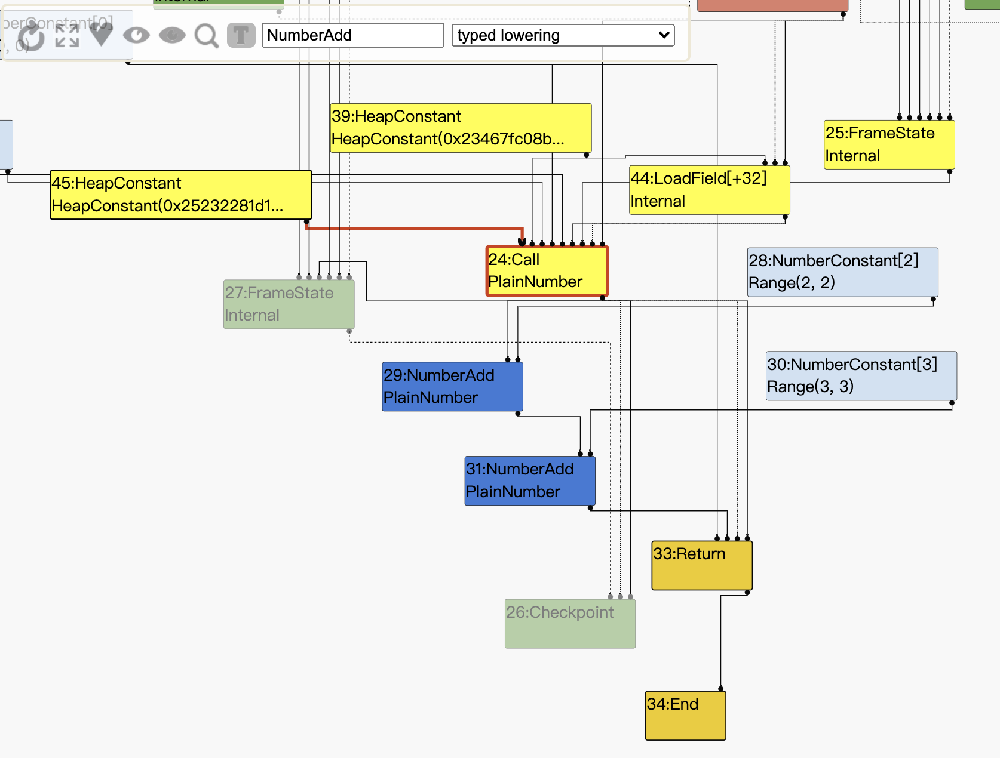

### Range types

```
function opt_me(b) {
  let x = 10; // [1] x0 = 10  Rang(10,10)
  if (b == "foo")
    x = 5; // [2] x1 = 5  Rang(5,5)
  // [3] x2 = phi(x0, x1)
  let y = x + 2;
  y = y + 1000; 
  y = y * 2;
  return y;
}
```

phi node会对两个分支的range取并集，即Range(5,10)。

CFG图如下：

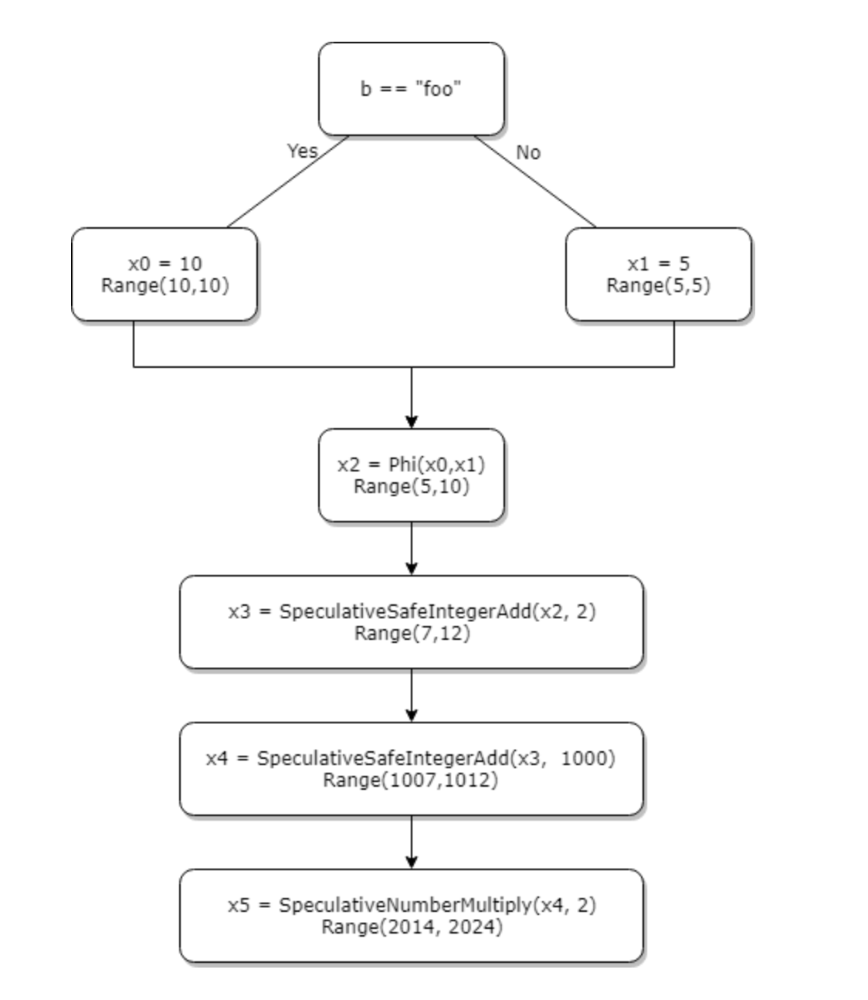

接着来看下对应的代码：

```
Type Typer::Visitor::TypePhi(Node* node) {
  int arity = node->op()->ValueInputCount();
  Type type = Operand(node, 0);
  for (int i = 1; i < arity; ++i) {
    type = Type::Union(type, Operand(node, i), zone());
  }
  return type;
}
```
可以看到在TypePhi中，确实和我们所预测的类似，他是取输入的并集

对于SpeculativeSafeIntegerAdd，我们还是回到OperationTyper：

```
Type OperationTyper::SpeculativeSafeIntegerAdd(Type lhs, Type rhs) {
  Type result = SpeculativeNumberAdd(lhs, rhs);
  // If we have a Smi or Int32 feedback, the representation selection will
  // either truncate or it will check the inputs (i.e., deopt if not int32).
  // In either case the result will be in the safe integer range, so we
  // can bake in the type here. This needs to be in sync with
  // SimplifiedLowering::VisitSpeculativeAdditiveOp.
  return Type::Intersect(result, cache_->kSafeIntegerOrMinusZero, zone());
}


Type OperationTyper::NumberAdd(Type lhs, Type rhs) {
// [...]
  Type type = Type::None();
  lhs = Type::Intersect(lhs, Type::PlainNumber(), zone());
  rhs = Type::Intersect(rhs, Type::PlainNumber(), zone());
  if (!lhs.IsNone() && !rhs.IsNone()) {
    if (lhs.Is(cache_->kInteger) && rhs.Is(cache_->kInteger)) {
      type = AddRanger(lhs.Min(), lhs.Max(), rhs.Min(), rhs.Max());
    } 
// [...]
  return type;
}
```
可以看到最终是通过AddRanger来实现的范围分析：
```
Type OperationTyper::AddRanger(double lhs_min, double lhs_max, double rhs_min,
                               double rhs_max) {
  double results[4];
  results[0] = lhs_min + rhs_min;
  results[1] = lhs_min + rhs_max;
  results[2] = lhs_max + rhs_min;
  results[3] = lhs_max + rhs_max;
  // Since none of the inputs can be -0, the result cannot be -0 either.
  // However, it can be nan (the sum of two infinities of opposite sign).
  // On the other hand, if none of the "results" above is nan, then the
  // actual result cannot be nan either.
  int nans = 0;
  for (int i = 0; i < 4; ++i) {
    if (std::isnan(results[i])) ++nans;
  }
  if (nans == 4) return Type::NaN();
  Type type = Type::Range(array_min(results, 4), array_max(results, 4), zone());
  if (nans > 0) type = Type::Union(type, Type::NaN(), zone());
  // Examples:
  //   [-inf, -inf] + [+inf, +inf] = NaN
  //   [-inf, -inf] + [n, +inf] = [-inf, -inf] \/ NaN
  //   [-inf, +inf] + [n, +inf] = [-inf, +inf] \/ NaN
  //   [-inf, m] + [n, +inf] = [-inf, +inf] \/ NaN
  return type;
}
```
AddRanger函数的最用就是返回参数的最大值和最小值。

至此范围分析结束。

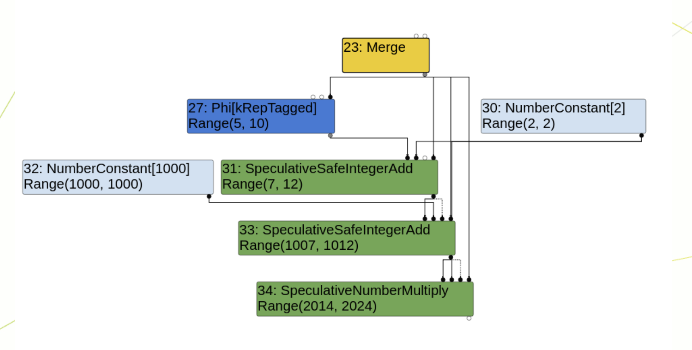

### CheckBounds Node

我们简单来写一个demo来测试一下：
```
function opt_me(b) {
  let values = [42,1337];       // HeapConstant <FixedArray[2]>
  let x = 10;                   // NumberConstant[10]          | Range(10,10)
  if (b == "foo")
    x = 5;                      // NumberConstant[5]           | Range(5,5)
                                // Phi                         | Range(5,10)
  let y = x + 2;                // SpeculativeSafeIntegerAdd   | Range(7,12)
  y = y + 1000;                 // SpeculativeSafeIntegerAdd   | Range(1007,1012)
  y = y * 2;                    // SpeculativeNumberMultiply   | Range(2014,2024)
  y = y & 10;                   // SpeculativeNumberBitwiseAnd | Range(0,10)
  y = y / 3;                    // SpeculativeNumberDivide     | PlainNumber[r][s][t]
  y = y & 1;                    // SpeculativeNumberBitwiseAnd | Range(0,1)
  return values[y];             // CheckBounds                 | Range(0,1)
}
```

逃逸分析时的图：


Simplified lowering(简化降低后)：

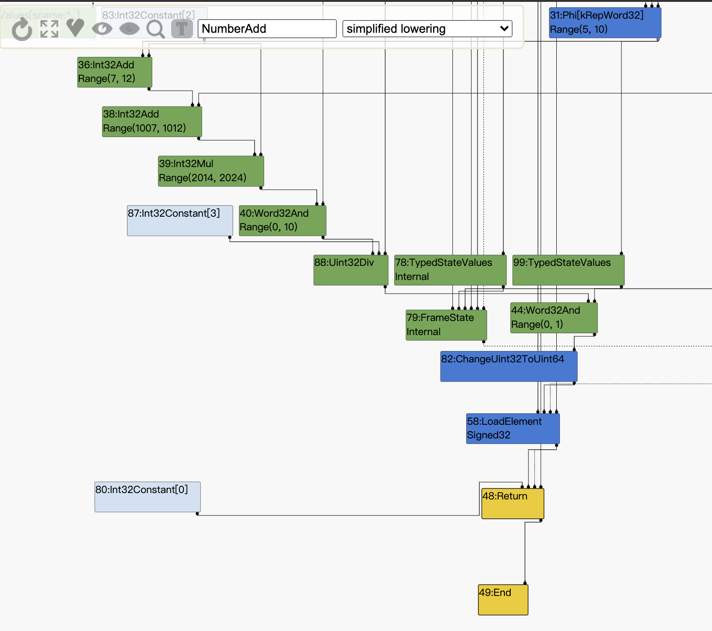

可以看到checkbounds被消除了，我们来从代码分析一下：

在访问node时，如果opcode为IrOpcode::kCheckBounds，将会调用VisitCheckBounds函数：

```
 void VisitCheckBounds(Node* node, SimplifiedLowering* lowering) {
    CheckParameters const& p = CheckParametersOf(node->op());
    Type const index_type = TypeOf(node->InputAt(0));
    Type const length_type = TypeOf(node->InputAt(1));
    if (length_type.Is(Type::Unsigned31())) {
      if (index_type.Is(Type::Integral32OrMinusZero())) {
        // Map -0 to 0, and the values in the [-2^31,-1] range to the
        // [2^31,2^32-1] range, which will be considered out-of-bounds
        // as well, because the {length_type} is limited to Unsigned31.
        VisitBinop(node, UseInfo::TruncatingWord32(),
                   MachineRepresentation::kWord32);
        if (lower()) {
          if (lowering->poisoning_level_ ==
                  PoisoningMitigationLevel::kDontPoison &&
              (index_type.IsNone() || length_type.IsNone() ||
               (index_type.Min() >= 0.0 &&
                index_type.Max() < length_type.Min()))) {
            // The bounds check is redundant if we already know that
            // the index is within the bounds of [0.0, length[.
            DeferReplacement(node, node->InputAt(0)); <--- [1]
          } else {
            NodeProperties::ChangeOp(
                node, simplified()->CheckedUint32Bounds(p.feedback()));
          }
        }
// [...]
  }
```
他会获取0（索引）和1（长度），重点在[1]处，这个函数的作用是消除checkbounds，根据代码可以得知，当索引的最大值小于长度的最小值时，就会在简化阶段将checkbounds消除。

当然checkbounds如此方便的被攻击点，已经被修复了，现在有了新的利用方式：
（建议搭配该ctf题一起食用：https://github.com/yytgravity/Daily-learning-record/blob/master/chrome/turbofan/%E6%95%B0%E7%BB%84%E8%B6%8A%E7%95%8C%E7%B1%BB/qwb%20growupjs.md）

首先是修改后的VisitCheckBounds函数：

### Simplified lowering
```
  void VisitCheckBounds(Node* node, SimplifiedLowering* lowering) {
    CheckParameters const& p = CheckParametersOf(node->op());
    Type const index_type = TypeOf(node->InputAt(0));
    Type const length_type = TypeOf(node->InputAt(1));
    if (length_type.Is(Type::Unsigned31())) {
      if (index_type.Is(Type::Integral32OrMinusZero())) {
        // Map -0 to 0, and the values in the [-2^31,-1] range to the
        // [2^31,2^32-1] range, which will be considered out-of-bounds
        // as well, because the {length_type} is limited to Unsigned31.
        VisitBinop(node, UseInfo::TruncatingWord32(),
                   MachineRepresentation::kWord32);
        if (lower()) {
          CheckBoundsParameters::Mode mode =
              CheckBoundsParameters::kDeoptOnOutOfBounds;
          if (lowering->poisoning_level_ ==
                  PoisoningMitigationLevel::kDontPoison &&
              (index_type.IsNone() || length_type.IsNone() ||
               (index_type.Min() >= 0.0 &&
                index_type.Max() < length_type.Min()))) {
            // The bounds check is redundant if we already know that
            // the index is within the bounds of [0.0, length[.
            mode = CheckBoundsParameters::kAbortOnOutOfBounds;         // [1]
          }
          NodeProperties::ChangeOp(
              node, simplified()->CheckedUint32Bounds(p.feedback(), mode)); // [2]
        }
// [...]
  }
```
对比上面的代码可以很清晰的看出来，在之前，如果步入到了[1]处，就会调用DeferReplacement，但是现在节点被降低到CheckedUint32Bounds，并采用AbortOnOutOfBounds模式[2]。

### Effect linearization

下面是CheckedUint32Bounds降低的代码：
```
Node* EffectControlLinearizer::LowerCheckedUint32Bounds(Node* node,
                                                        Node* frame_state) {
  Node* index = node->InputAt(0);
  Node* limit = node->InputAt(1);
  const CheckBoundsParameters& params = CheckBoundsParametersOf(node->op());

  Node* check = __ Uint32LessThan(index, limit);
  switch (params.mode()) {
    case CheckBoundsParameters::kDeoptOnOutOfBounds:
      __ DeoptimizeIfNot(DeoptimizeReason::kOutOfBounds,
                         params.check_parameters().feedback(), check,
                         frame_state, IsSafetyCheck::kCriticalSafetyCheck);
      break;
    case CheckBoundsParameters::kAbortOnOutOfBounds: {
      auto if_abort = __ MakeDeferredLabel();
      auto done = __ MakeLabel();

      __ Branch(check, &done, &if_abort);

      __ Bind(&if_abort);
      __ Unreachable();
      __ Goto(&done);

      __ Bind(&done);
      break;
    }
  }

  return index;
}
```
可以看到CheckedUint32Bounds降低为了Uint32LessThan，如果越界就会到达Unreachable节点。

在指令选择期间，无法到达的节点将会被替换为断点opcode：
```
void InstructionSelector::VisitUnreachable(Node* node) {
  OperandGenerator g(this);
  Emit(kArchDebugBreak, g.NoOutput());
}
```

我们根据图来观察一下变化

code：
```
var opt_me = () => {
    let arr = [1,2,3,4];
    let badly_typed = 0;
    let idx = badly_typed * 5;
    return arr[idx];
  };
  opt_me();
  %OptimizeFunctionOnNextCall(opt_me);
  opt_me();
```

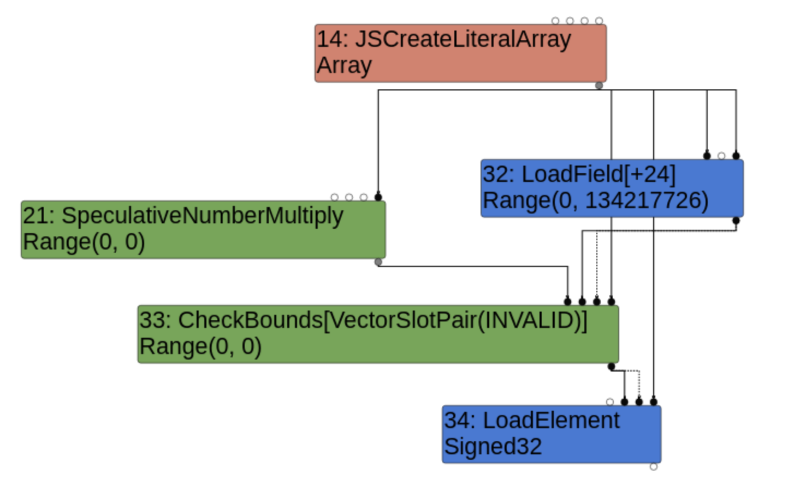

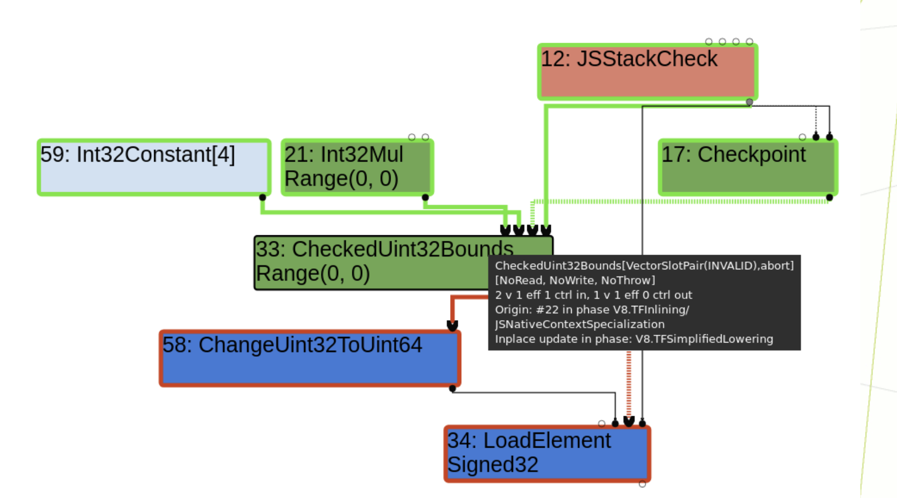

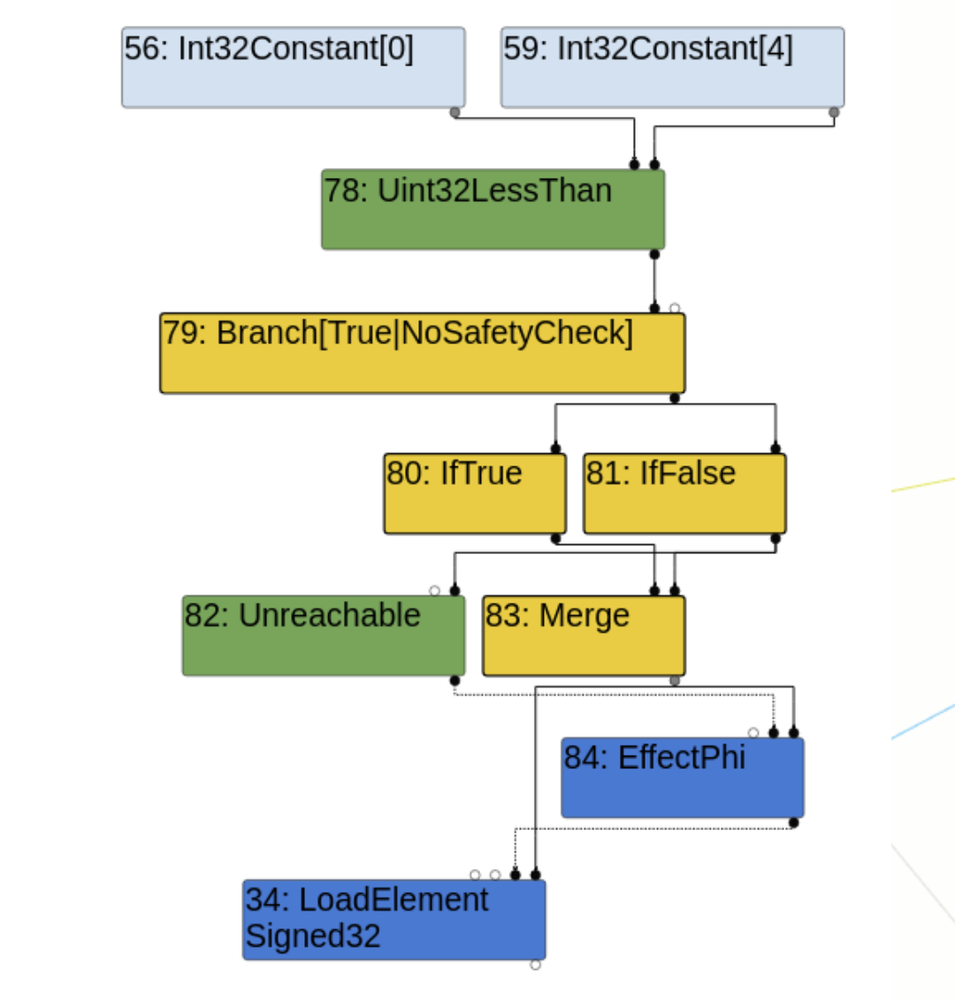

最终CheckedUint32Bounds被Uint32LessThan等多个节点所代替，接着在Late optimization中还会做进一步的优化（MachineOperatorReducer and DeadCodeElimination）：

```
// Perform constant folding and strength reduction on machine operators.
Reduction MachineOperatorReducer::Reduce(Node* node) {
  switch (node->opcode()) {
// [...]
      case IrOpcode::kUint32LessThan: {
      Uint32BinopMatcher m(node);
      if (m.left().Is(kMaxUInt32)) return ReplaceBool(false);  // M < x => false
      if (m.right().Is(0)) return ReplaceBool(false);          // x < 0 => false
      if (m.IsFoldable()) {                                    // K < K => K
        return ReplaceBool(m.left().Value() < m.right().Value());
      }
      if (m.LeftEqualsRight()) return ReplaceBool(false);  // x < x => false
      if (m.left().IsWord32Sar() && m.right().HasValue()) {
        Int32BinopMatcher mleft(m.left().node());
        if (mleft.right().HasValue()) {
          // (x >> K) < C => x < (C << K)
          // when C < (M >> K)
          const uint32_t c = m.right().Value();
          const uint32_t k = mleft.right().Value() & 0x1F;
          if (c < static_cast<uint32_t>(kMaxInt >> k)) {
            node->ReplaceInput(0, mleft.left().node());
            node->ReplaceInput(1, Uint32Constant(c << k));
            return Changed(node);
          }
          // TODO(turbofan): else the comparison is always true.
        }
      }
      break;
    }
// [...]
```

根据代码可以得知Uint32LessThan会被优化向两个方向：True -> Int32Constant 或 False -> removed by the dead code elimination。

如果成功进入到true分支，则会消除掉check，这样的话我们就可以自由的oob了，（其实这里还有一个检测，我们放到下面说）。

### 小结

- arr[good_idx] leads to the creation of a CheckBounds node in the early phases
- during "simplified lowering", it gets replaced by an aborting CheckedUint32Bounds
- The CheckedUint32Bounds gets replaced by several nodes during "effect linearization" : Uint32LessThan and Unreachable
- Uint32LessThan is constant folded during the "Late Optimization" phase
- The Unreachable node is removed during dead code elimination of the "Late Optimization" phase
- Only a simple Load remains during the final scheduling
- Generated assembly is a simple mov instruction without bound checking


一道ctf例题：
https://github.com/yytgravity/Daily-learning-record/blob/master/chrome/turbofan/%E6%95%B0%E7%BB%84%E8%B6%8A%E7%95%8C%E7%B1%BB/qwb%20growupjs.md

如果我们根据上面的分析，直接写出如下代码：
```
function test() {
    let arr = [1.1, 2.2, 3.3, 4.4];
    let idx = 4; <- [1]
    return arr[idx];
}
for (i = 0; i < 10000; i++){
    test();
}
```
很明显[1]处数组越界，但是这个test是无法成功的，因为JSNativeContextSpecialization::BuildElementAccess函数中有一个mode需要我们注意：load_mode=LOAD_IGNORE_OUT_OF_BOUNDS
他会在array的index超出了array的length时出现（可以说得上是数组越界的老朋友了）接着就需要对index进行check，看是否超出了Smi::kMaxValue，引入了一个new CheckBounds节点。

```
// Check if we might need to grow the {elements} backing store.
if (keyed_mode.IsStore() && IsGrowStoreMode(keyed_mode.store_mode())) {
  // For growing stores we validate the {index} below.
} else if (keyed_mode.IsLoad() &&
           keyed_mode.load_mode() == LOAD_IGNORE_OUT_OF_BOUNDS &&
           CanTreatHoleAsUndefined(receiver_maps)) {
  // Check that the {index} is a valid array index, we do the actual
  // bounds check below and just skip the store below if it's out of
  // bounds for the {receiver}.
  index = effect = graph()->NewNode(
      simplified()->CheckBounds(VectorSlotPair()), index,
      jsgraph()->Constant(Smi::kMaxValue), effect, control);
} else {
  // Check that the {index} is in the valid range for the {receiver}.
  index = effect =
      graph()->NewNode(simplified()->CheckBounds(VectorSlotPair()), index,
                       length, effect, control);
}
```
然后还需要对index进行实际的check，也就是比较index是否小于array length，引入了一个NumberLessThan节点。
```
// Check if we can return undefined for out-of-bounds loads.
      if (keyed_mode.load_mode() == LOAD_IGNORE_OUT_OF_BOUNDS &&
          CanTreatHoleAsUndefined(receiver_maps)) {
        Node* check =
            graph()->NewNode(simplified()->NumberLessThan(), index, length);
        Node* branch = graph()->NewNode(
            common()->Branch(BranchHint::kTrue,
                             IsSafetyCheck::kCriticalSafetyCheck),
            check, control);

        Node* if_true = graph()->NewNode(common()->IfTrue(), branch);
        Node* etrue = effect;
        Node* vtrue;
        {
          // Perform the actual load
          vtrue = etrue =
              graph()->NewNode(simplified()->LoadElement(element_access),
                               elements, index, etrue, if_true);
```
然后这个节点在LoadElimination进行TyperNarrowingReducer的时候。
```
switch (node->opcode()) {
  case IrOpcode::kNumberLessThan: {
    // TODO(turbofan) Reuse the logic from typer.cc (by integrating relational
    // comparisons with the operation typer).
    Type left_type = NodeProperties::GetType(node->InputAt(0));
    Type right_type = NodeProperties::GetType(node->InputAt(1));
    if (left_type.Is(Type::PlainNumber()) &&
        right_type.Is(Type::PlainNumber())) {
      if (left_type.Max() < right_type.Min()) {
        new_type = op_typer_.singleton_true();
      } else if (left_type.Min() >= right_type.Max()) {
        new_type = op_typer_.singleton_false();
      }
    }
    break;
  }
```
重点！：left_type（index），right_type（array length），我们只有在这里绕过这个判断else if (left_type.Min() >= right_type.Max())才能自由的oob。
否则kNumberLessThan的类型会被更新成false，然后在ConstantFoldingReducer时候
```
Reduction ConstantFoldingReducer::Reduce(Node* node) {
  DisallowHeapAccess no_heap_access;
  // Check if the output type is a singleton.  In that case we already know the
  // result value and can simply replace the node if it's eliminable.
  if (!NodeProperties::IsConstant(node) && NodeProperties::IsTyped(node) &&
      node->op()->HasProperty(Operator::kEliminatable)) {
    // TODO(v8:5303): We must not eliminate FinishRegion here. This special
    // case can be removed once we have separate operators for value and
    // effect regions.
    if (node->opcode() == IrOpcode::kFinishRegion) return NoChange();
    // We can only constant-fold nodes here, that are known to not cause any
    // side-effect, may it be a JavaScript observable side-effect or a possible
    // eager deoptimization exit (i.e. {node} has an operator that doesn't have
    // the Operator::kNoDeopt property).
    Type upper = NodeProperties::GetType(node);
    if (!upper.IsNone()) {
      Node* replacement = nullptr;
      if (upper.IsHeapConstant()) {
        replacement = jsgraph()->Constant(upper.AsHeapConstant()->Ref());
```
被直接折叠成了false节点。


