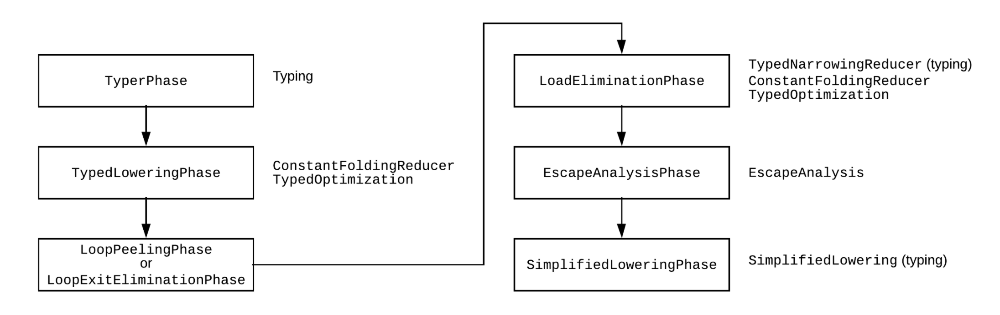

JIT代码优化位于PipelineImpl类中，包括建图以及优化图等。

```
// v8\src\compiler\pipeline.cc
class PipelineImpl final {
 public:
  explicit PipelineImpl(PipelineData* data) : data_(data) {}

  // Helpers for executing pipeline phases.
  template <typename Phase>
  void Run();
  template <typename Phase, typename Arg0>
  void Run(Arg0 arg_0);
  template <typename Phase, typename Arg0, typename Arg1>
  void Run(Arg0 arg_0, Arg1 arg_1);

  // Step A. Run the graph creation and initial optimization passes.
  bool CreateGraph();

  // B. Run the concurrent optimization passes.
  bool OptimizeGraph(Linkage* linkage);

  // Substep B.1. Produce a scheduled graph.
  void ComputeScheduledGraph();

  // Substep B.2. Select instructions from a scheduled graph.
  bool SelectInstructions(Linkage* linkage);

  // Step C. Run the code assembly pass.
  void AssembleCode(Linkage* linkage);

  // Step D. Run the code finalization pass.
  MaybeHandle<Code> FinalizeCode();

  // Step E. Install any code dependencies.
  bool CommitDependencies(Handle<Code> code);

  void VerifyGeneratedCodeIsIdempotent();
  void RunPrintAndVerify(const char* phase, bool untyped = false);
  MaybeHandle<Code> GenerateCode(CallDescriptor* call_descriptor);
  void AllocateRegisters(const RegisterConfiguration* config,
                         CallDescriptor* call_descriptor, bool run_verifier);

  OptimizedCompilationInfo* info() const;
  Isolate* isolate() const;
  CodeGenerator* code_generator() const;

 private:
  PipelineData* const data_;
};
```

我们接着就从CreateGraph开始按顺序分析优化过程中的代码，顺序如下：


## CreateGraph

```
bool PipelineImpl::CreateGraph() {
  PipelineData* data = this->data_;
  UnparkedScopeIfNeeded unparked_scope(data->broker());

  data->BeginPhaseKind("V8.TFGraphCreation");

  Run<GraphBuilderPhase>();
  RunPrintAndVerify(GraphBuilderPhase::phase_name(), true);
  ....
  }
```
我们创建IR图通过Run<GraphBuilderPhase>();来实现。

#### GraphBuilderPhase
```
  struct GraphBuilderPhase {
  DECL_PIPELINE_PHASE_CONSTANTS(BytecodeGraphBuilder)

  void Run(PipelineData* data, Zone* temp_zone) {
    BytecodeGraphBuilderFlags flags;
    if (data->info()->analyze_environment_liveness()) {
      flags |= BytecodeGraphBuilderFlag::kAnalyzeEnvironmentLiveness;
    }
    if (data->info()->bailout_on_uninitialized()) {
      flags |= BytecodeGraphBuilderFlag::kBailoutOnUninitialized;
    }

    JSFunctionRef closure(data->broker(), data->info()->closure());
    CallFrequency frequency(1.0f);
    BuildGraphFromBytecode(
        data->broker(), temp_zone, closure.shared(),
        closure.raw_feedback_cell(), data->info()->osr_offset(),
        data->jsgraph(), frequency, data->source_positions(),
        SourcePosition::kNotInlined, data->info()->code_kind(), flags,
        &data->info()->tick_counter(),
        ObserveNodeInfo{data->observe_node_manager(),
                        data->info()->node_observer()});
  }
};
```
在这里我们通过传入解析好的字节码，创建图。

之后初始化BuildGraphFromBytecode
```
void BuildGraphFromBytecode(JSHeapBroker* broker, Zone* local_zone,
                            SharedFunctionInfoRef const& shared_info,
                            FeedbackCellRef const& feedback_cell,
                            BytecodeOffset osr_offset, JSGraph* jsgraph,
                            CallFrequency const& invocation_frequency,
                            SourcePositionTable* source_positions,
                            int inlining_id, CodeKind code_kind,
                            BytecodeGraphBuilderFlags flags,
                            TickCounter* tick_counter,
                            ObserveNodeInfo const& observe_node_info) {
  DCHECK(broker->IsSerializedForCompilation(
      shared_info, feedback_cell.value()->AsFeedbackVector()));
  DCHECK(feedback_cell.value()->AsFeedbackVector().serialized());
  BytecodeGraphBuilder builder(
      broker, local_zone, broker->target_native_context(), shared_info,
      feedback_cell, osr_offset, jsgraph, invocation_frequency,
      source_positions, inlining_id, code_kind, flags, tick_counter,
      observe_node_info);
  builder.CreateGraph();
}
```
调用builder.CreateGraph();开始创建图。

CreateGraph()代码如下，我们依次分析：
```
void BytecodeGraphBuilder::CreateGraph() {
  SourcePositionTable::Scope pos_scope(source_positions_, start_position_);

  // Set up the basic structure of the graph. Outputs for {Start} are the formal
  // parameters (including the receiver) plus new target, number of arguments,
  // context and closure.
  int start_output_arity = StartNode::OutputArityForFormalParameterCount(
      bytecode_array().parameter_count());
  graph()->SetStart(graph()->NewNode(common()->Start(start_output_arity)));

  Environment env(this, bytecode_array().register_count(),
                  bytecode_array().parameter_count(),
                  bytecode_array().incoming_new_target_or_generator_register(),
                  graph()->start());
  set_environment(&env);

  CreateFeedbackCellNode();
  CreateFeedbackVectorNode();
  MaybeBuildTierUpCheck();
  MaybeBuildIncrementInvocationCount();
  CreateNativeContextNode();

  VisitBytecodes();

  // Finish the basic structure of the graph.
  DCHECK_NE(0u, exit_controls_.size());
  int const input_count = static_cast<int>(exit_controls_.size());
  Node** const inputs = &exit_controls_.front();
  Node* end = graph()->NewNode(common()->End(input_count), input_count, inputs);
  graph()->SetEnd(end);
}
```
首先：
```
设置图的基本结构。
{Start}的输出是形参（包括receiver）加上new target, arguments数目,context和closure

int start_output_arity = StartNode::OutputArityForFormalParameterCount(
      bytecode_array().parameter_count());
graph()->SetStart(graph()->NewNode(common()->Start(start_output_arity)));
```
关于common()
CommonOperatorBuilder* common() const { return common_; }
他返回一个CommonOperatorBuilder*，他就是一个op集合，具体可以看下面的链接：
https://source.chromium.org/chromium/chromium/src/+/master:v8/src/compiler/common-operator.h;drc=6687e9201a1b0d2c9c81ad7e4dd113fb09547953;l=461

我们找到其中的start。
```
const Operator* Start(int value_output_count);

const Operator* CommonOperatorBuilder::Start(int value_output_count) {
  return zone()->New<Operator>(                                    // --
      IrOpcode::kStart, Operator::kFoldable | Operator::kNoThrow,  // opcode
      "Start",                                                     // name
      0, 0, 0, value_output_count, 1, 1);                          // counts
}
```

在start创建之后，将会初始化env并切换到它：

#### env
```
  Environment env(this, bytecode_array().register_count(),
                  bytecode_array().parameter_count(),
                  bytecode_array().incoming_new_target_or_generator_register(),
                  graph()->start());
  set_environment(&env);
```

```
BytecodeGraphBuilder::Environment::Environment(
    BytecodeGraphBuilder* builder, int register_count, int parameter_count,
    interpreter::Register incoming_new_target_or_generator,
    Node* control_dependency)
    : builder_(builder),
      register_count_(register_count),
      parameter_count_(parameter_count),
      control_dependency_(control_dependency),
      effect_dependency_(control_dependency),
      values_(builder->local_zone()),
      parameters_state_values_(nullptr),
      generator_state_(nullptr) {
  // The layout of values_ is:
  //
  // [receiver] [parameters] [registers] [accumulator]
  //
  // parameter[0] is the receiver (this), parameters 1..N are the
  // parameters supplied to the method (arg0..argN-1). The accumulator
  // is stored separately.

  // Parameters including the receiver
  for (int i = 0; i < parameter_count; i++) {
    const char* debug_name = (i == 0) ? "%this" : nullptr; //receiver表示调用函数的主体，所以第一个参数为函数本身this。
    const Operator* op = common()->Parameter(i, debug_name); //获得参数
    Node* parameter = builder->graph()->NewNode(op, graph()->start()); //添加新结点，将start作为输入。
    values()->push_back(parameter);
  }
  
  ....
```
这里补充一下values()
```
class BytecodeGraphBuilder::Environment : public ZoneObject {
 public:
  Environment(BytecodeGraphBuilder* builder, int register_count,
              int parameter_count,
              interpreter::Register incoming_new_target_or_generator,
              Node* control_dependency);

  ...

 private:
  
  ...
  
  const NodeVector* values() const { return &values_; }
  NodeVector* values() { return &values_; }

  BytecodeGraphBuilder* builder_;
  int register_count_;
  int parameter_count_;
  Node* context_;
  Node* control_dependency_;
  Node* effect_dependency_;
  NodeVector values_;
  Node* parameters_state_values_;
  Node* generator_state_;
  int register_base_;
  int accumulator_base_;
};
```
values()返回一个NodeVector values_。

```
register_base_ = static_cast<int>(values()->size());
Node* undefined_constant = builder->jsgraph()->UndefinedConstant();
values()->insert(values()->end(), register_count, undefined_constant);

---------------------

DEFINE_GETTER(UndefinedConstant, HeapConstant(factory()->undefined_value()))

---------------------

Node* JSGraph::HeapConstant(Handle<HeapObject> value) {
  Node** loc = cache_.FindHeapConstant(value);
  if (*loc == nullptr) {
    *loc = graph()->NewNode(common()->HeapConstant(value));
  }
  return *loc;
}

---------------------

const Operator* CommonOperatorBuilder::HeapConstant(
    const Handle<HeapObject>& value) {
  return zone()->New<Operator1<Handle<HeapObject>>>(  // --
      IrOpcode::kHeapConstant, Operator::kPure,       // opcode
      "HeapConstant",                                 // name
      0, 0, 0, 1, 0, 0,                               // counts
      value);                                         // parameter
}
```
这里是向values_这个NodeVector的end之前，插入register_count个值为undefined_constant的Node节点。

对于获取HeapConstant，他首先会判断cache_.FindHeapConstant(value);，如果有cache就直接返回，没有的话就新建一个再返回。

然后再向value_的最后插入一个undefined_constant节点作为Accumulator。
```
// Accumulator
accumulator_base_ = static_cast<int>(values()->size());
values()->push_back(undefined_constant);
```
之后是Context
```
  int context_index = Linkage::GetJSCallContextParamIndex(parameter_count);
  const Operator* op = common()->Parameter(context_index, "%context");
  context_ = builder->graph()->NewNode(op, graph()->start());
  
  ---------------------
  
    // A special {Parameter} index for JSCalls that represents the context.
  static constexpr int GetJSCallContextParamIndex(int parameter_count) {
    return parameter_count + 2;  // Parameter (arity + 2) is special.
  }
  
  ---------------------
  
  const Operator* CommonOperatorBuilder::Parameter(int index,
                                                 const char* debug_name) {
  if (!debug_name) {
    switch (index) {
#define CACHED_PARAMETER(index) \
  case index:                   \
    return &cache_.kParameter##index##Operator;
      CACHED_PARAMETER_LIST(CACHED_PARAMETER)
#undef CACHED_PARAMETER
      default:
        break;
    }
  }
  // Uncached.
  return zone()->New<Operator1<ParameterInfo>>(  // --
      IrOpcode::kParameter, Operator::kPure,     // opcode
      "Parameter",                               // name
      1, 0, 0, 1, 0, 0,                          // counts
      ParameterInfo(index, debug_name));         // parameter info
}
```
在context中也创建了一个Parameter结点。

#### VisitBytecodes
```
VisitBytecodes();

---------------------

void BytecodeGraphBuilder::VisitBytecodes() {
  if (!bytecode_analysis().resume_jump_targets().empty()) {
    environment()->BindGeneratorState(
        jsgraph()->SmiConstant(JSGeneratorObject::kGeneratorExecuting));
  }

  if (osr_) {
    // We peel the OSR loop and any outer loop containing it except that we
    // leave the nodes corresponding to the whole outermost loop (including
    // the last copies of the loops it contains) to be generated by the normal
    // bytecode iteration below.
    AdvanceToOsrEntryAndPeelLoops();
  } else {
    BuildFunctionEntryStackCheck();
  }

  bool has_one_shot_bytecode = false;
  for (; !bytecode_iterator().done(); bytecode_iterator().Advance()) {
    if (interpreter::Bytecodes::IsOneShotBytecode(
            bytecode_iterator().current_bytecode())) {
      has_one_shot_bytecode = true;
    }
    VisitSingleBytecode();
  }

  // TODO(leszeks): Increment usage counter on BG thread.
  if (!FLAG_concurrent_inlining && has_one_shot_bytecode) {
    // (For concurrent inlining this is done in the serializer instead.)
    isolate()->CountUsage(
        v8::Isolate::UseCounterFeature::kOptimizedFunctionWithOneShotBytecode);
  }

  DCHECK(exception_handlers_.empty());
}
```
在VisitBytecodes中，首先会调用bytecode_analysis，在这里面进行包括liveness分析等，如果想查看活跃度分析（liveness），可以加上下面的flag
```
DEFINE_BOOL(trace_environment_liveness, false, "trace liveness of local variable slots")
```
接下来有一个对OSR（On-StackReplacement）分支的判断，关于OSR这里推荐R大的回答：
https://www.zhihu.com/question/45910849

如果不是OSR则会调用BuildFunctionEntryStackCheck();
```
void BytecodeGraphBuilder::BuildFunctionEntryStackCheck() {
  if (!skip_first_stack_check()) { //如果不需要跳过检查
    Node* node =
        NewNode(javascript()->StackCheck(StackCheckKind::kJSFunctionEntry));
        //创建一个检查栈的结点，但实际上好像创建了一个HeapConstant结点
    PrepareFrameStateForFunctionEntryStackCheck(node);
  }
}

---------------------

const Operator* JSOperatorBuilder::StackCheck(StackCheckKind kind) {
  return zone()->New<Operator1<StackCheckKind>>(  // --
      IrOpcode::kJSStackCheck,                    // opcode
      Operator::kNoWrite,                         // properties
      "JSStackCheck",                             // name
      0, // value_in 
      1, // effect_in 
      1, // control_in 
      0, // value_out 
      1, // effect_out 
      2, // control_out
      kind);                                      // parameter
}
```
这里的NewNode不同于上面的Graph::NewNode，他是BytecodeGraphBuilder自己实现的，我们接下来来看一下他
```
  Node* NewNode(const Operator* op, bool incomplete = false) {
    return MakeNode(op, 0, static_cast<Node**>(nullptr), incomplete);
  }
```
```
Node* BytecodeGraphBuilder::MakeNode(const Operator* op, int value_input_count,
                                     Node* const* value_inputs,
                                     bool incomplete) {
  DCHECK_EQ(op->ValueInputCount(), value_input_count);

  bool has_context = OperatorProperties::HasContextInput(op);
  bool has_frame_state = OperatorProperties::HasFrameStateInput(op);
  bool has_control = op->ControlInputCount() == 1;
  bool has_effect = op->EffectInputCount() == 1;

  DCHECK_LT(op->ControlInputCount(), 2);
  DCHECK_LT(op->EffectInputCount(), 2);

  Node* result = nullptr;
  if (!has_context && !has_frame_state && !has_control && !has_effect) { //判断是否需要input结点
    result = graph()->NewNode(op, value_input_count, value_inputs, incomplete);
  } else {
  //如果不需要任何关联结点
    bool inside_handler = !exception_handlers_.empty();
    int input_count_with_deps = value_input_count;
    if (has_context) ++input_count_with_deps;
    if (has_frame_state) ++input_count_with_deps;
    if (has_control) ++input_count_with_deps;
    if (has_effect) ++input_count_with_deps;
    Node** buffer = EnsureInputBufferSize(input_count_with_deps); //申请空间来存储创建结点需要的input结点。
    if (value_input_count > 0) {
    //如果存在value input结点，则插入到buffer的开头处。
      base::Memcpy(buffer, value_inputs,
                   kSystemPointerSize * value_input_count);
    }
    Node** current_input = buffer + value_input_count;
    //value input之后是context、frame_state、effect和control结点
    if (has_context) {
    //判断是否需要精确的context，如果需要则使用上面创建的环境env中的context结点，否则创建一个新context结点。
      *current_input++ = OperatorProperties::NeedsExactContext(op)
                             ? environment()->Context()
                             : native_context_node();
    }
    if (has_frame_state) {
      // The frame state will be inserted later. Here we misuse the {Dead} node
      // as a sentinel to be later overwritten with the real frame state by the
      // calls to {PrepareFrameState} within individual visitor methods.
      //我们在这里用Dead结点来占位，之后在各个访问者的方法中调用PrepareFrameState去覆盖实际的frame state。
      *current_input++ = jsgraph()->Dead();
    }
    if (has_effect) {
    //effect直接使用env中的effect结点
      *current_input++ = environment()->GetEffectDependency();
    }
    if (has_control) {
    //control直接使用env中的control结点
      *current_input++ = environment()->GetControlDependency();
    }
    result = graph()->NewNode(op, input_count_with_deps, buffer, incomplete); //创建目标结点
    // Update the current control dependency for control-producing nodes.
    //将上面添加了Dependency标记的control和effect结点替换为环境中的control和effect结点。
    if (result->op()->ControlOutputCount() > 0) {
      environment()->UpdateControlDependency(result);
    }
    // Update the current effect dependency for effect-producing nodes.
    if (result->op()->EffectOutputCount() > 0) {
      environment()->UpdateEffectDependency(result);
    }
    
    //throw结点的处理先略过
    ....
    
    // Ensure checkpoints are created after operations with side-effects.
    //如果存在effect结点，并且type不是kNoWrite，表示存在副作用，需要标记添加checkpoint结点。
    if (has_effect && !result->op()->HasProperty(Operator::kNoWrite)) {
      mark_as_needing_eager_checkpoint(true);
    }
  }

  return result;
}
```

大致的代码逻辑在上面添加了注释，我们下面来稍微总结一下：

首先会先判断节点是否需要 context、 frame_ state、 control input、 effect input等input结点,如果不需要的话,那么就直接生成结点并返回。

下面是对应所需的结点的处理方法：
- 对于 value_ Input来说,直接给它的 Input数组就行了,不用特别处理。
- 对于 context来说,如果该操作 Needsexactcontext,那么就用环境里的,否则再生成一个单独的 Context给它 
- 对于 frame_state,会在后面一个阶段生成,这里先生成一个dead节点放这里 
- 对于 effect和 control,都会用环境本身的节点,这里都是 Start

之后会根据操作创建节点,将上面添加了Dependency标记的control和effect结点替换为环境中的control和effect结点。 
之后还有 Throw的处理

最后会判断该操作是否存在 effect而且还存在写操作,如果是的话表示该操作有可能对内存进行修改也就是存 在side- effect,那么在该节点之前需要创建一个 checkpoint节点,这里没有创建只是设置了一个标识。

new node之后就到了PrepareFrameStateForFunctionEntryStackCheck(node);

```
  void PrepareFrameStateForFunctionEntryStackCheck(Node* node) {
    DCHECK_EQ(bytecode_iterator().current_offset(), 0);
    DCHECK(OperatorProperties::HasFrameStateInput(node->op()));
    DCHECK(node->opcode() == IrOpcode::kJSStackCheck);
    return PrepareFrameState(node, OutputFrameStateCombine::Ignore(),
                             BytecodeOffset(kFunctionEntryBytecodeOffset),
                             bytecode_analysis().GetInLivenessFor(0));
  }
  
  ---------------------
  
  void BytecodeGraphBuilder::PrepareFrameState(
    Node* node, OutputFrameStateCombine combine, BytecodeOffset bailout_id,
    const BytecodeLivenessState* liveness) {
  if (OperatorProperties::HasFrameStateInput(node->op())) {
  //如果需要frame_state input
    // Add the frame state for after the operation. The node in question has
    // already been created and had a {Dead} frame state input up until now.
    DCHECK_EQ(1, OperatorProperties::GetFrameStateInputCount(node->op()));
    DCHECK_EQ(IrOpcode::kDead,
              NodeProperties::GetFrameStateInput(node)->opcode());

    Node* frame_state_after =
        environment()->Checkpoint(bailout_id, combine, liveness);//创建checkpoint结点
   
    NodeProperties::ReplaceFrameStateInput(node, frame_state_after);//将之前的Dead结点替换为checkpoint结点。
  }
}
```
接着我们跟进一下checkpoint
```
Node* BytecodeGraphBuilder::Environment::Checkpoint(
    BytecodeOffset bailout_id, OutputFrameStateCombine combine,
    const BytecodeLivenessState* liveness) {
  if (parameter_count() == register_count()) {
  //如果参数和寄存器的数目相同，则复用之前的StateValue结点。
    // Re-use the state-value cache if the number of local registers happens
    // to match the parameter count.
    parameters_state_values_ = GetStateValuesFromCache(
        &values()->at(0), parameter_count(), nullptr, 0);
  } else {
  不同，则使用所有的StateValue结点，缺少的部分直接新建。
    UpdateStateValues(&parameters_state_values_, &values()->at(0),
                      parameter_count());
  }

//registers 如果有cache直接使用否则新建一个
  Node* registers_state_values =
      GetStateValuesFromCache(&values()->at(register_base()), register_count(),
                              liveness ? &liveness->bit_vector() : nullptr, 0);

//accumulator 如果有cache直接使用否则新建一个
  bool accumulator_is_live = !liveness || liveness->AccumulatorIsLive();
  Node* accumulator_state_value =
      accumulator_is_live && combine != OutputFrameStateCombine::PokeAt(0)
          ? values()->at(accumulator_base())
          : builder()->jsgraph()->OptimizedOutConstant();

  const Operator* op = common()->FrameState(
      bailout_id, combine, builder()->frame_state_function_info());
  
  //创建一个frame_state结点，汇总上面的input结点。
  Node* result = graph()->NewNode(
      op, parameters_state_values_, registers_state_values,
      accumulator_state_value, Context(), builder()->GetFunctionClosure() //会先创建一个kParameter结点,
      builder()->graph()->start());

  return result;
}
```
这个函数是为了创建 Framestate节点,所以需要保存之前的参数 parameters_ state_ values_、寄存器( registers_ state_ values)、计数器( accumulator_ state_ value)的信 息,前面俩是 Statevalues结点,最后一个是 Heap Constant节点。

该函数中的重要函数：
```
void BytecodeGraphBuilder::Environment::UpdateStateValues(Node** state_values,
                                                          Node** values,
                                                          int count) {
  if (StateValuesRequireUpdate(state_values, values, count)) { //如果需要Statevalues结点。
    const Operator* op = common()->StateValues(count, SparseInputMask::Dense());
    (*state_values) = graph()->NewNode(op, count, values);
  }
}

 ---------------------

bool BytecodeGraphBuilder::Environment::StateValuesRequireUpdate(
    Node** state_values, Node** values, int count) {
  if (*state_values == nullptr) {
    return true;
  }
  Node::Inputs inputs = (*state_values)->inputs();
  if (inputs.count() != count) return true;
  for (int i = 0; i < count; i++) {
    if (inputs[i] != values[i]) {
      return true;
    }
  }
  return false;
}
```
还有一个是创建函数闭包结点：
```
Node* BytecodeGraphBuilder::GetFunctionClosure() {
  if (!function_closure_.is_set()) { //如果还没有设置 function_Closure节点,那么就新建一个Parameter节点,并且设置到全局
    int index = Linkage::kJSCallClosureParamIndex;
    const Operator* op = common()->Parameter(index, "%closure");
    Node* node = NewNode(op, graph()->start());
    function_closure_.set(node);
  }
  return function_closure_.get();
}
```
BuildFunctionEntryStackCheck();到这里就结束了，我们继续回到VisitBytecodes()

```
} else {
    BuildFunctionEntryStackCheck();
  }

  bool has_one_shot_bytecode = false;
  for (; !bytecode_iterator().done(); bytecode_iterator().Advance()) {
    if (interpreter::Bytecodes::IsOneShotBytecode(
            bytecode_iterator().current_bytecode())) {
      has_one_shot_bytecode = true;
    }
    VisitSingleBytecode();
  }
```
对bytecode_array进行迭代，然后通过VisitSingleBytecode一个个处理：
```
void BytecodeGraphBuilder::VisitSingleBytecode() {
  tick_counter_->TickAndMaybeEnterSafepoint();
  int current_offset = bytecode_iterator().current_offset();
  UpdateSourcePosition(current_offset);
  ExitThenEnterExceptionHandlers(current_offset);
  DCHECK_GE(exception_handlers_.empty() ? current_offset
                                        : exception_handlers_.top().end_offset_,
            current_offset);
  SwitchToMergeEnvironment(current_offset);

  if (environment() != nullptr) {
    BuildLoopHeaderEnvironment(current_offset);

    // The OSR-entry stack check must be emitted during the first call to
    // VisitSingleBytecode in an OSR'd function. We don't know if that call
    // will be made from AdvanceToOsrEntryAndPeelLoops or from VisitBytecodes,
    // therefore we insert the logic here inside VisitSingleBytecode itself.
    MaybeBuildOSREntryStackCheck();

    switch (bytecode_iterator().current_bytecode()) {
#define BYTECODE_CASE(name, ...)       \
  case interpreter::Bytecode::k##name: \
    Visit##name();                     \
    break;
      BYTECODE_LIST(BYTECODE_CASE)
#undef BYTECODE_CASE
    }
  }
}
```

前面是一些检查，最主要的核心内容就是那个switch，它对不同bytecode进行不同处理。

因为这里使用了宏定义，直接展开内容会很多，所以我们就拿add来举个例子：

```
void BytecodeGraphBuilder::VisitAdd() {
  FeedbackSource feedback = CreateFeedbackSource(
      bytecode_iterator().GetSlotOperand(kBinaryOperationHintIndex));
  BuildBinaryOp(javascript()->Add(feedback));
}
```

```
void BytecodeGraphBuilder::BuildBinaryOp(const Operator* op) {
  DCHECK(JSOperator::IsBinaryWithFeedback(op->opcode()));
  PrepareEagerCheckpoint(); //设置一个checkpoint结点。
  Node* left =
      environment()->LookupRegister(bytecode_iterator().GetRegisterOperand(0)); //左边的操作数，通过寄存器获得
  Node* right = environment()->LookupAccumulator(); //右边的操作数，通过计数器获得。

  FeedbackSlot slot =
      bytecode_iterator().GetSlotOperand(kBinaryOperationHintIndex);
  JSTypeHintLowering::LoweringResult lowering =
      TryBuildSimplifiedBinaryOp(op, left, right, slot); //在lowering的过程中创建了最后的结点
  if (lowering.IsExit()) return;

  Node* node = nullptr;
  if (lowering.IsSideEffectFree()) {
    node = lowering.value();
  } else {
    DCHECK(!lowering.Changed());
    DCHECK(IrOpcode::IsFeedbackCollectingOpcode(op->opcode()));
    node = NewNode(op, left, right, feedback_vector_node());
  }

  environment()->BindAccumulator(node, Environment::kAttachFrameState); //将计数器设置为该结点。
}
```
我们去看看创建Checkpoint结点：
```
void BytecodeGraphBuilder::PrepareEagerCheckpoint() {
  if (needs_eager_checkpoint()) {
    // Create an explicit checkpoint node for before the operation. This only
    // needs to happen if we aren't effect-dominated by a {Checkpoint} already.
    //在构建node之前，如果没有一个能够支配（effect-dom)它的checkpoint节点，那么会先创建一个精确的checkpoint节点。
    mark_as_needing_eager_checkpoint(false);
    Node* node = NewNode(common()->Checkpoint()); //新建一个checkpoint结点
    DCHECK_EQ(1, OperatorProperties::GetFrameStateInputCount(node->op()));
    DCHECK_EQ(IrOpcode::kDead,
              NodeProperties::GetFrameStateInput(node)->opcode());
    BytecodeOffset bailout_id(bytecode_iterator().current_offset());

    const BytecodeLivenessState* liveness_before =
        bytecode_analysis().GetInLivenessFor(
            bytecode_iterator().current_offset());

    Node* frame_state_before = environment()->Checkpoint(
        bailout_id, OutputFrameStateCombine::Ignore(), liveness_before);
    NodeProperties::ReplaceFrameStateInput(node, frame_state_before);
#ifdef DEBUG
  } else {
  
   // 即使我们在某种情况下跳过了checkpoint的创建，依然会染着Effect边为StackCheck寻找一个能够支配（effect-dom)它的Checkpoint。
    // In case we skipped checkpoint creation above, we must be able to find an
    // existing checkpoint that effect-dominates the nodes about to be created.
    // Starting a search from the current effect-dependency has to succeed.
    Node* effect = environment()->GetEffectDependency();
    while (effect->opcode() != IrOpcode::kCheckpoint) {
      DCHECK(effect->op()->HasProperty(Operator::kNoWrite));
      DCHECK_EQ(1, effect->op()->EffectInputCount());
      effect = NodeProperties::GetEffectInput(effect);
    }
  }
#else
  }
#endif  // DEBUG
}
```
