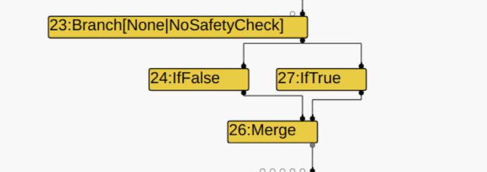

## Type lowering

TyperPhase之后紧接着就是TypedLoweringPhase
```
  Run<TypedLoweringPhase>();
  RunPrintAndVerify(TypedLoweringPhase::phase_name());
  
  
  ----------------------------

  struct TypedLoweringPhase {
  DECL_PIPELINE_PHASE_CONSTANTS(TypedLowering)

  void Run(PipelineData* data, Zone* temp_zone) {
    GraphReducer graph_reducer(
        temp_zone, data->graph(), &data->info()->tick_counter(), data->broker(),
        data->jsgraph()->Dead(), data->observe_node_manager());
    DeadCodeElimination dead_code_elimination(&graph_reducer, data->graph(),
                                              data->common(), temp_zone);
    JSCreateLowering create_lowering(&graph_reducer, data->dependencies(),
                                     data->jsgraph(), data->broker(),
                                     temp_zone);
    JSTypedLowering typed_lowering(&graph_reducer, data->jsgraph(),
                                   data->broker(), temp_zone);
    ConstantFoldingReducer constant_folding_reducer(
        &graph_reducer, data->jsgraph(), data->broker());
    TypedOptimization typed_optimization(&graph_reducer, data->dependencies(),
                                         data->jsgraph(), data->broker());
    SimplifiedOperatorReducer simple_reducer(&graph_reducer, data->jsgraph(),
                                             data->broker());
    CheckpointElimination checkpoint_elimination(&graph_reducer);
    CommonOperatorReducer common_reducer(&graph_reducer, data->graph(),
                                         data->broker(), data->common(),
                                         data->machine(), temp_zone);
    AddReducer(data, &graph_reducer, &dead_code_elimination);

    if (!data->info()->IsNativeContextIndependent()) {
      AddReducer(data, &graph_reducer, &create_lowering);
    }
    AddReducer(data, &graph_reducer, &constant_folding_reducer);
    AddReducer(data, &graph_reducer, &typed_lowering);
    AddReducer(data, &graph_reducer, &typed_optimization);
    AddReducer(data, &graph_reducer, &simple_reducer);
    AddReducer(data, &graph_reducer, &checkpoint_elimination);
    AddReducer(data, &graph_reducer, &common_reducer);

    // ConstantFoldingReducer, JSCreateLowering, JSTypedLowering, and
    // TypedOptimization access the heap.
    UnparkedScopeIfNeeded scope(data->broker());

    graph_reducer.ReduceGraph();
  }
};
```
可以看到run函数主要通过AddReducer将很多个优化的阶段加⼊到graph_reducer中，我们接下来就逐一看看这些阶段：

#### constant_folding_reducer

看名字就可以感觉到它是和常量折叠有关的优化

```
Reduction ConstantFoldingReducer::Reduce(Node* node) {
  DisallowHeapAccessIf no_heap_access(!FLAG_turbo_direct_heap_access);
  if (!NodeProperties::IsConstant(node) && NodeProperties::IsTyped(node) &&
      node->op()->HasProperty(Operator::kEliminatable) &&
      node->opcode() != IrOpcode::kFinishRegion) {  //结点不为Constant（常数），有type，是可消除的，并且不是FinishRegion
    Node* constant = TryGetConstant(jsgraph(), node);  //根据结点type获得对应类型的constant结点
    if (constant != nullptr) {  //是否获得constant
      DCHECK(NodeProperties::IsTyped(constant));
      if (!FLAG_assert_types) {  //是否开启了生成运行时类型断言以测试typer
        DCHECK_EQ(node->op()->ControlOutputCount(), 0);
        ReplaceWithValue(node, constant);
        return Replace(constant);
      } else if (!IsAlreadyBeingFolded(node)) {  //判断结点是否已被折叠在下面有详细注释
        // Delay the constant folding (by inserting a FoldConstant operation
        // instead) in order to keep type assertions meaningful.
        //延迟常量折叠（通过插入FoldConstant操作代替），以使类型断言有意义。
        Node* fold_constant = jsgraph()->graph()->NewNode(
            jsgraph()->common()->FoldConstant(), node, constant);  //创建FoldConstant结点，以node和constant作为input
        DCHECK(NodeProperties::IsTyped(fold_constant));
        ReplaceWithValue(node, fold_constant, node, node); //将node替换为fold_constant
        fold_constant->ReplaceInput(0, node);  //将node的input替换为自己的input
        DCHECK(IsAlreadyBeingFolded(node));
        DCHECK(IsAlreadyBeingFolded(fold_constant));
        return Changed(node);
      }
    }
  }
  return NoChange();
}

----------------------------

bool IsAlreadyBeingFolded(Node* node) {
  DCHECK(FLAG_assert_types);
  if (node->opcode() == IrOpcode::kFoldConstant) return true; //如果node的op为kFoldConstant，返回已被折叠。
  for (Edge edge : node->use_edges()) {  //UseEdges 返回的是将该结点作为 input 结点的所有的边的集合。
    if (NodeProperties::IsValueEdge(edge) &&
        edge.from()->opcode() == IrOpcode::kFoldConstant) {  //如果edge有值并且UseEdge的target（也就是将当前结点作为input的结点）的op为kFoldConstant
      // Note: {node} may have gained new value uses since the time it was
      // "constant-folded", and theses uses should ideally be rewritten as well.
      // For simplicity, we ignore them here.
      //注意：自node被“恒定折叠”以来，它可能已经获得了新的value uses，
      //这些uses在理想情况下也应该重写，
      //为简单起见，在此我们将其忽略。
      return true;
    }
  }
  return false;
}
} 

----------------------------

Node* TryGetConstant(JSGraph* jsgraph, Node* node) {
  Type type = NodeProperties::GetType(node);
  Node* result;
  if (type.IsNone()) {
    result = nullptr;
  } else if (type.Is(Type::Null())) {
    result = jsgraph->NullConstant();
  } else if (type.Is(Type::Undefined())) {
    result = jsgraph->UndefinedConstant();
  } else if (type.Is(Type::MinusZero())) {
    result = jsgraph->MinusZeroConstant();
  } else if (type.Is(Type::NaN())) {
    result = jsgraph->NaNConstant();
  } else if (type.Is(Type::Hole())) {
    result = jsgraph->TheHoleConstant();
  } else if (type.IsHeapConstant()) {
    result = jsgraph->Constant(type.AsHeapConstant()->Ref());
  } else if (type.Is(Type::PlainNumber()) && type.Min() == type.Max()) {
    result = jsgraph->Constant(type.Min());
  } else {
    result = nullptr;
  }
  DCHECK_EQ(result != nullptr, type.IsSingleton());
  DCHECK_IMPLIES(result != nullptr,
                 type.Equals(NodeProperties::GetType(result)));
  return result;
}
```


####  typed_lowering

```
Reduction JSTypedLowering::Reduce(Node* node) {
  const IrOpcode::Value opcode = node->opcode();
  if (broker()->generate_full_feedback_collection() &&
      IrOpcode::IsFeedbackCollectingOpcode(opcode)) {  //是否有足够的feedback信息
    // In NCI code, it is not valid to reduce feedback-collecting JS opcodes
    // into non-feedback-collecting lower-level opcodes; missed feedback would
    // result in soft deopts.
    return NoChange();
  }

  switch (opcode) {
    case IrOpcode::kJSEqual:
      return ReduceJSEqual(node);
    case IrOpcode::kJSStrictEqual:
      return ReduceJSStrictEqual(node);
    case IrOpcode::kJSLessThan:         // fall through
    case IrOpcode::kJSGreaterThan:      // fall through
    case IrOpcode::kJSLessThanOrEqual:  // fall through
    case IrOpcode::kJSGreaterThanOrEqual:
      return ReduceJSComparison(node);
    case IrOpcode::kJSBitwiseOr:
    case IrOpcode::kJSBitwiseXor:
    case IrOpcode::kJSBitwiseAnd:
      return ReduceInt32Binop(node);
    case IrOpcode::kJSShiftLeft:
    case IrOpcode::kJSShiftRight:
      return ReduceUI32Shift(node, kSigned);
    case IrOpcode::kJSShiftRightLogical:
      return ReduceUI32Shift(node, kUnsigned);
    case IrOpcode::kJSAdd:
      return ReduceJSAdd(node);
    
    ....
    
    default:
      break;
  }
  return NoChange();
}
```
switch的内容有点多，就不一一记录了，举几个例子其他的自己看看就好了。

```
Reduction JSTypedLowering::ReduceJSComparison(Node* node) {
  JSBinopReduction r(this, node);
  if (r.BothInputsAre(Type::String())) {  //如果两个输入都为字符串，则转为字符串比较
    // If both inputs are definitely strings, perform a string comparison.
    const Operator* stringOp;
    switch (node->opcode()) {
      case IrOpcode::kJSLessThan:
        stringOp = simplified()->StringLessThan();
        break;
      case IrOpcode::kJSGreaterThan:
        stringOp = simplified()->StringLessThan();
        r.SwapInputs();  // a > b => b < a
        break;
      case IrOpcode::kJSLessThanOrEqual:
        stringOp = simplified()->StringLessThanOrEqual();
        break;
      case IrOpcode::kJSGreaterThanOrEqual:
        stringOp = simplified()->StringLessThanOrEqual();
        r.SwapInputs();  // a >= b => b <= a
        break;
      default:
        return NoChange();
    }
    r.ChangeToPureOperator(stringOp);
    return Changed(node);
  }

  const Operator* less_than;
  const Operator* less_than_or_equal;
  if (r.BothInputsAre(Type::Signed32()) ||
      r.BothInputsAre(Type::Unsigned32())) {  //如果左右函数都为32位整数
    less_than = simplified()->NumberLessThan();
    less_than_or_equal = simplified()->NumberLessThanOrEqual();
  } else if (r.OneInputCannotBe(Type::StringOrReceiver()) &&
             r.BothInputsAre(Type::PlainPrimitive())) {  //左右值中有一个不是StringOrReceiver，并且左右值都为PlainPrimitive
    r.ConvertInputsToNumber();
    less_than = simplified()->NumberLessThan();
    less_than_or_equal = simplified()->NumberLessThanOrEqual();
  } else if (r.IsStringCompareOperation()) {  //本结点为字符比较操作，并且左右input都为string
    r.CheckInputsToString();
    less_than = simplified()->StringLessThan();
    less_than_or_equal = simplified()->StringLessThanOrEqual();
  } else {
    return NoChange();
  }
  const Operator* comparison;
  switch (node->opcode()) {
    case IrOpcode::kJSLessThan:
      comparison = less_than;
      break;
    case IrOpcode::kJSGreaterThan:
      comparison = less_than;
      r.SwapInputs();  // a > b => b < a
      break;
    case IrOpcode::kJSLessThanOrEqual:
      comparison = less_than_or_equal;
      break;
    case IrOpcode::kJSGreaterThanOrEqual:
      comparison = less_than_or_equal;
      r.SwapInputs();  // a >= b => b <= a
      break;
    default:
      return NoChange();
  }
  return r.ChangeToPureOperator(comparison);
}
```

可以看到它主要就是通过input类型来将大类的JSComparison细分为各种比较。

#### typed_optimization

```
Reduction TypedOptimization::Reduce(Node* node) {
  DisallowHeapAccessIf no_heap_access(!FLAG_turbo_direct_heap_access);
  switch (node->opcode()) {
    case IrOpcode::kConvertReceiver:
      return ReduceConvertReceiver(node);
    case IrOpcode::kMaybeGrowFastElements:
      return ReduceMaybeGrowFastElements(node);
    case IrOpcode::kCheckHeapObject:
      return ReduceCheckHeapObject(node);
    case IrOpcode::kCheckBounds:
      return ReduceCheckBounds(node);
    case IrOpcode::kCheckNotTaggedHole:
      return ReduceCheckNotTaggedHole(node);
    case IrOpcode::kCheckMaps:
      return ReduceCheckMaps(node);
    case IrOpcode::kCheckNumber:
      return ReduceCheckNumber(node);
    case IrOpcode::kCheckString:
      return ReduceCheckString(node);
    case IrOpcode::kCheckEqualsInternalizedString:
      return ReduceCheckEqualsInternalizedString(node);
    case IrOpcode::kCheckEqualsSymbol:
      return ReduceCheckEqualsSymbol(node);
    case IrOpcode::kLoadField:
      return ReduceLoadField(node);
    case IrOpcode::kNumberCeil:
    case IrOpcode::kNumberRound:
    case IrOpcode::kNumberTrunc:
      return ReduceNumberRoundop(node);
    case IrOpcode::kNumberFloor:
      return ReduceNumberFloor(node);
    case IrOpcode::kNumberSilenceNaN:
      return ReduceNumberSilenceNaN(node);
    case IrOpcode::kNumberToUint8Clamped:
      return ReduceNumberToUint8Clamped(node);
    case IrOpcode::kPhi:
      return ReducePhi(node);
    
    ....
    
    default:
      break;
  }
  return NoChange();
}
```
还是举几个例子

```
Reduction TypedOptimization::ReduceCheckBounds(Node* node) {
  CheckBoundsParameters const& p = CheckBoundsParametersOf(node->op()); //获得CheckBounds操作的参数
  Node* const input = NodeProperties::GetValueInput(node, 0);
  Type const input_type = NodeProperties::GetType(input);
  if (p.flags() & CheckBoundsFlag::kConvertStringAndMinusZero &&
      !input_type.Maybe(Type::String()) &&
      !input_type.Maybe(Type::MinusZero())) { //如果input的类型不为string和-0
    NodeProperties::ChangeOp(
        node,
        simplified()->CheckBounds(
            p.check_parameters().feedback(),
            p.flags().without(CheckBoundsFlag::kConvertStringAndMinusZero)));
    return Changed(node);
  }
  return NoChange();
}

----------------------------

CheckBoundsParameters const& CheckBoundsParametersOf(Operator const* op) {
  DCHECK(op->opcode() == IrOpcode::kCheckBounds ||
         op->opcode() == IrOpcode::kCheckedUint32Bounds ||
         op->opcode() == IrOpcode::kCheckedUint64Bounds);
  return OpParameter<CheckBoundsParameters>(op);
}

----------------------------

// For IrOpcode::kCheckBounds, we allow additional flags:
const Operator* SimplifiedOperatorBuilder::CheckBounds(
    const FeedbackSource& feedback, CheckBoundsFlags flags) {
  if (!feedback.IsValid()) {
    if (flags & CheckBoundsFlag::kAbortOnOutOfBounds) {
      if (flags & CheckBoundsFlag::kConvertStringAndMinusZero) {
        return &cache_.kCheckBoundsAbortingAndConverting;
      } else {
        return &cache_.kCheckBoundsAborting;
      }
    } else {
      if (flags & CheckBoundsFlag::kConvertStringAndMinusZero) {
        return &cache_.kCheckBoundsConverting;
      } else {
        return &cache_.kCheckBounds;
      }
    }
  }
  return zone()->New<SimplifiedOperatorGlobalCache::CheckBoundsOperator>(
      feedback, flags);
}
```
如果CheckBounds的input的类型不为string和-0，则更新Op并附加一些flags


判断是否可以消除CheckMaps
```
Reduction TypedOptimization::ReduceCheckMaps(Node* node) {
  // The CheckMaps(o, ...map...) can be eliminated if map is stable,
  // o has type Constant(object) and map == object->map, and either
  //  (1) map cannot transition further, or
  //  (2) we can add a code dependency on the stability of map
  //      (to guard the Constant type information).
  // CheckMaps(o，…map…)可以消除，如果map是稳定的，
  // o具有类型常量(object)和map == object->map，下面任意条件满足一个即可
  // (1)map不能进一步转换，或
  // (2)我们可以添加一个依赖于map稳定性的代码(用来保护常量类型信息)。
  Node* const object = NodeProperties::GetValueInput(node, 0);
  Type const object_type = NodeProperties::GetType(object);
  Node* const effect = NodeProperties::GetEffectInput(node);
  base::Optional<MapRef> object_map =
      GetStableMapFromObjectType(broker(), object_type); 
  if (object_map.has_value()) {  //如果当前结点的map是stable map
    for (int i = 1; i < node->op()->ValueInputCount(); ++i) { 对node的input结点做优化
      Node* const map = NodeProperties::GetValueInput(node, i);
      Type const map_type = NodeProperties::GetType(map);
      if (map_type.IsHeapConstant() &&
          map_type.AsHeapConstant()->Ref().equals(*object_map)) {  //input结点的map是HeapConstant并且是stable map
        if (object_map->CanTransition()) { //如果不能进一步转换满足条件（1）
          dependencies()->DependOnStableMap(*object_map); //添加一个依赖于map稳定性的代码，条件（2）
        }
        return Replace(effect); //消除check
      }
    }
  }
  return NoChange();
}

----------------------------

base::Optional<MapRef> GetStableMapFromObjectType(JSHeapBroker* broker,
                                                  Type object_type) {
  if (object_type.IsHeapConstant()) { //如果type为HeapConstant，并且map is stable返回map，否则返回空
    HeapObjectRef object = object_type.AsHeapConstant()->Ref();
    MapRef object_map = object.map();
    if (object_map.is_stable()) return object_map;
  }
  return {};
}
```

#### simple_reducer


```
Reduction SimplifiedOperatorReducer::Reduce(Node* node) {
  DisallowHeapAccessIf no_heap_access(!FLAG_turbo_direct_heap_access);
  switch (node->opcode()) {
    case IrOpcode::kBooleanNot: {
      HeapObjectMatcher m(node->InputAt(0));
      if (m.Is(factory()->true_value())) return ReplaceBoolean(false);
      if (m.Is(factory()->false_value())) return ReplaceBoolean(true);
      if (m.IsBooleanNot()) return Replace(m.InputAt(0));
      break;
    }
    case IrOpcode::kChangeBitToTagged: {
      Int32Matcher m(node->InputAt(0));
      if (m.Is(0)) return Replace(jsgraph()->FalseConstant());
      if (m.Is(1)) return Replace(jsgraph()->TrueConstant());
      if (m.IsChangeTaggedToBit()) return Replace(m.InputAt(0));
      break;
    }
    case IrOpcode::kChangeTaggedToBit: {
      HeapObjectMatcher m(node->InputAt(0));
      if (m.HasResolvedValue()) {
        return ReplaceInt32(m.Ref(broker()).BooleanValue());
      }
      if (m.IsChangeBitToTagged()) return Replace(m.InputAt(0));
      break;
    }
    case IrOpcode::kChangeFloat64ToTagged: {
      Float64Matcher m(node->InputAt(0));
      if (m.HasResolvedValue()) return ReplaceNumber(m.ResolvedValue());
      if (m.IsChangeTaggedToFloat64()) return Replace(m.node()->InputAt(0));
      break;
    }
    case IrOpcode::kChangeInt31ToTaggedSigned:
    case IrOpcode::kChangeInt32ToTagged: {
      Int32Matcher m(node->InputAt(0));
      if (m.HasResolvedValue()) return ReplaceNumber(m.ResolvedValue());
      if (m.IsChangeTaggedToInt32() || m.IsChangeTaggedSignedToInt32()) {
        return Replace(m.InputAt(0));
      }
      break;
    }
    case IrOpcode::kChangeTaggedToFloat64:
    case IrOpcode::kTruncateTaggedToFloat64: {
      NumberMatcher m(node->InputAt(0));
      if (m.HasResolvedValue()) return ReplaceFloat64(m.ResolvedValue());
      if (m.IsChangeFloat64ToTagged() || m.IsChangeFloat64ToTaggedPointer()) {
        return Replace(m.node()->InputAt(0));
      }
      if (m.IsChangeInt31ToTaggedSigned() || m.IsChangeInt32ToTagged()) {
        return Change(node, machine()->ChangeInt32ToFloat64(), m.InputAt(0));
      }
      if (m.IsChangeUint32ToTagged()) {
        return Change(node, machine()->ChangeUint32ToFloat64(), m.InputAt(0));
      }
      break;
    }
    
    ....

    case IrOpcode::kCheckedInt32Add: {
      // (x + a) + b => x + (a + b) where a and b are constants and have the
      // same sign.
      Int32BinopMatcher m(node);
      if (m.right().HasResolvedValue()) {
        Node* checked_int32_add = m.left().node();
        if (checked_int32_add->opcode() == IrOpcode::kCheckedInt32Add) {
          Int32BinopMatcher n(checked_int32_add);
          if (n.right().HasResolvedValue() &&
              (n.right().ResolvedValue() >= 0) ==
                  (m.right().ResolvedValue() >= 0)) {
            int32_t val;
            bool overflow = base::bits::SignedAddOverflow32(
                n.right().ResolvedValue(), m.right().ResolvedValue(), &val);
            if (!overflow) {
              bool has_no_other_uses = true;
              for (Edge edge : checked_int32_add->use_edges()) {
                if (!edge.from()->IsDead() && edge.from() != node) {
                  has_no_other_uses = false;
                  break;
                }
              }
              if (has_no_other_uses) {
                node->ReplaceInput(0, n.left().node());
                node->ReplaceInput(1, jsgraph()->Int32Constant(val));
                RelaxEffectsAndControls(checked_int32_add);
                return Changed(node);
              }
            }
          }
        }
      }
      break;
    }
    default:
      break;
  }
  return NoChange();
}
```

依旧是很复杂的switch，我们这里就举几个例子：

```
case IrOpcode::kCheckIf: {
      HeapObjectMatcher m(node->InputAt(0));
      if (m.Is(factory()->true_value())) {
        Node* const effect = NodeProperties::GetEffectInput(node);
        return Replace(effect);
      }
```
如果当前结点的op为kCheckIf，我们则对他的第一个input结点做判断，如果为true，我们就获取effect的input，然后用此input替换掉当前结点。


```
    case IrOpcode::kCheckNumber: {
      NodeMatcher m(node->InputAt(0));
      if (m.IsConvertTaggedHoleToUndefined()) {
        node->ReplaceInput(0, m.InputAt(0));
        return Changed(node);
      }
```
如果当前结点的op为kCheckNumber，对当前node的input进行判断，如果input满足IsConvertTaggedHoleToUndefined，则将当前node的input替换为它的input的input的结点


```
case IrOpcode::kBooleanNot: {
      HeapObjectMatcher m(node->InputAt(0));
      if (m.Is(factory()->true_value())) return ReplaceBoolean(false);
      if (m.Is(factory()->false_value())) return ReplaceBoolean(true);
      if (m.IsBooleanNot()) return Replace(m.InputAt(0));
      break;
    }
```
如果当前结点的op为kBooleanNot，判断它的第一个input结点，如果value为true，则替换当前结点为Constant false结点，反之同理。


#### checkpoint_elimination

之前在分析CVE-2018-17463有讲过这部分的内容，链接如下：
https://github.com/yytgravity/Daily-learning-record/tree/master/cve/v8/CVE-2018-17463

```
Reduction CheckpointElimination::Reduce(Node* node) {
  DisallowHeapAccess no_heap_access;
  switch (node->opcode()) {
    case IrOpcode::kCheckpoint:
      return ReduceCheckpoint(node);
    default:
      break;
  }
  return NoChange();
}

----------------------------

Reduction CheckpointElimination::ReduceCheckpoint(Node* node) {
  DCHECK_EQ(IrOpcode::kCheckpoint, node->opcode());
  if (IsRedundantCheckpoint(node)) {
    return Replace(NodeProperties::GetEffectInput(node));
  }
  return NoChange();
}

----------------------------

//如果给定的检查点在效果上被同一来源（*）的另一个检查点所控制，并且在两者之间没有可观察到的写入，则该冗余检查点是冗余的。 目前，我们仅考虑effect chain，而不是真正的影响主导权。

//这里的“相同原点”是指相同的图形构建过程，并表示为检查点的FrameStateFunctionInfo指针的标识。 此限制确保了急于从内联函数中退出的用户将恢复内联函数的字节码（而不是调用方的字节码中的调用），这又是必要的，以确保在以下情况下，我们可以从该内联中学到一些东西： 存在用于内联函数的优化代码对象。
bool IsRedundantCheckpoint(Node* node) {
  FrameStateFunctionInfo const* function_info = GetFunctionInfo(node);
  if (function_info == nullptr) return false;
  Node* effect = NodeProperties::GetEffectInput(node);  //获取effect的input结点
  while (effect->op()->HasProperty(Operator::kNoWrite) &&
         effect->op()->EffectInputCount() == 1) {  //如果当前结点没有副作用，并且他只有一个input结点
    if (effect->opcode() == IrOpcode::kCheckpoint) {  //判断结点是否为Checkpoint结点
      return GetFunctionInfo(effect) == function_info;  //确保两个checkpoint之间的frame state相同
    }
    effect = NodeProperties::GetEffectInput(effect);
  }
  return false;
}
```
在之前的冗余消除部分我们曾提过，当v8判断统一路径下的kCheckpoint是多余的，就会调用CheckpointElimination::ReduceCheckpoint来消除多余的checkpoint。

IsRedundantCheckpoint函数用来检查同路径下是否有多余的checkpoint。

turbofan中图的遍历采用深度优先遍历，当当前结点为checkpoint时，向上遍历它的input，当input无副作用，并且只有此一个input时，继续向上遍历，当找到下一个checkpoint时，如果两者处的frame state相同，则当前checkpoint冗余（也就是最下层被判断的checkpoint），最终调用Replace将冗余的checkpoint消除。

#### common_reducer

```
Reduction CommonOperatorReducer::Reduce(Node* node) {
  DisallowHeapAccessIf no_heap_access(!FLAG_turbo_direct_heap_access);
  switch (node->opcode()) {
    case IrOpcode::kBranch:
      return ReduceBranch(node);
    case IrOpcode::kDeoptimizeIf:
    case IrOpcode::kDeoptimizeUnless:
      return ReduceDeoptimizeConditional(node);
    case IrOpcode::kMerge:
      return ReduceMerge(node);
    case IrOpcode::kEffectPhi:
      return ReduceEffectPhi(node);
    case IrOpcode::kPhi:
      return ReducePhi(node);
    case IrOpcode::kReturn:
      return ReduceReturn(node);
    case IrOpcode::kSelect:
      return ReduceSelect(node);
    case IrOpcode::kSwitch:
      return ReduceSwitch(node);
    case IrOpcode::kStaticAssert:
      return ReduceStaticAssert(node);
    default:
      break;
  }
  return NoChange();
}
```

惯例举几个例子：

先放个图，看着图分析比较直观一点：


```
Reduction CommonOperatorReducer::ReduceBranch(Node* node) {
  DCHECK_EQ(IrOpcode::kBranch, node->opcode());
  Node* const cond = node->InputAt(0);
  // Swap IfTrue/IfFalse on {branch} if {cond} is a BooleanNot and use the input
  // to BooleanNot as new condition for {branch}. Note we assume that {cond} was
  // already properly optimized before we get here (as guaranteed by the graph
  // reduction logic). The same applies if {cond} is a Select acting as boolean
  // not (i.e. true being returned in the false case and vice versa).
  if (cond->opcode() == IrOpcode::kBooleanNot ||
      (cond->opcode() == IrOpcode::kSelect &&
       DecideCondition(broker(), cond->InputAt(1)) == Decision::kFalse &&
       DecideCondition(broker(), cond->InputAt(2)) == Decision::kTrue)) { //如果第一个input结点是BooleanNot或者是和它功能类似的Select，则将use结点的true和false交换
    for (Node* const use : node->uses()) {
      switch (use->opcode()) {
        case IrOpcode::kIfTrue:
          NodeProperties::ChangeOp(use, common()->IfFalse());
          break;
        case IrOpcode::kIfFalse:
          NodeProperties::ChangeOp(use, common()->IfTrue());
          break;
        default:
          UNREACHABLE();
      }
    }
    // Update the condition of {branch}. No need to mark the uses for revisit,
    // since we tell the graph reducer that the {branch} was changed and the
    // graph reduction logic will ensure that the uses are revisited properly.
    node->ReplaceInput(0, cond->InputAt(0));  //更新node的input结点，相当于去掉了cond
    // Negate the hint for {branch}.
    //否定{branch}的提示。
    NodeProperties::ChangeOp(
        node, common()->Branch(NegateBranchHint(BranchHintOf(node->op()))));
    return Changed(node);
  }
  Decision const decision = DecideCondition(broker(), cond);
  if (decision == Decision::kUnknown) return NoChange();  //branch结点的decision不为unknown
  Node* const control = node->InputAt(1);  //获取第二个input
  for (Node* const use : node->uses()) {
    switch (use->opcode()) {  //之后就是根据use结点和node的decision来选出control，另一个则为dead，这里看图应该挺好理解的
      case IrOpcode::kIfTrue: 
        Replace(use, (decision == Decision::kTrue) ? control : dead());
        break;
      case IrOpcode::kIfFalse:
        Replace(use, (decision == Decision::kFalse) ? control : dead());
        break;
      default:
        UNREACHABLE();
    }
  }
  return Replace(dead());
}
```
关键的内容已经放注释里了，这里就不多说了。

```
Reduction CommonOperatorReducer::ReduceMerge(Node* node) {
  DCHECK_EQ(IrOpcode::kMerge, node->opcode());
  //
  // Check if this is a merge that belongs to an unused diamond, which means
  //检查merge是否为满足下面条件的类型：
  // that:
  //
  //  a) the {Merge} has no {Phi} or {EffectPhi} uses, and
  //  a）{Merge}没有{Phi}或{EffectPhi}的use（将该结点作为输入的结点称为该结点的 use 结点）。
  //  b) the {Merge} has two inputs, one {IfTrue} and one {IfFalse}, which are
  //  b）{Merge}有两个输入，一个{IfTrue}和一个{IfFalse}，它们都由Merge拥有
  //     both owned by the Merge, and
  //  c) and the {IfTrue} and {IfFalse} nodes point to the same {Branch}.
  //  c），并且{IfTrue}和{IfFalse}节点指向相同的{Branch}
  if (node->InputCount() == 2) {  如果当前结点有两个input结点
    for (Node* const use : node->uses()) {
      if (IrOpcode::IsPhiOpcode(use->opcode())) return NoChange(); //去除掉merge结点的use结点为phi/effectphi的情况
    } 
    Node* if_true = node->InputAt(0); //获取node的第一个input
    Node* if_false = node->InputAt(1);  //获取node的第二个input
    if (if_true->opcode() != IrOpcode::kIfTrue) std::swap(if_true, if_false); //订正一下取得的变量名和input
    if (if_true->opcode() == IrOpcode::kIfTrue &&
        if_false->opcode() == IrOpcode::kIfFalse &&
        if_true->InputAt(0) == if_false->InputAt(0) && if_true->OwnedBy(node) &&
        if_false->OwnedBy(node)) { //上面的条件2
      Node* const branch = if_true->InputAt(0);
      DCHECK_EQ(IrOpcode::kBranch, branch->opcode());
      DCHECK(branch->OwnedBy(if_true, if_false));
      Node* const control = branch->InputAt(1);
      // Mark the {branch} as {Dead}.
      branch->TrimInputCount(0); //清除branch的input，将它标记为dead
      NodeProperties::ChangeOp(branch, common()->Dead());
      return Replace(control); //将merge跟换为control
    }
  }
  return NoChange();
}

----------------------------

bool Node::OwnedBy(Node const* owner) const {
  for (Use* use = first_use_; use; use = use->next) {
    if (use->from() != owner) {
      return false;
    }
  }
  return first_use_ != nullptr;
}
```






