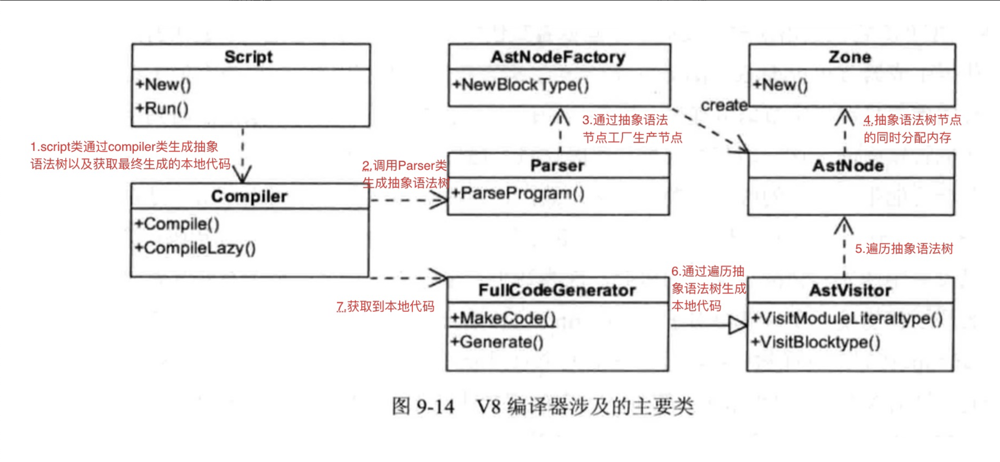
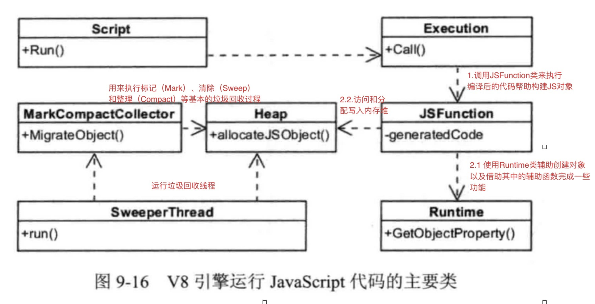
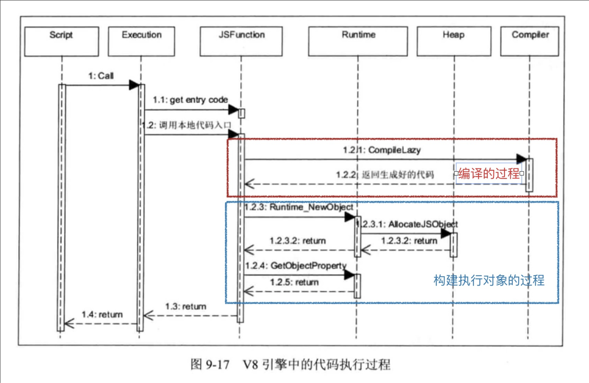

参考资料：https://juejin.cn/post/6844904137792962567

### javascript

JavaScript是一种动态类型语言，在编译时并不能准确知道变量的类型，只可以在运行时确定，这就不像c++或者java等静态类型语言，在编译时候就可以确切知道变量的类型。在C++中，源代码需要经过编译才能执行，在生成本地代码的过程中，变量的地址和类型已经确定，运行本地代码时利用数组和位移就可以存取变量和方法的地址，不需要再进行额外的查找，几个机器指令即可完成，节省了确定类型和地址的时间。由于JavaScript是无类型语言，那就不能像c++那样在执行时已经知道变量的类型和地址，需要临时确定。

以c++为类的语言和javascript有几点不同：

- C++编译阶段确定位置偏移信息，在执行时直接存取，JavaScript在执行阶段确定，而且执行期间可以修改对象属性；
- C++有类型定义，执行时不能动态改变，可共享偏移信息，JavaScript每个对象都是自描述，属性和位置偏移信息都包含在自身的结构中；
- C++查找偏移地址很简单，在编译代码阶段，对使用的某类型成员变量直接设置偏移位置，JavaScript中使用一个对象，需要通过属性名匹配才能找到相应的值，需要更多的操作。

JavaScript对象在V8中的实现包含三个部分：隐藏类指针，这是v8为JavaScript对象创建的隐藏类；属性值表指针，指向该对象包含的属性值；元素表指针，指向该对象包含的属性。

### v8的工作过程

##### 编译过程

- Script类：表示是JavaScript代码，既包含源代码，又包含编译之后生成的本地代码，所以它既是编译入口，又是运行入口；
- Compiler类：编译器类，辅助Script类来编译生成代码，它主要起一个协调者的作用，会调用解释器（Parser）来生成抽象语法树和全代码生成器，来为抽象语法树生成本地代码；
- Parser类：将源代码解释并构建成抽象语法树，使用AstNode类来创建它们，并使用Zone类来分配内存；
- AstNode类：抽象语法树节点类，是其他所有节点的基类，它包含非常多的子类，后面会针对不同的子类生成不同的本地代码；
- AstVisitor类：抽象语法树的访问者类，主要用来遍历抽象语法树；
- FullCodeGenerator：AstVisitor类的子类，通过遍历抽象语法树来为JavaScrit生成本地代码；

借大佬图一用：


##### 运行过程

- Script表示JavaScript代码，即包含源代码，又包含编译之后生成的本地代码，即是编译入口，又是运行入口；
- Execution：运行代码的辅组类，包含一些重要函数，如Call函数，它辅组进入和执行Script代码；
- JSFunction：需要执行的JavaScript函数表示类；
- Runtime：运行这些本地代码的辅组类，主要提供运行时所需的辅组函数，如：属性访问、类型转换、编译、算术、位操作、比较、正则表达式等；
- Heap：运行本地代码需要使用的内存堆类；
- MarkCompactCollector：垃圾回收机制的主要实现类，用来标记、清除和整理等基本的垃圾回收过程；
- SweeperThread：负责垃圾回收的线程。

借大佬图一用：


编译和执行的整体过程如下：



### AST 

之前已经单独写过了，就不放在这里了


### JSObject

```
[ hiddenClass / map	] -> ... ; 指向Map
[ properties  		] -> [empty array]
[ elements    		] -> [empty array]
[ reserved #1 		] -\
[ reserved #2		]  |
[ reserved #3 		]  }- in object properties,即预分配的内存空间
...............  	   |
[ reserved #N 		] -/
```

- Map中存储了一个对象的元信息，包括对象上属性的个数，对象的大小以及指向构造函数和原型的指针等等。同时，Map中保存了Js对象的属性信息，也就是各个属性在对象中存储的偏移。然后属性的值将根据不同的类型，放在properties、element以及预留空间中。
- properties指针，用于保存通过属性名作为索引的元素值，类似于字典类型
- elements指针，用于保存通过整数值作为索引的元素值，类似于常规数组
- reserved #n，为了提高访问速度，V8在对象中预分配了的一段内存区域，用来存放一些属性值（称为in-object属性），当向object中添加属性时，会先尝试将新属性放入这些预留的槽位。当in-onject槽位满后，V8才会尝试将新的属性放入properties中。

我们来看个例子：

code:
```
let obj = {0 : 0x1234 , 1 : 0x4567 , 'a' : 0x789 , 'b' : 0xabc};

for(let i = 0; i < 5 ; i++)
{
    key = 'a' + i.toString();
    obj[key] = 0xaaaaaaa;
    obj[i + 2] = 0xbbbbbb;
}

%DebugPrint(obj);

%SystemBreak();
```


```
DebugPrint: 0x170989c0aa41: [JS_OBJECT_TYPE]
 - map: 0x2bdb0a60a689 <Map(HOLEY_ELEMENTS)> [FastProperties]
 - prototype: 0x2aaee9c82611 <Object map = 0x2bdb0a600229>
 - elements: 0x170989c0aa69 <FixedArray[17]> [HOLEY_ELEMENTS]
 - properties: 0x170989c0af59 <PropertyArray[6]> {
    #a: 1929 (data field 0)
    #b: 2748 (data field 1)
    #a0: 178956970 (data field 2) properties[0]
    #a1: 178956970 (data field 3) properties[1]
    #a2: 178956970 (data field 4) properties[2]
    #a3: 178956970 (data field 5) properties[3]
    #a4: 178956970 (data field 6) properties[4]
 }
 - elements: 0x170989c0aa69 <FixedArray[17]> {
           0: 4660
           1: 17767
         2-6: 12303291
        7-16: 0x31c9138805b9 <the_hole>
 }
```

存储在properties中：
```
pwndbg> x/10gx 0x170989c0af59-1
0x170989c0af58:	0x000031c913881821	0x0000000600000000
0x170989c0af68:	0x0aaaaaaa00000000	0x0aaaaaaa00000000
0x170989c0af78:	0x0aaaaaaa00000000	0x0aaaaaaa00000000
0x170989c0af88:	0x0aaaaaaa00000000	0x000031c9138804d9
```

存储在elements中：
```
pwndbg> x/10gx 0x170989c0aa69-1
0x170989c0aa68:	0x000031c9138807b9	0x0000001100000000
0x170989c0aa78:	0x0000123400000000	0x0000456700000000
0x170989c0aa88:	0x00bbbbbb00000000	0x00bbbbbb00000000
0x170989c0aa98:	0x00bbbbbb00000000	0x00bbbbbb00000000
0x170989c0aaa8:	0x00bbbbbb00000000	0x000031c9138805b9
```
存储在in-object中
```
pwndbg> x/10gx 0x170989c0aa41-1
0x170989c0aa40:	0x00002bdb0a60a689	0x0000170989c0af59
0x170989c0aa50:	0x0000170989c0aa69	0x0000078900000000
0x170989c0aa60:	0x00000abc00000000	0x000031c9138807b9
0x170989c0aa70:	0x0000001100000000	0x0000123400000000
0x170989c0aa80:	0x0000456700000000	0x00bbbbbb00000000
```

看了这个例子应该就能直观的了解前面所说的内容了。

这里再补充一个东西：
如果要存储的属性大于16位，就会出现下面这种情况：
```
let obj = {0 : 0x1234 , 1 : 0x4567 , 'a' : 0x789 , 'b' : 0xabc};

for(let i = 0; i < 3 ; i++)
{
    key = 'a' + i.toString();
    obj[key] = 0xaaaaaaaaaa;
    obj[i + 2] = 0xbbbbbbbbb;
}

for(let i = 3; i < 5 ; i++)
{
    key = 'a' + i.toString();
    obj[key] = 0xffffffffff;
}

%DebugPrint(obj);

%SystemBreak();
```
properties:
```
 - properties: 0x2a8f72d0aff1 <PropertyArray[6]> {
    #a: 1929 (data field 0)
    #b: 2748 (data field 1)
    #a0: 0x2a8f72d0ad21 <MutableHeapNumber 7.33008e+11> (data field 2) properties[0]
    #a1: 0x2a8f72d0ade9 <MutableHeapNumber 7.33008e+11> (data field 3) properties[1]
    #a2: 0x2a8f72d0aed9 <MutableHeapNumber 7.33008e+11> (data field 4) properties[2]
    #a3: 0x2a8f72d0b031 <MutableHeapNumber 1.09951e+12> (data field 5) properties[3]
    #a4: 0x2a8f72d0b141 <MutableHeapNumber 1.09951e+12> (data field 6) properties[4]
 }


pwndbg> x/2gx 0x2a8f72d0ad21-1
0x2a8f72d0ad20:	0x000020a4db1815a1	0x4265555555554000 <- [0xaaaaaaaaaa]

pwndbg> x/2gx 0x2a8f72d0b031-1
0x2a8f72d0b030:	0x000020a4db1815a1	0x426fffffffffe000 <- [0xffffffffff]
```

最后再放上一张图：


#### Map transitions

当我们向对象添加新属性时，该对象的当前map将会失效，此时会为他创建一个新map来适应新的结构，并将一个transition descriptor加入到原map，以显示如何将其改为新地图。

举个例子：

```
Var obj = {}; // Map M0 is created and assigned to the object

obj.x = 1; // Map M1 created, shows where to store the value x. A transition “x” is added to M0 with target M1.

obj.y=1; // Map M2 created, shows where to store the value y. A transition “y” is added to M1 with target M2.
```
v8开始创建一个新对象，首先它会创建一个所谓c0的隐藏类（也就是上面说的map），因为此时还未向对象添加任何属性，所以此时的隐藏类为空：


此时调用obj.x = 1，为当前的object创建了新的属性x，此时v8会基于c0创建一个隐藏类c1来替换c0，然后在c1中存放对象属性x的内存位置信息：

这里从C0到C1的变化称为转换（Transitions），当我们为同一个类型的对象添加新的属性时，并不是每次都会创建新的隐藏类，而是多个对象会共用某个符合转换条件的隐藏类。接下来继续执行obj.y = 1 这一条语句，会为object创建新的属性。此时 V8 会进行以下步骤：

基于C1创建另一个隐藏类C2，并且将关于属性y的位置信息写入到C2中。

更新C1为其添加转换信息，即当为objct添加属性 y 时，应该转换到隐藏类 C2。


在内联高速缓存未命中时，这些Transitions将被编译器用来重新优化功能。

### Map/Shapes/Hidden Class/。。。。

它有很多称呼：
- 学术论文称它们为 隐藏类 (混淆了的w.r.t. JavaScript类)。
- V8称他们为Maps (混淆了w.r.t. JavaScript Map)
- Chakra称它们为类型（混淆了w.r.t.JavaScript的动态类型和typeof）
- JavaScriptCore称它们为 Structures
- SpiderMonkey将它们称为 Shapes

我们在上文中提及，如果每次添加新的属性时都创建新的隐藏类无疑是极大的性能浪费，实际上当我们再次创建新的对象时，V8 并不会创建新的隐藏类而是使用已有的，过程描述如下：

- 初始化新的Point对象，并将隐藏类指向C0。

- 添加x属性时，遵循隐藏类的转换原则指向到C1 , 并且根据C1指定的偏移地址写入x。

- 添加y属性时，遵循隐藏类的转换原则指向到C2，并且根据C2指定的偏移地址写入y。

这里要注意：我们在上文使用了链表的方式来表示transitions，但实际上在v8中它是以树的结构来描述transitions以及其中的关系的，这样的好处是可以处理下面的这一场景(属性一致而顺序颠倒)：
```
1  function Point(x,y) {
2    this.x = x;
3    this.y = y;
4  }
5 
7  var obj1 = new Point(1,2);
8  var obj2 = new Point(3,4);
9
10 obj1.a = 5;
11 obj1.b = 10;
12
13 obj2.b = 10;
14 obj2.a = 5;
```
直到第9行，obj1和obj2共享相同的隐藏类。但是，由于属性a和b的添加顺序相反，由于遵循单独的转换路径，obj1和obj2最终具有不同的隐藏类。


### Inline Caches（内联缓存）
每当在特定对象上调用方法时，V8引擎都必须对该对象的隐藏类执行查找，以确定用于访问特定属性的偏移量。在对相同的隐藏类成功两次调用相同的方法之后，V8会省略隐藏类查找，而只是将属性的偏移量添加到对象指针本身。对于以后对该方法的所有调用，V8引擎都假定隐藏类未更改，并使用以前查找中存储的偏移量直接跳到特定属性的内存地址中。这大大提高了执行速度。

内联缓存也是为什么其如此重要以至于相同类型的对象共享隐藏类的原因。如果创建两个具有相同类型但具有不同隐藏类的对象（如我们在前面的示例中所做的那样），则V8将无法使用内联缓存，因为即使这两个对象属于同一类型，它们对应的隐藏也是如此。类为其属性分配不同的偏移量。


推荐阅读：https://juejin.cn/post/6844904167333429256


### Elements kind

如上所述，对象的元素是编号键的值。这些数据存储在一个从对象指向的规则数组中。对象的映射有一个叫做ElementsKind的特殊位域。此字段描述元素数组中的值是 boxed, unboxed, contiguous, sparse，等等。仅因Elements kind不同而不同的映射不会通过Transitions连接起来。

### V8 arrays

v8中的数组是有类型的，可以有“boxed”或“unboxed”值。这基本上决定了数组是否只保存双精度值(整数也表示为双精度值)，因此可以直接保存值(通常称为“快速”数组)，或者数组也保存更复杂的值，在这种情况下，这些值实际上是指向对象的指针。
两种情况的简化表示:

(array本身的类型决定了值是boxed或者是unboxed)。

如果我们有一个fast array（如上图的左图），然后将一个复杂对象（如一个数组）分配给其中一个element，则整个array将会变成一个boxed类型，改array上的所有值都将更改为boxed。


