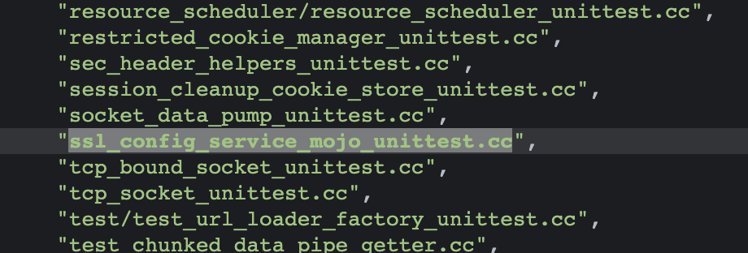
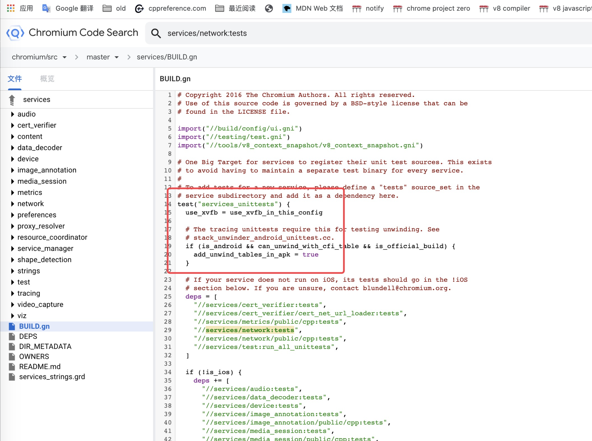

最近学习了单元测试来测试漏洞，在这里做个简单的记录：

参考： https://source.chromium.org/chromium/chromium/src/+/19aeffd4d93f5b82cf6877ff83614ff9cb6e1d1f


目标函数：
```
void NetworkContext::VerifyCertForSignedExchange(
    const scoped_refptr<net::X509Certificate>& certificate,
    const GURL& url,
    const net::NetworkIsolationKey& network_isolation_key,
    const std::string& ocsp_result,
    const std::string& sct_list,
    VerifyCertForSignedExchangeCallback callback) {
  if (require_network_isolation_key_)
    DCHECK(!network_isolation_key.IsEmpty());

  int cert_verify_id = ++next_cert_verify_id_;
  auto pending_cert_verify = std::make_unique<PendingCertVerify>();
  pending_cert_verify->callback = std::move(callback);
  pending_cert_verify->result = std::make_unique<net::CertVerifyResult>();
  pending_cert_verify->certificate = certificate;
  pending_cert_verify->url = url;
  pending_cert_verify->network_isolation_key = network_isolation_key;
  pending_cert_verify->ocsp_result = ocsp_result;
  pending_cert_verify->sct_list = sct_list;
  net::CertVerifier* cert_verifier =
      g_cert_verifier_for_testing ? g_cert_verifier_for_testing
                                  : url_request_context_->cert_verifier();
  int result = cert_verifier->Verify(
      net::CertVerifier::RequestParams(certificate, url.host(),
                                       0 /* cert_verify_flags */, ocsp_result,
                                       sct_list),
      pending_cert_verify->result.get(),
      base::BindOnce(&NetworkContext::OnVerifyCertForSignedExchangeComplete,
                     base::Unretained(this), cert_verify_id),
      &pending_cert_verify->request,
      net::NetLogWithSource::Make(url_request_context_->net_log(),
                                  net::NetLogSourceType::CERT_VERIFIER_JOB));
  cert_verifier_requests_[cert_verify_id] = std::move(pending_cert_verify);

  if (result != net::ERR_IO_PENDING)
    OnVerifyCertForSignedExchangeComplete(cert_verify_id, result);
}
```

其实也可以通过mojo来调用，但是我太菜了（驾驭不了。。），所以这里选择了单元测试。
首先我们在当前模块里找前人写过的测试代码，然后进行自己的魔改，这样的话比较省劲。


这里选择了ssl_config_service_mojo_unittest.cc作为目标，但是这里和参考还是有些区别的：

```
source_set("tests") {
  testonly = true

  sources = [
    "chunked_data_pipe_upload_data_stream_unittest.cc",
    "cookie_manager_unittest.cc",
    "cookie_settings_unittest.cc",
    "cors/cors_url_loader_factory_unittest.cc",
    "cors/cors_url_loader_unittest.cc",
    ....
    ]
```
他这里是使用了source_set("tests")。
这种的编译方法：

1、gn ls out/release > log可以打印出所有的target，之后在target中找我们选中的模块，就找到了services/network:tests
2、在代码中搜services/network:tests，就可以找到unittest。

3、ninja -C out/release services_unittests
4、./services_unittests --gtest_filter=xx.xx
这里的xx就是你自己要测试的那个单元。

这是本次测试的单元，所以--gtest_filter=NetworkServiceSSLConfigServiceTest.NoSSLConfig
```
TEST_F(NetworkServiceSSLConfigServiceTest, NoSSLConfig) {

  scoped_refptr<net::X509Certificate> cert1 =
      net::CreateCertificateChainFromFile(
          net::GetTestCertsDirectory(), "key_usage_rsa_digitalsignature.pem",
          net::X509Certificate::FORMAT_PEM_CERT_SEQUENCE);
  GURL url_("http://www.google.com/");
  site = url::Origin::Create(GURL("http://foo.com/"));;
  net::NetworkIsolationKey network_isolation_key_ = net::NetworkIsolationKey(site,site);
  LOG(ERROR)<< cert1;
  LOG(ERROR)<< url_;
  //id = 1
  getchar();
  getchar();
  getchar();
  //sleep(100);
  std::unique_ptr<NetworkContext> network_context_ =
      CreateContextWithParams(CreateContextParams());
  network_context_->VerifyCertForSignedExchange(cert1,url_,network_isolation_key_,std::string(),std::string(),std::move(callback));
  
  scoped_refptr<net::X509Certificate> cert2 =
    net::CreateCertificateChainFromFile(
        net::GetTestCertsDirectory(), "ok_cert_by_intermediate.pem",
        net::X509Certificate::FORMAT_PEM_CERT_SEQUENCE);
  
  //id: 1~overflow(0)
  for(int i=0;i<127;i++)
  {
    network_context_->VerifyCertForSignedExchange(cert2,url_,network_isolation_key_,std::string(),std::string(),std::move(callback));
  }

  scoped_refptr<net::X509Certificate> cert3 =
  net::CreateCertificateChainFromFile(
      net::GetTestCertsDirectory(), "ok_cert.pem",
      net::X509Certificate::FORMAT_PEM_CERT_SEQUENCE);

  //id:overflow(1)
  network_context_->VerifyCertForSignedExchange(cert3,url_,network_isolation_key_,std::string(),std::string(),std::move(callback));
}
```

简单说几个学到的知识：
用到的变量常量函数等，要在相应的类中申明,比如本例中就是NetworkServiceSSLConfigServiceTest，当然相应的头文件要自己去include：
```
class NetworkServiceSSLConfigServiceTest : public testing::Test {
 public:
  NetworkServiceSSLConfigServiceTest()
      : task_environment_(base::test::TaskEnvironment::MainThreadType::IO),
        network_service_(NetworkService::CreateForTesting()) {}
  ~NetworkServiceSSLConfigServiceTest() override {
    NetworkContext::SetCertVerifierForTesting(nullptr);
  }

  // Creates a NetworkContext using the specified NetworkContextParams, and
  // stores it in |network_context_|.
  void SetUpNetworkContext(
      mojom::NetworkContextParamsPtr network_context_params) {
    // Use a dummy CertVerifier that always passes cert verification, since
    // these unittests don't need to test the behavior of a real CertVerifier.
    // There are a parallel set of tests in services/cert_verifier/ that *do*
    // test CertVerifier behavior.
    network_context_params->cert_verifier_params =
        FakeTestCertVerifierParamsFactory::GetCertVerifierParams();
    ssl_config_client_.reset();
    network_context_params->ssl_config_client_receiver =
        ssl_config_client_.BindNewPipeAndPassReceiver();
    network_context_remote_.reset();
    network_context_ = std::make_unique<NetworkContext>(
        network_service_.get(),
        network_context_remote_.BindNewPipeAndPassReceiver(),
        std::move(network_context_params));
  }

  //new add
  mojom::NetworkContextParamsPtr CreateContextParams() {
    mojom::NetworkContextParamsPtr params = mojom::NetworkContextParams::New();
    // Use a fixed proxy config, to avoid dependencies on local network
    // configuration.
    params->initial_proxy_config = net::ProxyConfigWithAnnotation::CreateDirect();
    return params;
  }
  //new add
  std::unique_ptr<NetworkContext> CreateContextWithParams(
      mojom::NetworkContextParamsPtr context_params) {
    // Use a dummy CertVerifier that always passes cert verification, since
    // these unittests don't need to test CertVerifier behavior.
    DCHECK(!context_params->cert_verifier_params);
    context_params->cert_verifier_params =
        FakeTestCertVerifierParamsFactory::GetCertVerifierParams();
    network_context_remote_.reset();
    return std::make_unique<NetworkContext>(
        network_service_.get(),
        network_context_remote_.BindNewPipeAndPassReceiver(),
        std::move(context_params));
  }

  // Returns the current SSLContextConfig for |network_context_|.
  net::SSLContextConfig GetSSLContextConfig() {
    return network_context_->url_request_context()
        ->ssl_config_service()
        ->GetSSLContextConfig();
  }

  // Runs two conversion tests for |mojo_config|.  Uses it as a initial
  // SSLConfig for a NetworkContext, making sure it matches
  // |expected_net_config|. Then switches to the default configuration and then
  // back to |mojo_config|, to make sure it works as a new configuration. The
  // expected configuration must not be the default configuration.
  void RunConversionTests(const mojom::SSLConfig& mojo_config,
                          const net::SSLContextConfig& expected_net_config) {
    // The expected configuration must not be the default configuration, or the
    // change test won't send an event.
    EXPECT_FALSE(net::SSLConfigService::SSLContextConfigsAreEqualForTesting(
        net::SSLContextConfig(), expected_net_config));

    // Set up |mojo_config| as the initial configuration of a NetworkContext.
    mojom::NetworkContextParamsPtr network_context_params =
        mojom::NetworkContextParams::New();
    network_context_params->initial_ssl_config = mojo_config.Clone();
    SetUpNetworkContext(std::move(network_context_params));
    EXPECT_TRUE(net::SSLConfigService::SSLContextConfigsAreEqualForTesting(
        GetSSLContextConfig(), expected_net_config));
    // Sanity check.
    EXPECT_FALSE(net::SSLConfigService::SSLContextConfigsAreEqualForTesting(
        GetSSLContextConfig(), net::SSLContextConfig()));

    // Reset the configuration to the default ones, and check the results.
    TestSSLConfigServiceObserver observer(
        network_context_->url_request_context()->ssl_config_service());
    ssl_config_client_->OnSSLConfigUpdated(mojom::SSLConfig::New());
    observer.WaitForChange();
    EXPECT_TRUE(net::SSLConfigService::SSLContextConfigsAreEqualForTesting(
        GetSSLContextConfig(), net::SSLContextConfig()));
    EXPECT_TRUE(net::SSLConfigService::SSLContextConfigsAreEqualForTesting(
        observer.ssl_context_config_during_change(), net::SSLContextConfig()));
    // Sanity check.
    EXPECT_FALSE(net::SSLConfigService::SSLContextConfigsAreEqualForTesting(
        GetSSLContextConfig(), expected_net_config));

    // Set the configuration to |mojo_config| again, and check the results.
    ssl_config_client_->OnSSLConfigUpdated(mojo_config.Clone());
    observer.WaitForChange();
    EXPECT_TRUE(net::SSLConfigService::SSLContextConfigsAreEqualForTesting(
        GetSSLContextConfig(), expected_net_config));
    EXPECT_TRUE(net::SSLConfigService::SSLContextConfigsAreEqualForTesting(
        observer.ssl_context_config_during_change(), expected_net_config));
  }

  // Runs two conversion tests for |mojo_config|.  Uses it as an initial
  // net::CertVerifier::Config for a NetworkContext, making sure it matches
  // |expected_net_config|. Then switches to the default configuration and then
  // back to |mojo_config|, to make sure it works as a new configuration. The
  // expected configuration must not be the default configuration.
  void RunCertConversionTests(
      const mojom::SSLConfig& mojo_config,
      const net::CertVerifier::Config& expected_net_config) {
    TestCertVerifierConfigObserver observer;
    NetworkContext::SetCertVerifierForTesting(&observer);

    EXPECT_NE(net::CertVerifier::Config(), expected_net_config);

    // Set up |mojo_config| as the initial configuration of a NetworkContext.
    mojom::NetworkContextParamsPtr network_context_params =
        mojom::NetworkContextParams::New();
    network_context_params->initial_ssl_config = mojo_config.Clone();
    SetUpNetworkContext(std::move(network_context_params));

    // Make sure the initial configuration is set.
    observer.WaitForChange();
    EXPECT_EQ(observer.verifier_config_during_change(), expected_net_config);
    // Sanity check.
    EXPECT_NE(observer.verifier_config_during_change(),
              net::CertVerifier::Config());

    // Reset the configuration to the default ones, and check the results.
    ssl_config_client_->OnSSLConfigUpdated(mojom::SSLConfig::New());
    observer.WaitForChange();
    EXPECT_EQ(observer.verifier_config_during_change(),
              net::CertVerifier::Config());
    // Sanity check.
    EXPECT_NE(observer.verifier_config_during_change(), expected_net_config);

    // Set the configuration to |mojo_config| again, and check the results.
    ssl_config_client_->OnSSLConfigUpdated(mojo_config.Clone());
    observer.WaitForChange();
    EXPECT_EQ(observer.verifier_config_during_change(), expected_net_config);

    // Reset the CertVerifier for subsequent invocations.
    NetworkContext::SetCertVerifierForTesting(nullptr);
  }

 protected:
  base::test::TaskEnvironment task_environment_;
  std::unique_ptr<NetworkService> network_service_;
  mojo::Remote<mojom::SSLConfigClient> ssl_config_client_;
  mojo::Remote<mojom::NetworkContext> network_context_remote_;
  std::unique_ptr<NetworkContext> network_context_;
  //new add
  int id;
  GURL url_;
  net::NetworkIsolationKey network_isolation_key_;
  url::Origin site;
  //const std::string& ocsp_;
  //const std::string& sct_;
  VerifyCertForSignedExchangeCallback callback;
  std::unique_ptr<mojo::MessageReceiverWithStatus>* responder;
  //std::unique_ptr<NetworkContext::PendingCertVerify> pending_cert_verify1;
  //std::map<int, std::unique_ptr<NetworkContext::PendingCertVerify>> cert_verifier_requests_1;
};
```

剩下就是写测试时候的细节问题了，这些就等写的过程中在发现吧。（ps 单元测试调试很方便，遇到问题不如gdb一下）。