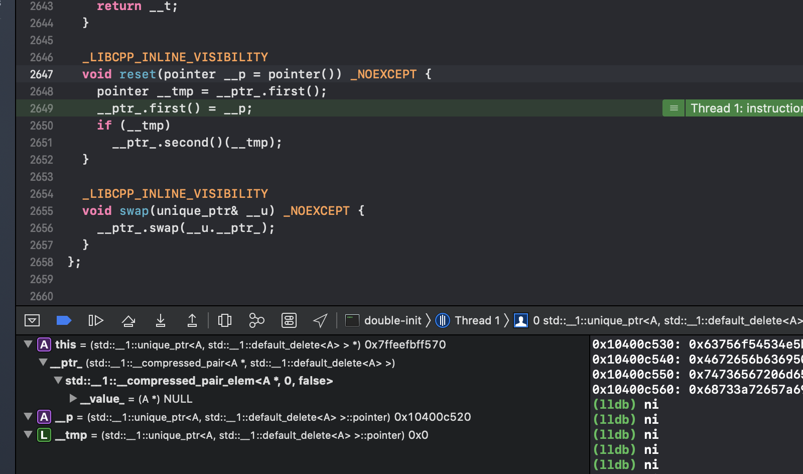
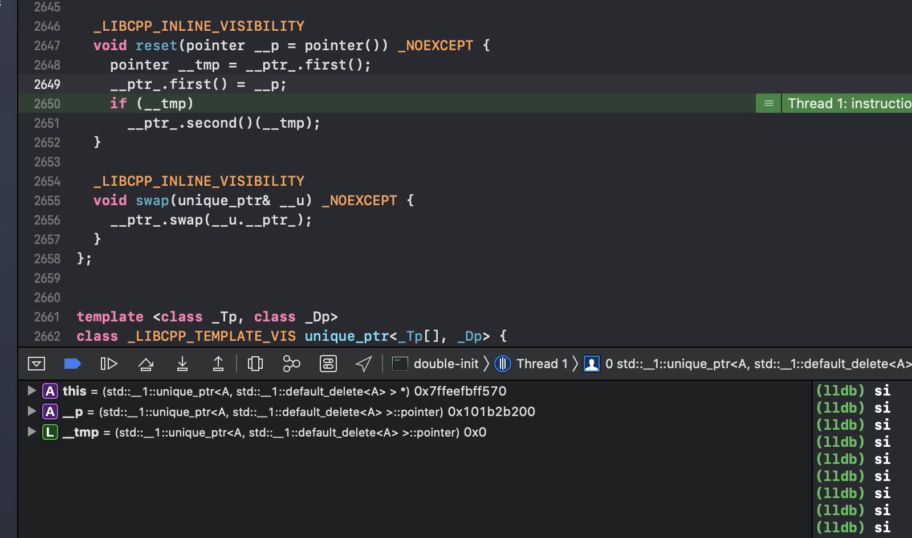
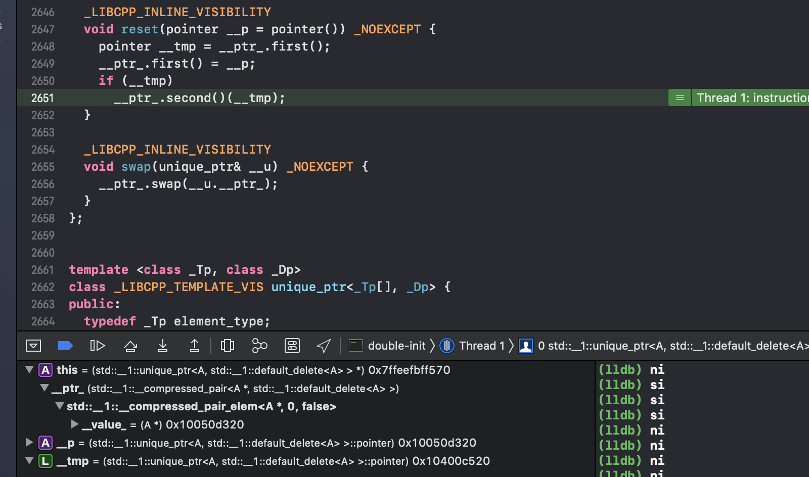

## c++ 智能指针


### unique_ptr

```
template <typename T, typename D = std::function<void(T*)>>
class UniquePointer {
public:
	UniquePointer(const UniquePointer&) = delete;
	UniquePointer& operator=(const UniquePointer&) = delete;

	UniquePointer(T *raw_p = nullptr, const std::function<void(T*)> &del = Deleter())
			: p(raw_p), deleter(del) { }
	UniquePointer(UniquePointer &&) noexcept;
	UniquePointer& operator=(UniquePointer &&) noexcept;
	~UniquePointer() { deleter(p); }

	T* get() const { return p; }
	T* release() noexcept;

	void reset(T* ptr = nullptr) noexcept;
	void swap(UniquePointer<T>&);

	operator bool() const { return p != nullptr; }

	D& get_deleter() noexcept;
	const D& get_deleter() const noexcept;

	T& operator*() const { return *p; }
	T* operator->() const { return p; }

private:
	T *p;
	std::function<void(T*)> deleter = D();
};
```
##### 拷贝构造
我们首先可以注意到unique_ptr的拷贝构造和=重载都被赋值为delete
```
UniquePointer(const UniquePointer&) = delete;
UniquePointer& operator=(const UniquePointer&) = delete;
```
由此可知unique是不可拷贝的。

##### 构造函数：
```
UniquePointer(T *raw_p = nullptr, const std::function<void(T*)> &del = Deleter())
            : p(raw_p), deleter(del) { }
```
可以使用自己定义的释放函数

##### swap

```
  void swap(unique_ptr& __u) _NOEXCEPT {
    __ptr_.swap(__u.__ptr_);
  }
```

##### 析构和release

```
~UniquePointer() { deleter(p); }
```
析构很简单，只需要调用该类型的析构函数即可，如果有重写deleter就会调用自定义的。


release：unique放弃对指针的控制权，将指针置空并返回该指针。
```
  pointer release() _NOEXCEPT {
    pointer __t = __ptr_.first();
    __ptr_.first() = pointer();
    return __t;
  }
```
release函数会将unique中的实际指针置为null，之后返回实际指针的地址。

注意：虽然release有置null能力，但是不能直接当作析构来使用：

```
正确：
unique_ptr<int> m (new int(2));
auto p = m.release();
delete p;//释放掉内存

错误：
unique_ptr<int> m (new int(2));
m.release();//造成内存泄漏
```

##### reset

```
  void reset(pointer __p = pointer()) _NOEXCEPT {
    pointer __tmp = __ptr_.first();
    __ptr_.first() = __p;
    if (__tmp)
      __ptr_.second()(__tmp);
  }
```

它会获取unique管理的原始指针到tmp，接着将管理的指针替换为传入的参数，之后判断tmp是否为空，如果不为空则调用second也就是deleter来释放掉tmp也就是之前管理的指针。

##### 传递unique_ptr参数和返回unique_ptr

虽然上面说到unique_ptr不可拷贝和赋值，但是存在例外情况：我们可以拷贝或赋值一个将要被销毁的unique_ptr

```
//从函数返回一个unique_ptr
unique_ptr func1(int a)
{
    return unique_ptr<int> (new int(a));
}

//返回一个局部对象的拷贝
unique_ptr func2(int a)
{
    unique_ptr<int> up(new int(a));
    return up;
}
```
传unique_ptr参数可以使用引用避免所有权的转移，或者暂时的移交所有权
```
void func1(unique_ptr<int> &up){
    cout<<*up<<endl;
}
unique_ptr<int> func2(unique_ptr<int> up){
    cout<<*up<<endl;
    return up;
}

//使用up作为参数
unique_ptr<int> up(new int(10));

//传引用，不拷贝，不涉及所有权的转移
func1(up);
//暂时转移所有权，函数结束时返回拷贝，重新收回所有权
up = func2(unique_ptr<int> (up.release()));
//如果不用up重新接受func2的返回值，这块内存就泄漏了
```
也可以通过std::move来转移所有权。

##### 切勿和裸指针混用

```
int *x(new int());
unique_ptr<int> up1,up2;
//会使up1 up2指向同一个内存
up1.reset(x);
up2.reset(x);
```


##### 很经典的漏洞：double-init

```
#include<iostream>
#include<memory>

class A{
public:
    A()
    {
        printf("A构造\n");
    }
    ~A()
    {
        printf("A析构\n");
    }
    
};

class B{
public:
    std::unique_ptr<A> a_;
    void init()
    {
        a_ = std::make_unique<A>();
    }
};

int main()
{
    B b;
    b.init();
    b.init();
    getchar();
    return 0;
}
```

运行结果：

```
A构造
A构造
A析构
```

我们从源代码的角度来分别看一下这两次init：

```
 
unique_ptr& operator=(unique_ptr&& __u) 
_NOEXCEPT 
{ 
reset(__u.release());
__ptr_.second() = _VSTD::forward<deleter_type>(__u.get_deleter()); return *this;
}
....


pointer release() 
_NOEXCEPT 
{
pointer __t = __ptr_.first(); 
__ptr_.first() = pointer(); 
return __t;
}
...


void reset(pointer __p = pointer()) 
_NOEXCEPT 
{
pointer __tmp = __ptr_.first(); 
__ptr_.first() = __p;
if (__tmp)
    __ptr_.second()(__tmp); 
}
...


...
~unique_ptr() { reset(); }
```
下面是调试记录：

第一次init




第二次init




文字描述（建议结合图片食用）：
第一次：

- 在移动赋值operator=中，由std::make_unique\<A\>构造出的\_\_u被release,release的过程可以参考图一，release会返回原始指针并将this保存的__ptr置为NULL。

- 接着调用reset函数，将a自身保存的原始指针通过__ptr_.frist获取并放入__tmp临时保存（由于是第一次std::make_unique\<A\>();），所以此时__tmp为NULL。之后将a保存的原始指针替换为release的返回值。最后会根据__tmp是否为空来判断是否需要析构掉保存的对象。

第二次：

- 大致流程和第一次无异，我们着重观察reset函数。

- 可以看到在reset中，__tmp中保存了我们第一次init时获取的指针，之后会将自身保存的原始指针替换为新的指针，最后由于__tmp不为空，析构掉了他保存的对象。


### shared_ptr

```
template <typename T>
class SharedPointer {
public:
	SharedPointer(T *ptr = nullptr, const std::function<void(T*)> &del = Deleter()):
			p(ptr), use_c(new std::size_t(ptr != nullptr)), deleter(del) { }
	SharedPointer(const SharedPointer &);
	SharedPointer(SharedPointer &&) noexcept;
	SharedPointer& operator=(SharedPointer);
	~SharedPointer() { release(); }

	std::size_t use_count() { return *use_c; }

	bool unique() const { return *use_c == 1; }

	operator bool() const { return p != nullptr; }

	void reset(T* ptr = nullptr, const std::function<void(T*)> &del = Deleter());

	void swap(SharedPointer<T>&);

	T* get() const { return p; }

	T& operator*() const { return *p; }
	T* operator->() const { return p; }
private:
	std::size_t *use_c;
	T *p;
	std::function<void(T*)> deleter;

	void release();
};
```

##### 构造函数、拷贝构造、赋值

构造函数：
```
SharedPointer(T *ptr = nullptr, const std::function<void(T*)> &del = Deleter()):
			p(ptr), use_c(new std::size_t(ptr != nullptr)), deleter(del) { }
```

拷贝构造：

```
template <typename T>
SharedPointer<T>::SharedPointer(const SharedPointer<T> &rhs):
		use_c(rhs.use_c), p(rhs.p), deleter(rhs.deleter)
{
	++*use_c;
}
```

举个例子：shared_ptr\<T> p(q) p是q的拷贝，拷贝构造会递增q中的计数器。

赋值操作符 p = q;
```
template <typena me T>
SharedPointer<T> &SharedPointer<T>::operator=(SharedPointer rhs)
{
	SharedPointer<T> temp(rhs); // 拷贝构造函数
	swap(temp); //调用swap
	return *this;
}

template <typename T>
void SharedPointer<T>::swap(SharedPointer<T> &rhs)
{
	using std::swap;
	swap(use_c, rhs.use_c);
	swap(p, rhs.p);
	swap(deleter, rhs.deleter);
}
```
= 通过调用swap操作来交换shared_ptr中的成员变量。

这里有个需要注意的点：
在对tmp执行拷贝构造的时候就已经使他们完全相同，为什么还要调用swap函数呢，是因为拷贝构造会使q的引用次数加一，这里由于tmp是临时变量，在调用swap结束之后，会析构掉临时变量，这样就可以让p的引用次数减一。下面是不调用swap的形式：
```
template <typena me T>
SharedPointer<T> &SharedPointer<T>::operator=(SharedPointer rhs)
{
     ++*rhs.use_c;
     if (--*use == 0) {
        if (p) {
            deleter(p);
        }
        delete use_c
     }
    p = rhs.p;
    use_c = rhs.use_c;
    deleter = rhs.deleter;
    return *this;
}
```

##### 析构函数、release

shared_ptr中release是一个私有函数，它只会在析构函数中被调用。
```
~SharedPointer() { release(); }

template <typename T>
void SharedPointer<T>::release()
{
	if (--*use_c == 0) {
		if (p) {
			deleter(p);
		}
		delete use_c;
	}
	use_c = nullptr;
	p = nullptr;
}
```
只有当最后一个管理指针的shared被析构时才会释放掉指针所指向的地址。

##### 传递删除器

```

//没有析构函数的类
struct MyStruct
{
    int *p;
    MyStruct():p(new int(10)) { }   //构造函数中申请了一块内存
                                    //用裸指针管理，不用时需要手动释放
};
 
void main()
{
    //st是局部的对象，存放在栈区
    //并非由new申请，不可用delete释放内存
    MyStruct st;
        //一个作用域
        {
            shared_ptr<MyStruct> sp(&st, [](MyStruct *ptr) {
                delete(ptr->p);
                ptr->p = nullptr;
                cout << "destructed." << endl;
            });
        }
        // 离开作用域，调用传递的删除器释放sp所指的内存空间
```
如同注释所写的那样，由于它存在栈区所以不可以用delete来释放，其次类中也没有析构函数，这时就可以通过传入一个删除器来实现释放内存。


#### shared_ptr的陷阱

shared_ptr的关联与独立

```
    shared_ptr<int> sp1(new int(10));
    shared_ptr<int> sp2(sp1), sp3;
    sp3 = sp1;
    //一个典型的错误用法
    shared_ptr<int> sp4(sp1.get()); 
    cout << sp1.use_count() << " " << sp2.use_count() << " " 
    << sp3.use_count() << " " << sp4.use_count() << endl;


p.get()  返回p保存的指针
p.use_count()  返回与p共享对象的智能指针数量
```
在例子中，sp1、sp2和sp3是相互关联的共享指针，共同控制指针的生命周期，sp4虽然指向同样的内存，但他却是和前面三个独立的，这是因为他用自己的引用计数来关联内存的释放。

所以只有智能指针之间的赋值才能关联起来，如果直接使用原始指针来构造另一个shared_ptr就会导致他们之间存在独立。

导致shared_ptr独立的几个主要原因：

###### 一、与原始指针混用
```
int *x(new int(10));
shared_ptr<int> sp1(x);
shared_ptr<int> sp2(x);
//虽然sp1、sp2都指向x所指的内存，但他们是独立的，
//会在其他shared_ptr还在使用内存的情况下就释放掉内存
//失去了设计共享指针的意义
//同时，使用裸指针x本身也是很危险的，x随时可能变成空悬指针而无从知晓
```

###### 二、函数接受一个共享指针作为参数

```
void func(shared_ptr<int> sp);
 
int *x(new int(10));
//创建了一个指向x指针所指内存的共享指针，引用计数为1，是引用这块内存的唯一共享指针
func(shared_ptr<int> (x));
//离开函数即离开共享指针的作用域，这块内存即被删除
```

###### 三、使用p.get()的返回值来为shared_ptr赋值

```
shared_ptr<int> sp1(new int(10));
//sp2与sp1独立
shared_ptr<int> sp2(sp1.get()),sp3;
//sp3与sp1独立
sp.reset(sp1.get());
```

- p.get()的返回值作为裸指针保存时，存在变成悬空指针的危险
- p.get()返回值来保存为shared_ptr，会导致独立指针的出现
- delete p.get()会导致double free


### weak_ptr

顺便带一手弱指针。

弱指针不保存所控制指针的生命周期，它有一个很重要的使用场景解决共享指针的循环引用

```
class A
{
public:
    shared_ptr<A> pre;
    shared_ptr<A> next;
    ~A()
    {
        cout << "Destructed." << endl;
    }
};

int main()
{
    //一个作用域
    {
        shared_ptr<A> sp_a1(new A),sp_a2(new A);
        sp_a1->next = sp_a2;
        sp_a2->pre = sp_a1;
    }
    //我们期望在离开这个作用域之后，sp_a1和sp_a2会释放它们控制的内存

    system("pause");
    return 0;
}
//在离开作用域后，程序没有没有输出析构函数中的Destructed
//原因是这两块内存上的共享指针构成了循环引用
```

共享指针之前形成了死锁，直到程序结束时才会释放，这种情况下就可以考虑weak_ptr

```
class A
{
public:
    weak_ptr<A> pre;    //弱指针不具有对象的生命周期控制权
    weak_ptr<A> next;   //避免形成死锁
    ~A()
    {
        cout << "Destructed." << endl;
    }
};
```


