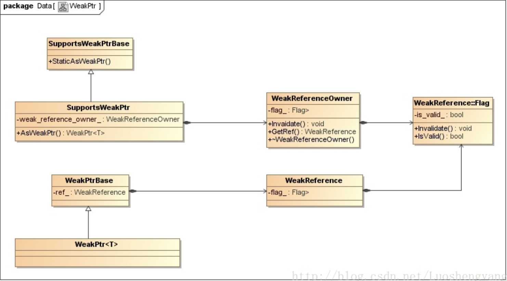

来学习一下chromium中的两类智能指针以及弱智能指针

## scoped_refptr

他是chromium里实现的一种类似shared_ptr的智能指针，其和shared_ptr最大的不同是，shared_ptr是自己计数引用对象的次数，而scoped_refptr则是将计数次数保存在RefCounted对象里，其设计目的是为了代替手动调用AddRef和Release来增减引用计数，以避免因为遗漏造成内存泄漏，所以它是为了reference counted objects设计的。

用法：
``` c++
  class MyFoo : public RefCounted<MyFoo> {
   ...
   private:
    friend class RefCounted<MyFoo>;  // Allow destruction by RefCounted<>.
    ~MyFoo();                        // Destructor must be private/protected.
  };

  void some_function() {
    scoped_refptr<MyFoo> foo = MakeRefCounted<MyFoo>();
    foo->Method(param);
    // |foo| is released when this function returns
  }

  void some_other_function() {
    scoped_refptr<MyFoo> foo = MakeRefCounted<MyFoo>();
    ...
    foo.reset();  // explicitly releases |foo|
    ...
    if (foo)
      foo->Method(param);
  }
// The above examples show how scoped_refptr<T> acts like a pointer to T.
// Given two scoped_refptr<T> classes, it is also possible to exchange
// references between the two objects, like so:
//
  {
    scoped_refptr<MyFoo> a = MakeRefCounted<MyFoo>();
    scoped_refptr<MyFoo> b;

    b.swap(a);
    // now, |b| references the MyFoo object, and |a| references nullptr.
  }

// To make both |a| and |b| in the above example reference the same MyFoo
// object, simply use the assignment operator:
//
  {
    scoped_refptr<MyFoo> a = MakeRefCounted<MyFoo>();
    scoped_refptr<MyFoo> b;

    b = a;
    // now, |a| and |b| each own a reference to the same MyFoo object.
  }
```


源码：
```
template <class T>
class scoped_refptr {
 public:
  typedef T element_type;

  constexpr scoped_refptr() = default;

  // Allow implicit construction from nullptr.
  constexpr scoped_refptr(std::nullptr_t) {}

  // Constructs from a raw pointer. Note that this constructor allows implicit
  // conversion from T* to scoped_refptr<T> which is strongly discouraged. If
  // you are creating a new ref-counted object please use
  // base::MakeRefCounted<T>() or base::WrapRefCounted<T>(). Otherwise you
  // should move or copy construct from an existing scoped_refptr<T> to the
  // ref-counted object.

  //从T* 构造出一个scoped_refptr对象
  scoped_refptr(T* p) : ptr_(p) {//ptr_指向一个ref-counted object，引用计数对象自身保存一个字段记录它被引用的次数
    if (ptr_)
      AddRef(ptr_);//见下，实际上是调用了ptr_的AddRef函数
  }

  // Copy constructor. This is required in addition to the copy conversion
  // constructor below.
  // 拷贝构造函数调用上面的scoped_refptrT * p)，即先将r.ptr赋值给ptr_，然后如果ptr_不为null，就让其指向的RefCounted对象引用计数加一
  scoped_refptr(const scoped_refptr& r) : scoped_refptr(r.ptr_) {}

  // Move constructor. This is required in addition to the move conversion
  // constructor below.
  // 移动构造函数，不改变引用计数次数，先拷贝r.ptr_给ptr_，然后将原来的scoped_refptr对象r里保存的ptr_置为null，控制权转移。
  scoped_refptr(scoped_refptr&& r) noexcept : ptr_(r.ptr_) { r.ptr_ = nullptr; }

  ~scoped_refptr() {
    //如果scoped_refptr被析构，且ptr_不为null，则调用Release函数使得引用计数减一。
    if (ptr_)
      Release(ptr_);//见下，实际上是调用了ptr_的Release函数
  }

  T* get() const { return ptr_; }//返回保存的原始指针ptr_

  T& operator*() const { //重载*, 返回ptr_指向的对象，这里是为了模拟原始指针本身的行为
    DCHECK(ptr_);
    return *ptr_;
  }

  T* operator->() const { //返回ptr_，这里是为了模拟原始指针本身的行为
    DCHECK(ptr_);
    return ptr_;
  }

  scoped_refptr& operator=(std::nullptr_t) {
    reset();
    return *this;
  }

  scoped_refptr& operator=(T* p) { return *this = scoped_refptr(p); }

  // Unified assignment operator.
  scoped_refptr& operator=(scoped_refptr r) noexcept {
    //这个函数就很迷了，在进行a=b这样的赋值的时候，由于参数是个拷贝，所以会先用b来进行一次拷贝构造，也就是创建一个新的scoped_refptr对象，**将引用计数加一**，然后保存原始指针在其ptr_里，所以赋值会让引用计数加一。
    //然后交换a和新拷贝出来的这个对象的ptr_,不改变引用计数
    //因为交换之后，临时拷贝出来的这个对象的ptr_是nullptr的话，所以在函数结束之后这个临时对象被析构，也不会使得引用计数变化。
    // 如果不是的话，就让a**原本**的ptr_的引用计数减一。
    swap(r);
    return *this;
  }

  // Sets managed object to null and releases reference to the previous managed
  // object, if it existed.
  //先构造一个临时的空的scoped_refptr()对象，因为ptr_没有指向任何东西，所以构造出来的时候不会影响引用计数
  //然后交换它和this的ptr_，然后在函数结束析构这个scoped_refptr的时候，此时它的ptr_不为null，就会将引用计数减一，且原本的this的ptr_也在交换后被置位null了。
  //这个效果就是显式的重置scoped_refptr。
  void reset() { scoped_refptr().swap(*this); }

  // Returns the owned pointer (if any), releasing ownership to the caller. The
  // caller is responsible for managing the lifetime of the reference.
  T* release() WARN_UNUSED_RESULT;

  void swap(scoped_refptr& r) noexcept { std::swap(ptr_, r.ptr_); }

  explicit operator bool() const { return ptr_ != nullptr; }

  template <typename U>
  bool operator==(const scoped_refptr<U>& rhs) const {
    return ptr_ == rhs.get();
  }

  template <typename U>
  bool operator!=(const scoped_refptr<U>& rhs) const {
    return !operator==(rhs);
  }

  template <typename U>
  bool operator<(const scoped_refptr<U>& rhs) const {
    return ptr_ < rhs.get();
  }

 protected:
  T* ptr_ = nullptr;

 private:
  template <typename U>
  friend scoped_refptr<U> base::AdoptRef(U*);
  friend class ::base::SequencedTaskRunner;

  // Friend access so these classes can use the constructor below as part of a
  // binary size optimization.
  friend class ::base::internal::BasePromise;
  friend class ::base::WrappedPromise;

  //*note 注意这个函数，它构造一个scoped_refptr，但是不增加引用计数，原因见下。
  scoped_refptr(T* p, base::subtle::AdoptRefTag) : ptr_(p) {}

  // Friend required for move constructors that set r.ptr_ to null.
  template <typename U>
  friend class scoped_refptr;

  // Non-inline helpers to allow:
  //     class Opaque;
  //     extern template class scoped_refptr<Opaque>;
  // Otherwise the compiler will complain that Opaque is an incomplete type.
  static void AddRef(T* ptr);
  static void Release(T* ptr);
};

template <typename T>
T* scoped_refptr<T>::release() {
  //直接返回scoped_refptr保存的指针，并将ptr_置为null，但是不更改其指向对象的引用计数，调用者有责任去管理被指向对象的lifetime
  //即代表所有权的转移
  T* ptr = ptr_;
  ptr_ = nullptr;
  return ptr;
}

// static
template <typename T>
void scoped_refptr<T>::AddRef(T* ptr) {
  ptr->AddRef();
}

// static
template <typename T>
void scoped_refptr<T>::Release(T* ptr) {
  ptr->Release();
}

template <typename T, typename U>
bool operator==(const scoped_refptr<T>& lhs, const U* rhs) {
  return lhs.get() == rhs;
}

template <typename T, typename U>
bool operator==(const T* lhs, const scoped_refptr<U>& rhs) {
  return lhs == rhs.get();
}

template <typename T>
bool operator==(const scoped_refptr<T>& lhs, std::nullptr_t null) {
  return !static_cast<bool>(lhs);
}

template <typename T>
bool operator==(std::nullptr_t null, const scoped_refptr<T>& rhs) {
  return !static_cast<bool>(rhs);
}

template <typename T, typename U>
bool operator!=(const scoped_refptr<T>& lhs, const U* rhs) {
  return !operator==(lhs, rhs);
}

template <typename T, typename U>
bool operator!=(const T* lhs, const scoped_refptr<U>& rhs) {
  return !operator==(lhs, rhs);
}

template <typename T>
bool operator!=(const scoped_refptr<T>& lhs, std::nullptr_t null) {
  return !operator==(lhs, null);
}

template <typename T>
bool operator!=(std::nullptr_t null, const scoped_refptr<T>& rhs) {
  return !operator==(null, rhs);
}

//打印scoped_refptr p就是输出其保存的原始指针的地址
template <typename T>
std::ostream& operator<<(std::ostream& out, const scoped_refptr<T>& p) {
  return out << p.get();
}

template <typename T>
void swap(scoped_refptr<T>& lhs, scoped_refptr<T>& rhs) noexcept {
  lhs.swap(rhs);
}
...
...
//通常使用MakeRefCounted来构造出一个scoped_refptr
//其首先new出一个T的实例，其必须是一个ref counted type
//然后wraps它成一个scoped_refptr<T>
//这里使用AdoptRefIfNeeded根据T里的kRefCountPreference有两种情况
//  1. kRefCountPreference为StartRefCountFromZeroTag，代表ref counted是从0开始计数（refcount_创建时初始化为0)，那么正常的构造一个scoped_refptr<T>(obj)即可，这样scoped_refptr构造出来的时候引用计数会被加一，即代表这个ref count对象被引用一次。

//  2. kRefCountPreference为StartRefCountFromOneTag，代表ref counted是从1开始计数（refcount_创建时初始化为1)，这样我们构造scoped_refptr的时候就不能直接scoped_refptr<T>(obj)了，这样会让引用计数再增加一次，也就是看上去这个ref count对象被引用了两次，这显然不正确。
//     此时我们就需要通过AdoptRef来协调，最终调到`scoped_refptr<T>(obj, subtle::kAdoptRefTag);`来构造一个scoped_refptr，而这个构造函数就只保存ptr，不增加引用计数

// Constructs an instance of T, which is a ref counted type, and wraps the
// object into a scoped_refptr<T>.
template <typename T, typename... Args>
scoped_refptr<T> MakeRefCounted(Args&&... args) {
  T* obj = new T(std::forward<Args>(args)...);
  return subtle::AdoptRefIfNeeded(obj, T::kRefCountPreference);
}
...
// Creates a scoped_refptr from a raw pointer without incrementing the reference
// count. Use this only for a newly created object whose reference count starts
// from 1 instead of 0.
template <typename T>
scoped_refptr<T> AdoptRef(T* obj) {
  using Tag = std::decay_t<decltype(T::kRefCountPreference)>;
  static_assert(std::is_same<subtle::StartRefCountFromOneTag, Tag>::value,
                "Use AdoptRef only if the reference count starts from one.");

  DCHECK(obj);
  DCHECK(obj->HasOneRef());
  obj->Adopted();
  return scoped_refptr<T>(obj, subtle::kAdoptRefTag);
}
```

finall:
```
scoped_refptr<MyFoo> foo = MakeRefCounted<MyFoo>();//创建一个MyFoo类型的智能指针，初始时引用计数为1
scoped_refptr<MyFoo> b, c(a),d;//拷贝构造
b = a;//赋值
//a,b,c是相互关联的共享指针，共同控制所指内存的生存期，通过拷贝构造和赋值都会让创建出来的MyFoo对象引用计数加一。
b.reset();//引用计数减一，b里保存的ptr_被置为NULL
d.swap(c);//c和d的ptr_交换，引用计数不变，此时d和a是相互关联的共享指针
a.release();//a将控制权交出，不再引用，而且release不改变引用计数。
d.get();//返回MyFoo原始指针ptr_
```

## scoped_ptr

scoped_ptr不同于scoped_refptr，他不具备引用计数的功能，并且不可被copy，只可以移动，在离开作用域时会自动析构。

使用方法：
```
5	// Scopers help you manage ownership of a pointer, helping you easily manage a
6	// pointer within a scope, and automatically destroying the pointer at the end
7	// of a scope.  There are two main classes you will use, which correspond to the
8	// operators new/delete and new[]/delete[].
9	//
10	// Example usage (scoped_ptr<T>):
11	//   {
12	//     scoped_ptr<Foo> foo(new Foo("wee"));
13	//   }  // foo goes out of scope, releasing the pointer with it.
14	//
15	//   {
16	//     scoped_ptr<Foo> foo;          // No pointer managed.
17	//     foo.reset(new Foo("wee"));    // Now a pointer is managed.
18	//     foo.reset(new Foo("wee2"));   // Foo("wee") was destroyed.
19	//     foo.reset(new Foo("wee3"));   // Foo("wee2") was destroyed.
20	//     foo->Method();                // Foo::Method() called.
21	//     foo.get()->Method();          // Foo::Method() called.
22	//     SomeFunc(foo.release());      // SomeFunc takes ownership, foo no longer
23	//                                   // manages a pointer.
24	//     foo.reset(new Foo("wee4"));   // foo manages a pointer again.
25	//     foo.reset();                  // Foo("wee4") destroyed, foo no longer
26	//                                   // manages a pointer.
27	//   }  // foo wasn't managing a pointer, so nothing was destroyed.
28	//
29	// Example usage (scoped_ptr<T[]>):
30	//   {
31	//     scoped_ptr<Foo[]> foo(new Foo[100]);
32	//     foo.get()->Method();  // Foo::Method on the 0th element.
33	//     foo[10].Method();     // Foo::Method on the 10th element.
34	//   }
35	//
36	// These scopers also implement part of the functionality of C++11 unique_ptr
37	// in that they are "movable but not copyable."  You can use the scopers in
38	// the parameter and return types of functions to signify ownership transfer
39	// in to and out of a function.  When calling a function that has a scoper
40	// as the argument type, it must be called with the result of an analogous
41	// scoper's Pass() function or another function that generates a temporary;
42	// passing by copy will NOT work.  Here is an example using scoped_ptr:
43	//
44	//   void TakesOwnership(scoped_ptr<Foo> arg) {
45	//     // Do something with arg
46	//   }
47	//   scoped_ptr<Foo> CreateFoo() {
48	//     // No need for calling Pass() because we are constructing a temporary
49	//     // for the return value.
50	//     return scoped_ptr<Foo>(new Foo("new"));
51	//   }
52	//   scoped_ptr<Foo> PassThru(scoped_ptr<Foo> arg) {
53	//     return arg.Pass();
54	//   }
55	//
56	//   {
57	//     scoped_ptr<Foo> ptr(new Foo("yay"));  // ptr manages Foo("yay").
58	//     TakesOwnership(ptr.Pass());           // ptr no longer owns Foo("yay").
59	//     scoped_ptr<Foo> ptr2 = CreateFoo();   // ptr2 owns the return Foo.
60	//     scoped_ptr<Foo> ptr3 =                // ptr3 now owns what was in ptr2.
61	//         PassThru(ptr2.Pass());            // ptr2 is correspondingly NULL.
62	//   }
63	//
64	// Notice that if you do not call Pass() when returning from PassThru(), or
65	// when invoking TakesOwnership(), the code will not compile because scopers
66	// are not copyable; they only implement move semantics which require calling
67	// the Pass() function to signify a destructive transfer of state. CreateFoo()
68	// is different though because we are constructing a temporary on the return
69	// line and thus can avoid needing to call Pass().
70	//
71	// Pass() properly handles upcast in initialization, i.e. you can use a
72	// scoped_ptr<Child> to initialize a scoped_ptr<Parent>:
73	//
74	//   scoped_ptr<Foo> foo(new Foo());
75	//   scoped_ptr<FooParent> parent(foo.Pass());
76	//
77	// PassAs<>() should be used to upcast return value in return statement:
78	//
79	//   scoped_ptr<Foo> CreateFoo() {
80	//     scoped_ptr<FooChild> result(new FooChild());
81	//     return result.PassAs<Foo>();
82	//   }
83	//
84	// Note that PassAs<>() is implemented only for scoped_ptr<T>, but not for
85	// scoped_ptr<T[]>. This is because casting array pointers may not be safe.
```

源码：
```
template <class T, class D = DefaultDeleter<T> >
class scoped_ptr {
 public:
  // The element and deleter types.
  typedef T element_type;
  typedef D deleter_type;

  // Constructor.  Defaults to initializing with NULL.
  scoped_ptr() : impl_(NULL) { }

  // Constructor.  Takes ownership of p.
  explicit scoped_ptr(element_type* p) : impl_(p) { }

  // Constructor.  Allows initialization of a stateful deleter.
  scoped_ptr(element_type* p, const D& d) : impl_(p, d) { }

  // Constructor.  Allows construction from a scoped_ptr rvalue for a
  // convertible type and deleter.
  //
  // IMPLEMENTATION NOTE: C++11 unique_ptr<> keeps this constructor distinct
  // from the normal move constructor. By C++11 20.7.1.2.1.21, this constructor
  // has different post-conditions if D is a reference type. Since this
  // implementation does not support deleters with reference type,
  // we do not need a separate move constructor allowing us to avoid one
  // use of SFINAE. You only need to care about this if you modify the
  // implementation of scoped_ptr.
  
  //scoped_ptr类将引用的目标对象间接保存在成员变量impl_描述的一个scoped_ptr_impl对象中
  //通过宏COMPILE_ASSERT禁止scoped_ptr智能指针引用的目标对象从RefCounted类或者ThreadSafeRefCounted类继承下来，也就是不要求目标对象具有引用计数功能。
  template <typename U, typename V>
  scoped_ptr(scoped_ptr<U, V> other) : impl_(&other.impl_) {
    COMPILE_ASSERT(!is_array<U>::value, U_cannot_be_an_array);
  }

  // operator=.  Allows assignment from a scoped_ptr rvalue for a convertible
  // type and deleter.
  //
  // IMPLEMENTATION NOTE: C++11 unique_ptr<> keeps this operator= distinct from
  // the normal move assignment operator. By C++11 20.7.1.2.3.4, this templated
  // form has different requirements on for move-only Deleters. Since this
  // implementation does not support move-only Deleters, we do not need a
  // separate move assignment operator allowing us to avoid one use of SFINAE.
  // You only need to care about this if you modify the implementation of
  // scoped_ptr.
  template <typename U, typename V>
  scoped_ptr& operator=(scoped_ptr<U, V> rhs) {
    COMPILE_ASSERT(!is_array<U>::value, U_cannot_be_an_array);
    impl_.TakeState(&rhs.impl_);
    return *this;
  }

  // Reset.  Deletes the currently owned object, if any.
  // Then takes ownership of a new object, if given.
  void reset(element_type* p = NULL) { impl_.reset(p); }

  // Accessors to get the owned object.
  // operator* and operator-> will assert() if there is no current object.
  element_type& operator*() const {
    assert(impl_.get() != NULL);
    return *impl_.get();
  }
  element_type* operator->() const  {
    assert(impl_.get() != NULL);
    return impl_.get();
  }
  element_type* get() const { return impl_.get(); }

  // Access to the deleter.
  deleter_type& get_deleter() { return impl_.get_deleter(); }
  const deleter_type& get_deleter() const { return impl_.get_deleter(); }

  // Allow scoped_ptr<element_type> to be used in boolean expressions, but not
  // implicitly convertible to a real bool (which is dangerous).
 private:
  typedef scoped_ptr_impl<element_type, deleter_type> scoped_ptr::*Testable;

 public:
  operator Testable() const { return impl_.get() ? &scoped_ptr::impl_ : NULL; }

  // Comparison operators.
  // These return whether two scoped_ptr refer to the same object, not just to
  // two different but equal objects.
  bool operator==(const element_type* p) const { return impl_.get() == p; }
  bool operator!=(const element_type* p) const { return impl_.get() != p; }

  // Swap two scoped pointers.
  void swap(scoped_ptr& p2) {
    impl_.swap(p2.impl_);
  }

  // Release a pointer.
  // The return value is the current pointer held by this object.
  // If this object holds a NULL pointer, the return value is NULL.
  // After this operation, this object will hold a NULL pointer,
  // and will not own the object any more.
  element_type* release() {
    return impl_.release();
  }

 private:
  // Needed to reach into |impl_| in the constructor.
  template <typename U, typename V> friend class scoped_ptr;
  scoped_ptr_impl<element_type, deleter_type> impl_;

  // Forbid comparison of scoped_ptr types.  If U != T, it totally
  // doesn't make sense, and if U == T, it still doesn't make sense
  // because you should never have the same object owned by two different
  // scoped_ptrs.
  template <class U> bool operator==(scoped_ptr<U> const& p2) const;
  template <class U> bool operator!=(scoped_ptr<U> const& p2) const;
};
```
scoped_ptr类中的成员函数大多通过调用scoped_ptr_impl对象中的成员函数来实现，我们接着去看一下scoped_ptr_impl

```
template <class T, class D>
class scoped_ptr_impl {
 public:
  explicit scoped_ptr_impl(T* p) : data_(p) { }

  // Initializer for deleters that have data parameters.
  scoped_ptr_impl(T* p, const D& d) : data_(p, d) {}

  // Templated constructor that destructively takes the value from another
  // scoped_ptr_impl.
  
  //构造函数，将管理的指针存储到data.ptr,data中同样保存了deleter。
  template <typename U, typename V>
  scoped_ptr_impl(scoped_ptr_impl<U, V>* other)
      : data_(other->release(), other->get_deleter()) {
    // We do not support move-only deleters.  We could modify our move
    // emulation to have base::subtle::move() and base::subtle::forward()
    // functions that are imperfect emulations of their C++11 equivalents,
    // but until there's a requirement, just assume deleters are copyable.
  }

//通过reset将data_.ptr设置为other.ptr，并且将other的deleter保存到data_中
  template <typename U, typename V>
  void TakeState(scoped_ptr_impl<U, V>* other) {
    // See comment in templated constructor above regarding lack of support
    // for move-only deleters.
    reset(other->release());
    get_deleter() = other->get_deleter();
  }

//析构函数，如果不为空调用deleter将其释放。
  ~scoped_ptr_impl() {
    if (data_.ptr != NULL) {
      // Not using get_deleter() saves one function call in non-optimized
      // builds.
      static_cast<D&>(data_)(data_.ptr);
    }
  }

//首先判断参数是否为空或者是scoped_ptr本身，如果将scoped_ptr本身传入reset会导致uaf
//将原先scoped_ptr保存的指针（data_.ptr中保存的值）放入old，之后将data_.ptr置空，如果old不为空则调用deleter将其释放。
//最后将data_.ptr设置为传入指针p，注意这个传入指针是原始指针。
  void reset(T* p) {
    // This is a self-reset, which is no longer allowed: http://crbug.com/162971
    if (p != NULL && p == data_.ptr)
      abort();

    // Note that running data_.ptr = p can lead to undefined behavior if
    // get_deleter()(get()) deletes this. In order to pevent this, reset()
    // should update the stored pointer before deleting its old value.
    //
    // However, changing reset() to use that behavior may cause current code to
    // break in unexpected ways. If the destruction of the owned object
    // dereferences the scoped_ptr when it is destroyed by a call to reset(),
    // then it will incorrectly dispatch calls to |p| rather than the original
    // value of |data_.ptr|.
    //
    // During the transition period, set the stored pointer to NULL while
    // deleting the object. Eventually, this safety check will be removed to
    // prevent the scenario initially described from occuring and
    // http://crbug.com/176091 can be closed.
    T* old = data_.ptr;
    data_.ptr = NULL;
    if (old != NULL)
      static_cast<D&>(data_)(old);
    data_.ptr = p;
  }

//获得scoped_ptr中管理的原始指针
  T* get() const { return data_.ptr; }

//获得deleter
  D& get_deleter() { return data_; }
  const D& get_deleter() const { return data_; }

//交换原始指针和deleter
  void swap(scoped_ptr_impl& p2) {
    // Standard swap idiom: 'using std::swap' ensures that std::swap is
    // present in the overload set, but we call swap unqualified so that
    // any more-specific overloads can be used, if available.
    using std::swap;
    swap(static_cast<D&>(data_), static_cast<D&>(p2.data_));
    swap(data_.ptr, p2.data_.ptr);
  }

//先将scoped_ptr管理的ptr（data_.ptr中保存的值）存入old，之后将data_.ptr置空，之后返回old
  T* release() {
    T* old_ptr = data_.ptr;
    data_.ptr = NULL;
    return old_ptr;
  }

 private:
  // Needed to allow type-converting constructor.
  template <typename U, typename V> friend class scoped_ptr_impl;

  // Use the empty base class optimization to allow us to have a D
  // member, while avoiding any space overhead for it when D is an
  // empty class.  See e.g. http://www.cantrip.org/emptyopt.html for a good
  // discussion of this technique.
  struct Data : public D {
    explicit Data(T* ptr_in) : ptr(ptr_in) {}
    Data(T* ptr_in, const D& other) : D(other), ptr(ptr_in) {}
    T* ptr;
  };

  Data data_;

  DISALLOW_COPY_AND_ASSIGN(scoped_ptr_impl);
};
```

## weak_ptr

这里借用一张图：


WeakPtr类继承于WeakPtrBase类。WeakPtrBase类有一个成员变量ref_，它指向一个WeakReference对象。WeakPtr类实现弱智能指针的功能的关键点就在于这个WeakReference对象。

一个对象如果需要被弱智能指针引用，那么它所属的类就必须要继承于SupportsWeakPtr类。SupportsWeakPtr类又是继承于SupportsWeakPtrBase类的。SupportsWeakPtrBase类有一个静态成员函数StaticAsWeakPtr，用来将一个间接继承于SupportsWeakPtr类的子类对象封装成一个WeakPtr弱智能指针。

SupportsWeakPtr类有一个成员函数AsWeakPtr，用来将一个SupportsWeakPtr子类对象封装成一个WeakPtr弱智能指针。在封装的过程中，需要用到成员变量weak_reference_owner_指向的一个WeakReferenceeOwner对象。

WeakReferenceeOwner类有一个成员变量flag_，它指向一个Flag对象。这个Flag对象有一个布尔类型的成员变量isvalid。当一个WeakReferenceeOwner对象所属的SupportsWeakPtr对象被销毁时，也就是它的析构函数被调用的时候，这个WeakReferenceeOwner对象的成员函数Invalidate就会被调用。WeakReferenceeOwner类的成员函数Invalidate又会进一步调用成员变量flag_指向的一个Flag对象的成员函数Invalidate，将该Flag对象的成员变量is_valid_的值设置为false，表示一个相应的SupportsWeakPtr对象被销毁了。

当我们调用SupportsWeakPtr类的成员函数AsWeakPtr来获得一个WeakPtr弱智能指针时，SupportsWeakPtr类的成员函数AsWeakPtr先会调用成员变量weak_reference_owner_指向的一个WeakReferenceeOwner对象的成员函数GetRef创建一个WeakReference对象，这个WeakReference对象通过成员变量flag_引用了上述的WeakReferenceeOwner对象的成员变量flag_指向的一个Flag对象。这意味在图1中，WeakReferenceeOwner类和WeakReference对象的成员变量flag_指向的都是同一个Flag对象。

这相当于就是通过一个共同的Flag对象将一个WeakPtr弱智能指针与它所引用的目标对象关联起来，这样我们需要使用一个WeakPtr弱智能指针所引用的目标对象时，就可以通过上述的共同Flag对象的成员函数IsValid来判断目标对象是否已经被销毁，实际上就是判断该Flag对象的成员变量is_valid_是否等于true。

我们先来看一下SupportsWeakPtrBase的实现
```
class SupportsWeakPtrBase {
 public:
  // A safe static downcast of a WeakPtr<Base> to WeakPtr<Derived>. This
  // conversion will only compile if there is exists a Base which inherits
  // from SupportsWeakPtr<Base>. See base::AsWeakPtr() below for a helper
  // function that makes calling this easier.
  //
  // Precondition: t != nullptr
  template<typename Derived>
  static WeakPtr<Derived> StaticAsWeakPtr(Derived* t) {
    static_assert(
        std::is_base_of<internal::SupportsWeakPtrBase, Derived>::value,
        "AsWeakPtr argument must inherit from SupportsWeakPtr");
    return AsWeakPtrImpl<Derived>(t);
  }

 private:
  // This template function uses type inference to find a Base of Derived
  // which is an instance of SupportsWeakPtr<Base>. We can then safely
  // static_cast the Base* to a Derived*.
  template <typename Derived, typename Base>
  static WeakPtr<Derived> AsWeakPtrImpl(SupportsWeakPtr<Base>* t) {
    WeakPtr<Base> ptr = t->AsWeakPtr();
    return WeakPtr<Derived>(
        ptr.ref_, static_cast<Derived*>(reinterpret_cast<Base*>(ptr.ptr_)));
  }
};
```
一个类如果要配合WeakPtr弱智能指针使用，那么该类必须要继承SupportsWeakPtr。
```
class Base : public base::SupportsWeakPtr<Base> {};
```
假设有一个Derived对象他继承了base：
```
class Derived : public Base {};
```
如果我们有一个Derived对象，并且想创建一个WeakPtr智能指针引用该Derived对象，那么是不能调用从父类Base继承下来的成员函数AsWeakPtr来创建的，如下所示：
```
Derived derived;
base::WeakPtr<Derived> ptr = derived.AsWeakPtr(); 
```
这是因为SupportsWeakPtr类的成员函数AsWeakPtr返回的是一个WeakPtr对象，并且这个WeakPtr对象不能自动转换为一个WeakPtr对象。

为了能够实现上述转换，我们要使用到一个AsWeakPtr函数，它的实现如下所示：
```
template <typename Derived>
WeakPtr<Derived> AsWeakPtr(Derived* t) {
  return internal::SupportsWeakPtrBase::StaticAsWeakPtr<Derived>(t);
}
```
有了这个AsWeakPtr函数之后，就可以通过下面的代码来创建一个WeakPtr对象：
```
Derived derived;
base::WeakPtr<Derived> ptr = base::AsWeakPtr(&derived);
```
函数AsWeakPtr调用了SupportsWeakPtrBase类的静态成员函数StaticAsWeakPtr，后者又通过调用SupportsWeakPtrBase类的静态成员函数AsWeakPtrImpl创建了一个WeakPtr对象。

SupportsWeakPtrBase类的静态成员函数AsWeakPtrImpl首先是调用参数t描述的一个Derived对象从父类Base继承下来的成员函数AsWeakPtr来创建一个WeakPtr对象。每一个WeakPtr对象都有一个成员变量ptr_，它保存的就是WeakPtr对象所引用的目标对象的地址值。有了目标对象的地址值之后，就可以将它转化一个Derived指针。这里能够转换成功，是因为Derived类是继承于Base类的。有了这个Derived指针之后，再结合前面获得的WeakPtr对象的成员变量ref_r描述的一个WeakReference对象之后，就可以通过模板类WeakPtr的构造函数来创建一个WeakPtr对象了，也就是创建一个引用了Derived对象的WeakPtr智能指针了。

接下来来看一下SupportsWeakPtr的实现：
```
template <class T>
class SupportsWeakPtr : public internal::SupportsWeakPtrBase {
 public:
  SupportsWeakPtr() = default;

  WeakPtr<T> AsWeakPtr() {
    return WeakPtr<T>(weak_reference_owner_.GetRef(), static_cast<T*>(this));
  }

 protected:
  ~SupportsWeakPtr() = default;

 private:
  internal::WeakReferenceOwner weak_reference_owner_;
  DISALLOW_COPY_AND_ASSIGN(SupportsWeakPtr);
};
```
我们先来看一下AsWeakPtr()这个成员函数，刚才在创建Weakptr对象时也用到了他：
它首先调用成员变量weak_reference_owner_指向的一个WeakReferenceOwner对象的成员函数GetRef获得一个WeakReference对象，然后再通过WeakPtr类的构造函数创建一个WeakPtr弱智能指针。
```
WeakReference WeakReferenceOwner::GetRef() const {
      // If we hold the last reference to the Flag then create a new one.
      if (!HasRefs())
        flag_ = new WeakReference::Flag();

      return WeakReference(flag_.get());
    }
```
WeakReferenceOwner类的成员函数GetRef首先是调用成员函数HasRefs判断成员变量flag_是否指向了一个Flag对象。如果不是，那么就需要创建一个Flag对象，并且保存在成员变量flag_中。接下来再以成员变量flag_指向的Flag对象为参数，创建一个WeakReference对象。

SupportsWeakPtr的最主要的作用就是引入了一个WeakReferenceOwner对象的成员变量，我们接着看下他的代码：

```
class BASE_EXPORT WeakReferenceOwner {
 public:
  WeakReferenceOwner();
  ~WeakReferenceOwner();

  WeakReference GetRef() const;

  bool HasRefs() const { return !flag_->HasOneRef(); }

  void Invalidate();

 private:
  scoped_refptr<WeakReference::Flag> flag_;
};
```
他通过成员变量flag_引入了Flag对象，但是这里需要注意该变量是通过智能指针scoped_refptr来管理的，这就意味着Flag类是具有计数功能的。

flag的定义如下：
```
class BASE_EXPORT WeakReference {
 public:
  // Although Flag is bound to a specific SequencedTaskRunner, it may be
  // deleted from another via base::WeakPtr::~WeakPtr().
  class BASE_EXPORT Flag : public RefCountedThreadSafe<Flag> {
   public:
    Flag();

    void Invalidate();
    bool IsValid() const;

    bool MaybeValid() const;

    void DetachFromSequence();

   private:
    friend class base::RefCountedThreadSafe<Flag>;

    ~Flag();

    SEQUENCE_CHECKER(sequence_checker_);
    AtomicFlag invalidated_;
  };

  WeakReference();
  explicit WeakReference(const scoped_refptr<Flag>& flag);
  ~WeakReference();

  WeakReference(WeakReference&& other) noexcept;
  WeakReference(const WeakReference& other);
  WeakReference& operator=(WeakReference&& other) noexcept = default;
  WeakReference& operator=(const WeakReference& other) = default;

  bool IsValid() const;
  bool MaybeValid() const;

 private:
  scoped_refptr<const Flag> flag_;
};
```
可以看到Flag类继承于RefCountedThreadSafe类，因此它就具有引用计数功能，并且在增加和减少引用计数时是线程安全的。

接下来我们去看一下WeakPtr类，他继承自WeakPtrBase类：
```
template <typename T>
class WeakPtr : public internal::WeakPtrBase {
 public:
  WeakPtr() = default;
  WeakPtr(std::nullptr_t) {}

  // Allow conversion from U to T provided U "is a" T. Note that this
  // is separate from the (implicit) copy and move constructors.
  
  //拷贝构造，获得weak_ptr中的raw pointer，之后将其保存在ptr_中
  template <typename U>
  WeakPtr(const WeakPtr<U>& other) : WeakPtrBase(other) {
    // Need to cast from U* to T* to do pointer adjustment in case of multiple
    // inheritance. This also enforces the "U is a T" rule.
    T* t = reinterpret_cast<U*>(other.ptr_);
    ptr_ = reinterpret_cast<uintptr_t>(t);
  }
  template <typename U>
  WeakPtr(WeakPtr<U>&& other) noexcept : WeakPtrBase(std::move(other)) {
    // Need to cast from U* to T* to do pointer adjustment in case of multiple
    // inheritance. This also enforces the "U is a T" rule.
    T* t = reinterpret_cast<U*>(other.ptr_);
    ptr_ = reinterpret_cast<uintptr_t>(t);
  }

//获得weak_ptr管理的原始指针，只有ref_存在时ptr_才有意义，否则为null
  T* get() const {
    return ref_.IsValid() ? reinterpret_cast<T*>(ptr_) : nullptr;
  }

//同上面只有ref_存在时ptr_才有意义，否则为null
  T& operator*() const {
    CHECK(ref_.IsValid());
    return *get();
  }
  T* operator->() const {
    CHECK(ref_.IsValid());
    return get();
  }

  // Allow conditionals to test validity, e.g. if (weak_ptr) {...};
  explicit operator bool() const { return get() != nullptr; }

  // Returns false if the WeakPtr is confirmed to be invalid. This call is safe
  // to make from any thread, e.g. to optimize away unnecessary work, but
  // operator bool() must always be called, on the correct sequence, before
  // actually using the pointer.
  //
  // Warning: as with any object, this call is only thread-safe if the WeakPtr
  // instance isn't being re-assigned or reset() racily with this call.
  bool MaybeValid() const { return ref_.MaybeValid(); }

  // Returns whether the object |this| points to has been invalidated. This can
  // be used to distinguish a WeakPtr to a destroyed object from one that has
  // been explicitly set to null.
  bool WasInvalidated() const { return ptr_ && !ref_.IsValid(); }

 private:
  friend class internal::SupportsWeakPtrBase;
  template <typename U> friend class WeakPtr;
  friend class SupportsWeakPtr<T>;
  friend class WeakPtrFactory<T>;

  WeakPtr(const internal::WeakReference& ref, T* ptr)
      : WeakPtrBase(ref, reinterpret_cast<uintptr_t>(ptr)) {}
};


class BASE_EXPORT WeakPtrBase {
 public:
  WeakPtrBase();
  ~WeakPtrBase();

  WeakPtrBase(const WeakPtrBase& other) = default;
  WeakPtrBase(WeakPtrBase&& other) noexcept = default;
  WeakPtrBase& operator=(const WeakPtrBase& other) = default;
  WeakPtrBase& operator=(WeakPtrBase&& other) noexcept = default;

//将ref_更新为新的WeakReference对象，并将ptr_置0。
  void reset() {
    ref_ = internal::WeakReference();
    ptr_ = 0;
  }

 protected:
  WeakPtrBase(const WeakReference& ref, uintptr_t ptr);

  WeakReference ref_;

  // This pointer is only valid when ref_.is_valid() is true.  Otherwise, its
  // value is undefined (as opposed to nullptr).
  uintptr_t ptr_;
};
```

当一个Flag对象的宿主WeakReferenceOwner对象被析构时，就会将它的成员变量is_valid_的值设置为false，如下所示：

```
WeakReferenceOwner::~WeakReferenceOwner() {
      Invalidate();
}
    
void WeakReferenceOwner::Invalidate() {
      if (flag_.get()) {
        flag_->Invalidate();
        flag_ = NULL;
      }
    }
    
void WeakReference::Flag::Invalidate() {
      ......
      is_valid_ = false;
}
```

一个WeakReferenceOwner对象什么时候会被析构呢？前面提到，SupportsWeakPtr类有一个成员变量weak_reference_owner_描述的是一个WeakReferenceOwner对象。这意味着当一个SupportsWeakPtr对象被析构时，它的成员变量weak_reference_owner_描述的是一个WeakReferenceOwner对象也会随之析构。

SupportsWeakPtr类是作为一个被WeakPtr弱智能指针引用的目标对象的父类的，因此当一个WeakPtr弱智能指针引用的目标对象被析构时，目标对象的父类SupportsWeakPtr有的成员变量weak_reference_owner_描述的是一个WeakReferenceOwner对象就会被析构，随后又会将与该WeakReferenceOwner对象关联的Flag对象的成员变量is_valid_的值设置为true，最后WeakPtr弱智能指针就可以通过该Flag对象的成员函数IsValid判断出它所引用的目标对象是否已经被销毁，从而就实现它作为弱智能指针的作用。

