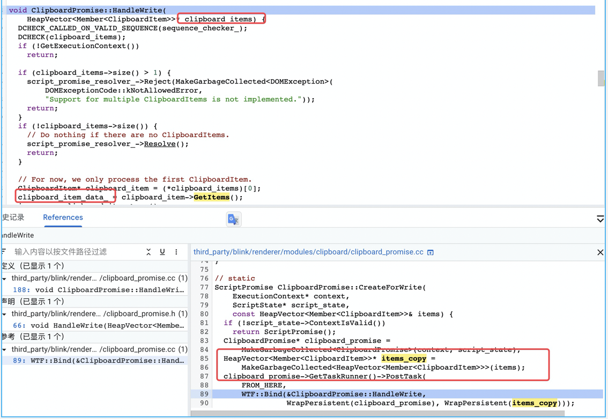
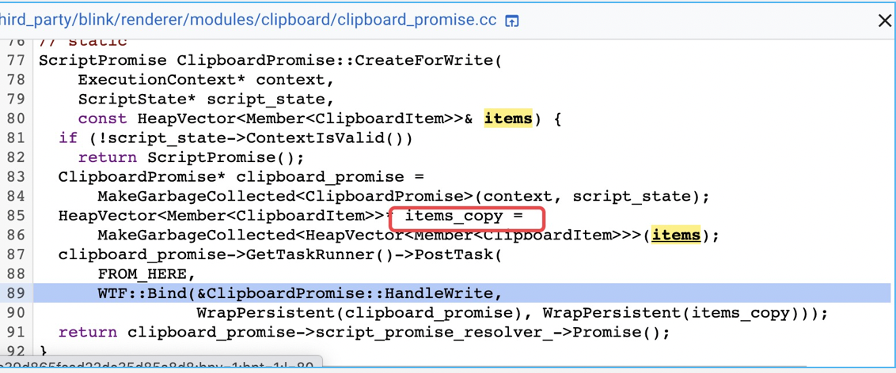
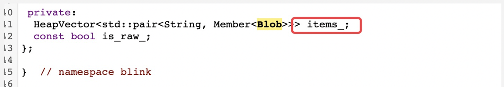
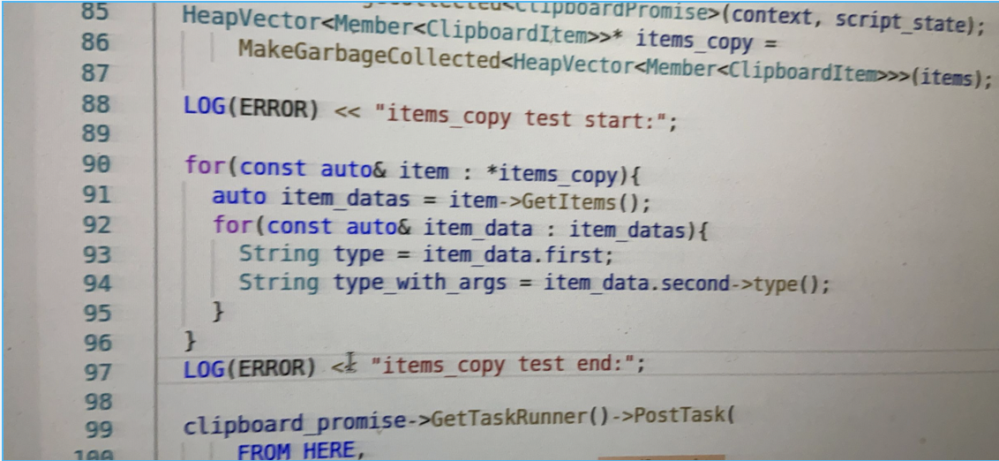

记录一下自己挖的第一个洞，虽然是个空指针😂：
补丁：https://chromium-review.googlesource.com/c/chromium/src/+/2568818

```
void ClipboardPromise::OnReadAvailableFormatNames(
    const Vector<String>& format_names) {
  DCHECK_CALLED_ON_VALID_SEQUENCE(sequence_checker_);
  if (!GetExecutionContext())
    return;

  clipboard_item_data_.ReserveInitialCapacity(format_names.size()); //[1]
  for (const String& format_name : format_names) { //[2]
    clipboard_item_data_.emplace_back(format_name,
                                      /* Placeholder value. */ nullptr);
  }
  ReadNextRepresentation();
}
```
[1]处先预留一共多少个Item，把type-nullptr填进去。[2]处把nullptr改成正确的值


```
void ClipboardPromise::ReadNextRepresentation() {
  DCHECK_CALLED_ON_VALID_SEQUENCE(sequence_checker_);
  if (!GetExecutionContext())
    return;
  if (clipboard_representation_index_ == clipboard_item_data_.size()) {
    ResolveRead();
    return;
  }

  String format_name =
      clipboard_item_data_[clipboard_representation_index_].first;
  if (is_raw_) {
    GetLocalFrame()->GetRawSystemClipboard()->Read(
        format_name,
        WTF::Bind(&ClipboardPromise::OnRawRead, WrapPersistent(this)));
    return;
  }

  ClipboardReader* clipboard_reader = ClipboardReader::Create(
      GetLocalFrame()->GetSystemClipboard(), format_name, this);
  if (!clipboard_reader) {
    OnRead(nullptr);
    return;
  }
  clipboard_reader->Read();
}
```
复制vscode的时候他不止有rtf，还有plain和html，应该是前面两个可以到rtf不行了，但他因为有成功的所以都传给write了，就把null也传过去了。


下面记录一下调试过程：
首先找到crash位置：
```
void ClipboardPromise::HandleWriteWithPermission(PermissionStatus status) {
  DCHECK_CALLED_ON_VALID_SEQUENCE(sequence_checker_);
  if (!GetExecutionContext())
    return;
  if (status != PermissionStatus::GRANTED) {
    script_promise_resolver_->Reject(MakeGarbageCollected<DOMException>(
        DOMExceptionCode::kNotAllowedError, "Write permission denied."));
    return;
  }

  // Check that all blobs have valid types.
  for (const auto& type_and_blob : clipboard_item_data_) {
    String type = type_and_blob.first;
    String type_with_args = type_and_blob.second->type(); //[1] crash here!!!
    if (!ClipboardWriter::IsValidType(type, is_raw_)) {
      script_promise_resolver_->Reject(MakeGarbageCollected<DOMException>(
          DOMExceptionCode::kNotAllowedError,
          "Type " + type + " not supported on write."));
      return;
    }
    // For normal (not-raw) write, blobs may have a full MIME type with args
    // (ex. 'text/plain;charset=utf-8'), whereas the type must not have args
    // (ex. 'text/plain' only), so ensure that Blob->type is contained in type.
    // For raw clipboard, Blobs convert their type to lowercase.
    if (!type_with_args.Contains(type.LowerASCII())) {
      script_promise_resolver_->Reject(MakeGarbageCollected<DOMException>(
          DOMExceptionCode::kNotAllowedError,
          "Type " + type + " does not match the blob's type " +
              type_with_args));
      return;
    }
  }

  DCHECK(!clipboard_representation_index_);
  WriteNextRepresentation();
}
```
程序在String type_with_args = type_and_blob.second->type();处奔溃。


data来自于传入的item的拷贝,如下图：



vector就直接和数组一样，member就调用getraw函数，然后去到clipitem原始指针之后

会访问items_，然后访问里面的Blob，然后访问里面的blob_data_handle_，这里通过打log来测试一下：items_copy在item最初拷贝出来的时候有没有值，如果他此时为null，则需要回去找read的过程，有值的话就继续跟write，二分法挖洞，xs
log如下：

测试得在这就是空指针了，看下图可以得知write的时候data就已经是空了，所以就去read找问题。


之后就找到了问题所在，也就是最开始的那段内容。
