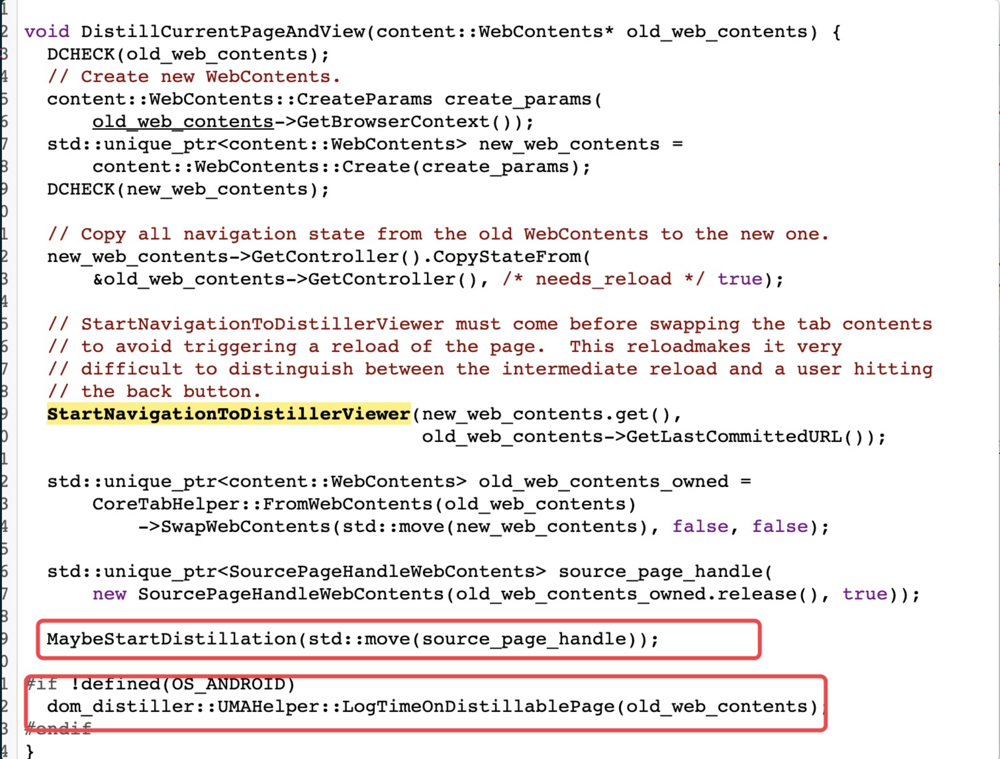
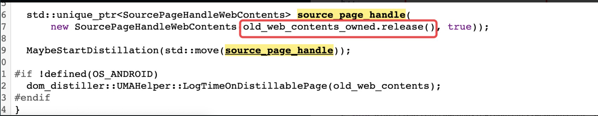

case 1:

我们重点来关注一下这个MaybeStartdistillation函数：

他在调用时传入了一个std::move()可以看出他是通过该函数来实现一个控制权的转移，我们进入该函数


可以看到他在std::move()移交控制权之前存在一个return，如果提前在上面return就会导致source_page_handle失效。




我们来关注一下MaybeStartdistillation调用时的参数的生命周期的移交：
在图中的红框处做了一个web_contents的切换:
- 它首先将旧的web_contents保存在了old_web_contents_owned
- 之后old_web_contents_owned通过release函数把原始指针又交管给了source_page_handle
- source_page_handle现在管理了old_web_contents的生命周期
- 在MaybeStartdistillation中提前return就会导致old_web_contents失效，之后在后面出现uaf


```
func1(){
   ptr* p;
   unique_ptr<A> a = new A(p);
   func2(std::move(a))
   use p;//p->xxx
}
func2(unique_ptr<A> a1){
  if(xx){
    return;
  }
  xx = std::move(a1);
}
```

codeql思路：

```
首先找到从std::move函数可达的func
并且func里有不经过move的return
如果有不被move支配的return,那么我们就可能把move(a)里的a析构掉
然后你确定一下这个智能指针里保存的原始指针类型，有没有在后面被用到就行了

! 注意是原始指针
! 智能指针是用来管理原始指针的
```


case 2:

CVE-2020-15990/CVE-2020-15991

- issue
https://bugs.chromium.org/p/chromium/issues/detail?id=1133688
https://bugs.chromium.org/p/chromium/issues/detail?id=1133671

- patch
https://chromium.googlesource.com/chromium/src.git/+/192ad9fd016679aa69904c067b9e3951295905f4

这两个漏洞补在相似的地方，漏洞点都是将impl的原始指针不加保护的传递KeyPress的事件处理函数
```
RegisterKeyPressHandler(
          base::Bind(&AutofillPopupControllerImpl::HandleKeyPressEvent,
                    base::Unretained(this)));
```
RegisterKeyPressHandler最终将回调注册到了RenderWidgetHostImpl里。
```
RegisterKeyPressHandler
  -> KeyPressHandlerManager::RegisterKeyPressHandler
      -> ContentAutofillDriver::AddHandler
        -> RenderWidgetHostImpl::AddKeyPressEventCallback
```
然后让我们关注AutofillPopupControllerImpl的析构，在考虑一个对象的析构的时候，首先要注意到它是怎么被构造出来的，沿着构造函数的调用点往上回溯。
```
AutofillPopupControllerImpl::AutofillPopupControllerImpl
  <-
AutofillPopupControllerImpl::GetOrCreate
    <- ChromeAutofillClient::ShowAutofillPopup
...
popup_controller_ = AutofillPopupControllerImpl::GetOrCreate
```
最终将AutofillPopupControllerImpl实例保存在ChromeAutofillClient的popup_controller_字段。

注意到ChromeAutofillClient这个类继承自WebContentsObserver，而WebContentsObserver是用来监视RenderFrameHost的生命周期的。
```
// Chrome implementation of AutofillClient.
class ChromeAutofillClient
    : public AutofillClient,
      public content::WebContentsUserData<ChromeAutofillClient>,
      public content::WebContentsObserver
...
...
  // content::WebContentsObserver implementation.
  void MainFrameWasResized(bool width_changed) override;
  void WebContentsDestroyed() override;
```
当通过remove child iframe将RenderFrameHost被析构的时候，其保存的WebContentsImpl字段也被析构，然后在其析构函数里会调到observer->WebContentsDestroyed
```
class CONTENT_EXPORT WebContentsImpl : public WebContents,
                                       public RenderFrameHostDelegate,//<- note
  ...
WebContentsImpl::~WebContentsImpl() {
  ...
  observers_.ForEachObserver(
      [&](WebContentsObserver* observer) { observer->WebContentsDestroyed(); });
```
当进入ChromeAutofillClient::WebContentsDestroyed，就将popup_controller_字段给析构掉了。
```
ChromeAutofillClient::WebContentsDestroyed
  -> ChromeAutofillClient::HideAutofillPopup
    -> popup_controller_->Hide
      -> AutofillPopupControllerImpl::HideViewAndDie
        -> delete this
```
而RenderWidgetHostImpl不随child iframe的析构的影响，所以我们仍然能通过keyevent来触发到事件回调，进而造成AutofillPopupControllerImpl对象的UAF。


总结 回顾之前我们对RenderFrameHost的析构和callback with raw pointer两种模式的理解，其实并不难发现这个漏洞。
要找到UAF漏洞，最重要的还是对对象的生命周期，对象的析构点有比较深入的理解。

要找到这个漏洞有几个条件

找到所有继承自WebContentsObserver的类
审计这个类都观察了些什么，在rfh析构的时候，会对该类造成什么side effect
如果有字段在rfh析构的时候也被析构，这个字段是否有原始指针保存在其他地方。