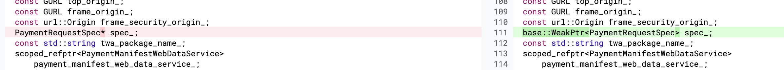
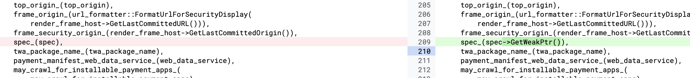

    ### Root Case

```
PaymentAppServiceBridge::PaymentAppServiceBridge(
    size_t number_of_factories,
    content::RenderFrameHost* render_frame_host,
    const GURL& top_origin,
    PaymentRequestSpec* spec,
    const std::string& twa_package_name,
    scoped_refptr<PaymentManifestWebDataService> web_data_service,
    bool may_crawl_for_installable_payment_apps,
    CanMakePaymentCalculatedCallback can_make_payment_calculated_callback,
    PaymentAppCreatedCallback payment_app_created_callback,
    PaymentAppCreationErrorCallback payment_app_creation_error_callback,
    base::OnceClosure done_creating_payment_apps_callback)
    : number_of_pending_factories_(number_of_factories),
      web_contents_(
          content::WebContents::FromRenderFrameHost(render_frame_host)),
      render_frame_host_(render_frame_host),
      top_origin_(top_origin),
      frame_origin_(url_formatter::FormatUrlForSecurityDisplay(
          render_frame_host->GetLastCommittedURL())),
      frame_security_origin_(render_frame_host->GetLastCommittedOrigin()),
      spec_(spec),
      twa_package_name_(twa_package_name),
      payment_manifest_web_data_service_(web_data_service),
      may_crawl_for_installable_payment_apps_(
          may_crawl_for_installable_payment_apps),
      can_make_payment_calculated_callback_(
          std::move(can_make_payment_calculated_callback)),
      payment_app_created_callback_(std::move(payment_app_created_callback)),
      payment_app_creation_error_callback_(
          std::move(payment_app_creation_error_callback)),
      done_creating_payment_apps_callback_(
          std::move(done_creating_payment_apps_callback)) {}

PaymentAppServiceBridge::~PaymentAppServiceBridge() = default;

base::WeakPtr<PaymentAppServiceBridge> PaymentAppServiceBridge::GetWeakPtr() {
  return weak_ptr_factory_.GetWeakPtr();
}

content::WebContents* PaymentAppServiceBridge::GetWebContents() {
  return web_contents_;
}
const GURL& PaymentAppServiceBridge::GetTopOrigin() {
  return top_origin_;
}

const GURL& PaymentAppServiceBridge::GetFrameOrigin() {
  return frame_origin_;
}

const url::Origin& PaymentAppServiceBridge::GetFrameSecurityOrigin() {

```

在PaymentAppServiceBridge中存储了PaymentRequestSpec的原始指针spec，它将作为字段spec_。

```
void CreatePaymentApps(
      content::InstalledPaymentAppsFinder::PaymentApps apps,
      ServiceWorkerPaymentAppFinder::InstallablePaymentApps installable_apps,
      const std::string& error_message) {
    if (!delegate_ ) {
      FinishAndCleanup();
      return;
    }

    ........

    auto app = std::make_unique<ServiceWorkerPaymentApp>(
        delegate_->GetWebContents(), delegate_->GetTopOrigin(),
        delegate_->GetFrameOrigin(), delegate_->GetSpec(),
        std::move(installed_app.second), delegate_->IsOffTheRecord(),
        show_processing_spinner);
```
在CreatePaymentApps函数中，spec_被传递给ServiceWorkerPaymentApp，此时spec_的生命周期属于ServiceWorkerPaymentAppFactory，而没有绑定到PaymentRequest。


spec_是属于PaymentRequestImpl的，但是PaymentRequestImpl在mojo发生连接错误断开时，会调用closeUIAndDestroyNativeObjects进行析构，这样的话就意味着我们可以通过控制renderer端来使得PaymentRequestImpl在我们想的时间被析构，然后此时的ServiceWorkerPaymentApp中的spec被使用时就会导致uaf


补丁：
https://chromium-review.googlesource.com/c/chromium/src/+/2422432



这里将spec修改为了一个弱指针，这样的话PaymentRequestImpl被析构时，spec也同样会失效，这样就避免了uaf的产生。