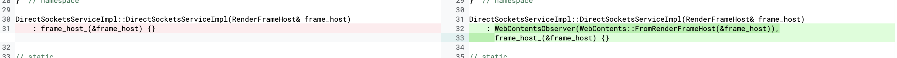

https://bugs.chromium.org/p/chromium/issues/detail?id=1122917

### Root case

``` c++
DirectSocketsServiceImpl::DirectSocketsServiceImpl(RenderFrameHost& frame_host)
    : frame_host_(&frame_host) {}
```
在DirectSocketsServiceImpl中保存了RenderFrameHost的实际指针。

``` c++
// static
void DirectSocketsServiceImpl::CreateForFrame(
    RenderFrameHost* render_frame_host,
    mojo::PendingReceiver<blink::mojom::DirectSocketsService> receiver) {
  DCHECK_CURRENTLY_ON(BrowserThread::UI);
  mojo::MakeSelfOwnedReceiver(
      std::make_unique<DirectSocketsServiceImpl>(*render_frame_host),
      std::move(receiver));
}
```

在CreateForFrame函数中通过MakeSelfOwnedReceiver函数来创建一个self-owned的receiver，这个算是老朋友了DirectSocketsServiceImpl没有继承自WebObserver等来观察renderframehost的生命周期，这就导致了他的生命周期可以长过renderframehost。

可以通过free iframe来释放掉对应的render_frame_host，而此时DirectSocketsServiceImpl依旧存在。（poc依旧是之前的阻塞器写法）

删除掉renderframehost后，可以在GetNetworkContext()中使用失效的frame_host_指针

```
network::mojom::NetworkContext* DirectSocketsServiceImpl::GetNetworkContext() {
  return frame_host_->GetStoragePartition()->GetNetworkContext();
}
```

GetNetworkContext()可以通过OpenTcpSocket和OpenUdpSocket调用
```
void DirectSocketsServiceImpl::OpenTcpSocket(
    blink::mojom::DirectSocketOptionsPtr options,
    OpenTcpSocketCallback callback) {
  if (!options) {
    mojo::ReportBadMessage("Invalid request to open socket");
    return;
  }
  net::Error result = EnsurePermission(*options);

  // TODO(crbug.com/1119681): Collect metrics for usage and permission checks

  if (result == net::OK) {
    // TODO(crbug.com/905818): GetNetworkContext()->CreateTCPConnectedSocket
    GetNetworkContext();                                                        // <--- invoke 
    NOTIMPLEMENTED();
  }

  std::move(callback).Run(result);
}

void DirectSocketsServiceImpl::OpenUdpSocket(
    blink::mojom::DirectSocketOptionsPtr options,
    OpenUdpSocketCallback callback) {
  if (!options) {
    mojo::ReportBadMessage("Invalid request to open socket");
    return;
  }
  net::Error result = EnsurePermission(*options);

  // TODO(crbug.com/1119681): Collect metrics for usage and permission checks

  if (result == net::OK) {
    // TODO(crbug.com/1119620): GetNetworkContext()->CreateUDPSocket
    GetNetworkContext();                                                        // <--- invoke
    NOTIMPLEMENTED();
  }

  std::move(callback).Run(result);
}
```


#### patch

改为了常规形式，通过将Impl继承自WebObserver等来观察renderframehost的生命周期，当renderframehost析构的时候会通知Impl做出正确的处理。
