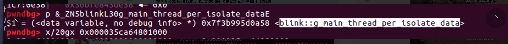
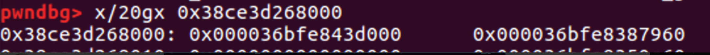
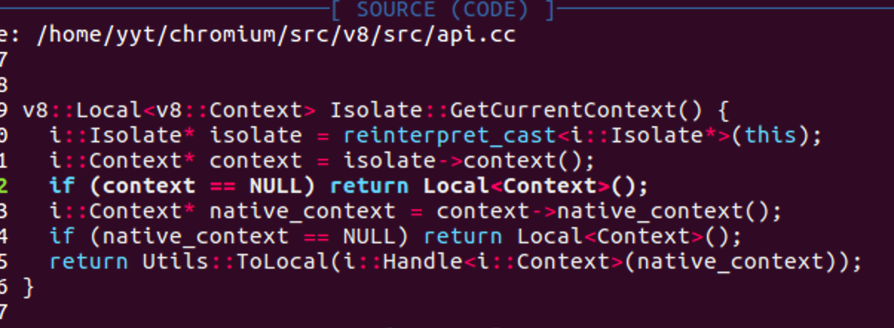

简单记录一下自己在写isolate利用时的心路历程：（我太难了）

这里以cve-2017-15401为例：

### 整体梳理

###### 利用isolate getshell的情形：

- 一般在在v8 6.7版本之前，我们是可以通过修改jsfunction的jit代码来达到向rwx段写入shellocde的目的。
- 在v8 6.7版本之后，jsfunction的jit代码段不再可写，所以我们将目标转向了wasm，二者的思路是一样的只不过是换了一个找rwx的目标。
- 但是上述二者的利用都需要具备leak object地址的能力。

今天要描述的isolate方法就是用来应对无法leak出object地址的情况，他的利用方法如下：
- 1、获得isolate的地址（有两种方法：一、通过leak partitionalloc metadata中的数据来获得。二、利用OOB 在ArrayBuffer的context中获取。）
- 2、通过isolate、context、globalobject、v8 heap、CodeSpace之间的关系依次获取上述地址。
- 在codespace的allocinfo中获取rwx段地址
- 计算出上步获得的rwx地址与jit code段的偏移，覆盖jit调用函数达到getshell。

###### 下面先简单介绍一下上面提到的isolate等等都是什么：

参考资料：https://yjhjstz.gitbooks.io/deep-into-node/content/chapter2/chapter2-0.html

#### Isolate

一个 Isolate 是一个独立的虚拟机。对应一个或多个线程。但同一时刻 只能被一个线程进入。所有的 Isolate 彼此之间是完全隔离的, 它们不能够有任何共享的资源。如果不显式创建 Isolate, 会自动创建一个默认的 Isolate。

一个v8的运行实例对应了一个Isolate，所有运行时的信息都不能采用全局的方式，而是放置在Isolate里，不同的Isolate于是就可以对应不同的运行环境了。

这里借用一个图：


#### Context

从概念上讲，这个上下文环境也可以理解为运行环境。在执行 javascript 脚本的时候，总要有一些环境变量或者全局函数。 我们如果要在自己的 c++ 代码中嵌入 v8 引擎，自然希望提供一些 c++ 编写的函数或者模块，让其他用户从脚本中直接调用，这样才会体现出 javascript 的强大。 我们可以用 c++ 编写全局函数或者类，让其他人通过 javascript 进行调用，这样，就无形中扩展了 javascript 的功能。

Context 可以嵌套，即当前函数有一个 Context，调用其它函数时如果又有一个 Context，则在被调用的函数中 javascript 是以最近的 Context 为准的，当退出这个函数时，又恢复到了原来的 Context。

我们可以往不同的 Context 里 “导入” 不同的全局变量及函数，互不影响。据说设计 Context 的最初目的是为了让浏览器在解析 HTML 的 iframe 时，让每个 iframe 都有独立的 javascript 执行环境，即一个 iframe 对应一个 Context。


#### v8 heap

为了配合垃圾回收，v8将动态内存（堆）分为了以下部分：

- new space: 用来放新建立的对象
- old pointer space: 用来放”旧的”指针
- old data space: 用来放”旧的“数据
- large object space: 用来放占用比较大的对象
- code space: 用来放jit编译的代码
- cell space, property cell space, map space: 对我们来说暂时不重要

#### JIT

v8是一个js的引擎，js是一门动态语言，动态语言相对静态语言来说，由于类型信息的缺失，导致优化非常困难。另外，js是一种“解释性”语言，对于解释性语言来说，解释器的效率就是他运行的效率。所以，为了提高运行效率，v8采用了jit compile的机制，也就是即时编译。

在运行过程中，首先v8会经过一次简单的即时编译，生成字节码，这里使用的jit编译器叫做“基准编译器”(baseline compiler)，这个时候的编译优化相对较少，目的是快速的启动。之后在运行过程当中，当一段代码运行次数足够多，就会触发其他的更优化的编译器，直接编译到二进制代码，后面这个优化后的编译器叫做”TurboFan”。为了实现编译到二进制代码还能够运行，很自然的导致jit代码拥有rwx权限，所以从攻击角度来说，这里就是我们的攻击目标：通过修改jit编译之后的代码，执行shellcode。


### exploite

##### 1、获取isolate

- 通过泄漏freelisthead地址我们可以得到superpage和metadata的地址。
- 在metadata首地址处存储了array_buffer_allocator，他和blink::g_main_thread_per_isolate_data的偏移是固定的，我们可以通过gdb找到blink::g_main_thread_per_isolate_data的地址：


在g_main_thread_per_isolate_data首地址处存储了isolate_data

isolate_data的首地址处存储的值就是Isloate的值。



##### 2、获取context：

我们在api.cc中找到了这么一个函数，他同时包含了context和native_context，我们在该函数处下一个断点，之后通过汇编去查看偏移：




如上图所示我们找到了context位于isolate的+0x1860处，native_context位于context的+0x27处。

##### 3、获取globalobject

依旧是同样的套路我们在global_object处下断，之后通过汇编查看偏移：


可以看到globalobject位于native_context的+0x1f处

##### 4、获取v8 heap

由global获取memorychunk：
memory_chunk = global.and(mku64((1 << 19) - 1).not());


因为memory_chunk结构体比较简单，heap的偏移可以直接从源码算出，如图所示0x38处（注意结构体会对齐）。

##### 5、获取codespace

这个偏移我是断在了frames.cc如下图处：

这里有个点需要注意，虽然从汇编代码看到的的偏移是+0xdf8，但是我们要注意此时heap的基地址是0xcf1c1785000,但是memory_chunk中指向的是heap+0x20处，所以在写exp的时候要注意调整偏移为0xdd8。


memory_chunk中指向的heap：


##### 6、获取allocation_info

还是上面找codespace那个位置下断可以一起找到allocation_info：


如上图所示top和limit的偏移为codespace+0x258、codespace+0x260，结合下面的allocation_info结构体，可以得到他的偏移为codespace+0x250

```
class AllocationInfo {
 public:
  
  ........................
  
 private:
  // The original top address when the allocation info was initialized.
  Address original_top_;
  // Current allocation top.
  Address top_;
  // Current allocation limit.
  Address limit_;
};
```

##### 7、获取rwx以及fsfunction的code段

allocation_info的original_top_也就是首地址处存储了rwx的最高地址也可以理解为limit，我们之后获取rwx可以通过limit-size来获取rwx，这里可以通过%DebugPrint（我用不了，理论上的方法）找到jit的code地址，应该和他同处一个rwx段，计算偏移即可得到jit的code段，之后就可以写入shellcode了


### 最后的最后记录一下我在遇到%DebugPrintf无法使用时的解决办法：

最开始我在v8/src/object.cc中的void JSArrayBuffer::Setup函数处打log，查看了一下arraybuffer初始化时的backing_store的偏移，发现在刚初始化是bk是正常的，于是我在bk处下了一个内存断点，发现后面无法使用%DebugPrintf是因为之后会出发垃圾回收（一直没太搞明白为何会触发）。

开始就一直通过JSArrayBuffer::Setup来找bk，但是后来不幸的事件又增加了，jsfunction也无法用%DebugPrintf，而且原因同上，于是我找了一个新办法：

我大致看了眼代码，发现%DebugPrintf是通过下面的函数实现的，也就是我们可以通过在这个函数下断点，之后模拟%DebugPrintf来进行exp的编写：
void JSObject::JSObjectShortPrint(StringStream* accumulator)

这就是解决%DebugPrintf的一个历程，太搞心态了。。。。。


### 演示时间：

