# frida从入门到放弃


主要分为两部分：frida基础和frida hook fuzz尝试

## Frida基础

### 环境
- 不说了，翻墙 pip即可

### 工具

- fride
  - 类似python等脚本解释器的REPL

- frida-ps
  - 列出可附加的进程/app列表

- frida-trace
  - 根据 glob 匹配符号并⾃自动⽣生成 hook 代码框架 修改 \_\_handlers__ 中的脚本后会⾃自动重新载⼊入   

- frida-ls-devices
  - 列出可用的设备

- frida-kill
  - 杀进程

- frida-discover
  - 记录一段时间内各线程调用的函数和符号名

### 基本框架

```
import frida
def on_message(message, data):
    print("[%s] => %s" % (message, data))
session = frida.attach('xxx')
script = session.create_script('some js code here')
script.on('message', on_message)
script.load()
sys.stdin.read()
session.deatch()
```     
- 在这段代码中，开始的部分定义了一个python函数-on_message，其功能是将参数输出到控制台，这两个参数是python回调接口需要的。

- 第5行是调用python的接口Session.create_script，其功能是根据字符串创建一个script对象，其参数便是js脚本代码。
- 第六行script.on(‘message’ , on_message)则是将这段脚本和自己自定义的on_message联系在了一起，之后通过下面的script.load来执行js脚本。

### python api

- \_init_.py里面有一些全局接口
  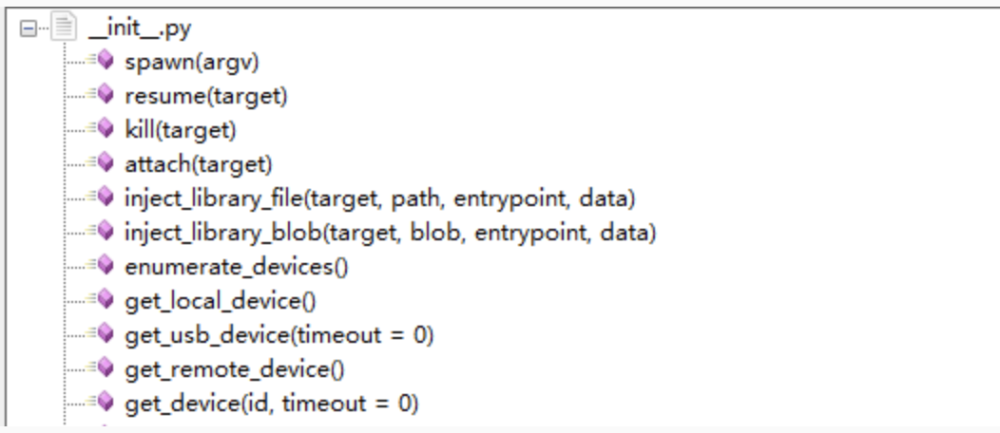
  
- core.py里面则储存了其他接口
  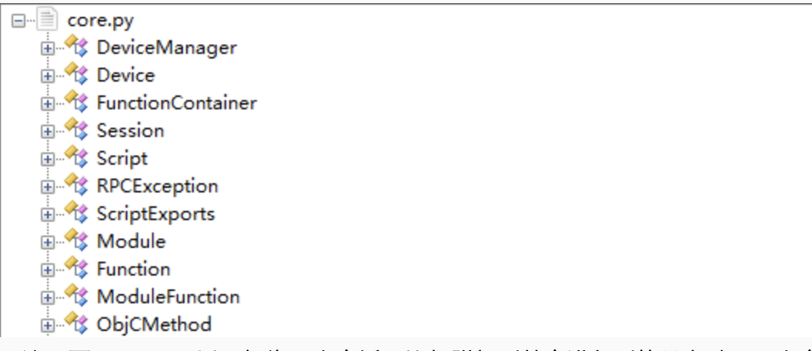
  
##### 设备api

- 获取设备

```
all_devices = frida.enumerate_devices()
local = frida.get_local_device()
usb = frida.get_usb_device()
remote = frida.get_device_manger().add_remote_device(ip)
```

- 设备事件处理

```
device_manger = frida.get_device_manger()
device_manger.on('changed', on_changed)  #listen
device_manger.off('changed', on_changed)  #remove listener
```

- 监听设备拔插

```
device_manger.on('add', on_changed)
device_manger.on('changed', on_changed)
device_manger.on('remove', on_removed)
```

- 进程管理

```
pid = device.spawn('com.apple.mobilesafari')
device.resume(pid)
device.kill(pid)
```

- APP信息

```
device.enumerate_applications()
```

##### spawn
spawn和attach的区别：
- spawn启动新的实例
    - 可指定启动参数
    - 支持在进程初始化之前做一些操作
    - ios上如果已经app运行（包括后台休眠），会导致失败。

- attach附加到现有进程
    - 可能会错过hook时机

spawn参数
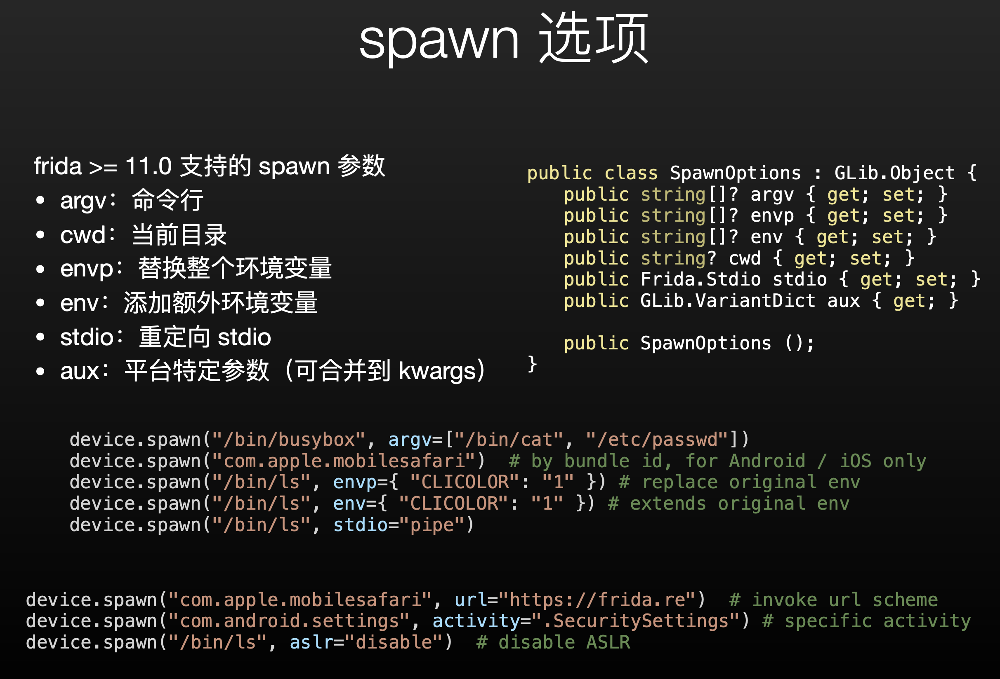

##### Session
Session可以理解为一次会话，比如附加到某个进程就算是启动了一次会话。

Session对象方法
 
 - on/off：添加/删除事件监听回调
 
 - detached事件：会话断开（进程终止等）
 - create_script：从js代码创建Script对象
 - compile_script/create_script_from_bytes：将js编译为字节码，然后创建Script
 - enable_debugger/disable_debugger：启用/禁用外部调试器
 - enable_jit：切换到支持JIT的v8脚本引擎（不支持ios）
 - enable_child_gating/disable_spawn_gating：启用/禁用子进程收集。

 
 
### js api
 
 看雪有中文翻译感觉还不错，在这里贴一下：
 一：https://zhuanlan.kanxue.com/article-342.htm
 二：https://zhuanlan.kanxue.com/article-414.htm
 三：https://zhuanlan.kanxue.com/article-4277.htm
 
### 示例学习

##### 事件和异常处理

- 脚本使⽤用 send 和 recv 与 python 绑定进⾏双向通信

- recv 返回的对象提供 wait ⽅方法，可阻塞等待 python 端返回
- 在 js 的回调中产⽣生的异常，会⽣生成⼀一个 type: “error” 的消息
- 除了了消息之外，python 还可调⽤用 js 导出的 rpc.exports 对象中的⽅方法。通 过返回 Promise 对象来⽀支持异步任务(详⻅见后续章节*)
- rpc 接⼝口产⽣生的异常会直接抛出到 python，⽽而不不是交给 on(‘message’) 的 回调函数

```
# -*- coding: utf-8 -*-
from __future__ import print_function

import frida
import os


def user_input():
    prompt = 'please input something: '
    try:
        return raw_input(prompt)
    except:
        return input(prompt)


# attach to python interpreter process itself :)
session = frida.attach(os.getpid())
script = session.create_script("""\
'use strict';
rpc.exports = {
  hello: function () {
    return 'Hello';
  },
  failPlease: function () {
    // this exception may crash python
    throw new Error('failed to call rpc method');
  },
  wait: function() {
    return new Promise(function(resolve, reject) {
      setTimeout(function() {
        resolve('wait for me')
      }, 200)
    })
  }
};
// send a log to client
console.warn("alert");
// send JSON message and binary payload to client
send({
  topic: "greet",
  format: "json"
}, new Buffer("hello, world"));
setTimeout(function() {
  // this exception will only emit an event
  throw new Error('other exception');
}, 100);
setImmediate(function() {
  recv('input', function(msg) {
    console.log('>>> you have just input', msg.payload);
  }).wait();
});
""")

def on_message(msg, payload):
    print('msg', msg, payload)

    if msg.get('payload') and msg.get('payload').get('topic') == 'greet':
      script.post({ 'type': 'input', 'payload': user_input() })

def on_console_log(level, text):
    print('console.' + level + ':', text)

script.on('message', on_message)
script.set_log_handler(on_console_log)
script.load()
api = script.exports
print("api.hello() =>", api.hello())

try:
    api.fail_please()
except frida.core.RPCException as e:
    print('rpc error', e)

print('api.wait() =>', api.wait())
```
刚入门看不太明白，在下面补充一点基础知识：

- JavaScript 异步编程（这里简单提一下，下面会细说）
    - 以上述脚本中的代码为例：
        
        ```
        setTimeout(function() {
            throw new Error('other exception');
        }, 100);
        ```
    - setTimeout函数，他的第一个参数是一个回调函数，第二个参数是毫秒数，这个函数执行之后会产生一个子线程，子线程会等待0.1秒（参数2），然后执行回调函数。
    - setImmediate 该方法用来把一些需要长时间运行的操作放在一个回调函数里,在完成后面的其他语句后,就立刻执行这个回调函数。
    - Promise对象：https://www.runoob.com/js/js-promise.html

- 主控端和目标进程的交互（message）
    - Js脚本提供了向主控端发送数据的接口—send和从主控端接收数据的接口—recv，而在主控端是通过python脚本的回调来接收数据，并使用python提供的接口post来向目标进程发送数据。这里的数据需要是可以序列化成json字符串的。

- 用到的一些js api
    -  console.warn(line)：向标准输入输出界面写入 line 字符串。
    -  rpc.exports: 可以在你的程序中导出一些 RPC-Style API函数，Key指定导出的名称，Value指定导出的函数，函数可以直接返回一个值，也可以是异步方式以 Promise 的方式返回，也就是上面代码所展示的那样：
        ```
        rpc.exports = {
            hello: function () {
                return 'Hello';
            },
            failPlease: function () {
                // this exception may crash python
                throw new Error('failed to call rpc method');
            },
            wait: function() {
                return new Promise(function(resolve, reject) {
                    setTimeout(function() {
                        resolve('wait for me')
                    }, 200)
                })
            }
        };
        ```
   
    - 对于Python主控端可以使用下面这样的脚本使用导出的函数：
        
        ```
        api = script.exports
        print("api.hello() =>", api.hello())

        try:
            api.fail_please()
        except frida.core.RPCException as e:
            print('rpc error', e)

        print('api.wait() =>', api.wait())

        ```
        
### js 进阶

#### frida的javascript引擎

- 由于 iOS 的 JIT 限制，以及嵌⼊入式设备的内存压⼒力力，新版将默认脚在 Android 等⽀支持 v8 的平台上仍然可以使⽤用 enable-jit 选项切换回 v8Duktape ⽐比 v8 缺失了了⾮非常多 ECMAScript 6 特性，如箭头表达式、 let 关键字 http://wiki.duktape.org/PostEs5Features.html ，我们下面去看一下这些变化。

###### 箭头函数

- ECMAScript 6 引⼊入的书写匿匿名函数的特性需要启⽤用 JIT，或 frida-compile 转译才可在 frida 中使⽤比 function 表达式简洁。适合编写逻辑较短的回调函数语义并⾮非完全等价。箭头函数中的 this 指向⽗父作⽤用域中的上下⽂文;⽽而 function可以通过 Function.prototype.bind的方法指定上下⽂，以下两⾏行行代码等价 ：

    ```
    Process.enumerateModulesSync().filter(function(module){return module.path.startsWith('/Applications')})
    
    Process.enumerateMoudlesSync().filter(moudle => moudle.path.startWith('/Applications'))
    ```
    
###### generator 函数
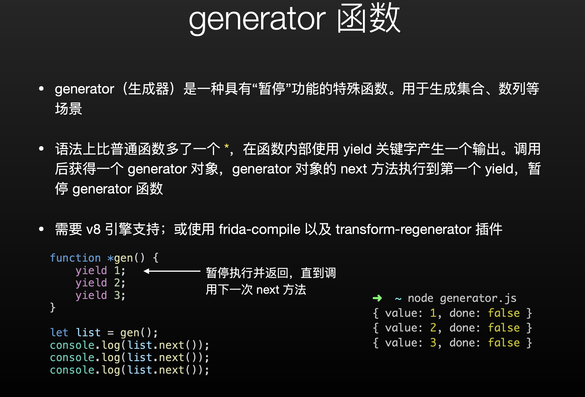
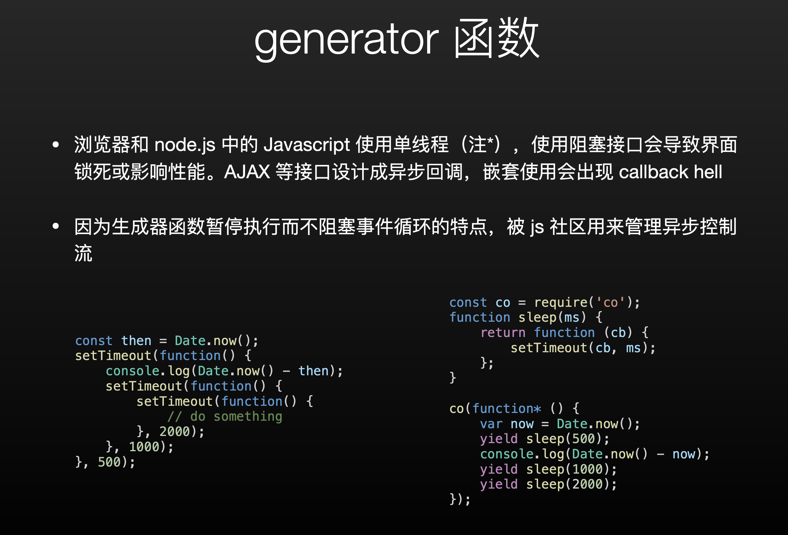


###### async / await

- 调⽤用⼀一个 async 函数会返回⼀一个 Promise 对象。当这个 async 函数 返回⼀一个值时，Promise 的 resolve ⽅法会负责传递这个值;
- 当 async 函数抛出异常时，Promise 的 reject ⽅方法也会传递这个异常值

```
async function name([param[, param[, ... param]]]) { statements }
```

- async 函数中可能会有 await 表达式，这会使 async 函数暂停执 ⾏行行，等待表达式中的 Promise 解析完成后继续执⾏行行 async 函数并返 回解决结果
- await 关键字仅仅在 async function中有效。如果在 async function 函数体外使⽤用 await ，会得到⼀一个语法错误(SyntaxError)

    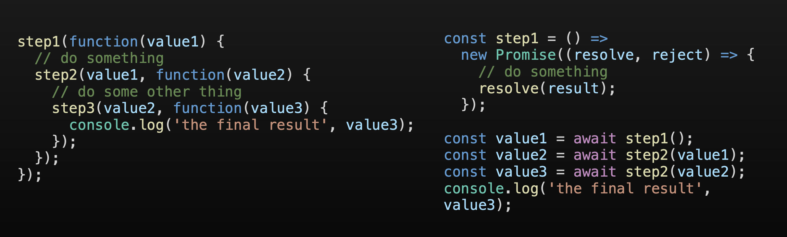
    

###### Promise
- Promise 对象是⼀一个代理理对象(代理理⼀一个值)，被代理理的值在 Promise 对象创建时可 能是未知的。它允许你为异步操作的成功和失败分别绑定相应的处理理⽅方法 (handlers)。 这让异步⽅方法可以像同步⽅方法那样返回值，但并不不是⽴立即返回最终执 ⾏行行结果，⽽而是⼀一个能代表未来出现的结果的 promise 对象

- 一个 Promise有以下几种状态:
    - pending: 初始状态，既不不是成功，也不不是失败状态。 
    
    - fulfilled: 意味着操作成功完成。
    - rejected: 意味着操作失败。

- 因为 Promise.prototype.then 和 Promise.prototype.catch 方法返回promise 对象， 所以它们可以被链式调⽤用。    
    
    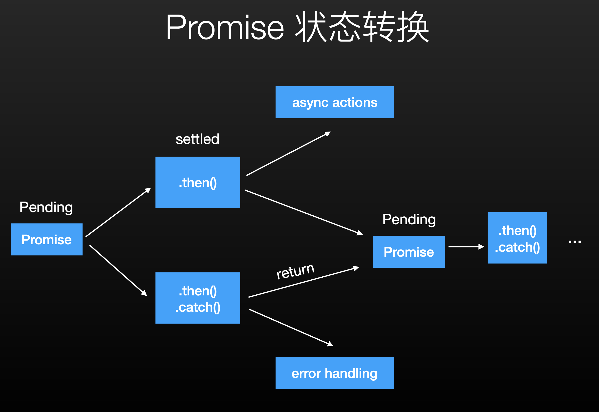
    
- 使用 Promise
    - Duktape 原⽣生⽀支持 Promise 规范，但 async/await 或 yield 需要使用 frida-compile 转译回 ES5
    
    - rpc.exports 接⼝支持 Promise，可实现等待回调函数返回。示例代码:可以参考上面的那个例子。
    - frida 内置与 I/O 相关的接口 Socket, SocketListener, IOStream 及其子类均使⽤ Promise 的接口。结合 Stream 可实现⼤文件传输等异步任务


### 与本地代码交互

###### 指针和内存管理

- NativePointer:表示 C 中的指针，可指向任意(包括⾮非法)地址

- frida 数据指针、函数指针、代码⻚页地址、基地址等均依赖 NativePointer 接⼝口
- 提供 add, sub, and, or, xor 和算术左右移运算。详⻅见⽂文档(上面有中文链接)
- 可⽤Memory.alloc /.allocUtf8String / .allocAnsiString / .allocUtf16String 分配
- Memory.alloc* 分配的内存，在变量量作⽤用域之外会被释放

```
function alloc() {
    return Memory.alloc(8);
}
const p = alloc(); // dangling pointer
```
- frida内存管理和libc的对比：
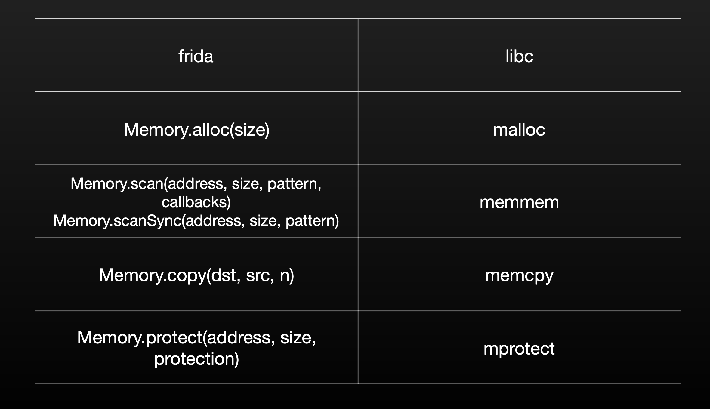

###### 内存读写

- Memory.write* 和 Memory.read* 系列列函数，类型包括 S8, U8, S16,U16, S32, U32, Short, UShort, Int, UInt, Float, Double其中 Memory.{read,write}{S64,U64,Long,ULong} 由于 Javascript 引擎默认对数字精度有限制(不支持 64 位⼤整数)，需要使⽤frida 的 Int64 或 UInt64 ⼤整数类。（详见文档）

- 字符串函数
    - 分配 Memory.alloc{Ansi,Utf8,Utf16}String
    
    - 读取 Memory.read{C,Utf8,Utf16,Ansi}String(注意 CString 只提供了 read)
    - 覆写 Memory.write{Ansi,Utf8,Utf16}String
    - 读写一块连续内存:Memory.{read,write}ByteArray

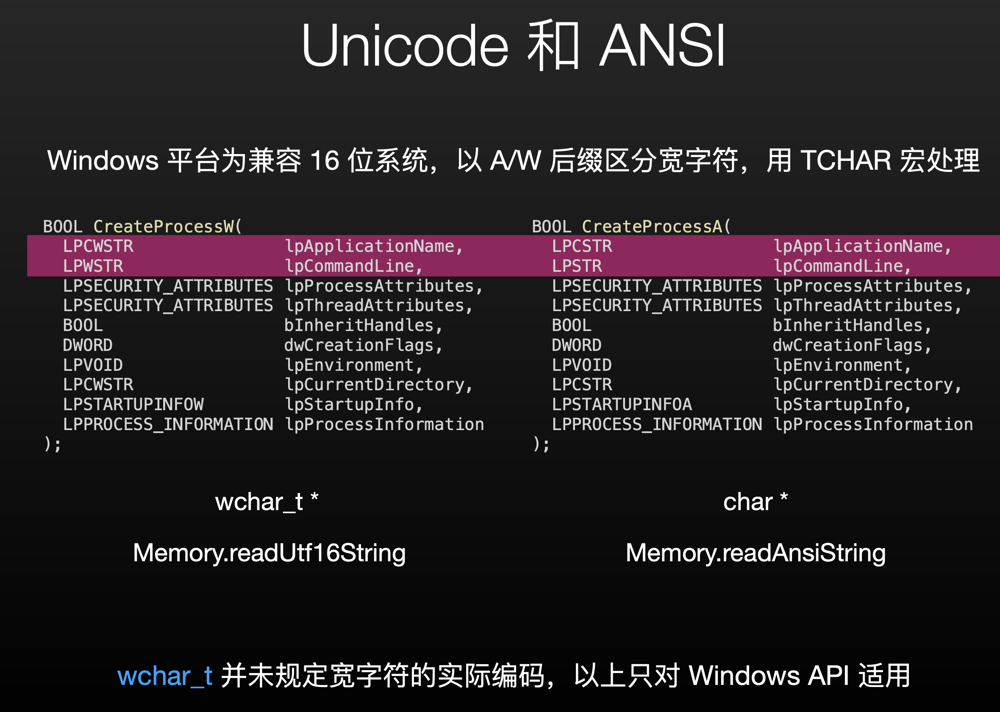
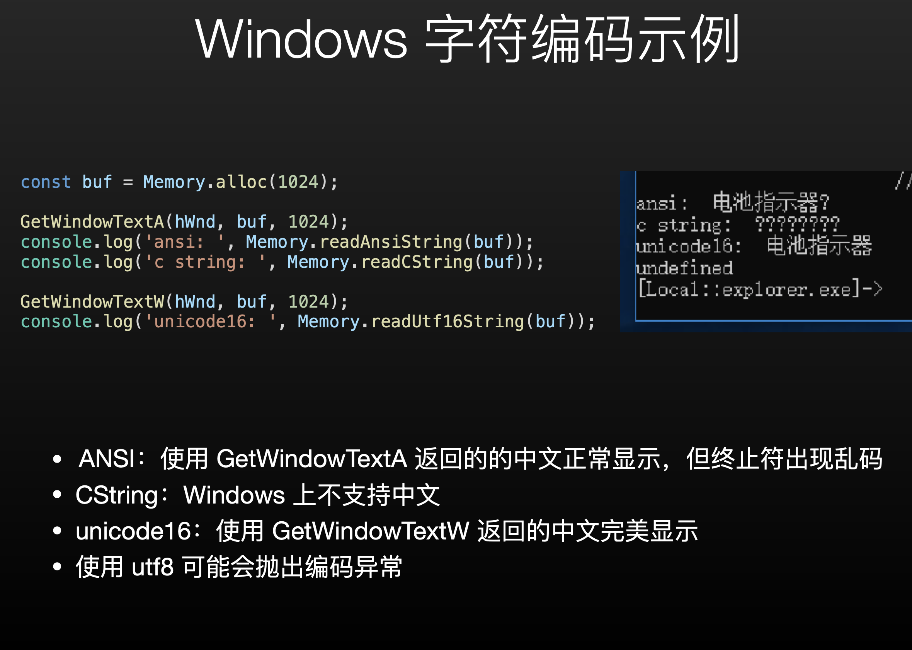

###### 分析模块和内存页

- process对象
    - 进程基本信息：
        - Process.arch: CPU架构信息，取值范围：ia32、x64、arm、arm64
        
        - Process.platform: 平台信息，取值范围：windows、darwin、linux、qnx
        - Process.pageSize: 虚拟内存页面大小，主要用来辅助增加脚本可移植性
        - Process.pointerSize: 指针占用的内存大小，主要用来辅助增加脚本可移植性
        - Process.codeSigningPolicy: 取值范围是 optional 或者 required，后者表示Frida会尽力避免修改内存中的代码，并且不会执行未签名的代码。默认值是 optional，除非是在 Gadget 模式下通过配置文件来使用 required，通过这个属性可以确定 Interceptor API 是否有限制，确定代码修改或者执行未签名代码是否安全。
        - Process.isDebuggerAttached(): 确定当前是否有调试器附加
        - Process.getCurrentThreadId(): 获取当前线程ID
    - 枚举模块、线程、内存页：
        - Process.enumerateThreads(callbacks): 枚举所有线程，每次枚举到一个线程就执行回调类callbacks： 
            - onMatch: function(thread): 当枚举到一个线程的时候，就调用这个函数，其中thread参数包含 ： 
                - id，线程ID
               
                - state，线程状态，取值范围是 running, stopped, waiting, uninterruptible, halted
                - context, 包含 pc, sp，分别代表 EIP/RIP/PC 和 ESP/RSP/SP，分别对应于 ia32/x64/arm平台，其他的寄存器也都有，比如 eax, rax, r0, x0 等。
                - 函数可以直接返回 stop 来停止枚举。
            - onComplete: function(): 当所有的线程枚举都完成的时候调用。
        
        - Process.enumerateModules(callbacks): 枚举已经加载的模块，枚举到模块之后调用回调对象： 
            - onMatch: function(module): 枚举到一个模块的时候调用，module对象包含如下字段： 
                - name, 模块名
                
                - base, 基地址
                - size，模块大小
                - path，模块路径
                - 函数可以返回 stop 来停止枚举 。
            - onComplete: function(): 当所有的模块枚举完成的时候调用。

        - Process.eumerateRanges(protection | specifier, callbacks): 枚举指定 protection 类型的内存块，以指定形式的字符串给出：rwx，而 rw- 表示最少是可读可写，也可以用分类符，里面包含 protection 这个Key，取值就是前面提到的rwx，还有一个 coalesce 这个Key，表示是否要把位置相邻并且属性相同的内存块合并给出结果，枚举过程中回调 callbacks 对象： 
            - onMatch: function(range): 每次枚举到一个内存块都回调回来，其中Range对象包含如下属性： 
                - base：基地址
                
                - size：内存块大小
                - protection：保护属性
                - file：（如果有的话）内存映射文件： 
                    - path，文件路径 
                    - offset，文件内偏移
                - 如果要停止枚举过程，直接返回 stop 即可
            
            - onComplete: function(): 所有内存块枚举完成之后会回调
    
    - 查找模块：
        - Process.findModuleByAddress(address),Process.getModuleByAddress(address), Process.findModuleByName(name),Process.getModuleByName(name): 根据地址或者名称来查找模块，如果找不到这样的模块，find开头的函数返回 null，get开头的函数会抛出异常。
    
    - 查找内存页
        - Process.findRangeByAddress(address),Process.getRangeByAddress(address): 返回一个内存块对象， 如果在这个address找不到内存块对象，那么 findRangeByAddress() 返回 null 而 getRangeByAddress 则抛出异常。

- Module对象：    
    - frida内置了导入导出表的解析
        - Module.emuerateImports(name, callbacks): 枚举模块 name 的导入表，枚举到一个导入项的时候回调callbacks, callbacks包含下面2个回调： 
            - onMatch: function(imp): 枚举到一个导入项到时候会被调用，imp包含如下的字段： 
                - type，导入项的类型， 取值范围是 function或者variable
                
                - name，导入项的名称 
                - module，模块名称
                - address，导入项的绝对地址
                - 以上所有的属性字段，只有 name 字段是一定会有，剩余的其他字段不能保证都有，底层会尽量保证每个字段都能给出数据，但是不能保证一定能拿到数据，onMatch函数可以返回字符串 stop 表示要停止枚举。
            
            - onComplete: function(): 当所有的导入表项都枚举完成的时候会回调
        
        - Module.emuerateExports =(name, callbacks): 枚举指定模块 name 的导出表项，结果用 callbacks 进行回调： 
            - onMatch: function(exp): 其中 exp 代表枚举到的一个导出项，包含如下几个字段： 
                - type，导出项类型，取值范围是 function或者variable
                
                - name，导出项名称
                - address，导出项的绝对地址，NativePointer
                - 函数返回stop 的时候表示停止枚举过程
            
            - onComplete: function(): 枚举完成回调 
        
        - Module.enumerateSymbols(name, callbacks): 枚举指定模块中包含的符号，枚举结果通过回调进行通知： 
            - onMatch: function(sym): 其中 sym 包含下面几个字段： 
                - isGlobal，布尔值，表示符号是否全局可见
                
                - type，符号的类型，取值是下面其中一种： 
                    - unknown
                    
                    - undefined
                    - absolute
                    - section
                    - prebound-undefined
                    - indirect
                
                - section，如果这个字段不为空的话，那这个字段包含下面几个属性： 
                    - id，小节序号，段名，节名
                    
                    - protection，保护属性类型， rwx这样的属性
                
                - name，符号名称
                - address，符号的绝对地址，NativePointer
                
                - 这个函数返回 stop 的时候，表示要结束枚举过程
            
            - onComplete: function(): 枚举完成回调 
        
        - 确保模块初始化完成：
            - Module.ensureInitialized
            
            - 例例:等待 Objective C 运⾏行行时初始化:Module.ensureInitialized(‘Foundation’)
    
    - enumerate*Sync
        - frida 的 API 设计中存在⼤量具有 Sync 后缀的 api：
            - 带 Sync 后缀:直接返回整个列列表
            - 不带 Sync 后缀:传⼊一个 js 对象，其 onMatch 和 onComplete 属性分别对应迭代的每一个元素的回调，和结束时的回调函数。 与 IO 不不同的是这些回调函数都是同步执行的。onMatch 函数可以返回 ‘stop’ 字符串终⽌迭代。
    
    - 解析函数地址
        - 导入/导出的符号：
            - Module.findExportByName(module | null, exp): 返回模块module 内的导出项的绝对地址，如果模块名不确定，第一个参数传入null，这种情况下会增大查找开销，尽量不要使用。
            - Module.enumerateExports(Sync) / enumerateImports(Sync)
        - 内嵌调试符号(未strip)
            - DebugSymbol.getFunctionByName(“”) 
            - DebugSymbol.findFunctionsNamed()
            - DebugSymbol.findFunctionsMatching()
        
        - ⽆符号:使⽤用模块基地址 + 偏移:
            - Process.findModuleByName(‘Calculator’).base.add(0x3200)

- ffi bridge
    - NativeFunction：本地代码函数接口
        - 由于缺少类型信息，需要指定函数指针、原型，包括参数列列表和返回值 类型，调⽤用约定(可选) new NativeFunction(address, returnType, argTypes[, abi])
        - 简单提一下，下面的实战部分有详细的补充。
    
    - SystemFunction：类似NativeFunction，但返回地址，根据平台不同可访问errno（POSIX）或者lastError来获得错误信息。函数返回值在value属性。
    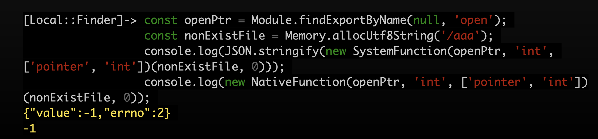
    
    - NativeCallback
        - 返回一个NativePointer，指向一个包装好的javascript回调。本地代码执行到NativePointer的指针时将调用到Javascript。
         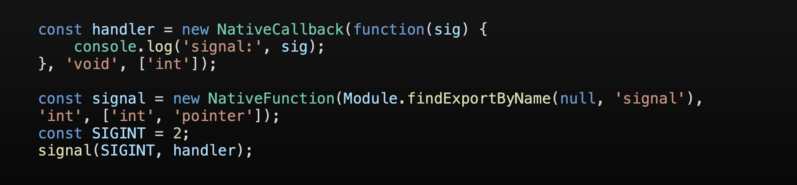
    
    - 参数和返回值： 
        - 返回值和参数列列表⽀支持的类型:void, pointer, int, uint, long, ulong, char, uchar, float, double, int8, uint8, int16, uint16, int32, uint32, int64。
        
        - 不同的头⽂文件、编译环境可能有会 typedef 别名 结构体参数(注意不不是结构体指针)可使⽤用嵌套的 Array 表示。
        - 可变参数可⽤用 ‘...’ 处理。
    
    - 可变参数
      
    
    - 结构体参数
        - C 语⾔言⽀支持直接将结构体作为参数传递，调⽤用时即使调⽤用约定为使⽤用寄存 器器传参，结构体也将整个由堆栈传递
        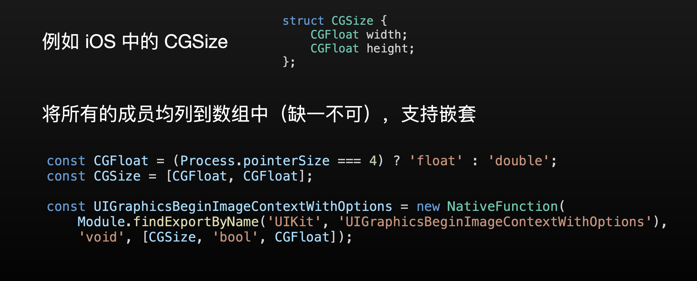
     
    - ABI
        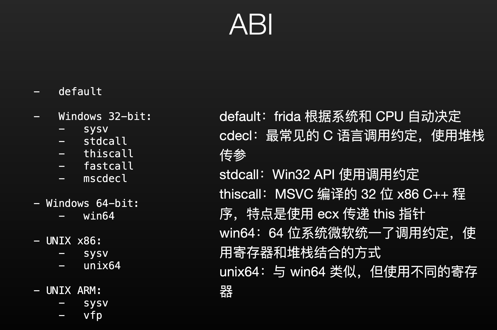    

- Interceptor对象（简单记录一下，后面实战有补充）：
    - Interceptor 对指定函数指针设置 inline hook
   
    - Interceptor.attach:在进⼊入函数之前，函数返回后分别调⽤用 onEnter 和 onLeave 回调函数。可以对函数参数和返回值进⾏行行修 改，但原始函数⼀一定会被调⽤用
    - Interceptor.replace:整个替换掉函数调⽤用。可以在 js callback ⾥里里继续调⽤用原始函数，也可以完全屏蔽掉
    - 在 js 回调中可以访问 this 获得上下⽂文信息，如常⽤用寄存器器、thread id 等;此外 this 还可以在 onEnter 保存额外的参数传递给 onLeave
    - args: 以下标函数参数，默认均为 NativePointer。可⽤用 toInt32 转换为整型
    
    ```
    Interceptor.attach(Module.findExportByName("libc.so", "open"),{    
        onEnter: function (args) {
            console.log(Memory.readUtf8String(args[0]));
            this.fd = args[1].toInt32(); },
        onLeave: function (retval) {
            if (retval.toInt32() == -1) {
            /* do something with this.fd */
            } }
        });
    ```
    - retVal.replace 可整个替换掉返回值

- 调用堆栈：
    - 获取寄存器器上下⽂：
        - 插桩回调中访问 this.context
        - Process.enumerateThreadsSync() 枚举线程信息
    
    - Thread.backtrace 可根据上下⽂文回溯出调⽤用堆栈的地址
    - DebugSymbol.fromAddress 进⼀一步对地址符号化
    
    ```
    console.log('\tBacktrace:\n\t' + Thread.backtrace(this.context,Backtracer.ACCURATE).map(DebugSymbol.fromAddress).join('\n\t'));
    ```
        
    

    
## win frida 初试

https://codeengn.com/challenges/  上的basic rce l03

这是个很简单的入门 creak me，输入密码，比较正确的话就可破解，我们主要用它来练习一下frida的使用

我们拿ida打开，可以看到他加载了MSVBVM50.dll,谷歌一下可以知道他是一个Visual Basic的程序。
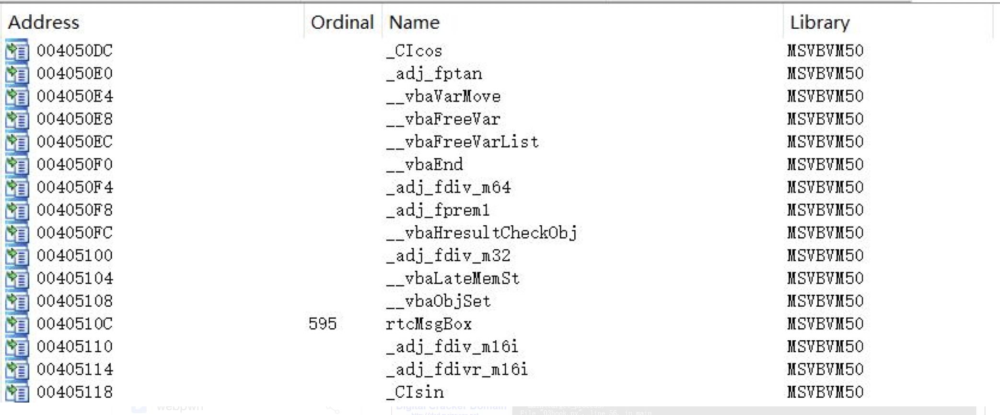
逻辑很简单，随便逆向一下就可以找到关键比较。
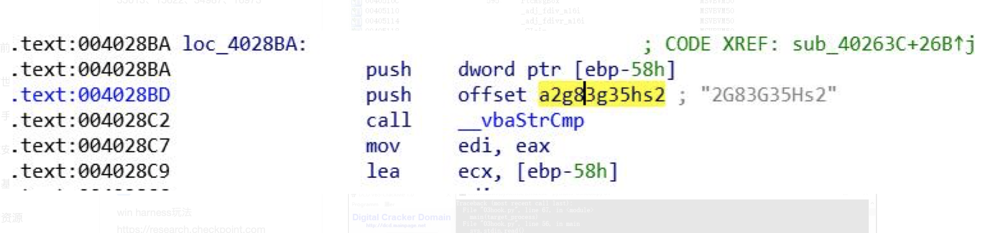
可以看到__vbaStrCmp函数有两个参数，第一个为我们的输入，第二个是正确的答案，我们知道比较函数比较成功时rax保存的返回值为0，所以我们只要用frida hook比较函数将其返回值修改为0即可成功。

```
from __future__ import print_function
import frida
import sys

def on_message(message,data):
	print("[%s] => %s" % (message,data))
	
def main(target_process):
	session = frida.attach(target_process)
	script = session.create_script(""" 
	var baseAddr = Module.findBaseAddress('MSVBVM50.dll');
	console.log('MSVBVM50.dll baseAddr : ' + baseAddr);
	
	"use strict";
	const __vbaStrCmp = Module.findExportByName("MSVBVM50.dll","__vbaStrCmp");
	Interceptor.attach(__vbaStrCmp,{
		onEnter: function (args){
			console.log('*****************************************************');
			console.log('[+] Called	__vbaStrCmp !! [' + __vbaStrCmp + ']');
			console.log('[+] args[0] = [' + args[0] + '] ')
			dumpAddr('args[0]' , args[0], 0x16);
			console.log('[+] args[1] = [' + args[1] + ']');
			dumpAddr('args[1]', args[1], 0x16);
		},
		
		onLeave: function (args){
			console.log('*****************************************************');
			this.context.eax = 0x0;
			console.log('Context information:');
			console.log('Context  : ' + JSON.stringify(this.context));	
			console.log('*****************************************************');
		}
	});
	
	function dumpAddr(info, addr, size){
		if (addr.isNull())
			return;
		console.log('Data dump' + info + ':');
		var buf = Memory.readByteArray(addr, size);
		console.log(hexdump(buf, { offset: 0, length: size, header: true, ansi: false}));
		}
		
	function resolveAddress(addr){
		  var idaBase = ptr('0x400000');
		  var offest = ptr(addr).sub(idaBase);
		  var result = baseAddr.add(offest);
		  console.log('[+] New addr = ' + result);
		  return result;
		}
	
	""")
	
	script.on('message', on_message)
	script.load()
	print("[!] Ctrl+D on UNIX, Ctrl+Z on Windows/cmd.exe to detach from instrumented program.\n\n")
	sys.stdin.read()
	session.detach()

if __name__ == '__main__':
	if len(sys.argv) != 2:
		print("This script needs pid or proc name :")
		sys.exit(1)
	try:
		target_process = int(sys.argv[1])
	except ValueError:
		target_process = sys.argv[1]
	main(target_process)
```
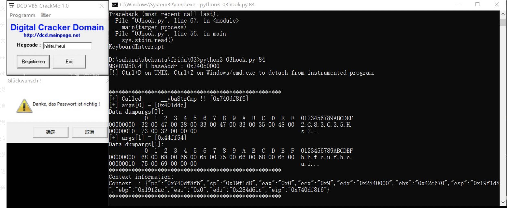

简单记录几个关键点：

```
const __vbaStrCmp = Module.findExportByName("MSVBVM50.dll","__vbaStrCmp");
    Interceptor.attach(__vbaStrCmp,{
        onEnter: function (args){
            console.log('*****************************************************');
            console.log('[+] Called __vbaStrCmp !! [' + __vbaStrCmp + ']');
            console.log('[+] args[0] = [' + args[0] + '] ')
            dumpAddr('args[0]' , args[0], 0x16);
            console.log('[+] args[1] = [' + args[1] + ']');
            dumpAddr('args[1]', args[1], 0x16);
        },
```
在__vbaStrCmp函数处进行调用拦截，设置了被拦截之前的回调函数，将该函数的两个参数输出出来，因为他的这两个函数为指针，所以我们定义了一个dumpAddr函数来输出指针内容。

```
	function dumpAddr(info, addr, size){
		if (addr.isNull())
			return;
		console.log('Data dump' + info + ':');
		var buf = Memory.readByteArray(addr, size);
		console.log(hexdump(buf, { offset: 0, length: size, header: true, ansi: false}));
		}
```

接下来是被拦截之后的回调：
```
onLeave: function (args){
			console.log('*****************************************************');
			this.context.eax = 0x0;
			console.log('Context information:');
			console.log('Context  : ' + JSON.stringify(this.context));	
			console.log('*****************************************************');
		}
	});
```

这里补充一下Interceptor.attach(target, callbacks)提供的this对象，它有一些比较有用的属性：
- returnAddress: 返回NativePointer类型的 address 对象

- context: 包含 pc，sp，以及相关寄存器比如 eax, ebx等，可以在回调函数中直接修改
- errno: （UNIX）当前线程的错误值
- lastError: (Windows) 当前线程的错误值
- threadId: 操作系统线程Id
- depth: 函数调用层次深度

我们这里就利用了context属性，将它的eax修改为0，从而绕过比较。

下面提供了另一种获取函数地址的方法
```
    var baseAddr = Module.findBaseAddress('MSVBVM50.dll');
    
    function resolveAddress(addr){
          var idaBase = ptr('0x400000');
          var offest = ptr(addr).sub(idaBase);
          var result = baseAddr.add(offest);
          console.log('[+] New addr = ' + result);
          return result;
        }
```
这是将通过ida找到的函数地址作为参数，通过减去ida基址计算出偏移，之后再和dll的加载地址相加得到实际的函数地址。

我们上面用到的方法是利用findExportByName（“ dll name”，“ function name”）找到函数地址。


## frida hook fuzz尝试

##### 我们先从简单的小目标练起

上一段c代码：
```
#include <stdio>
#include <stdlib.h>
#include <string.h>

void pwn(char *b)
{
    char buffer[1337];
    strcpy(buffer,b);
}

int main(int argc, char **argv)
{
    pwn(argv[1]);
}
```

这个漏洞很明显，在pwn函数中存在溢出，我们下面来通过frida的方式来进行一个模糊测试：

```
#!/usr/bin/python3

import frida
import time
import sys

def on_message(message, data):
    print(message)

js = """

// Maximum payload size
var size = 2000;

// Argument for the fuzzed function
var arg = Memory.alloc(size);
var fuzzData = [0x41];

var pwnAddr = null;
var pwnHandle = null;

// Find the vulnerable function in the target process
// and get a handle to it
Module.enumerateSymbolsSync("test").forEach(function(symbol){
        switch (symbol.name) {
            case "pwn":
                pwnAddr = symbol.address;
                // use the function prototype to create a handle
                pwnHandle = new NativeFunction(ptr(pwnAddr), "void", ["pointer"]);
                console.log("[i] pwn() is at " + pwnAddr);
        }
    });

if (pwnAddr == null) {
    die("Error finding symbol");
}

// Fuzz the function in-process
Interceptor.attach(ptr(pwnAddr), {
    // Begin fuzzing as soon as the application calls the function itself
    onEnter: function(args) {
        console.log("[i] Original argument: " + args[0].readCString());

        console.log("[*] Fuzzing now");
        while(fuzzData.length < size) {
            fuzzData.push(0x41);
            Memory.writeByteArray(arg, fuzzData);
            try {
                pwnHandle(arg);
            }
            catch(e) {
                console.log("[!] Crash found for size " + fuzzData.length);
                break;
            }
        }
    },
});
"""

# Spawn the target process
pid = frida.spawn(["./test", "hello"])
session = frida.attach(pid)

# Inject dem scriptz
script = session.create_script(js)
script.on('message', on_message)
script.load()

# Continue execution of the target
frida.resume(pid)

sys.stdin.read()
```


- 大致思路：我们通过spawn的方式使Frida生成进程，将我们写好的js代码注入其中，在恢复执行等待它调用pwn()函数，js为他定义了一个hook，我们的hook主要作用是不断增加输入来进行fuzz，直到目标崩溃。

补充一点关键知识：

###### Interceptor
- Interceptor.attach(target, callbacks): 在target指定的位置进行函数调用拦截，target是一个NativePointer参数，用来指定你想要拦截的函数的地址，有一点需要注意，在32位ARM机型上，ARM函数地址末位一定是0（2字节对齐），Thumb函数地址末位一定1（单字节对齐），如果使用的函数地址是用Frida API获取的话， 那么API内部会自动处理这个细节（比如：Module.findExportByName()）。其中callbacks参数是一个对象，大致结构如下： 
    - onEnter: function(args): 被拦截函数调用之前回调，其中原始函数的参数使用args数组（NativePointer对象数组）来表示，可以在这里修改函数的调用参数。
    
    - onLeave: function(retval): 被拦截函数调用之后回调，其中retval表示原始函数的返回值，retval是从NativePointer继承来的，是对原始返回值的一个封装，你可以使用retval.replace(1337)调用来修改返回值的内容。需要注意的一点是，retval对象只在 onLeave函数作用域范围内有效，因此如果你要保存这个对象以备后续使用的话，一定要使用深拷贝来保存对象，比如：ptr(retval.toString())。
    
    
- 补充：在这里我们使用了下面的方式来获取函数地址

    ```
    Module.enumerateSymbolsSync("test").forEach(function(symbol){
        switch (symbol.name) {
            case "pwn":
                pwnAddr = symbol.address;
                // use the function prototype to create a handle
                lolHandle = new NativeFunction(ptr(pwnAddr), "void", ["pointer"]);
                console.log("[i] lol() is at " + pwnAddr);
        }
    });

    ```
    - 因为这是我们的练习所以可以这样获取。

- 在实际的hook中，我们可以通过Process.enumerateModulesSync()和Module.enumerateSymbols("<module>")获取目标函数的地址，也可以Module.findExportByName(module | null, exp)或者是获取偏移地址Module.findBaseAddress(module)+偏移。（https://blog.csdn.net/friendan/article/details/105048853）

###### NativeFunction

- new NativeFunction(address, returnType, argTypes[abi]): 在address（使用NativePointer的格式）地址上创建一个NativeFunction对象来进行函数调用，returnType 指定函数返回类型，argTypes 指定函数的参数类型，如果不是系统默认类型，也可以选择性的指定 abi 参数，对于可变类型的函数，在固定参数之后使用 “…” 来表示。

- 类和结构体
    - 在函数调用的过程中，类和结构体是按值传递的，传递的方式是使用一个数组来分别指定类和结构体的各个字段，理论上为了和需要的数组对应起来，这个数组是可以支持无限嵌套的，结构体和类构造完成之后，使用NativePointer的形式返回的，因此也可以传递给Interceptor.attach() 调用。
    - 需要注意的点是， 传递的数组一定要和需要的参数结构体严格吻合，比如一个函数的参数是一个3个整形的结构体，那参数传递的时候一定要是 [‘int’, ‘int’, ‘int’]，对于一个拥有虚函数的类来说，调用的时候，第一个参数一定是虚表指针。
    - Supported Types
        - void
        - pointer
        - int
        - uint
        - long
        - ulong
        - char
        - uchar
        - float
        - double
        - int8
        - uint8
        - int16
        - uint16
        - int32
        - uint32
        - int64
        - uint64
    - Supported ABIs
        - default
    - Windows 32-bit: 
        - sysv
        - stdcall
        - thiscall
        - fastcall
        - mscdecl
    - Windows 64-bit: 
        - win64
    - UNIX x86: 
        - sysv
        - unix64
    - UNIX ARM: 
        - sysv
        - vfp

###### 思路小结

```
Module.enumerateSymbolsSync("test").forEach(function(symbol){
        switch (symbol.name) {
            case "pwn":
                pwnAddr = symbol.address;
                // use the function prototype to create a handle
                pwnHandle = new NativeFunction(ptr(pwnAddr), "void", ["pointer"]);
                console.log("[i] pwn() is at " + pwnAddr);
        }
    });

if (pwnAddr == null) {
    die("Error finding symbol");
}

// Fuzz the function in-process
Interceptor.attach(ptr(pwnAddr), {
    // Begin fuzzing as soon as the application calls the function itself
    onEnter: function(args) {
        console.log("[i] Original argument: " + args[0].readCString());

        console.log("[*] Fuzzing now");
        while(fuzzData.length < size) {
            fuzzData.push(0x41);
            Memory.writeByteArray(arg, fuzzData);
            try {
                pwnHandle(arg);
            }
            catch(e) {
                console.log("[!] Crash found for size " + fuzzData.length);
                break;
            }
        }
    },
});
"""

```

我们首先遍历模块找到目标函数地址，然后通过new NativeFunction()注册一个Handle，在Interceptor.attach函数拦截之前，设置一个回调函数，让他不断的调用我们注册的Handle，在此期间不断的改变参数，来达到fuzz的目的。等到crash的时候输出长度。


### fizzer

- 它是一个基于Frida仪器框架的覆盖率指导的黑匣子模糊器（https://github.com/demantz/frizzer）

简单记录一下它的用法（以他提供的测试用例来记录一下）

```
#include<sys/socket.h> 
#include<netinet/in.h> 
#include<stdio.h> 
#include<string.h>
#include<stdlib.h> 
#include <arpa/inet.h>
#include <unistd.h>


void crash() {
    char a[10];
    strcpy(a, "AAAAAAAAAAAAAAAAAAAAAAAAAAAAAAAAAAAAAAAAAAAAAAAAAAAAAAAAAAAAAAAAAAAAAAAAAAAAA");
    return;
}

void handleClient(char* buf) {
    if(buf[0]%5 == 1) {
        puts("--A--");
        if(buf[1]%6 == 1) {
            puts("--AB--");
            if(buf[2]%7 == 1) {
                puts("--ABC--");
                if(buf[3]%8 == 1) {
                    puts("--ABCD--");
                    if(buf[4]%9 == 1) {
                        puts("--ABCDE--");
                        if(buf[5]%10 == 1) {
                            puts("--ABCDEF--");
                            if(buf[6]%11 == 1) {
                                puts("--CRASH--");
                                crash();
                            }
                        }
                    }
                }
            }
        }
    }
    printf("%s",buf); 
}

int main(int argc, char** argv) {
    char buf[100]; 
    socklen_t len; 
    int sock_desc,temp_sock_desc; 
    struct sockaddr_in client,server; 
    memset(&client,0,sizeof(client)); 
    memset(&server,0,sizeof(server)); 
    sock_desc = socket(AF_INET,SOCK_STREAM,0); 
    server.sin_family = AF_INET; server.sin_addr.s_addr = inet_addr("127.0.0.1"); 
    server.sin_port = htons(7777); 
    bind(sock_desc,(struct sockaddr*)&server,sizeof(server)); 
    listen(sock_desc,20); len = sizeof(client);
    while(1)
    {
        temp_sock_desc = -1;
        memset(buf, 0, 100);
        temp_sock_desc = accept(sock_desc,(struct sockaddr*)&client,&len);
        recv(temp_sock_desc,buf,100,0);
        handleClient(buf);
        close(temp_sock_desc); 
    }
    close(sock_desc); 
    return 0; 

}
```

这是一个简单的服务器应用程序，可以通过TCP接受用户输入。

makefile：

```  
all:
	gcc -no-pie -o test test.c -Wstringop-overflow=0

clean:
	rm test
	rm -rf ./tmprojdir
```

启动fuzz的脚本：

```
#!/bin/bash

# Expected bahavior:
# Find new paths at seeds: 5, 111, 135, ...
# Find crash at seed 17??
# Average Speed: between 40 and 50

#make
#./test > /dev/null &

rm -rf tmpprojdir

# old:
# frizzer --project tmpprojdir --indir indir -f 0x401256 -t 7777 -p test -m /home/dennis/tools/frida-fuzzer/tests/simple_binary/test

# new:
frizzer init tmpprojdir
cat > tmpprojdir/config <<EOF
[fuzzer]
log_level       = 3 # debug
debug_mode      = false
[target]
process_name    = "test"
function        = 0x401256
host            = "localhost"
port            = 7777
remote_frida    = false
fuzz_in_process = false
modules = [
        "/home/dennis/tools/frida-fuzzer/tests/simple_binary/test",
    ]
EOF

frizzer add -p tmpprojdir indir
frizzer fuzz -p tmpprojdir
```

可以看到fizzer需要handleClient（也就是被测试函数的地址），调试找到他的地址。

注意：默认的fizzer会改变目标函数的第一个参数（这里是char *），如果有其他想fuzz的内容，可能需要自己修改fizzer。

该目录indir将填充包含语料库数据的文件。这些数据是进行所有模糊测试的基础。
