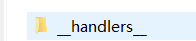
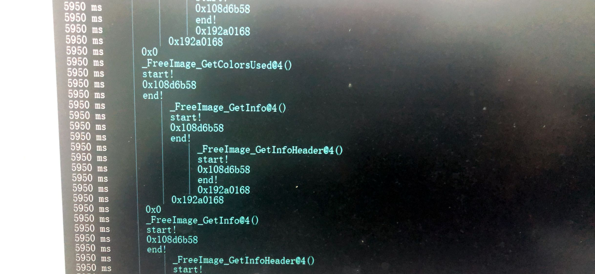

魔改frida-trace来实现默认把参数和返回值都打印出来。

frida-trace作用：这个工具可以帮你hook所有模块，但是它只是打印你路过的函数名，这里做一些简单的尝试来让他变得更加好用

关键代码：tracer.py

```
def _create_stub_native_handler(self, target, decorate):
       
 
 ........
       
        
        return """\
/*
 * Auto-generated by Frida. Please modify to match the signature of %(display_name)s.
 * This stub is currently auto-generated from manpages when available.
 *
 * For full API reference, see: https://frida.re/docs/javascript-api/
 */

{
  /**
   * Called synchronously when about to call %(display_name)s.
   *
   * @this {object} - Object allowing you to store state for use in onLeave.
   * @param {function} log - Call this function with a string to be presented to the user.
   * @param {array} args - Function arguments represented as an array of NativePointer objects.
   * For example use args[0].readUtf8String() if the first argument is a pointer to a C string encoded as UTF-8.
   * It is also possible to modify arguments by assigning a NativePointer object to an element of this array.
   * @param {object} state - Object allowing you to keep state across function calls.
   * Only one JavaScript function will execute at a time, so do not worry about race-conditions.
   * However, do not use this to store function arguments across onEnter/onLeave, but instead
   * use "this" which is an object for keeping state local to an invocation.
   */
  onEnter: function (log, args, state) {
    log(%(log_str)s);
	log('start!');
	for(i=0 ; args[i] != NULL ; i++)
		log(args[i].readUtf8String());
	log('end!');
  },

  /**
   * Called synchronously when about to return from %(display_name)s.
   *
   * See onEnter for details.
   *
   * @this {object} - Object allowing you to access state stored in onEnter.
   * @param {function} log - Call this function with a string to be presented to the user.
   * @param {NativePointer} retval - Return value represented as a NativePointer object.
   * @param {object} state - Object allowing you to keep state across function calls.
   */
  onLeave: function (log, retval, state) {
	log(retval);
  }
}
""" % {"display_name": target.display_name, "log_str": log_str}

```

frida-trace会为每个函数生成一个处理程序，只要在这些处理程序的onLeave和onEnter方法里加log就可以实现在打印函数时输出自己想要的东西。

对应的处理程序可以在下面查看：



效果图：
