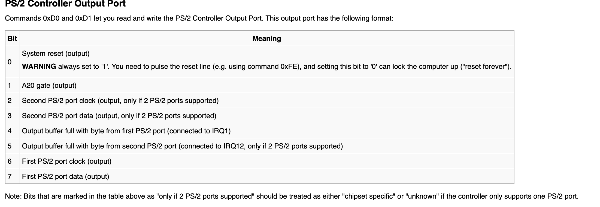
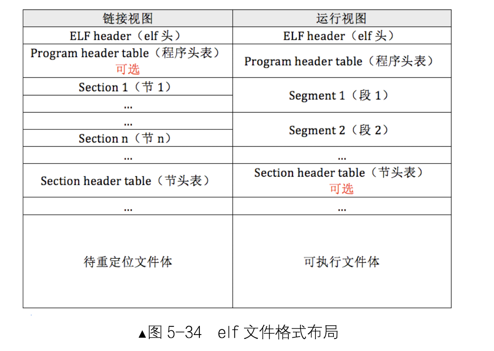

### 练习1

##### 问题一：
- 操作系统镜像文件ucore.img是如何一步一步生成的？(需要比较详细地解释Makefile中每一条相关命令和命令参数的含义，以及说明命令导致的结果)

- make V= 可以显示出make执行的命令
 
- 我们从上往下看，最下面将zero、bootblock和kernel写入了虚拟硬盘，下面是dd指令的参数：
    - dd：用指定大小的块拷贝一个文件，并在拷贝的同时进行指定的转换。 
    - if=文件名：输入文件名。
    - of=文件名：输出文件名。
    - count=blocks：仅拷贝blocks个块，块大小等于ibs指定的字节数。 
- 生成ucore.img：

    ```
    $(UCOREIMG): $(kernel) $(bootblock)
	$(V)dd if=/dev/zero of=$@ count=10000
	$(V)dd if=$(bootblock) of=$@ conv=notrunc
	$(V)dd if=$(kernel) of=$@ seek=1 conv=notrunc
    ```

- 生成bootblock

    ```
    $(bootblock): $(call toobj,$(bootfiles)) | $(call totarget,sign)
	@echo + ld $@
	$(V)$(LD) $(LDFLAGS) -N -e start -Ttext 0x7C00 $^ -o $(call toobj,bootblock)
	@$(OBJDUMP) -S $(call objfile,bootblock) > $(call asmfile,bootblock)
	@$(OBJDUMP) -t $(call objfile,bootblock) | $(SED) '1,/SYMBOL TABLE/d; s/ .* / /; /^$$/d' > $(call symfile,bootblock)
	@$(OBJCOPY) -S -O binary $(call objfile,bootblock) $(call outfile,bootblock)
	@$(call totarget,sign) $(call outfile,bootblock) $(bootblock)
    ```
    
- 生成kernel

    ```
    $(kernel): $(KOBJS)
	@echo + ld $@
	$(V)$(LD) $(LDFLAGS) -T tools/kernel.ld -o $@ $(KOBJS)
	@$(OBJDUMP) -S $@ > $(call asmfile,kernel)
	@$(OBJDUMP) -t $@ | $(SED) '1,/SYMBOL TABLE/d; s/ .* / /; /^$$/d' > $(call symfile,kernel)
    ```
    
##### 问题二:

- 一个被系统认为是符合规范的硬盘主引导扇区的特征是什么？
- 阅读/tools/sign.c

    ```
    char buf[512];
    memset(buf, 0, sizeof(buf));
    FILE *ifp = fopen(argv[1], "rb");
    int size = fread(buf, 1, st.st_size, ifp);
    if (size != st.st_size) {
        fprintf(stderr, "read '%s' error, size is %d.\n", argv[1], size);
        return -1;
    }
    fclose(ifp);
    buf[510] = 0x55;
    buf[511] = 0xAA;
    ```
- 可以看到主要有两个标准，一个是mbr的大小为0x512，另一个是必须由0x55AA结尾。

### 练习2
- 练习：
    - 从CPU加电后执行的第一条指令开始，单步跟踪BIOS的执行。
    
    - 在初始化位置0x7c00设置实地址断点,测试断点正常。
    - 从0x7c00开始跟踪代码运行,将单步跟踪反汇编得到的代码与bootasm.S和 bootblock.asm进行比较。
    - 自己找一个bootloader或内核中的代码位置，设置断点并进行测试。

- 断点信息：
    - file bin/kernel
    - target remote :1234
    - set architecture i8086
    - b *0x7c00
    - continue
    - x /2i $pc


- 与bootasm.S和 bootblock.asm进行比较可以发现基本一致。

### 练习3

- 请分析bootloader是如何完成从实模式进入保护模式的。
    - 需要了解：
    
    - 为何开启A20，以及如何开启A20
    - 如何初始化GDT表
    - 如何使能和进入保护模式

##### A20

- ucore和操作系统真象还原的实现方法是不同的，可以对照学习两种不同的开启A20的方法。

- ucore主要用到了PS/2 Controller，建议看源码的同时参考一下wiki：https://wiki.osdev.org/%228042%22_PS/2_Controller
- 开启A20：

```
    cli                                             # Disable interrupts
    cld                                             # String operations increment

    # Set up the important data segment registers (DS, ES, SS).
    xorw %ax, %ax                                   # Segment number zero
    movw %ax, %ds                                   # -> Data Segment
    movw %ax, %es                                   # -> Extra Segment
    movw %ax, %ss                                   # -> Stack Segment

    # Enable A20:
    #  For backwards compatibility with the earliest PCs, physical
    #  address line 20 is tied low, so that addresses higher than
    #  1MB wrap around to zero by default. This code undoes this.
seta20.1:
    inb $0x64, %al                                  # Wait for not busy(8042 input buffer empty).
    testb $0x2, %al
    jnz seta20.1

    movb $0xd1, %al                                 # 0xd1 -> port 0x64
    outb %al, $0x64                                 # 0xd1 means: write data to 8042's P2 port

seta20.2:
    inb $0x64, %al                                  # Wait for not busy(8042 input buffer empty).
    testb $0x2, %al
    jnz seta20.2

    movb $0xdf, %al                                 # 0xdf -> port 0x60
    outb %al, $0x60                                 # 0xdf = 11011111, means set
``` 
- cli关闭中断、cld设置地址从低到高。

- 由于段寄存器不能用立即数直接赋值，所以我们在初始化的时候要采用清零ax，再由ax给段寄存器赋值。
- seta20.1：0x64端口是一个State Register，他的第二位为INPUT_BUF_FULL(I_B_F): 输入缓冲器满置1，所以通过判断第二位可以知道他是否空闲。（不清楚就看wiki（滑稽 ），空闲之后向0x64写入0xd1指令（0xd1:准备写Output端口。随后通过60h端口写入的字节，会被放置在Output Port中。）
- seta20.2：同上先判断是否空闲，之后将0xdf（11011111）写入0x60，也就是写入了Output Port，通过wiki我们可以知道Output Port的第二位和A20是否开启有关，如下图，这样我们就开启了A20。
  
  
##### GDT

- 基础知识在之前写操作系统的时候就已经记录过了，这里就不细说了，着重来看代码
- 加载GDT是需要lgdt GDTR寄存器的，我们来看代码：

```
  lgdt gdtdesc
  
  
  gdt:
    SEG_NULLASM                                     # null seg
    SEG_ASM(STA_X|STA_R, 0x0, 0xffffffff)           # code seg for   bootloader and kernel
    SEG_ASM(STA_W, 0x0, 0xffffffff)                 # data seg for bootloader and kernel
    
 gdtdesc:
    .word 0x17                                      # sizeof(gdt) - 1
    .long gdt                                       # address gdt

```

- GDTR寄存器：低16字节段界限，高32字节位gdt的起始地址，这里定义了三个段描述符：第一个空、第二个code段、第三个data段。

##### 将cr0的PE位置1

```
    movl %cr0, %eax
    orl $CR0_PE_ON, %eax
    movl %eax, %cr0
```

##### 小结
综上所述：开启保护模式的条件有下面三个：
- 开启A20
- 加载GDT
- 将cr0的pe位置1

### 练习4

- 通过阅读bootmain.c，了解bootloader如何加载ELF文件。通过分析源代码和通过qemu来运行并调试bootloader&OS，

    - bootloader如何读取硬盘扇区的？
    - bootloader是如何加载ELF格式的OS？

    
##### 问题一：

- 等待磁盘准备好
- 发出读取扇区的命令
- 等待磁盘准备好
- 把磁盘扇区数据读到指定内存

```
static void
waitdisk(void) {
    while ((inb(0x1F7) & 0xC0) != 0x40)
        /* do nothing */;
}

static void
readsect(void *dst, uint32_t secno) {
    // wait for disk to be ready
    waitdisk();

    outb(0x1F2, 1);                         // count = 1
    outb(0x1F3, secno & 0xFF);
    outb(0x1F4, (secno >> 8) & 0xFF);
    outb(0x1F5, (secno >> 16) & 0xFF);
    outb(0x1F6, ((secno >> 24) & 0xF) | 0xE0);
    outb(0x1F7, 0x20);                      // cmd 0x20 - read sectors

    // wait for disk to be ready
    waitdisk();

    // read a sector
    insl(0x1F0, dst, SECTSIZE / 4);
}
```

- 首先先看waitdisk()函数，0x1F7-状态寄存器，第 6、7 位分别代表驱动器准备好/驱动器忙，利用and 0xc0取出第6、7位，之后与0x40(01000000)比较，若相等则代表驱动器准备好了。
- 0x1f2读取的扇区数、0x1f3～0x1f6（起始lba），0x1f7写入读命令。

##### 问题二：

- 首先来看一下elf的文件格式



- ELF header在文件开始处描述了整个文件的组织。ELF的文件头包含整个执行文件的控制结构，其定义在elf.h中：

```
struct elfhdr {
  uint magic;  // must equal ELF_MAGIC
  uchar elf[12];
  ushort type;
  ushort machine;
  uint version;
  uint entry;  // 程序入口的虚拟地址
  uint phoff;  // program header 表的位置偏移
  uint shoff;
  uint flags;
  ushort ehsize;
  ushort phentsize;
  ushort phnum; //program header表中的入口数目
  ushort shentsize;
  ushort shnum;
  ushort shstrndx;
};
```

- program header描述与程序执行直接相关的目标文件结构信息，用来在文件中定位各个段的映像，同时包含其他一些用来为程序创建进程映像所必需的信息。可执行文件的程序头部是一个program header结构的数组， 每个结构描述了一个段或者系统准备程序执行所必需的其它信息。目标文件的 “段” 包含一个或者多个 “节区”（section） ，也就是“段内容（Segment Contents）” 。程序头部仅对于可执行文件和共享目标文件有意义。可执行目标文件在ELF头部的e_phentsize和e_phnum成员中给出其自身程序头部的大小。程序头部的数据结构如下表所示：

```
struct proghdr {
  uint type;   // 段类型
  uint offset;  // 段相对文件头的偏移值
  uint va;     // 段的第一个字节将被放到内存中的虚拟地址
  uint pa;
  uint filesz;
  uint memsz;  // 段在内存映像中占用的字节数
  uint flags;
  uint align;
};
```

- 我们来看一下代码的实现：

```
void
bootmain(void) {
    // read the 1st page off disk
    readseg((uintptr_t)ELFHDR, SECTSIZE * 8, 0);

    // is this a valid ELF?
    if (ELFHDR->e_magic != ELF_MAGIC) {
        goto bad;
    }

    struct proghdr *ph, *eph;

    // load each program segment (ignores ph flags)
    ph = (struct proghdr *)((uintptr_t)ELFHDR + ELFHDR->e_phoff);
    eph = ph + ELFHDR->e_phnum;
    for (; ph < eph; ph ++) {
        readseg(ph->p_va & 0xFFFFFF, ph->p_memsz, ph->p_offset);
    }

    // call the entry point from the ELF header
    // note: does not return
    ((void (*)(void))(ELFHDR->e_entry & 0xFFFFFF))();

   .................
   
}
```

- 首先先通过比较magic_num来判断是否为合法的elf文件：

```
 readseg((uintptr_t)ELFHDR, SECTSIZE * 8, 0);

    // is this a valid ELF?
    if (ELFHDR->e_magic != ELF_MAGIC) {
        goto bad;
    }
```

- 通过elf_header中的phoff成员找到program header，再通过循环将各段从硬盘读出到虚拟内存。


### 练习五

- 我们需要在lab1中完成kdebug.c中函数print_stackframe的实现，可以通过函数print_stackframe来跟踪函数调用堆栈中记录的返回地址。在如果能够正确实现此函数，可在lab1中执行 “make qemu”后，在qemu模拟器中得到类似如下的输出：

  ```
  ……
ebp:0x00007b28 eip:0x00100992 args:0x00010094 0x00010094 0x00007b58 0x00100096
    kern/debug/kdebug.c:305: print_stackframe+22
ebp:0x00007b38 eip:0x00100c79 args:0x00000000 0x00000000 0x00000000 0x00007ba8
    kern/debug/kmonitor.c:125: mon_backtrace+10
ebp:0x00007b58 eip:0x00100096 args:0x00000000 0x00007b80 0xffff0000 0x00007b84
    kern/init/init.c:48: grade_backtrace2+33
ebp:0x00007b78 eip:0x001000bf args:0x00000000 0xffff0000 0x00007ba4 0x00000029
    kern/init/init.c:53: grade_backtrace1+38
ebp:0x00007b98 eip:0x001000dd args:0x00000000 0x00100000 0xffff0000 0x0000001d
    kern/init/init.c:58: grade_backtrace0+23
ebp:0x00007bb8 eip:0x00100102 args:0x0010353c 0x00103520 0x00001308 0x00000000
    kern/init/init.c:63: grade_backtrace+34
ebp:0x00007be8 eip:0x00100059 args:0x00000000 0x00000000 0x00000000 0x00007c53
    kern/init/init.c:28: kern_init+88
ebp:0x00007bf8 eip:0x00007d73 args:0xc031fcfa 0xc08ed88e 0x64e4d08e 0xfa7502a8
<unknow>: -- 0x00007d72 –
……
  ```
- 请完成实验，看看输出是否与上述显示大致一致，并解释最后一行各个数值的含义

##### 代码

```
void
print_stackframe(void) {
    uint32_t ebp = read_ebp();
    uint32_t eip = read_eip();

    int i, j;
    for (i = 0; ebp != 0 && i < STACKFRAME_DEPTH; i ++) {
        cprintf("ebp:0x%08x eip:0x%08x args:", ebp, eip);
        uint32_t *args = (uint32_t *)ebp + 2;
        for (j = 0; j < 4; j ++) {
            cprintf("0x%08x ", args[j]);
        }
        cprintf("\n");
        print_debuginfo(eip - 1);
        eip = ((uint32_t *)ebp)[1];
        ebp = ((uint32_t *)ebp)[0];
    }
}
```

##### 代码分析

```
+|  栈底方向        | 高位地址
 |    ...        |
 |    ...        |
 |  参数3        |
 |  参数2        |
 |  参数1        |
 |  返回地址      |
 |  上一层[ebp]    | <-------- [ebp]
 |  局部变量        |  低位地址
```
- 上图是简化版的栈结构，当前ebp寄存器指向的地址存储着上层的ebp，而ebp上方储存着返回地址，也就是接下来的eip，所以我们就可以通过下面的方式实现递归。

```
        eip = ((uint32_t *)ebp)[1];
        ebp = ((uint32_t *)ebp)[0];
```

- print_debuginfo(eip - 1);这里-1是因为eip指向的是下一条指令，所以要减一。

##### 结果：

```
ebp:0x00007b28 eip:0x00100a63 args:0x00010094 0x00010094 0x00007b58 0x00100092 
    kern/debug/kdebug.c:307: print_stackframe+21
ebp:0x00007b38 eip:0x00100d4d args:0x00000000 0x00000000 0x00000000 0x00007ba8 
    kern/debug/kmonitor.c:125: mon_backtrace+10
ebp:0x00007b58 eip:0x00100092 args:0x00000000 0x00007b80 0xffff0000 0x00007b84 
    kern/init/init.c:48: grade_backtrace2+33
ebp:0x00007b78 eip:0x001000bc args:0x00000000 0xffff0000 0x00007ba4 0x00000029 
    kern/init/init.c:53: grade_backtrace1+38
ebp:0x00007b98 eip:0x001000db args:0x00000000 0x00100000 0xffff0000 0x0000001d 
    kern/init/init.c:58: grade_backtrace0+23
ebp:0x00007bb8 eip:0x00100101 args:0x001032dc 0x001032c0 0x0000130a 0x00000000 
    kern/init/init.c:63: grade_backtrace+34
ebp:0x00007be8 eip:0x00100055 args:0x00000000 0x00000000 0x00000000 0x00007c4f 
    kern/init/init.c:28: kern_init+84
ebp:0x00007bf8 eip:0x00007d72 args:0xc031fcfa 0xc08ed88e 0x64e4d08e 0xfa7502a8 
    <unknow>: -- 0x00007d71 --
++ setup timer interrupts
```

- 最后一行ebp:0x00007bf8，是kern_init函数的栈顶地址，在obj/bootasm.asm文件中可以找到栈顶地址为0x00007c00，对照上面的简易图，我们就可以得知kern_init函数没有参数，这里指存储了ret和ebp。
- eip:0x00007d72 eip的值是kern_init函数的返回地址，也就是bootmain函数调用kern_init对应的指令的下一条指令的地址。
- args:0xc031fcfa 0xc08ed88e 0x64e4d08e 0xfa7502a8 一般来说，args存放的4个dword是对应4个输入参数的值。由于bootmain函数调用kern_init并没传递任何输入参数，并且栈顶的位置恰好在boot loader第一条指令存放的地址的上面，而args恰好是kern_int的ebp寄存器指向的栈顶往上第2~5个单元，因此args存放的就是boot loader指令的前16个字节。

### 练习6

```
1、中断描述符表（也可简称为保护模式下的中断向量表）中一个表项占多少字节？其中哪几位代表中断处理代码的入口？

2、请编程完善kern/trap/trap.c中对中断向量表进行初始化的函数idt_init。在idt_init函数中，依次对所有中断入口进行初始化。使用mmu.h中的SETGATE宏，填充idt数组内容。每个中断的入口由tools/vectors.c生成，使用trap.c中声明的vectors数组即可。

3、请编程完善trap.c中的中断处理函数trap，在对时钟中断进行处理的部分填写trap函数中处理时钟中断的部分，使操作系统每遇到100次时钟中断后，调用print_ticks子程序，向屏幕上打印一行文字”100 ticks”。

【注意】除了系统调用中断(T_SYSCALL)使用陷阱门描述符且权限为用户态权限以外，其它中断均使用特权级(DPL)为０的中断门描述符，权限为内核态权限；而ucore的应用程序处于特权级
３，需要采用｀int 0x80`指令操作（这种方式称为软中断，软件中断，Tra中断，在lab5会碰到）来发出系统调用请求，并要能实现从特权级３到特权级０的转换，所以系统调用中断(T_SYSCALL)所对应的中断门描述符中的特权级（DPL）需要设置为３。

要求完成问题2和问题3 提出的相关函数实现，提交改进后的源代码包（可以编译执行），并在实验报告中简要说明实现过程，并写出对问题1的回答。完成这问题2和3要求的部分代码后，运行整个系统，可以看到大约每1秒会输出一次”100 ticks”，而按下的键也会在屏幕上显示。
```


  
