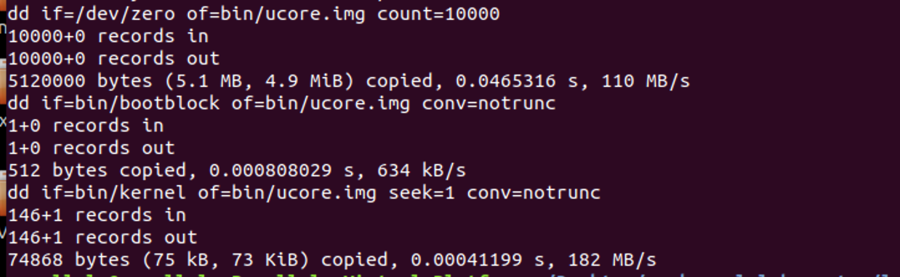
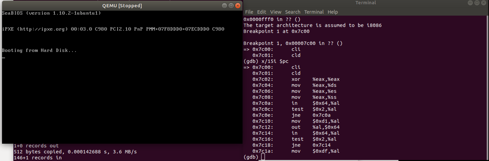

### 练习1

##### 问题一：
- 操作系统镜像文件ucore.img是如何一步一步生成的？(需要比较详细地解释Makefile中每一条相关命令和命令参数的含义，以及说明命令导致的结果)

- make V= 可以显示出make执行的命令
 
- 我们从上往下看，最下面将zero、bootblock和kernel写入了虚拟硬盘，下面是dd指令的参数：
    - dd：用指定大小的块拷贝一个文件，并在拷贝的同时进行指定的转换。 
    - if=文件名：输入文件名。
    - of=文件名：输出文件名。
    - count=blocks：仅拷贝blocks个块，块大小等于ibs指定的字节数。 
- 生成ucore.img：

    ```
    $(UCOREIMG): $(kernel) $(bootblock)
	$(V)dd if=/dev/zero of=$@ count=10000
	$(V)dd if=$(bootblock) of=$@ conv=notrunc
	$(V)dd if=$(kernel) of=$@ seek=1 conv=notrunc
    ```

- 生成bootblock

    ```
    $(bootblock): $(call toobj,$(bootfiles)) | $(call totarget,sign)
	@echo + ld $@
	$(V)$(LD) $(LDFLAGS) -N -e start -Ttext 0x7C00 $^ -o $(call toobj,bootblock)
	@$(OBJDUMP) -S $(call objfile,bootblock) > $(call asmfile,bootblock)
	@$(OBJDUMP) -t $(call objfile,bootblock) | $(SED) '1,/SYMBOL TABLE/d; s/ .* / /; /^$$/d' > $(call symfile,bootblock)
	@$(OBJCOPY) -S -O binary $(call objfile,bootblock) $(call outfile,bootblock)
	@$(call totarget,sign) $(call outfile,bootblock) $(bootblock)
    ```
    
- 生成kernel

    ```
    $(kernel): $(KOBJS)
	@echo + ld $@
	$(V)$(LD) $(LDFLAGS) -T tools/kernel.ld -o $@ $(KOBJS)
	@$(OBJDUMP) -S $@ > $(call asmfile,kernel)
	@$(OBJDUMP) -t $@ | $(SED) '1,/SYMBOL TABLE/d; s/ .* / /; /^$$/d' > $(call symfile,kernel)
    ```
    
##### 问题二:

- 一个被系统认为是符合规范的硬盘主引导扇区的特征是什么？
- 阅读/tools/sign.c

    ```
    char buf[512];
    memset(buf, 0, sizeof(buf));
    FILE *ifp = fopen(argv[1], "rb");
    int size = fread(buf, 1, st.st_size, ifp);
    if (size != st.st_size) {
        fprintf(stderr, "read '%s' error, size is %d.\n", argv[1], size);
        return -1;
    }
    fclose(ifp);
    buf[510] = 0x55;
    buf[511] = 0xAA;
    ```
- 可以看到主要有两个标准，一个是mbr的大小为0x512，另一个是必须由0x55AA结尾。

### 练习2
- 练习：
    - 从CPU加电后执行的第一条指令开始，单步跟踪BIOS的执行。
    
    - 在初始化位置0x7c00设置实地址断点,测试断点正常。
    - 从0x7c00开始跟踪代码运行,将单步跟踪反汇编得到的代码与bootasm.S和 bootblock.asm进行比较。
    - 自己找一个bootloader或内核中的代码位置，设置断点并进行测试。

- 断点信息：
    - file bin/kernel
    - target remote :1234
    - set architecture i8086
    - b *0x7c00
    - continue
    - x /2i $pc



- 与bootasm.S和 bootblock.asm进行比较可以发现基本一致。

### 练习3

- 请分析bootloader是如何完成从实模式进入保护模式的。
    - 需要了解：
    
    - 为何开启A20，以及如何开启A20
    - 如何初始化GDT表
    - 如何使能和进入保护模式