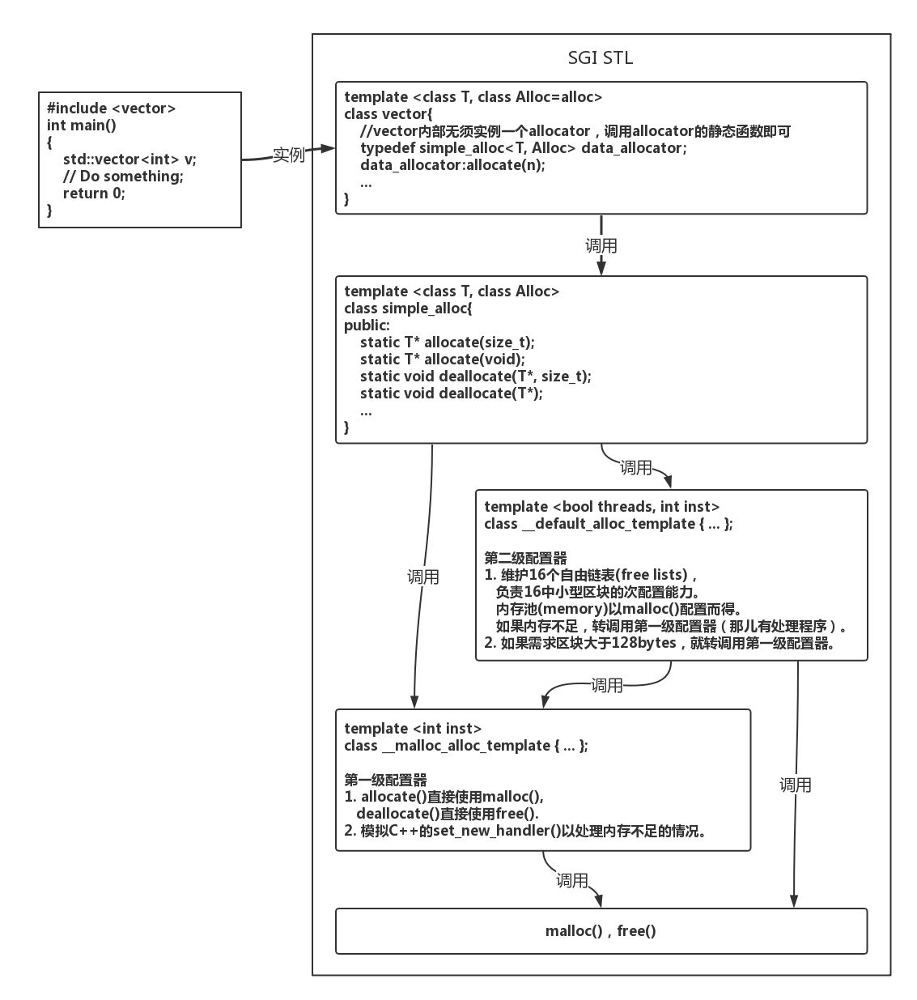

# 简单记录一下自己在stl学习过程中学到的知识

#### 简单概述
1. STL六大组件：
  - 容器(container)：常用数据结构，大致分为两类，序列容器，如vector，list，deque，关联容器，如set，map。在实现上，是类模板(class template)
  
  - 迭代器(iterator)：一套访问容器的接口，行为类似于指针。它为不同算法提供的相对统一的容器访问方式，使得设计算法时无需关注过多关注数据。（“算法”指广义的算法，操作数据的逻辑代码都可认为是算法）
  - 算法(algorithm)：提供一套常用的算法，如sort，search，copy，erase … 在实现上，可以认为是一种函数模板(function template)。
  - 配置器(allocator)：为容器提供空间配置和释放，对象构造和析构的服务，也是一个class template。
  - 仿函数(functor)：作为函数使用的对象，用于泛化算法中的操作。
  - 配接器(adapter)：将一种容器修饰为功能不同的另一种容器，如以容器vector为基础，在其上实现stack，stack的行为也是一种容器。这就是一种配接器。除此之外，还有迭代器配接器和仿函数配接器。
2. 六大组件的交互关系：

3. 六大组件的文件关系：

4. 一些语法基础知识(学习过程中参考的比较好的博文)
 - [静态常量整数成员在class内部直接初始化](https://www.cnblogs.com/wuchanming/p/4060540.html)
 
 - [临时对象的产生与运用](https://www.cnblogs.com/wuchanming/p/4060461.html)
 - [仿函数实现详解](https://blog.csdn.net/u010710458/article/details/79734558)
 - [increment/decrement/dereference操作符](https://www.cnblogs.com/wuchanming/p/4060585.html)
5. 泛型指针、原生指针和智能指针：
  - 泛型指针
泛型指针有多种含义。
     - (1) 指void*指针，可以指向任意数据类型，因此具有“泛型”含义。
     
     - (2) 指具有指针特性的泛型数据结构，包含泛型的迭代器、智能指针等。
广义的迭代器是一种不透明指针，能够实现遍历访问操作。通常所说的迭代器是指狭义的迭代器，即基于C++的STL中基于泛型的iterator_traits实现的类的实例。
总体来说，泛型指针和迭代器是两个不同的概念，其中的交集则是通常提到的迭代器类。

 - 原生指针就是普通指针，与它相对的是使用起来行为上象指针，但却不是指针。
     - 说“原生”是指“最简朴最基本的那一种”。因为现在很多东西都抽象化理论化了，所以“以前的那种最简朴最基本的指针”只是一个抽象概念（比如iterator）的表现形式之一。

 - 智能指针是C++里面的概念：由于 C++ 语言没有自动内存回收机制，程序员每次得自己处理内存相关问题，但用智能指针便可以有效缓解这类问题。
     - 引入智能指针可以防止出现悬垂指针的情况，一般是把指针封装到一个称之为智能指针类中，这个类中另外还封装了一个使用计数器，对指针的复制等操作将导致该计数器的值加1，对指针的delete操作则会减1，值为0时，指针为NULL
     
#### 配置器(allocator)
1. allocator除了负责内存的分配和释放，还负责对象的构造和析构
2. SGI STL的默认配置器
  - 包含三个文件：
  
  - \<stl_construct.h>：定义了全局函数construct()和destroy()，负责对象构造和析构。
  - \<stl_alloc.h>：内存配置和释放在此处实现，其内部有两级配置器，第一级结构简单，封装malloc()和free()，第二级实现了自由链表和内存池，用于提升大量小额内存配置时的性能。
  - \<stl_uninitialiezed.h>：一些用于用于填充和拷贝大块内存的全局函数。
对象构造和/析构，与内存配置/释放是分离实现的。
3. 结构图：

4. 代码可以去看下上面的代码，在代码中有相应的注释。

#### 迭代器(iterator)
1. STL的中心思想在于：将数据容器和算法分开，彼此独立设计，最后再以一贴胶合剂（iterator）将它们撮合在一起。迭代器（Iterator）模式--提供一种方法，使之能够依序寻访某个聚合物（容器）所含的各个元素，而又无需暴露该聚合物的内部表达方式。

  - STL的中心思想在于：将数据容器和算法分开，彼此独立设计，最后再以一贴胶合剂（iterator）将它们撮合在一起。
  
 - 迭代器是数据结构容器中非常有用的“特殊指针”，在不暴露容器中结构的条件下，可以取出容器里所有的元素。
1. iterator框架：

* 调用接口

```
template<class _Category, class _Tp, class _Distance = ptrdiff_t, class _Pointer=_Tp *, class _Reference = _Tp &>
    struct iterator {
        typedef _Category iterator_category;
        typedef _Tp value_type;
        typedef _Distance difference_type;
        typedef _Pointer pointer;
        typedef _Reference reference;
    };
    
```
* 迭代器的分类

```
/*
输入迭代器input_iterator：只读，且只能一次读操作，支持操作：++p,p++,!=,==,=*p,p->；
输出迭代器output_iterator：只写，且只能一次写操作，支持操作：++p,p++；
正向迭代器forward_iterator：可多次读写，支持输入输出迭代器的所有操作；
双向迭代器bidirectional_iterator：支持正向迭代器的所有操作，且支持操作：--p,--p；
随机访问迭代器random_access_iterator：除了支持双向迭代器操作外，还支持：p[n],p+n,n+p,p-n,p+=n,p-=n,p1-p2,p1<p2,p1>p2,p1>=p2,p1<=p2；
*/
struct input_iterator_tag {};
struct output_iterator_tag {};
struct forward_iterator_tag : public input_iterator_tag {};
struct bidirectional_iterator_tag : public forward_iterator_tag {};
struct random_access_iterator_tag : public bidirectional_iterator_tag {};

template <class _Tp, class _Distance> struct input_iterator {
  typedef input_iterator_tag iterator_category;
  typedef _Tp                value_type;
  typedef _Distance          difference_type;
  typedef _Tp*               pointer;
  typedef _Tp&               reference;
};

struct output_iterator {
  typedef output_iterator_tag iterator_category;
  typedef void                value_type;
  typedef void                difference_type;
  typedef void                pointer;
  typedef void                reference;
};

template <class _Tp, class _Distance> struct forward_iterator {
  typedef forward_iterator_tag iterator_category;
  typedef _Tp                  value_type;
  typedef _Distance            difference_type;
  typedef _Tp*                 pointer;
  typedef _Tp&                 reference;
};

template <class _Tp, class _Distance> struct bidirectional_iterator {
  typedef bidirectional_iterator_tag iterator_category;
  typedef _Tp                        value_type;
  typedef _Distance                  difference_type;
  typedef _Tp*                       pointer;
  typedef _Tp&                       reference;
};

template <class _Tp, class _Distance> struct random_access_iterator {
  typedef random_access_iterator_tag iterator_category;
  typedef _Tp                        value_type;
  typedef _Distance                  difference_type;
  typedef _Tp*                       pointer;
  typedef _Tp&                       reference;
};

```

* traits技术
   - 迭代器的型别如下

```
template <class _Iterator>
/*Traits技术，萃取出类型的相关信息*/
struct iterator_traits {
  typedef typename _Iterator::iterator_category iterator_category; //迭代器类型
  typedef typename _Iterator::value_type        value_type;//迭代器所指对象的类型
  typedef typename _Iterator::difference_type   difference_type;//两个迭代器之间的距离
  typedef typename _Iterator::pointer           pointer;//指针
  typedef typename _Iterator::reference         reference;//引用
};
```
- 在迭代器中，为了能够在编译时确定函数调用，应用了函数重载。因为五种迭代器操作能力是不同的，例如random acess iterator是操作能力最强的，可以在O(1)时间操作指定位置，而这个用其他的迭代器可能需要O(n)。所以为了提高效率，使用迭代器类型最匹配的算法函数去调用：

    1. 首先通过traits技术获得迭代器类型iterator_category；
    2. 在函数调用时生成相应迭代器类型的临时对象作为实参传递，编译器就会调用相应的重载函数。

- 为了重载函数识别，SGI STL有对应的5种迭代器标识类：继承是为了可以使用传递调用，当不存在某种迭代器类型匹配时编译器会依据继承层次向上查找进行传递。

```
/*五中迭代器类型*/
struct input_iterator_tag {};
struct output_iterator_tag {};
struct forward_iterator_tag : public input_iterator_tag {};
struct bidirectional_iterator_tag : public forward_iterator_tag {};
struct random_access_iterator_tag : public bidirectional_iterator_tag {};
```
以advance()函数的调用，针对不同的迭代器类型，对函数进行重载为例：

```
/*函数重载，使迭代器能在编译时期就确定调用哪个函数*/
template <class _InputIter, class _Distance>
/*迭代器类型为input_iterator_tag的函数定义*/
inline void __advance(_InputIter& __i, _Distance __n, input_iterator_tag) {
  while (__n--) ++__i;
}

template <class _BidirectionalIterator, class _Distance>
/*迭代器类型为bidirectional_iterator_tag的函数定义*/
inline void __advance(_BidirectionalIterator& __i, _Distance __n, 
                      bidirectional_iterator_tag) {
  __STL_REQUIRES(_BidirectionalIterator, _BidirectionalIterator);
  if (__n >= 0)
    while (__n--) ++__i;
  else
    while (__n++) --__i;
}

template <class _RandomAccessIterator, class _Distance>
/*迭代器类型为random_access_iterator_tag的函数定义*/
inline void __advance(_RandomAccessIterator& __i, _Distance __n, 
                      random_access_iterator_tag) {
  __STL_REQUIRES(_RandomAccessIterator, _RandomAccessIterator);
  __i += __n;
}

template <class _InputIterator, class _Distance>
/*决定调用哪个函数，这是一个对外接口*/
inline void advance(_InputIterator& __i, _Distance __n) {
  __STL_REQUIRES(_InputIterator, _InputIterator);
  __advance(__i, __n, iterator_category(__i));
}
```
迭代器完整源码可以自行查看。

#### 序列容器（vector）
1. vector的数据安排和操作方式类似于C++内置数组类型array，唯一的区别就是在于空间的灵活运用。内置数组array是静态空间，一旦分配了内存空间就不能改变，而vector容器可以根据用户数据的变化而不断调整内存空间的大小。

2. vector容器有已使用空间和可用空间，已使用空间是指vector容器的大小，可用空间是指vector容器可容纳的最大数据空间capacity。vector容器是占用一段连续线性空间，所以vector容器的迭代器就等价于原生态的指针；vector的实现依赖于内存的配置和内存的初始化，以及迭代器。其中内存的配置是最重要的，因为每当配置内存空间时，可能会发生数据移动，回收旧的内存空间，如果不断地重复这些操作会降低操作效率，所有vector容器在分配内存时，并不是用户数据占多少就分配多少，它会分配一些内存空间留着备用，即是用户可用空间。
3. vector容器的数据结构
```
template <class _Tp, class _Alloc = __STL_DEFAULT_ALLOCATOR(_Tp) >
class vector : protected _Vector_base<_Tp, _Alloc> 
{
       ...
protected:
  _Tp* _M_start;//表示目前使用空间的头
  _Tp* _M_finish;//表示目前使用空间的尾
  _Tp* _M_end_of_storage;//表示目前可用空间的尾  
    ...
};
```
4. vector迭代器

```
template <class _Tp, class _Alloc = __STL_DEFAULT_ALLOCATOR(_Tp) >
class vector : protected _Vector_base<_Tp, _Alloc> 
{
  
public: /vector的内嵌型别定义,是iterator_traits<I>服务的类型
  typedef _Tp value_type;
  typedef value_type* pointer;
  typedef const value_type* const_pointer;
  typedef value_type* iterator;//vector容器的迭代器是普通指针
  typedef const value_type* const_iterator;
  
  public: //以下定义vector迭代器
  iterator begin() { return _M_start; }//指向已使用空间头的迭代器
  const_iterator begin() const { return _M_start; }
  iterator end() { return _M_finish; }//指向已使用空间尾的迭代器
  const_iterator end() const { return _M_finish; }

  reverse_iterator rbegin()
    { return reverse_iterator(end()); }
  const_reverse_iterator rbegin() const
    { return const_reverse_iterator(end()); }
  reverse_iterator rend()
    { return reverse_iterator(begin()); }
  const_reverse_iterator rend() const
    { return const_reverse_iterator(begin()); }
	...
};
```
- vector容器维护的空间的线性连续的，所以普通指针也可以作为迭代器，满足vector的访问操作；如：operator*，operator->，operator++，operator--，operator+，operator-，operator+=，operator-=等操作；同时vector容器支持随机访问，所以，vector提供的是随机访问迭代器。

5.vector的构造函数和析构函数

```
/*以下是vector容器的构造函数***********************
/************************************
***	//默认构造函数***************************
*	explicit vector( const Allocator& alloc = Allocator() );		  *
***	//具有初始值和容器大小的构造函数*******************
*	explicit vector( size_type count,								  *
*              const T& value = T(),                               *
*              const Allocator& alloc = Allocator());              *
*      vector( size_type count,                                    *
*              const T& value,                                     *
*              const Allocator& alloc = Allocator());              *
***	//只有容器大小的构造函数***********************
*	explicit vector( size_type count );                               *
***	//用两个迭代器区间表示容器大小的构造函数***************
*	template< class InputIt >                                         *
*	vector( InputIt first, InputIt last,                              *
*     const Allocator& alloc = Allocator() );                      *  
***	//拷贝构造函数***************************
*	vector( const vector& other );                                    *
*	vector( const vector& other, const Allocator& alloc );            * 
***	//移动构造函数***************************
*	vector( vector&& other );                                         *
*	vector( vector&& other, const Allocator& alloc );                 *
***	//用初始列表的值构造容器，列表内的元素值可以不同***********
*	vector( std::initializer_list<T> init,                            *
*     const Allocator& alloc = Allocator() );                      *
*************************************/ 
  explicit vector(const allocator_type& __a = allocator_type())
    : _Base(__a) {}//默认构造函数

  vector(size_type __n, const _Tp& __value,
         const allocator_type& __a = allocator_type()) 
    : _Base(__n, __a)//构造函数，里面包含n个初始值为value的元素
	//全局函数，填充值函数，即从地址M_start开始连续填充n个初始值为value的元素
    { _M_finish = uninitialized_fill_n(_M_start, __n, __value); }

  explicit vector(size_type __n)//该构造函数不接受初始值，只接受容易包含元素的个数n
    : _Base(__n, allocator_type())
    { _M_finish = uninitialized_fill_n(_M_start, __n, _Tp()); }

  vector(const vector<_Tp, _Alloc>& __x) 
    : _Base(__x.size(), __x.get_allocator())//拷贝构造函数
    { _M_finish = uninitialized_copy(__x.begin(), __x.end(), _M_start); }

#ifdef __STL_MEMBER_TEMPLATES
  // Check whether it's an integral type.  If so, it's not an iterator.
  /*这个是某个区间的构造函数，首先判断输入是否为整数_Integral()
  *采用__type_traits技术
  */
  template <class _InputIterator>
  vector(_InputIterator __first, _InputIterator __last,
         const allocator_type& __a = allocator_type()) : _Base(__a) {
    typedef typename _Is_integer<_InputIterator>::_Integral _Integral;
    _M_initialize_aux(__first, __last, _Integral());
  }

  template <class _Integer>
  //若输入为整数，则调用该函数
  void _M_initialize_aux(_Integer __n, _Integer __value, __true_type) {
    _M_start = _M_allocate(__n);
    _M_end_of_storage = _M_start + __n; 
    _M_finish = uninitialized_fill_n(_M_start, __n, __value);
  }

  template <class _InputIterator>
  //若输入不是整数，则采用Traits技术继续判断迭代器的类型
  void _M_initialize_aux(_InputIterator __first, _InputIterator __last,
                         __false_type) {
    _M_range_initialize(__first, __last, __ITERATOR_CATEGORY(__first));
  }

#else
  vector(const _Tp* __first, const _Tp* __last,
         const allocator_type& __a = allocator_type())
    : _Base(__last - __first, __a) 
    { _M_finish = uninitialized_copy(__first, __last, _M_start); }
#endif /* __STL_MEMBER_TEMPLATES */

  ~vector() { destroy(_M_start, _M_finish); }//析构函数
```
6.vector容器的成员函数

```
/*以下是容器的一些成员函数*/
  size_type size() const//vector容器大小(已使用空间大小)，即容器内存储元素的个数
    { return size_type(end() - begin()); }
  size_type max_size() const//返回可容纳最大元素数
    { return size_type(-1) / sizeof(_Tp); }
  size_type capacity() const//vector容器可用空间的大小
    { return size_type(_M_end_of_storage - begin()); }
  bool empty() const//判断容器是否为空
    { return begin() == end(); }

  reference operator[](size_type __n) { return *(begin() + __n); }//返回指定位置的元素
  const_reference operator[](size_type __n) const { return *(begin() + __n); }

#ifdef __STL_THROW_RANGE_ERRORS
  //若用户要求的空间大于可用空间，抛出错去信息，即越界检查
  void _M_range_check(size_type __n) const {
    if (__n >= this->size())
      __stl_throw_range_error("vector");
  }

  reference at(size_type __n)//访问指定元素，并且进行越界检查
    { _M_range_check(__n); return (*this)[__n]; }//访问前，先进行越界检查
  const_reference at(size_type __n) const
    { _M_range_check(__n); return (*this)[__n]; }
#endif /* __STL_THROW_RANGE_ERRORS */

    void reserve(size_type __n) {//改变可用空间内存大小
    if (capacity() < __n) {
      const size_type __old_size = size();
	  //重新分配大小为n的内存空间，并把原来数据复制到新分配空间
      iterator __tmp = _M_allocate_and_copy(__n, _M_start, _M_finish);
      destroy(_M_start, _M_finish);//释放容器元素对象
      _M_deallocate(_M_start, _M_end_of_storage - _M_start);//回收原来的内存空间
	  //调整迭代器所指的地址,因为原来迭代器所指的地址已经失效
      _M_start = __tmp;
      _M_finish = __tmp + __old_size;
      _M_end_of_storage = _M_start + __n;
    }
  }

  reference front() { return *begin(); }//返回第一个元素
  const_reference front() const { return *begin(); }
  reference back() { return *(end() - 1); }//返回容器最后一个元素
  const_reference back() const { return *(end() - 1); }

  void push_back(const _Tp& __x) {//在最尾端插入元素
    if (_M_finish != _M_end_of_storage) {//若有可用的内存空间
      construct(_M_finish, __x);//构造对象
      ++_M_finish;
    }
    else//若没有可用的内存空间,调用以下函数，把x插入到指定位置
      _M_insert_aux(end(), __x);
  }
  void push_back() {
    if (_M_finish != _M_end_of_storage) {
      construct(_M_finish);
      ++_M_finish;
    }
    else
      _M_insert_aux(end());
  }
  void swap(vector<_Tp, _Alloc>& __x) {
	  /*交换容器的内容
	  *这里使用的方法是交换迭代器所指的地址
	  */
    __STD::swap(_M_start, __x._M_start);
    __STD::swap(_M_finish, __x._M_finish);
    __STD::swap(_M_end_of_storage, __x._M_end_of_storage);
  }

  iterator insert(iterator __position, const _Tp& __x) {//把x值插入到指定的位置
    size_type __n = __position - begin();
    if (_M_finish != _M_end_of_storage && __position == end()) {
      construct(_M_finish, __x);
      ++_M_finish;
    }
    else
      _M_insert_aux(__position, __x);
    return begin() + __n;
  }
  iterator insert(iterator __position) {
    size_type __n = __position - begin();
    if (_M_finish != _M_end_of_storage && __position == end()) {
      construct(_M_finish);
      ++_M_finish;
    }
    else
      _M_insert_aux(__position);
    return begin() + __n;
  }

  void insert (iterator __pos, size_type __n, const _Tp& __x)
    { //在pos位置连续插入n个初始值为x的元素
		_M_fill_insert(__pos, __n, __x); }

  void _M_fill_insert (iterator __pos, size_type __n, const _Tp& __x);

  void pop_back() {//取出最尾端元素
    --_M_finish;
    destroy(_M_finish);//析构对象
  }
  iterator erase(iterator __position) {//擦除指定位置元素
    if (__position + 1 != end())
      copy(__position + 1, _M_finish, __position);//后续元素前移一位
    --_M_finish;
    destroy(_M_finish);//析构对象
    return __position;
  }
  iterator erase(iterator __first, iterator __last) {//擦除两个迭代器区间的元素
    iterator __i = copy(__last, _M_finish, __first);//把不擦除的元素前移
    destroy(__i, _M_finish);//析构对象
    _M_finish = _M_finish - (__last - __first);//调整finish的所指的位置
    return __first;
  }

  void resize(size_type __new_size, const _Tp& __x) {//改变容器中可存储的元素个数，并不会分配新的空间
    if (__new_size < size()) //若调整后的内存空间比原来的小
      erase(begin() + __new_size, end());//擦除多余的元素
    else
      insert(end(), __new_size - size(), __x);//比原来多余的空间都赋予初值x
  }
  void resize(size_type __new_size) { resize(__new_size, _Tp()); }
  void clear() { erase(begin(), end()); }//清空容器
     // assign(), a generalized assignment member function.  Two
  // versions: one that takes a count, and one that takes a range.
  // The range version is a member template, so we dispatch on whether
  // or not the type is an integer.

  /*该函数有两种类型：
	void assign( size_type count, const T& value );

	template< class InputIt >
	void assign( InputIt first, InputIt last );
	*/

  //把容器内容替换为n个初始值为value
  void assign(size_type __n, const _Tp& __val) { _M_fill_assign(__n, __val); }
  void _M_fill_assign(size_type __n, const _Tp& __val);

#ifdef __STL_MEMBER_TEMPLATES
  
  template <class _InputIterator>
  void assign(_InputIterator __first, _InputIterator __last) {
    typedef typename _Is_integer<_InputIterator>::_Integral _Integral;
    _M_assign_dispatch(__first, __last, _Integral());
  }

  template <class _Integer>
  void _M_assign_dispatch(_Integer __n, _Integer __val, __true_type)
    { _M_fill_assign((size_type) __n, (_Tp) __val); }

  template <class _InputIter>
  void _M_assign_dispatch(_InputIter __first, _InputIter __last, __false_type)
    { _M_assign_aux(__first, __last, __ITERATOR_CATEGORY(__first)); }

  template <class _InputIterator>
  void _M_assign_aux(_InputIterator __first, _InputIterator __last,
                     input_iterator_tag);

  template <class _ForwardIterator>
  void _M_assign_aux(_ForwardIterator __first, _ForwardIterator __last,
                     forward_iterator_tag); 

#endif /* __STL_MEMBER_TEMPLATES */
```
重点记录一下：iterator erase(iterator __first, iterator __last)，void insert (iterator __pos, size_type __n, const _Tp& __x)；

其中擦除函数是擦除输入迭代器之间的元素，但是没有回收内存空间，只是把内存空间作为备用空间，首先看下该函数的源代码：

```
 iterator erase(iterator __first, iterator __last) {//擦除两个迭代器区间的元素
    iterator __i = copy(__last, _M_finish, __first);//把不擦除的元素前移
    destroy(__i, _M_finish);//析构对象
    _M_finish = _M_finish - (__last - __first);//调整finish的所指的位置
    return __first;
  }
```
根据上面函数的定义，我们可以知道，迭代器start和end_of_storage并没有改变，只是调整迭代器finish，并析构待擦除元素对象；下面通过图解进行分析：

插入元素函数是在指定位置position上连续插入n个初始值为x的元素，根据插入元素个数和可用空间大小的比较，分别进行不同的初始化，详细见源码分析：

```
void insert (iterator __pos, size_type __n, const _Tp& __x)
    { //在pos位置连续插入n个初始值为x的元素
		_M_fill_insert(__pos, __n, __x); }
 
template <class _Tp, class _Alloc>
void vector<_Tp, _Alloc>::_M_fill_insert(iterator __position, size_type __n, 
                                         const _Tp& __x)
{
  if (__n != 0) {//当n不为0，插入才有效
    if (size_type(_M_end_of_storage - _M_finish) >= __n) {//若有足够的可用空间,即备用空间不小于新插入元素个数
      _Tp __x_copy = __x;
      const size_type __elems_after = _M_finish - __position;//计算插入点之后的现有元素个数
      iterator __old_finish = _M_finish;

	  //case1-a：插入点之后的现有元素个数大于新插入元素个数
      if (__elems_after > __n) {
        uninitialized_copy(_M_finish - __n, _M_finish, _M_finish);//把[finish-n,finish)之间的数据复制[finish,finish+n)
        _M_finish += __n;//调整迭代器finish所指的位置
        copy_backward(__position, __old_finish - __n, __old_finish);//把[position,old_finish-n)之间的数据复制[old_finish-n,old_finish)
        fill(__position, __position + __n, __x_copy);//在指定位置(插入点)填充初始值
      }

	  //case1-b：插入点之后的现有元素个数不大于新插入元素个数
      else {
        uninitialized_fill_n(_M_finish, __n - __elems_after, __x_copy);//先在可用空间填入n-elems_after个初始值x
        _M_finish += __n - __elems_after;//调整迭代器finish
        uninitialized_copy(__position, __old_finish, _M_finish);//把[position,old_finish)之间的数据复制到[old_finish,finish)
        _M_finish += __elems_after;
        fill(__position, __old_finish, __x_copy);
      }
    }

	//case2：若备用空间小于新插入元素个数
    else {//若备用空间小于新插入元素个数，则分配新的空间
		//并把原始数据复制到新的空间，调整迭代器
      const size_type __old_size = size(); //获取原始空间的大小  
	  //新的空间为旧空间的两倍，或为旧空间+新增长元素个数
      const size_type __len = __old_size + max(__old_size, __n);
	  //配置新的空间
      iterator __new_start = _M_allocate(__len);
      iterator __new_finish = __new_start;
      __STL_TRY {//把插入点之前的原始数据复制到新的空间
        __new_finish = uninitialized_copy(_M_start, __position, __new_start);
		//将新加入数据添加在[new_finish,new_finish+n)
        __new_finish = uninitialized_fill_n(__new_finish, __n, __x);
		//将插入点之后的原始数据复制到新空间
        __new_finish
          = uninitialized_copy(__position, _M_finish, __new_finish);
      }
	  //释放原来空间的对象和内存
      __STL_UNWIND((destroy(__new_start,__new_finish), 
                    _M_deallocate(__new_start,__len)));
      destroy(_M_start, _M_finish);
      _M_deallocate(_M_start, _M_end_of_storage - _M_start);
	  //调整迭代器所指的位置
      _M_start = __new_start;
      _M_finish = __new_finish;
      _M_end_of_storage = __new_start + __len;
    }
  }
}
```
下面对不同情况利用图解方式对插入函数进行分析：

case1-a：对应的源代码解析中的case1-a情况:


case1-b：对应的源代码解析中的case1-b情况:


case2：针对源码剖析的case2情况：


7.vector的操作符重载

```
template <class _Tp, class _Alloc>
inline bool //操作符重载，判断两个容器是否相等，即容器大小和容器内容是否都相等
operator==(const vector<_Tp, _Alloc>& __x, const vector<_Tp, _Alloc>& __y)
{
  return __x.size() == __y.size() &&
         equal(__x.begin(), __x.end(), __y.begin());
  /*STL中equal函数的实现如下：
    * template<class InputIt1, class InputIt2>
    * bool equal(InputIt1 first1, InputIt1 last1, InputIt2 first2)
    * {
    *	for (; first1 != last1; ++first1, ++first2) 
	*	{
	*		if (!(*first1 == *first2)) 
	*		{
	*			return false;
	*		}
	*	}
	*	return true;
	* }  
  */
}

template <class _Tp, class _Alloc>
inline bool 
operator<(const vector<_Tp, _Alloc>& __x, const vector<_Tp, _Alloc>& __y)
{
  /*函数原型：
	template<class InputIt1, class InputIt2>
	bool lexicographical_compare(InputIt1 first1, InputIt1 last1,
                             InputIt2 first2, InputIt2 last2)
	{
		for ( ; (first1 != last1) && (first2 != last2); first1++, first2++ ) {
			if (*first1 < *first2) return true;
			if (*first2 < *first1) return false;
			}
		return (first1 == last1) && (first2 != last2);
	}
	  */
	return lexicographical_compare(__x.begin(), __x.end(), 
                                 __y.begin(), __y.end());
}

#ifdef __STL_FUNCTION_TMPL_PARTIAL_ORDER

template <class _Tp, class _Alloc>
inline void swap(vector<_Tp, _Alloc>& __x, vector<_Tp, _Alloc>& __y)
{
  __x.swap(__y);
}

template <class _Tp, class _Alloc>
inline bool
operator!=(const vector<_Tp, _Alloc>& __x, const vector<_Tp, _Alloc>& __y) {
  return !(__x == __y);
}

template <class _Tp, class _Alloc>
inline bool
operator>(const vector<_Tp, _Alloc>& __x, const vector<_Tp, _Alloc>& __y) {
  return __y < __x;
}

template <class _Tp, class _Alloc>
inline bool
operator<=(const vector<_Tp, _Alloc>& __x, const vector<_Tp, _Alloc>& __y) {
  return !(__y < __x);
}

template <class _Tp, class _Alloc>
inline bool
operator>=(const vector<_Tp, _Alloc>& __x, const vector<_Tp, _Alloc>& __y) {
  return !(__x < __y);
}

#endif /* __STL_FUNCTION_TMPL_PARTIAL_ORDER */

template <class _Tp, class _Alloc>
vector<_Tp,_Alloc>& 
vector<_Tp,_Alloc>::operator=(const vector<_Tp, _Alloc>& __x)
{
  if (&__x != this) {
    const size_type __xlen = __x.size();
    if (__xlen > capacity()) {
      iterator __tmp = _M_allocate_and_copy(__xlen, __x.begin(), __x.end());
      destroy(_M_start, _M_finish);
      _M_deallocate(_M_start, _M_end_of_storage - _M_start);
      _M_start = __tmp;
      _M_end_of_storage = _M_start + __xlen;
    }
    else if (size() >= __xlen) {
      iterator __i = copy(__x.begin(), __x.end(), begin());
      destroy(__i, _M_finish);
    }
    else {
      copy(__x.begin(), __x.begin() + size(), _M_start);
      uninitialized_copy(__x.begin() + size(), __x.end(), _M_finish);
    }
    _M_finish = _M_start + __xlen;
  }
  return *this;
}
```
### 参考资料：[stl源码刨析](https://www.kancloud.cn/digest/stl-sources/177267)