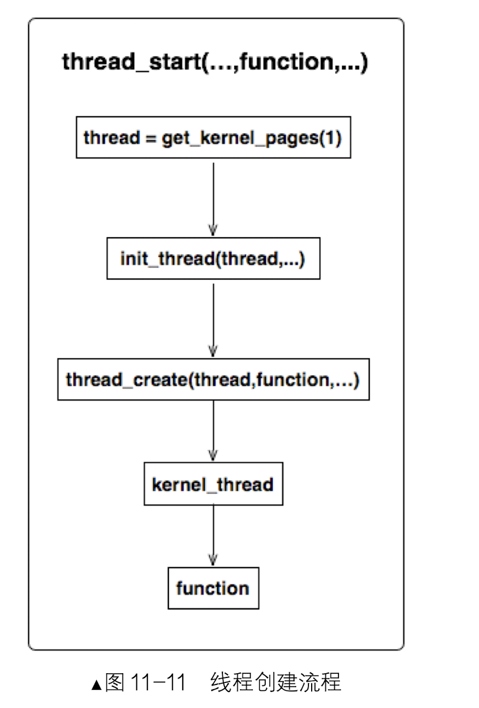
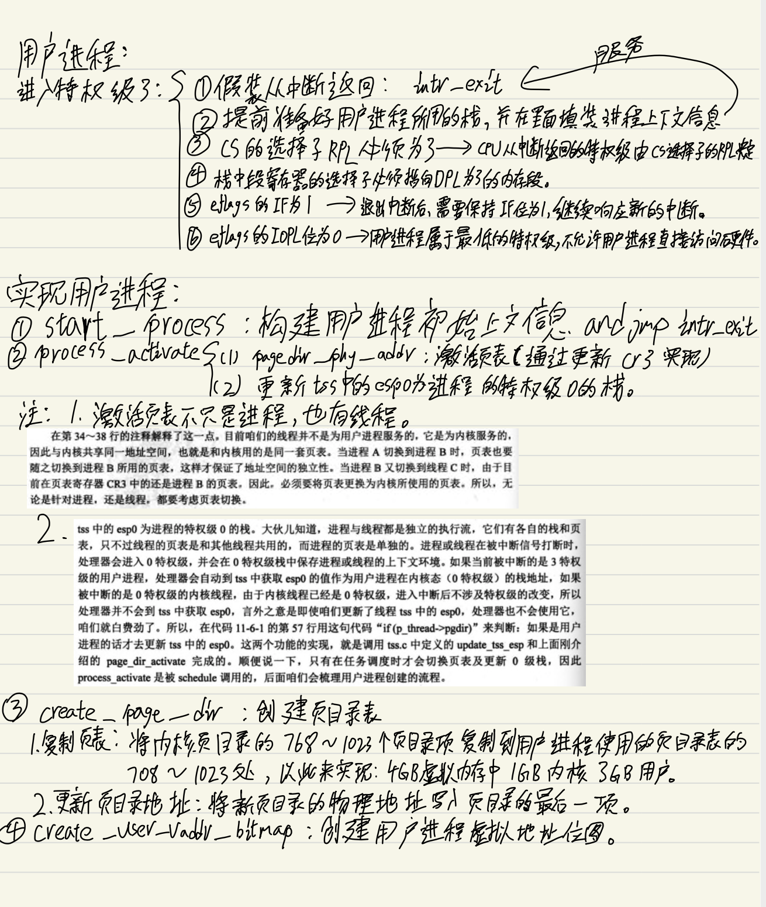
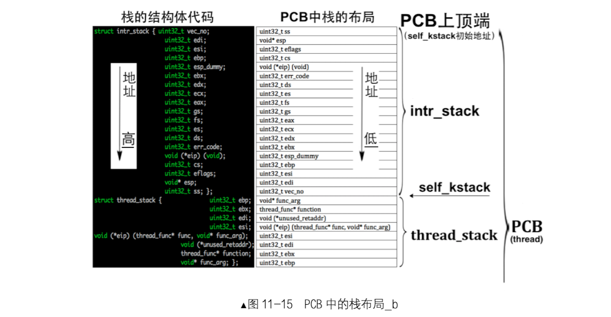

## 用户进程

### TSS
- TSS由用户提供，由CPU自动维护。

- TSS 与其他普通段一样，也有自己的描述符，即 TSS 描述符，用它来描述一个 TSS 的信息，此描述符 需要定义在 GDT 中。寄存器 TR 始终指向当前任务的 TSS。任务切换就是改变 TR 的指向，CPU 自动将当 前寄存器组的值(快照)写入 TR 指向的 TSS，同时 将新任务 TSS 中的各寄存器的值载入 CPU 中对应的 寄存器，从而实现了任务切换。

- TSS 和 LDT 都只能且必须在 GDT 中注册描述符， TR 寄存器中存储的是 TSS 的选择子，LDTR 寄存器中 存储的是 LDT 的选择子，GDTR 寄存器中存储的是 GDT 的起始地址及界限偏移(大小减 1)，全景图如下：

  
  
### CPU原生支持的任务切换方式
##### 通过“中断+任务门”进行任务切换
###### 中断发生时，通过任务门进行任务切换的过程：
- (1)从该任务门描述符中取出任务的 TSS 选择子。

- (2)用新任务的 TSS 选择子在 GDT 中索引 TSS 描述符。
- (3)判断该 TSS 描述符的 P 位是否为 1，为 1 表示该 TSS 描述符对应的 TSS 已经位于内存中 TSS 描述符指定的位置，可以访问。否则 P 不为 1 表示该 TSS 描述符对应的 TSS 不在内存中，这会导致异常。 
- (4)从寄存器 TR 中获取旧任务的 TSS 位置，保存旧任务(当前任务)的状态到旧 TSS 中。其中，任务状态是指 CPU 中寄存器的值，这仅包括 TSS 结构中列出的寄存器:8 个通用寄存器，6 个段寄存器， 指令指针 eip，栈指针寄存器 esp，页表寄存器 cr3 和标志寄存器 eflags 等。
- (5)把新任务的 TSS 中的值加载到相应的寄存器中。
- (6)使寄存器 TR 指向新任务的 TSS。
- (7)将新任务(当前任务)的 TSS 描述符中的 B 位置 1。 
- (8)将新任务标志寄存器中 eflags 的 NT 位置 1。
- (9)将旧任务的 TSS 选择子写入新任务 TSS 中“上一个任务的 TSS 指针”字段中。 
- (10)开始执行新任务。

在执行新任务之前，旧任务是当前的任务，因此旧任务 TSS 描述符中的 B 位为 1，在调用新任务后 也不会修改，因为它尚未执行完，属于嵌套调用别的任务，并不是单独的任务。

###### 新任务执行完成后的返回工作
当新任务执行完成后，调用 iretd 指令返回到旧任务，此时处理器检查 NT 位，若其值为 1，便进行返 回工作，步骤如下。

- (1)将当前任务(新任务)标志寄存器中 eflags 的 NT 位置 0。
- (2)将当前任务 TSS 描述符中的 B 位置为 0。
- (3)将当前任务的状态信息写入 TR 指向的 TSS。
- (4)获取当前任务 TSS 中“上一个任务的 TSS 指针”字段的值，将其加载到 TR 中，恢复上一个任务的状态。 
- (5)执行上一个任务(当前任务)，从而恢复到旧任务。


##### 通过call、jmp进行任务切换

call 是有去有回的指令，jmp 是一去不回的指令，它们在调用新任务时的区别也在于此。

call 指令以任务嵌套的方式调用新任务，当以 call 指令调用新任务时，我们以操作数为 TSS 选择子为例，比如“call 0x0018:0x1234”，任务切换的步骤如下。

- (1)CPU 忽略偏移量 0x1234，拿选择子 0x0018 在 GDT 中索引到第 3 个描述符。 
- (2)检查描述符中的 P 位，若 P 为 0，表示该描述符对应的段不存在，这将引发异常。同时检查该描述符的 S 与 TYPE 的值，判断其类型，如果是 TSS 描述符，检查该描述符的 B 位，B 位若为 1 将抛出 GP 异常，即表示调用不可重入。
- (3)进行特权级检查，数值上“CPL 和 TSS 选择子中的 RPL”都要小于等于 TSS 描述符的 DPL，否 则抛出 GP 异常。
- (4)特权检查完成后，将当前任务的状态保存到寄存器 TR 指向的 TSS 中。
- (5)加载新任务 TSS 选择子到 TR 寄存器的选择器部分，同时把 TSS 描述符中的起始地址和偏移量 等属性加载到 TR 寄存器中的描述符缓冲器中。
- (6)将新任务 TSS 中的寄存器数据载入到相应的寄存器中，同时进行特权级检查，如果检查未通过， 则抛出 GP 异常。
- (7)CPU 会把新任务的标志寄存器 eflags 中的 NT 位置为 1。
- (8)将旧任务 TSS 选择子写入新任务 TSS 中的字段“上一个任务的 TSS 指针”中，这表示新任务是被 旧任务调用才执行的。
- (9)然后将新任务 TSS 描述符中的 B 位置为 1 以表示任务忙。旧任务 TSS 描述符中的 B 位不变，依 然保持为 1，旧任务的标志寄存器 eflags 中的 NT 位的值保持不变，之前是多少就是多少。
- (10)开始执行新任务，完成任务切换。

jmp 指令以非嵌套的方式调用新任务，新任务和旧任务之间不会形成链式关系。当以 jmp 指令调用新任务时，新任务 TSS 描述符中的 B 位会被 CPU 置为 1 以表示任务忙，旧任务 TSS 描述符中的 B 位会被 CPU 清 0。 

当通过 iretd 指令任务返回时，新任务 eflags 寄存器的 NT 位必须为 1，所以 iretd 仅适用于 call。当调用 iretd 返回到旧任务时，CPU 会将当前任务(新任务)TSS 描述符中 B 位清 0，同时将其 eflags 寄存器的 NT 位清 0。

虽然上面介绍了这么多，但其实我们的现代操作系统如linux，因为效率问题，并没有采用上述方法。

### 实现用户进程







#### 写代码时遇到的疑惑和答案

###### pcb的栈布局问题

我们从线程创建部分看起：
```
// 初始化线程基本信息
void init_thread(struct task_struct* pthread, char* name, int prio) {
   
    .............
   
   
// self_kstack是线程自己在内核态下使用的栈顶地址
   pthread->self_kstack = (uint32_t*)((uint32_t)pthread + PG_SIZE);
   
    .............
    
}
```
在init_thread函数中将线程要使用的栈基址初始化为pcb的顶端
```
// 初始化线程栈thread_stack,将待执行的函数和参数放到thread_stack中相应的位置
void thread_create(struct task_struct* pthread, thread_func function, void* func_arg) {
   // 先预留中断使用栈的空间,可见thread.h中定义的结构
   pthread->self_kstack -= sizeof(struct intr_stack);

   // 再留出线程栈空间,可见thread.h中定义
   pthread->self_kstack -= sizeof(struct thread_stack);
  
   struct thread_stack* kthread_stack = (struct thread_stack*)pthread->self_kstack;
   kthread_stack->eip = kernel_thread;
   kthread_stack->function = function;
   kthread_stack->func_arg = func_arg;
   kthread_stack->ebp = kthread_stack->ebx = kthread_stack->esi = kthread_stack->edi = 0;
}
```
在thread_create函数中完成了intr_stack和thread_stack的布局，下图是经过两次-操作的栈布局：

再-操作之后，我们把线程的上下文保存在了 struct thread_stack栈中，注意此时的self_kstack依然是指向了两次-之后的位置。

所以我们在构建用户上下文的时候，想要引入thread_stack就需要用一个+，来使self_kstack指针跨过struct thread_stack栈，如下图：


###### c程序的内存布局问题

- 用户程序内存空间的最顶端用来存储命令行参数及环境变量，这些内容是由某操作系统下的 C 运行库写进去的，将来实现从文件系统加载用户进程并为其传递参数时会介绍这部分。

- 紧接着是栈空间和堆空间，栈向下扩展，堆向上扩展，栈与堆在空间上是相接的，这两个空间由操作系统管理分配，由于栈与堆是相向扩展的，操作系统需要检测栈与堆的碰撞。
- 最下面的 未初始化数据段 bss、初始化数据段 data 及代码段 text 由链接器和编译器负责。
- 在 4GB 的虚拟地址空间中，(0xc0000000-1)是用户空间的最高地址，0xc0000000~0xffffffff 是内核空间。
 
 
 
 - 我们也效仿这种内存结构布局，把用户空间的最高处即 0xc0000000-1，及以下的部分内存空间用于存储用户进程的命令行参数，之下的空间再作为用户的栈和堆。命令行参数也是被压入用户栈的(在后面章节介绍加载 用户进程时会了解)，因此虽然命令行参数位于用户空间的最高处，但它们相当于位于栈的最高地址处，所以用户栈的栈底地址为0xc0000000。 由于在申请内存时，内存管理模块返回的地址是内存空间的下边界，所以 我们为栈申请的地址应该是(0xc0000000-0x1000)，此地址是用户栈空间 栈顶的下边界。这里我们用宏来定义此地址，即 USER_STACK3_VADDR，它定义在 userprog.h 中。

