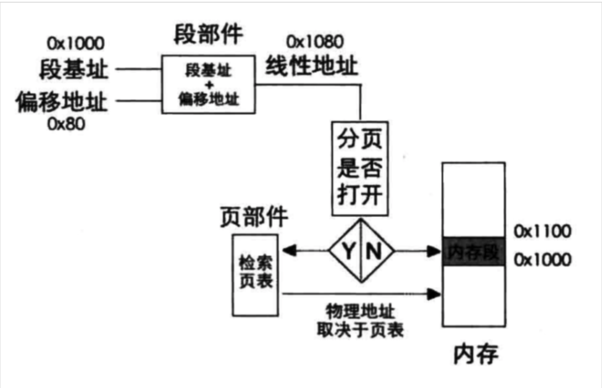
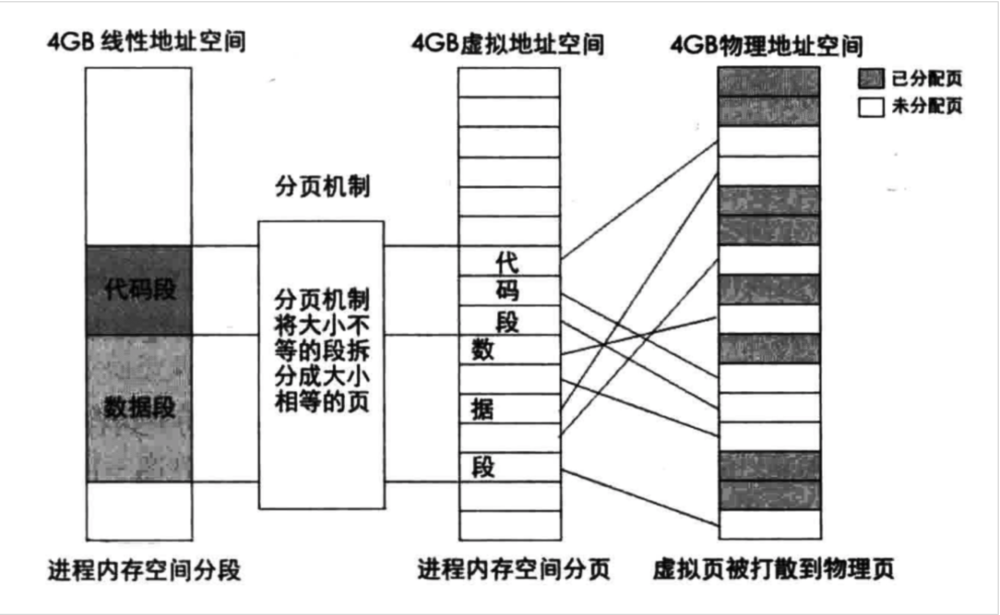
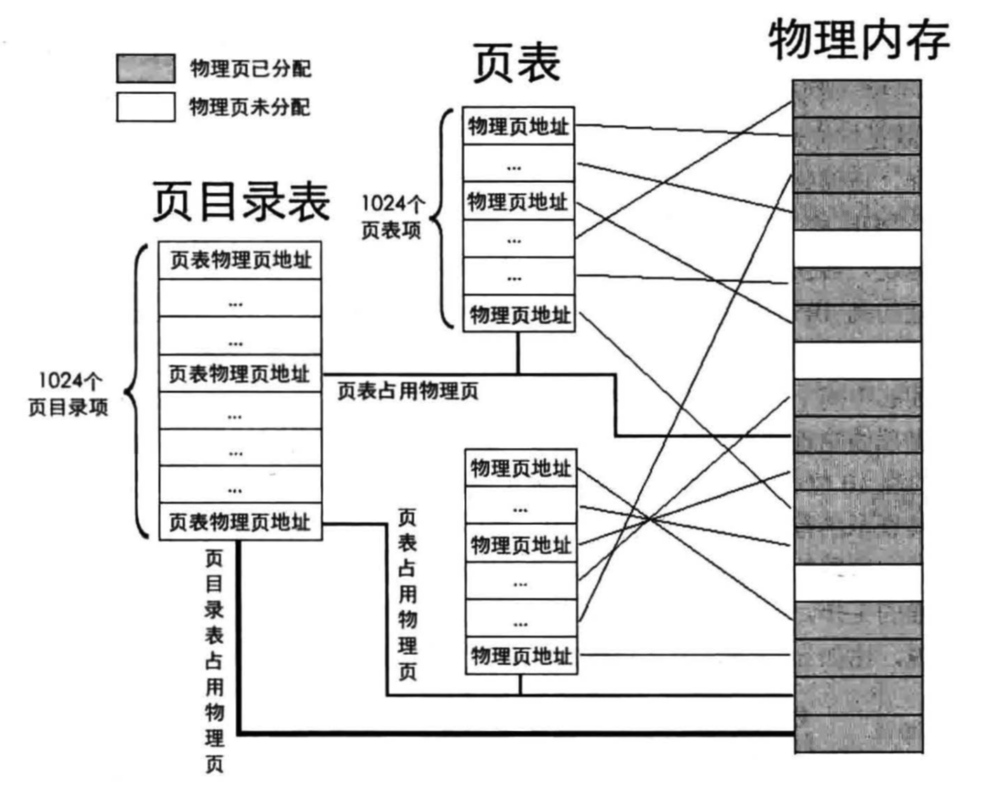
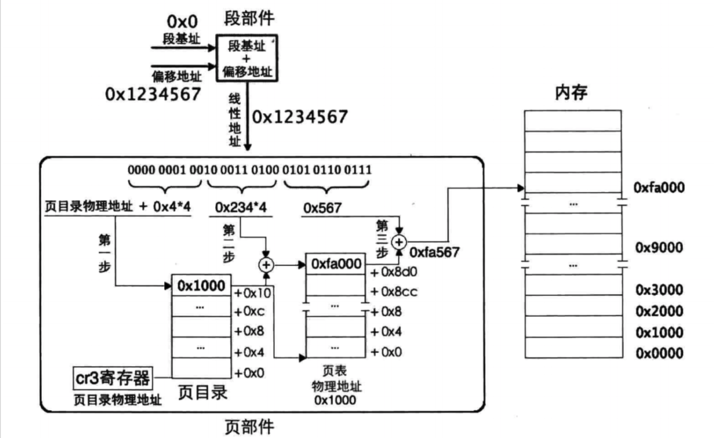
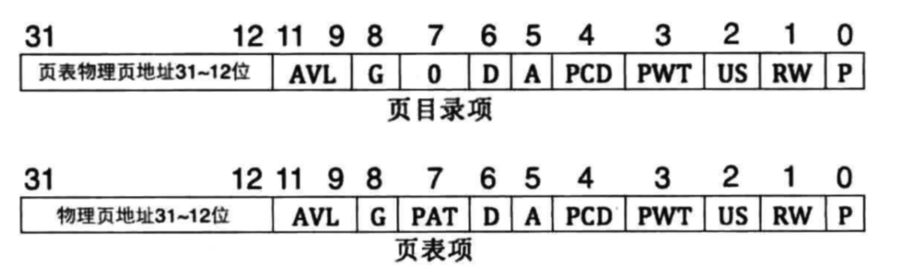
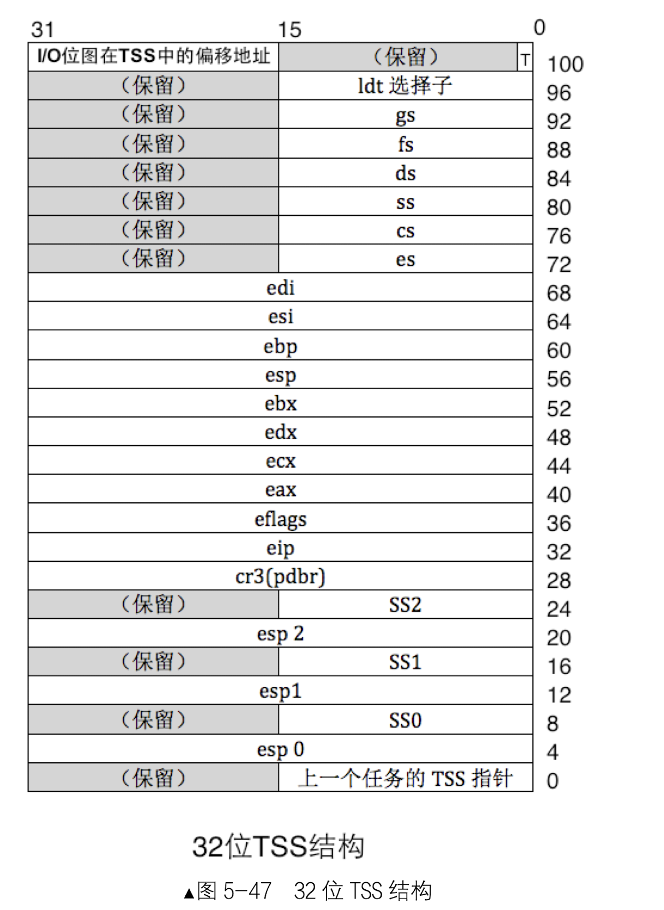
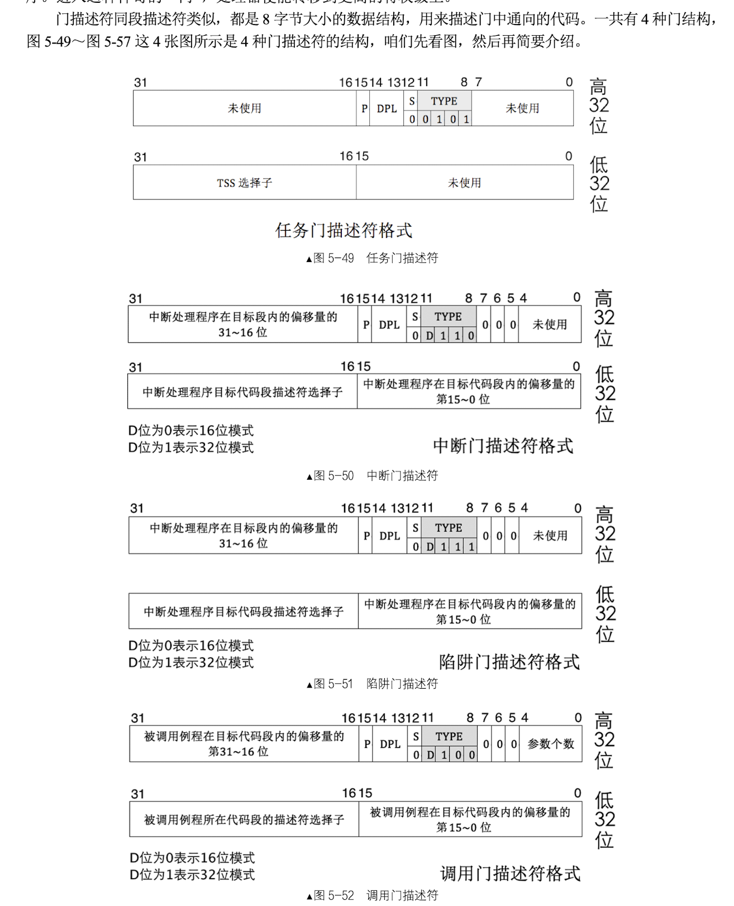
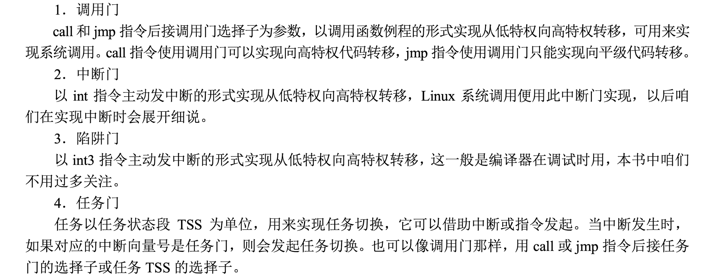
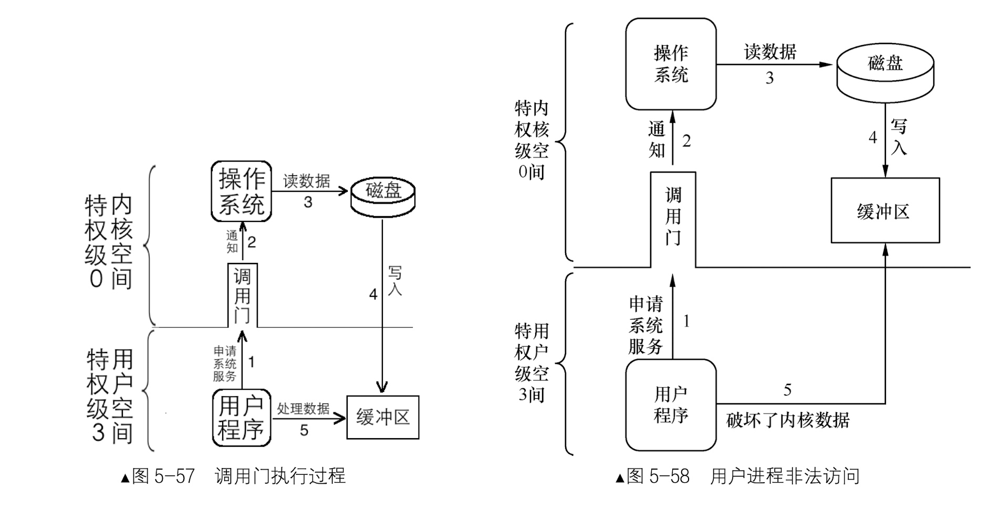

### 获取物理内存容量

1. 利用BIOS中断0x15子功能0xe820
  - 0xE820的功能最强，当然也最复杂，它需要多次调用，每次调用都返回一种类型的内存，直到检测完毕。其结果主要通过ARDS(地址范围描述符)结构存储在内存中。ARDS的结构如下
    
  
  - 由于我们的kernel运行环境是32位的，所以在ARDS结构属性中，只需要用到低32位属性。BaseAddrLow + LengthLow是一段内存区域的上限。

  - BIOS中断只是一段函数例程，要按照它的约定对其提供参数。以下是其需要的参数及意义：
    
  - 调用步骤如下：
     - 填充输入的参数
     
     - 执行中断int 0x15
     - 在cf位为0的情况下，从返回的寄存器中获取结构  

```
 ;int 0x15 eax=0xe820 edx=0x534d4150
;--------------------------------------
    ;填充输入数据
    xor ebx, ebx    ;将ebx清0
    mov edx, 0x534d4150 
    mov di, ards_buf  ;ards结构缓冲区
  .e820_mem_get_loop:
    mov eax, 0xe820
    mov ecx, 20   ;ards地址范围描述符结构大小位20字节
    int 0x15
    
    ;获取所有ards内存段
    add di, cx  ;使di增加20字节指向缓冲区中新的ards结构位置
    inc word [ards_nr] ;记录ards数量
    cmp ebx, 0  ;如果ebx为0且cf位不为1,说明adrs全部返回
    jnz .e820_mem_get_loop

    ;在所有ards结构中找出（base_addr_low + length_low)的最大值，即为内存的容量
    mov cx, [ards_nr]
    mov ebx, ards_buf
    xor edx, edx
  .find_max_mem_area:
    mov eax, [ebx]  ;base_addr_low
    add eax, [ebx + 8] ;length_low
    add ebx, 20
    cmp edx, eax
    jge .next_ards
    mov edx, eax
  .next_ards:
    loop .find_max_mem_area
    jmp .mem_get_ok

  .mem_get_ok:
    mov [total_mem_bytes], edx
```
2.利用BIOS中断0x15子功能0xe801获取内存

- 另一个获取内存容量的方法是BIOS 0x15中断的子功能0xE801，此方法相较于之前的方法较为简单，但是最大只能获取到4GB的内存空间。调用这个功能只需要在ax寄存器中存入子功能号0xe801即可，无需其他的输入数据。

- 通过此方法获取的内存会分为两组数据分别放到两组寄存器中：

- 首先是低于15MB的内存，这块内存的大小会存入AX寄存器中，但是存入AX寄存器中的数值的单位是1KB，也就是说 实际的内存大小=AX*1024，AX的最大值为0x3c00

- 然后是16MB~4GB的内存空间，这块内存的大小会存入BX寄存器中，单位是64KB。所以 内存的实际大小=BX\*64\*1024

- 下面是BIOS中断0x15子功能0xE801的说明


```
mov ax, 0xe801
int 0x15

;先算出低15MB的内存
mov cx, 0x400 ;将获取到的低15M内存乘1024转化成byte
mul cx
shl edx, 16
and eax, 0xffff ;只取低16位，防止乘法溢出
or edx, eax
add eax, 0x100000
mov esi, edx

;再将16MB以上的空间转化成byte为单位
xor eax, eax
mov ax, bx
mov ecx, 0x10000 ;32位下默认被乘数是eax，将获取到的内存乘以64KB转换成byte
mul ecx
add esi, eax
mov edx, esi 
jmp .mem_get_ok
```

3.利用BIOS中断0x15子功能0x88获取内存
 
 - 该功能算是获取内存最简单的方法了，但功能也是最简单的，最大只能获取64MB的内存空间调用方法如下。
  - 在ax寄存器中写入子功能号0x88
  
  - 调用中断0x15
  - cf为0的情况下， ax即为获取到的内存大小，单位1KB，所以实际内存大小=ax*1024 + 1MB

```
mov ah, 0x88
int 0x15
and eax, 0xffff
mov cx, 0x400
mul cx
shl edx, 16
or edx, eax
add edx, 0x100000
```

加注释loader.S

```
   %include "boot.inc"
   section loader vstart=LOADER_BASE_ADDR
   LOADER_STACK_TOP equ LOADER_BASE_ADDR
   
;构建gdt及其内部的描述符
   GDT_BASE:   dd    0x00000000 
	       dd    0x00000000

   CODE_DESC:  dd    0x0000FFFF 
	       dd    DESC_CODE_HIGH4

   DATA_STACK_DESC:  dd    0x0000FFFF
		     dd    DESC_DATA_HIGH4

   VIDEO_DESC: dd    0x80000007	       ; limit=(0xbffff-0xb8000)/4k=0x7
	       dd    DESC_VIDEO_HIGH4  ; 此时dpl为0

   GDT_SIZE   equ   $ - GDT_BASE
   GDT_LIMIT   equ   GDT_SIZE -	1 
   times 60 dq 0					 ; 此处预留60个描述符的空位(slot)
   SELECTOR_CODE equ (0x0001<<3) + TI_GDT + RPL0         ; 相当于(CODE_DESC - GDT_BASE)/8 + TI_GDT + RPL0
   SELECTOR_DATA equ (0x0002<<3) + TI_GDT + RPL0	 ; 同上
   SELECTOR_VIDEO equ (0x0003<<3) + TI_GDT + RPL0	 ; 同上 

   ; total_mem_bytes用于保存内存容量,以字节为单位,此位置比较好记。
   ; 当前偏移loader.bin文件头0x200字节,loader.bin的加载地址是0x900,
   ; 故total_mem_bytes内存中的地址是0xb00.将来在内核中咱们会引用此地址
   total_mem_bytes dd 0					 
   ;;;;;;;;;;;;;;;;;;;;;;;;;;;;;;;;;;;;;;;;;;;;;;;;;;;;

   ;以下是定义gdt的指针，前2字节是gdt界限，后4字节是gdt起始地址
   gdt_ptr  dw  GDT_LIMIT 
	    dd  GDT_BASE

   ;人工对齐:total_mem_bytes4字节+gdt_ptr6字节+ards_buf244字节+ards_nr2,共256字节
   ards_buf times 244 db 0
   ards_nr dw 0		      ;用于记录ards结构体数量

   loader_start:
   
;-------  int 15h eax = 0000E820h ,edx = 534D4150h ('SMAP') 获取内存布局  -------

   xor ebx, ebx		      ;第一次调用时，ebx值要为0
   mov edx, 0x534d4150	      ;edx只赋值一次，循环体中不会改变
   mov di, ards_buf	      ;ards结构缓冲区
.e820_mem_get_loop:	      ;循环获取每个ARDS内存范围描述结构
   mov eax, 0x0000e820	      ;执行int 0x15后,eax值变为0x534d4150,所以每次执行int前都要更新为子功能号。
   mov ecx, 20		      ;ARDS地址范围描述符结构大小是20字节
   int 0x15
   jc .e820_failed_so_try_e801   ;若cf位为1则有错误发生，尝试0xe801子功能
   add di, cx		      ;使di增加20字节指向缓冲区中新的ARDS结构位置
   inc word [ards_nr]	      ;记录ARDS数量
   cmp ebx, 0		      ;若ebx为0且cf不为1,这说明ards全部返回，当前已是最后一个
   jnz .e820_mem_get_loop

;在所有ards结构中，找出(base_add_low + length_low)的最大值，即内存的容量。
   mov cx, [ards_nr]	      ;遍历每一个ARDS结构体,循环次数是ARDS的数量
   mov ebx, ards_buf 
   xor edx, edx		      ;edx为最大的内存容量,在此先清0
.find_max_mem_area:	      ;无须判断type是否为1,最大的内存块一定是可被使用
   mov eax, [ebx]	      ;base_add_low
   add eax, [ebx+8]	      ;length_low
   add ebx, 20		      ;指向缓冲区中下一个ARDS结构
   cmp edx, eax		      ;冒泡排序，找出最大,edx寄存器始终是最大的内存容量
   jge .next_ards
   mov edx, eax		      ;edx为总内存大小
.next_ards:
   loop .find_max_mem_area
   jmp .mem_get_ok

;------  int 15h ax = E801h 获取内存大小,最大支持4G  ------
; 返回后, ax cx 值一样,以KB为单位,bx dx值一样,以64KB为单位
; 在ax和cx寄存器中为低16M,在bx和dx寄存器中为16MB到4G。
.e820_failed_so_try_e801:
   mov ax,0xe801
   int 0x15
   jc .e801_failed_so_try88   ;若当前e801方法失败,就尝试0x88方法

;1 先算出低15M的内存,ax和cx中是以KB为单位的内存数量,将其转换为以byte为单位
   mov cx,0x400	     ;cx和ax值一样,cx用做乘数
   mul cx 
   shl edx,16
   and eax,0x0000FFFF
   or edx,eax
   add edx, 0x100000 ;ax只是15MB,故要加1MB
   mov esi,edx	     ;先把低15MB的内存容量存入esi寄存器备份

;2 再将16MB以上的内存转换为byte为单位,寄存器bx和dx中是以64KB为单位的内存数量
   xor eax,eax
   mov ax,bx		
   mov ecx, 0x10000	;0x10000十进制为64KB
   mul ecx		;32位乘法,默认的被乘数是eax,积为64位,高32位存入edx,低32位存入eax.
   add esi,eax		;由于此方法只能测出4G以内的内存,故32位eax足够了,edx肯定为0,只加eax便可
   mov edx,esi		;edx为总内存大小
   jmp .mem_get_ok

;-----------------  int 15h ah = 0x88 获取内存大小,只能获取64M之内  ----------
.e801_failed_so_try88: 
   ;int 15后，ax存入的是以kb为单位的内存容量
   mov  ah, 0x88
   int  0x15
   jc .error_hlt
   and eax,0x0000FFFF
      
   ;16位乘法，被乘数是ax,积为32位.积的高16位在dx中，积的低16位在ax中
   mov cx, 0x400     ;0x400等于1024,将ax中的内存容量换为以byte为单位
   mul cx
   shl edx, 16	     ;把dx移到高16位
   or edx, eax	     ;把积的低16位组合到edx,为32位的积
   add edx,0x100000  ;0x88子功能只会返回1MB以上的内存,故实际内存大小要加上1MB

.mem_get_ok:
   mov [total_mem_bytes], edx	 ;将内存换为byte单位后存入total_mem_bytes处。


;-----------------   准备进入保护模式   -------------------
;1 打开A20
;2 加载gdt
;3 将cr0的pe位置1

   ;-----------------  打开A20  ----------------
   in al,0x92
   or al,0000_0010B
   out 0x92,al

   ;-----------------  加载GDT  ----------------
   lgdt [gdt_ptr]

   ;-----------------  cr0第0位置1  ----------------
   mov eax, cr0
   or eax, 0x00000001
   mov cr0, eax

   jmp dword SELECTOR_CODE:p_mode_start	     ; 刷新流水线，避免分支预测的影响,这种cpu优化策略，最怕jmp跳转，
					     ; 这将导致之前做的预测失效，从而起到了刷新的作用。
.error_hlt:		      ;出错则挂起
   hlt

[bits 32]
p_mode_start:
   mov ax, SELECTOR_DATA
   mov ds, ax
   mov es, ax
   mov ss, ax
   mov esp,LOADER_STACK_TOP
   mov ax, SELECTOR_VIDEO
   mov gs, ax

   mov byte [gs:160], 'P'

   jmp $
```

### 开启分页机制
###### 一级页表

1. 分页机制是工作在分段机制下的，在保护模式下，通过选择子找到段基址，通过段基址：段内偏移的方式组合成线性地址，拿到线性地址之后会根据是否开启分页来找到实际的物理地址，用一副图来解释更加清晰


2. 分页机制的作用有两方面：
  - 将线性地址转换成物理地址

  - 用大小相等的页代替大小不等的段


3. 页大小4kb：

这种情况下，4GB的内存被划分为1MB个内存块，每个内存块的大小为4KB。

4. 页表和内存的映射关系：


5. 在一级页表下，线性地址的高20位被用作页表项的索引，也就是类似于数组下标的东西。通过该索引在页表中找到对应页的物理地址，然后将该物理地址+线性地址的低12位组成真正的物理地址。过程如图所示
 

###### 二级页表
1. 无论是几级页表，标准页的尺寸都是4KB，这个是不会变的。所以4GB的线性地址空间最多有1M个标准页。一级页表是将这1M个标准页放置到一张页表中，二级页表是将这1M个标准页平均放置1K个页表中，每个页表包含有1K个页表项。页表项是4字节大小，故页表的大小同样为4KB

2. 既然将原本的一个页表划分出了1K个页表，这些页表就必须进行统一管理。为此，专门有一个页目录表来存放这些页表。页目录表中存储的页表称为页目录项(PDE), 页目录项同样为4KB，且最多有1K个页目录项，所以页目录表也是4KB
   - 二级页表的模型如图：
   
   
3. 二级页表与一级页表原理虽然相同，但在结构上有了很大的差异，所以虚拟地址到物理地址的转换方式上也发生了很大变化

  - 首先通过虚拟地址的高10位在页目录表中定位一个页表，也就是定位也目录项

 - 然后通过虚拟地址的中间10位在之前定位的页表中找到物理页所在的位置

 -  最后虚拟地址剩下的12位作为找到的物理页的页内偏移地址。转换过程如图所示：


4. PDE与PTE结构

  - P位：存在位，为1时表示该页在内存中
  
  - RW：读写位，为1时可读可写，为0是可读不可写
  - US：普通用户/超级用户位，为1时表示处于用户级，也就是3级特权级
  - PWT：页级通写位，为1表示此项采用通写方式，表示该页不仅是普通内存，还是高速缓存
  - PCD：页级高速缓存禁止位，为1表示该页启用高速缓存
  - A：访问位，为1表示该页被CPU访问过
  - D：脏页位，当CPU对一个页面执行写操作，此为被赋1
  - PAT：页属性表位，能够在页面一级的粒度上设置内存属性
  - G：全局位，为1表示该页在高速缓存TLB中一直保存

##### 开启分页机制
1. 启用分页机制需要完成下面三步：

  - 准备好页目录表和页表
  - 将页表地址写入控制寄存器Cr3
  - 将寄存器Cr0的PG位置1

```asm
----------创建页目录及页表----------
setup_page:
    mov ecx, 4096
    mov esi, 0
.clear_page_dir:
    mov byte [PAGE_DIR_TABLE_POS + esi], 0
    inc esi
    loop .clear_page_dir

.create_pde:                     
    mov eax, PAGE_DIR_TABLE_POS
    add eax, 0x1000               ; 此时eax为第一个页表的位置及属性
    mov ebx, eax                  ; 此处为ebx赋值，是为.create_pte做准备，ebx为基址。

;   下面将页目录项0和0xc00都存为第一个页表的地址，
;   一个页表可表示4MB内存,这样0xc03fffff以下的地址和0x003fffff以下的地址都指向相同的页表，
;   这是为将地址映射为内核地址做准备
    or eax, PG_US_U | PG_RW_W | PG_P      ; 页目录项的属性RW和P位为1,US为1,表示用户属性,所有特权级别都可以访问.
    mov [PAGE_DIR_TABLE_POS + 0x0], eax       ; 第1个目录项,在页目录表中的第1个目录项写入第一个>页表的位置(0x101000)及属性(7)
    mov [PAGE_DIR_TABLE_POS + 0xc00], eax     ; 一个页表项占用4字节,0xc00表示第768个页表占用的目录项,0xc00以上的目录项用于内核空间,
                             ; 也就是页表的0xc0000000~0xffffffff共计1G属于内核,0x0~0xbfffffff共计3G属于用户进程.
    sub eax, 0x1000
    mov [PAGE_DIR_TABLE_POS + 4092], eax      ; 使最后一个目录项指向页目录表自己的地址

;下面创建页表项(PTE)
    mov ecx, 256                  ; 1M低端内存 / 每页大小4k = 256
    mov esi, 0
    mov edx, PG_US_U | PG_RW_W | PG_P         ; 属性为7,US=1,RW=1,P=1
.create_pte:                     
    mov [ebx+esi*4],edx               ; 此时的ebx已经在上面通过eax赋值为0x101000,也就是第一个页表的地址 
    add edx,4096
    inc esi 
    loop .create_pte
;创建内核其它页表的PDE
    mov eax, PAGE_DIR_TABLE_POS
    add eax, 0x2000           ; 此时eax为第二个页表的位置
    or eax, PG_US_U | PG_RW_W | PG_P  ; 页目录项的属性US,RW和P位都为1
    mov ebx, PAGE_DIR_TABLE_POS
    mov ecx, 254              ; 范围为第769~1022的所有目录项数量
    mov esi, 769
.create_kernel_pde:
    mov [ebx+esi*4], eax
    inc esi
    add eax, 0x1000
    loop .create_kernel_pde
    ret
```
```asm
; 把页目录地址赋给cr3
    mov eax, PAGE_DIR_TABLE_POS
    mov cr3, eax

 ; 打开cr0的pg位(第31位)
    mov eax, cr0
    or eax, 0x80000000
    mov cr0, eax
```

知识点补充：
- 为什么要将页目录项的第0项和第768项两处指向同一个页表？

- 因为我们在加载内核之前，程序中运行的一直是loader，他本身的代码都是在1MB之内，必须保证之前段机制下的线性地址和分页后的虚拟地址对应的物理地址一致。第0个页目录项代表的页表，其表示的空间是0～0x3fffff，包括了1MB（0～0xfffff），所以用了第0项来保证loader在分页机制下依然运行正确。
- 对于第768项，由于我们之后会把操作系统内核放在低端1M物理内存空间，但操作系统的虚拟地址是0xc0000000以上，该虚拟地址对应的页目录项是第768个（0xc0000000的高10位是0x300，即十进制的768）。这样虚拟地址0xc0000000～0xc03fffff之间的内存都指向了低端4MB之内的物理地址，这也就包括了操作系统所占的低端1MB物理内存。从而实现了操作系统高3GB以上的虚拟地址对应到了低端1MB，也就是如同我们之前所说的，内核所占的就是低端1MB。

### 加载内核
1. 将内核文件写进磁盘
```
gcc -c -o main.o main.c -m32 && ld main.o -Ttext 0xc0001500 -e main -o kernel.bin && dd if=kernel.bin of=/ypur_path/hd60M.img bs=512 count=200 seek=9 conv=notrunc
```

2. loader.S需要实现的功能
  - 加载内核：需要把内核文件加载到内存缓冲区
  
  - 初始化内核：需要在分页后，将加载进来的elf内核文件安置到相应的虚拟内存地址，然后跳过去执行。 

loader.S:
```
   %include "boot.inc"
   section loader vstart=LOADER_BASE_ADDR
;构建gdt及其内部的描述符
   GDT_BASE:   dd    0x00000000 
	       dd    0x00000000

   CODE_DESC:  dd    0x0000FFFF 
	       dd    DESC_CODE_HIGH4

   DATA_STACK_DESC:  dd    0x0000FFFF
		     dd    DESC_DATA_HIGH4

   VIDEO_DESC: dd    0x80000007	       ; limit=(0xbffff-0xb8000)/4k=0x7
	       dd    DESC_VIDEO_HIGH4  ; 此时dpl为0

   GDT_SIZE   equ   $ - GDT_BASE
   GDT_LIMIT   equ   GDT_SIZE -	1 
   times 60 dq 0					 ; 此处预留60个描述符的空位(slot)
   SELECTOR_CODE equ (0x0001<<3) + TI_GDT + RPL0         ; 相当于(CODE_DESC - GDT_BASE)/8 + TI_GDT + RPL0
   SELECTOR_DATA equ (0x0002<<3) + TI_GDT + RPL0	 ; 同上
   SELECTOR_VIDEO equ (0x0003<<3) + TI_GDT + RPL0	 ; 同上 

   ; total_mem_bytes用于保存内存容量,以字节为单位,此位置比较好记。
   ; 当前偏移loader.bin文件头0x200字节,loader.bin的加载地址是0x900,
   ; 故total_mem_bytes内存中的地址是0xb00.将来在内核中咱们会引用此地址
   total_mem_bytes dd 0					 
   ;;;;;;;;;;;;;;;;;;;;;;;;;;;;;;;;;;;;;;;;;;;;;;;;;;;;

   ;以下是定义gdt的指针，前2字节是gdt界限，后4字节是gdt起始地址
   gdt_ptr  dw  GDT_LIMIT 
	    dd  GDT_BASE

   ;人工对齐:total_mem_bytes4字节+gdt_ptr6字节+ards_buf244字节+ards_nr2,共256字节
   ards_buf times 244 db 0
   ards_nr dw 0		      ;用于记录ards结构体数量

   loader_start:
   
;-------  int 15h eax = 0000E820h ,edx = 534D4150h ('SMAP') 获取内存布局  -------

   xor ebx, ebx		      ;第一次调用时，ebx值要为0
   mov edx, 0x534d4150	      ;edx只赋值一次，循环体中不会改变
   mov di, ards_buf	      ;ards结构缓冲区
.e820_mem_get_loop:	      ;循环获取每个ARDS内存范围描述结构
   mov eax, 0x0000e820	      ;执行int 0x15后,eax值变为0x534d4150,所以每次执行int前都要更新为子功能号。
   mov ecx, 20		      ;ARDS地址范围描述符结构大小是20字节
   int 0x15
   jc .e820_failed_so_try_e801   ;若cf位为1则有错误发生，尝试0xe801子功能
   add di, cx		      ;使di增加20字节指向缓冲区中新的ARDS结构位置
   inc word [ards_nr]	      ;记录ARDS数量
   cmp ebx, 0		      ;若ebx为0且cf不为1,这说明ards全部返回，当前已是最后一个
   jnz .e820_mem_get_loop

;在所有ards结构中，找出(base_add_low + length_low)的最大值，即内存的容量。
   mov cx, [ards_nr]	      ;遍历每一个ARDS结构体,循环次数是ARDS的数量
   mov ebx, ards_buf 
   xor edx, edx		      ;edx为最大的内存容量,在此先清0
.find_max_mem_area:	      ;无须判断type是否为1,最大的内存块一定是可被使用
   mov eax, [ebx]	      ;base_add_low
   add eax, [ebx+8]	      ;length_low
   add ebx, 20		      ;指向缓冲区中下一个ARDS结构
   cmp edx, eax		      ;冒泡排序，找出最大,edx寄存器始终是最大的内存容量
   jge .next_ards
   mov edx, eax		      ;edx为总内存大小
.next_ards:
   loop .find_max_mem_area
   jmp .mem_get_ok

;------  int 15h ax = E801h 获取内存大小,最大支持4G  ------
; 返回后, ax cx 值一样,以KB为单位,bx dx值一样,以64KB为单位
; 在ax和cx寄存器中为低16M,在bx和dx寄存器中为16MB到4G。
.e820_failed_so_try_e801:
   mov ax,0xe801
   int 0x15
   jc .e801_failed_so_try88   ;若当前e801方法失败,就尝试0x88方法

;1 先算出低15M的内存,ax和cx中是以KB为单位的内存数量,将其转换为以byte为单位
   mov cx,0x400	     ;cx和ax值一样,cx用做乘数
   mul cx 
   shl edx,16
   and eax,0x0000FFFF
   or edx,eax
   add edx, 0x100000 ;ax只是15MB,故要加1MB
   mov esi,edx	     ;先把低15MB的内存容量存入esi寄存器备份

;2 再将16MB以上的内存转换为byte为单位,寄存器bx和dx中是以64KB为单位的内存数量
   xor eax,eax
   mov ax,bx		
   mov ecx, 0x10000	;0x10000十进制为64KB
   mul ecx		;32位乘法,默认的被乘数是eax,积为64位,高32位存入edx,低32位存入eax.
   add esi,eax		;由于此方法只能测出4G以内的内存,故32位eax足够了,edx肯定为0,只加eax便可
   mov edx,esi		;edx为总内存大小
   jmp .mem_get_ok

;-----------------  int 15h ah = 0x88 获取内存大小,只能获取64M之内  ----------
.e801_failed_so_try88: 
   ;int 15后，ax存入的是以kb为单位的内存容量
   mov  ah, 0x88
   int  0x15
   jc .error_hlt
   and eax,0x0000FFFF
      
   ;16位乘法，被乘数是ax,积为32位.积的高16位在dx中，积的低16位在ax中
   mov cx, 0x400     ;0x400等于1024,将ax中的内存容量换为以byte为单位
   mul cx
   shl edx, 16	     ;把dx移到高16位
   or edx, eax	     ;把积的低16位组合到edx,为32位的积
   add edx,0x100000  ;0x88子功能只会返回1MB以上的内存,故实际内存大小要加上1MB

.mem_get_ok:
   mov [total_mem_bytes], edx	 ;将内存换为byte单位后存入total_mem_bytes处。


;-----------------   准备进入保护模式   -------------------
;1 打开A20
;2 加载gdt
;3 将cr0的pe位置1

   ;-----------------  打开A20  ----------------
   in al,0x92
   or al,0000_0010B
   out 0x92,al

   ;-----------------  加载GDT  ----------------
   lgdt [gdt_ptr]

   ;-----------------  cr0第0位置1  ----------------
   mov eax, cr0
   or eax, 0x00000001
   mov cr0, eax

   jmp dword SELECTOR_CODE:p_mode_start	     ; 刷新流水线，避免分支预测的影响,这种cpu优化策略，最怕jmp跳转，
					     ; 这将导致之前做的预测失效，从而起到了刷新的作用。
.error_hlt:		      ;出错则挂起
   hlt

[bits 32]
p_mode_start:
   mov ax, SELECTOR_DATA
   mov ds, ax
   mov es, ax
   mov ss, ax
   mov esp,LOADER_STACK_TOP
   mov ax, SELECTOR_VIDEO
   mov gs, ax

; -------------------------   加载kernel  ----------------------
   mov eax, KERNEL_START_SECTOR        ; kernel.bin所在的扇区号
   mov ebx, KERNEL_BIN_BASE_ADDR       ; 从磁盘读出后，写入到ebx指定的地址
   mov ecx, 200			       ; 读入的扇区数

   call rd_disk_m_32

   ; 创建页目录及页表并初始化页内存位图
   call setup_page

   ;要将描述符表地址及偏移量写入内存gdt_ptr,一会用新地址重新加载
   sgdt [gdt_ptr]	      ; 存储到原来gdt所有的位置

   ;将gdt描述符中视频段描述符中的段基址+0xc0000000
   mov ebx, [gdt_ptr + 2]  
   or dword [ebx + 0x18 + 4], 0xc0000000      ;视频段是第3个段描述符,每个描述符是8字节,故0x18。
					      ;段描述符的高4字节的最高位是段基址的31~24位

   ;将gdt的基址加上0xc0000000使其成为内核所在的高地址
   add dword [gdt_ptr + 2], 0xc0000000

   add esp, 0xc0000000        ; 将栈指针同样映射到内核地址

   ; 把页目录地址赋给cr3
   mov eax, PAGE_DIR_TABLE_POS
   mov cr3, eax

   ; 打开cr0的pg位(第31位)
   mov eax, cr0
   or eax, 0x80000000
   mov cr0, eax

   ;在开启分页后,用gdt新的地址重新加载
   lgdt [gdt_ptr]             ; 重新加载

;;;;;;;;;;;;;;;;;;;;;;;;;;;;  此时不刷新流水线也没问题  ;;;;;;;;;;;;;;;;;;;;;;;;
;由于一直处在32位下,原则上不需要强制刷新,经过实际测试没有以下这两句也没问题.
;但以防万一，还是加上啦，免得将来出来莫句奇妙的问题.
   jmp SELECTOR_CODE:enter_kernel	  ;强制刷新流水线,更新gdt
enter_kernel:    
;;;;;;;;;;;;;;;;;;;;;;;;;;;;;;;;;;;;;;;;;;;;;;;;;;;;;;;;;;;;;;;;;;;;;;;;;;;;;;;;
   call kernel_init
   mov esp, 0xc009f000
   jmp KERNEL_ENTRY_POINT                 ; 用地址0x1500访问测试，结果ok


;-----------------   将kernel.bin中的segment拷贝到编译的地址   -----------
kernel_init:
   xor eax, eax
   xor ebx, ebx		;ebx记录程序头表地址
   xor ecx, ecx		;cx记录程序头表中的program header数量
   xor edx, edx		;dx 记录program header尺寸,即e_phentsize

   mov dx, [KERNEL_BIN_BASE_ADDR + 42]	  ; 偏移文件42字节处的属性是e_phentsize,表示program header大小
   mov ebx, [KERNEL_BIN_BASE_ADDR + 28]   ; 偏移文件开始部分28字节的地方是e_phoff,表示第1 个program header在文件中的偏移量
					  ; 其实该值是0x34,不过还是谨慎一点，这里来读取实际值
   add ebx, KERNEL_BIN_BASE_ADDR
   mov cx, [KERNEL_BIN_BASE_ADDR + 44]    ; 偏移文件开始部分44字节的地方是e_phnum,表示有几个program header
.each_segment:
   cmp byte [ebx + 0], PT_NULL		  ; 若p_type等于 PT_NULL,说明此program header未使用。
   je .PTNULL

   ;为函数memcpy压入参数,参数是从右往左依然压入.函数原型类似于 memcpy(dst,src,size)
   push dword [ebx + 16]		  ; program header中偏移16字节的地方是p_filesz,压入函数memcpy的第三个参数:size
   mov eax, [ebx + 4]			  ; 距程序头偏移量为4字节的位置是p_offset
   add eax, KERNEL_BIN_BASE_ADDR	  ; 加上kernel.bin被加载到的物理地址,eax为该段的物理地址
   push eax				  ; 压入函数memcpy的第二个参数:源地址
   push dword [ebx + 8]			  ; 压入函数memcpy的第一个参数:目的地址,偏移程序头8字节的位置是p_vaddr，这就是目的地址
   call mem_cpy				  ; 调用mem_cpy完成段复制
   add esp,12				  ; 清理栈中压入的三个参数
.PTNULL:
   add ebx, edx				  ; edx为program header大小,即e_phentsize,在此ebx指向下一个program header 
   loop .each_segment
   ret

;----------  逐字节拷贝 mem_cpy(dst,src,size) ------------
;输入:栈中三个参数(dst,src,size)
;输出:无
;---------------------------------------------------------
mem_cpy:		      
   cld
   push ebp
   mov ebp, esp
   push ecx		   ; rep指令用到了ecx，但ecx对于外层段的循环还有用，故先入栈备份
   mov edi, [ebp + 8]	   ; dst
   mov esi, [ebp + 12]	   ; src
   mov ecx, [ebp + 16]	   ; size
   rep movsb		   ; 逐字节拷贝

   ;恢复环境
   pop ecx		
   pop ebp
   ret


;-------------   创建页目录及页表   ---------------
setup_page:
;先把页目录占用的空间逐字节清0
   mov ecx, 4096
   mov esi, 0
.clear_page_dir:
   mov byte [PAGE_DIR_TABLE_POS + esi], 0
   inc esi
   loop .clear_page_dir

;开始创建页目录项(PDE)
.create_pde:				     ; 创建Page Directory Entry
   mov eax, PAGE_DIR_TABLE_POS
   add eax, 0x1000 			     ; 此时eax为第一个页表的位置及属性
   mov ebx, eax				     ; 此处为ebx赋值，是为.create_pte做准备，ebx为基址。

;   下面将页目录项0和0xc00都存为第一个页表的地址，
;   一个页表可表示4MB内存,这样0xc03fffff以下的地址和0x003fffff以下的地址都指向相同的页表，
;   这是为将地址映射为内核地址做准备
   or eax, PG_US_U | PG_RW_W | PG_P	     ; 页目录项的属性RW和P位为1,US为1,表示用户属性,所有特权级别都可以访问.
   mov [PAGE_DIR_TABLE_POS + 0x0], eax       ; 第1个目录项,在页目录表中的第1个目录项写入第一个页表的位置(0x101000)及属性(3)
   mov [PAGE_DIR_TABLE_POS + 0xc00], eax     ; 一个页表项占用4字节,0xc00表示第768个页表占用的目录项,0xc00以上的目录项用于内核空间,
					     ; 也就是页表的0xc0000000~0xffffffff共计1G属于内核,0x0~0xbfffffff共计3G属于用户进程.
   sub eax, 0x1000
   mov [PAGE_DIR_TABLE_POS + 4092], eax	     ; 使最后一个目录项指向页目录表自己的地址

;下面创建页表项(PTE)
   mov ecx, 256				     ; 1M低端内存 / 每页大小4k = 256
   mov esi, 0
   mov edx, PG_US_U | PG_RW_W | PG_P	     ; 属性为7,US=1,RW=1,P=1
.create_pte:				     ; 创建Page Table Entry
   mov [ebx+esi*4],edx			     ; 此时的ebx已经在上面通过eax赋值为0x101000,也就是第一个页表的地址 
   add edx,4096
   inc esi
   loop .create_pte

;创建内核其它页表的PDE
   mov eax, PAGE_DIR_TABLE_POS
   add eax, 0x2000 		     ; 此时eax为第二个页表的位置
   or eax, PG_US_U | PG_RW_W | PG_P  ; 页目录项的属性RW和P位为1,US为0
   mov ebx, PAGE_DIR_TABLE_POS
   mov ecx, 254			     ; 范围为第769~1022的所有目录项数量
   mov esi, 769
.create_kernel_pde:
   mov [ebx+esi*4], eax
   inc esi
   add eax, 0x1000
   loop .create_kernel_pde
   ret


;-------------------------------------------------------------------------------
			   ;功能:读取硬盘n个扇区
rd_disk_m_32:	   
;-------------------------------------------------------------------------------
							 ; eax=LBA扇区号
							 ; ebx=将数据写入的内存地址
							 ; ecx=读入的扇区数
      mov esi,eax	   ; 备份eax
      mov di,cx		   ; 备份扇区数到di
;读写硬盘:
;第1步：设置要读取的扇区数
      mov dx,0x1f2
      mov al,cl
      out dx,al            ;读取的扇区数

      mov eax,esi	   ;恢复ax

;第2步：将LBA地址存入0x1f3 ~ 0x1f6

      ;LBA地址7~0位写入端口0x1f3
      mov dx,0x1f3                       
      out dx,al                          

      ;LBA地址15~8位写入端口0x1f4
      mov cl,8
      shr eax,cl
      mov dx,0x1f4
      out dx,al

      ;LBA地址23~16位写入端口0x1f5
      shr eax,cl
      mov dx,0x1f5
      out dx,al

      shr eax,cl
      and al,0x0f	   ;lba第24~27位
      or al,0xe0	   ; 设置7～4位为1110,表示lba模式
      mov dx,0x1f6
      out dx,al

;第3步：向0x1f7端口写入读命令，0x20 
      mov dx,0x1f7
      mov al,0x20                        
      out dx,al

;;;;;;; 至此,硬盘控制器便从指定的lba地址(eax)处,读出连续的cx个扇区,下面检查硬盘状态,不忙就能把这cx个扇区的数据读出来

;第4步：检测硬盘状态
  .not_ready:		   ;测试0x1f7端口(status寄存器)的的BSY位
      ;同一端口,写时表示写入命令字,读时表示读入硬盘状态
      nop
      in al,dx
      and al,0x88	   ;第4位为1表示硬盘控制器已准备好数据传输,第7位为1表示硬盘忙
      cmp al,0x08
      jnz .not_ready	   ;若未准备好,继续等。

;第5步：从0x1f0端口读数据
      mov ax, di	   ;以下从硬盘端口读数据用insw指令更快捷,不过尽可能多的演示命令使用,
			   ;在此先用这种方法,在后面内容会用到insw和outsw等

      mov dx, 256	   ;di为要读取的扇区数,一个扇区有512字节,每次读入一个字,共需di*512/2次,所以di*256
      mul dx
      mov cx, ax	   
      mov dx, 0x1f0
  .go_on_read:
      in ax,dx		
      mov [ebx], ax
      add ebx, 2
			  ; 由于在实模式下偏移地址为16位,所以用bx只会访问到0~FFFFh的偏移。
			  ; loader的栈指针为0x900,bx为指向的数据输出缓冲区,且为16位，
			  ; 超过0xffff后,bx部分会从0开始,所以当要读取的扇区数过大,待写入的地址超过bx的范围时，
			  ; 从硬盘上读出的数据会把0x0000~0xffff的覆盖，
			  ; 造成栈被破坏,所以ret返回时,返回地址被破坏了,已经不是之前正确的地址,
			  ; 故程序出会错,不知道会跑到哪里去。
			  ; 所以改为ebx代替bx指向缓冲区,这样生成的机器码前面会有0x66和0x67来反转。
			  ; 0X66用于反转默认的操作数大小! 0X67用于反转默认的寻址方式.
			  ; cpu处于16位模式时,会理所当然的认为操作数和寻址都是16位,处于32位模式时,
			  ; 也会认为要执行的指令是32位.
			  ; 当我们在其中任意模式下用了另外模式的寻址方式或操作数大小(姑且认为16位模式用16位字节操作数，
			  ; 32位模式下用32字节的操作数)时,编译器会在指令前帮我们加上0x66或0x67，
			  ; 临时改变当前cpu模式到另外的模式下.
			  ; 假设当前运行在16位模式,遇到0X66时,操作数大小变为32位.
			  ; 假设当前运行在32位模式,遇到0X66时,操作数大小变为16位.
			  ; 假设当前运行在16位模式,遇到0X67时,寻址方式变为32位寻址
			  ; 假设当前运行在32位模式,遇到0X67时,寻址方式变为16位寻址.

      loop .go_on_read
      ret

```

###特权级
- TSS简介
  - TSS即Task State Segment，意为任务状态段。它是一种数据结构，它用于存储任务的环境，如下图：
    
  - TSS是每个任务都有的结构，它用于一个任务的标识，程序拥有此结构才能运行。我们主要关注他的28字节之下的部分。 每个任务的每个特权级下只能有一个栈，当处理器进入不同的特权级时，它自动在TSS中找同特权级的栈。
  
  - 特权级转移分为两类，一类是由中断门、调用门等手段实现低特权级转向高特权级，另一类是由调用返回指令从高特权级返回到低特权级，这是唯一一种能让处理器降低特权级的情况。
  - 对于第一种，由于不知道目标特权级对应的栈地址在哪，所以要提前把目标栈的地址记录在某个地方，当处理器向高特权级转移时再从中取出来加载到SS和ESP中以更新栈，这个保存的地方就是TSS。处理器会自动从TSS中找到对应的高特权级栈地址只一点对开发人员是透明的，咱们只需要在TSS中记录好高特权级的栈地址即可。
  - 正常情况下，特权级由低到高转移在先，由高到低转移在后。当处理器由低到高特权级转移时，它自动地把当时低特权级的栈地址（SS和ESP）压入了转移后高特权级所在的栈，所以，当用返回指令retf或iret从高特权级返回低特权级时，处理器可以从当前使用的高特权级的栈中获取低特权级的栈段选择子级偏移量。
  - 如果想保留上一次高特权级的栈指针，就需要自己动手更新TSS中相应栈的数据。
  - TSS是硬件支持的系统数据结构，它和GDT一样，由软件填写其内容，由硬件使用。GDT也要加载到寄存器GDTR中才能被寄存器找到，TSS也是一样，它是由TR（Task Register）寄存器加载的。每次执行不同的任务时，将TR寄存器加载不同任务的TSS就好了。
  
- CPL、DPL
  - CPU中运行的是指令，但他总会属于某个代码段，该代码段的特权级也就是代码段描述符中的DPL，便是CPU当前所处的特权级，这个特权级称为当前特权级，也就是CPL（Current Privilege Level）。除一致性代码段外，转移后的目标代码段的DPL是未来CPU的CPL。任意时刻，当前特权级CPL保存在cs选择子的RPL部分。
  
  - 对于被访者为数据段时，只有访问者的权限大于等于该DPL才可以访问；对于被访者为代码段时，只允许平级访问。
  - 为什么是平级？   因为代码指令代表CPU的行为，低权限代码能做的事，高权限代码一样可以实现。由于代码段都是指令，所以这里的访问就是CPU从访问者所在的段跳转到该代码段去执行。除了中断返回时CPU返回用户态，其他时候CPU是没必要自降等级去执行代码的。
  
- 一致性代码段
  - 在段描述符中，如果该段为非系统段（段描述符的S字段为0），可以用type字段中的c为来表示该段是否为一致性代码段（1是，0不是）。
  
  - 一致性代码段也称为依存代码段，主要用来实现从低特权级的代码到高特权级的代码的转移，使用时有一个条件即：如果改一致性代码段为转移后的段，则他的特权级（DPL）必须要大于等于访问者的特权级（CPL），（注意数字越小，特权级越大），一致性代码段最大的特点就是他依从与访问者的特权级，即CPU不会将一致性代码段的DPL切换为当前的CPL。这样就避免了切换高特权级带来的潜在危险。所以在特权级检查过程中，访问者的RPL并不会参与。
  - 特权级检查只会发生在访问者访问的一瞬间，只检查一次，在该段执行指令的过程中再不检测。
  - 代码段可以有一致性和非一致性之分，但是数据段只有非一致性，即数据段只允许大于等于自己权限的访问者访问。
  
- 门
  - 门描述符
   
   - 他们与段描述符的最大区别就是除了任务们外，其他三种门都是对应到一段例程，即对应一段函数，而不像段描述符对应一段内存地址。任何程序都属于某个内存段，所以程序确切的地址必须用“代码段选择子+段内偏移量”来描述，可见，门描述符基于段描述符，例程是用段描述符来给出基址的，所以门描述符中要给出代码段的选择子，但光给出基址是不够的，还必须给出例程的偏移量，这就是门描述符中记录的是选择子和偏移量的原因。
   
   - 任务门描述符可以放在GDT、LDT和IDT（中断描述符表），调用门可以位于GDT、LDT中，中断门和陷阱门仅位于IDT中。任务门、调用门都可以用call和jmp指令直接调用，原因是这两个门描述符都位于描述符表中，要么是GDT要么是LDT，访问他们和访问普通的段描述符是一样的，也需要通过选择子，因此只要在call或jmp指令后接任务门或调用门便可调用他们。任务门有点特殊，他用任务TSS的描述符选择子来描述一个任务，关于TSS的内容会在之后用户进程部分讲解。
     
   
- 调用门
   - 执行流程：
     
   -  如果在返回时需要改变特权级，将会检查数据段寄存器Ds、ES、FS和GS的内容，如果在它们之中，某个寄存器中选择子所指向的数据段描述符的DPL权限比返回后的CPL（CS.RPL）要高，处理器将把数值0填充到相应的段寄存器中。
   
   -  这么做的原因：把段寄存器填充为0的目的是让处理器触发异常，这和全局描述符GDT有关，GDT中第0个段描述符是不可用的，称之为哑描述符，这是为了避免选择子忘记初始化而误选了第0个段描述符。比如，如果选择子忘记初始化的话，继续那则孜的高13位段描述符索引为0，这表示第0个段描述符，选择子中的TI为0，这表示在GDT中检索，RPL虽然也为0，但在这里忽略，这种0值的选择子就会在GDT中检索到底0个哑描述符，从而引发处理器的异常，以上在段描述符中填充0，就是利用了这个原理。

- RPL
     -  思考只靠CPL和DPL带来的安全问题：
        - 假设调用门A可以帮用户程序把硬盘某个扇区的数据写入到用户指定的内存缓冲区，此调用门需要三个参数，分别是磁盘逻辑扇区号LBA、内存缓冲区所在数据段的选择子、内存缓冲区的偏移地址。此时如果只用CPL和DPL，当我们处在3特权级的用户程序使用调用门后，处理器就进入了0特权级，也就是CPL为0，此时不管受访者的DPL是多少，由于只检查CPL和DPL，我们就可以访问并获得任何地址的资源，如果此时用户将缓冲区所在数据段的选择子换成内核数据段，这样就可以破坏内核。
        - 
        
        - 上述问题的本质就是，由于受访者无法得知访问者的真实身份，我们找到了一个特权级为0的代理来帮我们找资源，但是我们只是个3特权级的用户程序，而检查时只检查代理的特权级，所以才引入了RPL。 
     -  思考一：用户为什么不可以伪造一个RPL
        - GDT、LDT等全局系统数据表都是由操作系统构建的，只有操作系统知道表中段描述符、门描述符的索引，理所当然选择子也是由操作系统构建的，由操作系统分配给用户进程使用。所以，一般情况下选择子都是由操作系统提供的，也就是控制权在操作系统手中，当用户程序请求操作系统服务，如需提交选择子作为参数，为安全起见，操作系统会把选择子中的RPL改为用户程序的CPL。CPL存储在CS寄存器的第2位，CS寄存器只能通过call、jump、ret、int、sysenter等指令修改，即使要改变，用户程序也只在3特权级下折腾，只要用户进程不清秋操作系统服务，它的CPL是不会变的，申请操作系统服务是，又会发生上面所说的替换，所以伪造是没用的。
        
- 调用门特权检查
      
        
      
- I/O特权级
  -  在eflags寄存器的12～13位便是IOPL，即IO特权级，他除了限制当前任务进行IO敏感操作指令的最低特权级外，还用来决定任务是否允许操作所有的IO端口。每个任务（内核进程或用户进程）都有自己的eflags寄存器，所以每个任务都有自己的IOPL。
  
  
  
  - 当CPL特权级大于等于IOPL特权级，程序即可执行IO特权指令，又可以操作所有的IO端口。
  - 当CPL特权级小于等于IOPL特权级，可以通过IO位图来设置部分端口的访问权限。  
   
   